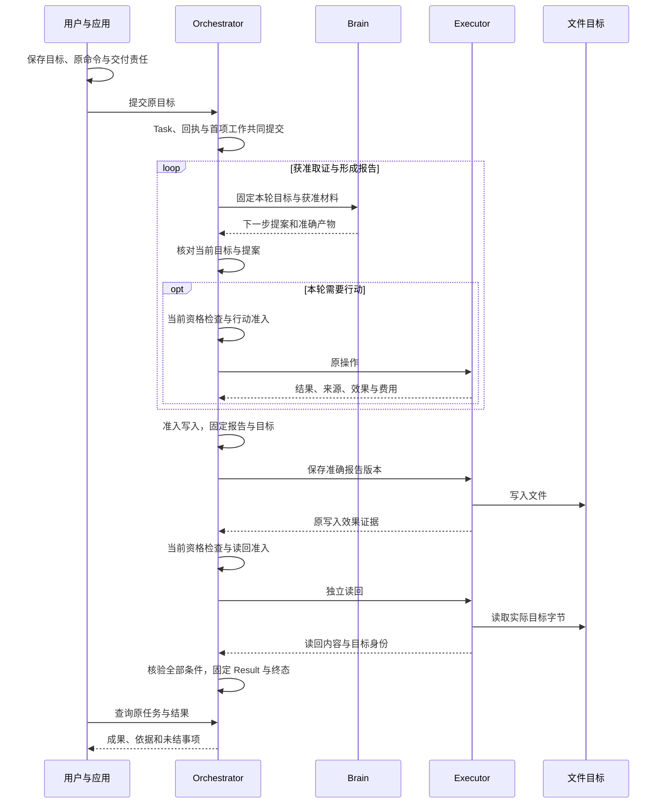

# Harness 技术架构总览

用户要求生成一份报告并保存到指定目录。Harness 接纳目标，取得所需资料，组织下一步判断和工具行动，再核对保存结果。用户可以查看进展、修改目标或中止任务；进程中断后，系统沿已经保存的记录继续处理。

本文面向熟悉接口、数据库事务和后台作业的开发者。先沿这项任务认识各模块和对象，再进入具体字段、调用、提交和恢复算法。当前交付是可指导实现的架构设计及静态契约资产；可运行内核、SDK、数据库故障恢复和生产容量仍须取得各自的运行证据。

## 一份报告怎样成为完成结果

应用先保存用户的准确目标和原提交命令，再交给选定的任务编排器 **Orchestrator**。编排器为目标建立 **Task（任务）**，保存用户要求、当前进展和最终结果。会话 **Session** 只组织消息和任务关联；同一会话可以有多个任务，关闭窗口不会取消任务。

编排器把当前目标与获准材料固定成一轮输入，交给 **Brain（大脑）**，取得下一步提案。一次这样的判断称为 **Decision（决策）**，可以按确定规则完成，也可以使用至多一次物理模型请求。提案形成后，编排器重新检查当前目标、控制、授权和预算，才决定是否采纳。

需要搜索、读取来源或保存报告时，编排器准入一个有界 **Operation（操作）**，交给 **Executor（执行系统）**。执行系统保存接纳和尝试，操作真实工具或目标，再核对实际 **Effect（效果）**。工具接纳、工具答复和目标中发生了什么分别记录，成为下一轮判断的依据。

报告及来源以 **Content（内容）** 的准确版本保存；引用固定负责方、内容身份、版本和摘要。**Grant（授权许可）** 决定谁可以在什么范围、用途、期限和额度内读取、处理或行动。材料已经存在、模型已经建议、插件已经安装，都不能代替本次使用资格。

| 报告任务的一步 | 谁保存决定与责任 | 继续所需的依据 |
| --- | --- | --- |
| 提交目标 | 应用保存消息、完整原命令和待交付责任；Orchestrator 接纳 Task | 原接纳回执及固定任务引用 |
| 明确完成要求 | Orchestrator 保存目标修订与 Requirement（任务条件） | 完整原要求与条件的覆盖关系；缺目录先取得输入 |
| 获取来源 | Brain 提议，Orchestrator 准入，Executor 读取 | 实际正文、来源、时间和截断／缺项说明 |
| 形成报告 | Brain 保存准确输入、提案与生成内容 | 报告版本及适用于它的质量判断 |
| 保存并读回 | 两项各自获准的 Operation 操作实际文件目标 | 原写入效果及独立读取的目标字节 |
| 固定完成结果 | Orchestrator 选择全部必要条件依据，保存 Result 与终态 | 目标覆盖、证据适用性和效果门禁均满足 |

内容质量与外部效果分别判断。报告质量通过不能证明文件已保存；原写参数和写入回执不能代替独立读回。自然语言质量判断可标为 assessed，确定验证为 verified；允许用户验收的质量条件可标为 user_accepted。混合任务按必要条件中最弱的依据说明，未知外部效果不能用用户验收消除。完整报告与手机提醒的组合场景见[贯穿任务](walkthrough.md)，四类固定读写路径见[请求数据流程](request-data-flows.md)。

图表示领域交接，未要求每一步都调用模型，也未把相邻调用合成跨库事务。每个有模型的 Decision 至多一次物理请求；目标覆盖、质量检查、标题或摘要需要额外模型时，分别准入和计费。保存 Content 与写入用户指定文件也是两个不同目标。

## 九个模块各自裁决什么

六组对象组织请求主线；九个模块划分事实的负责方。模块、逻辑服务、进程和本地事务范围是不同视角。多个模块可以同进程装配，一个逻辑服务也可以由多个共享原账本的实例承载；同库不会自动授予彼此任意写权。

| 模块 | 对报告任务承担的责任 | 实现入口 |
| --- | --- | --- |
| Orchestrator | 目标、条件、行动准入、控制、预算归并与最终完成 | [任务编排](orchestrator/README.md) |
| Brain | 固定输入上的下一步提案、可选模型调用与产物 | [决策](brain/README.md) |
| Execution | 原操作的接纳、实际尝试、目标效果和费用核对 | [执行](execution/README.md) |
| Memory | 获准材料、准确内容、来源与跨任务记忆 | [记忆与内容](memory/README.md) |
| Security | 授权、本人确认、使用裁决与结算 | [权限与授权](security/README.md) |
| Interaction | 会话关联、进度呈现和结构化输入转交 | [交互](interaction/README.md) |
| Collaboration | 有界子目标、父子控制和外部 Agent 对应关系 | [协作](collaboration/README.md) |
| Extensions | 固定制品、安装、绑定和当前实例就绪 | [扩展与宿主](extensions/README.md) |
| Evaluation | 检查器资格、诊断、对照评测和发布批准 | [评测与改进](evaluation/README.md) |

每个模块的 README 建立问题与正常处理链，implementation 和专题定义类型、事务、恢复及验收。跨模块关系见[核心数据模型](core-data-model.md)和[UML 图册](uml-models.md)；为什么采取这些边界见[技术原则](technical-overview.md)与[设计决策](decisions.md)。内部子记录可按查询需要拆表，但 Task、Decision、Operation、Grant 各自的成功事实不能压成一个 completed。

## 用户怎样观察和介入

应用通过 task.submit 提交目标，通过 task.read 和 task.result 查看原任务，通过 content.get 读取当前仍允许披露的成果。首次发送前保存完整原命令、选定逻辑服务和消息关联；答复丢失查询或原样重投同一命令。Task 接纳后的会话关联可以补写，不能因此另建任务。

需要澄清时，实际业务负责方创建版本化 InputRequest（输入请求）。任务澄清由原 Orchestrator 保存与一次消费；交互读取请求、呈现准确正文并转交回答。interaction.input 的 applied 表示回答已经排队，真正生效要查原业务决定。可信 Confirmation（本人确认）绑定准确业务意图，由实际业务负责方在事务中消费，普通聊天里的“同意”不能替代它。

暂停停止新决策、评估和行动，原效果与费用继续核对；已经取得全部必要证据的任务仍可成功。取消结束目标推进，迟到事实继续收尾；修订先保存新目标，旧提案不能用于新要求。界面分别展示本地控制决定和执行入口的实际落实，关闭页面、等待超时或重开会话不自动取消、恢复任务。应用接入和每个方法的成功点见[默认应用工作流](application-workflow.md)。

## 中断后，谁沿什么记录继续

假设文件已经写成，执行进程却在保存答复前退出。接替者读取原 Operation 和尝试，查询目标证据；证据不足便保留效果未知。更换进程、工具或 operation_id 不能成为再次写入的依据。只有准确能力合同允许的安全重放才可重试，所有物理尝试继续受原次数、期限和费用上限约束。

每次领域裁决将事实、原回执和后续工作共同提交。**Job（持久工作）** 保存待履行的责任，**Claim（领取）** 给予工作者有限处理权；新责任的工作版本和领取者代次防止旧工作者结束新工作。领域模块决定业务是否完成，共同框架处理接纳、短事务、领取与条件完成。模型、网络、工具和用户等待均在短事务之外。

Brain 已准备而尚无 send_started 时，可检查当前门禁后恢复原首次发送；已有 send_started 而结果未知时，查询原调用，不能透明重发。Executor 准备后若不能证明尚未交接，按可能发送处理。Task 终态之后，未知效果、迟到费用和副本清理仍有原负责方；固定 Result 不被迟到事实重写。

共用算法见[可靠工作框架](reliable-work.md)，任务领域映射见[持久工作与恢复](orchestrator/durable-work.md)，各断点与读写边界见[四类流程](request-data-flows.md)。

## 默认装配与按需能力

普通请求不需要同时启用长期记忆、子 Agent、周期调度、历史分支或改善发布。启用后，这些能力保留独立身份、当前许可与收尾责任。首版会话为线性消息；结构化回答有自己的排队与撤回规则，自由聊天的 steering、多 Lane、完整分支和公共 Schedule 合同尚待定义。具体范围见[核心模型的扩展清单](core-data-model.md#extensions)和[建设目标](goals.md)。

长期 Memory 需要独立保存许可，保留来源、时间、适用范围和纠正关系；检索先限定获准处理集合，派生摘要与向量沿来源关闭和清理规则处理。默认采用可恢复字面基线，中文词法、语义混合召回和经验关联按对照证据启用。研究支持的采用项、候选和历史证明边界集中在[研究依据](research-basis.md)。

组件使用精确版本的安装锁定清单和绑定，当前批准与实例就绪仍须复查。改善发布先取得隔离对照及独立测试证据；回退旧版也须核验它自己的独立批准和兼容性。安装和模型建议都不授予工具或数据权限。

## 从本地开发到生产运行

默认核心、组件和 CLI 采用 Go，浏览器采用 React／TypeScript；端云 WSS、独立服务间 gRPC，同进程直接调用领域接口。单仓库以一个 Go module 起步，正文、Schema、SDK 和验收资产同版维护。开发提供 SQLite 单体与本机 PostgreSQL 多进程装配，先验证同一领域规则；公司平台接入和跨可用区故障证据属于生产上线条件。

生产采用单地域三个可用区，接入网关、应用入口、分类工作池和隔离执行宿主分别部署。PostgreSQL 保存事实与持久工作，对象存储保存版本化字节；数据库扫描发现未结责任，通知加速唤醒。每个 Task 固定逻辑 Orchestrator，服务实例接替不迁移任务。账本单区故障的 RPO=0 和控制／查询 RTO≤60秒是待验收目标，文件根及外部效果有各自的故障域。

功能、质量与规模目标完整保留在[建设目标](goals.md)：1000 个以上语义不同的 API、首次调用正确率≥90%、有限重试后任务成功率≥95%，以及千万注册、百万日活、十万同时在线。它们须冻结任务集、分母、负载与故障环境取得证据，静态契约通过不能替代实际效果、恢复和容量达标。

工程目录、组件适配和建设切片见[工程落地](engineering.md)，逻辑装配与启动恢复见[部署](deployment.md)，记录放置见[存储与中间件](storage-and-middleware.md)，生产故障域、容量与发布见[生产部署](deployment-production.md)。

## 按实现问题继续阅读

| 读者当前要解决的问题 | 下一篇与可查到的内容 |
| --- | --- |
| 理解一项完整任务 | [贯穿任务](walkthrough.md)：来源、报告、文件和设备操作的交接、正常链及中断 |
| 接入应用或 SDK | [应用工作流](application-workflow.md)：准确命令、输入、控制、结果与本端恢复；[Session](interaction/session-and-task.md)：消息和提交关联 |
| 确定对象与写入负责方 | [核心数据模型](core-data-model.md)：身份、关联、生命周期、事务和清理；[UML](uml-models.md)：关系图的多重性 |
| 实现某个模块 | 上述九模块入口 → implementation → 领域验收；字段编码从[方法索引](contracts/methods.md)进入同版 Schema |
| 把模块接在一起 | [共同契约](contracts/README.md)、[请求数据流程](request-data-flows.md)、[可靠工作框架](reliable-work.md) |
| 实现存储和运行维护 | [存储](storage-and-middleware.md) → [工程](engineering.md) → [部署](deployment.md)与[生产部署](deployment-production.md) |
| 核对完成标准与证据 | [验收入口](validation/README.md)、[当前检查结果](review.md)、[设计与验收追踪](coverage.md) |

正式目录是当前规范的维护位置。原 .draft 和研究快照保留用于来源核对；正式模块规则、共同契约与同版机器资产共同约束实现，发现冲突须修订后再发布。
