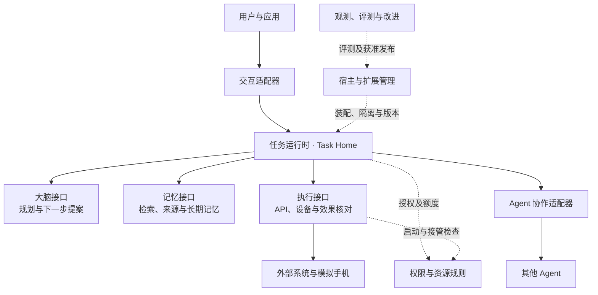

# Harness 技术方案

本方案设计一套面向个人智能应用的开源 Harness：接纳用户目标，组织大脑、记忆和执行能力，在授权与预算内持续推进任务，并保留足以解释结果和中断后继续处理的事实。默认提供本机可运行的实现，同一组契约支持云端托管和端云组合。

本目录是独立的设计基线。需求、术语、规则和验收方法均在目录内定义。技术方案、已冻结范围的机器契约及示例共同约束参考实现；未纳入线格式的能力明确保留为设计接口，不能宣称已经互操作。内核、SDK、默认组件和运行验收仍须实现，具体状态见[交付审查](review.md)。

[技术总览](technical-overview.md) 解释整体设计的抽象原则、建模方法与关键取舍；[可编辑系统全景图](diagrams/system-panorama.drawio) 展示九模块的内部组件、主要事实对象及跨模块交接。全景图采用模块容器与内部框图，详细字段和行为约束按链接进入专题查阅。 [模块与数据 UML 导读](uml-models.md)与[20 页可编辑图册](diagrams/uml-models.drawio)进一步区分接口依赖、领域属性和关联多重性。

## 1. 要解决的核心问题

一个用户可能让 Agent 核实信息、保存文档，再在手机上执行操作。模型可以提出错误步骤，工具可能已经产生效果却丢失答复，端点也可能在执行中失联。Harness 必须把这几件事分开处理：是否接受了目标、是否获准行动、行动发生了什么、结果达到什么质量、失败后由谁继续。

默认方案采用模块化单体，把同宿主的任务状态、待处理工作和授权使用放入短事务；大脑、记忆、执行通过独立接口替换。跨端部署时才增加原命令查询、持久发送与事实回收。这样，本地任务不必经过完整的分布式消息系统，而远端调用仍有明确的恢复责任。

这里的“最优”以已确认目标为约束：先降低完整闭环的实现与维护成本，再凭测量扩展部署。它不意味着同时最小化延迟、最大化离线自由度和提供全局即时撤权。相应代价在下表和各专题中明确给出。

## 2. 系统分工与事实归属

图表示逻辑职责，方框不代表独立进程。实线是任务处理调用，虚线是控制或装配关系；调用返回仍沿原关系传递。



**Task Home（任务负责端）**是保存并裁决一个任务的逻辑端点。它可以是本机进程，也可以是使用同一权威数据库的云服务集群。任务创建后 Home 固定；更换云工作进程不等于迁移 Home。同一用户的不同任务可以属于不同 Home。

| 事实 | 唯一裁决者 | 调用方取得的保证 |
| --- | --- | --- |
| 目标、控制、操作意图、任务预算、完成结果 | Task Home | 状态和下一项持久工作共同提交；重启可继续 |
| 模型请求、提案和调用费用记录 | 大脑适配器 | 提案绑定输入快照；提案不直接执行行动 |
| 实际启动、目标系统效果、设备占用 | Executor 及资源负责方 | 请求到达与实际效果分别记录；未知效果有继续核对的入口 |
| 记忆版本、来源、内容和副本清理 | 记忆或内容负责方 | 引用可定位准确版本；读取、同步和保存分别获准 |
| 许可、撤销、单次消费、离线额度 | 授权负责方 | 许可在指定范围内生效；离线撤销受已约定窗口限制 |
| 输入是否消费、外部子任务是否接纳、版本是否激活 | 对应业务处理方 | 各自有持久回执；界面展示或网络响应不能代替业务决定 |

“负责方”是一项裁决职责，并不要求新增服务。同宿主默认共库，只有替换、信任隔离或独立部署需要时才拆开。字段与接口的权威位置见[契约索引](contracts/README.md#domains)。

## 3. 决定方案形状的选择

| 选择与推荐依据 | 竞争方案及代价 | 改变选择的条件 |
| --- | --- | --- |
| 每任务固定 Home，同用户可有多个 Home；把唯一写者限制在一个任务，而不是整个用户 | 自动跨端接管能提高同一任务可用性，但分区时必须隔离旧写者、核对在途效果并转移权限与预算；当前由失联任务承担等待 | 用户确实需要同一任务离线接管，且原端隔离与效果核对已有可验证实现 |
| 本地共同事务，远端按业务命令持久交接 | 全微服务使默认安装和故障链变长；全内存循环则在接纳后丢失工作。默认由宿主维护少量业务表和 jobs | 独立伸缩、不同信任等级或替换需求已大于远程交接成本 |
| 大脑按快照给出一轮提案，运行时掌握行动循环 | 大脑自管长循环也可逐次申请准入，但会形成两个恢复进度；当前交接开销由多轮 GUI 和模型任务承担 | 测量表明往返主导延迟，且可提供相同控制检查与可恢复检查点的批处理实现 |
| 完成依据分为客观验证、质量评估、用户验收 | 每类目标预装专用工作流会提高接入成本；只让模型自报完成又无法解释效果。应用需展示实际依据 | 特定业务愿意以目标类型受限换取全部可机械验证的结果 |
| Go 核心；端云 WSS，服务间 gRPC；同进程直接调用 | WSS 支持双向交互和主动推送，接入层承担长连接资源与恢复成本；Protobuf 外壳复用严格 JSON，避免两套字段权威但保留编码开销 | 只有测量证明编码或传输成为瓶颈才更换绑定；原命令、业务回执和当前权限规则保持 |
| 共享资源由资源负责方裁决，跨 Home 预算预分配 | 任意端离线消费共享余额会透支或重复消费。用户承担预分配额度暂不可回收、远端撤权延迟 | 明确接受更弱的额度保证，或有可用的共享在线裁决能力 |
| 默认交付审核插件；不可信代码按平台验证隔离后开放 | 直接加载任意代码可减少接入阻力，却无法靠接口检查约束宿主权限；任意原生沙箱又明显增加平台成本 | 某平台的文件、网络、凭证和资源隔离已经通过攻击与故障验证 |

语言、存储与云端分区的具体选择见[部署设计](deployment.md)，每项均说明限制与测量条件。任何选择都不要求把业务事实解释为外部效果的全局“恰好一次”。

会改变用户可见行为与验收含义的选择集中在[设计决策与行为基线](decisions.md)：目标修订、暂停期间完成、完成依据、取消乱序、模型并发保证及统计门禁均有明确边界，不能在替换实现时静默改义。

## 4. 连续阅读路径

| 顺序 | 文档 | 阅读所得 |
| --- | --- | --- |
| 1 | [目标与功能](goals.md) → [技术总览](technical-overview.md)与[系统全景图](diagrams/system-panorama.drawio) → [关键决策](decisions.md) → [贯穿场景](walkthrough.md) | 要建设什么、如何划分职责与事实、选择承担哪些代价、正常与失联路径如何连起来 |
| 2 | [任务运行时](task-runtime/README.md) → [大脑](brain/README.md) → [执行](execution/README.md) | 目标怎样形成行动，谁准入、验证和继续恢复 |
| 3 | [权限与隔离](security/README.md) → [记忆与内容](memory/README.md) | 资料和权限如何跨任务、跨端使用及撤回 |
| 4 | [Agent 协作](collaboration/README.md) → [应用与交互](interaction/README.md) → [共同契约](contracts/README.md) | 子任务与用户输入如何交接，独立实现如何接入 |
| 5 | [扩展与宿主](extensions/README.md) → [观测、评测与改进](evaluation/README.md) → [部署与容量](deployment.md) | 如何装配、运行、更新并扩大服务规模 |
| 6 | [验收与建设顺序](validation/README.md) → [交付审查](review.md) | 哪些实验能证明目标，当前实际检查到了哪一层 |

实现查阅时先看所属模块的接口与字段，再看共同信封、错误和恢复规则。技术方案不要求按文件顺序拆成独立开发服务。

第三方实现另从[线格式与方法注册](contracts/protocol.md)进入，逐方法签名查[方法索引](contracts/methods.md)，跨端装配继续读[端云 WSS、认证与内容传输](contracts/transport.md)和[服务间 gRPC](contracts/grpc.md)。只实现自己声明的方法范围，连同其查询、错误与恢复义务一起验证；字段资产不要求复制参考实现的数据库表。草案发布时必须共同冻结行为正文、Schema、注册表与关联用例。

### 目录与后续细化

九个模块各有独立目录，以 `README.md` 保存模块主线和阅读入口，以 `implementation.md` 展开参考实现的内部职责、持久记录、事务、恢复与故障验证。技术总览集中解释抽象原则与建模方法，原生全景图保存在 `diagrams/`。全局目标、决策、贯穿场景、部署与审查保留在顶层；跨模块的契约资产和验收工具集中维护。

```text
architecture/
├── README.md                 # 系统总览与阅读路径
├── technical-overview.md     # 抽象原则、建模方法与全景图导读
├── uml-models.md             # UML 页索引、关系条件与来源
├── diagrams/
│   ├── design-concepts.png   # 原则、建模与模块关系概念图
│   ├── system-panorama.drawio # 可编辑模块与组件全景图
│   └── uml-models.drawio      # 全局与九模块的 UML 图册
├── goals.md                  # 建设目标与功能范围
├── decisions.md              # 跨模块关键决策
├── walkthrough.md            # 贯穿场景
├── deployment.md             # 部署与容量
├── deployment-production.md  # 生产拓扑、故障边界及性能预算
├── review.md                 # 交付审查记录
├── task-runtime/README.md    # 任务运行时
├── brain/README.md           # 大脑
├── execution/README.md       # 执行
├── memory/README.md          # 记忆与内容
├── security/README.md        # 权限与隔离
├── interaction/README.md     # 应用与交互
├── collaboration/README.md   # Agent 协作
├── extensions/README.md      # 扩展与宿主
├── evaluation/README.md      # 观测、评测与改进
├── contracts/
│   ├── README.md             # 共同调用语义
│   ├── protocol.md           # 线格式与方法登记
│   ├── methods.md            # 全部严格方法签名查阅
│   ├── transport.md          # WSS 帧、认证、恢复及内容字节
│   ├── grpc.md               # 服务间 gRPC 绑定与恢复
│   ├── harness.proto         # Protobuf RPC 外壳
│   ├── schemas/              # 共享机器契约
│   └── examples/             # 完成判断投影与协议序列
└── validation/
    ├── README.md             # 系统验收与建设顺序
    ├── check_documents.py    # 文档静态检查
    ├── validate.py           # 完成判断投影校验
    ├── validate_protocol.py  # 协议序列校验入口
    ├── validate_transport.py # 传输、关闭身份与签名向量
    ├── fault-experiments.md  # 待实现的故障断点与断言
    ├── protocol/             # 协议关联检查实现
    └── requirements.txt      # 校验依赖
```

细化某个模块时，先更新该目录的 `README.md`，保留职责、关键决策和完整处理链。独立机制需要展开时，再在同目录增加按主题命名的文件，并由模块入口给出阅读顺序；专属图示和示例随模块保存。共同字段、方法登记和跨模块用例继续归 `contracts/` 与 `validation/`，模块正文链接其权威定义。

<a id="detailed-design"></a>
## 5. 从主线进入详细实现

先读各模块 README 中的行为与取舍，再沿实现文档的“模块形状与依赖 → 对象流转 → 关键事务时序 → 生产约束”阅读。模块结构图表达软件依赖，流程／时序图表达运行中的对象交接，部署图表达进程及故障域；三种视角分别给出，图中节点不自动对应独立微服务。公共字段继续以同版 Schema 为准。

<a id="design-coverage"></a>

| 模块 | 形状与组件依赖 | 数据对象与流转 | 关键时序 | 生产约束 |
| --- | --- | --- | --- | --- |
| 任务运行时 | [入口与准入](task-runtime/implementation.md#module-shape) | [任务及工作](task-runtime/implementation.md#data-flow) | [提交与恢复](task-runtime/implementation.md#key-sequence) | [调度与热键](task-runtime/implementation.md#production) |
| 大脑 | [决策与适配器](brain/implementation.md#module-shape) | [上下文与提案](brain/implementation.md#data-flow) | [调用与归并](brain/implementation.md#key-sequence) | [并发与费用](brain/implementation.md#production) |
| 执行 | [门禁与驱动](execution/implementation.md#module-shape) | [操作与效果](execution/implementation.md#data-flow) | [发送与核对](execution/implementation.md#key-sequence) | [资源与隔离](execution/implementation.md#production) |
| 权限与隔离 | [身份与许可](security/implementation.md#module-shape) | [许可与使用](security/implementation.md#data-flow) | [裁决与消费](security/implementation.md#key-sequence) | [权威与热点](security/implementation.md#production) |
| 记忆与内容 | [检索与内容](memory/implementation.md#module-shape) | [修订与副本](memory/implementation.md#data-flow) | [发布与读取](memory/implementation.md#key-sequence) | [索引与清理](memory/implementation.md#production) |
| Agent 协作 | [映射与转交](collaboration/implementation.md#module-shape) | [委派与额度](collaboration/implementation.md#data-flow) | [创建与恢复](collaboration/implementation.md#key-sequence) | [跨 Home 等待](collaboration/implementation.md#production) |
| 应用与交互 | [快照与输入](interaction/implementation.md#module-shape) | [请求与消费](interaction/implementation.md#data-flow) | [转交与确认](interaction/implementation.md#key-sequence) | [连接与积压](interaction/implementation.md#production) |
| 扩展与宿主 | [装配与隔离](extensions/implementation.md#module-shape) | [安装与实例](extensions/implementation.md#data-flow) | [激活与就绪](extensions/implementation.md#key-sequence) | [发布与可用性](extensions/implementation.md#production) |
| 观测评测与改进 | [评测与发布](evaluation/implementation.md#module-shape) | [计划与证据](evaluation/implementation.md#data-flow) | [封存与批准](evaluation/implementation.md#key-sequence) | [隔离与容量](evaluation/implementation.md#production) |

跨端部署继续读[传输契约](contracts/transport.md)；默认进程、事务接口、磁盘保护与备份读[部署基线](deployment.md#7-默认宿主的装配与持久接口)，生产拓扑、稳定 Home 路由、单区故障恢复和性能预算读[分布式部署详设](deployment-production.md)。完成实现后按[故障实验](validation/fault-experiments.md)及生产用例取得运行证据，当前文档和静态检查不代表 L2 达成。

## 6. 启用前提与边界

首个参考实现包含本地运行时、默认三系统、CLI／本地 Web 交互、搜索与内容获取适配器、文件能力以及多个有状态模拟手机。云模型、搜索服务和外部 Agent 是可配置依赖；缺失时对应任务等待或明确返回不支持，本地具备模型和能力的任务仍可执行。

跨端需要已配对身份、目标服务的持久幂等记录、有效权限及有限额度；缺少任一条件，不派发新动作。离线权限还需要对应平台的时钟与防回滚保证，缺失时关闭依赖远端缓存的权限使用，不影响全部权威在本机的模式。

运行中跨 Home 迁移、离线共同修改同一权威对象、任意来源原生插件、真实手机支持和跨格式无停机升级不属于参考实现的完成承诺。它们的接入条件在对应专题列出；本轮对 C1–C9、A1–A4 和两个专项的设计覆盖不因此减少。
