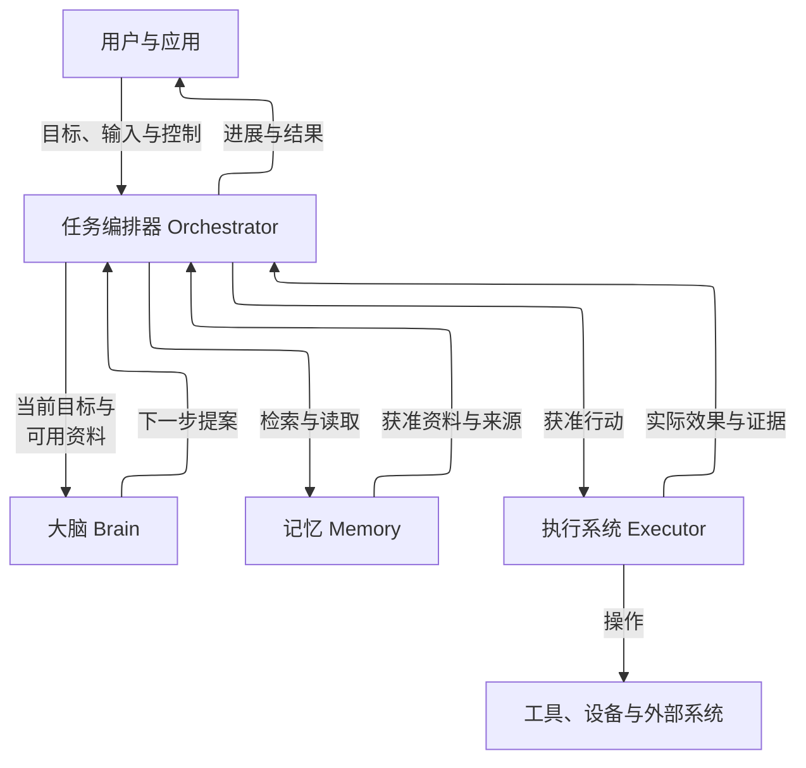
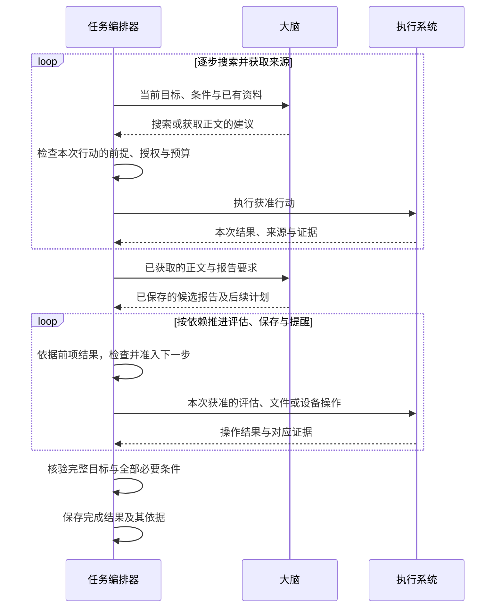
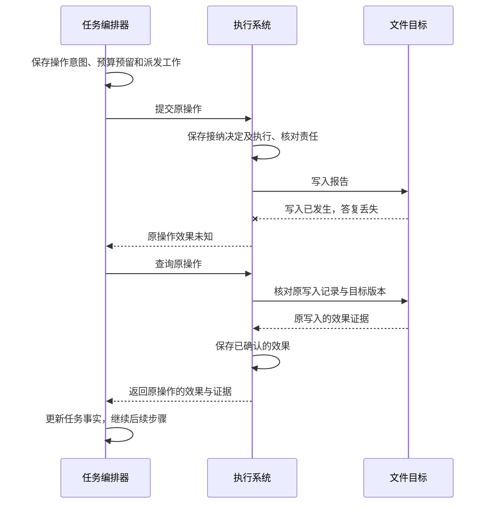
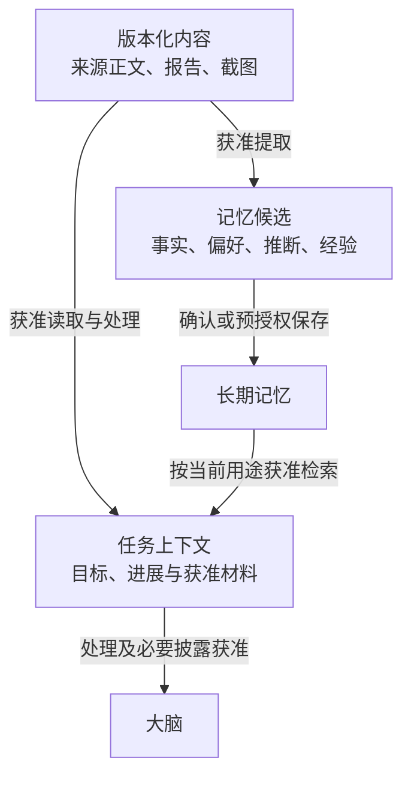
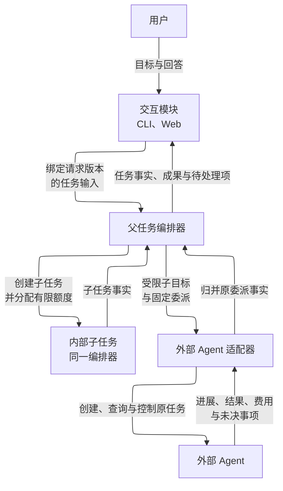
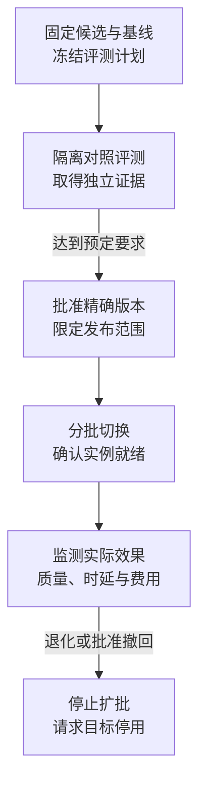
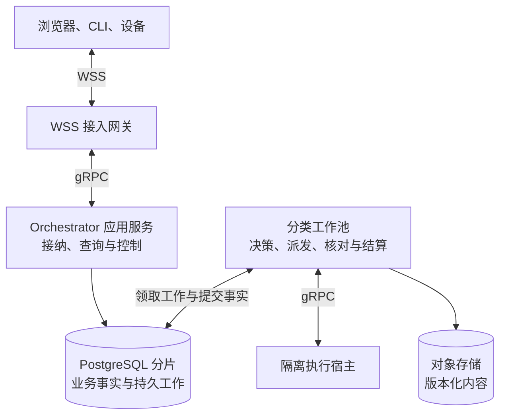

# Harness 技术架构总览

Harness 是面向个人智能应用的开源任务运行框架。它接收用户目标，由大脑提出计划和下一步行动，由记忆提供相关资料，由执行系统操作工具和设备，再由任务编排器组织这些能力持续工作。整套架构围绕一个目标展开：让 Agent 在授权与预算内推进任务，并让用户能够查看进展、判断结果和介入过程。

任务编排器（Orchestrator）负责组织一次任务，保存目标、进展和完成结果。每一轮，它把当前目标与可用资料交给大脑（Brain），检查大脑的建议是否符合目标、授权与预算，再将获准行动交给执行系统（Executor）。记忆系统（Memory）提供相关资料及其来源，执行系统回传行动的实际效果与证据。这些新事实成为下一轮决策的依据，直到满足完成条件，或进入需要用户输入、授权或依赖恢复的等待状态。

图中表示逻辑职责；这些组件可以装配在同一进程，也可以分别部署。

## 从用户目标到任务条件

以“比较 A、B 两个软件版本的差异，附上来源，保存报告，再在模拟手机上创建提醒”为例，编排器先保存原始目标，再记录判断任务完成所需的具体要求，称为**任务条件**。大脑可以帮助梳理这些条件；编排器负责核对它们是否覆盖用户要求，并保留用户明确提出的约束。

| 用户要求 | 判断完成所需的依据 |
| --- | --- |
| 比较准确、覆盖指定范围，并附来源 | 实际获取的来源内容与时间，以及针对这份报告的质量评估 |
| 报告保存到指定目录 | 准确的保存位置、写入结果，以及与报告内容匹配的读回证据 |
| 提醒内容正确且已创建 | 获准使用的目标设备、准确内容与时间，以及动作前后的观察和目标记录 |

内容质量与外部效果分别判断，每项必要条件都要满足。保存目录不明确时，先取得用户输入；创建提醒尚未获准时，先取得相应授权。这些等待及其原因也进入任务记录，供条件补齐后继续推进。

## 在决策与行动之间推进任务

条件明确后，大脑根据当前资料提出下一步，编排器检查并安排执行，再把取得的新事实交给大脑。对于依赖关系已经明确的后续步骤，大脑可以提出计划，由编排器在前项结果到达后逐步安排；每一步仍须检查当前目标、授权与预算。

报告正文按准确版本保存，质量评估、文件写入和读回都引用或核对同一份内容。评估未通过时，需要补充来源或修改报告，再取得相应依据；新版本不能沿用旧版本的通过结论。手机上的观察和每一次动作也分别推进，依据实际界面变化决定后续操作。

## 中断后，沿原操作继续核对

一次经编排器准入的有界行动称为**操作（Operation）**，例如写入一份文件或执行一次设备动作。每项操作都有固定标识，关联准确输入、目标和后续核对责任。编排器决定派发时，将操作意图、预算预留和后续工作一起持久保存；执行系统接纳后，也保存自己的执行与核对责任。进程重启后，接替者从这些记录继续处理原操作。

假设报告已经写入，但文件系统的答复丢失，执行系统此时无法确认写入效果。恢复首先查询原操作及其目标证据，保留原来的操作身份。下图展示能够取得可靠证据的一条恢复路径：

证据不足时，系统保留“效果未知”，并记录继续核对所需的条件。可以安全重放的请求仍按原操作恢复；更换操作标识、工具或执行端，不能绕过尚未核清的效果。自动核对有次数和期限上限，耗尽后保留原记录及待处理原因，交由后续恢复或用户介入。

## 用户控制怎样影响正在运行的任务

用户暂停、取消或修改目标时，编排器先保存该决定，再向相关执行端传播控制变化。界面分别展示编排器的决定和各执行端的确认情况；已经发出的动作仍可能完成，失联端的停止情况需要等待核实。

| 用户控制 | 编排器如何处理新工作 | 原操作如何收尾 |
| --- | --- | --- |
| 暂停 | 停止发起新的决策、评估和行动，等待恢复 | 继续核对效果与费用；若此前取得的证据已经满足全部完成要求，仍可记录成功 |
| 取消 | 终结目标推进，关闭新工作 | 继续核对效果与费用，迟到结果不改变任务的取消状态 |
| 修订目标 | 保存新目标，使尚未启动的旧目标工作失效 | 保留已有操作；与新目标冲突的在途效果须先核对，再安排后续行动 |

例如，用户在报告写入答复丢失后取消任务，编排器停止推进创建提醒，并沿原操作核对报告是否已保存。随后确认写入成功，只会更新原效果及相关费用，任务仍保持取消状态。核对本身也遵守当前授权；权限或依赖不足时，系统保存等待原因。

## 完成结果说明依据与局限

编排器提交成功结果前，先检查任务条件是否覆盖原始目标，再核对必要条件、成果版本和仍未核清的效果。结果记录采用了哪一种完成依据，并保留对应证据与已知限制。

| 完成依据 | 含义 |
| --- | --- |
| 客观验证（`verified`） | 每项必要条件都有适用的确定性验证，且对应当前目标与准确成果版本 |
| 质量评估（`assessed`） | 必要的外部效果已经证实，开放质量由固定规则与评估实现判断通过；结果说明评估方法及其局限 |
| 用户验收（`user_accepted`） | 必要的外部效果已经证实，用户正式接受准确版本的成果及可见限制，以此满足允许由用户验收的质量条件 |

混合条件按必要条件中最弱的依据标记：包含用户验收时采用 `user_accepted`，否则包含质量评估时采用 `assessed`，其余才采用 `verified`。在贯穿场景中，即使文件与提醒都有确定的效果证据，报告质量仍依赖评估，因此整体结果标为 `assessed`。

用户验收可以解决允许由其判断的质量问题，尚未确认的写入或提醒效果仍须核清。必要条件未满足时，系统可以交付部分材料，并说明剩余缺口；任务继续等待或以失败、取消结束。

## 资料按用途进入上下文和长期记忆

**任务上下文**是编排器为当前决策选取的目标、进展、证据和相关材料；**长期记忆**是取得独立保存许可、可以跨任务检索的事实、偏好、推断或经验。来源正文、报告和截图作为可按准确版本引用的内容，供任务和记忆使用。从资料中提取长期记忆时，先形成候选，再由用户确认，或在有限预授权范围内保存。

权限与隔离模块保存授权及其使用、撤销记录，将许可限定到具体资源、用途、接收方、期限和额度。读取、模型处理、长期保存、跨端同步和对外披露分别检查授权，实际使用入口落实这些限制。用户可以允许资料在本机参与当前任务，同时限制长期保存和远端使用。

资料的摘要、推断和其他派生内容继续保留来源限制，每次使用都要核对当前权限。用户可以纠正、限制或删除记忆；系统分别展示删除决定和各副本实际清理的进度。

## 用户与其他 Agent 怎样参与任务

交互模块通过 CLI、Web 等入口呈现任务进展、成果和待处理项，并转交用户输入。回答绑定原请求及其版本，由相应业务负责方确认生效；涉及成果验收时，还要绑定准确的成果版本。断线后，界面读取当前状态并查询原输入的处理结果。界面也可以独立承载记忆管理，关闭页面不会取消任务。

协作模块把一个有界子目标交给其他 Agent，同时限定可用资料、权限、预算和期限。内部子任务默认与父任务共用编排器；外部 Agent 保有自己的运行时，通过适配器建立原委派与远端任务的固定对应关系。另一编排器管理的 Agent 也按外部委派处理。

例如，研究 Agent 可以负责核实两个版本的 API 差异，父任务继续负责整份报告与提醒目标。子结果交回后，父任务仍按自己的条件核验，并检查子任务是否已结束目标行动、相关效果是否已经核清。外部创建答复丢失时，适配器沿原委派查询同一个任务，保留额度和核对责任。

## 组件替换与版本演进

大脑、记忆和执行系统通过共同契约独立替换。契约明确输入输出、权限要求、成功含义和失败后的查询恢复方式，使更换组件后，任务的控制与完成规则保持一致。

插件（Plugin）携带组件代码或适配器，Skill 提供操作知识和流程。扩展与宿主模块负责安装、装配和版本切换，用不可变的**安装锁定清单（InstallLock）**固定实现、依赖和配置；任务引用这份清单，使用确定的版本。默认装配内置或经审核的代码，安装本身不授予用户数据和设备权限。

观测、评测与改进模块记录获准的诊断信息，比较质量、时延与费用。兼容发布由契约符合性证据支撑；宣称能力改善的发布，还要固定候选、基线和评测规则，在隔离环境中比较，并用未参与候选选择的独立测试集确认。下面展示改善发布的路径：

发布批准、实例实际就绪和旧版恢复分别确认。回退时，须核验旧版的独立批准仍然有效、当前数据格式兼容，再确认旧版实例已经就绪；条件不足时保持停用并报告恢复缺口。已有外部效果、未结费用及其核对责任继续保留。

## 逻辑职责怎样映射到端云部署

每个任务都固定归属一个逻辑编排器。同一用户的不同任务可以属于不同编排器；一个编排器可以由多个共享原账本的服务实例承载，工作进程重启或被替换不会改变任务归属。模块划分表达职责，部署划分则考虑连接规模、任务负载、隔离和共同提交的范围。

生产基线为单地域三个可用区，连接接入、Orchestrator 应用、分类工作池和隔离执行宿主分别部署。默认核心采用 Go；端云通过 WSS 双向通信，独立服务之间使用 gRPC，同一进程内直接调用接口。

PostgreSQL 保存业务事实和需要继续履行的工作，对象存储保存正文、截图等内容字节。工作池从原账本领取工作，数据库扫描负责重新发现尚未完成的责任，通知用于加速唤醒。需要共同决定的业务状态与后续工作仍在同一本地事务中提交，跨数据库交接则分别保存原命令、回执和恢复责任。

开发使用单体及本机 PostgreSQL 多进程装配，验证同一套领域规则。大脑、记忆和执行组件可以分别部署在本机或云端；依赖与授权权威齐备的全本地任务可以离线运行。云端编排器失联时，端侧只能在有效许可范围内完成已接纳的有限操作，另一端不会自动接管同一任务。

## 当前设计与后续阅读

本文描述的是目标架构。可运行内核、默认组件和 SDK 仍待实现，故障恢复、授权隔离、组件互操作以及质量、时延、费用和容量都需要运行验收。联网问答和多个有状态模拟手机分别设有专项验收；真实手机支持需要另行取得对应平台的验证证据。

| 想继续了解 | 阅读入口 |
| --- | --- |
| 建设范围与验证进度 | [建设目标](.draft/goals.md)、[交付审查](.draft/review.md) |
| 一次任务的完整流转 | [贯穿场景](.draft/walkthrough.md)、[任务编排器](.draft/orchestrator/README.md) |
| 模块职责与关键取舍 | [详细方案索引](.draft/README.md)、[设计决策](.draft/decisions.md) |
| 组件接入与替换 | [共同契约](.draft/contracts/README.md)、[扩展与宿主](.draft/extensions/README.md) |
| 实现与生产运行 | [工程方案](.draft/engineering.md)、[生产部署](.draft/deployment-production.md) |
