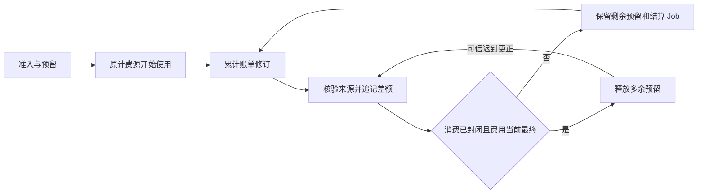
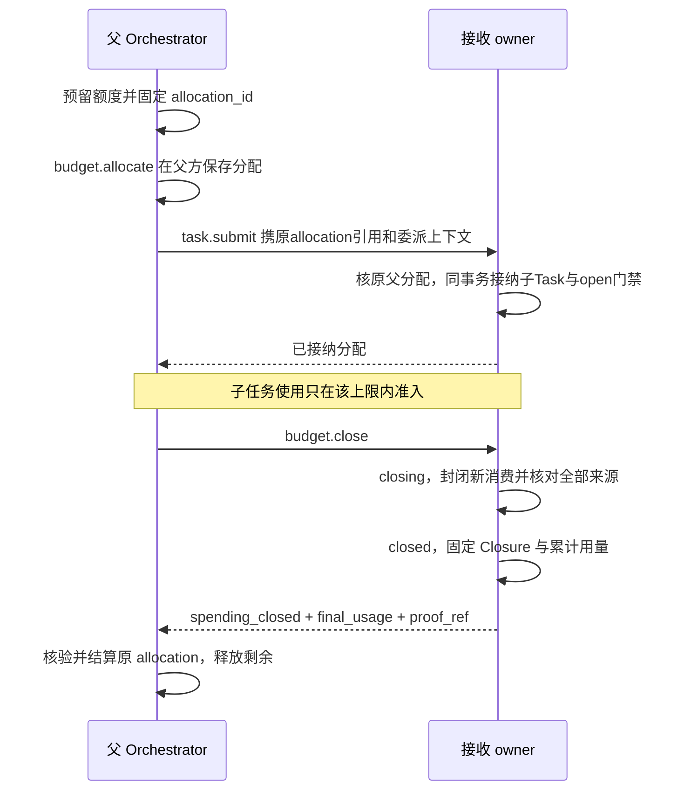

# 预算预留与真实费用结算

预算控制未来承诺，账本记录已经发生的真实费用。取消、超时和任务终态都不能证明费用为零。一个物理计费来源只入账一次，跨层汇总不再次扣费。

默认采用 strict 模式：只准入有可信单次费用上界的能力。estimate 仅在本人接受非硬上限、Task 与相关 Grant owner 同事务可核验接受事实时启用；跨 owner 分配和离线使用保持 strict。

## 1 三种额度不能混为一项

| 记录 | 控制什么 | 何时释放 |
| --- | --- | --- |
| Grant 的 once/use | 某个主体是否可以进行这次使用 | once 消费不能因退款、零费用或取消恢复 |
| Task 的 reserved/spent | 未来费用承诺与累计真实费用 | 有证据封闭新增费用且取得当前最终累计账单后释放剩余预留 |
| Executor/提供方资源槽 | 实际并发、设备占用或环境资源 | 本地实际退出或远端可核验关闭，不能只凭 goroutine cancel |

金额使用准确单位和十进制定点表示，不能以 float 累加。不同币种、token、次数和时间分别计量，无固定兑换依据不相互抵扣。

BudgetBalance 为每 Task/单位保存 limit、reserved、spent。准入检查 `spent + reserved + new_reservation <= limit`。这只是未来承诺门禁，不能做成拒绝真实更正账单的永久 SQL CHECK；供应商违约或估算超额时 spent 可以超过 limit，系统必须如实记账并停止受影响的新计费。

## 2 预留与来源绑定

每项 Reservation 固定 task_id、reservation_id、unit、original_reserved，以及唯一计费源 `(source_owner,source_kind,source_id)`。Decision、Operation、Grant use 和 allocation 可以提供相关证据，但只能选择一份实际来源作为 Task 计费权威。

首次发送前固定可信上界及计费来源。远端身份尚未确定时，先保存未绑定预留和交接责任；取得可核验原对象后唯一绑定。绑定冲突不猜来源结清。

设原预留为10，累计账单从0到6：spent 增6，尚未最终核清时剩余预留保持4。重复6不再扣费。最终账单8时 spent 再增2并释放剩余2。若之后可信更正为9，只补1，不重新扣9、不重开 once、不倒回已释放额度。

每次归并原费用修订、累计差额、余额、事故与 Job 在同事务提交。同修订异摘要冲突；旧修订不能倒退累计额。退款/贷记新增独立BillingAdjustment：adjustment_id、original_billing_source_ref、provider_adjustment_key、kind=refund/credit、unit、正amount、evidence_refs、verified_by/at、pending/applied/rejected。只接受原计费owner的认证提交并核供应商凭据，(source,provider_adjustment_key)唯一，同键异内容拒绝。退款累计不得超过可核实原charge，其他补贴另分类。应用时调整、净成本投影与交回outbox共同提交，父方按原键去重。spent保持gross_spent单调，credit_total单调，net_cost=gross_spent-credit_total；准入仍用gross_spent+reserved，默认不自动返可花预算，也不恢复once或allocation。pending不改账。

## 3 strict 与 estimate 的真实边界

strict 的上界须覆盖全部物理请求、输出 token、必要分页、取消费用和已知供应商计价规则，并由适配合同与可执行限制支撑。一个平均价或预测值不是可信上界。缺上界的能力在 strict 下拒绝新计费，而非填零。

estimate 需要[策略接受合同](../security/README.md#policy-acceptance)：准确策略摘要、适用任务/能力、每次预留方法、任务预算、单位、期限和非硬上限说明。每次新计费重新查当前接受记录。只授权自动任务不等于接受未知超额。

实际超额区分：estimate 偏差、provider_bound_breach、receiver_allocation_breach。可以同时发生。未查清原因记录 incident_pending，不能把真实费用截到预算以内。用户调高 limit 是新命令，不改变历史许可、账单或首次预算。

## 4 父子预算跨域交接

父方先在本地事务占用 reserved，并创建固定 Allocation：allocation_id、receiver_id、父 Task、严格单位上限、期限、原命令和发送 Job。接收方核验认证sender、原父当前分配、receiver/单位/范围/期限，以(tenant_id,parent_owner,allocation_id)唯一建立IncomingAllocation，与至多一个子Task及首Job同本地事务绑定；不能因父方失联再接受一份同义额度。

budget.close 只关闭消费门禁，停止目标行动还需要原任务控制。关闭早于创建到达时，接收方保留关闭记录，迟到创建不能重新 open。TTL、Task 终态、失联或 cancel ACK 都不能替代 Closure。

Closure 固定 allocation/receiver、spending_closed、closed_at、usage_revision、全部单位累计 final_usage 和可核验证据。父方主动核原源事实，不信通知金额。若接收方无法查清一笔费用，保持 closing。父方保留该额度，不能重新分配到另一分片。

closed 后原账单可以上调，receiver 增 usage_revision、保留原关闭时刻，并同事务重开交回 outbox。父方对 settled allocation 追记差额；既有 Task 和消费门禁均不重开。接收方合规单次调用合计超 allocation 是接收准入缺陷，不能都归咎供应商。

## 5 迟到账单必须主动找回父方

计费 owner 取得可信新累计事实时，将原账单修订和 correction outbox 同事务保存。`task.billing_reconcile` 只唤醒原来源的结算 Job，回执 applied 表示责任已耐久登记，不表示账已结清。

Orchestrator 核对认证 sender、原 source→Task 绑定、usage_revision 和摘要，再主动读原账单。通知丢失由 outbox 重投和父方有界核对恢复。唤醒 command 期限耗尽可用新传输身份继续同一业务修订，旧未知尝试保留；不能换 source_id 形成第二笔费用。

已 done 的结算 Job 可以因新可信费用重新 ready；work_revision 保护它不被旧 worker 的 done 覆盖。Task 终态不影响这条路径。

## 6 总配额与分片扩容

不同 Task 的总额不能各自复制。首版由受信配置为每用户/租户、供应商和维度分配保守的固定 owner 份额，所有份额之和不超过总量。进程副本共享原库计数，不因增副本获得新额度。

转移份额先在旧 owner 降低可准入上限并证明已释放，再增加新 owner。未知调用、未结预留和旧计量窗口均计入；旧 owner 失联不能把其份额重复分配。代价是有空闲仍可能排队，后续只有测得闲置成为主要成本才增加独立配额协议。

模型和工具的实际账单、调度并发、请求速率及设备占用分别限制。请求超时仍占未知费用；无远端关闭查询时不能宣称硬限制供应商真实在途并发。

## 7 对账与验收

必须同时观察原计费源、Grant use、Task reservation 和父 allocation，验证每个物理账单只流入一次。关键断点包括：use 已消费但调用未发、模型已发后取消、子创建答复丢失、关闭先于分配、封账后更正、来源失联以及同修订异金额。

测试通过的条件不是“余额从未超限”，而是：合规准入不超约定承诺；真实费用不丢失不重复；未知预留不提前释放；违约被定位并停止新的风险；费用清零不复活一次授权。跨域账本须实际注入丢答复和恢复，静态等式不足以证明。
