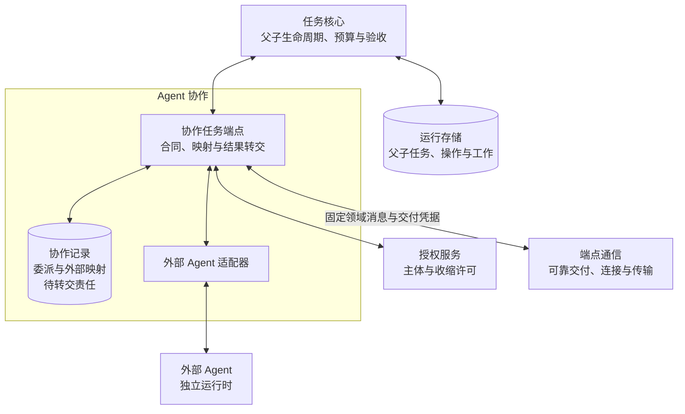
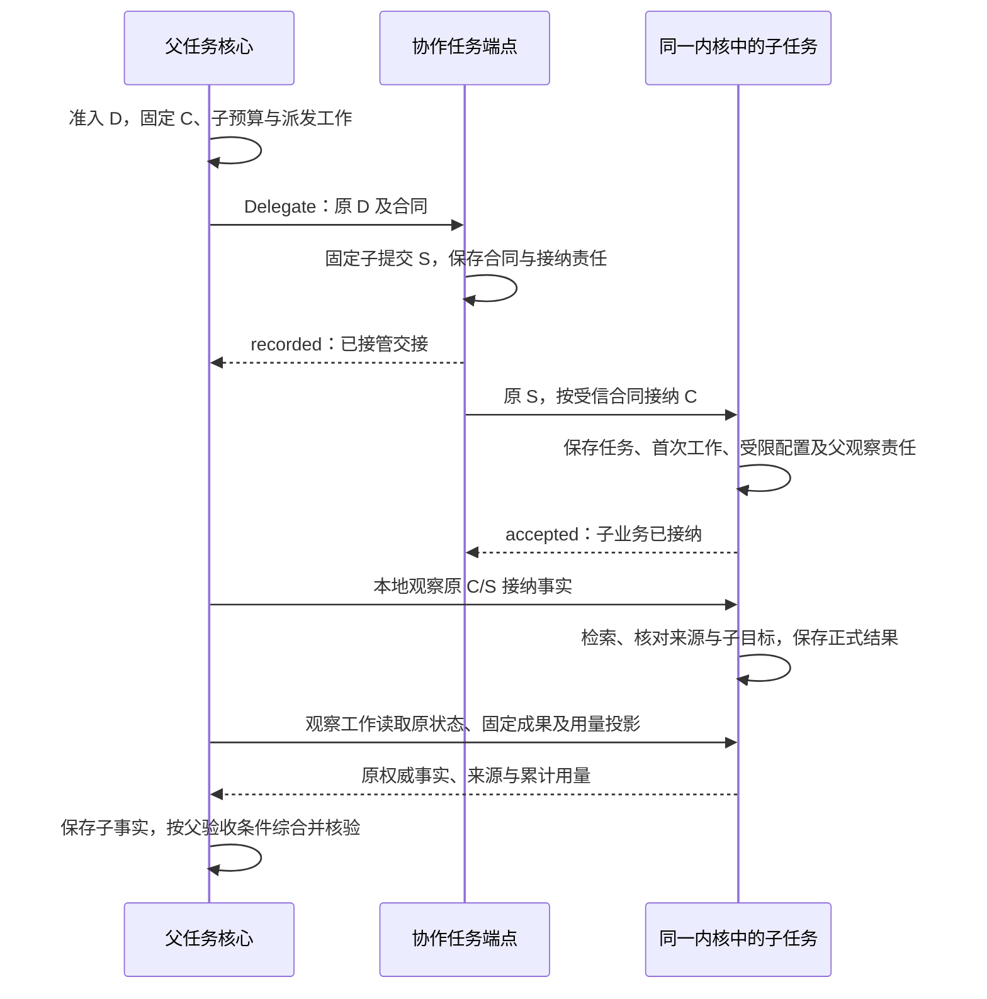

# Agent 协作详细设计

Agent 协作将任务内核已经准入的委派交给指定 Agent，并在断线、重复交接和进程重启后继续收集结果、传播控制、核对用量。协作任务端点保存委派合同、父子或外部任务关联及后续责任；任务推进、权限和实际效果仍由各自领域裁决。通用消息账本、连接、路由与流恢复由[端点通信](../endpoint-communication/README.md)提供。

本方案展开[系统全景图](../diagrams/system-panorama.drawio)的 `coordination` 分组，仅包含 `peer-task` 协作任务端点。`task-core ↔ peer-task` 继续表示委派／结果交接，`peer-task ↔ connection` 继续表示按需跨端交接；`connection` 归属 `communication` 分组。分组调整不改变两条双向支撑交接的端点、语义或部署方式。Agent 声明、协作记录与有限工作者属于协作端点内部实现；运行中任务权威迁移及跨主机接替后置。

首次阅读沿本页主线，再读[委派与任务恢复](delegation.md)；接口、字段及 CO-P1 线映射查[协作契约](peer-contracts.md)，验收和采用范围查[验证设计](validation.md)。第三方实现从[协作规范入口](peer-contracts.md#normative)连续查阅领域规则，再结合[端点通信规范](../endpoint-communication/README.md)的公共交付与编码；通用消息账本实现另见[交付设计](../endpoint-communication/delivery-and-recovery.md)。CO-P1 已采用为设计，运行实现仍待交付。

## 1. 首期闭环与依赖

采用**每用户固定任务写权威、内部／外部 Agent 受控委派、WSS 领域交接和有限恢复**。同一用户的父子任务仍由同一任务写权威保存，各任务有独立目标、状态和预算份额。它们可以选择不同的 Agent 配置和获准执行端点，不能因选择了另一个 Agent 就另建任务权威。

| 范围 | 本次设计及依赖缺席时的行为 |
| --- | --- |
| 默认委派 | 核心固定父委派操作、子任务身份和预算 → 本地或远程协作端点接管 → 同一用户内核权威接纳子任务 → 父直接观察本权威事实、成果与累计用量 → 独立核验；没有受信 Agent 声明、收缩许可或预算保证时不提供可派发候选 |
| 通信依赖 | 发送委派消息前保存原身份及发送责任，取得 Delivery.Accept 持久接管依据后才结束本方发送工作；入站决定与后续责任提交后才确认业务处理。消息账本、流、路由及交付恢复由端点通信承担；未取得接管依据则保留原工作 |
| 外部 Agent | 保留其独立运行时；本地适配器须具备原委派接纳核对、取消、结果来源及有限消费保证。本方以父委派 D 关联原生任务，不另建 Harness 代理子任务；原生任务不取得本方 task_id 的写权威，缺项则禁用委派 |
| 跨端委派 | CO-P1 的 Delegate、受信子接纳、查询、控制、输入和事实采用版本化 WSS 消息；须装配身份、目录及恢复适配器后启用，不能用普通 task.submit 代替完整合同 |
| 授权与控制 | 复用身份模块的主体绑定、Delegate、BeginUse 及恢复依据；许可引用不能认证 Agent。所需权威不可达或来源关系不明时保持等待／拒绝，不能从节点在线推断可用 |
| 离线 | 部署默认关闭，验收后显式配置有限窗口。有效离线许可、可信时间、唯一账本、本地任务权威或已接纳的委派工作、预算和依赖全部齐备才继续；依赖失联权威的新决定等待 |
| 固定任务权威 | 父子任务始终回到同一用户写权威；不可达时等待，不能因远端在线、流已恢复或父失联另建权威。迁移仍属后置 CO-P2 |
| 领域恢复 | Peer.CheckRecovery 裁决原 D 的接纳、控制、结果与用量是否允许继续；授权、执行等依赖由所属领域提供，端点通信汇集本轮结论。所需依据不全时只限制依赖它的行为 |

依赖表示启用前必须具备的实现和证据，不能以文档已有接口认定实现可用。本次形成模块设计；没有 Agent、网关、持久账本或故障注入运行实现，成熟度与验证边界见[交付检查](validation.md#checks)。

本模块直接承担[项目目标](../../harness-project-goals.md) C5 的任务委派、委派恢复与有限离线边界，C6 的内部／外部 Agent 互操作，C7 的权限收缩及用户中断，C8 的跨端责任追踪。C1 由候选与子成果支持，大脑仍负责选择；C2／C3／C4 的记忆、证据和执行通过对应领域交接，不改变事实强度；C9 只允许使用已获准版本，不自行发布 Agent 改进。A1–A4 均适用。V1 验证子检索证据可被父任务准确采用，V2 验证设备操作未知、取消和迟到结果，不用连接恢复代替专项效果验收。

## 2. 分工与事实归属

**委派**是父任务以固定操作交付一份子目标、约束、权限和预算，并保留收集与控制责任。**协作任务端点**是接受这份合同并提供恢复接口的领域组件；它可以是同进程对象，也可由获准远端承载。**Agent** 是绑定策略及运行配置的行动主体，与通信端点、任务和进程分别标识。

下图是协作端点及其依赖的逻辑交接视角，分组表示本模块范围，实线表示调用及返回，圆柱表示事实保存位置；内部子任务与父任务共用任务写权威，父观察在 Core／Run 内完成，Peer 的结果转交用于实际跨边界责任；框不表示独立进程。

| 事实 | 保存／裁决方 | 本模块可以确认什么 |
| --- | --- | --- |
| 父子目标、任务状态、验收、预算、控制 | 任务核心及运行存储；父子分别裁决 | 子任务接纳或结果事实已取得；不能自行完成父任务 |
| 委派固定合同、子提交映射、外部原任务映射、转交责任 | 协作任务端点的持久记录 | 已接管委派交接、原委派当前进展、哪些证据缺失 |
| 消息身份、流与游标、发送／接收责任 | 连接适配器的消息账本 | 指定阶段已持久保存；不代替业务接纳 |
| 主体、端点及活动所有者、许可与撤销 | 身份与授权 | 复用适用证明；不自行签发或扩大权限 |
| 外部调用执行与效果 | 执行协调器或经过验证的外部 Agent 原记录 | 带来源转交已知事实；未知继续保留，不能用“Agent 成功”覆盖 |

| 发起方 → 处理方 | 输入 → 输出及成功含义 | 持久责任与失败后的继续者 |
| --- | --- | --- |
| 大脑／核心 → 协作端点 | 受限筛选条件 → Agent 候选及准确声明 | 安装配置提供固定版本；核心派发前复核，缓存失效不换 Agent |
| 核心工作者 → 协作端点 | 已准入的原委派合同 → 交接记录／拒绝／未知 | 父核心先存预留和原工作；协作端点保存合同与后续接纳工作后才确认接管 |
| 协作端点 → 子任务核心 | 固定子提交及受信合同配置 → 业务接纳／拒绝 | 子核心原子保存任务、首次工作及受限配置；端点沿原子提交查询，不把接管当成接纳 |
| 同权威子记录／协作端点 → 父核心 Observe | 原委派下的内部子任务／外部原任务事实、结果和累计用量 → 已保存／重复／冲突 | 内部默认保存本地观察工作并读取原 C/S；跨边界端点保存转交工作，父核心保存事实及后继责任后才结束交接 |
| 父核心 → 协作端点 → 子核心／外部 Agent | 固定取消操作及目标委派 → 控制决定、停止或未明效果 | 每层保存原控制关联及核对责任；超时不释放未知预算 |
| 协作发送工作 → Delivery.Accept | 固定委派消息 → 消息发送责任已接管／拒绝／未知 | 协作端点保留发送工作直到取得持久凭据；交付凭据不替代子接纳或父事实保存 |
| 消息交付 → 协作端点 | 原委派消息及受信上下文 → 可恢复的协作处理决定 | 协作端点保存决定、原操作映射及后续责任后才确认；重复交接返回原决定 |

以上是对现有[内核委派要求](../task-kernel/decision-and-work.md)和[可靠交接](../endpoint-communication/message-contract.md#handoff)的模块内展开。外部协议映射只能落实可证明的保证；其原生任务 ID 不直接成为 Harness 的任务 ID。

## 3. 关键选择

| 推荐 | 依据、主要代价与适用边界 | 替代与改变条件 |
| --- | --- | --- |
| 内部父子共用固定内核权威，外部保留原生任务 | 内部复用任务、验收、预算和取消；外部只交回委派事实，不复制其生命周期或取得 Harness 写权威 | CO-P1 远程内部 Agent 仍回同一权威接纳；跨权威迁移另属后置 CO-P2，不是跨端委派的前提 |
| Agent 声明作为已安装配置，不另建分布式注册中心 | 已知用户、Agent 版本及端点足以完成首期发现；在线声明只能验证可达性 | 大规模动态编排有真实需求时扩展发现提供方，仍不赋予声明授权效力 |
| 委派交接与子业务接纳分开 | 无须跨协作与运行存储做全局事务，代价是多一份固定关联和查询工作 | 同库存储可优化往返，但不能省略调用方可观察的接管／接纳边界 |
| 同权威内部事实直接观察 | 子接纳事务登记父观察责任，结果及用量从本权威原记录取得，避免经远端查询再回传 | 保留独立配置接管及原 CO-P1；外部 Agent 继续由适配器转交；具体替代比较见[内部观察](delegation.md#internal-observation) |
| 累计用量按委派结算，未知余额继续预留 | 丢消息、重复报告不双计，父子并行不超卖；可能长时间占用额度 | 可信消费已封闭且结算最终确定后才提前释放，不能靠任务终态或超时估计 |
| 协作记录复用宿主事务存储，跨端调用现行通信接口 | 协作只保存合同、领域事实及未交接责任，通用交付由通信账本恢复；避免在 Agent 适配器内重建消息账本 | 实测协作存储或调度成为瓶颈后替换内部实现，仍须通过相同委派与恢复用例 |
| 超时只改变等待和核对，不自动换节点重做 | 原节点可能已行动，自动故障转移会产生重复效果 | 只有原执行已结束／隔离且安全重试条件成立，由任务核心准入新的明确尝试 |

## 4. 贯穿场景：委派检索并生成比较结论

用户要求“联网比较方案甲与乙，引用实际取得的一手资料”。父任务 P 将“取得两个方案的资料并保留来源与获取时间”委派给已安装的检索 Agent；子任务 C 使用获准检索能力。父委派 D 与子提交 S 是不同操作，D、C、S 和预算关联固定后不随重试改变。下面展示内部 Agent 路径，省略逐次鉴权和连接回执；同宿主验证后，须按下节及领域契约验证端／云两种固定权威的跨端部署。

子任务的“完成”只证明子策略下的目标成立。父任务仍须检查两方案覆盖、来源支撑、时效、成果可读及用途；消息已收到或报告中写了“成功”都不足以完成父任务。用量可以晚于结果到达，父预算继续保留未知部分。

同一路径最重要的异常是：子核心已经接纳 C，答复丢失；父用户随后取消 P。协作端点按 S 查询原接纳并持续转交取消，不创建第二子任务。父核心沿同事务保存的观察责任核对 C；即使远端 Peer 暂不可达，也可保存本权威已有的获准结果和用量，P 保持取消终态。若换成有副作用的设备子任务，外部效果还可能未知，不能由取消回执抹去。完整顺序与“取消先到”的处理见[取消与恢复](delegation.md#cancel)。

## 5. 必须保持的保证

| 编号 | 保证 | 权威定义 |
| --- | --- | --- |
| CO1 | 原委派固定目标、Agent、父子及提交关联；相同标识不能改换意图 | [协作契约](peer-contracts.md#delegation) |
| CO2 | 接管、子接纳、结果及父完成分别有依据；任一确认丢失均可恢复原责任 | [委派处理链](delegation.md#acceptance) |
| CO3 | 委派只收缩权限和预算，结果不提升证据强度，累计用量不双计 | [结果与预算](delegation.md#results) |
| CO4 | 取消、超时及未知效果保留后续责任；迟到结果不重开父任务 | [取消与恢复](delegation.md#cancel) |
| CO5 | 委派沿固定消息与作用域交接，持久接管前保留本方发送责任；流 ready 不替代协作领域裁决 | [协作线合同](peer-contracts.md#wire)；消息确认与清理由[端点通信](../endpoint-communication/message-contract.md#handoff)保证 |
| CO6 | 远端协作不取得任务写权威；控制、工作领取与端点资格分别核验，离线委派工作须具备全部依据 | [部署边界](delegation.md#placement) |
| CO7 | 用户、数据用途及资源消耗隔离，有限恢复耗尽后仍可解释未决责任 | [验收与运行边界](validation.md) |
