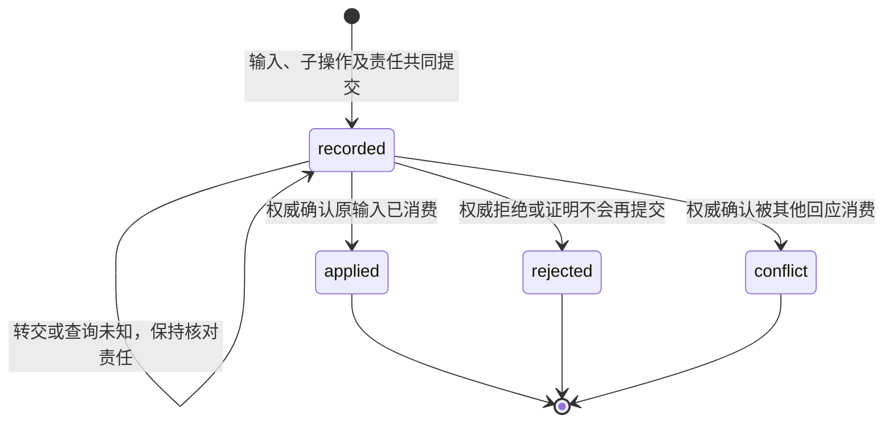
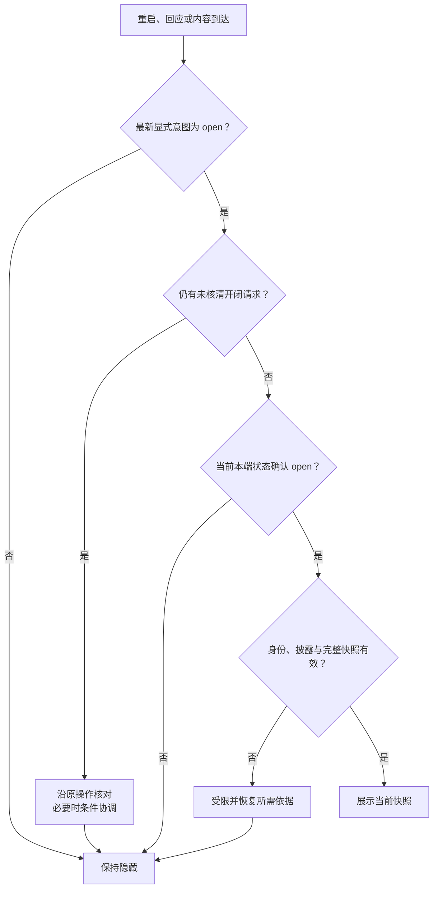

# 输入、呈现与恢复

[总览](README.md) · [接口与存储](contracts-and-storage.md) · [验证与交付](validation.md)

## 1. 从任务提交到正式成果

应用宿主在发送前固定任务 ID、提交操作 ID、目标、附件引用及原期限，写入本端日志。附件必须已通过受控内容通道保存并取得可验证引用；缺少必要上传能力时不提交引用空壳。发送前检查身份、当前许可与容量，传递由宿主构造的 RequestContext，用户载荷不能替换主体或路由。

核心 `Submit` 的 accepted 是任务接纳依据。收到 `core.ack` 只记录消息已被保管；请求超时、断网或提交未知时显示“提交结果待核对”，沿原提交操作调用 ReadOperation，并按需 ReadTask。查询到 submit applied 表示任务已创建，不等于任务完成。查询无记录、超窗或权威不可达时不自动换 ID；用户可以明确创建另一任务，但入口须先说明原任务可能仍存在、不能替代原操作核对。

宿主以 `(user, task_id, 默认视图用途)` 唯一映射到 surface，创建映射和首次刷新责任一起保存。它可以在提交前预建仅含“等待提交”的本地占位，但只有核心事实到达后才能发布任务状态。崩溃后从已保存提交索引补建缺少的 surface，不要求 Submit 返回 surface_id。任务事件沿原提交关联由宿主接收；未知来源或未绑定任务的通知不自动建立可访问任务。

本端提交索引用于恢复原操作；跨设备任务列表由固定任务权威的 task.list 提供，surface 由 UI 权威的 ui.list_surfaces 取得。新设备按获准分页目录建立绑定，再读取当前快照，不枚举猜测 ID。目录或授权提供方缺席时仅恢复已知且获准对象并显示不完整。普通 ui.get 仍不隐含创建、订阅或打开界面。

结果区分别呈现以下信息，不能把后一次查询的修订拼成新的原结果：

| 信息 | 来源与展示条件 |
| --- | --- |
| 当前主状态和 effects_pending | ReadTask；展示读取时点，失联保留“尚未核对”的提示 |
| 固定正式结果 | ReadResult 或可靠 task.result；保留原结果修订、摘要及成果引用 |
| 成果内容 | 获准读取并校验后的字节；权限拒绝、缺失、摘要不符、提供端离线分别显示缺口 |
| 取消或输入操作结果 | 原控制操作的回执／事件／查询；不由当前任务状态倒推某次操作答复 |

正式结果不可恢复时沿 `task.result_unavailable` 呈现；原摘要可以作为已获准的摘要查看，但不能标成已恢复全部成果。联网问答保留核心提供的引用、来源时间及证据不足信息；界面不补写未取得的来源或把生成中的文字标成最终答案。

## 2. 内容、输入和动作的完整投影

任务投影适配器是管理器内部的确定性转换器。它从核心读当前任务及有效输入；终态另读固定正式结果。内核通知只触发刷新，活跃任务和待输入任务仍按有限间隔查询。只有终态且没有未决效果、输入或取消核对责任时才停止常规轮询；未决项保留独立的有限查询工作，到预算限后显示缺口。显式打开、原操作结果或重连也触发复核，不依赖通知一定抵达。

ReadTask 提供当前摘要和输入，ReadResult 提供固定终态成果；执行中截图／产物由核心 QueryProjection／task.query_projection 提供固定版本、content、完整来源／用途与输入依赖。管理器只能按[预览合同](contracts-and-storage.md#preview)呈现，不能读取执行存储自行拼装事实。

input_request.required_preview_ids 结构化列出必需预览，空集表示权威保证可凭完整请求作答。管理器核对同一请求的固定投影绑定、当前来源资格和宿主已获准取得内容的记录后才发布／转交提交；任何必需项不可用先禁用控件并显示缺口。用户确认是否真正理解内容不是可由网络回执证明的事实。

每份 surface 固定一个来源权威和用途。一次投影记录来源版本及内容绑定，输出完整 view、完整 input_requests、动作绑定和 final。UI 内容 revision 独立递增，不能直接复制 task.revision；同来源修订同内容重复刷新不递增。当前状态与原结果分开绑定，防止“最新任务状态＋旧成果”被误认为同一版本原结果。已知的输入消费／失效事实也进入本地投影校验，落后的轮询答复不能复活请求。

投影提交按以下顺序校验：身份与来源归属、当前披露依据、来源版本不回退、视图类型及结构、输入／动作关联、容量，最后条件提交。相同来源修订出现不同内容时记录矛盾并回查权威，不采用最后到达者。读取期间来源变化允许产生标明时点的投影；输入消费仍由权威做最终复核，快照不承诺跨模块原子一致性。

| 投影规则 | 实现要求 |
| --- | --- |
| 输入完整性 | 每个 form／submit_input 必须引用快照内的有效 input_request_id，字段／必填／范围与权威请求一致；输入集缺失或截断时不发布可提交表单，先补读 |
| 输入含义变化 | 由输入权威新建 input_request_id；不能由 UI 修改原请求用途、期限或约束。进度文字变化保留原请求 |
| 动作绑定 | view 内 block_id、surface 内 action_id 及每请求字段名分别唯一；action_id 在其生命周期内不复用为另一含义。管理器保存动作种类、精确目标和可见版本。旧动作失效即拒绝，刷新后由用户重新选择 |
| 追加文字 | 先更新管理器可恢复的内容基线，再发 ui.delta；只追加已有 text／markdown 块。临时消息可以丢失，ui.get 始终能恢复当前完整内容 |
| 交互及最终结果 | 表单、动作、输入有效性和最终呈现变化使用可靠 snapshot；delta 不改变这些语义 |
| 独立交互 | 本地注册适配器提供完整输入和持久消费查询；没有业务权威时只能发布展示页，不能用 UI 自己的 recorded 代替业务消费 |

渲染端接收内容时先验身份、surface、类型和结构，再按修订处理。低于缓存的快照忽略；相同修订相同内容视作重复，相同修订异内容停止套用并报告矛盾。delta 仅在 base_revision 等于本地当前修订且新修订更高时应用；已有新快照覆盖的旧 delta 可丢弃，其他缺基准情况合并成一个 ui.get 恢复请求。uint64 按整数比较，不能用字符串字典序或浮点数排序。

每个 surface 同时最多一个快照拉取，更新触发可合并但有等待上限。读取失败不反复高速刷新。自定义视图按[扩展规则](../endpoint-cloud-protocol/extensions.md#views)使用提供方生成的 fallback；没有兼容模型就报告不支持，必要输入不能降成文字后宣称交互可用。

## 3. 输入转交、竞争和结果丢失

渲染端的 submit_input 按钮只触发表单校验及 ui.input，不再发送 ui.action。用户提交时冻结字段值、input_request_id、seen_revision、父 operation_id 和原期限，先写本端日志；重复点击复用同一待处理操作。草稿修改仍是本地行为，发送后不能改写该操作的值。

管理器先验证真实用户／源端点、surface 访问及原回执披露权，再查原操作。同键同意图返回原决定；同键异意图拒绝。只有新操作继续验证行动权限、期限、输入请求和字段约束。seen_revision 用于检查当时的交互来源，不能机械要求等于最新内容修订；原请求仍有效、语义未变的回应可继续。无法证明旧交互关联时要求刷新，不能猜测用户确认了新内容。

接纳事务一次保存父操作、固定子 operation_id、原输入请求与值、目标权威、accepted 答复和转交工作。这样避免“已接纳却未生成子操作”的恢复歧义；这是现有父子映射契约的实现选择。事务未知不回复 accepted 或明确拒绝，先按原键核对。

转交工作先确认自身领取、当前身份／许可和业务前提，再保存可能已转交标记及固定请求，调用权威。任务输入使用 ApplyInput／task.input，同步 completed 才证明 consumed。收到回执后，管理器把父操作终局及最终事件发送责任共同保存；确认消息交付接管后才完成发送工作。若消费已成功，后续权限变化不把它改成失败；只限制现在允许披露的内容。

渲染端按父操作关联答复、最终事件及查询结果；原 accepted 可以晚于 applied 到达，更新接纳记录时不能回退已知终局。快照移除表单只说明当前不可提交，不能推断本端操作是否成功；本端结果仍沿原操作核对。相互矛盾的终局保留诊断并回查权威，不按到达顺序覆盖。

图只描述一个已接纳 UI 输入操作的处理状态；转交工作租约、界面开闭和业务请求有效性不属于该状态机。查询状态复用协议枚举，核对困难通过记录中的缺口表达。

| 异常位置 | 管理器与调用方的继续行为 |
| --- | --- |
| 接纳前拒绝／存储失败 | 不承担已接纳责任；本端保留未确认日志，修复条件后先核对原操作，不凭超时认定未接纳 |
| 接纳后、转交前崩溃 | 扫描原工作，沿固定子操作继续。只有证明尚未进入可能转交阶段且请求已失效时，才可本地结束为 rejected |
| 核心消费后 O2 答复丢失 | 查原 task.query_operation；input applied 足以证明该输入已消费。保持父子关联，不因请求当前已移除而把 O1 拒绝 |
| 转交后输入期限已过 | 期限只阻止新的业务消费，不能证明过去未消费。先查原子操作；明确原拒绝才收束，未知继续 recorded 并标核对缺口 |
| 两端用不同操作回应 Q | 核心对 Q 原子消费；一项 applied，另一项按权威拒绝原因映射 conflict。不能由 UI 按到达顺序自选全局赢家 |
| 用户关闭／退出页面 | 已接纳输入继续转交与核对；未发送草稿按获准策略保留或清理。页面销毁不能删除后台责任 |
| 错误原因只有普通 precondition_failed | 不凭文案推断为竞争；映射 rejected 并显示可披露原因，只有明确消费冲突依据才映射 conflict |
| 查询依据过期或丢失 | 本端显示“原回应结果无法核对”，停止自动消耗，保留原键与处置入口；不能新增 unknown 线状态或提交替身 |

独立业务适配器须提供等价的 ApplyInput 与 ReadOperation 语义，或在本地事务内同时保存消费和回执；仅有“收到事件”回调不足以启用有副作用交互。撤回已接纳输入不是普通 UI 能力，关闭窗口不能作为撤回。暂停／恢复、调整预算和补充核验材料沿任务管理合同；用户要改变整体目标时显式创建新任务，是否取消旧任务另作选择。

## 4. 本端开闭和多窗口协调

界面管理器维护 `(user, source_endpoint, surface)` 的 presentation，初始 closed／0；源端点取自受信上下文。本端宿主为同一端点的所有窗口提供唯一意图队列，窗口不得各自假扮独立写者。意图序号只在本端持久日志中单调递增，不增加线字段。

关闭时先保存最新选择及同步责任，立即隐藏；保存失败也隐藏，并报告无法保证该选择已耐久保存，重启默认隐藏直到完成恢复。打开时先保存意图，再发带 expected_revision 的 ui.set_presentation。只有最新意图仍为 open、对应条件更新已确认、所需恢复依据成立且快照可用，才展示内容。缺少本端日志或 endpoint 身份改变时，不继承旧端点的打开状态。

图表示渲染端针对一个 surface 的展示门禁，各条件分别检查；通过早期条件不免除后续检查。

每个 surface 同时最多一个已发出但未核清的开闭操作；后续选择只更新最新意图，关闭仍立即隐藏。旧操作答复用于完成原记录，不能覆盖最新意图。上一操作终结后，如果权威状态与最新选择不同，读取最新 presentation 并新建条件操作；它实现新的或尚未落实的显式选择，不能刷新旧操作身份和期限。

条件冲突先 ui.get 再判断是否仍需提交；按有限尝试和总时长限制协调，到限保持隐藏并提供“核对开闭状态／重新打开”入口。ui.query_operation 只能恢复处理状态，不含原 presentation 完整答复；窗口内重交取原答复，超窗取得操作应用依据后还须 ui.get 读当前呈现状态。若原操作是否仍可能生效无法核清，不绕过它发新 open。

snapshot、delta、输入结果、task.result 和连接恢复只更新获准缓存。关闭期间通知默认只给不含敏感正文的计数或摘要，按通知许可显示；点击通知是新的显式打开意图。任务完成不自动关闭，final=true 也不能越过本端关闭。

## 5. 取消、接管和受信管理

cancel_task 动作由管理器从已保存动作绑定解析精确 task_id，不能接受客户端指定任意接口或新目标。管理器保存 UI 父操作与任务取消子操作，收到核心 Cancel accepted 后仍为 recorded；只有原取消子操作控制处理完成的依据到达，才把 UI action 标为 applied。这里 applied 表示该取消控制请求已处理，取消结果仍可能是 effects_unknown；界面同时展示对应取消答复及当前 effects_pending，不显示“全部已停止”。取消完整答复通过 task.query_cancel 按原子操作恢复，不依赖消息窗口；答复已按策略清理或当前无披露资格时保留相应缺口，不从任务当前状态重建原答复。

长任务的宿主控制栏可直接调用核心 Cancel，复用同一原操作日志和核对机制。普通 ui.action 属于协议既定 lane，不因按钮标题变成 control；因此取消入口不依赖大内容渲染完成，控制栏提交 task.cancel 使用现有 control 通道与保留容量。表单回应只走 ui.input，不能借 submit_input 动作生成另一份任务输入。

以下控件由受信宿主创建，与任务生成内容在视觉和调用权限上分离。用户看见权威对象、操作范围和持久结果；内部回执标识在诊断详情中提供，不要求用户理解协议字段。

| 入口及提供方 | 绑定及允许动作 | 成功边界与未知后的入口 |
| --- | --- | --- |
| 授权服务 | CreateConfirmation 固定显示摘要、对象、动作、用途、期限、单次／持续范围；真实用户确认调用 ConfirmAndIssue，用户拒绝或确认请求已过期时不新签发 | 调用超时可能已签发，按原确认／命令查 ReadConfirmation／ReadCommand；若需撤回沿 Revoke。许可已签发与行动可开始分开，当前使用仍由处理端复核 |
| 许可管理 | ReadAuthorityState 查看本人许可；Revoke 撤销；扩大／改变用途新建确认 | 展示权威撤销提交及传播情况，不表示离线端立即停止；失联显示未提交或核对中 |
| 记忆服务 | Search／Read 分页查看来源、类型和范围；Mutate 纠正、限制用途或删除，绑定 expected_revision 与原 command_id | 未知查 ReadCommand；冲突展示新版本后由用户重定意图；ReadCleanup 分别显示逻辑禁用与载体清理，不能声称全链已擦除 |
| 本地设备入口 | 用户接管调用 Execution.ApplyControl；立即封闭自动入口，再记录控制与传播责任 | 界面收到持久回执才显示已持久应用；存储失败仍封闭入口。云断线不阻止本地接管 |
| 执行处置 | InspectPending、RequestReconcile、SubmitEvidence、StopReconciliation、ReopenAutomation | 沿[本地处置契约](../capability-and-execution/validation.md#management)；补证仅是候选，不能手填成功；重新开放须新的明确命令、权限与设备复核 |

上述管理调用沿[授权](../identity-and-authorization/contracts.md#interfaces)、[记忆](../memory-system/contracts.md#interfaces)和[执行](../capability-and-execution/catalog-and-contracts.md#interfaces)已有内部接口。宿主日志只增加调用和恢复关联，不定义新的签发、效果或删除语义。跨端管理使用[所属领域的明确消息](contracts-and-storage.md#management-wire)；相应提供方缺席时关闭该远程入口，不能用任意 JSON RPC 或普通 task.input 搭桥。

接管与任务取消是独立动作，接管屏障不能因重连、普通输入或任务状态改变而解除。重开自动化也不复活已取消或过期任务。应用不直连大脑以绕过核心；成功任务的自动提取须匹配用户按任务类型 opt-in 的[应用策略](../memory-system/contracts.md#automation)，以独立任务及用户额度运行；其他提取由用户显式发起。

## 6. 披露、隔离与安全渲染

每次读取快照、查询旧操作、取得内容和管理操作都建立当前受信上下文。随机 surface_id、task_id 或 operation_id 不是访问凭证；无权查询时不泄露是否存在。发送端复核实际接收端、用途和来源绑定，接收端在展示或重新使用前落实本地可验证限制。投影转换保留来源约束，不能通过摘要、截图缓存、复制或导出绕过原限制。

默认交互显示要求适用于该有限披露的 continuous 许可或相应受信本人管理依据；不把 once 许可扩成可反复刷新的页面。受限内容只有在来源可固定、暂存获准及原有限使用窗口成立的专用适配器下才使用 once；没有该适配器不提供相应预览。实际披露沿 BeginUse，Evaluate 只作预检。授权输入、凭据和票据不进入普通聊天／Markdown 日志。

默认 document 渲染器只实现协议安全展示子集：文字、Markdown 的段落／列表／代码／表格和经策略允许的显式链接，拒绝原始 HTML、脚本、内联事件、iframe、自动远程图片加载及自定义执行代码。Markdown 链接点击交受信宿主校验目标方案并处理，不能自动跳转到应用管理调用；内容块仅从受控提供端按引用读取，校验媒体类型、字节上限及摘要后交受限解码器。表单只输出声明字段，未知字段、选项及不合法值不发送。

退出账号先使该用户展示和后台新发送失效，再清除按策略不能保留的缓存、草稿及凭据；已接纳输入由原用户受限后台责任处理，不转交给新登录用户。旧异步响应须匹配用户、端点及本端会话代次，否则不得进入新会话缓存。端点身份未变时开闭意图可按原账本恢复，单纯重建窗口不得丢弃它。

撤权或来源失效被获知后，立即遮蔽相关缓存、移除交互并停止新披露，登记获准清理责任；重新授权不自动重开界面。没有当前披露依据时不把已落盘快照当离线许可。已展示、导出或被外部程序取得的内容不能由 UI 回执证明已撤回；UI 快照、缓存与草稿按[全框架持有者合同](../content-and-provenance.md#holders)登记／关闭／清理，外部已披露部分单列不可撤回边界。

## 7. 重启、断线及有限恢复

恢复顺序如下。每步产出可查询的已知事实与缺口，业务恢复门禁由消息交付汇集；本模块不把自己的快照可读解释为所有领域就绪。

1. 验证持续账本、当前端点活动所有者及旧实例隔离；新进程先隐藏所有尚未核对的界面。旧备份不构成原责任未发生的证据。
2. 读取本端最新开闭选择和未决提交，核对界面事务未知；没有存储可写性时不接纳新输入，关闭／接管仍按本地规则限制展示或动作。
3. 取得当前身份、许可、来源和相关任务／输入依据；缺少哪项就阻止依赖它的新提交和显示，查询与最小状态提示另查权限。
4. 核对原任务提交、UI 父子操作和管理命令，再恢复原发送／转交工作；可能已转交的输入只先查原子操作，不因当前过期就断言失败。
5. 同步本端开闭选择，拉取完整快照；满足打开条件后展示。已就绪 surface 可独立恢复，不能用另一个 surface 的证明放行。

工作重试采用持久尝试次数、下次时间、最大间隔、总期限／成本及每轮批量。到限停止主动重试，保留缺口和一次获准通知，继续接收合法迟到事实；用户“重新核对”只触发受预算限制的查询，不新建原业务操作。输入请求期限、发送保留期、业务回执保留期和本端意图保留分别处理，重启不延期。

原操作处理状态可通过 ui.query_operation／task.query_operation 恢复；没有结果的查询不能假造业务 unknown 枚举。诊断页提供“核对原操作”“查看当前任务”“查看缺失依赖”，以及已具备的领域管理动作。它不提供“强制标记完成”“清空去重”“把旧回应套到新请求”等操作。
