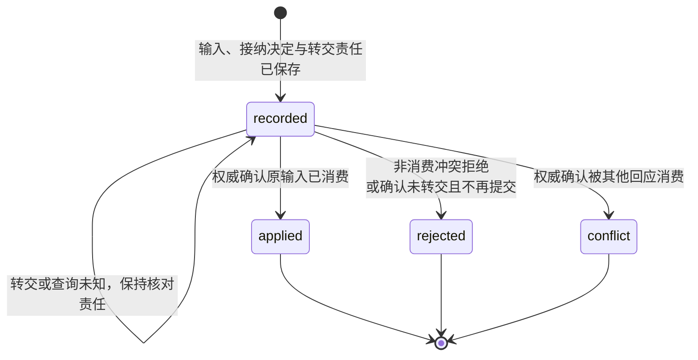
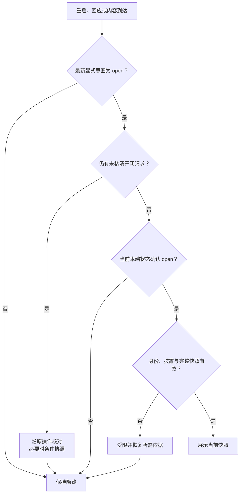

# UI 交互规范

[应用总览](README.md) · [协议映射](../endpoint-communication/task-and-ui.md) · [默认实现](interaction-and-recovery.md) · [运行验收](validation.md)

## 1. 适用范围与规范依据

本页是 UI 提供方、渲染端和输入转交方共同遵守的行为规范，也是[端点通信协议](../endpoint-communication/protocol.md)的规范性组成部分。它集中定义输入转交、内容恢复、每端呈现、目录和预览交接；消息、字段、类型版本及错误编码仍以通信目录的 [UI Schema](../endpoint-communication/schemas/ui.schema.json)、[交互 Schema](../endpoint-communication/schemas/interaction.schema.json)、[公共线格式](../endpoint-communication/wire-format.md)和[注册表](../endpoint-communication/schemas/standard-registry.json)为准。协议一致性同时要求行为与编码成立。

交互端点须支持 `ui.get@1`、`ui.snapshot@1` 和 `ui.set_presentation@1`，并具备当前身份、许可及[领域恢复依据](../endpoint-communication/recovery-and-control.md#resume)；缺少必要能力时不启用依赖它的交互。无 task_id 的独立 UI 遵守相同规则，可提交输入还须有能耐久消费并核对原操作的业务权威。

本页不要求实现采用 SQLite、指定表结构、同进程调用或某种工作扫描方式。[默认实现](interaction-and-recovery.md)及[存储设计](contracts-and-storage.md)给出受信宿主的具体组装。任务状态、输入消费和正式结果由[任务核心](../task-kernel/lifecycle.md)定义，执行效果由[执行模块](../capability-and-execution/execution-and-recovery.md#states)定义，UI 只保留与它们交接所需的事实和呈现。

## 2. 事实、标识与修订

**Surface** 是由 surface_id 标识的一份可恢复界面内容，可以关联任务或独立存在，不等于窗口或聊天会话。**UI 管理器**保存该 surface 的权威内容和转交决定；**呈现状态**表示某个源端点是否打开它。首期每个 surface 使用固定 UI 权威，不允许两个互不相知的账本同时修改。

| 事实 | 保存和裁决方 | 对其他事实的约束 |
| --- | --- | --- |
| 内容修订、完整视图和输入投影 | UI 管理器 | 更新不消费输入，也不改变开闭 |
| 已确认的每端呈现状态 | UI 管理器，按用户、源端点、surface 分别保存 | 一端关闭不关闭其他端 |
| 最新显式开闭意图及未核清原操作 | 本端受信宿主 | 迟到答复不得覆盖较新的选择 |
| UI 接纳决定、父子关联及待转交责任 | UI 管理器 | 接纳不等于业务消费或任务完成 |
| 输入请求及消费事实 | 提出请求的业务权威 | UI 不修改请求含义、期限或约束，不自行裁决争答赢家 |

surface_id、input_request_id、operation_id、task_id 分别标识界面、输入请求、操作和任务，不能混用或作为访问凭证。同一用户的 UI operation_id 在固定 UI 权威内跨 surface／种类唯一；同键异意图拒绝，同键同意图恢复原决定。内容 revision、呈现 revision、任务／投影修订与交付序号各自独立。线 uint64 按整数比较，禁止浮点截断、字典序比较或修订环绕。

## 3. 输入转交与原操作恢复

输入请求由业务权威固定。用户提交时冻结 input_request_id、字段值、seen_revision、父 operation_id 和原期限；重复点击或重投同一意图复用原操作，不能改写原值。submit_input 控件只生成 ui.input，不再生成 ui.action。ui.action 从已保存的 action_id 解析声明式意图，客户端不能指定任意目标接口。

UI 先验证真实用户／源端点、surface 访问及原回执的当前披露资格，再核对原操作。原决定存在时按原规范意图去重；只有新操作继续检查行动权限、期限、输入请求、字段约束及适用的[预览凭据](#preview)。seen_revision 用于核对用户当时看到的交互：仅进度文字更新时不要求等于最新内容修订；无法证明原交互关联时要求刷新。输入含义变化必须新建 input_request_id；动作含义变化时拒绝旧动作，不能把旧 seen_revision 的选择解释为对新动作的确认。

UI 必须保存输入、接纳决定和待转交责任后才返回 accepted，首次转交前必须持久确定唯一的 UI 父操作 O1 与业务子操作 O2 关联。规范允许先接纳、后固定 O2，前提是恢复仍能唯一确定关联且在此前绝不转交；默认实现把关联与接纳共同提交，详见[接纳事务](contracts-and-storage.md#transactions)。两处业务提交不要求跨模块事务。

任务输入按[任务消费合同](../task-kernel/lifecycle.md#wait)处理；task.input 同步 completed 或原操作查询的 input applied 才证明已消费，不增加业务 accepted 阶段。UI 据子操作的持久决定保存父操作终局及可靠答复责任，再返回 ui.input_result。UI 接纳答复与最终结果均可靠交付；accepted 可能晚于 applied 到达，不能回退已知终局。后来权限变化不将已确认消费改成失败，只限制当前允许披露的内容。

下图只建模一项已接纳 UI 输入操作，不包含工作租约、界面开闭或请求有效期。核对缺口另行保存，不新增 unknown 线状态。

| 中断或竞争 | UI 与调用方必须继续的行为 |
| --- | --- |
| 接纳答复丢失或提交未知 | 按原父操作核对，不能从超时推断未接纳 |
| 已接纳、尚未固定子操作即崩溃 | 从原输入和待转交责任恢复，持久确定唯一关联后首次转交；已有映射则复用 |
| 已转交、消费回执丢失 | 查询或恢复同一子操作，不能换子 ID；表单已从快照移除不构成原回应失败 |
| 已转交后请求到期 | 到期不否定过去消费；查询未知时保持 recorded 及缺口，明确原拒绝才能据此收束 |
| 确认尚未可能转交，请求已失效 | UI 可保存不会再提交的依据并结束为 rejected |
| 多端以不同操作回应同一请求 | 业务权威原子消费；一项生效，其他按权威消费冲突依据映射 conflict，UI 不按到达顺序决定赢家 |
| 拒绝仅为普通 precondition_failed | 映射 rejected 并显示可披露原因；不能凭文案猜测为消费竞争 |
| 关闭／退出界面或重开 | 已接纳责任继续，既不撤回回应，也不复制输入、延长期限或绑定另一请求 |
| 原查询依据过期、丢失或结果矛盾 | 保留原身份和可查询缺口，有界核对；不创建替身操作或按最后到达覆盖终局 |

独立业务适配器须提供等价的耐久消费与 ReadOperation，或原子保存消费和回执；仅有“收到事件”回调不足以开放交互。UI applied 只证明该回应已被业务采用，不证明授权签发、用户已阅读或任务完成。许可签发依[受信确认合同](../identity-and-authorization/cross-endpoint.md#confirmation)，不能用普通“同意”文本替代。

## 4. 完整内容与交互恢复

ui.get 和 ui.snapshot 在同一内容修订下给出完整 view 与 input_requests，包括用途、期限和约束。渲染端无需重放 ui.input_requested 历史或另查任务才能恢复当前交互。每个 form／submit_input 必须关联快照内有效请求，字段、必填项和范围与权威请求一致；缺失或截断输入集时不发布可提交表单。view 内 block_id、surface 内 action_id、每请求字段名分别唯一。

内容修订从 1 起单调推进；同修订同内容是重复，同修订异内容须停止套用并回查权威，旧快照不能覆盖新内容。UI 获知请求消费、失效或到期后，移除对应输入与交互并推进修订；渲染端到期停止提交，业务权威消费时仍复核。快照不承诺跨模块瞬时一致，重新打开不复活旧请求，原输入结果仍按原操作核对。

临时 ui.delta 只向既有 text／markdown 块追加文字。ui.get 必须能恢复完整内容，增量不能成为唯一的恢复依据；接收端仅在 base_revision 等于本地当前修订且新修订更高时应用。已被新快照覆盖的旧 delta 可忽略，其他缺基准情况停止套用并以 ui.get 恢复。表单、动作、输入有效性及最终呈现变化均使用可靠 snapshot，delta 不能改变这些语义。

视图采用 `{type, version, data}`，首版为 harness.ui.document@1；[线视图元素](../endpoint-communication/task-and-ui.md#view-reference)定义编码种类，布局、配色和原生控件由渲染器决定。自定义视图按[扩展协商](../endpoint-communication/extensions.md#views)使用提供方的显式 fallback；无兼容模型则报告不支持，必要输入不能降成文字后声称可交互。

## 5. 每端开闭与恢复

每个 `(user, source_endpoint, surface)` 组合的 presentation 初始为 closed、修订 0；源端点来自已验证身份，客户端不能操作其他端的呈现实例。只有显式用户选择及对该选择的有限同步协调可以发起 ui.set_presentation，携带 open／closed 与 expected_revision。

处理方先验证身份、对象访问及当前披露权限，再查原操作；保存过的成功或拒绝原样恢复，不重新判断版本条件或递增修订，也不能借去重披露当前无权读取的答复。新操作继续核验行动权限与期限，再比较期望修订：一致时原子保存状态、expected_revision + 1 及同步答复，不一致返回 core.precondition_failed。达到 uint64 上限拒绝新增变更，不允许绕回。

本端在发送前持久保存最新显式意图。关闭立即隐藏，离线也成立；存储失败仍隐藏并报告耐久缺口，重启时默认隐藏直至核对完成。关闭不取消任务或已接纳输入。任务完成、snapshot、delta、输入结果和连接恢复只更新获准缓存，不能自动打开或关闭 surface。final=true 只表示结果呈现，不能更改任务事实或开闭。

下图固定建模一个渲染端对一个 surface 的展示门禁；各条件分别检查，通过前一项不免除后一项。

迟到答复、旧查询和快照不能覆盖较新的本端选择。条件冲突后先读取已确认状态，再根据最新显式意图决定是否新建条件操作；新操作只同步新的或尚未落实的选择，不刷新旧操作身份与期限，不无限重试。展示前须核清原操作不会覆盖最新选择；缺少本端日志或端点身份改变时不继承旧端点的打开状态。默认实现用单个未决开闭操作串行协调，其他实现须证明同样的选择与展示保证。

ui.get 返回完整内容、输入及请求源端点的 presentation，读取不隐含创建、订阅或打开。ui.snapshot 不包含开闭更新。ui.query_operation 仅恢复处理状态，不含完整原开闭答复；窗口内重交可取原答复，超窗取得原操作应用依据后还须 ui.get 读取当前呈现。点击获准通知属于新的显式打开意图，不能由通知直接展示正文。

## 6. 跨设备目录与显式订阅

UI-P1 采用固定权威目录。`harness.task.list@1` 在用户固定任务权威分页返回获准任务的 task_id、权威、任务修订、运行状态、独立控制状态、摘要与来源证明；`ui.list_surfaces@1` 在固定 UI 权威返回 surface、修订、用途与来源证明，独立 UI 可以没有 task_id。跨设备发现不创建第二个任务或界面写者；远端权威失联时只展示带观察时点的本端记录，并标明全局目录未核齐。

目录请求的 collection_id 固定用户、权威、筛选范围与用途；游标绑定固定切点、范围、页序和有限期限。每页重新核验当前披露资格，资格变化使旧页／游标失效，不能凭历史快照披露已经撤权的摘要。`complete` 只表示当前获准集合已枚举，gap 不等于空目录。目录结果不能覆盖本端尚未交接的原命令；默认存储记录见[目录实现](contracts-and-storage.md#directory)。

| 消息（harness.*@1） | 责任与恢复 |
| --- | --- |
| task.subscribe／ui.subscribe | 原 command_id、collection_id、对象集合、subscriber_endpoint、from_revision 与 until；权威持久保存有限订阅，subscription_id=command_id。空对象数组代表该获准 collection 全集，不能扩大集合 |
| task.query_subscription／ui.query_subscription | 按原 collection／subscription 查询 active、closed、expired 及原期限；当前未见或历史丢失须返回 gap，不能伪造 expired |
| task.unsubscribe／ui.unsubscribe | 原命令关闭订阅并保存回执；停止新通知不取消任务、清理内容或抹除已交接通知 |
| task.directory_changed／ui.directory_changed | 临时通知只带 collection、subscription、revision，驱动有界拉取；不作为获准、对象存在或完整状态证明 |

固定订阅属于权威管理，渲染端打开一个页面不隐式续租。服务按每用户订阅数、端点数、对象数和通知速率设有限配额；丢通知、重连、观察窗口耗尽时以目录快照恢复，定期有界刷新兜底。不得依赖 NAT 后端点提供可被直接访问的 HTTP 回调。

## 7. 受控中间预览与必要输入

UI-P2 采用 `harness.task.query_projection@1` 读取任务权威保存的固定中间投影。响应含 task_revision、projection_revision、预览清单和每个 input_request_id 的 required_preview_ids；预览不是正式任务成果，不改变 task.result 的最终性。预览含 content、完整来源、用途、保留截止、保留证明和 holder_id；发布前完成内容保留及[受管持有者登记](../content-and-provenance.md#holders)。

核心只发布已核验的完整投影版本；同一 projection_revision 的预览及输入依赖不可修改。调用方未指定修订时读取当前版本，指定时读取原固定版本；缺失、清理或当前披露失败返回 gap，不能用后来预览填补原输入。无缺口的完整投影中，每个 required_preview_id 必须在该版本预览集中唯一出现；发生清理或披露缺口时可只保留最小输入依赖，相关输入保持禁用。输入不依赖预览时权威才可省略或置空 required_preview_ids；适配器无法证明依赖关系时停用相关输入，不自行推定为空。

受信渲染宿主实际取得全部必需字节、校验 content 长度／摘要、来源与用途／期限后，保存与用户、端点、surface、输入、投影修订和 preview_id 精确绑定的获取依据。加载提示、外部链接、HTTP 200、云端 UI manager 自己取到字节或 renderer 自报已看过均不足以产生该事实。缓存不可用或必需预览失效时，相应输入保持禁用；不依赖它的独立取消等控制仍按自身资格开放。

用户经受控桥提交输入时，宿主先固定 UI operation_id，再根据上述本端记录构造 `preview_receipt`：host_endpoint、surface_id、ui_operation_id、task_id、input_request_id、projection_revision、各 preview_id 与 content_sha256、acquired_at、expires_at 及 proof。签发能力绑定已登记的受信宿主与当前用户会话，浏览器页面／生成的 renderer 不能写入证明字段或调用任意签名入口。证明摘要绑定全部字段与用户；它仅证明宿主实际取得并验证所需内容，不证明用户已阅读或理解。

`ui.input.preview_receipt` 由宿主附加。云端 UI manager 独立核验真实 source、当前宿主登记、签名／受信证明、原 surface/input/task、UI operation_id、固定投影与全部必需内容摘要；将校验事实、原证明和转交责任与接纳共同保存；父子关联的持久时点遵守[输入转交](#input)。它原样转交到 `task.input.preview_receipt`，核心再次核验受信宿主和当前 UI 权威、原输入／投影绑定、期限与当前来源，不能只相信 UI accepted。必需预览非空时缺失或不符即拒绝消费；直接调用 task.input 也受同一门禁。重复输入先核对原规范意图；更换证明、预览或值不能复用已裁决的操作 ID。

证明到期不抹除已经消费的事实，重投可恢复原决定；尚未消费时必须仍满足当前门禁。恢复不明的转交保留原证明、子 ID 和原截止，不能刷新证明来延长原操作。新输入意图应在核清原操作后创建。UI 快照、内容缓存和证明的控制元数据分别按数据策略保留，来源关闭先隐藏并禁用相应预览，再继续物理清理。

## 8. 受信远程管理与补证

ui.action 的 cancel_task 由 UI 管理器从已保存动作绑定解析精确 task_id，保存 UI 父操作与取消子操作；客户端不能改换目标。核心 Cancel accepted 仅表示取消责任已接纳，UI 父操作仍为 recorded。原取消控制处理完成后才可 applied；它不表示全部外部效果已停止。固定取消答复沿[任务控制恢复](../task-kernel/control-and-management.md#recovery)读取，当前 effects_pending 另行展示，不能由当前任务状态重建原答复。

UI-P3 的管理入口由受信宿主固定安装，按当前本人身份和领域权限调用明确类型，不允许生成的 document 提供任意方法名或参数回调。每个管理动作保存原命令、目标权威、预期修订、冻结意图、原期限与查询路径；认证刷新不改变命令身份，也不把旧拒绝重新执行。

| 管理能力 | 领域入口与界面保证 |
| --- | --- |
| 暂停／恢复 | 按[暂停合同](../task-kernel/control-and-management.md#pause)展示控制处理和在途工作；不将暂停等同物理停止 |
| 调整预算 | 按[预算合同](../task-kernel/control-and-management.md#budget)提交固定命令并展示权威额度与占用，修改显示数字不构成调额成功 |
| 人工补证 | 按[补证合同](../task-kernel/control-and-management.md#evidence)关联条件、目标与原提交；材料接纳、verified／invalid／unavailable 和任务完成分别展示 |
| 许可管理 | 按[受信确认](../identity-and-authorization/cross-endpoint.md#confirmation)及原命令查询展示批准与签发；普通输入或外部 Agent 说明不构成批准 |
| 记忆及提取策略 | 按[记忆合同](../memory-system/contracts.md#interfaces)以管理元数据列表发现记录，按单条当前修订执行条件修改／删除；正文无权读取时不阻止获准管理，也不返回正文、摘要或置信度。按[自动提取策略](../memory-system/contracts.md#automation)显示策略及用量，不借任务成功推定保存许可 |
| 能力／设备管理 | 按[执行端管理合同](../capability-and-execution/remote-contracts.md#management)呈现管理和设备状态，解除隔离不使旧操作重跑 |
| 来源及内容清理 | 按[持有者治理](../content-and-provenance.md#holders)分别呈现停止使用、物理残留和原命令结果，不能以 UI 隐藏证明全链删除 |

中间预览与人工补证是独立能力：预览辅助回答或查看过程，补证只有满足既定成功条件的验证规则才影响任务判断。修改整体任务目标新建任务，不能借补证、普通输入或预算更新偷偷重写原目标。跨域管理串行发起各自命令并分别展示结果，不宣称许可撤销、任务暂停和物理删除全局原子完成。

## 9. 当前披露与安全展示

每次读取快照、查询旧操作、取得内容和管理操作都使用当前受信上下文；无权时不泄露对象是否存在。发送端核对实际接收端、用途和来源绑定，接收端在展示或重新使用前落实本地可验证限制。投影、摘要、缓存、复制和导出不得绕过来源约束；许可实际使用与内容持有者义务沿[身份合同](../identity-and-authorization/contracts.md#interfaces)和[内容及来源合同](../content-and-provenance.md#holders)。

document 是声明式安全展示，不运行脚本或自定义执行代码，不通过链接、内容或生成控件调用任意管理方法。内容块经受控通道校验媒体类型、长度、摘要和当前访问资格；表单只提交声明且有效的字段。默认实现的 Markdown 子集、解码器和链接处理见[安全渲染实现](interaction-and-recovery.md#security)。

退出或切换用户后，旧响应不得进入新用户会话；原用户已接纳责任仍按原身份核对。获知撤权或来源失效后，立即遮蔽相关缓存、移除交互并停止新披露，登记获准清理责任；重新授权不自动重开。已落盘快照不构成离线许可，UI 回执不能证明已展示或外部导出的内容已撤回。

## 10. 一致性与验证归属

完整 UI 运行行为由[UI-01～31 验收矩阵](validation.md#tests)统一定义，覆盖输入消费后丢回执、多端回应、关闭后重启、迟到内容和当前授权变化。采用不同存储、渲染器或业务适配器时仍须验证这些可观察保证；仅针对默认实现的事务／单队列故障点可映射到替代实现的等价持久交接点。

通信目录的[静态与互操作验证](../endpoint-communication/validation/README.md)检查线编码、消息关联、类型协商及与本规范的对应，不再定义另一套 UI 业务结果。当前已有 Schema 和静态示例，运行实现与故障注入证据尚未交付。
