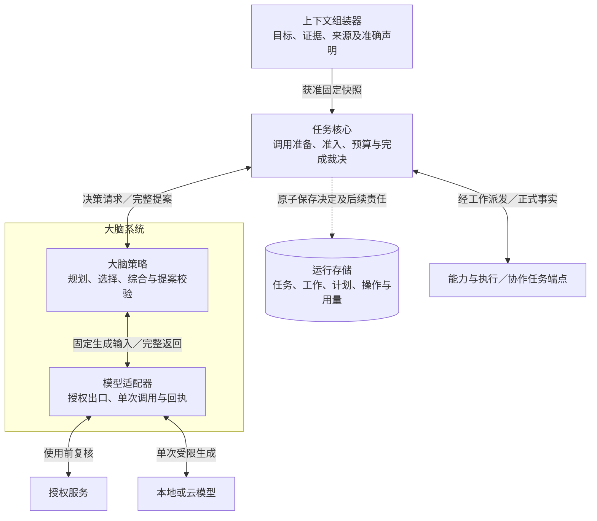
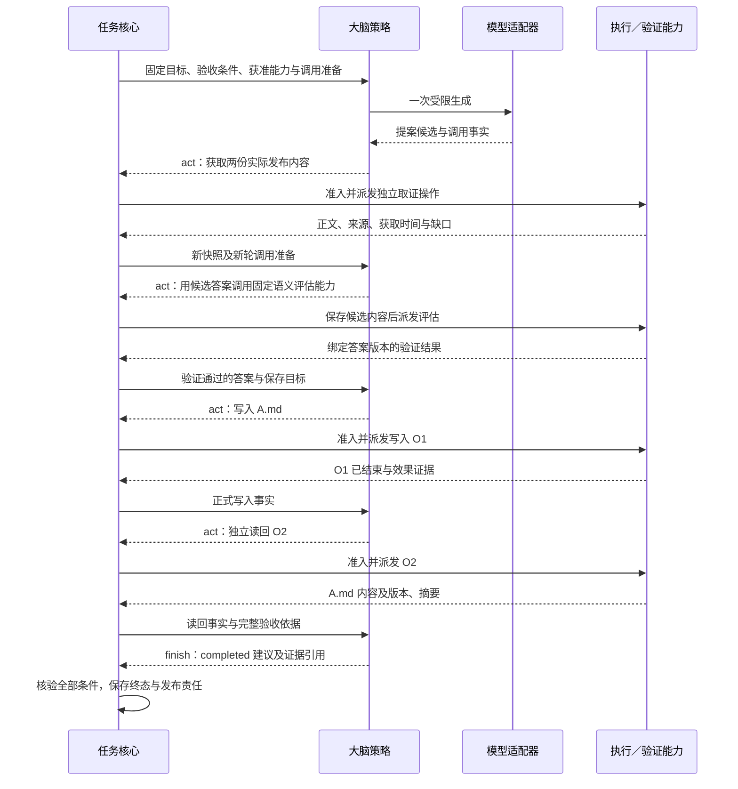

# 大脑系统详细设计

大脑系统依据任务核心提供的获准快照，形成下一批行动、等待或结束提案。大脑策略负责理解目标、规划、能力选择与结果综合；模型适配器负责一次受限生成及其调用事实。任务核心继续裁决提案、保存任务与预算，执行系统继续裁决行动事实和效果。

本方案展开[全景图](../diagrams/system-panorama.drawio)的 `decision` 分组：`brain` 与 `model-adapter`。图中任务核心向大脑发起“请求决策”，大脑返回“决策提案”；大脑向适配器提供“生成输入”，取得“结果与用量”。下面细化这四条交接，不改变组件分工及部署边界。

先读本页，再读[决策机制](decision-policy.md)了解从证据到提案的处理链；实现时查[接口与模型运行](contracts-and-runtime.md)，评审及落地查[验证与依赖](validation.md)。本次交付为设计文档；未提供运行实现，V1／V2 与质量、容量目标均未实测。

## 1. 范围与启用条件

设计采用**受任务核心控制的单轮策略、可替换本地／云模型适配器，以及相同调用契约的独立远程 Brain**。同进程是参考装配，远程默认经网关 WSS。一次 `Brain.Decide` 最多发起一次已由核心准备的物理模型调用，也可以依据固定规则直接返回提案。结构修复须返回核心，再按其已有规则准备下一次调用。大脑没有脱离内核的自主工具循环。

| 范围 | 本次落实及缺失时的行为 |
| --- | --- |
| 默认闭环 | 固定快照 → 规则或一次生成 → 完整提案 → 核心准入 → 执行事实 → 下一轮；规划与模型实现可独立替换 |
| 必需依赖 | 核心的调用准备、快照及来源绑定、授权使用接口、模型配置、准确能力声明和任务验收策略须先接入。来源或调用资格缺失不生成；精确声明缺失不提出该行动；验证器缺失不建议成功 |
| 有条件启用 | 记忆个性化、内部 Agent 委派、GUI 视觉规划、离线生成分别要求获准记忆、完整协作契约、可用视觉模型与观察声明、全部本地依赖及离线许可；缺席行为见[依赖表](validation.md#dependencies) |
| 后续范围 | 多模型并行投票、通用不可信插件隔离和无可信终结依据的风险配额；远程 Brain、跨端委派及受控策略发布已进入对应设计合同；本次不把这些能力作为默认闭环的前提 |

本地适配器调用云模型不等于大脑跨端部署；前者保留本地调用门禁与回执，后者按[已采用 BS-P1](contracts-and-runtime.md#remote)具备可信调用资格、用量回送与重复请求协议。远端只保存调用责任，不获得另一任务权威或自主工具循环。整体端侧部署也不自动取得离线授权。

本模块直接承担[项目目标](../../harness-project-goals.md) C1；在 C2 中利用获准记忆，在 C3 中组织证据，在 C4／C5 中提出行动、委派和恢复后的下一步；C6 对应策略与适配器替换，C7 对应权限约束，C8 对应可追溯决策和用量。C9 只输出可评测的策略候选，发布与回滚由改进管理器负责。A1–A4 均适用；V1 验证有实际来源的回答，V2 验证基于观察的手机动作及效果判断。上述分工不代表已取得相应能力等级。

## 2. 分工与事实归属

**提案**是待核心准入的建议，只有 `act/wait/finish` 三种。**模型调用**以核心分配的 `(work_id, attempt_no)` 标识；一次输出完成只证明该调用有完整返回。**计划**是保存的派生数据，描述后续步骤与依赖，不拥有执行资格。

图从一次决策的调用关系看分工。实线表示请求／返回，虚线表示已有事实与准入结果的持久记录；大脑系统框内不新增调度器或任务存储。

| 交接：发起方 → 处理方 | 输入 → 输出；成功依据 | 保存者与失败后的继续者 |
| --- | --- | --- |
| 核心 → 本地／远程大脑策略 | 固定快照、验收条件、提案约束、生成配置 → 提案或明确故障；成功仅指结构完整并通过大脑预检 | 核心保存输出、调用用量及准入结果；未提交或基线过期按[核心决策恢复](../task-kernel/decision-and-work.md#admission)处理 |
| 大脑策略 → 模型适配器 | 核心已准备的调用、精确输入与来源、输出约束 → 完整返回／拒绝／未知及用量 | 适配器保存原调用使用映射、发送门禁与回执；核心保存账务与旧轮关闭责任，策略不自行补发 |
| 适配器 → 授权服务 | 原行动上下文、真实模型接收方、全部来源、固定使用键 → 当前使用资格 | 授权服务保存消费回执；适配器核对原键，未知不发送；历史回执不代替当前许可 |
| 适配器 → 模型服务 | 一次固定生成请求 → 响应、停止原因、用量或缺口 | 适配器记录接收事实；响应丢失保留可能在途及未知用量，核心限制后续消耗 |
| 核心 → 能力与执行／协作端点 | 已准入操作 → 业务接纳、执行与效果事实／子任务结果 | 各处理端保存原操作；核心持久接收事实再调大脑。大脑只能引用这些事实，不能凭模型输出提升保证 |

前两项细化现有 [Brain.Decide](../task-kernel/storage-and-interfaces.md)；模型使用门禁由适配器落实。后两类行动交接沿用现有内核、执行和身份契约。目录与记忆经上下文组装器进入快照，大脑不绕过核心读取。策略不保存权威任务状态；适配器与远程端的有限调用回执解决授权、接纳及重复生成问题，不能准入行动或裁决任务终态。暂停使旧生成基线失效，旧输出不在恢复后准入；输入、补证和调额均不解除暂停。

## 3. 关键选择

| 推荐 | 原因、代价与适用边界 | 替代方案及改变条件 |
| --- | --- | --- |
| 单轮策略，每次只提交当前可开始的有界行动批次 | 准入时证据、权限和预算可以复核；串行步骤需要再次进核心，但可复用规则和保存计划 | 一次把完整工作流交给模型运行会复制内核职责；确需自主 Agent 时走子任务协作契约 |
| 规则处理可判定分支，模型处理理解、规划和综合 | 已有等待条件或确定下一步不消耗模型；规则只使用固定策略和正式事实，不用字符串猜测成功 | 全模型决策实现表面简单，但重复成本和变化难以解释；只有评测证明规则不适用时替换相应策略 |
| 受限 JSON 生成，供应方约束加本地完整校验 | 格式限制减少坏结构，核心仍复核权限与语义；适配器需维护格式映射和失败分类 | 原生工具调用可作为编码方式，但不能自动执行工具；仅提示词约束不能作为默认结构保证 |
| 默认单模型、固定配置；换模型在新轮完成 | 模型、接收方、价格与来源许可都能绑定；超时后不立即切换，可能增加等待 | 多模型竞速会产生额外在途调用与披露，本次不开放；质量收益足以覆盖成本且逐调用账务可证时再评测 |
| 有限调用回执复用本地事务存储，和任务账本分责 | 授权使用必须有稳定原操作键，重复进入适配器必须不重发；增加少量映射与回执写入 | 完全无状态适配器不能处理发送后崩溃；若把调用回执合并入核心，须同时重定义调用门禁与恢复责任，当前保持适配器持有 |
| 默认本地可信策略包，不保存模型隐含推理 | 恢复依据是输入、完整输出和正式事实；自定义代码隔离还需扩展运行器 | 托管模型会话不能作为唯一恢复依据；确需使用时仍须导出获准上下文及完整来源 |

适配器首期采用薄的供应方原生 HTTP／本地推理接口封装，禁用自动重试、自动工具执行及隐式辅助生成。不同后端通过相同的 `Generate` 契约测试。模型型号、量化与并发数由部署的固定 profile 明确填写并评测，不以品牌承诺质量。受限生成的能力和局限、首期适配目标见[模型契约](contracts-and-runtime.md#model-profile)。

## 4. 贯穿场景：联网核实后保存答案

用户要求“核实项目 X 已发布的版本 V甲 与 V乙 的变化，附来源，保存到电脑的 A.md 并读回”。本例假设应用已提供对应验收策略，联网取证、文件读写、语义评估能力与许可齐备。路径有歧义时先澄清；授权确认经受信入口完成。按[内核验收契约](../task-kernel/storage-and-interfaces.md#acceptance-contract)先固定取值规则，再将 A.md 的预期内容绑定为通过评估的具体答案版本，后续写入与读回都引用同一摘要。包含 UI、内容交接和条件固定过程的完整链路见[贯穿设计示例](../design-walkthrough.md)。

图展示正常业务顺序；每条行动都先经核心准入和持久工作派发。“发布答案”在核心完成核验之后。

关键异常是 O1 已写入但返回丢失，同时用户撤销写权限。下一轮只能引用“效果未知”，由核心和执行端沿 O1 核对；大脑不能提出另一个写入或改用 GUI 保存。同一授权内可查询原操作或独立读回时，按各自权限继续；没有查询权则保存等待和缺口。若用户随后取消，迟到成功事实仍可结算并澄清效果，任务保持取消。完整分支见[异常推演](decision-policy.md#recovery-example)。

## 5. 核心保证

| 编号 | 保证 | 权威位置 |
| --- | --- | --- |
| B1 | 大脑只生成提案；全部行动、等待和终态由核心准入 | [决策顺序](decision-policy.md#selection) |
| B2 | 输出继承固定快照全部来源，能力和证据引用不能伪造或越权 | [证据与上下文](decision-policy.md#evidence) |
| B3 | 每次物理生成均有核心调用准备、当前授权和唯一启动门禁；未知不重发 | [调用交接](contracts-and-runtime.md#call-handoff) |
| B4 | 模型输出完整性、任务准入、业务接纳和效果确认分别有证据 | [提案契约](contracts-and-runtime.md#proposal) |
| B5 | 旧轮输出不能进入新轮，未知费用和物理在途占用不因关闭消失 | [恢复与用量](contracts-and-runtime.md#recovery) |
| B6 | 计划复用、能力回退及委派均不能绕过当前前提、权限与预算 | [能力与协作](decision-policy.md#capabilities) |
| B7 | 替换与优化按冻结场景验证，质量目标和运行成熟度如实报告 | [验收矩阵](validation.md#tests) |
