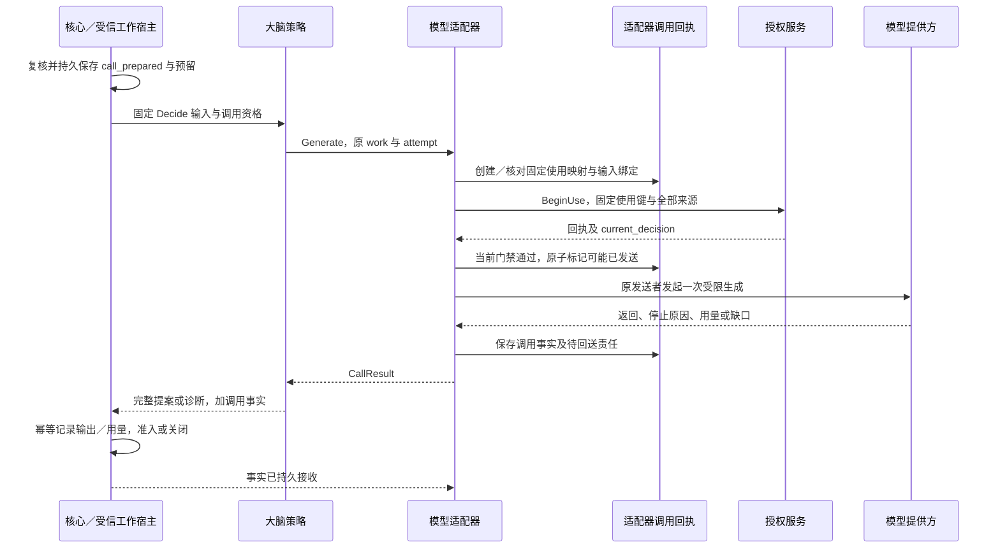
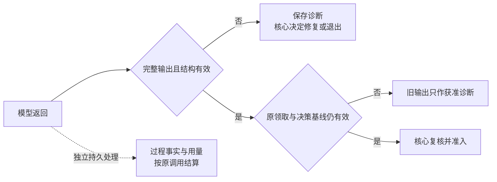
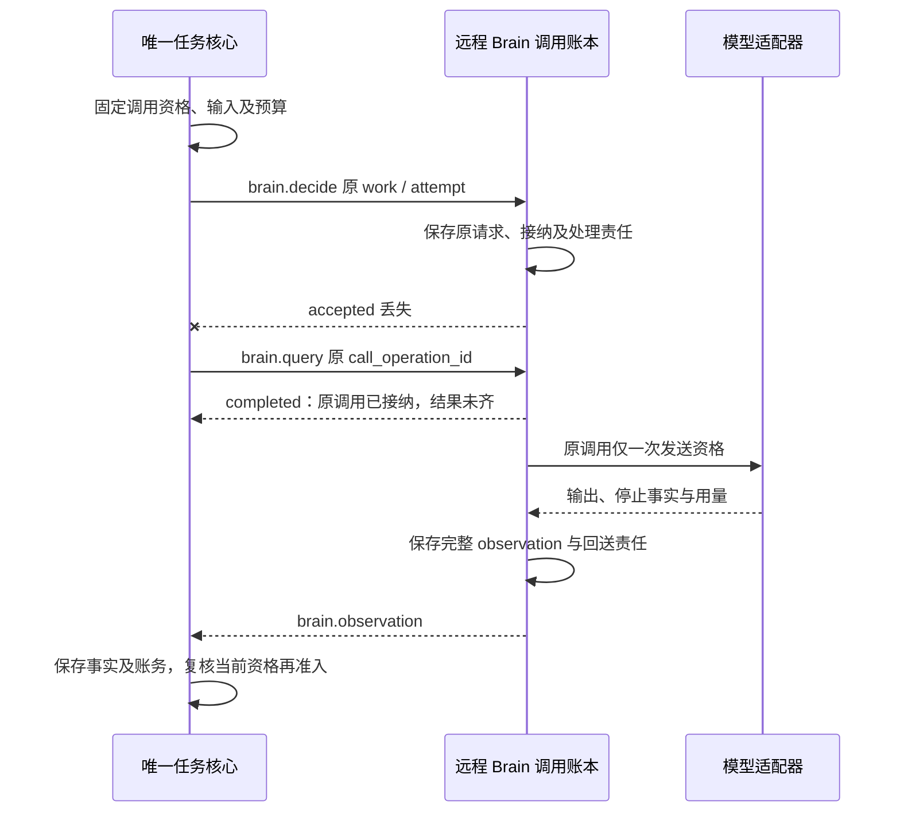

# 决策接口与模型运行

[总览](README.md) · [决策机制](decision-policy.md) · [验证与依赖](validation.md)

一次决策从核心提供的固定输入开始，返回提案和模型调用事实。下面先定义双方交换的值，再说明适配器如何发送、保存和恢复一次调用，最后扩展到[远程 Brain](#remote)。

本地与远程共用这些逻辑契约：同进程使用类型化调用，远程经网关 WSS，线字段查 [brain Schema](../endpoint-communication/schemas/brain.schema.json)。身份、任务和执行事实仍由各自模块裁决；未知必需版本直接拒绝。

## 1. Brain.Decide

核心或受信工作宿主持有有效决策工作，向策略提供下表输入。调用身份来自宿主，模型只产生候选正文。策略接到请求后承担本轮求值，返回的提案仍须核心准入；远程接纳另外保存调用与回送责任，不接管任务生命周期。

| 输入组 | 内容与约束 | 权威来源 |
| --- | --- | --- |
| 调用上下文 | 受信用户、原行动 actor、端点、任务、owner_epoch、work_id、原 claim_epoch；原领取与期限 | [RequestContext 与标识](../task-kernel/storage-and-interfaces.md)；模型不得填写或覆盖 |
| 固定快照 | snapshot 引用及完整性摘要、base_decision_revision、目标／约束、操作事实、未知项、获准记忆与计划、能力精确声明 | [组装器](../task-kernel/decision-and-work.md#context)提供；大脑不补读未经绑定资料 |
| 来源与用途 | 完整 source_bindings 引用、模型输入及输出保存／披露限制 | 受信组装器绑定；派生输出继承全集 |
| 验收与提案限制 | draft/fixed 条件集、策略／验证器版本、允许的取证集、行动与委派／输入限额 | [内核验收契约](../task-kernel/storage-and-interfaces.md#acceptance-contract) |
| 生成约束 | 固定大脑／模板／输出契约版本、模型 profile、绝对期限、生成预留及单次额度 | 核心固定；策略不能改配置或借用收尾预算 |
| 物理调用准备 | 需要生成时附 attempt_no、已确认的 call_prepared 依据、精确输入版本／摘要与输出格式；修复时附已保存原输出及结构诊断 | [核心调用准备](../task-kernel/decision-and-work.md#admission)；生成前仍检查当前资格 |

固定版本的策略模板把快照、配置及可选修复材料转换为模型输入。核心准备调用时绑定输入摘要，或能唯一重建输入的内容与模板版本；适配器重建不一致就拒绝。用模型生成提示词本身也是额外调用，首期不允许隐式执行。

返回值同时表达候选是否可用、调用发生了什么。这样，即使没有提案，核心也能继续保存账务和恢复责任。

| 返回 | 含义与调用方动作 |
| --- | --- |
| 完整 Proposal，加逐调用 CallResult | 候选通过大脑结构与引用预检；核心保存并独立执行整体准入。规则路径未调用模型时明确 call_performed=false，不能伪造零费用模型回执 |
| 无提案，加结构诊断与 CallResult | 该次生成已返回但不可用；核心保存输出与账务，满足有限修复全部条件才准备下一 attempt |
| 无提案，加前提／配置／依赖故障 | 不代表任务失败或等待已保存；核心关闭旧轮并登记阻塞、退避或失败责任 |
| 调用未知或调用方取消等待 | 不能解释为模型未启动；适配器保留原调用事实，核心按旧轮恢复及未知预留处理 |

同 work_id、attempt_no、原领取且同输入的重复进入，只读取原调用或返回记录；异内容返回 identity_conflict。新领取不能使用旧输出继续准入，即使输出完整，也仅用于诊断和结算。原准入若已提交，则从核心原回执恢复操作映射。

## 2. 提案值与完整性规则

策略用提案表达现在可以开始的行动、需要等待的依赖或结束建议。核心按[准入契约](../task-kernel/decision-and-work.md#admission)裁决，并分配操作身份。下表定义提案所需内容，沿用既有业务消息枚举。

| 部分 | 必需内容 | 校验与解释 |
| --- | --- | --- |
| 受信关联封装 | 原 work_id、claim_epoch、owner_epoch、base_decision_revision、snapshot／配置版本、source_bindings 引用 | 宿主从原请求复制；模型只产生候选正文，不得自报更高版本 |
| act.invoke | 局部键、能力精确版本及目标端、确定参数、启动期限、预算上限、必要事实与判据引用；适用时原操作重试关联 | 必须匹配准确声明；局部键在本轮唯一且内容固定；operation_id 由核心准入分配 |
| act.delegate | 局部键、子目标／约束／结果条件、协作端点、收缩权限需求、子预算、必要事实 | 有合法协作合同才可提交；大脑不签发子许可，也不自行启动子循环 |
| wait | 一个或多个依赖：种类、关联对象／版本、当前缺口、可信唤醒来源、绝对到期、到期后重决策或失败策略；需输入时附字段与问题 | 关联既有操作、许可确认、依赖提供方或合法 InputRequest；纯文本“稍后再试”不合格；所有必需条件分别满足才解除等待 |
| finish | completed／failed 建议、摘要、获准成果内容或引用、条件与证据映射、残留缺口及处置依据 | 不附新目标行动；completed 受核心全部门禁限制，failed 仍保留已发生效果 |
| 可选计划／解释 | 下表计划与简短决策依据，说明选定能力、主要限制及未知项 | 不是隐含推理记录；保存和展示受来源用途约束，不产生额外权限 |

同一提案只选择一个 kind。`act` 可混合独立的 invoke 和 delegate，任一项不合法则整批不准入，策略须在返回前形成合法批次。

`wait` 依赖已有继续者：原操作由 reconcile 责任核对，新取证须另轮通过 act 准入。输入请求、模型修复和业务尝试分别计数，不能通过改名重置限额。

候选答案可作为获准参数交给核心；体积超限时，先经受信内容路径保存字节，再返回可读引用。引用须来自快照中的正式事实或本次获准生成内容，生成内容只能作为待核验成果。尚无字节的虚拟 artifact 不能作为结果。

### 可复用计划

计划帮助后续轮次复用已完成的规划；行动资格仍由每轮准入决定。没有计划也是合法提案，核心沿既有记录处理保存和操作映射，无须新增全局计划服务。

| 字段组 | 约束 |
| --- | --- |
| plan_version、生成策略／模板版本、来源绑定 | 计划版本不可变，继承生成快照全部来源；核心获准保存后才可复用 |
| step_key、目标、前驱 step_key 集合 | 步骤数有限、引用闭合且无环；步骤键是计划内标识，不是 operation_id |
| 能力意向、已知参数、待确定项、预期证据 | 允许未来描述，但只有确定且前提满足部分可转成当前 act；计划无任意可执行表达式 |
| 已准入操作关联 | 以核心保存的局部键到操作映射为准；旧步骤不能再次映射成替身操作 |

## 3. 模型适配器与配置

模型配置必须同时回答两件事：它能产生怎样的输出，以及一次调用能够兑现哪些数据、费用和恢复保证。默认采用受限 JSON，首期适配云端 Claude 原生结构化输出与本地 `llama.cpp` grammar 接口，两类均经过本地完整校验。部署只启用已验证的 profile；具体权重、硬件、数据策略和质量样本未定，默认型号留待评测。

依据核对于 2026-09-24：[Claude 结构化输出文档](https://platform.claude.com/docs/en/build-with-claude/structured-outputs)列明拒绝、输出上限等例外以及部分 Schema 限制；[llama.cpp grammar 文档](https://github.com/ggml-org/llama.cpp/blob/master/grammars/README.md)说明支持的是 JSON Schema 子集。二者支持受限生成的设计方向，不能据此推出语义正确或预算硬保证。本地请求参数以[服务接口](https://github.com/ggml-org/llama.cpp/blob/master/tools/server/README.md)为实现依据；开发时锁定发行版／提交再跑适配测试，不把浮动文档当版本合同。

| ModelProfile 字段组 | 必须声明及启动检查 |
| --- | --- |
| profile_id／version、adapter 实现版本、供应方与模型精确标识 | 不可变配置；可变服务别名须记录实际响应标识与别名性质，不能宣称可精确重现旧权重；缺少契约测试不激活 |
| 接入与数据处理 | 固定服务地址、认证凭据引用、processor／recipient／location、保留和缓存策略；凭据不进模型上下文。约束不可落实时拒绝相应数据 |
| 输入能力 | 文本／图像支持、字节与上下文上限、模板及分词／预估版本；不支持图像不能丢掉截图继续生成 GUI 坐标 |
| 输出模式 | Schema 子集、最大输出、合法停止原因、是否有单独拒绝表示、工具自动执行关闭 |
| 消费保证 | 输入／输出及其他计费维度、价格配置版本、可信用量来源、能强制的上限与仅估算项；无法约束隐藏消耗的 profile 不满足对应硬预算 |
| 查询与停止 | 原请求标识取得时点、状态／用量查询、取消及物理终结证据；不支持须明确 none。HTTP 断开或客户端超时不代表生成终止 |
| 隔离与并发 | 用户隔离方式、同用户物理并发与全局容量、未知在途占位方式、活动适配器实例与唯一发送入口 |

核心固定本轮配置前，先按全部来源用途、处理位置、输入能力和预算保证筛选 profile，再按部署的显式优先序选择。没有满足项就返回 model_unavailable 或 permission_gap，仅本地资料不能自动转发云端。换 profile 要建立新轮与新预留，原未知调用继续占额。

选定配置后，适配器通过以下接口分别承担生成、查询和停止责任。

| 适配器内部接口 | 输入 → 输出及限制 |
| --- | --- |
| Generate | 核心已准备调用、精确输入与来源、固定 profile、单次额度／期限 → CallResult；首次有效进入最多物理发送一次，重复只核对 |
| ReadCall | 原调用身份和当前查询／披露权 → 已保存调用事实与缺口；必要时按已分配的有限核对额度查询供应方。读缓存不会产生第二次生成 |
| RequestStop | 原调用身份、核心控制依据、可用停止权限 → 停止请求事实；不返回任务取消结果，不承诺回滚披露或账单 |

ReadCall 和 RequestStop 保留在适配器内部；远程调用方通过 brain.query／cancel 查询或请求停止，无法取得供应方凭据。供应方不支持的能力返回缺口，模型生成的说法不构成调用事实。收费查询须先取得核心分配的收尾额度，否则仅读本地记录。

## 4. 一次模型调用如何发送

一次生成使用两种关联身份：核心按 work／attempt 管理决策和账务，身份模块的 `BeginUse` 按固定 `operation_id` 消费许可。适配器为每个受信 `(user, work_id, attempt_no)` 持久分配一个 UUIDv4 授权使用操作 ID，将两者关联。这个 ID 属于模型资源的使用记录，不是工具 Operation，不经 execution.invoke 派发，也不改变核心计费键。

同一调用只分配一次使用 ID，模型不能提供，重启不能重建。task_id、输入摘要、profile、接收方、原领取及期限是不可变绑定；它们不加入唯一键，任一项变化都返回冲突。结构修复使用新 attempt 和新使用 ID，不能继承旧单次许可。用量统一回送到原 work／attempt，避免两种身份重复计费。

核心、适配器和授权服务各自提交，发送依赖前面的责任已持久保存。下图沿一次需要模型的 Decide 展开；只有 call_prepared 成功且本次执行仍有效，才进入适配器首次发送路径，三者之间不依赖全局事务。

适配器按[身份使用语义](../identity-and-authorization/mechanisms.md#use)为生成及全部来源执行 BeginUse，`use_slot` 采用安装的模型动作模式规定的一个使用单元和各来源 role；意图绑定精确输入、来源、接收方与 profile。全部来源使用都取得当前 allow、原始 start_before 尚有效，且本地约束可落实，才准备发送。部分来源已消费但另一项拒绝，不发送，也不退回已消费单次许可。

| 提交边界 | 一起保存 | 提交未知或恢复行为 |
| --- | --- | --- |
| 核心调用准备 | 原领取、基线、精确输入、格式、额度及 call_prepared | 先查原核心回执；未知时不进入模型发送 |
| 适配器建立关联 | 调用唯一键、授权使用操作 ID、固定意图、profile、原发送实例与输入引用、物理容量占位 | 核对原创建回执；相同键不能分配第二份 ID；没有确认就不消费／发送 |
| 授权使用 | 固定使用键与不可变消费回执 | 仅查原键；历史成功仍须重新取得当前使用判断，截止不能刷新 |
| 适配器发送准备 | 当前有效核心资格、授权回执关联及门禁判定、send_may_have_started、单一发送资格 | 只有确认该次提交成功的原活动调用可发送。准备回复丢失、线程／进程失去资格或恢复者接手时都不发送；保守保留未知 |
| 适配器收取返回 | 原调用、返回／停止／用量事实、输出获准引用、待回送标记 | 同键重复处理回执；不因核心暂不可达丢弃用量。核心确认持久接收后才清除待回送标记 |
| 核心接收与准入 | 既有输出、用量幂等记录及后续责任；准入仍按原子事务 | 先核对原准入，已提交采用原映射；否则按有效领取和基线决定，旧轮不能复活 |

发送门禁将资格检查、消费一次发送资格和进入受控出口串行化，再次复核原领取／owner、任务控制、全部来源当前用途及最早启动截止。并发进入时，只有首次条件更新成功且仍有效的发送者能发送，其余读取原记录。

取消先通过该入口就阻止发送；发送先通过则保留可能在途事实并尝试停止，已到达供应方的字节无法撤回。新实例接替前，必须证明旧实例已不能通过发送入口；无法隔离旧实例时，新实例只能核对。

send_may_have_started 在实际发送前保存，因此可能出现已经占额、实际尚未发送的情况。恢复者仍不补发旧调用，以避免将不确定性转成重复生成。适配器和核心可各自管理同一数据库中的记录，端侧与云侧均复用宿主事务存储，无须新增消息中间件。

## 5. 返回结果与恢复责任

一次调用可以已经返回可用答案，但费用仍未结清；也可以失去输出，却仍在供应方运行。CallResult 因此分别记录输出完整性、物理过程和用量，核心据各自证据决定是否准入、释放占位或结算。

| 字段组 | 内容与约束 |
| --- | --- |
| 关联与配置 | 受信调用键、输入摘要、profile／实现／模型响应标识、提供方请求 ID（可缺但必须说明查询限制） |
| 输出 | complete／invalid／absent，获准输出引用及摘要、原停止原因与归一原因；流式片段不能标 complete |
| 过程 | not_started／ended／unknown 及依据；拒绝或完整响应如何证明 ended 由适配 profile 声明；连接结束不自动证明物理过程结束 |
| 用量 | 按维度记录可信累计整数值、单位、用量项身份、final 标志与依据；缺维度留 unknown，不能默认为零 |
| 费用 | 固定价格版本和计费关联、已知累计金额、估算／硬限制类别；延迟账单按原调用补记 |
| 授权与控制 | 使用操作关联、使用回执引用、原截止、可能发送标记、停止请求及物理停止依据 |
| 交接 | 核心接收回执或待回送责任、获准保留期、未决核对及退避限额 |

下面只判断输出能否供本轮使用。用量与物理过程沿原调用独立保存，输出被丢弃也不结束这些责任。

| 事件 | 策略／适配器行为 | 核心行为 |
| --- | --- | --- |
| 完整合法输出、用量已知 | 返回候选及可信账单；响应声明仅覆盖该次模型调用 | 准入独立于输出保存；按原账单幂等结算 |
| 完整合法输出，但用量或物理终结依据缺失 | 可以返回候选，明确未知项 | 保留相应预留／物理占位，按现有账本检查能否准入后续行动；不允许结构修复复用未知额度 |
| 坏结构、截断 | 保存实际返回与用量，不拼接为执行提案 | 仅上一调用已结束、用量确定、输出保存且原资格仍有效时允许有限结构修复；否则关闭旧轮 |
| 供应方拒绝 | 保存拒绝与调用事实，不将其变成 completed，不绕过拒绝反复改写提示词 | 按固定策略等待或失败；不是结构修复 |
| 429、断连、超时、未找到原请求 | 记录已知传输事实；不能仅据错误认定零费用或未启动，不自动重试／换模型 | 按原调用保留未知，关闭旧轮；新轮独立预留并受物理占位限制 |
| 暂停、取消、撤权、租约过期或进程重启 | 关闭发送资格，有权时请求停止；迟到返回只回送原调用事实 | 不复活旧工作，不准入旧输出；仍结算迟到账单 |
| 仅核心接收答复丢失 | 以原调用及用量项重交已保存事实，不再调用模型 | 幂等接收并返回原处理结果 |

结构修复和新轮由[核心规则](../task-kernel/decision-and-work.md#admission)管理。原活动调用尚未跨发送门禁时，可以在原领取、基线和期限内等待授权核对，这仍属于首次调用。一旦由恢复者接替，旧调用发送资格即关闭；即便错误表明未发送，也不能改为同调用补发。

用量按输入、输出及 profile 声明的其他计费单位分别结算。累计报告只补可信增量，重复或乱序不重复扣费；冲突账单保留差异并查询可信来源，不取较小值释放余额。无法证明已用上界时，保留全部未结预留。费用硬限制依赖供应方或受控推理执行器落实，仅有 token 上限不足以提供这一保证。

物理并发占位须有可信未启动或终结证据才能释放，工作关闭、租约过期和 HTTP 超时都不充分。终结依据缺失则保留物理占位，用量依据缺失则保留相应预留。供应方始终无法补足时，核对到限后停止主动查询并通知一次。首期不提供忽略未知继续运行的开关。提高这类后端的可用性，需要补足查询／终止能力，或另行决策风险配额。

## 6. 将同一次调用交给远程 Brain

远程部署保留本地调用的分责，另外保存跨端接纳与结果回送责任。核心固定 [Brain.Decide](#decide) 的 work／attempt、领取、基线、输入、模板、验收条件、来源、profile、截止及预留预算后，发送 `brain.decide`。

远端核验调用资格、主体、接收方／处理位置、输入摘要、准确声明和当前许可，持久保存原请求、固定接纳及有限处理／回送责任，才返回 accepted。这个答复确认远端承担调用，不授予新 work／attempt，任务权威仍在核心。

图展示接纳答复丢失后的恢复。核心查原调用，远端继续已接纳责任，物理发送仍须通过[授权与唯一发送门禁](#call-handoff)。图中 query 的 completed 只表示查询完成。

| 消息 | 责任与恢复 |
| --- | --- |
| brain.decide | 绑定原调用的 operation_id、work／attempt 及不可变输入；同键异意图拒绝，同键重投只复用原接纳。远端恢复查原调用，不重新生成 |
| brain.query | 按 task_id 和 call_operation_id 读取权威完整 observation 切点；记录未知／缺失不推断未发送，不新建调用 |
| brain.cancel | 核心当前控制决定及原调用资格被关闭后，保存停止责任；重复沿原取消命令，不保证供应方物理停止 |
| brain.observation | 原调用的完整输出／提案、物理状态、来源缺口及可信累计账务。call_revision 归固定生产者；同修订异内容冲突，低修订不覆盖，新修订不得改变原输入或重开发送 |

消息关联按两层身份保存：delivery.scope 为 task，取 task_id；observation 的信封 operation_id 等于载荷 call_operation_id，query／cancel 使用各自请求身份并绑定原调用。

远端接纳结果和 observation 按业务保留规则保存，不依赖消息交付窗口。核心持久接收后才确认，确认丢失只重交已保存事实；旧工作关闭后仍接收获准迟到账单。

远端首次发送前仍须复核原领取、调用资格，以及当前权限、控制和输入证据。暂停、取消、撤权或资格过期关闭相应入口；已发送调用尽力停止，未知过程和费用继续保存。后续 attempt、模型切换和工具执行由核心安排，旧提案仍受核心暂停与基线检查。

断连后默认不启动生成。只有显式批准有限离线窗口且全部本地资格成立，才可在原调用、预算和截止内继续。

远程返回的提案仍限定为 act／wait／finish，调用事实独立回送。生成参数保存为获准 content 引用并按精确声明校验，任意 JSON 字段不能成为执行入口。提案继承全部 source_bindings，远端或模型少引用资料也不减少来源依赖；修复和后续轮次继续由核心准备。

## 7. 故障定位与运行维护

故障返回需要告诉核心下一步能做什么，同时保留已经发生的调用事实。下表是本地分类，由核心映射为既有任务等待／失败及协议错误；异常栈不能替代原调用关联。

| 分类 | 触发与调用方后续行为 |
| --- | --- |
| invalid_contract／identity_conflict | 必需版本、结构或同键意图不符；拒绝，修复集成，不换 ID 掩盖冲突 |
| recovery_gap | 原调用记录或所需正文已清理／缺失；返回当前获准的最小事实与缺口，不重新创建原调用或推断未发生 |
| context_gap／capability_gap | 必需内容、声明或来源不全，或原目标已可确定但验收条件尚未由核心固定；核心按明确提供方重新组装、固定条件或等待。无提供方或已知不可达时失败 |
| permission_gap | 当前用途或控制条件不成立；停止新发送，按原授权确认或权限变化唤醒；不自动降低隐私要求 |
| model_unavailable／overloaded | 未能取得合法 profile 或容量；保存有界退避，恢复条件或期限未变时不循环生成 |
| invalid_output／output_limit | 本次返回不符合结构；满足有限修复条件才产生新 attempt，输出上限不能自动放大预留 |
| model_refused | 保存供应方拒绝；由固定任务策略说明限制并等待／失败，不用结构修复绕过 |
| call_unknown／usage_unknown | 原调用事实不足；保存核对责任和未知占用。未知不能作为未调用、零费用或完成的依据；是否阻止完成由核心按成果与约束影响裁决 |
| obsolete_call | 原领取、基线或控制已失效；关闭旧轮，仅保留获准诊断／用量 |

### 持久恢复与清理

适配器按受信用户与调用键唯一保存记录，授权使用操作 ID 也唯一；待回送、未决调用和保留到期另建索引。创建、门禁和事实更新使用固定步骤键及条件事务，同键异意图拒绝，提交未知查原回执。调用字段、固定意图和用途依据均须耐久保存。

受信宿主在启动及运行期间有界扫描这些记录，优先重交已保存的 CallResult／用量，直到核心确认持久接收；旧 decide 关闭也不结束回送责任。撤权后只交付当前获准的最小事实，保留敏感正文限制和交付缺口。

未决调用的 ReadCall／RequestStop 受当前权限和核心核对额度限制，退避、次数及到期写入原回执。扫描不取得生成资格、不重开旧轮，由宿主完成即可，无须另建恢复服务。

输入与输出按授权保留最少必要内容，默认观测不记录原文、凭证或模型隐含推理。删除正文后仍须防止旧调用被重新发送，因此用量核清、事实交接后，仍保留含调用键、意图摘要、发送／关闭标记及固定截止的最小墓碑。

墓碑至少覆盖原调用最晚发送截止和约定重复查询期，未知项另覆盖未完成责任生命周期。命中时只返回获准最小事实或 recovery_gap，不重新分配使用 ID。墓碑期满后，入口先检查核心工作资格与原绝对截止，过期身份不能重建映射。

强制删除先阻断内容使用，再保存获准的最小缺口与去重记录。若墓碑也须删除，先持久关闭原调用发送资格；无法证明关闭，就拒绝继续接纳该恢复模式。保留策略从一开始就禁止最小恢复依据时，在接纳前拒绝可恢复生成。账本丢失或恢复旧备份后，须先核对历史调用，否则关闭受影响发送入口。

### 用户隔离

查询、缓存、内容引用、并发和账单均按用户隔离，共享推理服务也不能跨用户命中会话前缀或输出缓存。首期关闭应用层跨用户提示词／输出复用，供应方缓存与保留按 profile 数据策略约束。

再次返回缓存输出或回执正文前，重新检查当前读取／披露权。策略包不持有模型或工具凭据，网络经受控适配器；无法验证隔离时只加载受信内置代码。

### 容量与过载

未决记录占用恢复空间，物理过程尚未核清的调用另保留并发占位。容量配置限制新调用，并为控制与结算保留通路。下表参数随部署与策略版本固定。

| 配置组 | 有限参数与过载行为 |
| --- | --- |
| 输入／输出 | 快照字节、模型上下文、图片数和分辨率、输出字节／深度／行动数；超限显式返回缺口，不静默截断关键材料 |
| 调用 | 单用户物理并发、全局推理槽、排队长度／字节、排队与生成绝对期限；无容量不穿过发送门禁，等待不占线程 |
| 重试与修复 | 单轮修复次数、总调用额度／时长、查询次数与退避上限；模型 SDK 重试为零，修复由核心准备 |
| 计划／协作 | 步骤数、每批行动数、子任务数／深度及输入请求数；沿内核限额，输入请求不超过既有 64 项上限 |
| 回执与收尾 | 未决调用数量、账本字节、输出保留期、回送／查询保留容量；空间不足拒绝新调用，保留控制与结算通路 |

容量估算使用 `平均在途数 ≈ 每秒模型调用数 × 平均调用秒数`，并另加未知调用的保守占位。它依赖稳态假设，在线用户数不能直接换算模型吞吐。端云配置仍须依据用户公平性、排队时间、调用尾延迟、修复率、未知积压和成本的实测结果。
