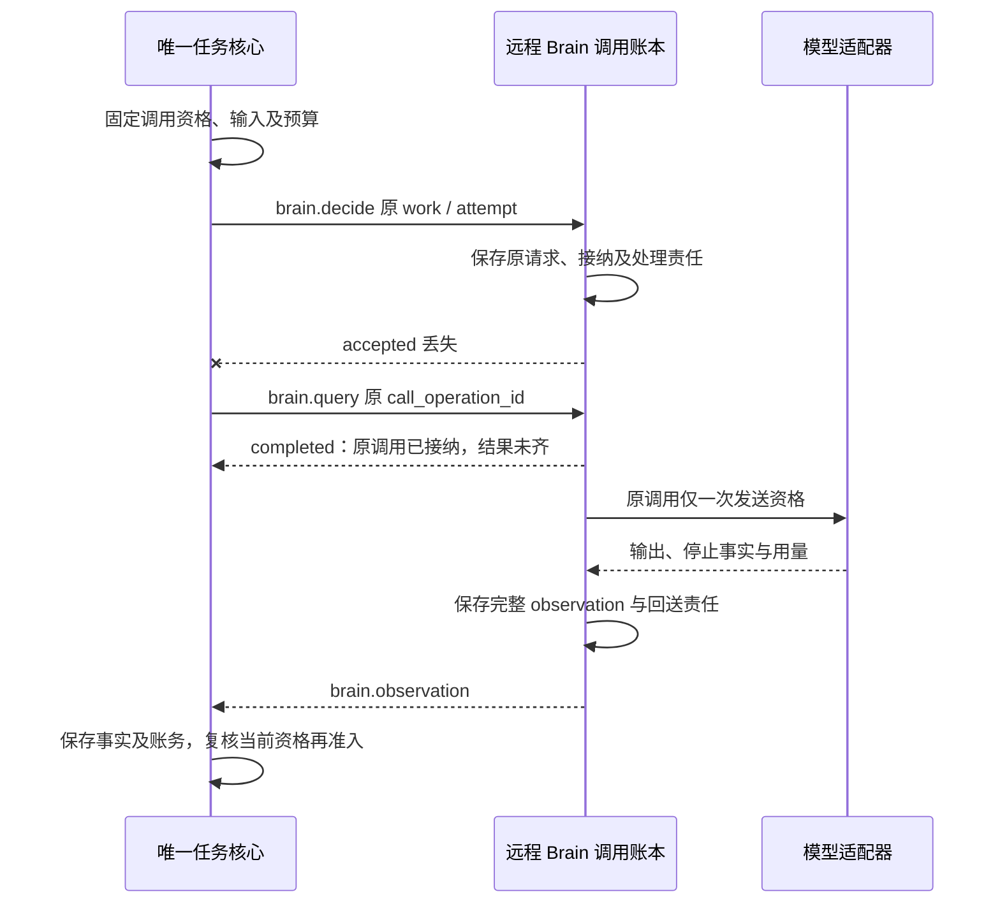
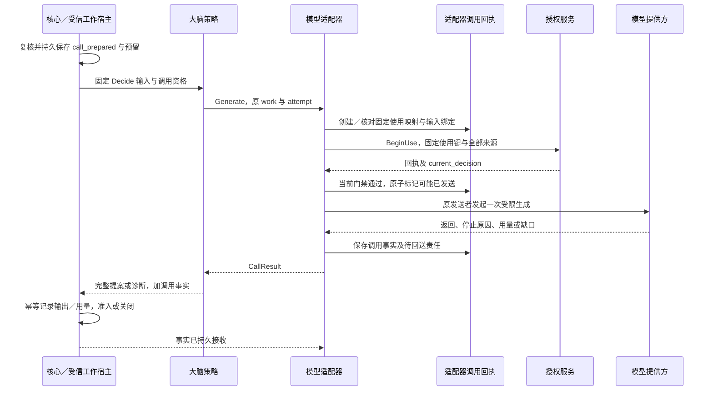
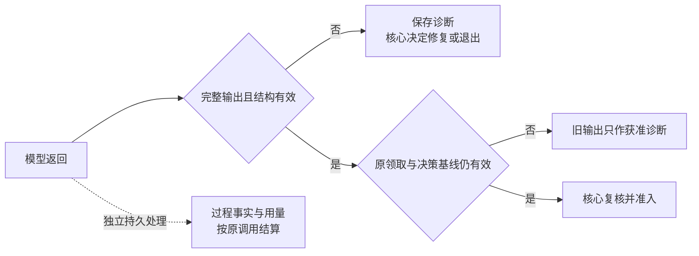

# 决策接口与模型运行

[总览](README.md) · [决策机制](decision-policy.md) · [验证与依赖](validation.md)

以下逻辑契约同时用于本地调用与已采用的[远程 Brain](#remote)；跨端字段由 [brain Schema](../endpoint-cloud-protocol/schemas/brain.schema.json)定义。既有字段含义分别引用内核、执行和身份方案；字段组中的本地补充不改变其裁决权。同进程使用类型化调用；远程默认网关 WSS，未知必需版本直接拒绝，不静默降级。

## 1. Brain.Decide

调用方是持有有效决策工作的任务核心／受信工作宿主。策略包不能从模型输出重建调用身份。同进程函数进入与远程 Decide 的调用接纳都不等于核心已准入提案。远程调用保存接纳和回送责任，任务生命周期与行动准入仍仅归核心。

| 输入组 | 内容与约束 | 权威来源 |
| --- | --- | --- |
| 调用上下文 | 受信用户、原行动 actor、端点、任务、owner_epoch、work_id、原 claim_epoch；原领取与期限 | [RequestContext 与标识](../task-kernel/storage-and-interfaces.md)；模型不得填写或覆盖 |
| 固定快照 | snapshot 引用及完整性摘要、base_decision_revision、目标／约束、操作事实、未知项、获准记忆与计划、能力精确声明 | [组装器](../task-kernel/decision-and-work.md#context)提供；大脑不补读未经绑定资料 |
| 来源与用途 | 完整 source_bindings 引用、模型输入及输出保存／披露限制 | 受信组装器绑定；派生输出继承全集 |
| 验收与提案限制 | draft/fixed 条件集、策略／验证器版本、允许的取证集、行动与委派／输入限额 | [内核验收契约](../task-kernel/storage-and-interfaces.md#acceptance-contract) |
| 生成约束 | 固定大脑／模板／输出契约版本、模型 profile、绝对期限、生成预留及单次额度 | 核心固定；策略不能改配置或借用收尾预算 |
| 物理调用准备 | 需要生成时附 attempt_no、已确认的 call_prepared 依据、精确输入版本／摘要与输出格式；修复时附已保存原输出及结构诊断 | [核心调用准备](../task-kernel/decision-and-work.md#admission)；生成前仍检查当前资格 |

策略模板是固定版本的确定性转换：从快照、配置及可选修复材料构造完整输入。核心的调用准备须绑定这份输入的字节摘要或可唯一重建的内容与模板版本；适配器重建不一致就拒绝。若策略需要模型来决定提示词本身，也是一项额外生成，首期不支持隐式执行。

| 返回 | 含义与调用方动作 |
| --- | --- |
| 完整 Proposal，加逐调用 CallResult | 候选通过大脑结构与引用预检；核心保存并独立执行整体准入。规则路径未调用模型时明确 call_performed=false，不能伪造零费用模型回执 |
| 无提案，加结构诊断与 CallResult | 该次生成已返回但不可用；核心保存输出与账务，满足有限修复全部条件才准备下一 attempt |
| 无提案，加前提／配置／依赖故障 | 不代表任务失败或等待已保存；核心关闭旧轮并登记阻塞、退避或失败责任 |
| 调用未知或调用方取消等待 | 不能解释为模型未启动；适配器保留原调用事实，核心按旧轮恢复及未知预留处理 |

同 work_id、attempt_no、原领取且同输入的重复进入只读取原调用／返回记录，不再发送；异内容返回 identity_conflict。即使适配器保存了完整输出，新领取也只能将其用于诊断和结算，不能继续旧轮准入。若原核心准入已经提交，恢复依核心原提交回执返回其操作映射。

## 2. 提案值与完整性规则

提案种类、准入顺序与操作身份由[内核准入契约](../task-kernel/decision-and-work.md#admission)定义。下表补齐策略应提供的信息；不新建业务消息枚举。

| 部分 | 必需内容 | 校验与解释 |
| --- | --- | --- |
| 受信关联封装 | 原 work_id、claim_epoch、owner_epoch、base_decision_revision、snapshot／配置版本、source_bindings 引用 | 宿主从原请求复制；模型只产生候选正文，不得自报更高版本 |
| act.invoke | 局部键、能力精确版本及目标端、确定参数、启动期限、预算上限、必要事实与判据引用；适用时原操作重试关联 | 必须匹配准确声明；局部键在本轮唯一且内容固定；operation_id 由核心准入分配 |
| act.delegate | 局部键、子目标／约束／结果条件、协作端点、收缩权限需求、子预算、必要事实 | 有合法协作合同才可提交；大脑不签发子许可，也不自行启动子循环 |
| wait | 一个或多个依赖：种类、关联对象／版本、当前缺口、可信唤醒来源、绝对到期、到期后重决策或失败策略；需输入时附字段与问题 | 关联既有操作、许可确认、依赖提供方或合法 InputRequest；纯文本“稍后再试”不合格；所有必需条件分别满足才解除等待 |
| finish | completed／failed 建议、摘要、获准成果内容或引用、条件与证据映射、残留缺口及处置依据 | 不附新目标行动；completed 受核心全部门禁限制，failed 仍保留已发生效果 |
| 可选计划／解释 | 下表计划与简短决策依据，说明选定能力、主要限制及未知项 | 不是隐含推理记录；保存和展示受来源用途约束，不产生额外权限 |

同一提案只能选择一个 kind。`act` 内可混合独立 invoke 和 delegate，但任一项不合法时不部分准入；策略应在返回前形成合法批次。`wait` 不创建一条无人承担的查询；原操作核对由已有 reconcile 责任继续，新取证必须在另一轮通过 act 准入。输入请求、模型修复和业务尝试次数各自受限，不能互相换名重新计数。

候选答案可以作为参数中的获准内容交给核心；若体积超限，必须先经受信内容保存路径得到可读取的引用。不能返回一个尚无字节的虚拟 artifact。证据引用必须来自快照中的正式事实或本次获准生成内容；后者只可作为待核验成果，不伪装外部证据。

### 可复用计划

| 字段组 | 约束 |
| --- | --- |
| plan_version、生成策略／模板版本、来源绑定 | 计划版本不可变，继承生成快照全部来源；核心获准保存后才可复用 |
| step_key、目标、前驱 step_key 集合 | 步骤数有限、引用闭合且无环；步骤键是计划内标识，不是 operation_id |
| 能力意向、已知参数、待确定项、预期证据 | 允许未来描述，但只有确定且前提满足部分可转成当前 act；计划无任意可执行表达式 |
| 已准入操作关联 | 以核心保存的局部键到操作映射为准；旧步骤不能再次映射成替身操作 |

计划是否可保存、对应操作如何生成由核心沿既有记录处理。没有计划也是合法提案，不引入必须维护的全局计划服务。

## 3. 模型适配器与配置

默认策略采用受限 JSON 生成；模型提供方的 Schema／grammar 只是格式约束的一层。首期适配目标选择云端 Claude 原生结构化输出接口与本地 `llama.cpp` grammar 接口两类，保持相同本地完整校验；部署只启用已验证的具体 profile。模型权重、硬件、数据策略和质量样本尚未确定，因此不指定一个未经评测的默认型号。

依据核对于 2026-09-24：[Claude 结构化输出文档](https://platform.claude.com/docs/en/build-with-claude/structured-outputs)列明拒绝、输出上限等例外以及部分 Schema 限制；[llama.cpp grammar 文档](https://github.com/ggml-org/llama.cpp/blob/master/grammars/README.md)说明支持的是 JSON Schema 子集。二者支持受限生成的设计方向，不能据此推出语义正确或预算硬保证。本地请求参数以[服务接口](https://github.com/ggml-org/llama.cpp/blob/master/tools/server/README.md)为实现依据；开发时锁定发行版／提交再跑适配测试，不把浮动文档当版本合同。

| ModelProfile 字段组 | 必须声明及启动检查 |
| --- | --- |
| profile_id／version、adapter 实现版本、供应方与模型精确标识 | 不可变配置；可变服务别名须记录实际响应标识与别名性质，不能宣称可精确重现旧权重；缺少契约测试不激活 |
| 接入与数据处理 | 固定服务地址、认证凭据引用、processor／recipient／location、保留和缓存策略；凭据不进模型上下文。约束不可落实时拒绝相应数据 |
| 输入能力 | 文本／图像支持、字节与上下文上限、模板及分词／预估版本；不支持图像不能丢掉截图继续生成 GUI 坐标 |
| 输出模式 | Schema 子集、最大输出、合法停止原因、是否有单独拒绝表示、工具自动执行关闭 |
| 消费保证 | 输入／输出及其他计费维度、价格配置版本、可信用量来源、能强制的上限与仅估算项；无法约束隐藏消耗的 profile 不满足对应硬预算 |
| 查询与停止 | 原请求标识取得时点、状态／用量查询、取消及物理终结证据；不支持须明确 none。HTTP 断开或客户端超时不代表生成终止 |
| 隔离与并发 | 用户隔离方式、同用户物理并发与全局容量、未知在途占位方式、活动适配器实例与唯一发送入口 |

profile 选择在核心固定本轮配置前完成：先过滤所有来源用途、处理位置、输入能力和预算保证，再按部署的显式优先序选一个。没有满足项就返回 model_unavailable 或 permission_gap；不能自动把仅本地资料发给云端。换 profile 需要新轮与新预留，原未知调用继续占额。

| 适配器内部接口 | 输入 → 输出及限制 |
| --- | --- |
| Generate | 核心已准备调用、精确输入与来源、固定 profile、单次额度／期限 → CallResult；首次有效进入最多物理发送一次，重复只核对 |
| ReadCall | 原调用身份和当前查询／披露权 → 已保存调用事实与缺口；必要时按已分配的有限核对额度查询供应方。读缓存不会产生第二次生成 |
| RequestStop | 原调用身份、核心控制依据、可用停止权限 → 停止请求事实；不返回任务取消结果，不承诺回滚披露或账单 |

ReadCall 和 RequestStop 是模型适配器内部接口；远程 Brain 通过 brain.query／cancel 暴露对原调用的受信查询和停止责任，不暴露供应方凭据。供应方不支持查询／停止时如实返回缺口；不能生成一段模型文本来“查询上次是否执行”。需要收费的供应方查询必须先有核心分配的收尾额度，否则仅读本地事实。

## 4. BS-P1：独立远程 Brain 的单次调用交接

任务核心仍是唯一任务权威；它固定 work／attempt、领取、决策基线、输入及模板版本、验收条件、来源、模型 profile、截止和已预留预算，再发送 `brain.decide`。远端验证原调用资格、主体、接收方／处理位置、输入摘要、准确声明和当前许可后，持久保存原请求、固定接纳及有限调用／回送责任，才返回 accepted。接纳不授予新的 work／attempt，不使远端成为另一个任务循环。

图展示请求返回丢失后的原调用恢复。每次模型物理发送仍经过下一节的授权与唯一发送门禁。

| 消息 | 责任与恢复 |
| --- | --- |
| brain.decide | 绑定原调用的 operation_id、work／attempt 及不可变输入；同键异意图拒绝，同键重投只复用原接纳。远端恢复查原调用，不重新生成 |
| brain.query | 按 task_id 和 call_operation_id 读取权威完整 observation 切点；记录未知／缺失不推断未发送，不新建调用 |
| brain.cancel | 核心当前控制决定及原调用资格被关闭后，保存停止责任；重复沿原取消命令，不保证供应方物理停止 |
| brain.observation | 原调用的完整输出／提案、物理状态、来源缺口及可信累计账务。call_revision 归固定生产者；同修订异内容冲突，低修订不覆盖，新修订不得改变原输入或重开发送 |

所有消息的 delivery.scope 为 task，取 task_id；observation 的信封 operation_id 必须等于载荷 call_operation_id，query／cancel 使用独立请求身份并绑定该原调用。远端接纳结果和 observation 保留不依赖消息交付窗口；核心持久接收后才确认，确认丢失只重交已保存事实。原核心工作已关闭也必须接收获准迟到账单。

权限、控制或输入证据不齐时不开始生成。远端在首次模型发送前验证原领取和调用资格仍可用；暂停、取消、撤权或资格过期关闭相应发送入口。已发模型尽力停止，物理未知与费用保留。旧提案不能越过核心暂停／基线门禁，远端无权自行补一个 attempt、切模型或执行工具。默认不允许断连后新发生成；只有显式批准有限离线窗口且全部本地资格成立时，才能在原调用、原预算和原截止内工作。

单次输出仍采用 act／wait／finish 的有界代数；生成参数保存为获准 content 引用并按精确声明校验，不使用任意 JSON 字段充当远程执行入口。完整提案继承输入的全部 source_bindings，远端或模型省略引用都不能缩小核心保存的来源闭包。必须重新调用的修复或后续轮次仍由核心独立准备。

## 5. 调用、授权与持久边界

内核已经为模型调用定义调用准备及唯一身份，但身份模块的 `BeginUse` 还要求固定 `operation_id`。适配器在内部调用回执中，为每个受信 `(user, work_id, attempt_no)` 持久分配一个 UUIDv4 的**授权使用操作 ID**，用于本次生成的使用消费。它属于模型资源处理端的使用记录，不是大脑提出的工具 Operation，不通过 execution.invoke 派发，也不改变核心的模型计费键。

同一调用只映射一次该 ID；task_id、输入摘要、模型 profile、接收方、原领取及固定期限是不可变绑定，不加入唯一键，任一项变化都返回冲突。模型无权提供它，重启不能重新分配；结构修复是新的 attempt，使用新的授权使用操作 ID，单次许可不能继承到修复。用量回送始终转换回原 work／attempt，不能同时按两个身份计费。

图展示一次需要模型的 Decide。各参与者独立提交，不存在运行存储、适配器账本和授权服务的全局事务。核心 call_prepared 成功且本次执行仍有效，才允许进入适配器首次发送路径。

适配器按[身份使用语义](../identity-and-authorization/mechanisms.md#use)为生成及全部来源执行 BeginUse，`use_slot` 采用安装的模型动作模式规定的一个使用单元和各来源 role；意图绑定精确输入、来源、接收方与 profile。全部来源使用都取得当前 allow、原始 start_before 尚有效，且本地约束可落实，才准备发送。部分来源已消费但另一项拒绝，不发送，也不退回已消费单次许可。

| 提交边界 | 一起保存 | 提交未知或恢复行为 |
| --- | --- | --- |
| 核心调用准备 | 原领取、基线、精确输入、格式、额度及 call_prepared | 先查原核心回执；未知时不进入模型发送 |
| 适配器建立关联 | 调用唯一键、授权使用操作 ID、固定意图、profile、原发送实例与输入引用、物理容量占位 | 核对原创建回执；相同键不能分配第二份 ID；没有确认就不消费／发送 |
| 授权使用 | 固定使用键与不可变消费回执 | 仅查原键；历史成功仍须重新取得当前使用判断，截止不能刷新 |
| 适配器发送准备 | 当前有效核心资格、授权回执关联及门禁判定、send_may_have_started、单一发送资格 | 只有确认该次提交成功的原活动调用可发送。准备回复丢失、线程／进程失去资格或恢复者接手时都不发送；保守保留未知 |
| 适配器收取返回 | 原调用、返回／停止／用量事实、输出获准引用、待回送标记 | 同键重复处理回执；不因核心暂不可达丢弃用量。核心确认持久接收后才清除待回送标记 |
| 核心接收与准入 | 既有输出、用量幂等记录及后续责任；准入仍按原子事务 | 先核对原准入，已提交采用原映射；否则按有效领取和基线决定，旧轮不能复活 |

发送门禁再次复核原领取／owner、当前任务控制、完整来源的当前用途和最早启动截止，将“检查资格、消费一次发送资格、进入本地受控发送入口”串行化。并发进入的调用只有首次条件更新成功且仍有效的发送者能发送，其余只读取原记录。取消先占据该入口则不发送，发送先通过则视为可能在途并尝试停止。此边界不能撤回已送到供应方的字节。旧适配器实例恢复前必须证明不能再通过发送入口；无隔离证据时新实例只核对，禁止接替发送。

即使 send_may_have_started 已保存而网络尚未真正发送，恢复也不补发。这可能浪费一次生成机会及暂时占额，但遵守内核“可能已启动即不重发旧调用”的契约。把账本建在同一数据库产品中可以减少部署组件，仍由适配器管理本表、核心管理任务账本；云／端侧分别复用宿主已配置的事务存储，不新增消息中间件。

## 6. 调用事实、用量与恢复

调用返回完整性、物理过程是否结束、用量是否确定是三项独立事实，不合并成一个 success 标志。CallResult 和回执字段如下。

| 字段组 | 内容与约束 |
| --- | --- |
| 关联与配置 | 受信调用键、输入摘要、profile／实现／模型响应标识、提供方请求 ID（可缺但必须说明查询限制） |
| 输出 | complete／invalid／absent，获准输出引用及摘要、原停止原因与归一原因；流式片段不能标 complete |
| 过程 | not_started／ended／unknown 及依据；拒绝或完整响应如何证明 ended 由适配 profile 声明；连接结束不自动证明物理过程结束 |
| 用量 | 按维度记录可信累计整数值、单位、用量项身份、final 标志与依据；缺维度留 unknown，不能默认为零 |
| 费用 | 固定价格版本和计费关联、已知累计金额、估算／硬限制类别；延迟账单按原调用补记 |
| 授权与控制 | 使用操作关联、使用回执引用、原截止、可能发送标记、停止请求及物理停止依据 |
| 交接 | 核心接收回执或待回送责任、获准保留期、未决核对及退避限额 |

图只表示“完整输出是否可供本轮使用”的判定链；用量和物理在途事实并行保留，不随提案丢弃而删除。

| 事件 | 策略／适配器行为 | 核心行为 |
| --- | --- | --- |
| 完整合法输出、用量已知 | 返回候选及可信账单；响应声明仅覆盖该次模型调用 | 准入独立于输出保存；按原账单幂等结算 |
| 完整合法输出，但用量或物理终结依据缺失 | 可以返回候选，明确未知项 | 保留相应预留／物理占位，按现有账本检查能否准入后续行动；不允许结构修复复用未知额度 |
| 坏结构、截断 | 保存实际返回与用量，不拼接为执行提案 | 仅上一调用已结束、用量确定、输出保存且原资格仍有效时允许有限结构修复；否则关闭旧轮 |
| 供应方拒绝 | 保存拒绝与调用事实，不将其变成 completed，不绕过拒绝反复改写提示词 | 按固定策略等待或失败；不是结构修复 |
| 429、断连、超时、未找到原请求 | 记录已知传输事实；不能仅据错误认定零费用或未启动，不自动重试／换模型 | 按原调用保留未知，关闭旧轮；新轮独立预留并受物理占位限制 |
| 暂停、取消、撤权、租约过期或进程重启 | 关闭发送资格，有权时请求停止；迟到返回只回送原调用事实 | 不复活旧工作，不准入旧输出；仍结算迟到账单 |
| 仅核心接收答复丢失 | 以原调用及用量项重交已保存事实，不再调用模型 | 幂等接收并返回原处理结果 |

结构修复和新轮的规则以[核心有限修复](../task-kernel/decision-and-work.md#admission)为准。本模块不能把明确未发送的错误重新包装成同调用重发机会；如果当前原执行尚未跨发送门禁，等待授权核对只是首次调用过程，必须仍在原活动调用、领取、基线和期限内。任何恢复接替都关闭旧调用发送资格。

用量至少分清输入、输出及 profile 声明的其他计费单位。同一累计报告只补可信增量，重复或乱序不能重复扣费；相互矛盾的账单保留差异并查询可信账单源，不按较小值释放余额。对于不能证明已用上界的未知调用保留原全部未结余额；硬费用限制须由供应方／受控推理执行器落实，token 上限不能被表述为任意供应方的费用硬保证。

物理并发占位仅在有可信未启动或终结依据时释放；工作关闭、租约过期、HTTP 超时都不能释放。若供应方永远无法提供终结或用量依据，相应占位／预留保持未决，到核对上限后停止主动查询并通知一次。首期不提供“忽略未知继续跑”的管理开关；需要提高此类后端的可用性，应先补查询／终止保证或另行决策风险配额，不能隐含超卖。

## 7. 错误、存储、隔离与容量

错误是本地逻辑分类，由核心映射现有任务等待／失败和协议错误。无提案时也必须返回已有调用事实；不能用异常栈丢掉关联身份。

| 分类 | 触发与调用方后续行为 |
| --- | --- |
| invalid_contract／identity_conflict | 必需版本、结构或同键意图不符；拒绝，修复集成，不换 ID 掩盖冲突 |
| recovery_gap | 原调用记录或所需正文已清理／缺失；返回当前获准的最小事实与缺口，不重新创建原调用或推断未发生 |
| context_gap／capability_gap | 必需内容、声明或来源不全，或原目标已可确定但验收条件尚未由核心固定；核心按明确提供方重新组装、固定条件或等待。无提供方或已知不可达时失败 |
| permission_gap | 当前用途或控制条件不成立；停止新发送，按原授权确认或权限变化唤醒；不自动降低隐私要求 |
| model_unavailable／overloaded | 未能取得合法 profile 或容量；保存有界退避，恢复条件或期限未变时不循环生成 |
| invalid_output／output_limit | 本次返回不符合结构；满足有限修复条件才产生新 attempt，输出上限不能自动放大预留 |
| model_refused | 保存供应方拒绝；由固定任务策略说明限制并等待／失败，不用结构修复绕过 |
| call_unknown／usage_unknown | 原调用事实不足；保存核对责任和未知占用。未知不能作为未调用、零费用或完成的依据；是否阻止完成由核心按成果与约束影响裁决 |
| obsolete_call | 原领取、基线或控制已失效；关闭旧轮，仅保留获准诊断／用量 |

适配器调用表以受信用户及调用键唯一索引，授权使用操作 ID 唯一；另索引待回送、未决调用和保留到期。创建、门禁、事实更新均使用固定步骤键和条件事务，同键异意图拒绝，提交未知先查回执。调用字段、固定意图和用途依据必须耐久；仅内存去重不符合本契约。

受信宿主在适配器启动及运行期间持续进行有界扫描，优先按原身份重交已保存 CallResult／用量，直到核心确认持久接收；旧 decide 已关闭也继续这条责任。未决调用只有在当前查询／停止权限和核心已分配核对额度内才触发 ReadCall／RequestStop，退避、次数及到期保存在原回执中。扫描不会取得生成资格，也不重开旧轮；无需新增独立恢复服务。回送遇撤权时仅交付当前获准的最小事实，敏感正文保持受限，并保存交付缺口。

所有查询、缓存、内容引用、并发和账单都按用户隔离；共享推理服务不能把不同用户会话前缀或输出缓存相互命中。首期关闭应用层跨用户提示词／输出复用，供应方缓存与保留必须满足 profile 数据策略。缓存输出或回执正文再次返回前检查当前读取／披露权，曾经生成成功不授予今天重新披露的资格。策略包不持有模型／工具凭据，网络只经受控适配器；缺可验证隔离时只加载受信内置代码。

输出与原输入按授权保留策略保存最少必要内容，默认观测不记录原文、凭证或模型隐含推理。内容清理与调用身份去重分别处理：即使用量已核清、事实已交接，也须保留调用键、意图摘要、发送／关闭标记及固定截止的最小墓碑，至少覆盖原调用最晚发送截止和约定重复查询期；未知项另覆盖未完成责任生命周期。命中墓碑只返回获准最小事实或 recovery_gap，绝不重新分配使用 ID。墓碑期满后，入口先检查核心工作资格与原绝对截止，已过期身份不能重新建立映射。

强制删除敏感内容时，先阻断其继续使用并保存获准的最小缺口／去重记录。连墓碑也须删除时，必须先持久关闭相应原调用身份的发送资格；不能证明关闭就拒绝继续接纳该恢复模式。策略从一开始就不允许保存最小依据时，在调用接纳前拒绝可恢复生成。账本丢失或恢复旧备份不能当成从未调用；启用新实例前先核对，否则关闭受影响发送入口。

| 配置组 | 有限参数与过载行为 |
| --- | --- |
| 输入／输出 | 快照字节、模型上下文、图片数和分辨率、输出字节／深度／行动数；超限显式返回缺口，不静默截断关键材料 |
| 调用 | 单用户物理并发、全局推理槽、排队长度／字节、排队与生成绝对期限；无容量不穿过发送门禁，等待不占线程 |
| 重试与修复 | 单轮修复次数、总调用额度／时长、查询次数与退避上限；模型 SDK 重试为零，修复由核心准备 |
| 计划／协作 | 步骤数、每批行动数、子任务数／深度及输入请求数；沿内核限额，输入请求不超过既有 64 项上限 |
| 回执与收尾 | 未决调用数量、账本字节、输出保留期、回送／查询保留容量；空间不足拒绝新调用，保留控制与结算通路 |

参数须随部署与策略版本固定；本方案不以在线用户数推定模型吞吐。估算使用 `平均在途数 ≈ 每秒模型调用数 × 平均调用秒数`，还须另加结果未知的保守占位；这是稳态估算前提，不是容量证明。验收必须测用户公平性、排队时间、调用尾延迟、修复率、未知积压和成本，按测量配置端云容量。
