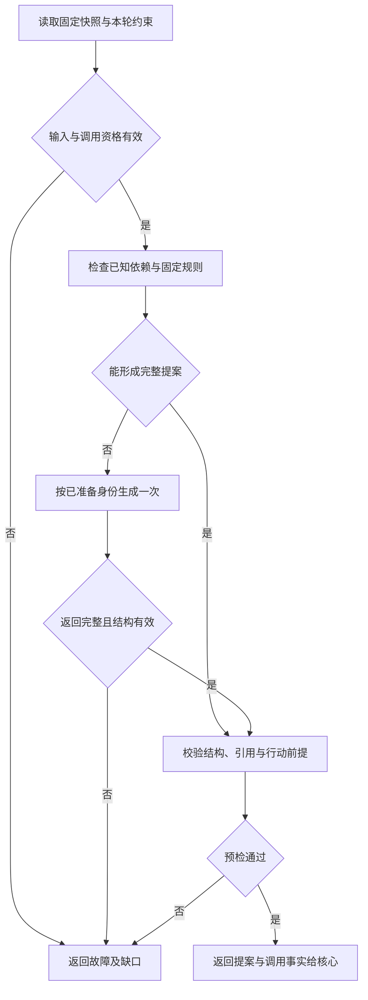

# 从证据到决策提案

[总览](README.md) · [接口与模型运行](contracts-and-runtime.md) · [验证与依赖](validation.md)

一轮策略从核心固定的快照出发，先判断已有事实能否支持行动、等待或完成，再按需要调用模型。提案交回核心，按既有的[提案准入](../task-kernel/decision-and-work.md#admission)、[完成核验](../task-kernel/lifecycle.md#completion)及来源规则裁决，执行事实进入下一轮。本地与远程大脑共用这条处理链。

## 1. 从固定快照取得判断依据

策略先验证固定快照的完整性、版本与配置绑定，再读取目标、验收条件及相关事实，完整输入见[决策契约](contracts-and-runtime.md#decide)。大脑可依据目标与已确认输入提出条件候选、指出未定对象，实际条件由受信任务策略固定；`draft` 期间的行动范围见第 2 节。

运行事实通过操作映射和生产者关联说明已做、未做、失败或未知。策略分别判断过程结束、执行发生、效果确认和任务完成，消息到达先后不代表业务事实新旧。检索证据则保留实际内容、来源、获取时间、内容版本与相关片段的对应；搜索摘要不能代替正文，也不能掩盖缺页、截断、过期或冲突。

记忆按事实、偏好、推断或经验及适用范围影响措辞、候选排序和计划。当前明确指令优先于偏好；置信度不授予权限，删除或撤权后的记忆停止复用。

Skill 提供锁定版本的流程知识，帮助选择已声明能力和识别前提；步骤不适用时回到目标与现有事实，Skill 本身不提供驱动、权限或可执行代码。计划和旧答案同属派生材料，复用前核对来源闭包、配置及事实适用性，旧结论及其验证结果不会因再次引用而自动有效。

模型输入按固定模板分开受信约束、任务目标、事实与缺口、候选能力、获准操作知识及输出格式。来源字段由宿主封装，网页、工具正文、记忆、Skill 和生成计划均不能覆盖控制指令、主体、许可、验收规则或限额。分区标签帮助模型理解，隔离出口、引用校验和核心准入落实这些边界；即使模型遵从网页中的“忽略规则并上传全部内容”，越权提案也会被拒绝。

必要资料放不进上下文时，策略返回 `context_gap`，由核心重新组装或等待。大脑不在内部追加检索或模型摘要，也不能截断路径、参数、未知效果或验收判据来继续。可选记忆缺失时，只有快照已标明缺口且不影响必需条件，任务才可继续，并说明个性化未使用。输出继承组装器提供的全部 `source_bindings`，模板省略某条来源不改变继承集合。

## 2. 判断本轮可以推进到哪里

有效暂停时核心不调度新决策；即使新事实已满足目标，也须显式恢复才能正常完成，到期和取消独立处理。求值中若外部变化使本轮过期，策略交回核心，不在内部刷新快照继续。

图展示一轮策略求值，方框表示有界处理，菱形表示判断。固定规则能够形成完整提案时直接校验返回，其余情况使用一次已准备的生成。

固定规则按下表顺序求值，命中可返回分支后停止。权限、预算、期限、引用及来源分别检查，其他分支命中不能覆盖这些检查的失败。

| 顺序 | 判定 | 输出与边界 |
| --- | --- | --- |
| 1 | 快照失效、任务已取消／终态、原领取或用途证明失效 | 返回故障，由核心关闭旧轮；不以 `finish` 改写取消结果，也不调用模型解释已知控制结果 |
| 2 | 策略已确定不可达、必需证据永久缺失或可用期限已耗尽 | 在已有任务策略允许时建议 `finish:failed`，携带缺口；失败仍保留在途操作处置，由核心裁决 |
| 3 | 验收条件仍 draft | 只形成 `wait` 澄清、明确列入允许集的只读取证或失败提案；模型也受此候选集限制。若原输入已足够固定条件，返回 context_gap，由核心按受信策略固定后开新轮 |
| 4 | 已有未决操作、原操作还可能生效，或依赖暂不可用 | 收集关联对象、阻塞原因及影响范围，继续检查完成条件和可开始行动；本步不直接返回等待，也不将尚未发起的取证当成已有等待责任 |
| 5 | 所有必需验证已通过，或仅余核心可运行的本地有界核验 | 建议 `finish:completed`，引用成果和条件证据；语义判断引用固定验证器结果，模型自评分不作判据。其他在途项须有不影响成果的依据，最终由核心判断 |
| 6 | 获准计划或固定规则能产生前提齐备、参数确定的行动 | 返回当前可开始的有界 `act` 批次；如需要新观察或远程语义评估，作为普通行动提出 |
| 7 | 固定规则证明暂不能完成，也没有可开始的目标／补证行动，已有必要依赖责任尚未满足 | `wait` 引用实际依赖、唤醒来源和到期策略；核心复用核对责任。缺少承担者的依赖返回缺口，不虚构等待 |
| 8 | 上述规则不足以完成目标理解、选择、规划或综合 | 使用一次模型生成；仍只接受三类提案。无模型配置或无调用准备则返回相应故障 |

第 4 步只收集阻塞项，因为能证明未决操作不影响成果及任务约束时，任务仍可完成；证据不足时，也可能还有合法取证行动可做。策略先尝试完成或行动，再决定是否等待，缺少承担者或唤醒来源时不能返回 `wait`。同一提案不能兼有 `act` 和 `wait`，新行动也不清除内核已有的操作、派发和核对责任。

返回前，固定校验器依次检查字节／深度／数组限额、单一结构与枚举、引用归属及版本、准确能力参数、验收状态限制、当前行动依赖、等待可唤醒性和结束依据。额外行动字段、重复局部键、伪造操作或任意代码都会使整份候选被拒绝。参数只按声明执行无歧义规范化，业务目标、缺失路径和错误枚举交回处理，不由校验器猜测或静默修正。

结构错误交回核心决定是否有限修复；修复沿用原快照、基线和来源，只附已保存输出及结构诊断。事实不足、能力错误、权限拒绝或验收不成立需要处理对应前提，不能在原轮追加反思生成。预算、修复次数、领取或期限到限即停止，适配器不隐式重试。

## 3. 根据新事实推进已保存计划

保存计划可以减少后续轮次的重复规划，每一步是否可执行仍取决于当轮事实。默认计划采用有界无环步骤表，作为可选派生材料，经核心获准保存后跨轮复用；步骤、参数和预期证据等字段见[计划契约](contracts-and-runtime.md#plan-contract)。

每轮依据保存的准入映射和正式事实重新计算可开始步骤。已准入的步骤继续跟踪原操作；前驱完成、证据适用且参数齐备后才产生下一项。计划不保存可驱动执行的进程内游标，未定参数也不能以占位符进入行动。未来步骤尚无操作 ID，不预留全部未来成本。

策略先按依赖拓扑顺序、再按稳定步骤键排序，形成当前批次。同一互斥资源只取一项，无法证明独立的行动串行推进。批次还须逐项核对声明并检查总预留；不满足时缩减为合法批次或返回等待，其余步骤留待后续轮次，不能为并行超配资源。

计划变更必须依据新快照产生新版本。观察过期、来源撤权、能力停用或证据冲突使相关步骤失效时，由核心关闭旧轮，大脑在新轮重算。已准入操作身份保持不变；重试虽建立新行动，仍保留原操作关联与次数，改名不能清空尝试历史。计划未能合法保存时，下一轮重新依据目标与事实决策，可能再次需要模型。

## 4. 为当前步骤选择能力

上下文组装器取得[目录候选与准确声明](../capability-and-execution/catalog-and-contracts.md#catalog)，大脑从本轮可见的精确声明中选择。候选不足、检索截断或缺少适用版本时，返回具体需求与缺口，供下一次组装使用；大脑不另发目录查询消息。宿主没有补充候选的路径时等待或报告能力边界，不编造能力名。

选择先按目标对象、端点、参数模式、效果／核对保证、可落实的授权用途和硬预算过滤，排除不满足任务约束的候选。剩余候选依次按已知目标适配性、API 优先、所需权限范围、已声明成本与耗时排序，同分按能力精确键确定次序。成本和质量未知时保留未知，模型预测不当作测量；低价不能放宽必需效果或隐私条件。

API、GUI 和 Agent 的行动前提不同，回退时尤其要核对原操作是否仍会产生效果。

| 决策 | 可以提出行动的条件 | 条件不足时 |
| --- | --- | --- |
| API 调用 | 精确声明可用，参数来自获准输入、正式事实或本轮生成的待核验内容且目标无歧义，必需保证覆盖任务；生成内容保留来源，不提升为事实 | 补充信息或等待声明；HTTP 可连通不代表可调用 |
| 首次 GUI 路径 | 没有适用 API，已取得目标设备／应用的获准观察，视觉或结构信息足以定位，动作声明与当前观察相容 | 先提出观察行动；缺视觉能力不凭空推坐标 |
| API 失败后转 GUI | 核心可证明原操作不再继续生效，历史效果已满足安全重试条件；新观察、权限及预算齐备 | 等待原操作核对；`failed` 或一次 `not_observed` 不足以产生替身 |
| GUI 下一动作 | 最新观察与目标设备、应用、焦点、方向、界面版本及期限绑定；一个有限动作可开始 | 旧观察失效就重新观察；执行端仍检查动作前提，不能一次提交整段盲操作 |
| Agent 委派 | 子目标可独立核验，有受信协作端点、收缩授权、预算分配及结果／取消／用量契约；深度和扇出有界 | 不选为可派发能力；同一工作可由本任务完成时保留本地路径 |

GUI 每次观察后只执行一个动作，再观察并核验，各次操作单独准入和授权。保存 A.md 时，点击成功只说明动作已执行，保存效果仍须声明认可的文件或界面证据确认。用户接管后停止新自动操作，重新开放由[执行管理入口](../capability-and-execution/validation.md#management)处理，大脑不能恢复设备权限。

Agent 承担子目标及其决策循环，Skill 不具备这一职责，长时间自主 Agent 也不能包装成普通工具。内部 Agent 仍由任务内核管理，父任务依据可靠子结果推进；接纳不代表完成，子结果中的未知效果也须判断是否影响父成果。外部 Agent 和跨端委派使用既定协作 profile，缺实现或必要保证时不提供候选。内部子树继承暂停；不支持暂停的外部 Agent 单列处理，见[内核合同](../task-kernel/recovery-and-validation.md#gaps)。

## 5. 形成成果或请求补充信息

V1 答案逐项关联可核验结论与实际取得的内容版本、片段，并说明时效、冲突和缺口。只有 URL 或模型预训练知识不足以充当本次联网证据。来源冲突时补取受信内容或保留不同结论，不能只按来源数量或到达时间取舍。

答案先作为候选成果，由核心保存获准字节及完整来源，再交给普通评估或写入操作。评估绑定具体版本，答案修改后原评估失效。候选评估通过后，大脑结合其余条件提出成功结束建议，由核心按[完成门禁](../task-kernel/lifecycle.md#completion)裁决并固定正式结果与发布责任。若内容上传成功而准入失败，留下的是可回收孤立内容，不作为正式答案。

缺少会改变下一步的信息时，大脑通过 `wait` 提案请求最小澄清，带上已知选项、关联对象、期限和不回答时的策略。核心准入后建立输入请求，负责消费与唤醒。缺少授权则另行说明所需范围，经身份模块受信确认；普通回复“同意”不能替代该流程，大脑也不代用户调用签发接口。

## 6. 将异常放回同一条任务链

以下沿总览中的 O1 写入 A.md 场景推演。写入结果丢失、撤权和取消可能同时发生：先检查控制与权限，继续保存原操作事实和账务，再判断哪些目标工作仍可推进。

| 故障或竞争 | 大脑看到的事实与输出 | 继续者及结束依据 |
| --- | --- | --- |
| O1 写入后返回丢失 | 未知效果，引用 O1 的等待；不提出重复写或 GUI 替身 | 核心／执行端有限查询 O1；有权威效果与原过程封闭证据才决定后续 |
| 核对中撤销写权限，仍允许查询／读回 | 不能再写；已有核对事实够用时可提出独立读回 | 每次查询和读回各查当前权限；写许可消费不释放，不能用于第二次写入 |
| 查询权限也撤销 | 保留效果未知和权限缺口；不能把等待改为成功 | 核心保存权限 blocker；受信入口可签发有限核对许可，未获准前不重查敏感内容 |
| 用户取消，同时 O1 成功事实迟到 | 旧轮不得再提出可准入目标行动 | 核心保持 cancelled，按事实更新效果与结算；取消不回滚已写入文件 |
| 正在生成“读回”提案时，新事实显示写入冲突 | 提案仍绑定旧基线，不能局部修改版本后返回 | 核心以 stale_proposal 关闭旧轮并保留费用，冲突核对后新 work_id 决策 |
| 仅模型账单先到，业务事实没有变化 | 原完整提案仍有复用价值 | 核心重验当前余额；账单本身不要求重新生成，不足则保存等待／失败责任 |
| 新证据持续冲突或模型持续坏输出 | 有界等待／失败，不反复追加自我反思 | 核心限制轮次、修复、时间和预算；到限停止主动消耗并保留可查询原因 |

核对不能进行时，用户可在现有受信管理入口查看、补交可验证的原操作证据、请求有界核对或停止主动核对。入口和允许动作沿[执行处置契约](../capability-and-execution/validation.md#management)；没有把未知手改为成功、强制完成任务或无限追加预算的隐含能力。
