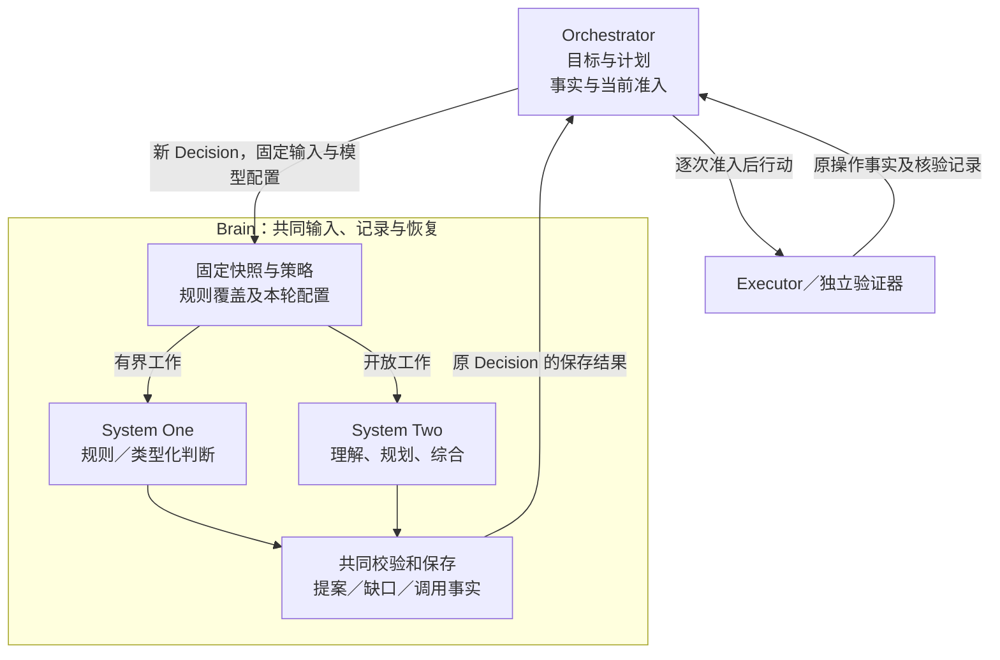

# 大脑：双系统协作与可恢复决策

[架构总览](../README.md) · [模块与数据 UML](../uml-models.md#brain) · [可编辑 UML 图册](../diagrams/uml-models.drawio)

Brain 根据当前目标、约束和事实提出下一步；Orchestrator（下文简称 H）保存任务状态，裁决行动准入和最终完成。参考实现以 System One（S1）处理规则与有界判断，以 System Two（S2）处理理解、规划和综合，二者通过持久任务事实跨轮协作。本模块承担 C1，并通过上下文、取证、能力选择和反馈参与 C2–C5；替换、权限与评测分别遵守 C6–C9、A1–A4。

**当前为设计规格，尚无服务、模型质量或容量实测。** 规则 shortcuts 属参考实现；类型化 S1 路径默认关闭，须先落实阶段识别、固定配置、适配器、费用依据、升级共同提交及隔离评测。任一启用条件缺失时不选择该 typed profile，沿已有规则或 S2 路径处理；权限、必要事实和预算本身不满足时，仍按各自缺口等待或收尾。供应方能力与启用条件见[决策路径](decision-paths.md)。

## 阅读路径

| 顺序 | 文档 | 集中定义的内容 |
| --- | --- | --- |
| 1 | 本页 | 模块分工、双系统协作、上下文与证据、对外契约和恢复保证 |
| 2 | [决策路径](decision-paths.md) | 规则覆盖、类型化候选与答案映射、拒判升级、调用成本及启用评测 |
| 3 | [实现设计](implementation.md) | 组件、输入正文、持久记录、事务、内容发布、有限计划、部署及故障实验 |

精确线字段查[机器契约](../contracts/schemas/protocol.schema.json)和[方法登记](../contracts/schemas/methods.json)；外部模型事实与性能证据查[System One 调研](../../research/system-one-models-2026-09-28.md)。任务条件与完成规则归[任务运行](../orchestrator/README.md)，工具契约归[执行](../execution/README.md)，内容来源与用途归[记忆](../memory/README.md)。

## 1. 模块分工与双系统选择

S1 是快速决策角色，包括零模型的确定性规则和一次模型推理的类型化判断；Jev 等“System One 模型”只对应后一种实现。S2 是审慎决策角色，通过通用模型完成开放理解、规划、综合和重规划。角色名称不保证每次 S1 都更快，也不保证 S2 判断正确。

| 角色 | 适用问题与工作 | 产出及边界 |
| --- | --- | --- |
| S1 | 问题、候选、输出范围及接纳规则明确；按已知事实映射下一步、选择候选或作单维判断 | 同一 Proposal 契约或明确缺口／拒判；分数保持模型派生性质 |
| S2 | 尚需理解完整约束、分解目标、处理来源冲突、综合正文或修订计划 | 条件、计划、行动及成果建议；不能修改活跃规则、阈值或自行批准行动 |
| Orchestrator | 保存目标、计划、控制与已归并事实，选择本轮配置，调度及准入 | 保存唯一任务决定；已有准确计划直接物化，不人为创建 S1 Decision |
| Executor／验证器 | 执行获准行动，取得实际效果或按声明方法核验条件 | 保存原操作及证据；模型建议、网络答复和客观效果分别成立 |

图表示单一 Brain 的职责与交接，不规定端云部署。S1、S2 共用输入、校验、记录与恢复，独立的模型池可分别扩容；软件组件见[实现分工](implementation.md#module-shape)。Memory 与能力目录提供获准材料和准确声明，由 Orchestrator 组装进固定快照。

| 关键选择 | 推荐与依据 | 代价与改选条件 |
| --- | --- | --- |
| 单一 Brain，跨轮协作 | 两种角色共用生命周期和调用恢复，Orchestrator 统一检查当前控制、权限及预算 | 增加轮次交接；参数确定的独立行动可合批，已有计划可直接物化 |
| 规则优先，按阶段固定一个模型 | 已有答案的映射不需推理；S1 可采用结果直接推进，开放问题用 S2，无须前置分类调用 | Brain 维护覆盖范围和校准；陌生阶段保留 S2，双模型复核仅在独立评测证明增量价值后另行设计 |
| 固定输入、输出作建议 | Brain 可独立替换，外部效果和任务决定仍归原负责方 | 过期提案必须重新决策；优化事实依赖范围不能放宽当前准入 |
| 客观效果与开放质量分开验证 | 文件或资源状态可核对，研究深度等需声明评估方法或用户验收 | 开放任务无统一客观正确保证，专用验证器的保证需独立证据 |

单轮 Brain 可以独立部署，调用云模型不要求部署远程 Brain。替换实现可以调整内部算法，仍须满足提案独立准入、原 Decision 可查询、调用可恢复及效果独立取证；默认实现保持每个 Decision 零次或一次物理模型推理。

## 2. 从单轮提案到跨轮协作

用户可以提出此前没有专用流程的任务。S2 区分明确要求、假设与缺口，提出条件和步骤；通用解释器不要求每接入一个工具便安装专用任务流程。条件不完整时，已有授权且不依赖该歧义的取证可以继续；收件人、金额或覆盖范围等会改变效果的歧义须先澄清，不能为完成任务删除约束或扩大授权。

Orchestrator 按固定任务策略保存快照、decision_id、已选 profile 及必要预算；Brain 检查输入和期限，先尝试规则，未覆盖才使用本轮指定模型。已知阶段依据受信目标结构、准确来源操作、待推进步骤和完整输入形状识别；无法无歧义识别则选 S2，不把模型生成的阶段名称当配置。两处使用兼容的固定策略版本，Brain 不能在同一 Decision 内暗换模型。

本轮先处理控制限制与未知效果，再识别关键歧义和必要事实，随后选择前提齐备的行动，最后才提出完成。输出经结构、引用、参数和长度校验后保存，Orchestrator 按当前修订独立准入。Brain 的 `completed` 只表示本轮结果已保存，不表示任务成功。

### 2.1 交接依据与继续责任

| 交接 | 输入与保存事实 | 成功点及失败后的继续者 |
| --- | --- | --- |
| Orchestrator → Brain | 固定快照、原决策身份、配置、费用与用途依据 | Brain 保存原决策及推进责任；失答复由 H 查原 Decision，Brain 沿原记录恢复，均不因失联换身份重做 |
| S2 → 下一轮 S1 | Brain 保存条件／计划提案；H 接受后将准确版本与必要事实纳入新快照 | 已安装规格覆盖当前阶段后才可选 S1；条件改变目标修订时，同份提案的行动和 plan_delta 全部失效，按[提案消费](../orchestrator/implementation.md#proposal-consumption)另开决定 |
| S1 → 下一轮 S2 | Brain 保存原失败与调用；H 保存链根、升级消费及新决定责任 | 满足[固定升级规则](decision-paths.md#43-拒判错误和升级分别处理)才发新 Decision；格式错误、缺事实、权限或未知效果分别处理，不靠更强模型掩盖 |
| 执行 → 下一轮 Brain | 原 owner 保存操作输出；H 归并准确事实与缺口 | 效果核清且事实适用才推进；只更新下一轮快照，不改在途 Decision。原执行不明由 Executor 核对 |
| 已接受计划 → 后续行动 | 准确模板、依赖及前项事实 | H 按[有限计划](implementation.md#finite-plan)物化并逐项准入；有依赖的步骤等待真实结果，计划不预先授权行动 |
| 上下文补充 → 新快照 | Memory／目录等返回有界获准材料、版本与缺口 | H 保存补充结果并去重；不可用依赖按原责任等待，不用模型调用探活 |

S2 可以借条件、计划和逐步取证，使下一阶段进入 S1 的覆盖范围。合法拒判升级后的 S2 读取当前问题、候选及获准诊断；原 S1 答案明确标为模型判断，读取仍须来源与用途资格。同一未关闭链不能反复换题面或候选重置升级次数；关闭条件和重新选择规则见[决策链管理](decision-paths.md#43-拒判错误和升级分别处理)。

### 2.2 研究并保存报告

下表按实际处理顺序说明角色接续；D1–D4 是场景标签，修订、补证或修复可增加决定。完整来源、动作及恢复见[贯穿场景](../walkthrough.md)。

| 阶段 | 负责路径 | 产出与交接 |
| --- | --- | --- |
| D1 理解 | S2 | 提出完整比较和文件条件；H 接受变化后另建当前快照，原行动／计划作废 |
| D2 搜索 | S1 规则，超出覆盖时 S2 | 已有准确产品、版本和维度时填查询模板；H 准入搜索并归并真实候选 |
| D3 选页 | S1 规则或类型化模型 | 在限定候选上选择待读取页面；合法拒判可按策略另开 S2 决定，保留原费用 |
| 取得正文 | Executor／H | 保存准确正文、来源与缺口；搜索摘要和评分不冒充内容证据 |
| D4 综合 | S2 | 综合正文，提出评估、通过后写入、读回的有限计划 |
| 核验与保存 | 独立验证器、Executor／H | 评估、写入、读回各有独立 operation_id 并依赖实际前项结果；已有计划无需再次推理，H 核清全部条件后决定完成 |

评估不通过时修订来源或候选，再评估准确新版本，不能只更换评分标签。写入答复丢失先核对原操作，不能改用 GUI 保存绕过未知效果。读回版本或摘要不符时保留原写入事实，不能拼接另一版本的质量记录；取消后的迟到证据只归并原效果，任务仍保持取消。分支见[写入与读回异常](../walkthrough.md#write-recovery)。

## 3. 上下文、证据与完成建议

两种角色读取同一任务事实的不同获准视图：S1 取当前问题、完整约束、候选与必要事实，S2 按理解或综合需要读取更广材料。目标和计划归 Orchestrator，操作事实归原 owner，Decision／ModelCall 归 Brain，长期经验归 Memory；不各自维护另一份真实状态。旧结果只在准确版本、来源及当前资格满足时复用，曾经高分不构成跨快照缓存规则。

### 3.1 上下文补充与能力选择

上下文按“用户目标和硬约束 → 当前控制与未知效果 → 必需事实与证据 → 相关记忆 → 可用能力 → 辅助历史”组织。超出模型窗口时先裁掉无关材料，保留内容引用及摘要来源；硬约束、当前未决事实或必要契约仍放不下便返回缺口，不能截断后假装输入完整。摘要是派生内容，不继承比原文更宽的使用权限。

能力较少时可直接提供完整声明；面向 1000 项以上 API，先按领域、资源和意图检索候选，再读取准确版本及实例绑定。名称相似或向量命中不能证明语义相同。大脑提出 `act` 前必须看到所用能力完整输入、效果、重复规则及所需授权；Orchestrator 准入时再次核对固定版本。目录不完整、权限不符或实例未就绪时，返回明确缺口，不猜参数或回退到任意网络调用。

`need_context` 用于请求记忆、能力声明、已有操作事实或已知内容片段。Orchestrator 的组装器只执行有界、只读且获准的补充；新的网页搜索、内容抓取、设备观察等外部取证通过普通执行操作取得，以保存用量、来源和失败事实。大脑不得借补充上下文通道自动运行工具。

Orchestrator 对补充请求按查询、范围、已有版本组成摘要去重，记录结果为新增、为空、拒绝或不可用。相同快照下重复相同请求不重新查询；没有新事实却重复索取材料时返回一次该事实供大脑选择改写问题、请求用户输入或失败。外部依赖暂时离线由持久工作等待恢复，不能靠反复模型调用探活。

### 3.2 证据、个性化与完成建议

搜索摘要只用于定位候选；来源支撑必须来自实际取得、可以定位的内容。取证结果保留来源、获取时间、内容版本与限制，冲突的来源分别呈现，不能仅凭模型偏好删除。时效性取决于来源发布时间、当前获取时间和任务要求，模型知识截止不能替代本次取证。

个性化材料必须与当前任务相关，并能追溯至用户声明或获准记忆。偏好可以改变排序、详略或候选选择，不能改写客观证据。模型、网页、Skill 和外部 Agent 返回内容均作数据处理；其中要求扩大权限、泄露信息或忽略用户约束的指令不进入 Orchestrator 的受信策略。

完成提案绑定具体成果版本、条件及证据。`verified` 表示客观条件已核验；`assessed` 还依赖声明的方法评估开放质量；`user_accepted` 指用户验收该版本的主观部分。大脑可以推荐完成依据，最终事实由 Orchestrator 判断。未知外部效果、未满足的客观约束和欠缺的授权，不能通过质量评分或用户主观满意覆盖。

条件检查、验证实现选择及报告采信按[任务验证主线](../orchestrator/verification.md)执行。Brain 只提出准确候选、检查需求或修订建议；Orchestrator 从固定策略与安装锁的集合选择实现，普通评估操作继续经过当次准入。一次有效不通过不能通过换评估器或反复评分消除；候选改变后须取得对应版本的依据，无法解决的客观证据冲突保留 unknown。

## 4. 模型调用恢复与资源边界

Brain 将 `decision_id` 映射至零个或一个 `model_call_id`，在发送前保存输入摘要、模型版本、最大输出、计价版本和启动准备。模型处理、远端披露及其他必要用途分别取得[使用回执](../security/README.md)，其中有限动作身份映射为 `model_call_id`，用途消费另用稳定 `use_id`；授权答复不明先查原使用，不启动模型。

最终请求编码后，发送门禁还须持久保存实际处理来源、接收方、用途身份和请求摘要，禁止保存的原文仍不落库；无法留下最小披露依据时不发送。发送与供应商处理无法跨网络原子提交：Brain 在发出后崩溃，即使没有请求号，也必须保留“可能已发送”的事实。查询能力存在时按原请求查询；不存在时将本次决策明确结束为 `provider_result_unknown`，由 Orchestrator 决定是否用新身份再试。

Decision 成为终态后，原供应商仍可能给出可信的上调账单。Brain 保存原 ModelCall 的新费用修订时同步建立对原 Task 的持久交回责任，以固定 `task.billing_reconcile` 命令唤醒 Orchestrator 的原计费槽；丢答复查原命令。Orchestrator 主动读取同一 Decision／ModelCall 的账单并按原预留差额入账，Brain 的终态和此前交回 job 已完成都不结束这项新责任。一个物理收费若已由 Grant UseSettlement 作为 Task 计费权威，Brain 的用量只作证据，不能再扣一遍。

普通文本或聊天模型 API 可以接入。模型适配器将输入编码为供应商格式，完整输出采用[内部产出格式](implementation.md#generated-content)：新报告或计划先用本轮局部标识关联，Brain 保存获准正文后回填准确 ContentRef，才形成本页的公共 Proposal。模型不生成正文摘要或内容 owner 身份；只引用已有材料时新正文集合可为空。原生结构化输出和工具调用编码属于可选优化，适配器不运行模型返回的工具。类型化判断通过[固定候选映射](decision-paths.md#41-固定配置与职责)构造相同提案，不要求模型生成正文。本版配置须关闭 SDK、代理和网关的透明重试；多物理请求模式即使可逐次计量，也不进入一轮至多一次推理的配置。逐次可观测是计量前提，不放开单轮限制。

| 资源 | 本方案能保证什么 | 超时后的处理 |
| --- | --- | --- |
| 任务费用 | 可信单次上界支持严格预留；无可信上界仅在原 Task 已保存本人接受估算、费用 Grant owner 与原 Task 同受信提交域且在线允许、无 allocation 时使用有限估算额 | 未知保持原预留，不因超时释放；可信最终账单沿原调用只记一次，超估算或违反声明上界均如实入账并封闭新计费，不能将估算称硬上限 |
| 本地物理并发 | 适配器控制当前进程实际持有的请求或推理执行槽 | 套接字关闭或本地执行确已结束即可释放本地槽；这不证明供应商已停止推理 |
| 远端物理并发 | 仅在供应商提供可核验停止或确定执行上界时，才能声明硬上限 | 普通 API 只约束发起速率、客户端并发和费用，不虚称可证明远端并发；需要硬保障的部署拒绝不满足该能力的后端 |
| 故障放大 | 每用户、模型池设置有限新请求速率、失败退避和熔断 | 用新身份重试仍计入速率、预算与修复次数；供应商持续不明时暂停该池新调用 |

此处将不明费用与物理槽分开，是为了让普通模型 API 可用，同时准确界定保障。反例是“调用超时便退回费用，再无限重试”，会超支；另一个反例是“账单未返回便永不释放本地槽”，会让已关闭的连接永久占住服务容量。两者都不能作为恢复策略。

取消及暂停由 Orchestrator 关闭原决策的采纳资格，并通知 Brain 停止未启动调用、尽力终止在途调用。迟到输出可以按当前用途权限留作原调用诊断，不能成为下一轮提案；迟到计费仍沿原调用对账。取消成功只表示 Brain 不再推进该决策，不表示供应商已经停止或不再收费。

调用准备、发送门禁、内容发布及费用交回的提交顺序见[持久实现](implementation.md#key-sequence)，公共框架接入见[接纳与有界工作](implementation.md#reliable-work-integration)。

远程 Brain 在接纳时保存输入、固定配置及后续责任，Orchestrator 保存查询工作；通知只负责唤醒。Brain 重启后从原记录恢复，不能因为 worker 租约换主便重复发送模型请求。Brain 的持久记录与 Orchestrator 可在同进程共库提交；独立部署时使用同一行为契约并分别持久化。

## 5. 契约查阅

以下为本模块权威字段定义。共同命令、错误和认证见[共同契约](../contracts/README.md)；认证主体来自会话，输入不能自行选择租户。整数修订单调增加，内容引用采用[记忆与内容契约](../memory/README.md)。声明未标为可选的字段必须提供；本地调用保持相同含义。

| 方法 | 输入 | 持久成功、返回及调用方后续 |
| --- | --- | --- |
| `brain.decide` | `DecisionRequest` | `accepted`：Brain 已保存原决策及推进责任；`applied`：同一业务记录已有终态，输出 `DecisionRecord`。收到回执不代表提案被 Orchestrator 采纳 |
| `brain.get` | `decision_id` | 返回当前 `DecisionRecord`；Orchestrator 丢失答复后先查询。确证 `not_found` 后可按原命令重投，不能换身份绕过未知记录 |
| `brain.cancel` | `decision_id, reason` | 保存取消和停止启动责任；返回当前记录及在途调用状态。Orchestrator 继续查询原记录与用量，不能假定费用归零 |

| `DecisionRequest` 字段 | 定义与约束 |
| --- | --- |
| `decision_id, task_id, orchestrator_id` | Orchestrator 生成的不可变身份；一个身份只能对应一个输入摘要 |
| `snapshot_revision, context_ref` | Orchestrator 任务修订及固定输入内容；包含当前目标、条件、计划、正式事实、假设和缺口，明确区分其性质 |
| `capability_refs` | 本轮可见的准确能力声明、绑定版本引用；空集合允许纯文本决策，但不能凭空产生能力调用 |
| `model_profile_ref` | 已激活的模型适配器与固定配置版本；确定性决策可以不用模型 |
| `limits` | `deadline, max_output_tokens, max_actions, max_context_requests, cost_reservation_ref`；数量均非负且由 Orchestrator 限定 |
| `usage_authorization_refs` | 本轮对全部输入进行处理、必要远端披露和模型调用的许可依据；实际出口再次复核 |

| `DecisionRecord` 字段 | 定义与约束 |
| --- | --- |
| `decision_id, revision, snapshot_revision` | 原身份、本记录修订及原输入修订；不允许改绑新快照 |
| `status` | `accepted / running / completed / failed / cancelled`；后三者终态不可逆。迟到用量可增加记录修订，不改变终态 |
| `proposal` | 仅 `completed` 有效，见下表；模型输出通过校验仍须 Orchestrator 独立准入 |
| `model_call` | 可选，含 `model_call_id, provider_request_id?, state, usage, usage_final`；`state=prepared / sent / returned / unknown / stopped`，`stopped` 须供应商或本地执行证据 |
| `error` | `failed` 时必需；采用共同错误格式并给出可执行恢复建议。`unknown` 不能转换为“未计费” |

`proposal` 共同字段为 `kind, rationale, evidence_refs, assumptions, plan_delta?, requirements_proposal?`。`rationale` 是可供用户和实现者理解的短理由，不要求保存模型隐含推理。`plan_delta` 引用原计划版本并提出完整下一版本；首次计划用 `base_plan_ref=null` 与任务当前无计划的事实比较，下一版本从 revision=1 开始。Orchestrator 决定是否应用，有限计划的执行依赖、条件通过前提及未来输出绑定见[计划正文](implementation.md#finite-plan)。`requirements_proposal` 含 `base_goal_revision, requirements[]`，逐项复用[Requirement](../orchestrator/README.md#records)；条件解释的接受及整份提案消费按[任务准入](../orchestrator/implementation.md#proposal-consumption)裁决。

| `kind` | 专属字段与含义 |
| --- | --- |
| `act` | 两条互斥路径：非空 `actions[]` 直接提出独立行动，不带 plan_delta；或 `actions=[]` 配合法非空计划的 plan_delta，只安装计划并保存后续 decide 责任。直接行动包含本轮局部 `action_key`、`type, purpose, requirement_refs, evidence_refs`；invoke 另含准确能力、绑定及 arguments，delegate 另含[协作请求](../collaboration/README.md)。数量不超过 max_actions，不能把同一行动同时交给两条准入路径 |
| `need_context` | `requests[]`：`request_key, kind, query, scope_refs, reason, max_items`；`kind=memory / capability / operation / content`，不得嵌入任意代码或外部动作 |
| `request_input` | 用户可理解的问题、选项或所需材料，以及影响哪些条件；具体持久输入请求由[交互](../interaction/README.md)创建 |
| `complete` | `artifact_ref, requirement_refs, completion_basis, assessment_refs`；版本、证据和保证强度按[任务运行](../orchestrator/README.md)核验 |
| `fail` | `reason, unmet_requirement_refs, recoverable_advice`；Orchestrator 结合任务当前事实决定失败，不能把暂时失联直接当作无可恢复 |

| `ModelProfile` 字段 | 定义与约束 |
| --- | --- |
| `profile_id, version, adapter_ref, provider_model` | 不可变配置、供应商模型或本地权重版本；结果记录精确版本，不用滚动别名充当验收版本 |
| `input_modalities, context_limit, output_limit` | 适配器真实支持的输入与上限；视觉输入不可静默降级为缺图文本 |
| `output_encoding` | `json_text / native_structured / native_tools / typed_decision`；所有编码最终转换为相同提案并本地校验；typed_decision 为可选设计，尚待实现及激活 |
| `decision_spec_ref` | 可选；typed_decision 时必需，指向安装配置中不可变的[决策规格](decision-paths.md#41-固定配置与职责)，固定候选构造、问题、接纳条件和提案映射；其他编码省略 |
| `query_support, cancel_support, cost_upper_bound` | 原请求查询、停止与可信计费上界；不支持须显式声明，费用无上界时不得声称硬费用保障 |
| `local_concurrency, start_rate_limit, timeout` | 本地执行控制；不等同于供应商已接受的实际在途量 |
| `processing_location, disclosure_policy_ref` | 输入处理与外发目的地，受[授权规则](../security/README.md)约束 |

`invalid_output` 可在剩余次数内用新决策修复；规则冲突须先修复策略。类型化配置的 `unsupported` 或合法答案不满足接纳条件的 `precondition_failed` 均使用 `retry=after_change`，按[固定升级规则](decision-paths.md#43-拒判错误和升级分别处理)另建 Decision，不能在同轮追加模型调用；`stale_snapshot` 要重新组装；`context_incomplete` 先补资料；`forbidden` 等待有效授权或改用获准材料；`provider_result_unknown` 先查询或按上述规则另开计费调用；`deadline_exceeded` 不再启动推理。Orchestrator 不按错误名字推断外部操作效果。

## 6. 验收与演进边界

| 用例 | 前置条件与故障 | 必须观察到的结果 | 对应目标 |
| --- | --- | --- | --- |
| B-01 通用任务 | 接入一个具备完整契约的新工具，提出此前未写专用流程的任务 | 通用解释、准确能力检索、准入和证据完成；内核无需增加工具专用分支 | C1、C4、C6 |
| B-02 单轮恢复 | 供应商已处理，Brain 收答复前崩溃 | 原决策查询不产生第二次推理；普通 API 的不明费用保守记账，新尝试有新调用身份 | C5、C8 |
| B-03 过期建议 | 推理中暂停、撤权或补入改变决策的事实 | 原结果不获行动准入，诊断和计费仍可关联；恢复后按新快照决定 | C5、C7 |
| B-04 引用与隐私 | 搜索片段不含结论、材料互相冲突或云模型无披露许可 | 不伪造来源或消除冲突；外发被拒或选择获准本地后端 | C2、C3、C7、V1 |
| B-05 有限补充 | 目录返回空集合，模型连续索取相同材料 | 同快照不重复查询，有限轮后转输入请求或明确失败，无模型忙循环 | C1、C5 |
| B-06 独立替换 | 用普通 JSON 文本模型、原生结构输出模型及远程 Brain 分别运行冻结集 | 相同外部契约、控制和预算规则成立，单独报告质量、费用与延迟差异 | A1–A4、C8 |
| B-07 完成依据 | 客观效果不明，但质量评估高分或用户满意 | 不标任务成功；修正后的成果须有对应版本证据 | C1、C4、C7 |
| B-08 依赖行动准入 | 评估返回后暂停或修订目标；写入后读回另一版本 | 后续操作未取得当次准入便不启动；旧评估不证明新版本，已发生写入仍保留 | C1、C5、C7 |

首次调用正确率、有限重试成功率、模型选择与上下文压缩收益由[评测方案](../evaluation/README.md)取证；表中是待实施的运行验收，文档审查不能证明达标。默认不引入多模型竞速或隐式代理循环，是否增加须以冻结集的可复现收益和新增代价判断。

### 6.1 经验进入快速能力

从获准轨迹及反例中可以提出规则、Skill、问题模板或校准配置候选，沿[评测与受控发布](../evaluation/README.md)完成登记、冻结对照、独立判定、受信批准、有限激活和监测／回退。S2 可辅助提出候选和待核标签，不能独自充当真值、读取正式保留集反馈后继续择优，或自行修改活跃规则。代码候选还须维护者审查，资料保存、提取和训练分别核对用途。

标注、反例覆盖和版本维护由实现与评测负责方承担；问题边界持续变化、标签不足或维护成本超过调用收益时，继续用 S2。蒸馏和训练是后续可评估实现，不因双系统分工自动成立。

### 6.2 通用子问题委派的后续范围

当前协作限定已知任务阶段。计划的 instruction 只表达待展开目标，没有通用 S1 问题模板或 profile 指派字段；不能将自然语言指令作为隐藏配置。Proposal 也没有通用局部答案类型，step_output 只解析前项操作／委派输出，S1 评分不能直接完成一个计划步骤。

如果多种任务反复需要任意 S2→S1 结构化委派，应另行定义有限模板引用、输入／候选绑定、规格版本、派生答案制品及步骤完成依据，并同步计划 Schema、产出校验和 H 接纳规则后再启用。首期固定阶段映射更简单，代价是新题型需要开发接入；在该需求成立前，不把新字段塞入 instruction／assumptions，也不引入第二套子任务状态机。
