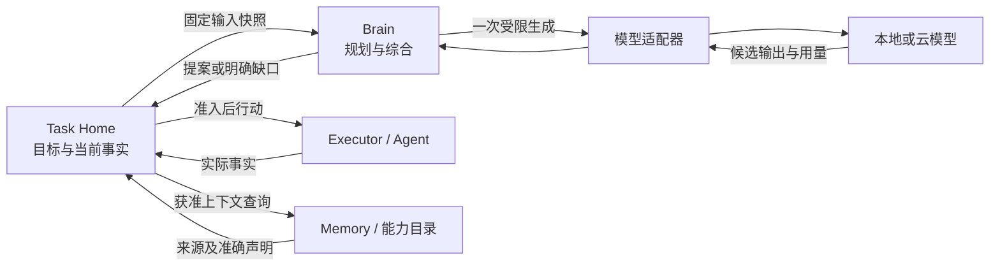
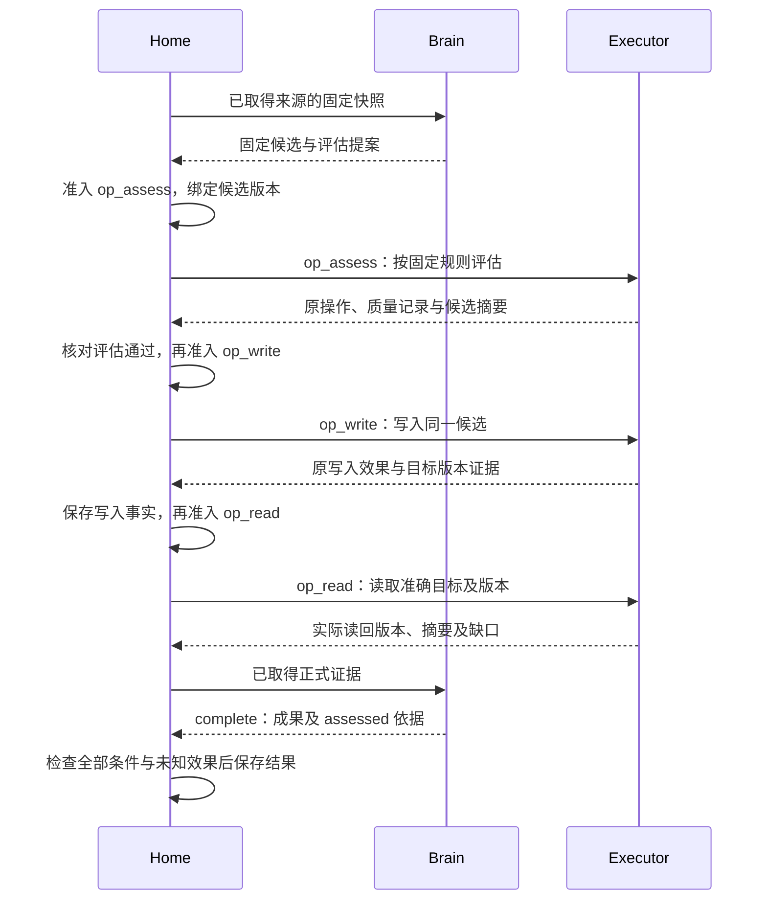

# 大脑：可恢复的单轮决策

大脑根据目标、约束和已取得的事实提出下一步，Task Home 负责决定是否执行及任务是否完成。本模块承担 C1，并通过上下文、取证、能力选择和反馈参与 C2–C5；替换、权限与评测分别遵守 C6–C9、A1–A4。当前为设计规格，尚无运行质量或容量实测。

本页定义大脑调用、模型适配、上下文补充和决策输出；任务条件与完成规则见[任务运行](../task-runtime/README.md)，工具契约见[执行](../execution/README.md)，来源与用途见[记忆](../memory/README.md)。单轮 Brain 可以独立部署；调用云模型并不要求部署远程 Brain。

持久成功、状态、权限和恢复规则是所有实现须满足的契约；默认的单模型选择、上下文顺序与装配方式是参考实现选择。替换实现可以调整内部算法，不能改变提案只由 Home 准入、原调用可查询以及效果需独立取证的边界。

## 实现阅读路径

先阅读本页的职责与行为，再读[实现设计](implementation.md)：固定上下文、单轮提案与调用恢复。实现设计规定内部记录、事务、算法与故障实验；[机器契约](../contracts/schemas/protocol.schema.json)和[方法登记](../contracts/schemas/methods.json)提供精确线字段。

实现阅读顺序为[软件形状与依赖](implementation.md#module-shape) → [核心对象流转](implementation.md#data-flow) → [发送与恢复时序](implementation.md#key-sequence) → [生产可用性与性能](implementation.md#production)。Brain 的工作者与推理池可以分别扩展，任务调度和行动准入仍归 Home。

本页与实现设计均为待实现规格，静态序列通过不代表服务、隐私隔离或恢复机制已经运行。

## 1. 让通用任务进入闭环

用户可以直接提出“比较两种方案并给出建议”或“查资料后保存一份报告”。Home 接纳目标后，大脑区分用户明确要求、当前假设与需要澄清的缺口，提出验收条件和可开始的步骤。通用解释器可以组织任务，不要求每接入一个工具便安装专用任务流程。能力提供参数、效果和验证契约；行业流程只在通用机制不能表达领域约束时作为扩展加入。

条件尚不完整时，已有明确授权且不依赖该歧义的取证可以继续。收件人、付款金额、覆盖范围等会改变外部效果的歧义必须先澄清。大脑不能把“用户希望完成”转换为额外许可，也不能为了方便完成而删除用户约束。条件修订及用户确认由 Home 保存；具体接受规则以[任务运行](../task-runtime/README.md)为准。

| 决策 | 推荐与依据 | 代价与改选条件 |
| --- | --- | --- |
| 一次调用给出一个有界提案 | Home 能在每轮行动前应用最新控制、授权和预算；结果不明不会被模型自行换工具重做 | 多轮增加调度和上下文成本；可把参数确定且相互独立的行动合成一批，仍逐项准入 |
| 先用单模型和确定性规则 | 固定计划中的纯数据映射、无条件等待无需模型；理解、规划和综合才生成 | 调用次数可能高于模型内部工具循环；若实测需要并行模型，按独立物理调用计费和评测后增加 |
| 客观效果与开放质量分开验证 | 文件内容、资源状态可核对；研究深度和写作质量需要声明评估方法或用户验收 | 开放任务没有统一“客观正确”保证，必须展示评估依据；专用验证器可提高特定领域保证 |
| 输入快照固定，输出只作建议 | 大脑可独立替换，Home 仍保存唯一任务决定 | 过期提案需要重新决策；快照失效频繁时优化事实依赖范围，不让大脑直接修改任务 |

下图表示一轮内的调用关系；持久责任归调用方或处理方，框的位置不表示端云部署。

| 发起方 → 处理方 | 交接输入 | 持久成功点 | 失败后由谁继续 |
| --- | --- | --- | --- |
| Home → Brain | 固定快照、原决策身份、费用与用途依据 | Brain 保存原决策及推进责任；完成时保存原快照上的提案或错误 | Home 查原决策；Brain 恢复原调用，二者都不因失联自动换身份重做 |
| Brain → 模型适配器 | 原模型调用、准确配置与有限输入 | Brain 在交给适配器发送前保存调用准备；供应商实际处理仍是外部事实 | Brain 按[模型恢复规则](#model-recovery)核对或记录不明费用 |
| Brain → Home | 提案、快照修订及精确证据 | Home 提交提案消费与获准后续工作；提案返回本身不代表被采纳 | Home 拒绝过期提案或调度下一轮，Brain 不直接补发工具调用 |
| Home → Memory／能力目录 | 获准、有界的上下文请求 | 负责方返回当前可用资料及缺口；Home 保存本轮所用版本 | Home 查询或等待负责方恢复，不用模型调用代替依赖探活 |

表中只定义交接责任；方法及完整输入字段集中在[契约查阅](#brain-contracts)，工具行动的持久接纳与效果保证由[执行模块](../execution/README.md)定义。

## 2. 每轮决策怎样推进

Home 保存快照、决策身份和所需预算，再调用 Brain。Brain 先检查输入完整性和期限；可按确定性规则直接返回，否则调用一次已选模型。模型候选必须通过结构、引用和长度校验，随后 Brain 返回同一快照上的提案。Home 再依据当前任务修订、控制与授权判断是否接纳。Brain 的校验无法替代 Home 的准入。

默认单轮至多发起一次物理生成。格式错误、截断或无效引用返回 `invalid_output`，Home 可以在该轮剩余修复次数内发起新 `decision_id`，附上机器可读错误；这次调用重新占用费用额度。同一身份重投只能取回原结果，不能隐含生成第二次。修复次数、总轮数、期限和预算同时约束循环，任一耗尽便停止相应推进并如实报告。

决策按以下顺序检查，避免同一问题被不同动作掩盖：先识别影响当前行动的未知效果及控制限制，再检查关键歧义和所需事实，然后选择已经具备前提的行动，最后才提出完成。任务仍有未满足条件但没有可开始步骤时，应说明可补充的信息或失败原因；不能以空行动反复消耗模型。

计划是供后续轮次复用的工作说明，记录步骤目标、依赖、已知证据和假设。它不预先授权行动，也不要求模型预测完整未来。独立分支可以并行，依赖某次操作实际结果的步骤必须等待该结果。Home 保存计划版本，下一轮只需取得当前相关部分。

### 上下文补充与能力选择

上下文按“用户目标和硬约束 → 当前控制与未知效果 → 必需事实与证据 → 相关记忆 → 可用能力 → 辅助历史”组织。超出模型窗口时先裁掉无关材料，保留内容引用及摘要来源；硬约束、当前未决事实或必要契约仍放不下便返回缺口，不能截断后假装输入完整。摘要是派生内容，不继承比原文更宽的使用权限。

能力较少时可直接提供完整声明；面向 1000 项以上 API，先按领域、资源和意图检索候选，再读取准确版本及实例绑定。名称相似或向量命中不能证明语义相同。大脑提出 `act` 前必须看到所用能力完整输入、效果、重复规则及所需授权；Home 准入时再次核对固定版本。目录不完整、权限不符或实例未就绪时，返回明确缺口，不猜参数或回退到任意网络调用。

`need_context` 用于请求记忆、能力声明、已有操作事实或已知内容片段。Home 的组装器只执行有界、只读且获准的补充；新的网页搜索、内容抓取、设备观察等外部取证通过普通执行操作取得，以保存用量、来源和失败事实。大脑不得借补充上下文通道自动运行工具。

Home 对补充请求按查询、范围、已有版本组成摘要去重，记录结果为新增、为空、拒绝或不可用。相同快照下重复相同请求不重新查询；没有新事实却重复索取材料时返回一次该事实供大脑选择改写问题、请求用户输入或失败。外部依赖暂时离线由持久工作等待恢复，不能靠反复模型调用探活。

### 证据、个性化与完成建议

搜索摘要只用于定位候选；来源支撑必须来自实际取得、可以定位的内容。取证结果保留来源、获取时间、内容版本与限制，冲突的来源分别呈现，不能仅凭模型偏好删除。时效性取决于来源发布时间、当前获取时间和任务要求，模型知识截止不能替代本次取证。

个性化材料必须与当前任务相关，并能追溯至用户声明或获准记忆。偏好可以改变排序、详略或候选选择，不能改写客观证据。模型、网页、Skill 和外部 Agent 返回内容均作数据处理；其中要求扩大权限、泄露信息或忽略用户约束的指令不进入 Home 的受信策略。

完成提案绑定具体成果版本、条件及证据。`verified` 表示客观条件已核验；`assessed` 还依赖声明的方法评估开放质量；`user_accepted` 指用户验收该版本的主观部分。大脑可以推荐完成依据，最终事实由 Home 判断。未知外部效果、未满足的客观约束和欠缺的授权，不能通过质量评分或用户主观满意覆盖。

## 3. 模型调用恢复与资源边界

Brain 将 `decision_id` 映射至零个或一个 `model_call_id`，在发送前保存输入摘要、模型版本、最大输出、计价版本和启动准备。模型处理、远端披露及其他必要用途分别取得[使用回执](../security/README.md)，其中有限动作身份映射为 `model_call_id`，用途消费另用稳定 `use_id`；授权答复不明先查原使用，不启动模型。发送与供应商处理无法跨网络原子提交：Brain 在发出后崩溃，即使没有请求号，也必须保留“可能已发送”的事实。查询能力存在时按原请求查询；不存在时将本次决策明确结束为 `provider_result_unknown`，由 Home 决定是否用新身份再试。

普通文本或聊天模型 API 可以接入。模型适配器将输入编码为供应商格式，将完整输出解析为本页提案；原生结构化输出和工具调用编码属于可选优化，适配器不运行模型返回的工具。SDK 的自动重试默认关闭；如果底层不能关闭，适配器必须逐次暴露物理请求和上界，无法做到则不进入声称精确调用计量的配置。

| 资源 | 本方案能保证什么 | 超时后的处理 |
| --- | --- | --- |
| 任务费用 | 在供应商可给出可信单次费用上界时，先预留再调用；未知按上界保守记账 | 按[预算规则](../task-runtime/README.md)保留或结算，不因客户端超时释放可花额度；后续账单以原调用调整一次 |
| 本地物理并发 | 适配器控制当前进程实际持有的请求或推理执行槽 | 套接字关闭或本地执行确已结束即可释放本地槽；这不证明供应商已停止生成 |
| 远端物理并发 | 仅在供应商提供可核验停止或确定执行上界时，才能声明硬上限 | 普通 API 只约束发起速率、客户端并发和费用，不虚称可证明远端并发；需要硬保障的部署拒绝不满足该能力的后端 |
| 故障放大 | 每用户、模型池设置有限新请求速率、失败退避和熔断 | 用新身份重试仍计入速率、预算与修复次数；供应商持续不明时暂停该池新调用 |

此处将不明费用与物理槽分开，是为了让普通模型 API 可用，同时准确界定保障。反例是“调用超时便退回费用，再无限重试”，会超支；另一个反例是“账单未返回便永不释放本地槽”，会让已关闭的连接永久占住服务容量。两者都不能作为恢复策略。

取消及暂停由 Home 关闭原决策的采纳资格，并通知 Brain 停止未启动调用、尽力终止在途调用。迟到输出可以按当前用途权限留作原调用诊断，不能成为下一轮提案；迟到计费仍沿原调用对账。取消成功只表示 Brain 不再推进该决策，不表示供应商已经停止或不再收费。

远程 Brain 在接纳时保存输入、固定配置及后续责任，Home 保存查询工作；通知只负责唤醒。Brain 重启后从原记录恢复，不能因为 worker 租约换主便重复发送模型请求。Brain 的持久记录与 Home 可在同进程共库提交；独立部署时使用同一行为契约并分别持久化。

## 4. 契约查阅

以下为本模块权威字段定义。共同命令、错误和认证见[共同契约](../contracts/README.md)；认证主体来自会话，输入不能自行选择租户。整数修订单调增加，内容引用采用[记忆与内容契约](../memory/README.md)。声明未标为可选的字段必须提供；本地调用保持相同含义。

| 方法 | 输入 | 持久成功、返回及调用方后续 |
| --- | --- | --- |
| `brain.decide` | `DecisionRequest` | `accepted`：Brain 已保存原决策及推进责任；`applied`：同一业务记录已有终态，输出 `DecisionRecord`。收到回执不代表提案被 Home 采纳 |
| `brain.get` | `decision_id` | 返回当前 `DecisionRecord`；Home 丢失答复后先查询。确证 `not_found` 后可按原命令重投，不能换身份绕过未知记录 |
| `brain.cancel` | `decision_id, reason` | 保存取消和停止启动责任；返回当前记录及在途调用状态。Home 继续查询原记录与用量，不能假定费用归零 |

| `DecisionRequest` 字段 | 定义与约束 |
| --- | --- |
| `decision_id, task_id, home_id` | Home 生成的不可变身份；一个身份只能对应一个输入摘要 |
| `snapshot_revision, context_ref` | Home 任务修订及固定输入内容；包含当前目标、条件、计划、正式事实、假设和缺口，明确区分其性质 |
| `capability_refs` | 本轮可见的准确能力声明、绑定版本引用；空集合允许纯文本决策，但不能凭空产生能力调用 |
| `model_profile_ref` | 已激活的模型适配器与固定配置版本；确定性决策可以不用模型 |
| `limits` | `deadline, max_output_tokens, max_actions, max_context_requests, cost_reservation_ref`；数量均非负且由 Home 限定 |
| `usage_authorization_refs` | 本轮对全部输入进行处理、必要远端披露和模型调用的许可依据；实际出口再次复核 |

| `DecisionRecord` 字段 | 定义与约束 |
| --- | --- |
| `decision_id, revision, snapshot_revision` | 原身份、本记录修订及原输入修订；不允许改绑新快照 |
| `status` | `accepted / running / completed / failed / cancelled`；后三者终态不可逆。迟到用量可增加记录修订，不改变终态 |
| `proposal` | 仅 `completed` 有效，见下表；模型输出通过校验仍须 Home 独立准入 |
| `model_call` | 可选，含 `model_call_id, provider_request_id?, state, usage, usage_final`；`state=prepared / sent / returned / unknown / stopped`，`stopped` 须供应商或本地执行证据 |
| `error` | `failed` 时必需；采用共同错误格式并给出可执行恢复建议。`unknown` 不能转换为“未计费” |

`proposal` 共同字段为 `kind, rationale, evidence_refs, assumptions, plan_delta?, requirements_proposal?`。`rationale` 是可供用户和实现者理解的短理由，不要求保存模型隐含推理。`plan_delta` 引用原计划版本并提出完整下一版本，Home 决定是否应用。`requirements_proposal` 含 `base_goal_revision, requirements[]`，逐项复用[Requirement](../task-runtime/README.md#records)；Home 可以接受保留显式约束的解释补全，改变目标含义或降低必要性须走用户目标修订。

| `kind` | 专属字段与含义 |
| --- | --- |
| `act` | `actions[]`：共同包含本轮局部 `action_key`、`type, purpose, requirement_refs, evidence_refs`；`type=invoke` 另含 `capability_ref, binding_ref, arguments`，`type=delegate` 另含[协作请求](../collaboration/README.md)。数组必须相互独立且不超过 `max_actions` |
| `need_context` | `requests[]`：`request_key, kind, query, scope_refs, reason, max_items`；`kind=memory / capability / operation / content`，不得嵌入任意代码或外部动作 |
| `request_input` | 用户可理解的问题、选项或所需材料，以及影响哪些条件；具体持久输入请求由[交互](../interaction/README.md)创建 |
| `complete` | `artifact_ref, requirement_refs, completion_basis, assessment_refs`；版本、证据和保证强度按[任务运行](../task-runtime/README.md)核验 |
| `fail` | `reason, unmet_requirement_refs, recoverable_advice`；Home 结合任务当前事实决定失败，不能把暂时失联直接当作无可恢复 |

| `ModelProfile` 字段 | 定义与约束 |
| --- | --- |
| `profile_id, version, adapter_ref, provider_model` | 不可变配置、供应商模型或本地权重版本；结果记录精确版本，不用滚动别名充当验收版本 |
| `input_modalities, context_limit, output_limit` | 适配器真实支持的输入与上限；视觉输入不可静默降级为缺图文本 |
| `output_encoding` | `json_text / native_structured / native_tools`；所有编码最终转换为相同提案并本地校验 |
| `query_support, cancel_support, cost_upper_bound` | 原请求查询、停止与可信计费上界；不支持须显式声明，费用无上界时不得声称硬费用保障 |
| `local_concurrency, start_rate_limit, timeout` | 本地执行控制；不等同于供应商已接受的实际在途量 |
| `processing_location, disclosure_policy_ref` | 输入处理与外发目的地，受[授权规则](../security/README.md)约束 |

`invalid_output` 可在剩余次数内用新决策修复；`stale_snapshot` 要重新组装；`context_incomplete` 先补资料；`forbidden` 等待有效授权或改用获准材料；`provider_result_unknown` 先查询或按上述规则另开计费调用；`deadline_exceeded` 不再生成。Home 不按错误名字推断外部操作效果。

## 5. 一次研究并保存的任务

用户要求“比较两个公开方案，给出推荐并写到报告文件”。Home 记录研究质量要求和文件内容确认要求。大脑先提出取证，取得实际正文后形成固定候选。质量评估、文件写入与读回各有独立 `operation_id`；后一项依据前一项返回的事实，再由 Home 核对当前任务、权限和额度后准入。已有确定计划的后续步骤不必再调用模型，但不能绕过这个交接。

下图聚焦候选产生后的三个依赖步骤；取证、用户交互和设备操作的完整链路见[贯穿场景](../walkthrough.md)。`op_assess` 等是便于阅读的身份标签，实际身份遵守[共同契约](../contracts/README.md)。

评估未通过时，Home 将缺口交给大脑补源或修订候选，再对新版本评估；不能只更换评分标签。写入答复丢失时，Home 先核对原操作，大脑不得以“换成 GUI 保存”规避未知效果。读回版本或摘要不符时，保留原写入事实并重新判断当前目标，不能把一份版本的质量记录拼接到另一份版本的文件上。取消后的迟到证据只更新原效果，任务仍保持取消。详细恢复分支见[写入与读回异常](../walkthrough.md#write-recovery)。

## 6. 可观察验收与边界

| 用例 | 前置条件与故障 | 必须观察到的结果 | 对应目标 |
| --- | --- | --- | --- |
| B-01 通用任务 | 接入一个具备完整契约的新工具，提出此前未写专用流程的任务 | 通用解释、准确能力检索、准入和证据完成；内核无需增加工具专用分支 | C1、C4、C6 |
| B-02 单轮恢复 | 供应商已处理，Brain 收答复前崩溃 | 原决策查询不产生第二次生成；普通 API 的不明费用保守记账，新尝试有新调用身份 | C5、C8 |
| B-03 过期建议 | 生成中暂停、撤权或补入改变决策的事实 | 原结果不获行动准入，诊断和计费仍可关联；恢复后按新快照决定 | C5、C7 |
| B-04 引用与隐私 | 搜索片段不含结论、材料互相冲突或云模型无披露许可 | 不伪造来源或消除冲突；外发被拒或选择获准本地后端 | C2、C3、C7、V1 |
| B-05 有限补充 | 目录返回空集合，模型连续索取相同材料 | 同快照不重复查询，有限轮后转输入请求或明确失败，无模型忙循环 | C1、C5 |
| B-06 独立替换 | 用普通 JSON 文本模型、原生结构输出模型及远程 Brain 分别运行冻结集 | 相同外部契约、控制和预算规则成立，单独报告质量、费用与延迟差异 | A1–A4、C8 |
| B-07 完成依据 | 客观效果不明，但质量评估高分或用户满意 | 不标任务成功；修正后的成果须有对应版本证据 | C1、C4、C7 |
| B-08 依赖行动准入 | 评估返回后暂停或修订目标；写入后读回另一版本 | 后续操作未取得当次准入便不启动；旧评估不证明新版本，已发生写入仍保留 | C1、C5、C7 |

首次调用正确率、有限重试成功率、模型选择与上下文压缩收益由[评测方案](../evaluation/README.md)取证；表中是待实施的运行验收，文档审查不能证明达标。默认不引入多模型竞速或隐式代理循环，是否增加须以冻结集的可复现收益和新增代价判断。
