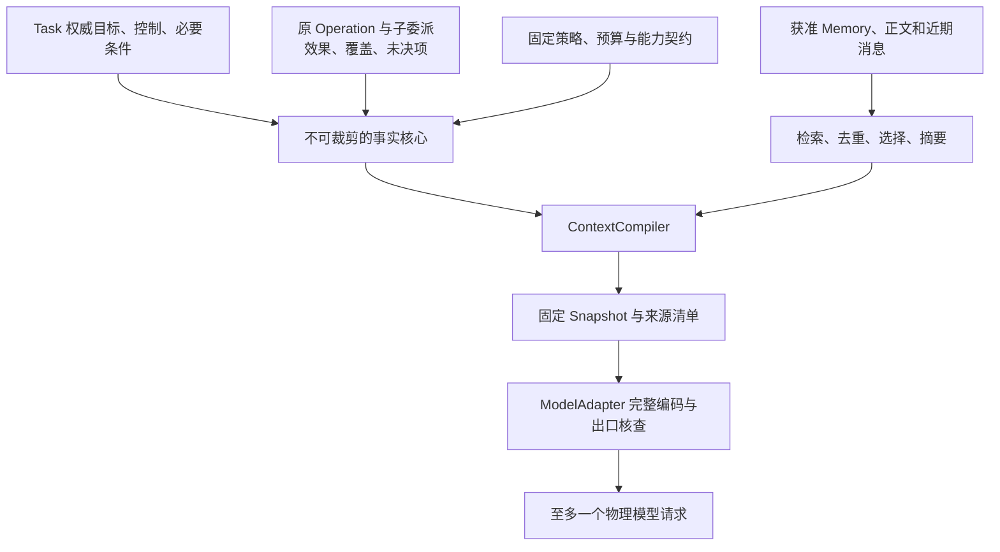

# 决策与上下文

Brain 用固定输入提出下一步。它不保存第二份任务真相，不授予行动权限，也不把模型文字当完成证据。默认路径是受约束的 ReAct；确定性规则、有限计划和小模型选择都只优化提案产生，不能改变准入规则。

## 1 输入由编排器编译

ContextCompiler 属于 Orchestrator。Brain 获得不可变 Snapshot，并保存自己的 Decision/ModelCall。这样替换模型、摘要或检索策略时，原目标、控制和未知效果仍能机械重建。

Snapshot 至少绑定 task/goal/control/snapshot revision、goal_ref、完整条件与当前判断、未结效果和委派集合的准确版本、TaskPolicy、InstallLock、ModelProfile、准确 Capability/Binding、材料引用及选择记录。

不可裁剪部分包括用户硬约束、金额/目标/收件人、当前控制、原未知效果、必要条件和本轮实际可调用的完整能力契约。摘要只补充历史解释，不能承担唯一事实保存。

## 2 组装算法与输入预算

1. 在原分片读取当前权威事实和完整性标记，固定依赖修订
2. 先按租户、用途、来源状态、时间和位置过滤材料，再计算候选与排序，避免对无权资料做相似度推断
3. 取得必要字节，验证准确版本及摘要。记录全部实际处理来源，包括后来没有进入最终提示的材料
4. 先保留事实核心，再装入当前证据、最近有效输入、相关记忆和历史摘要；记录裁剪与缺口
5. 用准确 ModelProfile 的编码器计算输入，加上系统包装、工具 Schema、输出预留与安全余量
6. 回到 Task 短事务复查依赖修订和使用资格，共同保存Snapshot、固定decision_id的DecisionDispatchIntent、原brain.decide命令、计数、预留和Job；Brain另在其本地接纳事务创建Decision

先去重复和低相关可选历史，再缩短证据片段。必需输入仍超窗口时返回 context_incomplete，请求有界补证或任务拆分；不能截掉控制或必要条件继续。最终封存编码须满足 input_tokens + reserved_output_tokens + safety_margin_tokens ≤ context_limit，并另满足输入/输出独立限制。记录tokenizer/编码版本和计数模式exact/upper_bound/estimate；只有准确计数或可信上界可支持硬限额声明。图片、URL、metadata 和附件不一定计入同一 token 窗口，但都计入字节、用途和外发核查。

新摘要需要独立的有界处理责任。若需要模型，创建自己的 Decision 与预算，不能在原 Decision 内偷偷调用第二次模型。摘要保存源范围、转换配置、缺失信息和当前权限；源关闭后不能继续复用缓存摘要。

## 3 模型请求只有一个真实出口

brain.decide 接纳固定 decision_id 和 Snapshot 后保存 accepted。工作者完成编码、当前授权和费用准备，再保存 send_started 与原供应商关联，确认提交后发送一次。

| 阶段 | 中断后的行为 |
| --- | --- |
| 尚无 send_started | 重新核验原输入与当前门禁后，允许原首次发送 |
| send_started 已提交，答复未知 | 查原供应商调用；不能透明重发，不把无答复记成零费用 |
| 取得输出但正文发布失败 | 保存原调用和用量，恢复原发布身份；不能重新推理生成替代结果 |
| 提案已发布但 Orchestrator 未收到 | brain.get 返回原提案和用量，Orchestrator 按 decision_id 唯一消费 |

每个 Decision 至多一个物理模型请求是有意选择：它使计费和恢复边界清楚，代价是供应商无法查原调用时会留下 provider_result_unknown。是否新建后续 Decision，由 TaskPolicy 在保留原费用占用后明确决定；不能将它伪装成原调用重试。

ModelAdapter 枚举完整发送字段、工具声明、媒体、metadata、缓存字段、插件字段及日志计划。它把每项关联到准确材料或固定配置，核对实际接收方、处理位置和大小，固定编码摘要。发送门禁后不得追加材料或换接收方；真实出口检查摘要一致。SDK、代理和认证刷新造成的自动重发必须关闭。

模型输出继承全部实际处理来源的限制交集。公开引用不消除私密输入的来源关系。秘密值只经专用凭据适配器进入允许的目标出口，不能进入提示、模型日志或产物。

### 产出发布也有原身份

模型生成采用受限local_id，不自行生成真实Content owner/hash或上传地址。Brain取得合法输出后先按保存许可暂存，并持久固定publication及每个local_id对应的content_id/version/upload_id/content.put原命令和Job。局部依赖必须为有界DAG，拓扑发布后回填准确ContentRef；全部必需内容可查询才将Decision记为completed。部分发布失答复查原命令，失败保留孤儿清理和原费用；取消后不发布可采纳提案。无法保留最低恢复记录时不启用该生成路径。

## 4 提案合同

Proposal.kind 为 act、need_context、request_input、complete 或 fail。外层DecisionRecord绑定decision_id和原Snapshot；提案保存理由/依据引用、相关缺口和种类专属字段。理由可以用于解释，不能成为授权凭据。

- act：给出准确能力候选与参数，或互斥的 plan_delta。每项经过 Orchestrator 统一准入
- need_context：指明已有材料的缺口与有界查询，不能夹带新的网页抓取或目标动作
- request_input：提出问题及允许回答范围，由原业务 owner 生成 InputRequest
- complete：引用准确成果并提出条件判断建议，最终完成仍由 Orchestrator 核验
- fail：说明原要求、失败证据和恢复条件，不能用模型断言消除未结效果

Schema 合法只证明结构。Orchestrator 还检查语义、资源、版本、当前控制、来源、预算及完整性。有效条件补全优先提交，旧提案其余部分失效。

## 5 能力和 Skill 的渐进发现

小目录直接给准确能力合同。大目录先 search 元数据，再 describe 精确版本与 Binding，最后载入所需 Skill 正文。固定候选来源、本轮候选集合摘要、Capability/Binding修订、InstallLock和排序策略、加载成本、同名歧义及未召回范围。

Capability 定义结构、效果谓词、幂等性、错误与费用上界；Binding 定位实际实现、资源、Schema、InstallLock 和就绪实例。名称相同不意味着能力相同。Skill 是操作知识，不能修改 Grant，也不能从普通第三方内容提升为受信系统指令。

渐进发现不会改变已有 Task 的 orchestrator_id。新 Task 路由属于受信发现和[生产放置](../production/README.md)，工具检索只是提案选材。两种“发现”分别命名和记录，避免缓存或候选排序改变写入权威。

## 6 规则与小模型怎样启用

默认顺序是已登记确定性规则，否则使用本轮固定通用模型。规则必须覆盖全部前提与约束；规则实现错误或产物非法时显式失败，不能调用模型掩盖缺陷。

可选 typed_decision 仅用于候选有限、答案类型明确的选择，例如从准确候选页中选下一页。规格固定题目、候选身份、模型、模板、阈值、并列规则和 Proposal 映射。答案不能引用模型没见过的候选，也不能直接判定外部效果或完成条件。

合法拒判或明确不支持可以按策略升级一次通用模型。决策链根、已用升级额度和总费用持久保存；候选变化、补上下文、重启或更名不重置。格式错误走有限修复，授权缺失走等待，结果未知先核原调用，均不借升级绕过。

小模型、更多工具或压缩不是天然收益。每个候选策略固定模型、权限、任务集和总预算，比较端到端成功、误动作、P95延迟、完整费用及维护成本。提示 token 下降只能解释成本过程，不能证明质量提高。

## 7 长任务的两种优化

**增量上下文。** 新快照可以引用前一份准确 Snapshot 和有序新增事实，但实际请求仍由当前权威核心重建。压缩失败或引用缺失时有限回退到完整组装，不能丢控制和未知项。跨 provider 的缓存仅以准确前缀与权限复用，不授予永久披露。

**有限计划。** 能确定依赖和参数的步骤交 Materializer，减少重复推理；新事实、有效失败或环境变化触发明确重规划。计划本身不替代每步授权和效果核对。默认不把一次成功轨迹自动升级为长期 Skill。

这两项都是可替换策略，通过对照后逐步启用。研究与开源实现提供机制启发，适用边界和本项目待证伪测试见[研究依据](../decisions-and-evidence.md)。
