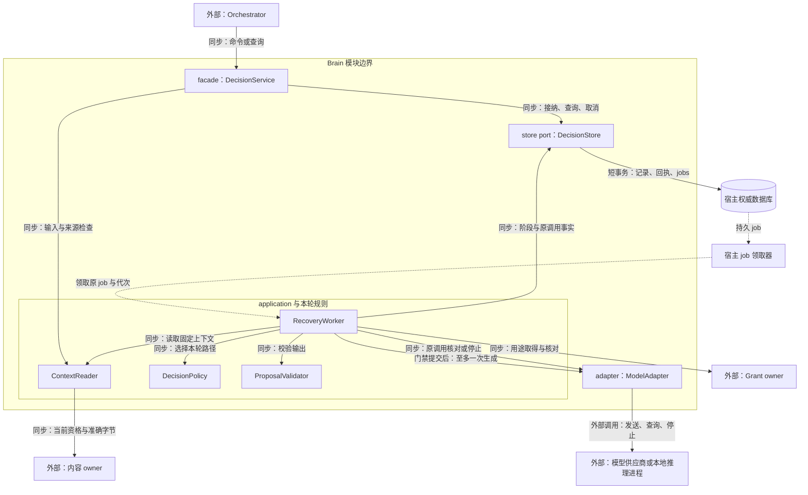
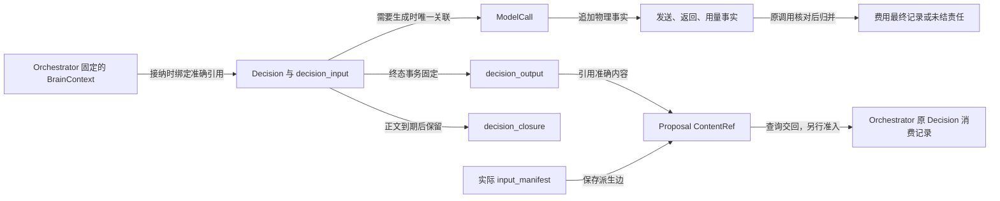
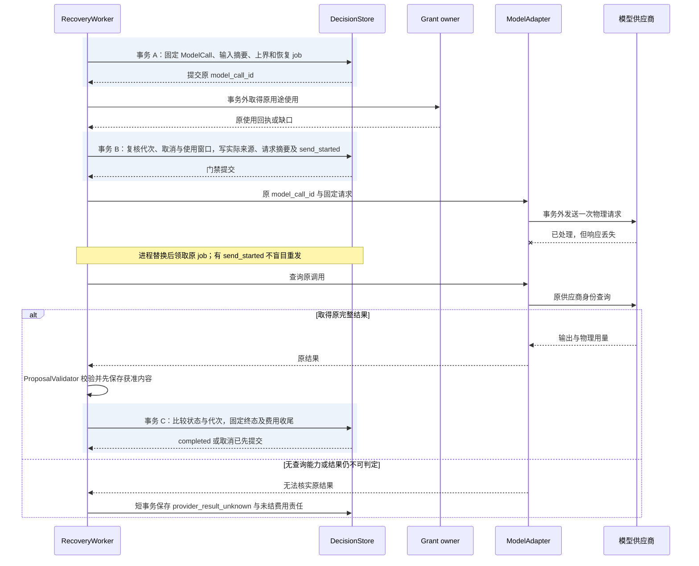

# 大脑实现：固定上下文、单轮提案与调用恢复

[模块主线](README.md) · [Orchestrator](../orchestrator/README.md) · [内容实现](../memory/implementation.md)

本文把单轮 Brain 展开为参考实现，供同进程 port 与远程适配器共用。
接口、状态及成功含义沿用模块主线；这里规定内部记录、处理顺序与故障实验。
默认 Go 组件复用宿主数据库和 jobs，不增加独立调度服务。
本文中的算法和表结构是设计规格，尚非已运行的 Harness。

## 1. 软件形状、内部职责与边界

Brain 的工作从接纳一个固定 DecisionRequest 开始，到保存该快照上的提案或明确错误结束。
Orchestrator 负责选择上下文、保存计划和决定后续工作；Brain 不拥有任务写权限。
模型适配器负责供应商编码及物理请求事实，不能执行生成内容中的工具调用。

Brain 是宿主装配的一组 Go package。DecisionService 是唯一对外 facade，
其 application 层组合 ContextReader、DecisionPolicy 和 ProposalValidator；
DecisionPolicy 只做本轮选择，ProposalValidator 只判断候选契约，二者不直接读写数据库。
DecisionStore 将事务和领域记录映射到宿主 command_store、job_store；ModelAdapter 和内容读取 port 隔离外部依赖。
各 port 用 Go interface 表达，构造时注入依赖；规则接收领域值类型，不依赖 RPC 生成类型。
本机装配为同进程调用，独立服务部署的 Brain 在同一 facade 前加 gRPC 适配器；端侧 Brain 由宿主将 WSS／Delivery 交接适配到该 facade，二者映射同一领域契约，
不要求这些组件各自成为服务。ModelAdapter 对模型供应商沿用其 API，对本项目独立推理服务使用 gRPC；
第三方本地推理程序由适配器转换其原有协议。

图展示软件依赖方向；实线为同步调用，虚线为持久工作交接。
调用者在事务外等待网络；同进程装配仍保留相同 store 和外部 port 边界。
Orchestrator 收到提案后仍执行独立准入，宿主 job 领取器只提供处理机会。

接纳 RPC 的 context 只约束该次接纳及等待。接纳成功后的 RecoveryWorker 从原 job 建立有界工作 context，
依据持久取消决定、工作期限和宿主关闭信号停止本地处理；客户端断连不取消已接纳 Decision。
工作池限制 goroutine、在途模型调用和流缓冲，取消后仍等待本地请求或推理实际退出才释放槽位；
供应商效果和费用未知由原调用继续核对。共同的 Go 生命周期约束见[宿主接口](../deployment.md#4-默认宿主的装配与持久接口)。

| 组件 | 输入与责任 | 不承担的裁决 |
| --- | --- | --- |
| DecisionService | 原决策身份、输入摘要、期限；接纳、查询和取消 | 不改变任务目标或完成结果 |
| ContextReader | 读取准确上下文版本，验证正文类型和来源清单 | 不自行补搜索、抓取或设备观察 |
| DecisionPolicy | 固定策略选择确定性返回或一次物理生成 | 不形成另一套长期 Agent 循环 |
| ModelAdapter | 精确模型配置、请求序列化、流汇总、用量记录 | 不重试未知请求，不运行返回工具 |
| ProposalValidator | 提案结构、能力绑定、引用闭包及上限 | 不替代 Orchestrator 的当前权限和控制检查 |
| RecoveryWorker | 领取本轮推进工作；沿原调用查询、停止和费用核对 | 不用新调用身份掩盖旧调用未知 |
| DecisionStore | 接纳、发送门禁和终态短事务；绑定宿主事务与 jobs | 不在事务闭包内访问模型或远端 owner |

默认保持一轮至多一次物理生成，可以直接把费用及恢复记录关联起来。
多模型竞速会增加输入披露、物理请求和取消责任；只有冻结评测证明收益时才作为新实现加入。
更换模型供应商时只替换 ModelAdapter；更换 Brain 时还须验证上下文及提案契约。

## 2. 上下文正文与资料来源

`DecisionRequest.context_ref` 指向 `BrainContext` JSON 正文。
其 ContentRef 的摘要覆盖全部字节，正文 `schema_version` 固定为 `brain-context/1`。
正文不接受隐含系统消息；材料的性质与来源通过字段表达。
媒体字段仍使用 `application/json`，具体正文类型由持久引用用途及 schema_version 判定。

| BrainContext 字段 | 内容与约束 |
| --- | --- |
| schema_version | 固定正文格式；未知版本拒绝 |
| task_ref | 当前 orchestrator_id 与 task_id |
| snapshot_revision、goal_revision、control_revision | 与 Orchestrator 本轮固定记录一致，不比较不同对象的修订 |
| goal_ref、requirements | 原始目标引用及本轮完整要求，显式约束不可裁剪 |
| control | 当前 running／paused 及不可执行的原因；暂停通常不发新决策 |
| plan_ref | 可空；已接受的准确计划版本 |
| facts | 有类型的正式事实引用、所属对象和观察修订 |
| assumptions | 当前假设及需要验证的条件，不混入正式事实 |
| unresolved_effects | 原 operation_id、当前效果、核对入口；不能为空后假装没有未知效果 |
| materials | 本轮实际提供的内容片段、来源引用、用途依据和可见范围 |
| capabilities | 已解析的准确能力、绑定、输入输出与效果契约 |
| gaps | 必需／可选、缺失原因、可恢复入口 |
| input_manifest | 实际参与本轮处理的精确来源引用集合；去重不删除来源关系 |

facts 只指向所属 owner 已保存的观察，不将模型文字升级为正式效果。
material 包含 content_ref、可选片段选择器、role 和 source_refs；role 为 evidence、memory、skill 或 history。
文本片段按 UTF-8 字节区间定位，必须位于原字节范围且边界合法；图像引用完整版本。
片段选择只减少实际处理字节，不自行放宽原内容的来源策略。
capabilities 只能包含已获准披露的声明，工具凭据不进入模型上下文。

### 2.1 Orchestrator 的组装步骤

组装属于 Orchestrator；Brain 在读取后再次验证足以解释本轮输入，不反向修改快照。
同宿主可以传递只读对象，但序列化后必须具有相同正文含义。

1. 固定任务、目标和控制修订，取得硬约束及原未知效果。
2. 解析仍获准使用的正式事实与必要能力契约，记录失效或不可达项。
3. 按任务范围查询相关记忆，只保留查询返回的准确修订与完整性声明。
4. 先取得必要内容字节，再核对摘要、来源及本轮处理位置。
5. 按既定优先序组装材料，计算实际输入大小和处理来源闭包。
6. 保存获准的上下文版本、清单、决策身份和费用预留，再派发 Brain。

对可选记忆的缺席可继续，但 gaps 必须保留缺席事实。
硬约束、必要证据或完整工具契约放不下时停止本轮，返回 context_incomplete。
不能裁掉金额、收件人或原未知操作后继续生成看似完整的计划。

### 2.2 大小控制与摘要

输入大小按当前 ModelProfile 的实际编码估算，并预留模型适配器固定包装开销。
模型适配器发送前重新按最终编码计算；不满足窗口时不得发送。
默认裁剪顺序为无关历史、重复材料、低相关可选记忆，最后才缩短获准证据片段。
固定目标、控制、未知效果和所用能力完整契约是不可裁剪区。

可重用摘要必须已有准确内容版本、来源闭包和获准处理依据。
本轮不隐含再调用一次模型生成摘要；需要新摘要时由 Orchestrator 建立独立有界处理工作。
摘要过期、来源关闭或不可定位时作为缺口，不用缓存文字替代原资格检查。
模型窗口限额与任务累计读取额度分别检查，重新组装不能重置累计费用。

### 2.3 全输入来源继承

input_manifest 由实际读取和发送组件记录，不能由模型自行提供。
BrainContext 的清单记录组装与本轮读取的来源；发送门禁另固定最终编码实际包含的来源与接收方。输出来源取本轮实际处理来源的并集，不能因编码时省掉某一项，就删除 Brain 已读取该项的来源责任。
一次物理调用读入的所有来源都加入其输出来源依赖，包括模型未引用的偏好与历史。
`evidence_refs` 表示提案声称的证据支撑，不能代替完整处理来源。
内容 owner 保存输出与输入的反向关系，输出策略取全部实际来源的限制交集。

当一份 local_only 偏好与公开资料共同输入本地模型时，产出不能因只引用公开资料而自动发云。
需要更宽用途的成果，须在获准范围重新生成，或取得明确的新许可。
新许可只改变未来使用资格，不删除已经发生的处理来源事实。

禁止保存的资料只进入部署已验证的临时处理路径。
持久记录保存获准的最小身份、摘要与使用事实，不保存被禁止的正文或提示词。
进程重启后原文无法重取时，原决策结束为 context_incomplete；Orchestrator 请求重新提供材料或按明确缺口继续。
若原模型请求可能已经发送，先保留 provider_result_unknown 及费用责任，不能把缺原文解释为从未调用。

## 3. 持久记录与唯一约束

所有记录带 tenant_id，查询先检查认证租户与负责服务。
下表为参考逻辑表；数据库实现可以合并表，但不能合并成功含义。

| 记录 | 主键与重要约束 | 写入时点 |
| --- | --- | --- |
| brain_decision | tenant、decision_id 唯一；input_digest 不可改变 | 接纳事务 |
| decision_input | decision_id 唯一；context_ref、profile、limits 与来源清单固定 | 接纳前取得可保存内容，接纳时绑定 |
| model_call | decision_id 唯一；model_call_id 唯一；发送门禁固定实际 input_manifest、最终编码摘要、接收方与 use_id | 准备身份，门禁时保存披露依据 |
| model_attempt_fact | model_call_id、fact_id 唯一；供应商号、发送及返回事实只追加 | 每次得到可核对事实 |
| decision_output | decision_id 唯一；提案或失败固定，内容引用精确 | 终态事务 |
| brain_usage | model_call_id、计费项身份唯一；预留、估计、最终账单及费用修订分别记录 | 准备及原调用对账；可信上调与交回 job 同事务 |
| billing_handoff_outbox | decision_id、费用修订、固定账单摘要、有限唤醒命令尝试与回执、交付状态 | 每费用修订唯一；同 Decision 的多个未交付修订可共用一个扫描 job，旧尝试的身份与回执不可覆盖 |
| brain_job | decision_id、job_kind 唯一未结工作；固定恢复目标 | 接纳、发送准备、查询、收尾或费用交回事务；已 done 可随新账单重开 |
| decision_closure | decision_id、终态、输入摘要及原决定摘要 | 原正文到期后保留最小关闭依据 |

input_digest 覆盖 DecisionRequest 的规范化结构，数组顺序保留。
同 decision_id 不同输入返回 idempotency_conflict；不得创建第二条 ModelCall。
业务状态与下一项 job 同事务更新，单独发送消息不能推进状态。
工作者使用租约及代次领取；过期工作者不能提交结果或再次发送。
租约换主只改变处理者，不改变 decision_id、model_call_id 或使用身份。

### 3.1 核心对象关系与流转

Decision 是一轮工作的聚合根；ModelCall 是该轮可能产生的一次物理调用，
Proposal 是可交回的结果内容。三者分别回答“本轮决定了什么”“外部可能处理了什么”和“Orchestrator 可检查什么”。
来源清单属于实际处理事实；不能因为正文已清理而从一份仍受管产出的来源闭包中删除。

图中的边表示对象来源或持久关联，不是新增消息接口。
没有生成时 Decision 可直接形成确定性 Proposal，ModelCall 与费用调用记录为空。

| 对象 | 创建与持久化 | 传递、消费与收尾 |
| --- | --- | --- |
| BrainContext／input_manifest | Orchestrator 先保存获准正文；Decision 接纳固定版本和摘要 | ContextReader 取准确字节；ModelAdapter 保存实际处理来源。禁止保存的字节仅走已验证临时路径，恢复缺失按 2.3 节处理 |
| Decision | DecisionService 在接纳事务生成当前记录、原回执与 job | RecoveryWorker 只推进原身份；Orchestrator 按原 Decision 查询并单独消费，正文到期归并为最小关闭依据 |
| ModelCall／使用与用量事实 | 发送准备时固定唯一调用，发送门禁及物理观察分别追加 | ModelAdapter 外部调用，RecoveryWorker 查询原调用；最终账单可替换估计，不能覆盖原发生事实或抹去未知责任 |
| Proposal 内容／decision_output | 校验后先保存获准内容，再在终态事务固定结果引用 | Orchestrator 当前准入接受或拒绝；失效提案仍是原结果，内容按来源关闭和保留策略清理 |

### 3.2 接纳事务

接纳前完成结构、负责端、当前输入资格和固定配置检查。
事务内依次检查原命令、原 decision_id、任务绑定、数量上限及必要费用预留。
已有终态返回原决定；已有处理中记录返回 accepted 和当前记录。
新请求同时保存 Decision、输入绑定、原回执及 run_decision job。
数据库不可写时不返回 accepted；内容预先保存但接纳失败的孤立版本进入有界清理。

### 3.3 物理发送事务

工作者读取固定输入并选择零次或一次生成。
确定性返回不创建 ModelCall；需要生成时先核对 profile 的费用模式。strict 要有可信单次上界；estimate 要有原 Task 固定的受信策略接受关联、有限估算预留、与该 Task 同受信提交域的在线费用 Grant owner 原使用回执，且不能处于 allocation 下。Brain 不采信请求正文自行声明的费用模式；任一核验不可得则不发送。远程 Brain 可以执行获准的 strict 调用；仅凭 Task.policy_ref 或远端转述不开放 estimate。
准备事务固定 model_call_id、最终输入摘要、最大输出、计价版本和所需 use_id。
逐项取得用途回执；任一未知时查询原使用，不能先发送后补授权。

ModelAdapter 先完成最终请求编码；ContextReader 与适配器核对本次实际送入模型的全部来源、处理位置、接收方和编码摘要。发送门禁事务确认 Decision 尚可推进、工作代次有效、所有使用窗口有效，并将这份实际 input_manifest、最终请求摘要、接收方及原使用身份与 `send_started` 共同保存。禁止保存的正文不落库，但允许的最小来源身份和披露事实仍须先持久化；若连这些事实都不能保存，该适配器不能接纳会外发的调用。
然后在事务外调用供应商。`send_started` 表示可能发出，不证明供应商收到。
没有 send_started 的 prepared 记录可以继续原首次发送；有该记录则进入原调用查询或 unknown 分支。
默认禁止 SDK 透明重试；无法暴露物理次数的适配器不进入精确调用计量配置。

### 3.4 完成事务

输出先完成流汇总、解析、大小和引用校验，再保存获准的输出内容。
事务比较 Decision 状态及代次，固定 completed／failed 与原结果，删除推进 job 并保存费用收尾责任。
取消先提交时，不再写入 completed；迟到输出只进入仍获准的诊断记录。
Orchestrator 获取 Decision 后，另在自己的事务中消费提案和决定后续工作。
因此 Brain completed 与任务 succeeded 不在同一状态机中。

供应商可信上调账单即使在 Decision 终态、原费用交回 job 已 done 后到达，也沿原 model_call_id、原计费项追加更高费用修订；同一事务为该修订保存独立 billing_handoff_outbox（固定业务键、账单摘要和首个有限 `task.billing_reconcile` 命令尝试），并重开按 decision_id 唯一的扫描 job。r1、r2 在 r1 尚未交付时到达也不能用 r2 覆盖 r1 的原命令；工作者按修订扫描待交回记录，向原 Orchestrator/task_id 发送各自原命令，payload 的 source_kind=brain_decision、source_id=decision_id、usage_revision=含本次账单的 DecisionRecord.revision；丢答复先查原命令或同 ID 重投；受信期限过后仍无 JobAck 时，该 outbox 保存同修订／同摘要的继任 command_id 及旧未知尝试身份，按退避继续交付，不能把过期误作原命令未执行。Orchestrator 的 JobAck 仅证明原计费槽已持久唤醒；实际费用仍由它主动 `brain.get` 核对原 ModelCall、可信账单和 Task 的唯一计费来源绑定后应用。Brain 接受 JobAck 才将本次交回标完成；旧工作者不能用先前 done 覆盖新修订责任。未取得可信账单时原费用责任继续保留，不以估计值结清。退款、贷记另行对账。

### 3.5 发送门禁、丢答复与原调用恢复

关键不确定窗口位于 send_started 已提交之后、供应商结果可查之前。
图从已接纳的 Decision 开始，只展开一次生成；业务事务内没有网络调用。

事务 C 的提交响应若再次丢失，恢复者读原 Decision 终态，不再查询模型以生成另一份输出。
当取消先提交，晚到结果不得把 cancelled 改成 completed；外部停止与费用核对仍继续。
确定性路径省略 ModelCall 和供应商交接，仍经过输出校验与同一终态事务。

## 4. 输出校验与有限计划

提案采用共享 Proposal Schema；未知 kind、字段或枚举均拒绝。
原生工具编码先转换为同一 Proposal，不会获得额外执行权限。
校验顺序固定，避免下游错误掩盖更基础的输入或引用缺口。

| 顺序 | 检查 | 失败处理 |
| --- | --- | --- |
| 1 | 字节、深度、数组和字符串限额 | invalid_output，保留可披露诊断 |
| 2 | kind 专属字段及共同字段 | 不尝试执行部分工具调用 |
| 3 | 所有引用属于本轮可见材料或本轮获准新产出 | 不接受凭空 ContentRef |
| 4 | act 能力及绑定与本轮准确声明一致 | 不按近似名称寻找替代能力 |
| 5 | arguments 按固定能力输入 Schema 校验 | 返回字段路径，不自动猜值 |
| 6 | 行动相互独立且不超 max_actions | 有依赖的步骤改成后续计划 |
| 7 | complete 的成果、条件与评估引用完整 | Orchestrator 仍复核完成资格 |

格式错误、截断和引用错误统一结束当前生成，不能在同 decision_id 内再生成。
Orchestrator 可以携带机器可读缺口发起新决策；修复次数、总轮数、费用和期限分别计入。
无新事实而重复 need_context 时，Orchestrator 返回已有查询结果或缺口，不能反复探活。

### 4.1 计划正文

计划是可修订的有限工作说明；每次变更引用 base_plan_ref 和完整 next_plan_ref。
参考计划保存步骤 ID、目标条件、依赖步骤及预期产出，已发生事实只引用原记录。
确定性续行只支持准确行动模板和有限字段绑定；不支持任意脚本、循环或递归子计划。

| 计划字段 | 规则 |
| --- | --- |
| schema_version、plan_id、revision | 正文类型及版本固定；修订产生新内容版本 |
| task_ref、goal_revision | 只能用于所属任务与目标版本 |
| steps | 有限无环集合；每项有 step_id、requirement_refs、depends_on、instruction |
| action_template | 可选，完整 invoke／delegate 模板，能力版本固定 |
| argument_bindings | 可选，从指定原操作已核实输出的 JSON Pointer 取值；无表达式求值 |
| source_refs | 编制计划的完整处理来源；不等于已执行证据 |

没有 action_template 的步骤必须由后续 Brain 决策展开。
存在模板时，Orchestrator 仅在全部依赖已满足、取值来源准确且目标未变时物化下一行动。
绑定字段须通过同一能力 Schema；缺字段或类型改变返回重新决策，不执行隐式类型转换。
任何物化行动仍逐次检查控制、权限、预算与资源门禁。
计划步骤按 `(task,plan_id,plan_revision,step_id)` 唯一准入并保存原操作关联；不再次消费生成计划的 Brain 决策，事务规则见[任务准入](../orchestrator/implementation.md)。
例如“评估通过后写入同一候选，再读回准确版本”，可以复用固定模板；评估不通过则交 Brain 修订。
计划不是新的授权单位，计划保存成功也不表示全部步骤获准。

## 5. 状态与恢复分支

| 当前状态／证据 | 事件 | 下一状态与持久责任 |
| --- | --- | --- |
| accepted，无 ModelCall | 工作者领取 | running；准备原调用或确定性结果 |
| running，prepared 无发送标记 | 重启 | 复核资格后继续原首次发送 |
| running，已有发送标记 | 答复丢失或重启 | 查询原供应商请求；不支持查询则 failed/provider_result_unknown |
| running，完整输出有效 | 结果提交先于取消 | completed；费用未结仍继续对账 |
| accepted/running | 取消提交 | cancelled；关闭新启动，尽力停止原调用 |
| 任一终态 | 迟到输出或账单 | 只追加获准诊断或费用，不改终态 |
| running，输入正文丢失且未发送 | 无法重取 | failed/context_incomplete，不凭旧摘要生成 |

取消并不证明供应商停算；model_call.state=stopped 必须有停止证据。
本地执行槽在本进程请求或推理实际结束后释放，未知费用继续按上界占用。
供应商没有终结查询时不声明远端物理并发硬上限；新尝试仍受速率、费用和熔断约束。
已完成提案在 Orchestrator 处失效时保留原结果，不修改为另一个快照上的提案。
来源随后关闭时，产出按内容治理停止新使用，已发生调用和费用不消失。

## 6. 参考上限与可观察记录

以下为待测初值，部署可下调；增加需报告上下文、成本与恢复压力实验。

| 资源 | 初值 | 达限行为 |
| --- | --- | --- |
| 单轮行动／补充请求 | 8／8 | 拒绝超限提案，Orchestrator 可拆分新轮 |
| 上下文清单引用 | 100 | 先裁可选材料；必需材料超限返回缺口 |
| 单计划步骤／依赖数 | 64／每步 16 | 拒绝循环或超限，不自动展开 |
| 提案 JSON 字节 | 128 KiB | invalid_output；正文成果另存内容引用 |
| 模型本地并发 | 按宿主每用户上限，初值 4 | 等待有限队列 |
| 单轮格式修复 | 最多 2 次新决策 | 耗尽后报告错误或请求人工补充 |
| 原调用自动核对 | 按任务期限内有限退避 | 超限转可查询处置，不删除原责任 |

日志记录 decision_id、model_call_id、profile 摘要、阶段、耗时和用量，不记录正文与隐含推理。
输出 diagnostic 只保留字段路径、错误类别和获准的短说明。
来源、权限和费用缺口分别记录，不能统一包装成“模型失败”。

## 7. 生产部署、可用性与性能

生产拓扑、主写域隔离和故障域保证遵循[公共可用性策略](../deployment-production.md#availability)，
容量推导及剩余容量遵循[公共容量策略](../deployment-production.md#capacity)。
Brain 按租户和稳定 owner 路由至原 Decision 数据库分区；增加无状态 facade 或工作者不改变原决策身份，
也不改变任务 Orchestrator。推理进程可以按 ModelProfile 独立扩容，仍由宿主 jobs 和已保存的调用上界驱动。

| 扩展或竞争点 | 必须维持的约束 |
| --- | --- |
| facade 与 RecoveryWorker 副本 | 不同 decision_id 可并行；同 Decision 的取消、发送门禁、终态和工作代次由原库条件事务裁决 |
| 费用与供应商容量 | 同 Decision owner 的副本共享当前持久计数；跨 owner 按[保守配额份额](../deployment-production.md#quota-scope)限制总额，每个进程不能各自发满同一上限。供应商未知调用继续占费用上界，不能靠换节点释放 |
| 本地推理工作池 | 按实际模型资源划分有限槽；调用仍属于原 model_call_id。进程隔离用于避免推理占满接纳、控制与核对工作，不增加长期计划调度器 |
| 正文与上下文编码 | 大正文经内容面获取，不塞入 RPC 消息；流汇总受字节和时间上限约束，超限关闭本轮输出而非无限缓冲 |

权威库不可写时停止新接纳及新的发送门禁提交；已取得门禁的在途调用可能继续发送或处理，仍按原调用保留未知及核对责任。
可证明安全的本地停止继续执行，待原库恢复后补原事实，不能将数据库故障解释为供应商未收到请求。
内容或 Grant owner 不可达时等待有期限的原工作，不从历史授权缓存推定可发送；
必需临时正文无法恢复则按 context_incomplete 或已发送未知分支结束。
供应商不可达只影响该 profile 的新调用和原调用核对，已有可披露终态与其他 profile 可以查询或推进。

缓存可保存获准的准确内容字节、能力 Schema 和最终编码计算结果，键包含内容摘要、完整配置和编码版本。
复用前仍检查当前来源、处理位置、期限与用途；缓存命中不建立新使用依据。
跨 Decision 复用生成结果需要独立的来源和用途资格，本实现不以相同提示词摘要自动跳过本轮记录。

主要瓶颈是外部模型占用、内容下载／编码和费用热点事务，而非 RPC 接纳数。
按阶段记录接纳 p95/p99、job 最老等待时间、上下文读取字节／耗时、首字节及完整生成耗时、
发送门禁冲突、provider_result_unknown 数及存续时间、费用上界占用和取消收尾延迟。
容量实验分别施加单租户高峰、单供应商限流和模型长尾；不把平均调用时间外推为超时上限。

新接纳先检查有限队列和费用预留；高水位返回 overloaded 或保存明确等待，已接纳原工作不丢弃。
控制、停止、原调用查询和账单核对使用保留工作份额；恢复风暴按原提供方退避并设每租户公平限额。
先限流新生成，再降低可选上下文量；硬约束和准确能力声明不能作为负载削减项。
本节不新增容量常数，采用第 6 节待测初值，扩容以故障期间的实测剩余容量为依据。

## 8. 可重复故障实验

| 实验 | 输入与注入点 | 必须观察到的结果 |
| --- | --- | --- |
| BI-01 接纳中断 | 保存 Decision 后、答复前断连 | 原身份一条记录，重投不新增 ModelCall |
| BI-02 发送边界 | send_started 提交后强制结束进程 | 查询原调用或 unknown；物理请求不自动重复 |
| BI-03 取消竞争 | 流返回前提交取消，再交回完整输出 | Decision 保持 cancelled，费用继续收尾 |
| BI-04 过期快照 | 模型运行中修订任务目标 | Brain 原结果可查，Orchestrator 不采纳旧行动 |
| BI-05 来源全继承 | 同轮读私密偏好及公开文档，输出只引用公开文档 | 派生来源包含两者，未经许可外发被拒 |
| BI-06 窗口不足 | 硬约束与完整能力声明超过窗口 | 无供应商请求，context_incomplete 可解释 |
| BI-07 非保存输入 | 临时资料进入模型后进程崩溃 | 不产生持久正文；可能发送和费用仍保留，缺原文不重做 |
| BI-08 计划绑定 | 写入返回另一版本，后续读回模板仍指原版本 | 物化校验拒绝，不能拼接不同版本的完成证据 |
| BI-09 非法引用 | 模型捏造能力或未读 ContentRef | invalid_output，无执行调用 |
| BI-10 费用迟到 | 超时后重试新决策，再收到两笔账单 | 两次物理调用分别记账，同账单重报不重复计费 |
| BI-11 披露后立即崩溃 | 编码包含私密材料，`send_started` 提交并发送后杀死进程 | 原 ModelCall 可查实际来源、接收方、用途使用和请求摘要；不因原文不可重取而抹去披露事实，也不凭摘要盲目重发 |
| BI-12 供应商违背费用声明 | strict 模型按可信上界预留后出现更高可信最终账单，随后同账单重报 | Brain 保存原物理调用与全额账单并停该 profile 新发送；Orchestrator 沿原计费项一次记录超额与合同违约，不截断为预留上界 |
| BI-13 终态迟到上调 | Decision、Task 已终态，旧费用交回 job 已 done；供应商上调原调用账单，Brain 保存后交回答复丢失且原命令到期 | Brain 原修订的交回 job 重领，保留旧尝试并以同修订继任命令取得同 JobAck；O 持久重开原计费槽，主动读原账只补一次差额；Decision／Task 目标状态不变，Brain 和 Grant 同物理收费不双扣 |

实验必须记录实际发送次数、数据库决定、授权使用与原供应商查询结果。
静态 Schema 只能验证提案形状，不能证明材料真实存在或供应商只处理一次。
实现验收另记录模型质量与延迟，不能用以上恢复实验替代 C1 和 V1 的效果评测。
