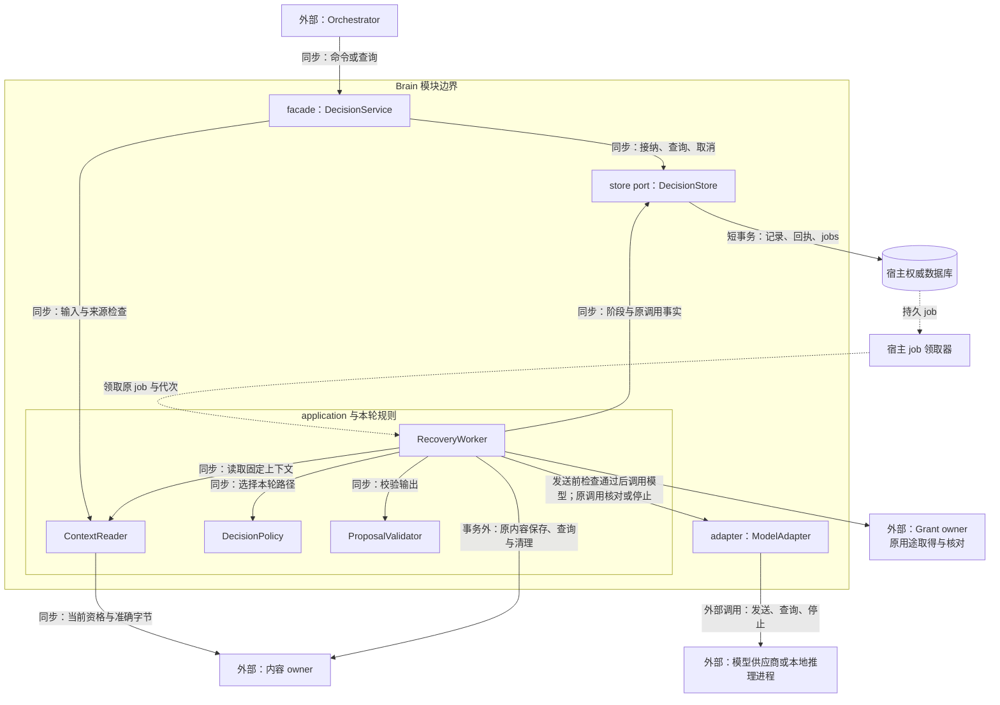
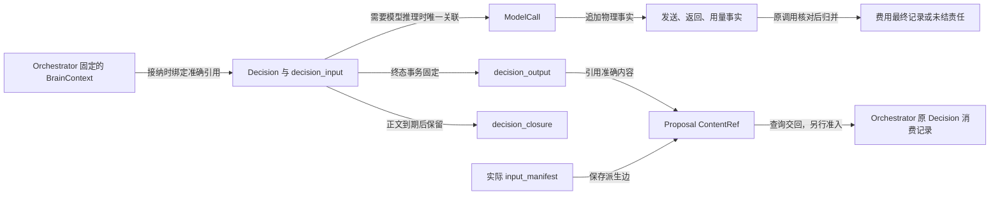
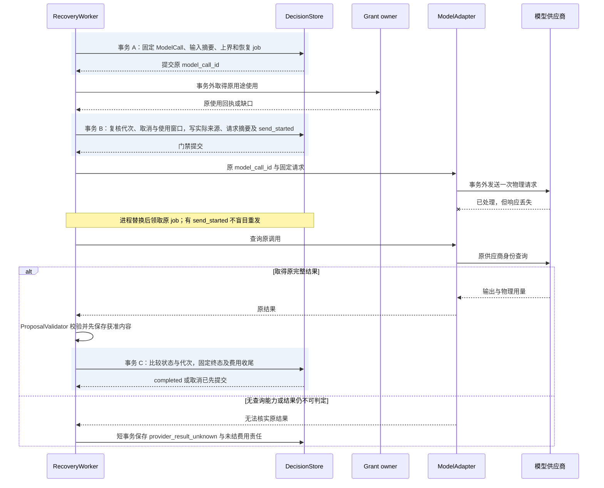

# 大脑实现：固定上下文、单轮提案与调用恢复

[模块主线](README.md) · [决策路径](decision-paths.md) · [Orchestrator](../orchestrator/README.md) · [内容实现](../memory/implementation.md)

一轮报告综合从读取 H 已固定的材料开始，经规则或一次模型判断，保存报告正文，再交回带准确引用的提案。实现必须能在“尚未发送”“可能已发送”“正文已保存但发布答复丢失”这几个位置分别恢复同一 Decision；这决定了下面的记录和提交点。

本页沿[模块主线](README.md)的交接展开 Go 组件、内部记录、处理次序和故障实验，同进程 port 与远程适配器共用行为。默认复用宿主数据库和持久 jobs；字段与成功含义见[对外契约](README.md#brain-contracts)，选路和质量评测见[决策路径](decision-paths.md)。表和算法是设计规格，运行实现仍须按末节取证。

| 阅读环节 | 本篇内容 |
| --- | --- |
| 接入与输入 | [组件边界](#module-shape)、[公共工作模板接入](#reliable-work-integration)、[上下文正文与来源](#2-上下文正文与资料来源) |
| 单轮推进 | [持久记录](#3-持久记录与唯一约束)、[对象流转](#data-flow)、[接纳、发送与完成事务](#32-接纳事务) |
| 产出与恢复 | [正文保存](#generated-content)、[提案校验](#42-最终提案校验)、[有限计划](#finite-plan)、[恢复分支](#5-状态与恢复分支) |
| 装配与验收 | [资源初值](#6-参考上限与可观察记录)、[生产部署](#production)、[故障实验](#8-可重复故障实验) |

## 1. 模块结构、内部职责与边界

Brain 的工作从接纳一个固定 DecisionRequest 开始，到保存该快照上的提案或明确错误结束。
Orchestrator 负责选择上下文、保存计划和决定后续工作；Brain 不拥有任务写权限。
模型适配器负责供应商编码及物理请求事实，不能执行模型返回的工具调用。

Brain 是宿主装配的一组 Go package。DecisionService 是唯一对外 facade，
其 application 层组合 ContextReader、DecisionPolicy 和 ProposalValidator；
DecisionPolicy 只做本轮选择，ProposalValidator 只判断候选契约，二者不直接读写数据库。
DecisionStore 将事务和领域记录接入[公共接纳与工作模板](../reliable-work.md#interfaces)的 command_store、逻辑 JobStore；ModelAdapter 和内容 port 隔离外部依赖。
内容 port 既读取固定输入，也由 RecoveryWorker 保存获准新产出和恢复原保存命令，不新增独立发布服务。
各 port 用 Go interface 表达，构造时注入依赖；规则接收领域值类型，不依赖 RPC 生成类型。

[S1／S2](README.md#dual-system)复用本节组件，模型路径按固定 profile 装配。跨轮交接仍由 Orchestrator 保存和调度，内部角色不新增长期 Agent、任务库或独立执行权限。

本机装配为同进程调用，独立服务部署的 Brain 在同一 facade 前加 gRPC 适配器；端侧 Brain 由宿主将 WSS／Delivery 交接适配到该 facade，二者映射同一领域契约，
不要求这些组件各自成为服务。ModelAdapter 对模型供应商沿用其 API，对本项目独立推理服务使用 gRPC；
第三方本地推理程序由适配器转换其原有协议。

图展示软件依赖方向；实线为同步调用，虚线为持久工作交接。
调用者在事务外等待网络；同进程装配仍保留相同 store 和外部 port 边界。
Orchestrator 收到提案后仍执行独立准入，宿主 job 领取器只提供处理机会。

接纳 RPC 的 context 只约束该次接纳及等待。接纳成功后的 RecoveryWorker 从原 job 建立有界工作 context，
依据持久取消决定、工作期限和宿主关闭信号停止本地处理；客户端断连不取消已接纳 Decision。
工作池限制 goroutine、在途模型调用和流缓冲，取消后仍等待本地请求或推理实际退出才释放槽位；
供应商效果和费用未知由原调用继续核对。共同的 Go 生命周期约束见[宿主接口](../deployment.md#4-默认宿主的装配与持久接口)。

| 组件 | 输入与责任 | 不承担的裁决 |
| --- | --- | --- |
| DecisionService | 原决策身份、输入摘要、期限；接纳、查询和取消 | 不改变任务目标或完成结果 |
| ContextReader | 读取准确上下文版本，验证正文类型和来源清单 | 不自行补搜索、抓取或设备观察 |
| DecisionPolicy | 固定策略选择规则返回或本轮指定模型的一次调用；固定类型答案按固定规格接纳和映射 | 不形成另一套长期 Agent 循环 |
| ModelAdapter | 精确模型配置、请求序列化、流汇总、用量记录 | 不重试未知请求，不运行返回工具 |
| ProposalValidator | 提案结构、能力绑定、引用闭包及上限 | 不替代 Orchestrator 的当前权限和控制检查 |
| RecoveryWorker | 领取本轮推进工作；原调用查询、停止、费用核对；按固定 publication 保存产出并恢复原内容命令 | 不用新调用或保存身份掩盖原结果未知 |
| DecisionStore | 接纳、发送门禁和终态短事务；绑定宿主事务与 jobs | 不在事务回调内访问模型或远端 owner |

每个 Decision 至多一次模型调用，包含固定答案类型的判断；规则命中为零次。费用与恢复记录因此可以关联到唯一 ModelCall。固定配置和[拒判升级](decision-paths.md#43-拒判错误和升级分别处理)由决策路径定义；升级须由 Orchestrator 另建 Decision，不增加路由服务或第二套调度循环。
多模型竞速会增加输入披露、物理请求和取消责任；只有冻结评测证明收益时才作为新实现加入。
更换模型供应商时只替换 ModelAdapter；更换 Brain 时还须验证上下文及提案契约。

### 1.1 公共模板在决策域的接入

DecisionService 使用公共接纳模板保存原 Decision，RecoveryWorker 向有界工作模板注册本域处理器。DecisionStore 提供本 Brain owner 的事务参与者；单体可与 Orchestrator 共用受限 Tx，独立 Brain 则在自己的本地事务范围内保存回执和工作，调用方持久查询原 Decide。

公共模板收敛领取和回写竞争；单轮至多一次模型调用、发送门禁、产出保存以及未知费用仍由 Brain 裁决。

| 接入点 | 领域参与者及事务边界 | 处理和提交责任 |
| --- | --- | --- |
| Decide 接纳 | DecisionStore 在 `transaction.Within` 内核对原命令及 decision_id、输入摘要、任务绑定和容量 | 同事务保存 Decision、固定输入、原回执及 `Raise(run_decision)`；同 decision_id 的新命令也须核对原输入，不能仅靠命令去重 |
| 调用准备与发送门禁 | ContextReader、DecisionPolicy 和 ModelAdapter 在事务外读取、选择和编码；DecisionStore 分次保存 ModelCall、用途关联和 send_started | 每次领取保护的提交先锁 Decision／调用／费用行，最后 `Guard` 原 Claim；实际模型调用在门禁事务提交后进行。准备和门禁是不同提交点，公共模板不合并它们 |
| 输出保存和终态 | ProposalValidator 校验；内容 port 沿固定 publication 保存获准正文；DecisionStore 固定原提案或错误 | 外部 content.put 与查询在事务外。终态、必要费用／停止责任与 `Finish` 共同提交，失答复读原 Decision 和 publication，不再次推理 |
| 调用事实与费用交回 | RecoveryWorker 核对原调用；DecisionStore 归并可信用量及每修订 outbox | 用量事实、费用修订与 `Raise` 同事务；交回仅在原 Orchestrator 已持久接纳的 JobAck 后确认，该确认不等于 Task 已完成结算 |

Brain 的责任键为 `(tenant, brain_owner, decision_id, kind)`，由本 owner 的 brain_job 映射逻辑 JobStore；model_call_id、固定 publication 的原保存命令及每费用修订 outbox 继续保存在领域记录中。它们不随着领取或作业版本变化。下列 kind 是参考实现的内部映射，不增加公共消息或业务状态。

| kind | 决策／调用标识与单次处理范围 | 可请求完成／必须继续的条件 |
| --- | --- | --- |
| run_decision | 固定 Decision；一次当前阶段的准备、推理、原调用读取或产出保存 | 只有 Decision 已固定终态，且未结费用、停止或交回责任已持久交接，才将推进作业标为完成。输入／用途依赖不可得时保存有界等待；确定性输出省略 ModelCall |
| reconcile_call | 原 model_call_id；一次获准查询、停止或费用核对 | 已证明所承担的调用／费用责任结清才完成；Decision 终态和本地连接关闭都不证明供应商已停止或费用已结。自动查询耗尽保留原责任及具体恢复条件 |
| billing_handoff | 原 Decision 的有限页未交付费用修订，各项保留原命令尝试 | 本页进度已保存且原待交付集合已无未结修订，才请求完成；仍有下一页则保留续页责任。处理中新增账单由 `Raise` 保留，不能以最高修订覆盖未交付的旧命令 |

取消可关闭 run_decision 的新推进，同时建立 reconcile_call 的必要停止／核对责任；后者不执行新的推理。两种工作若并发触及同一 ModelCall，DecisionStore 按原事实去重并遵守同一领域锁序。可信供应商账单或结果另有按原调用归并的事实入口；失去领取的 worker 不能利用该入口覆写提案、重新发送或结束作业。

恢复时须先读领域发送事实：`prepared` 且没有 `send_started` 才能在重新核验后继续原首次发送；已有 `send_started` 只查询原调用，无法查询则保存 `provider_result_unknown` 及未结费用。框架返回的超时或领取接替不能选择这条分支。`Guard`／`Finish` 的完整并发规则见[公共工作提交](../reliable-work.md#completion)，Brain 的外部未知分支仍以第 3、5 节为准。

## 2. 上下文正文与资料来源

`DecisionRequest.context_ref` 指向 `BrainContext` JSON 正文。
其 ContentRef 的摘要覆盖全部字节，正文 `schema_version` 固定为 `brain-context/1`。
正文不接受隐含系统消息；材料的性质与来源通过字段表达。
媒体字段仍使用 `application/json`，具体正文类型由持久引用用途及 schema_version 判定。

| BrainContext 字段 | 内容与约束 |
| --- | --- |
| schema_version | 固定正文格式；未知版本拒绝 |
| task_ref | 当前 orchestrator_id 与 task_id |
| snapshot_revision、goal_revision、control_revision | 与 Orchestrator 本轮固定记录一致，不比较不同对象的修订 |
| goal_ref、requirements | 原始目标引用及本轮完整要求，显式约束不可裁剪 |
| control | 当前 running／paused 及不可执行的原因；暂停通常不发新决策 |
| plan_ref | 可空；已接受的准确计划版本 |
| facts | 有类型的正式事实引用、所属对象和观察修订 |
| assumptions | 当前假设及需要验证的条件，不混入正式事实 |
| unresolved_effects | 原 operation_id、当前效果、核对入口；不能为空后假装没有未知效果 |
| materials | 本轮实际提供的内容片段、来源引用、用途依据和可见范围 |
| capabilities | 已解析的准确能力、绑定、输入输出与效果契约 |
| gaps | 必需／可选、缺失原因、可恢复入口 |
| input_manifest | 实际参与本轮处理的精确来源引用集合；去重不删除来源关系 |

facts 只指向所属 owner 已保存的观察，不将模型文字升级为正式效果。
material 包含 content_ref、可选片段选择器、role 和 source_refs；role 为 evidence、memory、skill 或 history。
文本片段按 UTF-8 字节区间定位，必须位于原字节范围且边界合法；图像引用完整版本。
片段选择只减少实际处理字节，不自行放宽原内容的来源策略。
capabilities 只能包含已获准披露的声明，工具凭据不进入模型上下文。

### 2.1 Orchestrator 的组装步骤

组装属于 Orchestrator；Brain 在读取后再次验证足以解释本轮输入，不反向修改快照。
同宿主可以传递只读对象，但序列化后必须具有相同正文含义。

Orchestrator 从完整当前目标、控制及未结效果重建不可裁剪的输入，取得获准事实和准确材料后选择片段，再在 Task 条件事务复核依赖，保存快照、原 decision_id、预留和派发责任。[快照组装次序](../orchestrator/task-lifecycle.md#context-assembly)是这段算法的主定义；本节定义 Brain 接收和保存的依据。必需正文预存不产生跨库原子性，竞争失败不派发旧快照。

组装依据附在既有 `task_snapshots` 的精确依赖及 `decision_input` 中：策略版本、各 owner／对象／修订、材料准确版本及片段、保留／排除原因、输入大小与来源清单。它不是新 Goal 或另一份 Effect 账本。只读取元数据便排除的材料，不虚报为已处理正文；已经读过再裁掉的材料仍保留处理来源。

可重建投影必须达到本轮要求的权威水位。投影落后时补取有界的原 owner 事实或等待追赶，不能把缺行解释为没有未知操作。选材期间来源关闭，必要材料转为明确缺口；可选材料在未读取时可排除，已经读取的来源责任仍保留。目标、来源或控制在最终发送前变化，还须通过第 3.3 节当前使用与发送门禁；旧快照不原地换版本。

对可选记忆的缺席可继续，但 gaps 必须保留缺席事实。
硬约束、必要证据或完整工具契约放不下时停止本轮，返回 context_incomplete。
不能裁掉金额、收件人或原未知操作后继续生成看似完整的计划。

### 2.2 大小控制与摘要

输入大小按当前 ModelProfile 的实际编码估算，并预留模型适配器固定包装开销。
模型适配器发送前重新按最终编码计算；不满足窗口时不得发送。
默认裁剪顺序为无关历史、重复材料、低相关可选记忆，最后才缩短获准证据片段。
固定目标、控制、未知效果和所用能力完整契约是不可裁剪区。

可重用摘要必须已有准确内容版本、来源闭包和获准处理依据。
本轮不隐含再调用一次模型生成摘要；需要新摘要时由 Orchestrator 建立独立有界处理工作。摘要工作固定输入版本、用途、费用预留与产出关联；需要模型时另准入一个 Decision，其输出只作候选材料。原任务等待该准确候选后重新组装，辅助工作不替代原任务成功核验，也不增加原 Decision 的物理请求数。
摘要过期、来源关闭或不可定位时作为缺口，不用缓存文字替代原资格检查。
模型窗口限额与任务累计读取额度分别检查，重新组装不能重置累计费用。

### 压缩候选、默认策略与退化处理

默认仍按上文规则裁剪。SnapshotAssembler 每轮从当前目标、原 owner 事实、准确来源和未知效果重建不可裁剪区，再选择获准材料；不能把上一轮摘要当作这些事实的唯一副本。候选策略依次比较规则裁剪、从仍可读原文抽取片段、独立获准摘要。抽取保留准确片段与来源，摘要保留全部实际处理来源、时间／范围、冲突及缺口；不通过反复改写上一份摘要来更新当前目标或效果。原文已按许可到期时，只能在允许使用的派生材料边界内继续，明确失去逐字核验能力，不能为了压缩实验延长保留期。

| 触发或候选 | 处理与恢复边界 |
| --- | --- |
| 同一来源重复进入上下文 | 合并相同准确引用及重复片段；不同版本、时点、范围和事实／推断不能仅因文本相似而合并 |
| 必需输入在最终编码后超窗 | Brain 不发送；Orchestrator 保留 context_incomplete，重新选用合法且足够的材料或配置；若硬约束仍放不下则等待／失败，不静默删约束 |
| 摘要内容与当前 owner 事实冲突 | 以当前可核验事实组装，保留冲突及原摘要来源；需要语义重整则另建有界工作，旧模型调用不追加推理 |
| 候选策略未达质量、费用或时延门槛 | 之后的新任务恢复已批准的默认策略；活动 Task 仅可走原安装锁定清单／TaskPolicy 已声明且当前合法的回退分支，否则等待或结束；已有 Decision 输入与费用不改 |

固定上下文策略版本与每类材料的保留／排除原因，分别记录组装大小、最终编码大小和适用窗口；诊断只保存获准元数据或受控引用，不落禁止保存的字节。新摘要的读取、生成、保存、后续重读与来源维护均计入成本。启用依据来自[多次压缩与目标修订对照](../validation/optimization-evidence.md#experiments)，不能由单轮 token 减少直接推导长任务改善。

### 2.3 全输入来源继承

input_manifest 由实际读取和发送组件记录，不能由模型自行提供。
BrainContext 的清单记录组装与本轮读取的来源；发送门禁另固定最终编码实际包含的来源与接收方。输出来源取本轮实际处理来源的并集，不能因编码时省掉某一项，就删除 Brain 已读取该项的来源责任。
一次模型调用读入的所有来源都加入其输出来源依赖，包括模型未引用的偏好与历史。
`evidence_refs` 表示提案声称的证据支撑，不能代替完整处理来源。
内容 owner 保存输出与输入的反向关系，输出策略取全部实际来源的限制交集。

当一份 local_only 偏好与公开资料共同输入本地模型时，产出不能因只引用公开资料而自动发云。
需要更宽用途的成果，须在获准范围重新生成，或取得明确的新许可。
新许可只改变未来使用资格，不删除已经发生的处理来源事实。

禁止保存的资料只进入部署已验证的临时处理路径。
持久记录保存获准的最小身份、摘要与使用事实，不保存被禁止的正文或提示词。
进程重启后原文无法重取时，原决策结束为 context_incomplete；Orchestrator 请求重新提供材料或按明确缺口继续。
若原模型请求可能已经发送，先保留 provider_result_unknown 及费用责任，不能把缺原文解释为从未调用。

### 2.4 最终请求核验与不可追加的编码

ModelAdapter 对既有 `input_manifest` 作最终核验，不只遍历 messages。下面信息附在 `decision_input`／`model_call` 的内部子记录中，可用列或获准 JSON 承载，不新增公共字段、表级权威或披露服务。

| 内部记录 | 必须固定的内容与失败分支 |
| --- | --- |
| 编码依据 | 原 context_ref、profile、组装策略、编码器／配置／安装版本；确定性包装与固定指令须来自已固定配置，插件不得临时加入未登记材料 |
| 实际字段清单 | messages、工具声明、输出 Schema、媒体字节或 URL、metadata、路由／缓存字段，以及附加活动日志、插件字段和诊断头；每项定位到准确材料／派生来源或受信固定配置。未知来源、字段不可枚举或 SDK 自动补用户资料时拒绝该路径 |
| 来源与接收方 | 区分已处理来源与最终外发来源；固定实际提供方、处理位置和接收端。日志收集端是另一个接收方，不能借模型用途回执获得正文披露资格。认证秘密由凭据适配器使用，记录获准的凭据身份／版本，字节不进入上下文、日志或产出来源 |
| 尺寸与策略 | 对最终模型可处理字段计算 token／窗口及输出预留，对实际请求与日志分别检查字节上限；metadata 或附件不计入模型窗口时，仍须通过披露和传输限额。保留实际编码摘要、保留／排除理由及全部用途身份 |
| 禁止保存材料 | 只在已验证临时路径中编码；持久记录限于获准的准确来源身份、摘要、接收方、用途与可能发送事实。字段清单不得复制正文、完整日志或秘密；最低必需记录本身也被禁止时，拒绝该适配器，不能仅保存一个不可核查的“已脱敏”标志 |

顺序为：ContextReader 取得准确字节与当前来源依据 → ModelAdapter 完成所有包装／插件变换及日志计划 → 对最终编码核对来源、接收方、用途和尺寸 → 固定只读编码及摘要 → 用原使用身份取得全部回执 → 第 3.3 节发送门禁共同保存核验记录和 `send_started` → 唯一出口发送同一编码。可选日志未获准时只能在固定 profile 已声明的关闭分支中、门禁前关闭并重做核验；合同要求不可分离的请求正文日志时，缺许可便不调用该后端。

门禁后包装器、hook、遥测和 SDK 不得再追加消息、日志、metadata、附件或改变接收方；普通传输 framing 仅允许对已封存内容作无新资料的确定性编码。出站入口核对实际编码摘要与封存记录；变更即封闭发送。已经保存 `send_started` 时保持原可能发送／费用核对责任，不能清掉标记后再试。凭据失效后的自动刷新再请求、代理重试及压缩附带的模型调用也不得绕过每个 Decision 0/1 次限制。

这些细化采用[跨项目来源与最终编码调研](../../research/agent-harness-comparison/architecture-optimization.md)的实现经验，权威事实、原调用门禁和来源闭包仍按本项目规则成立；历史修复中的合成 `aborted` 或摘要不能作为原操作未发生的证据。

## 3. 持久记录与唯一约束

所有记录带 tenant_id，查询先检查认证租户与负责服务。
下表为 Decision 内的逻辑记录；默认由同一 DecisionStore 管理输入、可选调用、提案与用量，不要求调用者依次创建它们。数据库可合表或共同提交本阶段记录；接纳、可能发送、返回及内容发布的真实先后和各自成功含义仍保持。

| 记录 | 主键与重要约束 | 写入时点 |
| --- | --- | --- |
| brain_decision | tenant、decision_id 唯一；input_digest 不可改变 | 接纳事务 |
| decision_input | decision_id 唯一；context_ref、profile、limits 与来源清单固定 | 接纳前取得可保存内容，接纳时绑定 |
| model_call | decision_id 唯一；model_call_id 唯一；发送门禁固定实际 input_manifest、编码依据／字段清单、最终编码摘要、接收方与 use_id | 准备身份，门禁时保存[最终请求核验](#final-request-provenance)的内部依据 |
| model_attempt_fact | model_call_id、fact_id 唯一；供应商号、发送及返回事实只追加 | 每次得到可核对事实 |
| decision_publication | decision_id 唯一；固定产出清单、获准暂存引用、局部标识到准确 ContentRef／upload_id／content.put 命令的映射 | 第一次外部保存前与原恢复 job 同事务固定；重启不换保存身份 |
| decision_output | decision_id 唯一；提案或失败固定，内容引用精确 | 终态事务 |
| brain_usage | model_call_id、计费项身份唯一；预留、估计、最终账单及费用修订分别记录 | 准备及原调用对账；可信上调与交回 job 同事务 |
| billing_handoff_outbox | decision_id、费用修订、固定账单摘要、有限唤醒命令尝试与回执、交付状态 | 每费用修订唯一；同 Decision 的多个未交付修订可共用一个扫描 job，旧尝试的身份与回执不可覆盖 |
| brain_job | [公共工作记录](../reliable-work.md#work-record)：job_id、责任键、kind、状态、due_at、work_revision、lease_epoch、lease_until、尝试与等待依据；关联原 Decision | 本 Brain owner 的 `(tenant, decision_id, kind)` 唯一；接纳、阶段变更或新费用与 Raise 同事务，物理表可独立 |
| decision_closure | decision_id、终态、输入摘要及原决定摘要 | 原正文到期后保留决策终态记录 |

input_digest 覆盖 DecisionRequest 的规范化结构，数组顺序保留。
同 decision_id 不同输入返回 idempotency_conflict；不得创建第二条 ModelCall。
业务状态与 `job_store.Raise` 同事务更新，单独发送消息不能推进状态。
RecoveryWorker 使用公共 Claim，领取及作业版本按[工作提交](../reliable-work.md#completion)核验；DecisionStore 另检验当前 Decision 状态及发送事实。
租约换主只改变处理者，不改变 decision_id、model_call_id 或使用身份，也不能据此重发模型请求。

### 3.1 核心对象关系与流转

Decision 是一次固定输入判断的聚合根，不等于 Session 的一回合或 Task 的运行实例。ModelCall 和 Proposal 分别记录该判断至多一次的物理模型请求与可交回的结果；它们经原 Decision 接纳、查询及恢复接口统一管理。标题、摘要、修复或精炼需要另一次推理时，沿新的准入 Decision 记录实际费用，不能藏在输入组装、发布或恢复内部。
来源清单属于实际处理事实；不能因为正文已清理而从一份仍受管产出的来源闭包中删除。

图中的边表示对象来源或持久关联，不是新增消息接口。
确定性 Decision 可直接形成 Proposal，不创建 ModelCall 与模型费用记录，公共输出省略 model_call。固定答案类型的模型判断仍创建 ModelCall，不能因没有生成自由文本而计为零次模型调用。

| 对象 | 创建与持久化 | 传递、消费与收尾 |
| --- | --- | --- |
| BrainContext／input_manifest | Orchestrator 先保存获准正文；Decision 接纳固定版本和摘要 | ContextReader 取准确字节；ModelAdapter 保存实际处理来源。禁止保存的字节仅走已验证临时路径，恢复缺失按 2.3 节处理 |
| Decision | DecisionService 在接纳事务生成当前记录、原回执与 job | RecoveryWorker 只推进原 decision_id；Orchestrator 按原 Decision 查询并单独消费，正文到期后保留决策终态记录 |
| ModelCall／使用与用量事实 | 发送准备时固定唯一调用，发送门禁及物理观察分别追加 | ModelAdapter 外部调用，RecoveryWorker 查询原调用；最终账单可替换估计，不能覆盖原发生事实或抹去未知责任 |
| Proposal 内容／decision_output | 校验后先保存获准内容，再在终态事务固定结果引用 | Orchestrator 当前准入接受或拒绝；失效提案仍是原结果，内容按来源关闭和保留策略清理 |

### 3.2 接纳事务

接纳前完成结构、负责端、当前输入资格和固定配置检查。
事务内依次检查原命令、原 decision_id、任务绑定、数量上限及必要费用预留。
已有终态返回原决定；已有处理中记录返回 accepted 和当前记录。
新请求由公共接纳模板同时保存 Decision、输入绑定、原回执及 run_decision job；已固定终态的重复命令或查询不空建推进作业记录。
数据库不可写时不返回 accepted；内容预先保存但接纳失败的孤立版本进入有界清理。

### 3.3 物理发送事务

工作者读取固定输入并选择零次或一次模型推理。
确定性返回不创建 ModelCall；需要模型推理时先核对 profile 的费用模式。
strict 要有可信单次上界；estimate 要有原 Task 固定的受信策略接受关联、有限估算预留、与该 Task 处于同一受信本地事务范围内的在线费用 Grant owner 原使用回执，且不能处于 allocation 下。
Brain 不采信请求正文自行声明的费用模式；任一核验不可得则不发送。远程 Brain 可以执行获准的 strict 调用；仅凭 Task.policy_ref 或远端转述不开放 estimate。

准备事务固定 model_call_id、最终输入摘要、最大输出、计价版本和所需 use_id。
逐项取得用途回执；任一未知时查询原使用，不能先发送后补授权。

ModelAdapter 先按[最终请求核验](#final-request-provenance)完成全部字段、包装与诊断计划；ContextReader 与适配器核对实际来源、处理位置、全部接收方、尺寸和编码摘要。发送门禁事务确认 Decision 尚可推进、工作代次有效、所有使用窗口有效，并将实际 input_manifest、编码依据、最终请求摘要、接收方及原使用身份与 `send_started` 共同保存。随后只发送已核验的只读编码。
禁止保存的正文不落库，但允许的最小来源身份和披露事实仍须先持久化；若连这些事实都不能保存，该适配器不能接纳会外发的调用。

然后在事务外调用供应商。`send_started` 表示可能发出，不证明供应商收到。
没有 send_started 的 prepared 记录可以继续原首次发送；有该记录则进入原调用查询或 unknown 分支。
本版关闭 SDK 和代理的透明重试。适配器必须暴露模型调用次数；即使能够计量，多请求模式也不进入本版 profile，需要另行设计。

### 3.4 完成事务

输出先完成流汇总、内部产出结构及引用关系检查，再按下节保存获准正文、回填准确引用并执行最终 Proposal 校验。
事务先按本域锁序读取 Decision、调用和费用记录，最后由 `Guard` 核验原 Claim；固定 completed／failed 与原结果，保存必要费用收尾责任，再交 `Finish` 处理推进作业的完成状态。作业的完成和记录清理由公共规则分别裁决，不能在终态事务无条件删除推进 job。
取消先提交时，不再写入 completed；迟到输出只进入仍获准的诊断记录。
Orchestrator 获取 Decision 后，另在自己的事务中消费提案和决定后续工作。
因此 Brain completed 与任务 succeeded 不在同一状态机中。

供应商可信上调账单即使在 Decision 终态、原费用交回 job 已 done 后到达，也沿原 model_call_id、原计费项追加更高费用修订；同一事务为该修订保存独立 billing_handoff_outbox（固定业务键、账单摘要和首个有限 `task.billing_reconcile` 命令尝试），并重开按 decision_id 唯一的扫描 job。

工作者按修订扫描待交回记录，向原 Orchestrator/task_id 发送各自原命令，payload 的 source_kind=brain_decision、source_id=decision_id、usage_revision=含本次账单的 DecisionRecord.revision。r1、r2 在 r1 尚未交付时到达也不能用 r2 覆盖 r1 的原命令。丢答复先查原命令或同 ID 重投；受信期限过后仍无 JobAck 时，该 outbox 保存同修订／同摘要的继任 command_id 及旧未知尝试身份，按退避继续交付，不能把过期误作原命令未执行。

Orchestrator 的 JobAck 仅证明原计费作业已持久唤醒；实际费用仍由它主动 `brain.get` 核对原 ModelCall、可信账单和 Task 的唯一计费来源绑定后应用。Brain 接受 JobAck 才将本次交回标完成；旧工作者不能用先前 done 覆盖新修订责任。未取得可信账单时原费用责任继续保留，不以估计值结清。退款、贷记另行对账。

### 3.5 发送门禁、丢答复与原调用恢复

关键不确定窗口位于 send_started 已提交之后、供应商结果可查之前。
图从已接纳的 Decision 开始，只展开一次模型推理；业务事务内没有网络调用。

事务 C 的提交响应若再次丢失，恢复者读原 Decision 终态，只返回已固定结果，不再发起模型推理。
当取消先提交，晚到结果不得把 cancelled 改成 completed；外部停止与费用核对仍继续。
确定性路径省略 ModelCall 和供应商交接，仍经过输出校验与同一终态事务。

## 4. 输出校验与有限计划

### 4.1 新正文保存与准确引用

模型生成报告时，正文还没有内容 owner 分配的版本和摘要，不能要求它直接返回准确 ContentRef。默认适配器使用独立的 [brain-generation.schema.json](../contracts/schemas/brain-generation.schema.json)：`schema_version=brain-generation/1`、有限 `contents[]` 和 `proposal` 模板。

`contents` 每项只有本轮唯一 `local_id`、`media_type` 与 `body`；文本正文使用 UTF-8，JSON 正文在引用回填后按共同 JCS 编码。模板和 JSON 正文用 `{"$local_ref":"report"}` 引用同轮新正文，已有引用仍使用完整 ContentRef。局部引用只在内部有效，不能经 brain.get 交付，也不能出现在最终能力参数或 Proposal 中。

先检查局部标识唯一、所有局部引用存在、依赖无环、层数与字节上限，再按依赖顺序解析；模板的未知字段仍须被最终 Proposal Schema 拒绝。局部引用只允许填入最终类型为 ContentRef 的字段或能力声明允许的 ContentRef 参数位置，不能借回填更换能力、主体或权限字段。

每项新内容的 owner、身份、摘要、长度、完整来源和策略由受信 Brain／内容 port 形成，来源至少包含本轮实际处理清单及引用的同轮新内容。模型不能在内部格式中指定许可、来源删减、保存命令或外发目的地。计划正文必须通过 BrainPlan Schema 和[计划语义检查](#finite-plan)；计划的 `source_refs` 由 Brain 写入完整处理来源，不能采信模型删减后的集合。

图只表示本轮产出路径，保存内容不执行模型建议的行动。采用内部模板使报告与计划仍能在一次模型调用中生成，代价是 Brain 承担有界暂存、引用解析和保存恢复；公共 Proposal 继续只交付准确引用，不增加正文传输或第二轮推理。

Brain 在获准的内容暂存保存完整输出与逐项正文；持久准备事务固定原 decision_id、输出摘要、局部依赖、暂存引用、每项稳定 content_id/version/upload_id 和 `content.put` command_id，并保留原恢复 job，之后才调用内容 owner。

每项输出摘要在其依赖回填后计算，首次 `content.put` 前固定完整命令；不得把一个尚未确定的 JSON 模板摘要当成最终内容摘要。多个正文按依赖顺序分别提交，不要求跨内容 owner 原子保存，只有全部引用可核验时才交回提案。

| 中断或竞争 | 原责任怎样继续 |
| --- | --- |
| 已收到输出，但获准暂存尚未耐久 | 能查原供应商结果则恢复同一输出；否则按原调用 unknown／失败规则结束，不在同 decision_id 再推理 |
| content.put 已提交、答复丢失或 Brain 退出 | 原 publication job 查原命令并回填同一引用，不换 local_id、内容身份或生成新文本 |
| 部分正文保存后，下一项不可保存或最终校验失败 | 保留原拒绝／缺口；已保存且未被采用的内容沿原映射清理，不能交回半份 Proposal |
| 取消先于终态事务提交 | 不写 completed；封闭尚未发出的保存，已在途保存按原命令核对并清理，迟到保存不恢复提案资格 |
| 终态事务提交后答复丢失 | 查询原 Decision；只返回原 Proposal，不重做正文保存 |

暂存与正式产出均须独立保存用途；不允许持久保存的输出不能进入这条可恢复发布路径，应在调用前报告缺口或使用另行验收的临时处理装配。保存许可在处理中失效时停止新保存并收尾已发生事实。publication 与输出内容沿原 Decision 的保留及关闭策略清理，未结保存命令和清理责任不能因 Decision 已 failed／cancelled 而丢弃。

### 4.2 最终提案校验

提案采用共享 Proposal Schema；未知 kind、字段或枚举均拒绝。
原生工具编码与固定类型答案映射先转换为同一 Proposal，不会获得额外执行权限。
固定类型响应及接纳阈值先按[决策规格](decision-paths.md#41-固定配置与职责)检查；合法但不可采用的答案按[拒判分支](decision-paths.md#43-拒判错误和升级分别处理)结束，不进入结构修复循环。
校验顺序固定，避免下游错误掩盖更基础的输入或引用缺口。

| 顺序 | 检查 | 失败处理 |
| --- | --- | --- |
| 1 | 字节、深度、数组和字符串限额 | invalid_output，保留可披露诊断 |
| 2 | kind 专属字段及共同字段 | 不尝试执行部分工具调用 |
| 3 | 所有引用属于本轮可见材料或本轮获准新产出 | 不接受凭空 ContentRef |
| 4 | act 能力及绑定与本轮准确声明一致 | 不按近似名称寻找替代能力 |
| 5 | arguments 按固定能力输入 Schema 校验 | 返回字段路径，不自动猜值 |
| 6 | 行动相互独立且不超 max_actions | 有依赖的步骤改成后续计划 |
| 7 | complete 的成果、条件与评估引用完整 | Orchestrator 仍复核完成资格 |

格式错误、截断和引用错误统一结束当前推理，不能在同 decision_id 内再调用模型。
Orchestrator 可以携带机器可读缺口发起新决策；修复次数、总轮数、费用和期限分别计入。
是否再准入由[持久进展与反馈消费](../orchestrator/implementation.md#progress-feedback)裁决；原 Decision 重报复用原消费，Brain 不能通过更换错误措辞、模型或会话身份重置修复链及累计额度。
无新事实而重复 need_context 时，Orchestrator 返回已有查询结果或缺口，不能反复探活。

### 4.3 计划正文

计划是可修订的有限工作说明；每次变更引用 base_plan_ref 和完整 next_plan_ref。首次 base_plan_ref 为 null 且下一计划 revision=1；其后保持 plan_id、revision 加一，并比较当前准确 base。任务、目标版本或 base 不匹配时不安装计划。

安装可单独用 `act` 的 `actions=[] + plan_delta`：计划至少一项步骤，当前图中必须有可实例化或交 Brain 展开的起始节点。该 Decision 只消费为计划安装和后续 decide 责任，不同时创建直接行动；非空 actions 不得携带 plan_delta，避免同一建议分别经 Decision 和 step 准入两次。decide 优先尝试已有计划实例化，安装计划本身不强制另调模型。

参考计划保存步骤 ID、目标条件、依赖步骤及预期产出，已发生事实只引用原记录。
确定性续行只支持准确行动模板和有限字段绑定；不支持任意脚本、循环或递归子计划。

| 计划字段 | 规则 |
| --- | --- |
| schema_version、plan_id、revision | 正文类型及版本固定；修订产生新内容版本 |
| task_ref、goal_revision | 只能用于所属任务与目标版本 |
| steps | 有限无环集合；step_id 唯一，每项有 requirement_refs、depends_on、instruction；depends_on 只约束执行结束与可用输出 |
| pass_conditions | 可选有限数组；每项为 requirement_id、rule_ref、artifact_ref，表示该准确候选必须有当前可用的 pass；全部同时成立才可准入 |
| action_template | 可选 invoke／delegate 模板；能力及绑定固定；invoke 的 arguments 待绑定叶属性可缺席，其他结构仍满足动作 Schema，实例化后再按完整能力／Agent Schema 校验 |
| argument_bindings | 每项有 target_pointer 和 source；source 为 operation_output（operation_id、evidence_ref、source_pointer）或 step_output（step_id、source_pointer） |
| source_refs | 编制计划的完整处理来源；不等于已执行证据 |

没有 action_template 的步骤是待具体化说明，由后续 Brain 决策通过计划修订展开。Orchestrator 在原 Snapshot／Decision 的内部关联固定准确 plan_ref、step_id 和原因；Brain 沿既有准确计划及材料读取它，不新增公共上下文字段。形成行动的答复只能使用 `act.actions=[] + plan_delta` 安装同 plan_id 的下一修订完整计划，随后才按新步骤版本准入；直接 actions 不能冒充原步骤完成。need_context／request_input／fail 继续各自分支，complete 仅请求 Task 全部条件核验，均不形成旧步骤的准入映射。原基线已变或条件真正变化时不安装展开计划；旧已准入步骤继续原 operation／delegation。旧 Operation 输出复用须显式 operation_output；旧 Delegation 的准确 result_ref 则作为当前获准材料进入新快照，将所需准确值或 ContentRef 固定为新模板字面值并保留来源，不把 delegation_id 填入 operation_id。两者均不能跨修订借 step_output。完整提交顺序见[计划展开](../orchestrator/implementation.md#finite-plan)。
step_output 只能引用本计划 depends_on 的直接或传递前项；发布时不预造 operation_id 或未来 ContentRef。实例化时沿该计划版本的唯一准入映射取得原 operation／delegation 及已核实的输出，固定实际取值来源。operation_output 则引用编制时已存在的原操作及准确输出，不能静默换新版。两种来源的 JSON Pointer 均按准确输出正文取值，空指针表示整个 JSON 值。

执行依赖满足不代表评估通过。需要“评估通过才写入”时必须列出对应 pass_conditions，Orchestrator 按当前目标、准确候选、规则和所选条件记录核验适用性；评估 Operation.effect=applied 而 verdict=fail 时禁止写入并交 Brain 修订，unknown／缺证等待原核验。规则、候选或目标不匹配的旧 pass 不能放行。条件只有有限的“必须通过”合取，没有表达式、分支脚本或任意谓词；更复杂分支仍由下一轮 Brain 展开。

target_pointer 只允许写 invoke 的 arguments 子字段，或 delegate 的 goal_ref／input_refs 现有位置；不覆盖能力、主体、授权、预算及控制。绑定目标不得重复或互为祖先，父对象／数组位置必须存在，叶属性可以补入；不隐式扩数组或创造中间路径。全部绑定后须通过准确能力／Agent Schema；缺字段或类型改变返回重新决策，不执行隐式类型转换。
任何实例化行动仍逐次检查控制、权限、预算与资源门禁。
计划步骤按 `(task,plan_id,plan_revision,step_id)` 唯一准入并保存原操作关联；不再次消费生成计划的 Brain 决策，事务规则见[任务准入](../orchestrator/implementation.md)。
例如“评估通过后写入同一候选，再读回准确版本”，可以复用固定模板；评估不通过则交 Brain 修订。
计划不是新的授权单位，计划保存成功也不表示全部步骤获准。

## 5. 状态与恢复分支

| 当前状态／证据 | 事件 | 下一状态与持久责任 |
| --- | --- | --- |
| accepted，无 ModelCall | 工作者领取 | running；准备原调用或确定性结果 |
| running，prepared 无发送标记 | 重启 | 复核资格后继续原首次发送 |
| running，已有发送标记 | 答复丢失或重启 | 查询原供应商请求；不支持查询则 failed/provider_result_unknown |
| running，完整输出有效 | 结果提交先于取消 | completed；费用未结仍继续对账 |
| accepted/running | 取消提交 | cancelled；关闭新启动，尽力停止原调用 |
| 任一终态 | 迟到输出或账单 | 只追加获准诊断或费用，不改终态 |
| running，输入正文丢失且未发送 | 无法重取 | failed/context_incomplete，不凭旧摘要生成 |

取消并不证明供应商停算；model_call.state=stopped 必须有停止证据。
本地执行槽在本进程请求或推理实际结束后释放，未知费用继续按上界占用。
供应商没有终结查询时不声明远端物理并发硬上限；新尝试仍受速率、费用和熔断约束。
已完成提案在 Orchestrator 处失效时保留原结果，不修改为另一个快照上的提案。
来源随后关闭时，产出按内容治理停止新使用，已发生调用和费用不消失。

## 6. 参考上限与可观察记录

以下为待测初值，部署可下调；增加需报告上下文、成本与恢复压力实验。

| 资源 | 初值 | 达限行为 |
| --- | --- | --- |
| 单轮行动／补充请求 | 8／8 | 拒绝超限提案，Orchestrator 可拆分新轮 |
| 上下文清单引用 | 100 | 先裁可选材料；必需材料超限返回缺口 |
| 单计划步骤／依赖数 | 64／每步 16 | 拒绝循环或超限，不自动展开 |
| 提案 JSON 字节 | 128 KiB | invalid_output；正文成果另存内容引用 |
| 内部新正文／聚合输出 | 最多 8 份；每份及提案模板 128 KiB；聚合 1 MiB、嵌套深度 32 | 先按内部结构和 UTF-8 字节拒绝超限，模型输出 token 限额仍独立适用 |
| 模型本地并发 | 按宿主每用户上限，初值 4 | 等待有限队列 |
| 单轮格式修复 | 最多 2 次新决策 | 耗尽后报告错误或请求人工补充 |
| 原调用自动核对 | 按任务期限内有限退避 | 超限转可查询处置，不删除原责任 |

日志在[公共工作观测](../reliable-work.md#observability)的命令、job、领取及作业版本之上，记录 decision_id、model_call_id、profile 摘要、阶段、耗时和用量，不记录正文与隐含推理。
输出 diagnostic 只保留字段路径、错误类别和获准的短说明。
来源、权限和费用缺口分别记录，不能统一包装成“模型失败”。

## 7. 生产部署、可用性与性能

生产拓扑、主写域隔离和故障域保证遵循[公共可用性策略](../deployment-production.md#availability)，
容量推导及剩余容量遵循[公共容量策略](../deployment-production.md#capacity)。
Brain 按租户和稳定 owner 路由至原 Decision 数据库分片；增加无状态 facade 或工作者不改变原决策身份，
也不改变任务 Orchestrator。推理进程可以按 ModelProfile 独立扩容，仍由宿主 jobs 和已保存的调用上界驱动。

| 扩展或竞争点 | 必须维持的约束 |
| --- | --- |
| facade 与 RecoveryWorker 副本 | 不同 decision_id 可并行；同 Decision 的取消、发送门禁、终态和工作代次由原库条件事务裁决 |
| 费用与供应商容量 | 同 Decision owner 的副本共享当前持久计数；跨 owner 按[保守配额份额](../deployment-production.md#quota-scope)限制总额，每个进程不能各自发满同一上限。供应商未知调用继续占费用上界，不能靠换节点释放 |
| 本地推理工作池 | 按实际模型资源划分有限槽；调用仍属于原 model_call_id。进程隔离用于避免推理占满接纳、控制与核对工作，不增加长期计划调度器 |
| 正文与上下文编码 | 大正文经内容面获取，不塞入 RPC 消息；流汇总受字节和时间上限约束，超限关闭本轮输出而非无限缓冲 |

权威库不可写时停止新接纳及新的发送门禁提交；已取得门禁的在途调用可能继续发送或处理，仍按原调用保留未知及核对责任。
可证明安全的本地停止继续执行，待原库恢复后补原事实，不能将数据库故障解释为供应商未收到请求。
内容或 Grant owner 不可达时等待有期限的原工作，不从历史授权缓存推定可发送；
必需临时正文无法恢复则按 context_incomplete 或已发送未知分支结束。
供应商不可达只影响该 profile 的新调用和原调用核对，已有可披露终态与其他 profile 可以查询或推进。

缓存可保存获准的准确内容字节、能力 Schema 和最终编码计算结果，键包含内容摘要、完整配置和编码版本。
复用前仍检查当前来源、处理位置、期限与用途；缓存命中不建立新使用依据。
跨 Decision 复用模型输出需要独立的来源和用途资格，本实现不以相同提示词摘要自动跳过本轮记录。

主要瓶颈是外部模型占用、内容下载／编码和费用热点事务，而非 RPC 接纳数。
按阶段记录接纳 p95/p99、job 最老等待时间、上下文读取字节／耗时、首字节及完整输出耗时、
发送门禁冲突、provider_result_unknown 数及存续时间、费用上界占用和取消收尾延迟。
容量实验分别施加单租户高峰、单供应商限流和模型长尾；不把平均调用时间外推为超时上限。

新接纳先检查有限队列和费用预留；高水位返回 overloaded 或保存明确等待，已接纳原工作不丢弃。
控制、停止、原调用查询和账单核对使用保留工作份额；恢复风暴按原提供方退避并设每租户公平限额。
先限流新的模型推理，再降低可选上下文量；硬约束和准确能力声明不能作为负载削减项。
本节不新增容量常数，采用第 6 节待测初值，扩容以故障期间的实测剩余容量为依据。

## 8. 可重复故障实验

| 实验 | 输入与注入点 | 必须观察到的结果 |
| --- | --- | --- |
| BI-01 接纳中断 | 保存 Decision 后、答复前断连 | 同一 decision_id 只有一条记录，重投不新增 ModelCall |
| BI-02 发送边界 | send_started 提交后强制结束进程 | 查询原调用或 unknown；物理请求不自动重复 |
| BI-03 取消竞争 | 流返回前提交取消，再交回完整输出 | Decision 保持 cancelled，费用继续收尾 |
| BI-04 过期快照 | 模型运行中修订任务目标 | Brain 原结果可查，Orchestrator 不采纳旧行动 |
| BI-05 来源全继承 | 同轮读私密偏好及公开文档，输出只引用公开文档 | 派生来源包含两者，未经许可外发被拒 |
| BI-06 窗口不足 | 硬约束与完整能力声明超过窗口 | 无供应商请求，context_incomplete 可解释 |
| BI-07 非保存输入 | 临时资料进入模型后进程崩溃 | 不产生持久正文；可能发送和费用仍保留，缺原文不重做 |
| BI-08 计划绑定 | 写入返回另一版本，后续读回模板仍指原版本 | 实例化校验拒绝，不能拼接不同版本的完成证据 |
| BI-09 非法引用 | 模型捏造能力或未读 ContentRef | invalid_output，无执行调用 |
| BI-10 费用迟到 | 超时后重试新决策，再收到两笔账单 | 两次模型请求分别记账，同账单重报不重复计费 |
| BI-11 披露后立即崩溃 | 编码包含私密材料，`send_started` 提交并发送后杀死进程 | 原 ModelCall 可查实际来源、接收方、用途使用和请求摘要；不因原文不可重取而抹去披露事实，也不凭摘要盲目重发 |
| BI-12 供应商违背费用声明 | strict 模型按可信上界预留后出现更高可信最终账单，随后同账单重报 | Brain 保存原模型请求与全额账单并停该 profile 新发送；Orchestrator 沿原计费项一次记录超额与合同违约，不截断为预留上界 |
| BI-13 终态迟到上调 | Decision、Task 已终态，旧费用交回 job 已 done；供应商上调原调用账单，Brain 保存后交回答复丢失且原命令到期 | Brain 原修订的交回 job 重领，保留旧尝试并以同修订继任命令取得同 JobAck；O 持久重开原计费作业，主动读原账只补一次差额；Decision／Task 目标状态不变，Brain 和 Grant 同物理收费不双扣 |
| BI-14 新正文保存恢复 | 一轮生成报告和引用它的计划；content.put 已提交后断连并重启 | 沿同 publication 和原保存命令回填准确引用，公共 Proposal 不含正文／局部标识，不二次生成 |
| BI-15 条件不通过 | 评估操作 applied，但准确候选的当前 verdict=fail；计划待写入 | pass_conditions 拒绝写入并交 Brain，unknown 保留核验责任；不能仅凭操作成功放行 |
| BI-16 未来输出与旧结果 | 计划读回依赖未来写入返回的版本；另交回旧计划或旧候选的迟到结果 | 只按本计划准入映射解析原输出；重启保持相同实例化参数，旧结果不替换新步骤输入 |
| BI-17 三次压缩与修订 | s1→s2→s3 摘要后用户修订目标，另有冲突来源与原写入无结果 | 从当前 owner 机械重建完整硬约束与原未知 operation；摘要保留派生性质、冲突和来源，旧 Decision 不采纳，辅助摘要请求各自准入／计费 |
| BI-18 投影与资格变化 | 未结操作投影落后；选材后必要来源关闭，最终编码超窗；另给出追上水位、资格有效且窗口足够的正例 | 负例补取原事实或等待，超窗零模型请求；正例使用准确输入并最多一次请求，可选材料排除原因可查 |
| BI-19 日志／插件外发 | 公开资料与 local_only 材料作本地推理，插件在 metadata／日志放入材料；另批准准确模型／日志接收端的用途 | 未准日志不外发，门禁后追加被阻断；合法本地处理与完整获准披露通过，各输出继承全部实际处理来源，不能凭只引用公开文档外发 |
| BI-20 临时编码恢复 | 禁保存字节编码后分别在门禁前、send_started 后结束进程 | 库／日志无禁止字节；最低来源及用途可查。前者原文不可重取为 context_incomplete，后者保留原可能发送和费用，均不盲目重发 |

本域适配器先通过[公共故障用例](../reliable-work.md#validation)，再运行上述模型发送、产出保存与费用恢复实验；尤其以新账单插入验证 run_decision 已终态而 billing_handoff 仍可重开。实验必须记录实际发送次数、数据库决定、授权使用与原供应商查询结果。
静态 Schema 只能验证提案结构，不能证明材料真实存在或供应商只处理一次。
内部产出、局部引用与计划门禁的构造正反例可独立运行 `python3 docs/architecture/validation/validate_brain.py`；该检查不调用模型或内容服务，不替代 BI-14–16 的运行故障实验。
实现验收另记录模型质量与延迟，不能用以上恢复实验替代 C1 和 V1 的效果评测。
