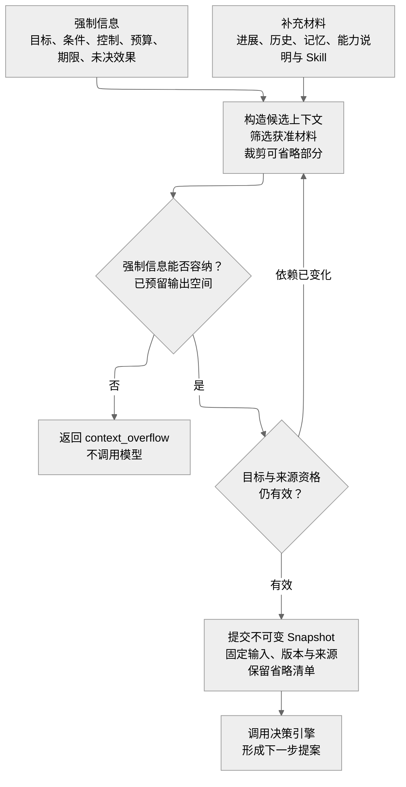

# 决策记忆执行与协作能力

Lerna 让能力模块独立演进，同时要求它们保留共同的身份、权限、费用和恢复语义。默认策略追求可解释的完整路径；更复杂的检索、规划、递归推理和协作只有在固定预算的对照实验中取得收益后才扩大使用。

本章说明算法与替换点。公开方法见[接口与协议](contracts.md)，对象字段见[数据与存储](data-model.md)，候选策略的外部依据见[能力与评估研究](research-learning.md)。研究中的效果不能直接作为本框架的保证。

## 决策引擎只形成下一步提案

决策引擎接收固定 Snapshot、准确策略和组件版本、资源限额及截止时间。它可以使用确定性规则，也可以发起模型请求。每个 Decision 至多一次物理模型请求；SDK 的隐式重试必须关闭。多步推理或多候选策略通过多个有独立身份和预算的 Decision 或子任务组织，不能把收费与工具循环隐藏在一个不可观察的调用中。

默认采用受约束的 ReAct：根据当前目标和实际反馈提出行动，取得新事实后再决策。规则决策引擎作为确定性基线，用于协议、故障和简单任务验证。模型供应商适配器只负责请求编码、流片段、结果和用量，不拥有 Task。

| Proposal 内容 | 决策引擎可以提出 | Orchestrator 如何处理 |
| --- | --- | --- |
| 条件候选 | 新条件、准确替换与来源 | 核验并采纳；实质变化先提交新目标版本 |
| 行动候选 | 能力、准确参数、依赖材料和目的 | 统一准入，不能相信模型自报权限或成本 |
| 请求输入 | 需要澄清的问题和有界答案结构 | 建立业务 InputRequest；授权确认另由真实授权负责方创建 |
| 候选成果 | 正文、证据映射和已知限制 | 发布准确内容，再做独立条件核验 |
| 无法继续 | 缺少能力、材料、预算或有效策略 | 保存具体原因，等待或结束目标推进 |

提案必须匹配闭合 Schema。格式错误记入该 Decision，不循环无界修复；如策略允许重新决策，必须申请新的有限预算。模型返回的工具名只能引用本次已提供的能力，不能临时构造任意 URL、函数或密钥引用。

流输出只用于可撤销的进度显示。完整提案、产出内容与来源记录持久化后，决策引擎才报告完成。模型答复未知时查询原供应商请求；无法查询则保留限制，不透明重发原请求。Orchestrator 可以在原费用风险已计入限额、原 Decision 不再可消费的条件下批准新的 Decision，不能重复采纳两个候选。

## 上下文构造与按需读取

ContextCompiler 由 Orchestrator 管理；内部选择、摘要和排序策略可替换。它的首要职责是保持目标与事实一致，然后才优化 token 使用。

下图把构造过程分为材料选择、容量检查和提交前复核。只有这三步完成，决策引擎才接收固定 Snapshot。

可打开[上下文构造图](assets/context-construction.svg)。补充材料不等于全部可删除：影响当前判断的事实和证据仍需保留。重建受原预算与期限约束；超限后的模型切换或目标拆分见下文，不在图中展开。

默认构造顺序如下：

1. 放入当前目标、必要条件、控制、剩余预算、期限和所有相关未决效果。这部分不得被摘要策略删掉。
2. 放入最近的有效进展、输入请求、行动结果和证据缺口。标明哪些是观察事实、模型推断或用户要求。
3. 按用途和权限筛选历史与长期记忆；先检索元数据和片段，再对影响判断的内容回读原文。
4. 选择本轮需要的能力说明与 Skill。保留版本和依赖，控制候选规模，避免把全部工具说明塞入每次输入。
5. 根据模型输入上限和预留输出空间裁剪材料；保留省略清单与可继续读取的引用。
6. 提交 Snapshot 前重查目标与来源资格。依赖变化则重新构造，不能把不同版本拼接成一个未说明的当前事实。

强制信息本身超过模型上限时，ContextCompiler 必须返回 `context_overflow`，不调用模型、不静默删去约束。允许的后续选择是：在预算和当前许可内选择容量足够的已批准模型，或向用户请求缩小、拆分目标。若使用子任务分块，父任务仍保存完整条件并独立核验；不能把分块后未提供给子任务的条件当作已经满足。

Snapshot 保存准确输入材料、组件与策略版本、来源集合、预算快照和摘要派生关系。供应商提示缓存只优化传输与费用，不能替代持久 Snapshot，也不能赋予已撤权内容再次使用资格。

大材料通过 ContentRef、分页读取和受控查询访问。可选程序化读取在隔离环境中执行，并通过同一 hostcall 门禁访问内容。递归处理需要深度、子调用、并发、费用和期限上限；每个子调用计入根任务预算。

近期长材料与记忆研究支持保留这些可替换点，但默认何时使用全文、检索或程序化读取，必须由 Lerna 的任务集决定。不能直接采用论文中的成本拐点或上下文长度作为生产阈值。

## Memory 管理跨任务可复用的信息

长期记忆与任务记录分开。任务历史和工具输出进入上下文，不自动获得长期保存许可。MemoryRecord 区分事实、偏好、推断和经验，保留来源、观察时间、适用范围、有效区间、可选置信度及当前状态。

默认记忆路径为：获准观察 → 提取候选 → 来源和冲突检查 → 用户确认或有限预授权 → 发布准确版本。提取工作有材料、费用、候选数量和期限上限。失败后按 checkpoint 继续；不得因重试再次保存同一候选。

事实更新采用新版本与替代关系，不覆写历史观察。两份来源冲突时保留冲突和各自适用时间；未取得可信依据前不能只保留模型偏好的一份。时间问题必须根据用户询问的时点选择材料，不能总是返回最新断言。

检索先限定当前有权使用的集合，再排序。默认提供词法、准确字段和时间过滤的简单实现，保留朴素匹配作为对照；向量、混合检索和关系索引都是可选投影。索引丢失必须能从有权保留的源记录重建，索引本身不能成为独立授权来源。

| 操作 | 必须保留的行为 | 失败或缺口 |
| --- | --- | --- |
| 查询 | 返回准确版本、来源、适用时间、排序说明和分页水位 | 权限、索引或来源不完整时返回 partial 与 gaps |
| 更正 | 保存新版本、原版本关系和受影响投影工作 | 并发版本冲突不自动覆盖 |
| 限制用途 | 先收紧原记录的使用资格，再传播到已登记副本 | 传播未完成须可观察，不声称瞬时物理删除 |
| 删除 | 建立墓碑，封闭新读取并安排副本清理 | 擦除失败保留 residual 或 unknown |
| 经验发布 | 绑定来源轨迹、适用环境、验证依据和策略版本 | 未验证经验不得冒充已证实规则 |

查询分页绑定查询条件、候选版本集合和权限代次。权限变化后旧分页失效；空页不等于完整无结果。原文被合法清理后可以保留获准的最小元数据，但必须说明该记忆不能再回读原文，不能伪造证据可用性。

## Executor 统一管理实际行动

Executor 接收准入后的 OperationIntent。它核验实际资源、当前启动许可、版本和占用，保存 Attempt，再由驱动调用外部目标。接口同时返回效果、观察证据、用量和是否仍可能有迟到效果。

每项 Capability 必须声明效果类型、幂等范围、查询与取消能力、费用上界或保守限额、数据用途和适用平台。读接口不能仅因 HTTP GET 就被认定无副作用；声明需要实际合同与探针证据。

| 驱动类型 | 默认行为 | 必须额外核验 |
| --- | --- | --- |
| API | 使用准确端点和规范化参数，优先目标幂等键 | 原请求查询、幂等保留期、隐式重试、用量含义 |
| 受管文件 | 在受控目录写入准确内容，尽可能原子替换并读回 | 路径归一化、符号链接、摘要、持久化及覆盖授权 |
| GUI | 观察界面、行动、再次观察并判断效果 | 设备占用、用户接管、前台目标、迟到输入与观察可信度 |
| 程序环境 | 在隔离进程或沙箱运行有界代码 | CPU、内存、网络、文件范围、真实退出与 hostcall 账本 |
| 外部 Agent | 建立原委托和远端句柄，获取进展与成果 | 远端创建去重、控制、效果关闭和费用更正 |

GUI 操作在设备资源上串行执行；重复截图不能证明输入未发送。程序 cell 的变量提交与外部效果分开：只有完整成功的被动变量结果可以形成新环境版本，已经发生的 hostcall 不随变量回滚。第一版不恢复运行栈。

资源占用记录由执行资源的 owner 管理。租约过期后，只有旧实例被可信隔离或真实退出得到确认，才能允许可能冲突的新输入。对于无法隔离的第三方目标，继续按未知效果处理。

## Evaluator 检查条件但不裁决任务

Evaluator 输入准确条件、规则版本、目标修订、候选成果和材料；输出 `pass`、`fail` 或 `unknown`，附证据、检查时间、适用范围及保证等级。异常和材料缺失不能编码成 pass。

效果条件优先使用确定性谓词，例如目标文件的内容摘要与位置。开放质量可以组合规则检查和独立模型判断，但必须声明尚未校准的范围。评估模型读取的材料同样需要授权，评估调用同样计费。

多个条件不通过平均分合并。必要效果失败不能被文字质量高分抵消。评估实现退役只影响新调用；确认的判断缺陷按规则、版本和适用范围使相应旧证据失效。正式评测的真值与运行时自评必须分离。

## 多 Agent 协作

默认一个 Task 由一个 Orchestrator 负责，按需创建多个独立子目标。分布式模块不是多个 Agent；只有持有子目标、上下文与决策循环的主体才构成委派。

委派前必须检查子问题可独立验收、材料可合法共享、预算可分配，且不会与其他分支争用未协调的可变资源。Delegation 固定父目标修订、子目标、条件、能力范围、预算、期限和返回证据要求。

内部子任务由受信注册记录维护父子关系，禁止循环和越过深度上限。跨 owner 子任务以有限额度持有独立 Task；父任务的准入责任登记必须先于子任务创建。子任务返回的是结果及证据，父任务按自己的当前条件验收。

取消由父任务传播到子任务并保留逐项落实情况。父目标修订时，默认使旧修订下所有活动 Delegation 失去新行动资格，并在父控制事务中登记取消或收紧传播责任；不能仅忽略子结果而任其继续消耗。跨 owner 的已签有限窗口仍按原期限收尾，不能声称瞬时停止。需要继续的子目标在旧目标行动和效果关闭后，由新修订创建新的 Delegation；旧结果只能作为候选证据，按新条件和当前使用权限重新核验。

父任务成功必须等待相关子目标终结及效果关闭；失败或取消可以先终结目标，仍保留收尾责任。子任务预算只能从父任务分配，不得自行重新申请同名根预算。旧分配在消费关闭前不得回收给新委派重用。

外部 Agent 保留其独立运行时。若协议无法保证创建去重和原任务查询，则不开放自动重复创建；若不能证明行动已经关闭，则只能作为受限咨询来源，或让本地目标保持明确未结状态。不能把自然语言“我已停止”当作所有外部效果已关闭的证据。

## 未来触发与经验改进

Schedule 属于可选应用能力，保存时间规则、时区版本、目标模板、预算、期限和错过策略。触发工作使用原 JobStore；每个发生时点有独立 Occurrence 和固定创建命令。重复唤醒不能多建任务。第一版不补跑错过时点，不支持任意代码日历规则；暂停计划不自动取消已创建 Task。

自进化采用候选、隔离评测、批准、有限发布和回退流程。常规记忆更新在明确授权范围内可以自动生效；声称能力改善需要对照证据。Skill、策略和 Agent 配置通过评测后逐步启用；插件及内核代码形成可审查补丁，由维护者批准发布。

运行轨迹不能未经用途许可进入训练或全局经验库。策略不能修改自己的评测门槛、权限或预算。改进成败按[实施与验证](validation.md)的实际结果、成本和错误效果共同判断。
