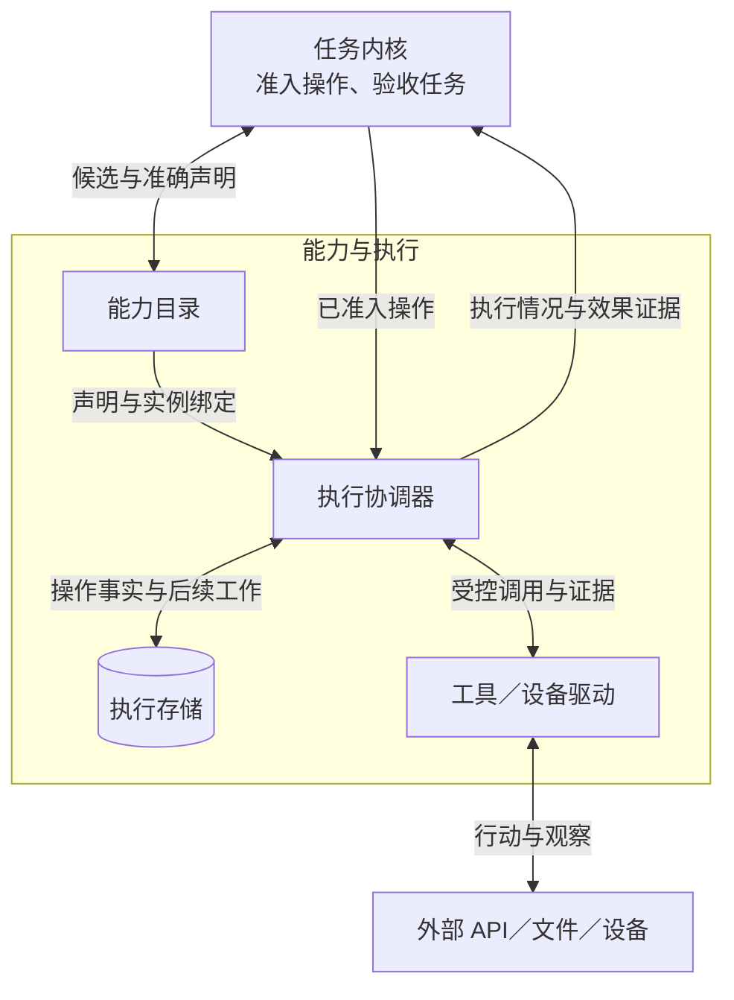
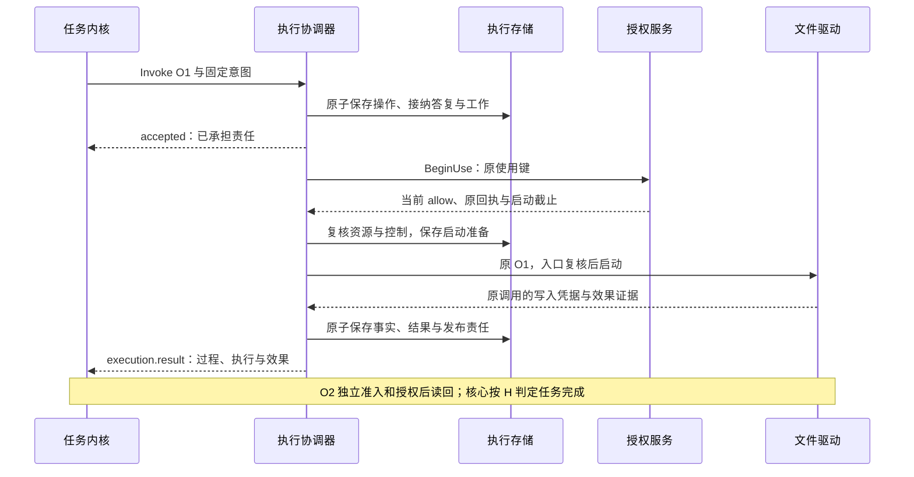

# 能力与执行详细设计

能力与执行接收[任务内核](../task-kernel/README.md)已准入的操作，调用工具或设备，并报告执行情况和效果证据。中断后，执行协调器依据持久记录继续处理；任务核心根据执行事实判断任务是否完成。

当前为设计方案，尚无运行实现。设计支持同进程与经网关 WSS 的跨端调用，固定任务控制方与执行端点。CE-P1／P2 已采用，提供方与运行证据仍待验证。

执行协调器在接纳操作前检查必要依赖，缺失时拒绝接纳。接纳后若依赖失效，协调器阻止尚未启动的动作，并保留原操作记录和后续处理工作。具体依赖及处理规则见[提供方与缺席行为](validation.md#dependencies)。

读完本页，可依次阅读[目录与接口](catalog-and-contracts.md)、[执行与恢复](execution-and-recovery.md)，再查[跨端合同](remote-contracts.md)，最后查[验证与依赖](validation.md)。

## 1. 分工与边界

下图从任务侧看一次调用。框内是本模块的四个组件，箭头表示调用、事实返回或存储读写；任务内核的核心、组装器和工作者合并表示。

能力声明是一项行为的固定版本契约；实例绑定指定承载它的执行端、已验证驱动及配置。声明的登记、发布和停用规则见[能力目录](catalog-and-contracts.md#catalog)。

具体行动由大脑提出、任务核心准入。目录命中或实例在线都不代表本次行动获准，协调器调用驱动前，还须向[授权服务](../identity-and-authorization/README.md)确认本次使用仍被允许。

## 2. 关键取舍

外部行动与本地账本无法原子提交：文件可能已写入，协调器却没有收到结果。因此，一个操作固定执行端点、驱动版本和意图；启动前保存准备记录，结果不明时先查询原调用。缺少核对能力的驱动会留下待处理项。

执行失败或用户取消时，外部效果仍可能已经发生。因此，协调器分别记录操作进行到哪一步、动作的执行结果与实际效果，并保留后续工作。发出结果后，核对和交接责任仍可能继续。

目录选择和设备控制各有独立约束：

| 问题 | 选择与代价 | 适用边界 |
| --- | --- | --- |
| 大量 API 无法全部放入上下文，检索结果也不足以准入 | 先检索候选，再读取准确声明，固定版本与目标；增加一次读取 | 小型固定能力集可直接精确查询，仍保留版本校验 |
| 工作者租约到期，旧进程仍可能操作设备 | 由受控资源入口串行启动；承担同设备排队和隔离成本 | 驱动证明资源独立后可细化互斥域；租约只用于调度 |
| GUI 页面、焦点和用户控制随时可能变化 | API 优先；GUI 按“观察、单个动作、再观察”推进，每个动作独立准入 | 首期每次 Invoke 只有一个有限使用单元；原子 API 可承载有限业务操作，长流程由任务内核推进 |

API 失败后能否改用 GUI，由大脑依据已知效果提出新行动，任务核心确认原操作不再继续生效，并检查权限和预算后准入。协调器和驱动不自行切换工具。

## 3. 一次写入如何完成

任务要求将指定内容写入文件 A，再读回确认摘要 H。写入 O1 使用 `local.file.write@1`，读回 O2 使用 `local.file.read@1`，两次操作分别准入和授权。

下图从 O1 已准入、派发责任已保存开始，省略消息层回执。`accepted` 表示执行端已持久接纳责任；外部写入在存储事务之外。

协调器只有确认启动准备已持久保存，才可调用驱动；驱动入口还须复核当前资格和控制要求。授权回执、启动期限及提交不明时的处理见[授权与启动](execution-and-recovery.md#resources)。

写入凭据只证明声明约定的写入行为。任务要求读回匹配 H，因此任务核心还须取得 O2 的证据；驱动不能在 O1 内隐含执行读回。

证据字节由内容服务保存。若协调器交付的是内容引用，读取方还须确认字节可读且完整；证据要求见[驱动接口与证据](catalog-and-contracts.md#driver)。

## 4. 写入响应丢失后如何继续

O1 可能已写入但响应丢失时，协调器保留原操作及其执行记录，按原调用核对。超时或暂时查不到都不能证明未执行，也不能据此新建操作再次写入。原键重放仅在驱动证明不会增加效果、当前行动资格仍有效且满足[全部恢复条件](execution-and-recovery.md#recovery)时允许。

若用户此时取消任务，执行端在收到取消控制后阻止尚未开始的动作，并尝试停止在途调用。取消不能撤回已经发生的效果；迟到的写入证据仍按当前权限保存和报告，任务保持取消。资源如何释放、设备接管后如何恢复，分别见[资源控制](execution-and-recovery.md#resources)和[取消与接管](execution-and-recovery.md#cancel)。

缺少查证条件或核对额度耗尽时，协调器停止主动核对，记录尚缺的证据或条件。用户可通过[受信处置入口](validation.md#management)补证或管理后续核对；停止核对不会把未知效果改成成功或未执行。

## 5. 实施范围与依赖

本方案对应[系统全景图](../diagrams/system-panorama.drawio)的 `execution` 分组。目录、协调器、执行存储和驱动已能覆盖闭环职责，账本、资源入口及工作队列在其内部实现。只有实测出现独立扩缩容需求时再拆部署，持久交接与事实归属保持不变。

| 场景 | 实施范围与启用条件 |
| --- | --- |
| 本地参考闭环 | 版本化目录、API、本地文件及有状态模拟 GUI 驱动；覆盖接纳、资源仲裁、授权使用、事实发布、取消与有限核对 |
| 跨端调用 | 复用 v1 invoke／query／cancel 与事实消息；准确声明、来源、控制／授权恢复及预算依据沿[已定义领域合同](remote-contracts.md)由受信提供方落实。依赖缺少时禁止新行动，仅保留获准的原操作查询、控制与事实处理 |
| 离线执行 | 默认关闭；单独批准有限离线窗口且本端具备任务控制、全部依赖、有效许可、可信时间及唯一账本才可启用，失联不扩大原范围 |
| 后续能力 | 实际手机平台、多使用单元的流式调用、跨执行端自动接替、任务控制权交接、不可信插件通用沙箱；跨端目录／控制已纳入本设计 |

跨执行端自动接替还需完整账本接替、旧实例隔离和原目标幂等保证，首期不支持。

跨端的消息接收、业务接纳和效果确认遵守[协议持久交接](../endpoint-cloud-protocol/message-contract.md#handoff)，任务、授权和外部 API 各自提交，不形成全局事务。已采用 [CE-P1／P2](remote-contracts.md)：准确目录、受信执行依据、事实修订、可信用量、管理及完整取消答复恢复均有线合同。

## 6. 保证索引与验证

E1–E7 供[验收用例](validation.md#tests)引用，完整规则在相应专题定义。

| 编号 | 保证 | 权威定义 |
| --- | --- | --- |
| E1 | 候选不充当准确契约；声明不可原地改义，旧操作不静默切版本 | [目录](catalog-and-contracts.md#catalog) |
| E2 | 原操作绑定用户、目标与意图；接纳决定和后续责任一起保存 | [接纳与存储](execution-and-recovery.md#admission) |
| E3 | BeginUse、启动准备和实际入口分别复核；租约与旧回执不能绕过控制 | [资源门禁](execution-and-recovery.md#resources) |
| E4 | 过程、效果与任务完成分别判断；未知效果先查原操作 | [状态与恢复](execution-and-recovery.md#states) |
| E5 | 取消、接管和撤权阻止可阻止的新行动，保留真实效果与收尾责任 | [取消](execution-and-recovery.md#cancel) |
| E6 | GUI 动作有观察前提、独立操作和再观察；过期界面不盲点 | [GUI 闭环](execution-and-recovery.md#gui) |
| E7 | 用户隔离、有限消耗、证据用途及保留共同约束接纳和恢复 | [部署与容量](execution-and-recovery.md#deployment) |

本模块直接承担[项目目标](../../harness-project-goals.md)中的 C4，并通过内容获取、能力接入、恢复、授权复核和观测支撑其他模块。各项保证与目标的对应关系见[验收矩阵](validation.md#tests)。

当前可完成 L1 契约评审。L2–L4、千项 API 覆盖及 90%／95% 效果目标仍须取得[运行与专项验收证据](validation.md#tests)。

V1 在本模块验证实际取证与来源，答案质量由整体评测判断；V2 验证模拟设备的观察、动作、再观察和接管。模拟验证不代表真实手机平台已获支持。
