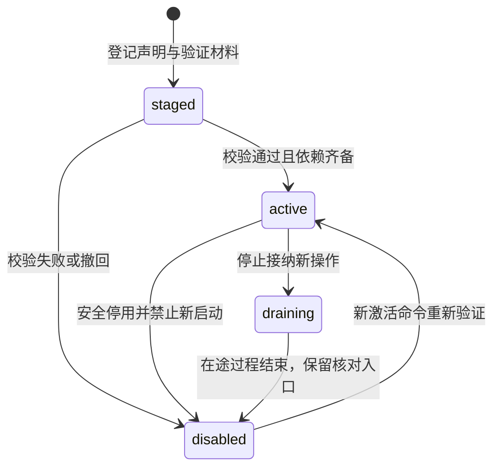

# 能力目录与协作契约

[总览](README.md) · [执行与恢复](execution-and-recovery.md) · [验证与依赖](validation.md)

本页定义本模块新增的逻辑接口与内部值，不是可直接发送的 JSON。现有线字段及上限由[execution Schema](../endpoint-cloud-protocol/schemas/execution.schema.json)和[公共字段](../endpoint-cloud-protocol/wire-format.md)定义；下文只说明映射和新增的本地约束。所有入口使用[可信 RequestContext](../identity-and-authorization/contracts.md#identity)，用户、行动主体和处理服务身份不能来自未经验证的参数。

## 1. 从登记到可调用

目录采用精确键索引加有限文本检索作为默认实现，不依赖向量库。先按用户可见性、目标端、协议版本、资源类型和必需保证过滤，再按名称／标签匹配排序，以精确键稳定打破同分。检索返回截断标记与游标，空结果只代表本次查询无候选，不代表系统没有其他能力。后续引入语义检索时，结果仍只能进入同一精确校验路径。

图描述一个实例绑定的发布状态，不表示进程是否运行或某个操作是否完成。

`draining` 允许已接纳操作按原绑定继续，查询与取消仍可用；`disabled` 禁止尚未发生的新启动，保留获准核对路径。安全停用须通知协调器并使启动入口同步拒绝，不能只从搜索结果中删除。实例重启不构成重新激活；卸载前仍有操作或未知效果时，应保留原驱动的受限查询能力，做不到则保存明确恢复缺口。

同一 `(capability, capability_version)` 的声明内容不可变；同版本异内容登记冲突。多端实例可以实现同一版本，语义声明须一致，平台可用性和凭据绑定属于实例。修复驱动实现可保持能力版本，但必须产生新实例配置修订；已接纳操作固定原实现绑定。默认排空后切换新接纳，旧操作缺驱动时等待或核对，不用新实现解释旧结果。意图、参数、效果或恢复保证变化须发布新能力版本。

## 2. 准确声明与实例绑定

所有必填组都由安装包提供并经扩展管理器及目录验证。无法落实的保证填写明确的 `none`／不支持，不能用空值暗示默认支持。目录保存验证材料引用和测试版本，材料本身不证明未来调用必成功。

| CapabilityDeclaration 字段组 | 内容与约束 |
| --- | --- |
| 身份与版本 | `capability`、`capability_version`、声明格式版本、不可变内容摘要、提供者及包版本；能力名和版本类型沿 v1 |
| 选择信息 | 简述、动作类型、标签、适用资源与平台；属于可检索说明，不是可执行指令或授权依据 |
| 参数与产物 | `arguments_schema`、`result_schema`、证据格式及版本、错误语义；使用仓库既有 JSON Schema 方言，禁止未固定的远程引用；参数不能暗含任意脚本执行 |
| 资源与权限 | 已安装资源规范化器版本、有限动作／用途标识、UseIntent 构造规则、完整来源解析规则、支持的 obligations 与接收方／位置限制；资源解析不得产生目标副作用 |
| 有限执行单元 | 单次调用的动作／字节／持续时间边界及运行截止支持；首期每次 Invoke 固定一个有限单元、unit_no=1，多来源仍按授权 source_role 区分；长流和多单元自动推进留待后续 |
| 效果语义 | 是否有外部写入、`effect` 适用性、确认条件、否定证据条件、允许的证据生产者、结果读取是否需额外权限；不把 HTTP 成功码统一解释为业务成功 |
| 恢复保证 | 原调用查询覆盖范围及保留期、原键重放条件与有效窗口、外部幂等键作用域、取消能力、进程隔离／停止依据；未声明安全重放默认禁止 |
| 资源与成本 | 互斥域解析、并发限制、请求／响应字节上限、时间和调用次数上限、可落实的费用上限或仅估算、用量来源与结算规则 |
| 环境依赖 | 驱动、外部服务、内容服务、凭据、必要扩展与最低能力；允许离线的条件及不支持场景 |

`result_schema` 约束驱动结构化产物和声明的证据内容，不把 v1 的 `summary` 变成 JSON 通道。跨端结构化证据可按该能力已固定的格式存为 `artifacts` 内容，取得字节后校验；调用方没有相同格式或当前读取权限时保留证据缺口。声明中的结构化产物不自动获得长期保存或同步许可。

| InstanceBinding 字段组 | 内容与约束 |
| --- | --- |
| 精确绑定 | 声明键与摘要、逻辑执行端点、driver_id／实现版本／配置修订、登记命令及发布修订 |
| 受信宿主 | 账本及活动所有者绑定、驱动隔离配置、资源入口引用、支持的保证验证材料 |
| 实例状态 | staged／active／draining／disabled、状态修订、依赖健康和最近核对时刻；健康是短期观察，不授予权限 |
| 资源配置 | 已验证资源范围、凭据引用、用户配额和收尾配额；目录向调用方隐藏凭据及其他用户实例 |

目录的 `Resolve` 返回固定声明、目标实例和短期可用性依据。内核保存精确语义版本及目标；执行端在接纳时固定实现绑定。首期同一用户、目标端、能力版本最多一个接纳新操作的实例配置，避免 v1 无实例字段时产生歧义。停用与接纳竞争本地激活修订；已有操作通过原账本定位旧绑定。

Skill 是操作知识，不自动注册可调用驱动；插件可提供经过验证的驱动；持有目标与决策循环的 Agent 通过协作任务端点委派。禁止将长时间自主 Agent 包装成不透明工具来绕过子任务、预算和取消契约。

## 3. 调用方看到的接口

| 接口 | 最小输入 → 输出 | 成功、重复与失败语义 |
| --- | --- | --- |
| `Catalog.Register`／`SetAvailability` | 受信登记命令、完整声明／实例，或预期发布修订与目标状态 → 固定回执 | 仅受信扩展管理器或组装器可写；同命令异内容冲突，未知提交查原命令；不代替插件评测和发布批准 |
| `Catalog.Search` | 可见范围、需求、必需约束、有限页大小／游标 → 候选精确键和截断标记 | 只读；分页绑定查询及目录修订，修订失效重开查询；候选不能直接派发 |
| `Catalog.Resolve` | 名称、精确版本、目标端 → 声明、实例及缺口 | 只读；不可用、缺版本、不可见分别按安全错误返回，不回退到最新版本 |
| `Execution.Invoke` | 固定操作、参数、任务关联、期限和许可引用；受信上下文补足来源／控制／资源预算依据 → 接纳／拒绝 | 接纳按[事务边界](execution-and-recovery.md#admission)持久；重复返回原接纳决定；不重新启动或消费 |
| `Execution.Query` | 原 operation_id、当前查询权限 → 当前过程、执行事实、效果、获准证据 | 读取权威已保存事实；必要时唤醒唯一核对工作，不能把缓存缺失当未执行；外部 Query 有独立权限与有限额度 |
| `Execution.Cancel` | 取消操作 ID、原 operation_id、原因 → 接纳／拒绝，后续固定取消结果 | 独立去重；接纳只承担停止／核对责任；对原操作无隐含回滚 |
| `Execution.ApplyControl` | 本轮受信任务／授权应用依据或本地接管命令、预期控制修订 → 持久应用依据 | 内部适配接口；保存控制与门禁后返回，旧轮或不连续变化不放行；不新增 v1 control 类型 |
| [本地处置接口](validation.md#management) | 原操作／设备、固定命令及受信管理身份 → 查询、补证、有限核对或重新开放的回执 | 不改变任务状态或预算，不允许手工把未知改成成功 |
| `Execution.CheckRecovery` | 恢复轮次、作用域、端点 owner、各领域切点与原操作清单 → 可接收事实／可继续行动／受限项及依据 | 只依据本轮完整事实判断；过期、缺口或 owner 改变关闭相关条件；消息交付汇集结论 |

Invoke 的固定身份覆盖受信用户／行动主体、请求类型和版本、源／目标端点、task_id／owner_epoch（如有）、能力与版本、原始参数与内容摘要、启动期限、grant_ref 及受信意图／来源绑定。比较语义使用登记的同版规范化器，保存规范值而非只存哈希；JSON 成员顺序可忽略，缺省值、数组、路径和数字等按固定参数规范处理。重新解析资源得到不同真实对象时拒绝启动，不能改写旧意图。

首次接纳后，即使能力停用、许可撤销或期限到达，获准披露的原接纳决定仍可查询；它不授予再次启动资格。Query 和迟到事实依据当前披露权检查，不能通过操作随机 ID 跨用户查询。

### v1 映射

| 逻辑行为 | 现有线契约 | 未承载的内容及处理 |
| --- | --- | --- |
| Invoke | `harness.execution.invoke@1`；参数仅 capability、capability_version、arguments，以及同时出现的 task_id／owner_epoch | 来源、意图、实例配置和预算不加到载荷；由受信本地关联或已安装适配器取得，缺失不启动 |
| Query／Cancel | 对应 `harness.execution.query@1`／`cancel@1`；target_operation_id 指原调用，取消有独立 operation_id | query 不是取消结果查询；完整取消答复超窗保留缺口 |
| 事实与结果 | `fact`／`result` 使用原调用 ID；`cancel_result` 使用取消 ID；都可靠交付 | 无修订与用量字段；沿内核[保守合并](../task-kernel/decision-and-work.md#dispatch)，用量无可信通道则保留预留 |
| 临时进度 | `harness.execution.progress@1` | 可丢失，不作恢复或完成依据 |
| 目录、驱动、管理及控制恢复接口 | 无新增标准消息 | 首期本地调用；跨实现传输见[待决提案](validation.md#proposals) |

expires_at、retain_until、source、authorization 等公共字段仍在原信封位置。Invoke 只返回 `accepted + recorded=true` 或拒绝；提交未知不虚构第三种业务响应。原请求和答复关联规则、作用域及 lane 由[消息契约](../endpoint-cloud-protocol/message-contract.md#identity)定义。

## 4. 驱动接口与证据

驱动是受信执行适配器，可以来自插件。默认参考实现只装载通过验证的驱动；安装不授予环境变量、宿主文件或网络的无限访问。无法落实凭据、文件与出口隔离时，不开放要求这些限制的能力。驱动提供有限映射，不接受模型生成程序作为隐式实现。

| 接口 | 输入与返回 | 必须落实的保证 |
| --- | --- | --- |
| `Normalize` | 固定参数及获准资源视图 → 真实资源绑定、UseIntent、互斥键和前提 | 无目标副作用；身份及路径绑定可在实际使用前重新核验；无法约束的范围拒绝 |
| `Start` | 原操作／unit、固定调用身份、参数、实现绑定及有截止的启动资格 → 已知启动事实／结果／不确定 | 必须经资源入口核对控制代次、当前资格及原调用记录；不自行换号重试、不隐含切工具 |
| `Query` | 原驱动调用身份、外部句柄、有限核对请求及核对授权 → DriverObservation | 明确来源、覆盖时间、是否终结及证据；not_found 只是本次未见，不能自行升级为未发生 |
| `Cancel` | 固定取消身份、原调用及当前控制资格 → 停止依据／未能停止／未知 | 同取消重投不得造成新目标行动；停止外部进程、封闭尚未进入的 Start 与回滚分开声明 |
| `CloseStart` | 原调用身份与隔离依据 → 该启动入口已永久封闭／未知 | 驱动具备此能力时，封闭和 Start 在同一持久入口串行；迟到 Start 被拒。未实现就不能以暂时查无证明零执行 |

外部幂等键须在首次 Start 前持久绑定到原操作。自动 HTTP 重试、SDK 重试及重定向都算物理调用，必须遵守声明中的幂等、目标和次数边界；目标改变须重新核对真实资源与接收方。查询／取消本身若产生费用或敏感读取，同样经过对应授权和收尾额度。

| DriverObservation／Evidence 字段组 | 内容及使用限制 |
| --- | --- |
| 原关联 | 用户、逻辑端、原 operation_id／unit／driver_call_id、固定意图及实现版本；协调器核对生产者 |
| 过程事实 | 是否被启动入口接纳、是否已启动、当前是否终结、是否仍可能产生后续效果，以及对应证明；未知分别标明 |
| 效果证据 | 确认／否定／不足、适用的能力判据、目标对象及版本、外部事务／资源句柄、观察时间和覆盖范围、获准内容引用 |
| 缺口 | 查询未覆盖、目标不可达、权限不足、冲突或内容缺失；明确需要的依据，不将描述文本解析为成功 |
| 用量 | 固定调用和用量项、整数单位、累计／增量语义、可信来源、已结算或未知；用于幂等结算，不推断效果 |

驱动的 `no_future_effect` 证明只表明原调用不能继续产生效果；已经发生的效果仍须单独查询。反之，已看到目标效果也不能证明没有在途后续写入。协调器分别判定效果与后续作用；释放互斥域按[资源释放规则](execution-and-recovery.md#resources)，是否新业务尝试交核心裁决。

## 5. 执行记录与错误

下表为逻辑记录，不规定表数量。所有业务键都含受信 user_id；同一执行账本内 operation_id 跨任务、invoke／cancel／管理种类唯一。跨端首次目标由内核固定，不宣称各端账本能自动实现全局去重。

| 记录 | 最小字段与约束 |
| --- | --- |
| ExecutionOperation | 原身份及完整意图、首次接纳／拒绝回执、声明及实例快照、驱动调用映射、授权使用键及回执关联、启动准备、state／execution／effect、取消标记、处置门禁及修订、证据和内部修订 |
| ExecutionWork | 固定 work_id、原操作、kind=prepare／reconcile／cancel／publish、pending／leased／done／closed、步骤回执、领取代次和期限、blockers、not_before、有限次数及剩余额度 |
| ResourceGate | 真实资源互斥域、当前运行资格、控制／接管修订、占用操作及未明在途；不能靠调度租约到期清空 |
| CancelRecord | 取消操作、原调用、固定原因、接纳决定、取消驱动调用关联、不可变 cancel_result 与发送责任 |
| Evidence／Usage | 原关联、原始可信观察、内容与来源、判据版本、冲突集；用量项幂等键；与操作投影一起提交 |
| CommitReceipt／Publication | 原提交键、意图绑定、决定及后续责任；固定消息身份、载荷和交接凭据；获准保留原结果，不依赖消息窗口 |
| CatalogEntry | 固定声明、验证证据、实例和发布修订、登记回执；索引可重建，准确声明不得仅存在于搜索缓存 |

内部修订只用于本账本条件更新和诊断，不冒充 v1 执行事实修订。发布的事实以已经保存的完整快照固定；旧消息重投不改内容，新观察产生新事实。

| 内部原因 | 现有线表现 | 调用方后续行为 |
| --- | --- | --- |
| 结构、参数或字段关系不合法 | `core.invalid_message`，never | 修正调用构造；不得改写已存在操作意图 |
| 用户／主体、许可、用途或披露不符 | `core.unauthenticated`／`core.forbidden`，after_change | 恢复身份或获准范围；旧效果继续按可用权限核对 |
| 同操作异意图／同版本异声明 | `core.identity_conflict`，never | 保留原记录，修复调用方；不自动换 ID 再执行 |
| 能力不存在、停用、观察过期或控制条件失效 | `core.precondition_failed`，after_change；协议类型缺失使用已注册 unsupported 码 | 首次明确拒绝后重新决策；已接纳操作通过事实报告停止／缺口，不能事后改成首次 rejected |
| 过启动期限 | `core.request_expired`，after_change | 不延长旧意图；已接纳项保存未启动或未知的真实事实 |
| 容量不足／依赖暂不可达且确定未接纳 | `core.overloaded`／`core.unavailable` | 依 retry 在原期限内重投或等待；不能掩盖提交未知 |
| 查询对象已清理、从未见或不能完整恢复 | 获准查询后 `core.recovery_gap`，query_operation | 保留原关联及缺口，转受信处置；错误不证明未执行，也不制造 query 的新状态 |
| 效果无法确认 | 已知三维事实及缺口；需要错误时 `execution.effect_unknown`，query_operation | 有限核对原操作；不生成替身 |

完整 retry 规则以[协议错误](../endpoint-cloud-protocol/wire-format.md#errors)为准。所有只读接口可有限重查；变更调用超时停止的是等待，不撤回事务和外部行动。
