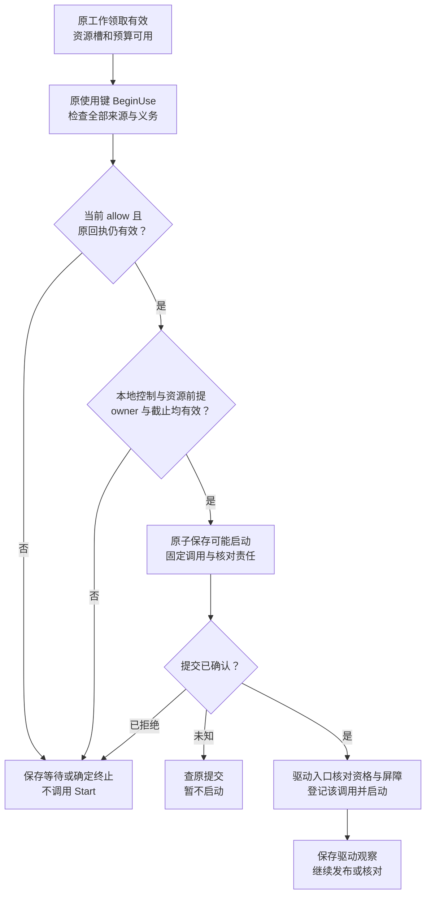
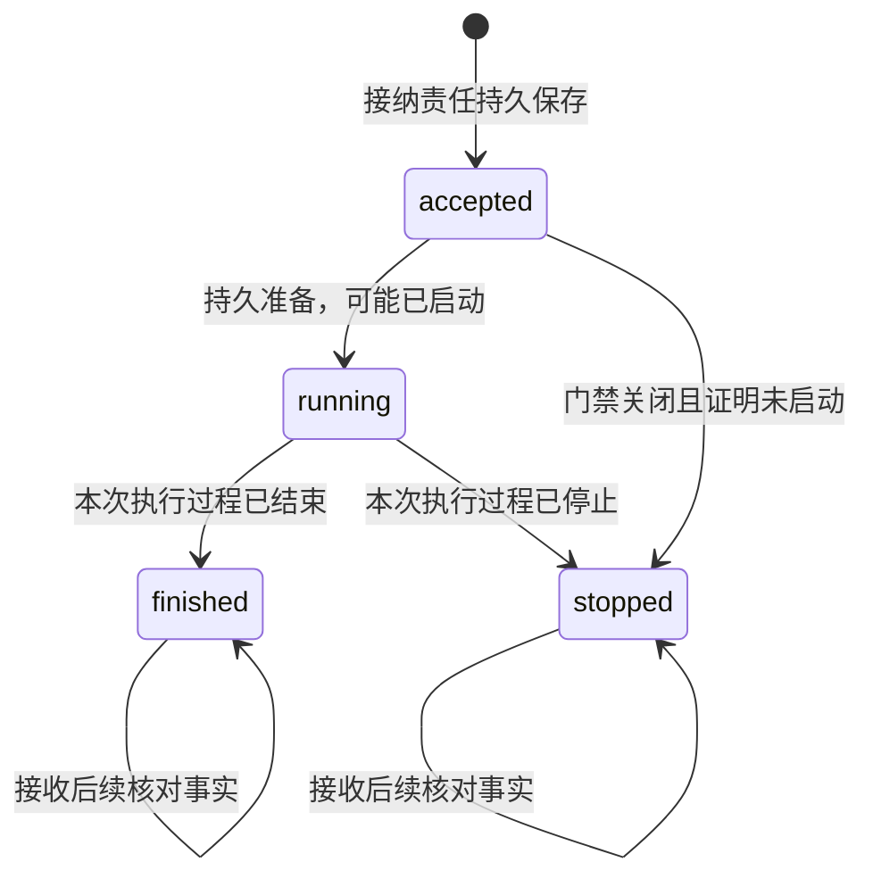
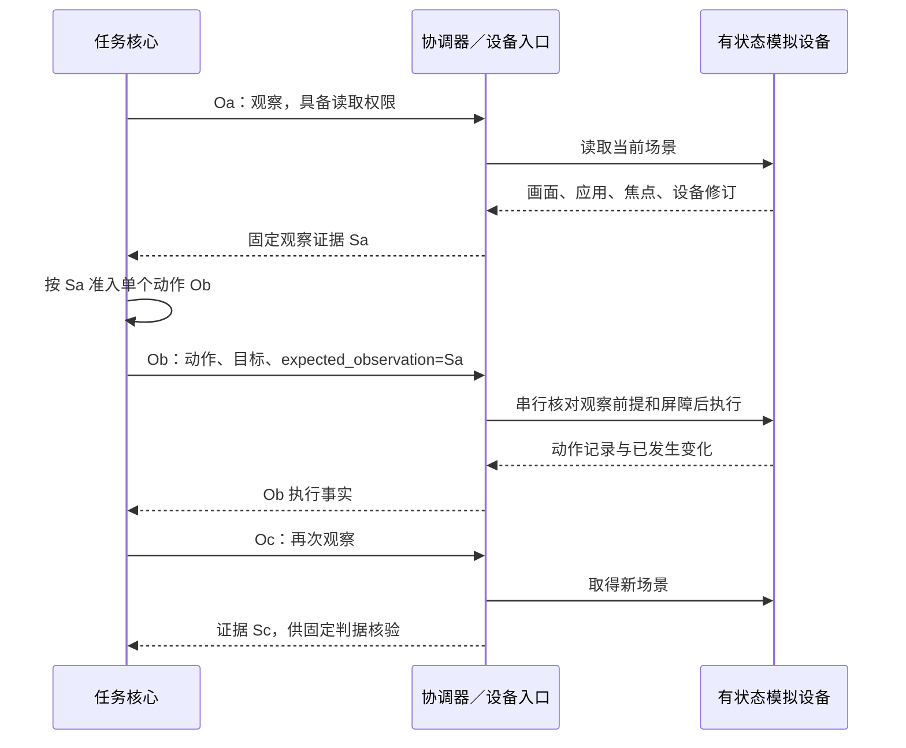

# 执行机制与异常恢复

[总览](README.md) · [目录与接口](catalog-and-contracts.md) · [验证与依赖](validation.md)

本页沿一个固定操作展开。任务内核的 Work 负责把操作可靠交到执行端；本页的 ExecutionWork 负责执行端接纳后的启动、核对、取消与事实交接。二者是不同责任，分别由自己的存储保存，不能以一边的工作完成删除另一边的责任。

## 1. 接纳与持久边界

Invoke 的接纳按以下顺序进行。外部服务调用在事务外完成，事务内只核对受信结果的关联、新鲜度和本地版本：

1. 认证用户、行动主体、来源及访问范围，校验结构和消息关联。先按用户及原操作查账本；原操作存在时比较固定意图，返回获准披露的原决定，同键异意图拒绝，不按今日目录重解释旧参数。
2. 新操作读取精确声明及唯一活动实例，取得完整来源、任务控制与预算限制。校验参数，获准解析真实资源与 UseIntent。规范化所需的敏感读取也须有权限，不能通过预检偷读内容。
3. 分别检查声明／实例修订、期限、当前控制与权限、内容完整性和驻留条件、用户队列及持久容量。独立操作使用受信宿主固定的本地预算；关联任务沿用原预算分配。没有可信跨端分配通道时，不承诺内核硬预算已经落实。
4. 在执行账本内按唯一操作键及预期实例／控制修订，原子保存固定意图、实现绑定、接纳答复、初始 prepare 工作、发布答复责任和收尾容量占用。确认耐久提交后才返回 accepted；驱动此时尚未调用。

拒绝决定能持久保存时，按同一原操作保存固定拒绝及答复责任；重复返回原决定。存储无法确认提交时不返回“确定拒绝”，由消息交付保留待处理责任。接纳后依赖失效通过操作事实收束，不能把原 accepted 改成 rejected。业务明确拒绝后，改变条件须由核心决定新尝试；传输层的 `same_message` 只恢复原消息处理，不能推翻已固定的业务拒绝。

| 执行端事务 | 原子保存的内容 | 事务外继续者 |
| --- | --- | --- |
| 接纳／拒绝 | 意图绑定、决定及响应责任；接纳另含原操作与 prepare 工作 | 发布工作交给消息交付；prepare 工作者只处理已确认接纳的操作 |
| 启动准备 | 固定 driver_call_id／外部幂等键、使用键及已取得回执关联、可能启动标记、资源占用与核对责任 | 原有效资源入口发起一次 Start；未知提交先查原步骤 |
| 控制应用 | 取消／撤销／接管修订、启动屏障、受影响工作及取消／核对责任 | 受控入口阻止未进入的 Start，工作者处理在途取消 |
| 事实提交 | 可信观察、证据／用量去重、三维投影、下一次核对或处置缺口、固定发布消息 | publish 工作者可靠交接；终态也可留下核对工作 |
| 取消结果固定 | CancelRecord 结果、原调用事实关联及可靠发送责任 | 继续交接该答复；后续原调用证据不改写已固定答复 |

每步使用发起前可重建的提交键：业务请求用原操作及类型，驱动观察用原调用及观察标识，工作步骤用 work_id／领取代次／步骤及固定序号；操作唯一约束跨类型生效。先查回执再核对新版本。同键异内容拒绝；`Committed` 才允许下游行动，`Rejected` 必须证明事务已结束且未应用，`Unknown` 按原键核对，不换序号绕过。

恢复查询须区分“当前未见”和“旧入口已隔离、原事务已结束且确定未应用”。只有后者可重新计算该步；发现已提交采用原记录。只读副本、刚恢复的旧备份和超窗回执都不能证明未提交。数据库不可写时停止新接纳及新启动，保留消息待处理；本地设备入口仍先封闭自动动作，不能因无法记录而继续执行。

## 2. 资源控制、授权使用与启动

prepare 工作者先以有限租约领取工作，按稳定资源键顺序取得全部所需资格。首期采用一次取得全部资源或释放后等待，避免持有部分资源等待另一资源。无空闲槽时保存 blocker 和唤醒条件；不占线程等待，也不提前消费短期使用回执。

**资源入口**是唯一能把本用户操作送到实际驱动的受控入口。逻辑操作按用户隔离；同一物理设备还必须在设备级仲裁，不允许两个用户的独立锁同时控制同一屏幕。参考 GUI 设备一次只绑定一个活动用户会话，切换用户先封闭旧入口并隔离旧工作，不能复用旧截图、剪贴板或凭据。

取得资源槽后按下图进入启动，图的对象是一次有限使用单元。授权与执行不共享事务，最后的本地门禁与控制应用须由同一个串行入口裁决。

使用键、单次消费及回执有效性完全沿用[授权契约](../identity-and-authorization/contracts.md#interfaces)。首期每个 Invoke 只包含一个有界使用单元，本模块持久固定 unit_no=1 和全部 source_role；一个 GUI 动作就是一个独立操作。需要分块或持续推进时，由核心在前一操作事实入库后准入下一操作，驱动不得自行生成下一 unit。BeginUse 提交未知先 ReadUse 核对，恢复启动还须重投 BeginUse 取得当前判定；历史回执不授予行动权，重复也不刷新 start_before。

“可能启动”标记不可回退。标记到调用之间即使崩溃且驱动未收到请求，恢复者也不能凭猜测重发。驱动入口登记原调用并检查屏障与资格的动作必须串行；已进入外部系统的动作作为在途事实处理。驱动内部存在队列时，出队实际行动前重验同一资格、截止和屏障，不能把入队时有效无限延长。

工作租约只限制谁可提交工作推进；活动所有者、资源占用、任务 owner_epoch 和控制屏障分别核对。过期工作者不得取得新的启动资格；旧进程仍可能使用设备时，资源占用保持未明。接替要求受信监督器证明旧入口已隔离，数据库锁失效或连接断开均不足以证明。具备入口代次校验的驱动在每次启动拒绝旧代次；不具备时仅允许单一受控宿主运行，故障后等隔离证明。

资源释放由协调器取得并保存充分依据：原启动资格已封闭，旧物理调用已结束或隔离，且不能再占用该资源。随后在同一事务保存释放依据、清除 Gate 占用并登记等待者唤醒。历史效果或费用仍未知可继续核对，不必继续锁住已证实空闲的设备；finished、not_applicable 或取消答复本身不足以释放。准备前因权限等待／失败释放预占时，也先封闭该次资格；以后恢复须重新取得资源和当前使用判定。驱动不能证明资源空闲就保留占用并报告具体隔离需求。

首次启动须早于调用 expires_at、许可／回执截止、任务与本地限制中最早者。排队、网络重投、领取和恢复均不刷新期限。准备前的暂时依赖故障保存 blocker 并有限重查；明确取消、撤权或安全停用则封闭启动入口并以未启动事实收束。到启动截止仍无准备时同样停止；已有可能启动标记的情况只沿原操作核对，不以期限代替效果结论。已启动操作是否可强制停止由驱动声明；启动期限到达不能证明既有外部调用已停。已知断网后普通在线回执不能用于首次启动，离线按入口列出的条件单独判定。

## 3. 三维事实与证据合并

过程状态沿 v1；下图只表示同一执行操作的过程，不表示效果或任务状态。启动准备已提交、实际启动尚不明时，用 running 表示进入执行处理，execution 保持 unknown。

`finished`／`stopped` 只终结本次执行过程，外部异步请求是否还会产生后续效果由独立证据判断。协调器失联、超时或额度耗尽本身不构成过程终结依据；没有过程证据时维持 running／unknown，并停止无界主动消耗。终结后不再启动该操作，仍可查询和补证。

| 维度 | 判定规则 |
| --- | --- |
| execution | 未进入可能启动且可证明入口封闭时为 not_started；可靠启动事实为 started；声明的动作完成为 executed；确定执行失败为 failed；无法判断为 unknown。failed 不抹除部分效果 |
| effect | 声明规定效果不适用时为 not_applicable；满足声明判据为 confirmed；已进行了适用观察但未见效果为 not_observed；未能观察、证据不足或冲突为 unknown |
| 后续责任 | 与上述状态分开保存：原操作核对、取消、结果交接、用量结算或人工处置缺口；不能因 result 已发出自动删除 |

accepted 时尚未观察目标，适用效果默认 unknown；不适用则 not_applicable。未启动且启动入口已封闭可附否定证据，将适用效果记为 not_observed。**not_observed 单独不足以证明没有效果**：只有覆盖原操作完整作用范围的权威否定证据，加上原调用不能继续生效的依据，才允许核心考虑新业务尝试。

驱动观察先校验原调用、生产者、目标和证据格式，再与保存事实合并。重复观察不重结算；过程终结后迟到 started 不回退状态。unknown 可被充分证据补足；两个已知结论冲突则同时保存证据、停止依赖放行，并由固定驱动按原调用核对。接收时间、内部修订及流 seq 都不能替代外部因果证据。无法解释的冲突保持缺口，不能通过最后写入覆盖消除。

执行结果保存声明中的产物与证据，至少绑定原操作、固定意图、目标对象、驱动及判据版本。V1 内容获取另带实际取得的来源标识、获取时间、内容摘要及截断／失败状态；只取得搜索摘要不能报告已获取全文。内容提交先于引用发布，字节保存成功但执行事务失败时可按内容身份回收未引用对象；内容不可用时报告缺口，不能生成虚假引用。

`execution.result` 是一次过程结束的已固定消息；后续查询发现效果时发布新的 fact 并更新 Query 视图，旧结果原样恢复。内核按现行无修订合并规则消费；本模块的内部修订不发送为未定义字段。若矛盾仍不能按证据澄清，当前协议只承诺报告冲突并阻止相关任务完成。

## 4. 原操作恢复与有限重试

恢复扫描先确认账本权威和活动所有者，核对未知提交，应用当前控制／授权，再处理未完成工作。工作由 pending 经条件领取进入 leased；责任交接完成进入 done，确定不再允许的目标步骤进入 closed，并另存必要收尾工作。租约过期先核对原步骤，只恢复查询和交接责任，不能重新发起未经原操作恢复判定的 Start。每步持久保存尝试次数、下次时间及费用占用；调度采用有上限的指数退避和抖动，到限转为待处理并通知一次，不无限创建新的工作。

每轮先保存并合并已取得的全部获准事实，分别核对过程、效果、后续作用和用量。效果已确认可以与过程仍在运行同时成立，不能只处理第一个命中的结论。随后按下表选择是否允许启动，按从上到下的顺序命中即停止行动选择；核对、取消和发布仍须分别满足自身权限与额度。

| 行动判定条件 | 本轮行动与后续责任 |
| --- | --- |
| 当前控制、授权、时间、预算或恢复依据不允许目标行动 | 禁止 Start；保存控制／缺口，按各自权限继续取消、查询和发布，不因停止行动抹除真实效果 |
| 原操作有固定拒绝，或过程已为 finished／stopped | 不再 Start；复用原决定，终结过程尚有效果／用量缺口时继续有限核对 |
| 原操作记录缺失，或还有未解决的提交未知 | 查原提交／恢复账本，无法证明时保存缺口；不重建新操作 |
| 原操作 accepted，启动准备不存在，原准备步骤已确认未应用或尚未发起，旧领取已封闭 | 沿原操作执行首次准备；仍重新取得有效 BeginUse 判定，不换操作或单次许可 |
| 已有启动准备，且有可靠证据表明原外部调用仍在执行 | 跟踪或取消原调用，不重交 Start，不建并行替身 |
| 已有启动准备、物理调用是否启动不明，且满足下一段全部安全重放条件 | 按原键有限重交，保持原意图、幂等窗口和核对责任 |
| 已有启动准备，其余尚未终结情况 | 默认 Query 原调用；not_found、超时和许可已消费都不证明未执行。不能核对时保存待处理 |

安全重放要求声明与测试证明原键重放不会增加目标效果，原逻辑操作尚未终结、当前目标行动资格全部有效、原回执与启动窗口未过、外部幂等窗口和费用上限可落实；禁止换 API／GUI、端点或外部键。缺少任何一项就进入 Query 分支。

行动选择后，独立保存已确认效果并可靠交接，核对仍可能产生的后续效果和费用。只有完整权威否定证据与原调用已结束或永久隔离两项同时成立，才将“可考虑新尝试”的依据交给核心；由核心检查权限和预算并创建新 operation_id、保存 retry_of。执行端不自行创建业务尝试，once 许可不退回。查询耗尽或冲突未解时保存所需材料、权限及[处置入口](validation.md#management)，停止主动消耗不等于清除未知。

同键安全重放是附条件的原调用恢复，必须由驱动契约和测试证明。查询重试不重新执行目标动作；它只能消耗已分配的核对额度。Execution.Query 默认返回已保存事实，重复查询只在[自动核对门禁](validation.md#management)允许且有额度时唤醒一条已有 reconcile 工作，不让查询风暴形成无限外部调用；停止核对后仅返回已保存事实。

贯穿例子的关键故障链如下。O1 的目标仍是写 A，O2 尚未准入：

| 事件 | 执行端保存与继续行为 | 核心可得到的结论 |
| --- | --- | --- |
| G1 已绑定，可能启动标记已提交，写入响应丢失 | O1 保持未知，保留驱动映射、资源占用与核对；不重新写入 | 接纳成立，效果未确定，不能准入依赖成功的读回 |
| 用户取消且端点失联 | 在线核心持久取消；端点只有收到控制或本地接管后才能落实屏障；报告未确认端点 | 任务可以取消，effects_pending 仍为 true；不能宣称远端已停 |
| 重连 Query 返回当前未见 | 先恢复控制，核对驱动查询覆盖及旧入口；未知继续存在 | 不把查不到转换成新写入机会 |
| 驱动后来返回 O1 写入凭据 | 获准时保存真实效果，按原关联交接；不重新开放自动行动 | 任务仍取消；待核对项须逐项收束才能清 effects_pending |
| 无读回或披露权限 | 保存获准最小状态及缺口，不自动读取 A 或上传正文 | 写入和任务读回验收的证据强度不同，不能假定已完成 |

## 5. 取消、撤销与用户接管

Cancel 接纳事务固定取消身份及原目标，保存停止意图、门禁与取消／核对工作。若取消先于本地启动准备提交，入口封闭且可证明未启动，原调用以 stopped／not_started 收束；若准备先提交，则请求驱动停止并核对，不以取消覆盖原事实。

| 原调用已知情况 | 固定 cancel_result | 后续责任 |
| --- | --- | --- |
| 取消处理前已可靠结束且效果已知 | already_finished | 交接已有事实及答复，不能宣称取消撤回效果 |
| 已证明过程停止，效果已知或不适用 | stopped | 交接停止及效果证据；部分已有效果仍如实保存 |
| 是否停止或效果存在缺口 | effects_unknown | 原操作继续有限核对；固定答复不随迟到事实改写 |

以上按从上到下判定，适用时还须确认“过程结束”没有被误当成外部后续效果已排除。原操作暂未找到时，沿 v1 返回固定拒绝及缺口；不保证先到取消建立拦截后到调用的墓碑。原调用后来出现，由调用方依据当前权限发起新的取消操作，已知任务取消／本地接管仍通过独立门禁阻止新启动。

本地接管由受信设备入口发起，先立即封闭自动入口并尽力中断，在可写账本上保存接管修订及传播责任后确认已持久应用。存储失败时入口保持关闭，重启默认关闭直到恢复；不能返回持久成功。重新开放使用[受信本地 ReopenAutomation](validation.md#management)，需要新的明确用户管理命令、当前权限及预期控制修订，重新观察设备；重连或点击普通任务输入不自动解除屏障。开放不会复活已经取消、终结或过期的操作。

撤销按授权模块的权威修订应用到同一门禁；收到通知前的有限传播窗口按授权契约表达。只撤销行动权限不一定禁止最小核对，但查询、读回、保存和披露须分别获准。取消和接管不隐含补偿、删除远端内容或费用退款，补偿必须作为新的获准操作准入。

跨端 cancel_result 仍属于 work lane，消息交付须在该 lane 保留收尾容量；不能改成未定义的 control 结果。完整取消答复超交付窗口后，现有 Query 只给原操作当前状态；缺少固定答复的恢复能力继续如实报告。

## 6. API、文件和 GUI 的默认实现边界

API 驱动从固定声明映射到已配置的服务、方法和参数，凭据由用户及资源绑定的受控出口注入。响应结构校验与业务效果核验分别进行；长运行服务持久保存原外部句柄。能力未提供可靠查询或幂等保证时仍可声明可执行，但结果不明后不自动重做；要求自动恢复的任务应在目录过滤时排除此能力。

文件驱动稳定绑定真实文件或父目录、操作意图和内容摘要，防止符号链接、目录和文件替换改变目标。写入策略及可核对的提交凭据由声明固定；不能因目标路径现在恰好含预期内容就证明 O1 曾成功。若该平台无法提供原操作写入证据，操作效果保持未知，而当前文件状态可由独立获准读回支持任务的相应验收条件。

GUI 驱动默认针对多个有状态模拟设备，提供 `device.gui.observe@1`、`device.gui.act@1`；act 的参数限定为点击、滑动、输入、返回之一。观察和每个动作都是独立操作，驱动不运行无限的“直到成功”循环。

图表示任务层的一次 GUI 交互链，设备版本和接管屏障由设备入口维护。

act 参数模式要求引用原观察、设备及应用、目标元素或坐标、预期界面修订／指纹和动作有限参数。入口按同一设备串行检查实际前台应用、焦点、方向、屏障及观察有效期；变化即明确拒绝或在尚未启动的已接纳项停止，不沿旧坐标点击。拒绝后核心先重新观察，再决定新动作。

模拟设备的修订与动作应用可在自身状态事务内比较和推进，从而验证观察过期竞争。真实平台若不能原子比较界面和注入动作，必须声明检查到行动之间的竞争窗口；要求强前提的任务不使用该实现，不能以一次截图比较宣称不存在误点。动作后的观察 Oc 也有独立读取和披露权限，不能隐含在只有动作权的 Ob 中读取屏幕。

设备级互斥用于一个有限动作；跨操作不长时间锁屏。观察后其他任务／用户改变设备时，下一动作的前提会拒绝。接管测试必须在排队、启动准备后及动作后分别注入，观察实际设备变化，不能只检查 cancelled 字段。

## 7. 存储、部署、容量与清理

默认同端把目录、协调器及执行工作者部署在同一宿主，驱动可经受限进程承载。云端执行存储选择 PostgreSQL，本地单机选择 SQLite，与[授权模块存储取舍](../identity-and-authorization/mechanisms.md#storage)一致；不要求共享授权事务。先采用事务表、唯一键、条件更新及可扫描工作，不引入外部队列作为唯一责任持有者。

PostgreSQL 用操作唯一约束和资源／操作行锁完成短事务，按固定资源顺序取锁；SQLite 使用短写事务并在明确事务状态后处理 busy。行锁在事务结束释放，SQLite 同时只有一个写事务，均不能代替进程外设备隔离。依据为 [PostgreSQL 行锁文档](https://www.postgresql.org/docs/current/explicit-locking.html#LOCKING-ROWS)及 [SQLite 事务文档](https://www.sqlite.org/lang_transaction.html)。

本设计要求提交成功涵盖部署声明的耐久范围：云端开启所需 WAL／同步提交与可靠存储设置，本地采用支持耐久提交的日志与同步配置，并实测断电／重启。数据库产品不能替硬件作持久保证，异步副本接替也不能自行宣称零记录丢失。依据为 [PostgreSQL 可靠性说明](https://www.postgresql.org/docs/current/wal-reliability.html)及 [SQLite synchronous](https://www.sqlite.org/pragma.html#pragma_synchronous)；具体配置版本随参考实现锁定。

端点持续账本必须与活动所有者恢复，旧备份缺少接纳、消费或启动记录时保持恢复受限，不能新建空账本重复执行旧请求。云端按用户分区，同一用户／逻辑端的操作索引和资源裁决位于一个提交域；不同端点通过固定路由协作，首期不跨端自动迁移原操作。物理设备所有者始终由实际设备入口唯一控制。

| 配置组 | 必须有限的参数 | 到限行为 |
| --- | --- | --- |
| 目录 | 每用户可见项、单页候选数、单声明及 schema 字节／深度、检索时长、激活频率 | 拒绝超限登记，检索截断可见；不会把全部千项声明送入每轮上下文 |
| 接纳 | 每用户／端点活跃操作、排队字节、待发布及证据容量 | 先预留接纳及收尾空间；不足在接纳前拒绝，已接纳责任不淘汰 |
| 执行 | 用户／驱动／物理资源并发、单操作时长、输入输出字节、外部调用次数和费用 | 未启动项等待至截止或停止；在途未知占用不当作空闲释放 |
| 调度 | 每批扫描、租约、最大续租、每用户权重、控制／恢复／目标工作份额 | 用户间轮转，控制与恢复保留容量；低优先工作有最小进展份额 |
| 核对 | 持久查询次数、总时长、退避上限、核对费用、通知频率 | 保存待处理并停止主动消耗；接收获准迟到事实仍可推进 |
| 保留 | 操作／幂等依据、消息、内容、证据与处置记录各自期限及字节 | 分别清理，内容删除留下获准最小去重及缺口，不把删除解释为从未执行 |

数值由参考负载确定，本轮不凭十万在线目标推断执行吞吐。容量估算分别采集每秒接纳数、平均在途时长、平均事实／证据字节、保留时间和未知比例：活跃量约为接纳率乘平均在途时长，存储量另加待发布与未决保留；这些只是稳态估算，须覆盖突发和长尾故障压测。

去重依据至少覆盖消息可重放期、原启动截止、驱动幂等／查询窗口和全部未决责任。依据不能继续保留时，关闭受影响调用恢复并保留获准的最小标记；无保留权限就不接纳需要该保证的新调用。清理后遇到旧身份返回恢复缺口，不重建新操作。实现必须能识别已清理键，不能只按记录不存在接纳；采用受限最小墓碑，连墓碑也不允许保留时须停止该账本旧身份的接纳并封闭旧路由。

运行观测读取提交后最小记录：操作、能力／驱动版本、许可引用、资源等待、接纳到启动、执行与效果分别耗时、未知年龄、核对次数、取消传播、证据／用量缺口及用户资源占用。默认不记录正文、凭据、屏幕像素或模型隐含推理；观测导出和评测复用另查用途许可。日志故障不删除事实，不影响已持久承担的责任。
