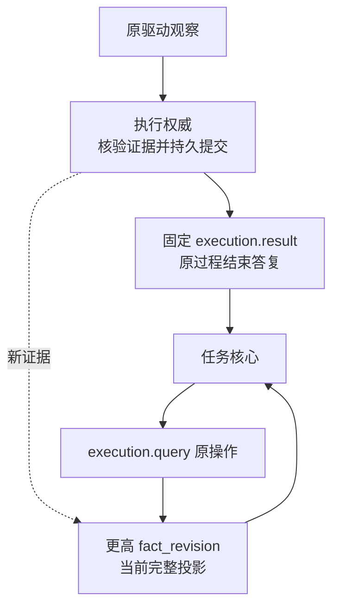

# 跨端目录、执行事实与原命令恢复

[总览](README.md) · [本地接口](catalog-and-contracts.md) · [执行与恢复](execution-and-recovery.md) · [验证](validation.md)

CE-P1／CE-P2 已采用：默认经网关 WSS 传输版本化领域消息；证据字节沿 HTTPS 内容通道，二者共同复用身份及完整来源合同。本页是跨端字段的语义定义，机器边界由 [execution Schema](../endpoint-cloud-protocol/schemas/execution.schema.json) 和 [execution-control Schema](../endpoint-cloud-protocol/schemas/execution-control.schema.json)维护。设计包含来源证明、事实修订、可信累计用量、管理及完整取消答复；运行实现与互操作证据仍待验证。

## 1. 精确声明与使用依据

`catalog.resolve` 指定目录、准确能力名／版本和目标端点，返回固定声明摘要、参数／结果／证据模式的内容引用、驱动绑定、实例修订、资源规范化器、权限需求、有界单元、恢复及费用保证和当前来源证明。调用方获取并校验模式字节后，才可使用该声明；名称匹配、缓存命中或在线状态都不能代替准确声明。模式引用固定内容摘要，不允许浮动远程 Schema 改变既有操作的含义。

`execution.invoke.basis` 携带同一声明摘要与实例修订、任务控制切点、完整 source_bindings、原预算分配及权威证明。证明绑定受信主体、原操作、目标、固定意图、来源与额度，由身份服务解析并在当前使用前复核；仅有 proof_id 或历史 allow 不足以启动。跨端读取精确声明不改变能力版本，不使用可选 metadata 隐藏必需合同。

| 交接 | 裁决与恢复 |
| --- | --- |
| 核心读取声明 | 目录只返回当前获准准确版本及缺口；字节缺失、旧声明或不可见时不选该行动 |
| 核心准入与发送 | 固定声明／意图／预算／完整来源，保存原操作及发送责任；不凭目录回执宣布执行接纳 |
| 执行接纳 | 核验当前声明、实例、来源、主体及预算依据；固定原意图与账本责任后 accepted |
| 执行启动 | 再核对授权、当前控制、实例和资源；已知暂停且尚未开始时受阻，恢复后须重新取证，原期限不刷新 |

已开始的有界动作可结束；准备标记或网络发送不证明已经开始。停用、撤权、取消与暂停分别保留原因，恢复一个条件不会清除其他门禁。跨端控制变化先由身份／任务领域保存并持续接续；任何切点不连续或无法核验的执行端保持相应行动受限，不能用流 ready 代替领域证明。

## 2. 权威事实投影与用量

每个执行操作固定 `producer_endpoint`。其 `fact_revision` 在该操作的正式投影变化时单调递增，fact 与 query 返回该切点的完整过程／执行／效果投影、来源、证据及已知用量。不要求消费每个中间修订才能读取完整新快照；生产者重启必须恢复原账本，不能重置修订或用新生产者解释旧操作。

下图按一个原操作展示事实与固定结果的关系；实线是消息或查询交接，虚线是当前投影的更新。

| 收到的事实 | 消费规则 |
| --- | --- |
| 同生产者、同修订、同内容 | 幂等接收，账务不重复结算 |
| 较低修订 | 不覆盖最新投影；保留获准原始事实，独立用量按其身份处理 |
| 较高完整修订 | 核对原意图、状态演进、证据格式及生产者后更新；不能仅凭数字消除已知证据冲突 |
| 同修订异内容、生产者变化、状态与证据相冲突 | 保存冲突并关闭依赖放行，查询原权威；无充分解释则保持缺口 |

`execution.result` 保存过程结束时的原固定载荷，后续发现效果通过新 fact 更新当前视图，不回写旧结果。结果恢复与当前查询分别处理。用量项独立绑定原调用、分配、计费维度／整数单位、目标或收尾用途、可信累计值及用量修订；`execution.usage` 与 query／fact 中相同项共享去重身份。跨生产者不能仅按 item_id 合并。线上的 usage_item 仅包装 allocation_id、target／cleanup 和 domain-common.usage，金额单位、货币刻度和保证模式沿[任务预算合同](../task-kernel/control-and-management.md#budget)，父聚合与子叶不得双计。

较新合法累计只结算增量，低修订不回退；同修订异值、累计减少或超出获准上限均作为违例保存，停止新消费并核对，不能静默挪用其他任务预算。`final` 仅在所有相关计费来源封闭且金额确定时成立；任务／过程结束不代表最终账单。无可信上界的未知消耗保留原预留。CE-P2 提供结算依据，外部硬费用限制仍须供应方或受控执行器落实。

## 3. 管理及取消的固定答复

管理入口只接受身份模块验证的本人或明确受托管理身份。`execution.manage` 对原操作执行有限核对、停止核对或接纳候选证据；固定原命令、预期管理修订及后续责任后返回 accepted。`query_management` 返回原命令处理记录，recorded 表示责任已保存，applied 表示本地门禁／工作或候选验证责任已应用，不证明外部效果。证据验证结果进入原操作 fact，可与原管理命令关联查询。

设备重新开放使用 `execution.reopen_device`，绑定目录、精确设备资源、接管修订、重新观察及受信管理证明。原子保存新的设备屏障与固定答复后 completed，`query_device_command` 恢复原答复；设备关闭与开放不能通过新建任务绕过。开放只授予未来符合条件的调用，不复活取消／过期操作。具体动作边界见[本地管理接口](validation.md#management)。

`execution.query_cancel` 使用原执行操作和取消操作的双重关联，读取完整固定 cancel_result 与获准保留期；它不返回当前效果来重建旧答复。任务取消另由 task.query_cancel 处理。取消尚未形成固定答复返回 precondition_failed；已清理或缺失恢复依据返回 recovery_gap；无权读取先拒绝，不泄露对象存在性。

| 消息族 | scope 解析 | 接纳与成功语义 |
| --- | --- | --- |
| catalog.resolve | catalog：catalog_id | completed 为准确声明读取完成 |
| execution.invoke／fact／result／query | operation：原执行操作 | invoke accepted 为责任已保存；fact/query 为当前切点，result 为固定过程结果 |
| execution.usage／query_cancel／manage／query_management | operation：target_operation_id | 用量、固定取消答复和管理命令分别核对，不互相替代 |
| execution.reopen_device／query_device_command | catalog：catalog_id | 设备资源由载荷及受信目录共同绑定；原命令不冒充执行操作 |

可靠响应沿请求 scope，发送与保留遵守交付合同。管理及查询各有有界配额；Query 唤醒原核对工作必须遵守 reconciliation_enabled，不产生无限外部调用。停止核对不屏蔽获准迟到事实，不清除未知费用或物理占用。
