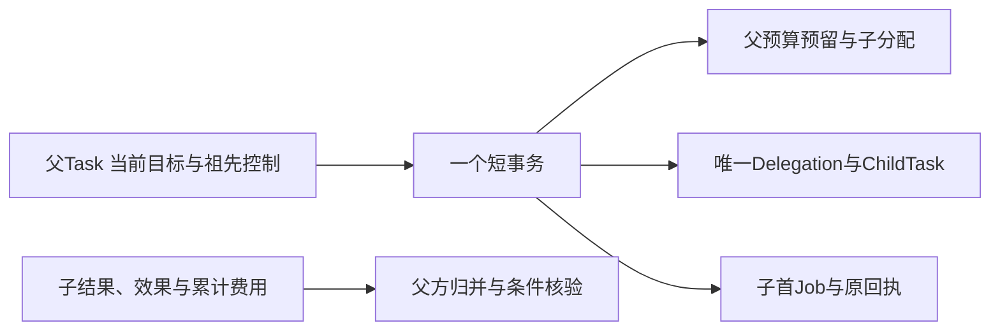
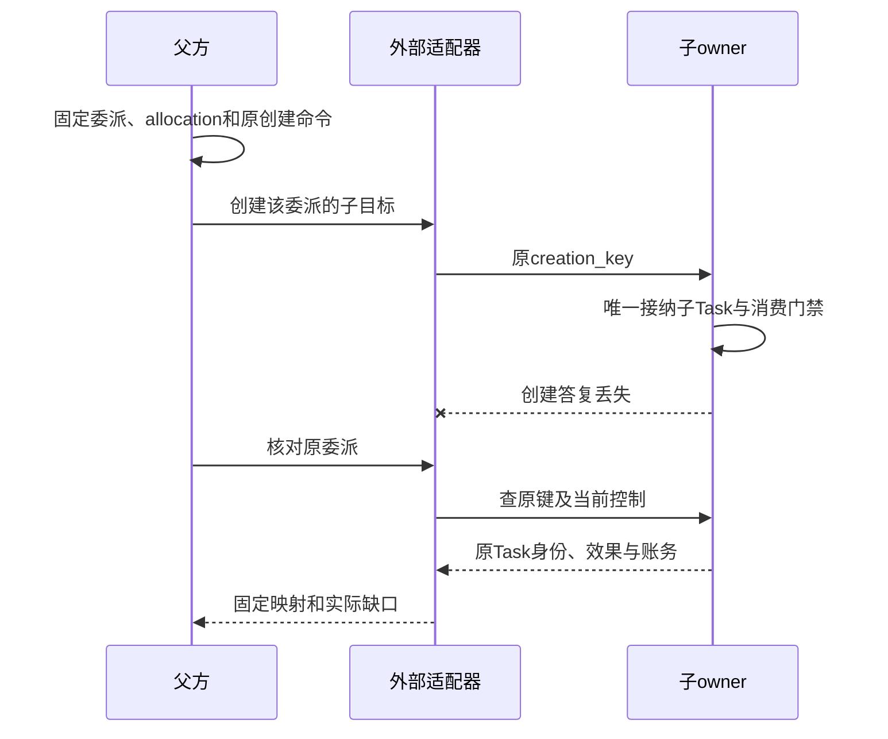

# Agent 委派与子任务收束

委派转交一个有界子目标，父Task继续承担整体目标。子Agent只能使用收缩后的权限、资料、预算和期限；它报告成功不等于父目标完成。生命周期由同一Orchestrator管理的是内部子任务，另一Orchestrator或独立运行时一律按外部委派处理。

字段、来源与存储关系统一见[本模块数据记录](../data/module-records.md#7-协作和可复用子会话)和[存储附录](../data/storage.md)。本章集中说明业务裁决与恢复。

## 1 Delegation 固定哪些关联

Delegation固定delegation_id、父Task及goal_revision、准确子目标/输入、Agent/adapter/端点配置、真实祖先链、deadline、allocation和权限引用。远端任务映射一旦建立，不得用新远端Task覆盖原身份。

父方保存交接和归并责任；子Task、远端执行效果和费用仍由原owner裁决。公共phase仅是这些事实的只读摘要：原Closure存在为closed；创建/控制/效果或结算有明确缺口为reconciling；已有唯一子映射为active；尚未发送为preparing。普通轮询和未最终费用不自行改成异常。

## 2 内部子任务共事务创建

锁序与任务编排一致。父取消先提交则创建失败；子创建先提交则后续父取消覆盖它。默认深度4、每父活跃子数8、同域活动子树总数64，并受每用户总活跃限制，不能因换进程或复用会话重新获得额度。

权限等于父当前许可、Agent上限和本次委派范围的交集。子任务不取得父完整凭据。父暂停限制子有效控制，父恢复不解除子自身暂停。父目标修订取消旧目标活动子树，已发效果和费用继续核对；仍有用的材料需按新目标重新绑定证据。

## 3 外部创建的未知必须可恢复

外部适配器必须支持原creation_key去重或原键可靠查询，固定权限范围、控制能力、费用来源、结果版本和关闭含义。否则只能接为明确受限的咨询型Operation，不声明可靠有副作用委派。

父方先持久保存Delegation、预留、原创建命令与Job。接收方读取原父allocation并验证receiver、范围、期限和认证sender，再在自己的事务接纳IncomingAllocation及至多一个子Task。答复丢失查询原creation_key；暂时not_found不是“永远不会创建”的证明。

适配器先保存原回复与准确关联，再通知父方。重复进展按owner/object/revision归并；同修订异摘要冲突。外部结果仍须满足父Task当前条件，不能直接转写为父Result。

## 4 控制与关闭分三层

| 层次 | 必须证明什么 |
| --- | --- |
| 目标工作封闭 | 子已终结，原创建或输入转交不再可能启动新目标，外部新行动被封闭 |
| 效果收束 | 本委派及受管后代的全部目标操作已封闭，无unknown或迟到效果 |
| DelegationClosure | 前两项成立，消费门禁已关闭、取得当前最终累计费用并完成原allocation结算，控制/输入交接全部收束 |

父Task成功要求前两层及自己的条件通过。第三层可以在父终态后继续，不让纯账务延迟阻塞已达成目标。Closure建立后，可信原账单更正仍沿原allocation追差额，不重开目标或返还一次许可。

父取消/目标修订：未发送创建在父方服务所属库中封闭；可能发送则继续查原键，立即按原allocation发送budget.close，关闭可先于迟到子创建；找到该委派原先创建的子 Task 后再发送对应取消，不能等取得task_ref才关闭消费。目标取消与消费关闭是不同命令，逐项报告已落实范围。外部不支持pause就明确拒绝暂停保证，不得把未确认写成已停。

输入转交绑定原请求/修订、原命令及委派目标版本。关闭时还要封闭未消费输入，否则一条迟到回答可能让旧目标重新行动。等待超时只结束本次等待，不暗中cancel。

## 5 有界集合和成本

每个委派维护后代、操作、输入/控制交接和计费源的完整关联。公开列表采用集合修订/计数/分页；内部Closure核验原owner完整集合，不能从一页空列表推导全清。关系更新与关闭门禁串行，新增子或hostcall先检查门禁。

父方按原计费源或allocation累计值记一次费用。父UI展示的子费用是汇总，不能作为第二项支出。失联接收方占用仍保留，不把同一预算分到另一个替身Agent。

每个子目标另有有限决策/尝试/期限，父总预算和全树限额进一步约束。递归深度与并发限制不能代替累计费用和总子创建数；任务策略另设生命周期累计委派上限，初值128，达到后保存明确缺口。

## 6 可复用子会话

复用ChildHandle只复用获准Session历史和准确Agent配置。新目标必须建立新的Delegation、Task与预算，旧一次许可不能复用。

ChildHandle 固定在原父owner，不支持跨owner迁移。换父Task只允许同一owner、当前active且权限范围仍包含该handle；跨owner需求建立新handle并明确引用获准历史，不把旧权威搬过去。

| 方法 | 准确输入与并发前提 | 成功点及输出 |
| --- | --- | --- |
| child.create；P→A/R | child_id、session_owner_id、session_config_ref、agent_binding_ref、install_lock_ref、access_scope_ref、prepare_deadline | 先保存preparing、原session.create命令与Job；原session.create明确applied后open，返回child_ref/child_session_ref。未知不新建第二Session |
| child.read/list | 原handle/统一分页 | 当前revision、state、原session及active_delegation_ref、历史映射分页 |
| child.send new_goal；CAS | child_id、expected_active_delegation_ref?、parent_task_ref/parent_goal_revision、goal_ref、input_refs、history_cutoff、permission_refs、budget、deadline | A保存新Delegation/Allocation及交接责任，返回child_ref/delegation_ref；不承诺远端Task已ready |
| child.send continue_existing；CAS | child_id、delegation_ref、parent_goal_revision；input为answer_request或steer | A固定amendment及原输入转交；回答带request_ref/answer_ref，steer带child_goal_revision/content_ref；不扩大原范围 |
| child.wait；查询 | child_id、delegation_ref、wait_for=goal_closed/effects_closed/closure、timeout_ms≤5000 | 固定原delegation_ref，返回observed_revision、condition_met及原事实/缺口；超时只结束等待 |
| child.close；CAS | child_id、cancel_active:boolean、reason | A封新send，返回child_ref与逐委派continuing/cancel_requested/closed/unknown集合；false不暗中取消已接纳工作 |

new_goal替换active_delegation之前，必须取得旧委派goal_work_closed=true且effects_closed=true；旧Task仅cancelled/failed不够，旧费用未结则可以继续。CAS同时比较handle revision和调用方见到的旧映射；两次并发new_goal只能接纳一次。新Delegate和活动映射本方同事务，远端Task仍独立交接。

create的Session若跨owner，沿同一原创建命令恢复；preparing不能send。接口超时不撤销原创建。close后已接纳的原创建/发送仍逐项查询及按cancel_active处理，迟到结果不能重新打开handle或覆盖较新映射。child.wait不得随active指针变化偷偷改等另一目标。

特有错误reason为 child_not_open、active_mapping_changed、previous_goal_open、previous_effect_unknown、parent_owner_mismatch、delegation_scope_exceeded、request_version_changed。没有旧活动映射时expected_active_delegation_ref必须省略；存在时必须精确匹配，不能用省略表示“任意当前目标”。

计算环境另归Executor。ChildHandle只引用environment_ref/generation；关闭会话不隐式销毁环境，也不恢复外部效果。

## 7 互操作验收

至少一个外部Agent实现通过同一正常与故障轨迹：创建答复丢失、重复创建、取消先到、子成功但费用未结、父目标修订、未确认输入迟到、allocation关闭后账单更正、旧child回调、新旧环境代次及远端不支持控制。

测试报告区分“取得结果”“子目标终结”“效果收束”“委派Closure”和“父Task成功”。A2A等外部协议可以映射消息和任务生命周期，但映射本身不证明具备本合同的幂等创建、有限预算或关闭证据；缺失能力明确降级或禁用。
