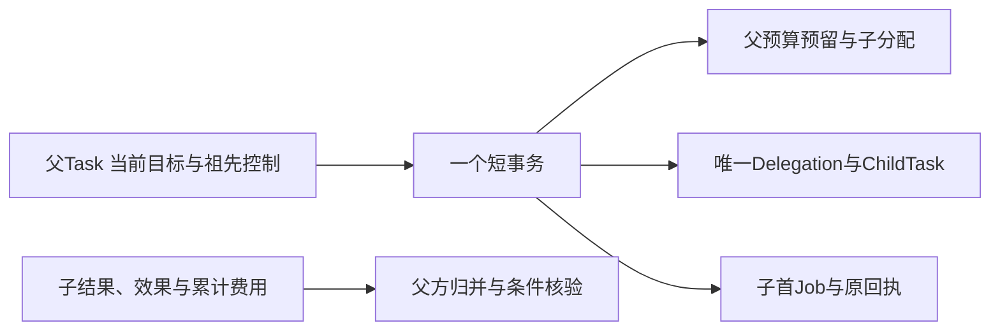
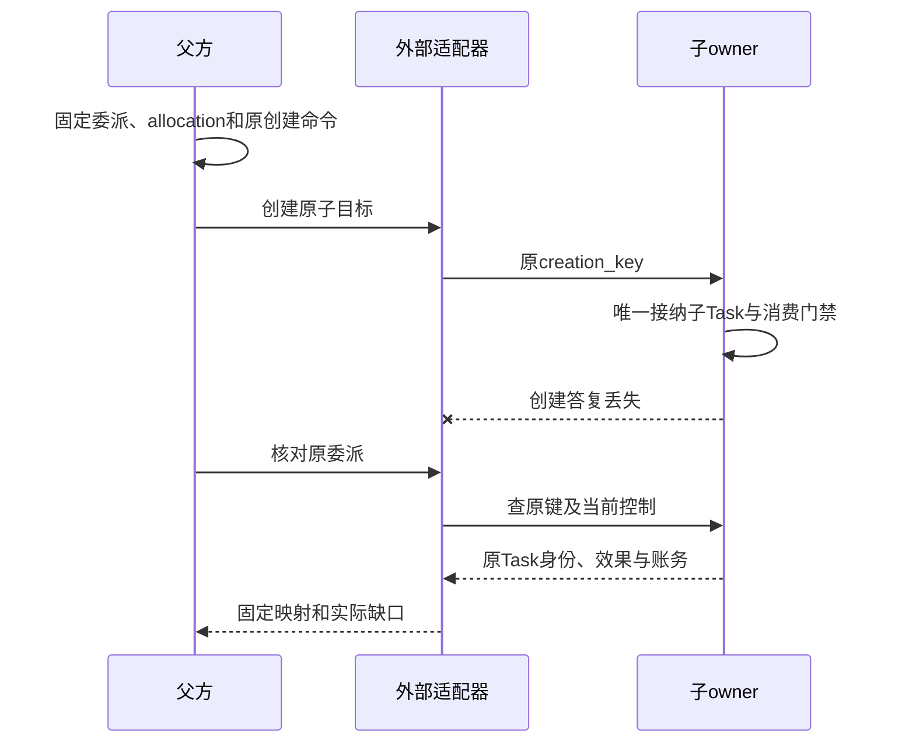

# Agent 委派与子任务收束

委派转交一个有界子目标，父Task继续承担整体目标。子Agent只能使用收缩后的权限、资料、预算和期限；它报告成功不等于父目标完成。生命周期由同一Orchestrator管理的是内部子任务，另一Orchestrator或独立运行时一律按外部委派处理。

## 1 Delegation 固定哪些关联

Delegation固定delegation_id、父Task及goal_revision、准确子目标/输入、Agent/adapter/端点配置、真实祖先链、deadline、allocation和权限引用。远端任务映射一旦建立，不得用新远端Task覆盖原身份。

父方保存交接和归并责任；子Task、远端执行效果和费用仍由原owner裁决。公共phase仅是这些事实的只读摘要：原Closure存在为closed；创建/控制/效果或结算有明确缺口为reconciling；已有唯一子映射为active；尚未发送为preparing。普通轮询和未最终费用不自行改成异常。

## 2 内部子任务共事务创建

锁序与任务编排一致。父取消先提交则创建失败；子创建先提交则后续父取消覆盖它。默认深度4、每父活跃子数8、同域活动子树总数64，并受每用户总活跃限制，不能因换进程或复用会话重新获得额度。

权限等于父当前许可、Agent上限和本次委派范围的交集。子任务不取得父完整凭据。父暂停限制子有效控制，父恢复不解除子自身暂停。父目标修订取消旧目标活动子树，已发效果和费用继续核对；仍有用的材料需按新目标重新绑定证据。

## 3 外部创建的未知必须可恢复

外部适配器必须支持原creation_key去重或原键可靠查询，固定权限范围、控制能力、费用来源、结果版本和关闭含义。否则只能接为明确受限的咨询型Operation，不声明可靠有副作用委派。

父方先持久保存Delegation、预留、原创建命令与Job。接收方读取原父allocation并验证receiver、范围、期限和认证sender，再在自己的事务接纳IncomingAllocation及至多一个子Task。答复丢失查询原creation_key；暂时not_found不是“永远不会创建”的证明。

适配器先保存原回复与准确关联，再通知父方。重复进展按owner/object/revision归并；同修订异摘要冲突。外部结果仍须满足父Task当前条件，不能直接转写为父Result。

## 4 控制与关闭分三层

| 层次 | 必须证明什么 |
| --- | --- |
| 目标工作封闭 | 子已终结，原创建或输入转交不再可能启动新目标，外部新行动被封闭 |
| 效果收束 | 本委派及受管后代的全部目标操作已封闭，无unknown或迟到效果 |
| DelegationClosure | 前两项成立，消费门禁已关闭、取得当前最终累计费用并完成原allocation结算，控制/输入交接全部收束 |

父Task成功要求前两层及自己的条件通过。第三层可以在父终态后继续，不让纯账务延迟阻塞已达成目标。Closure建立后，可信原账单更正仍沿原allocation追差额，不重开目标或返还一次许可。

父取消/目标修订：未发送创建在本地封闭；可能发送则继续查原键，立即按原allocation发送budget.close，关闭可先于迟到子创建；找到原子Task后再发送对应取消，不能等取得task_ref才关闭消费。目标取消与消费关闭是不同命令，逐项报告已落实范围。外部不支持pause就明确拒绝暂停保证，不能把未确认写成已停。

输入转交绑定原请求/修订、原命令及委派目标版本。关闭时还要封闭未消费输入，否则一条迟到回答可能让旧目标重新行动。等待超时只结束本次等待，不暗中cancel。

## 5 有界集合和成本

每个委派维护后代、操作、输入/控制交接和计费源的完整关联。公开列表采用集合修订/计数/分页；内部Closure核验原owner完整集合，不能从一页空列表推导全清。关系更新与关闭门禁串行，新增子或hostcall先检查门禁。

父方按原计费源或allocation累计值记一次费用。父UI展示的子费用是汇总，不能作为第二项支出。失联接收方占用仍保留，不把同一预算分到另一个替身Agent。

每个子目标另有有限决策/尝试/期限，父总预算和全树限额进一步约束。递归深度与并发限制不能代替累计费用和总子创建数；任务策略另设生命周期累计委派上限，初值128，达到后保存明确缺口。

## 6 可复用子会话

复用ChildHandle意味着保留获准Session历史和固定Agent配置，不意味着复用旧Task、预算或一次性许可。新增child.create/read/send/wait/close是Session与委派的组合端口，无独立调度权威。

ChildHandle保存child_id、child_session_ref、agent_binding、install_lock、access_scope、revision及active_delegation_ref。同一child默认一个活动目标，用CAS裁决。

send必须明确continue_existing或new_goal。同目标沿原InputRequest/steer继续，但补充必须仍在原委派有界目标、父goal_revision、预算和权限范围内。保存不可变amendment及其对应child goal_revision，不改写原委派意图；改变目标或扩大范围必须new_goal。终态之后的新工作建立新的Delegation、Task和allocation，固定新history_cutoff。新父须仍active且有当前权限。旧激活结果或取消只影响原映射，不能结束新目标。

close先封新send，保留原查询；是否取消活动工作用明确选项，并返回实际落实范围。可复用计算环境仅引用Executor的environment_ref/generation，停止和检查点按[执行合同](../execution/README.md)；会话复用不隐式重建环境或恢复外部效果。

## 7 互操作验收

至少一个外部Agent实现通过同一正常与故障轨迹：创建答复丢失、重复创建、取消先到、子成功但费用未结、父目标修订、未确认输入迟到、allocation关闭后账单更正、旧child回调、新旧环境代次及远端不支持控制。

测试报告区分“取得结果”“子目标终结”“效果收束”“委派Closure”和“父Task成功”。A2A等外部协议可以映射消息和任务生命周期，但映射本身不证明具备本合同的幂等创建、有限预算或关闭证据；缺失能力明确降级或禁用。
