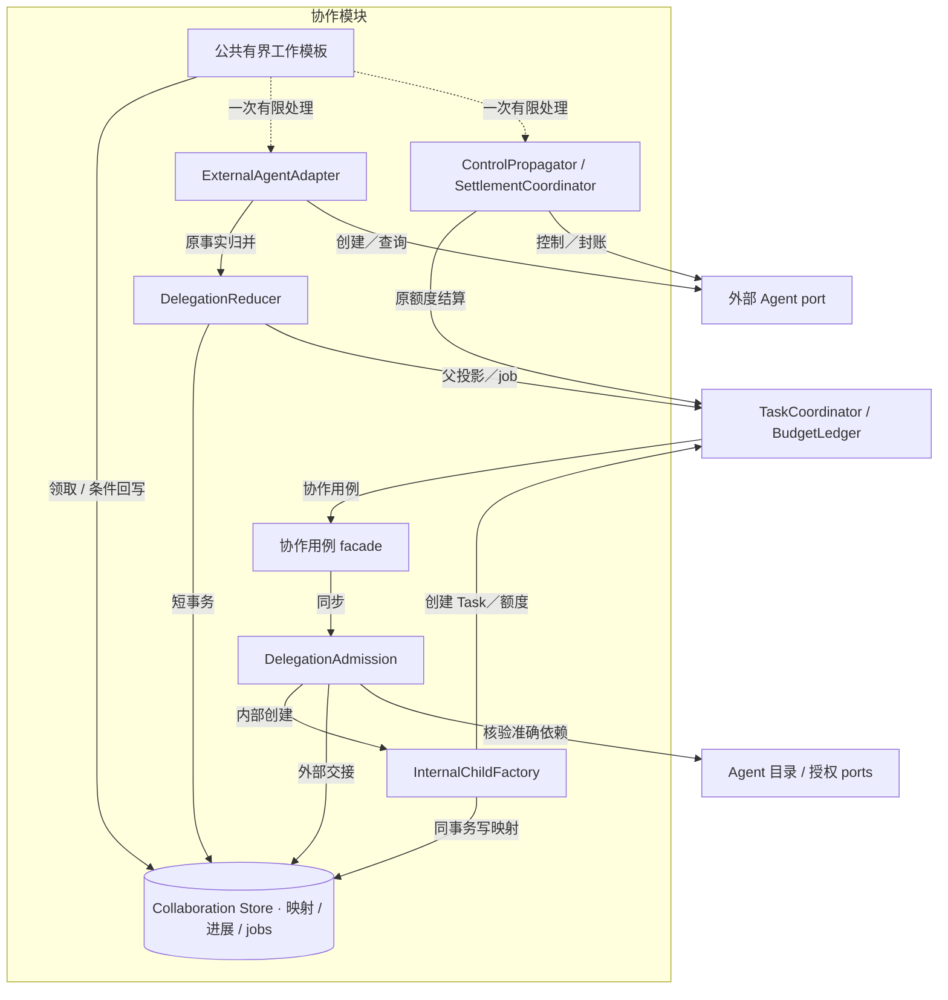
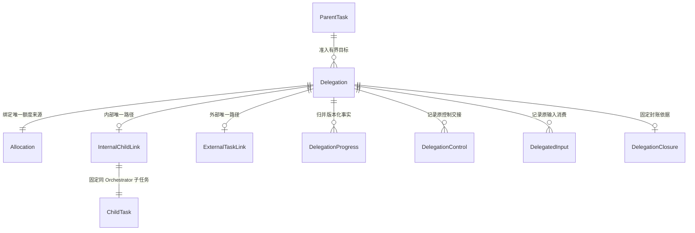
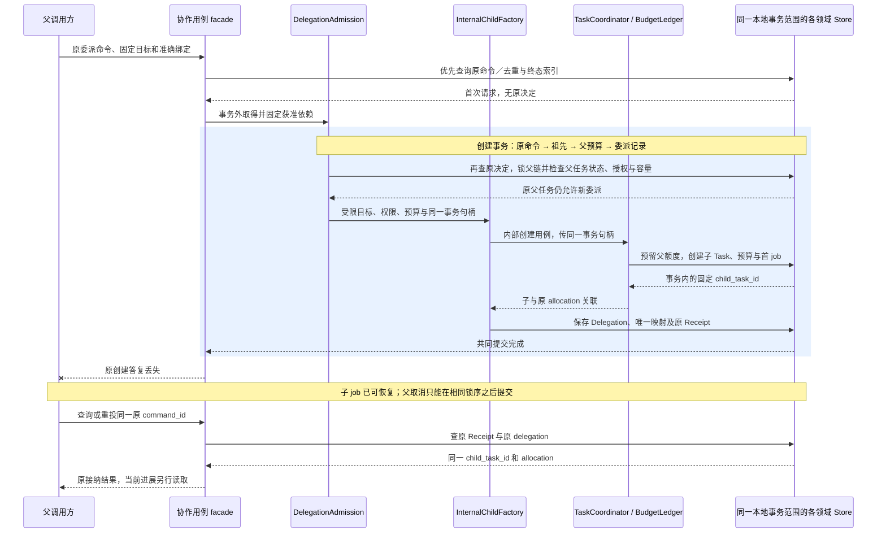
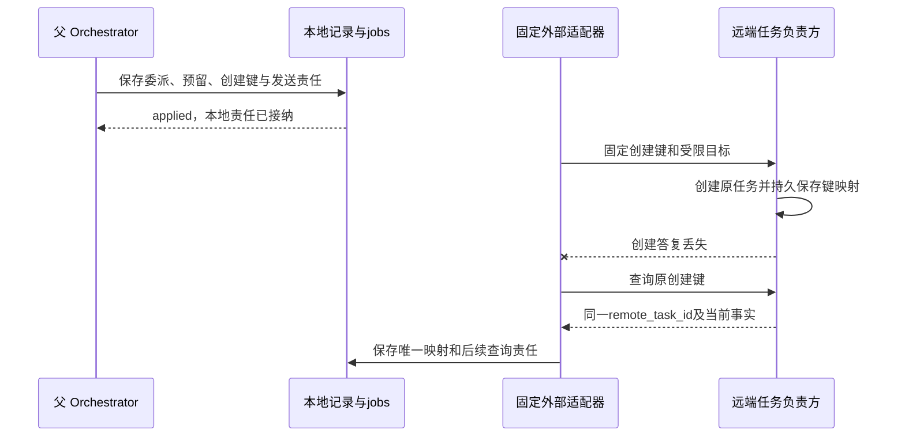

# 协作实现：唯一子映射、控制传播与封账

[模块主线](README.md) · [任务实现](../orchestrator/implementation.md) · [执行实现](../execution/implementation.md) · [共同契约](../contracts/README.md)

父报告任务交出一项资料比较工作后，需要始终找回同一个子任务，也需要知道取消是否落实、原额度是否仍可能被消费。本页把这条委派链落实为唯一映射、单调进展、逐端控制和关闭依据；父任务始终保留自己的完成裁决。

正常路径先按[对象流转](#data-flow)固定委派和额度，再执行[内部创建事务](#key-sequence)或第 4 节的外部创建，随后归并进展、处理控制，最后按[关闭条件](#delegation-closure)保存 Closure。子成功、目标行动封闭、效果核清和费用封账分别保存，查询阶段由这些事实[派生](#phase-projection)。

内部子任务与父任务在同一 Orchestrator；它们可以调用远端 Brain、Memory 或 Executor。另一 Orchestrator 即使采用相同软件，也通过外部委派路径交接。没有原创建查询、可信预算上限或所需控制能力时，适配器不开放依赖这些保证的委派。
委派的 allocation 是固定可消费上限。准入时收缩子策略，禁止只有估算费用而无可信单次上界的计费能力；子 TaskCoordinator 对每次实际绑定重复检查。顶层任务的获准估算计费不能借委派变成可封账的固定 allocation。

<a id="module-shape"></a>
## 1. 模块结构与内部职责

协作是宿主装配的逻辑模块：协作用例入口作为 facade，DelegationAdmission／InternalChildFactory／ExternalAgentAdapter 处理接纳与交接，DelegationReducer／ControlPropagator／SettlementCoordinator 保存聚合、控制和封账规则，Store 与适配器 port 隔离存储和外部协议。组件名描述参考实现职责，尚无对应运行代码。内部任务复用 TaskCoordinator 与 jobs，不建立第二套任务循环；子创建、预算和父控制因此可以共事务裁决。



图中协作模块位于父任务固定 Orchestrator。实线表示同步用例、读写或 port 调用，虚线表示宿主 JobRunner 装配公共有界工作模板后调用领域组件。创建 Task／额度、父投影／job 的更新与协作映射通过同一事务句柄提交；外部交接先用短事务保存本地责任。外部 Agent 的原创建、查询、控制及封账调用均在事务外，原生响应沿 ExternalAgentAdapter 结构化映射后返回，不能直接写父任务状态。

| 内部职责 | 决定及产出 | 边界 |
| --- | --- | --- |
| 协作用例 facade | 认证父 Orchestrator、原命令与所属协作用例 | 复用宿主原回执处理；不把 RPC 回复或连接推送作为父子关系权威 |
| DelegationAdmission | 父任务当前状态与授权、精确 Agent 绑定、收缩权限和有限预算 | 不接受模型自签权限或新实例地址 |
| InternalChildFactory | 同事务创建子 Task、allocation 与映射 | 不创建第二个 Orchestrator，不复制父余额 |
| ExternalAgentAdapter | 固定创建键、原生协议与语义映射 | 不把原生“请求完成”升级为效果已核清 |
| DelegationReducer | 唯一远端映射、单调进展、成果和未决责任 | 不按接收时间覆盖提供方修订 |
| ControlPropagator | 本地决定、逐端传播及实际确认 | 无暂停支持时明确报告仍可能运行 |
| SettlementCoordinator | 原 allocation 最终累计费用与封账 | 不因父取消或子成功释放预留 |

替代方案是让内部 Agent 也各自运行 Orchestrator。它增加创建、控制和预算的分布式缝隙；需要独立信任或运维边界时才使用，统一按外部路径实现，不另定义中间类型。

存储适配器只实现所属表的条件读写，外部适配器只实现固定版本 Agent port。两者由宿主注入；DelegationReducer 和封账规则不依赖提供方 SDK。内部子进展直接读取同 Orchestrator 的 Task 修订，再走相同聚合规则；不为读取同一库已有事实增加网络事件链。

<a id="reliable-work-integration"></a>
### 1.1 接入公共接纳与工作模板

协作用例 facade 装配[接纳模板](../reliable-work.md#admission)，JobRunner 装配[有界工作模板](../reliable-work.md#interfaces)。公共库处理原命令去重、提交结果分类及领取回写；DelegationAdmission、DelegationReducer 和 SettlementCoordinator 仍裁决父任务状态与授权、唯一子映射、单调事实与关闭。协作 Store 实现同一逻辑 JobStore，不增加协作调度服务或第二个任务循环。

同一本地事务范围内的 TaskCoordinator、BudgetLedger 与协作 repositories 参加 `transaction.Within`，仅接收所属用例允许的受限 Tx。内部委派沿原命令、根到叶祖先、父预算、委派及子创建作业记录的锁序检查；全部业务锁之后才取得相关作业记录锁，调用 `Raise(tx, ...)`，将子 Task、allocation、双向映射、子首次工作及原 `applied` 回执共同提交。任何参与仓储不能自行提交。外部委派的 `applied` 只提交父侧委派、固定 `creation_key`、预留及发送责任；跨 Orchestrator 接收方在自己的事务接纳，公共模板不跨两个 owner 提交。

下表为协作提供的作业去重键后缀；完整键还包含 tenant、固定 Orchestrator／owner 及 kind。原命令和远端调用标识保存在领域记录中，不以 `job_id`、领取代次或工作版本替换。

| 责任及领域处理器 | 稳定作业去重键与业务标识 | 本轮结束、等待及继续者 |
| --- | --- | --- |
| 外部创建／查询：ExternalAgentAdapter | 原 delegation；关联原 endpoint、creation_key 及一旦确定即不变的 remote_task_id | 唯一映射和后续观察责任共同保存后可结束创建作业；结果未知保留原键查询，由适配器继续，暂时 not_found 不准许重建 |
| 进展归并：DelegationReducer | 原 delegation 的观察作业；关联原来源修订 | 保存单调进展及父后续责任后结束本轮；未终结或事实冲突按领域依据等待下一次观察，不重算接纳回执 |
| 控制／输入：ControlPropagator | 原 delegation、目标端及原控制命令；输入另以原远端请求 ID／修订定位 | 持久交回真实应用／消费事实后完成对应责任；仅已发送或本地 `applied` 时仍由原转交责任查询 |
| 封账／更正：SettlementCoordinator | 原 allocation 的结算作业；接收侧交付按 allocation／usage_revision 关联唯一对账 outbox | 当前累计差额和下一交付责任共同提交后结束本轮；未知费用保留预留；已 closed 委派收到可信上调仍 `Raise` 原账务责任，不重开子目标 |

一次领取取得 `job_id / lease_epoch / observed_work_revision`。处理器可执行多个短事务及事务外调用：先查原事实，必要时持久登记发送意图，再调用原端口，最后归并结果。每笔受领取保护的业务写入均在取得业务锁后，按稳定作业去重键顺序最后锁相关作业记录并调用 `Guard`；业务结果、下一责任与 `Finish` 在同一事务提交。领取失效则不能写这次处理结果，新的作业版本也不能被旧完成或旧退避清除，具体判定由[共同完成规则](../reliable-work.md#completion)实现。可信远端迟到进展和账单仍可经独立事实归并入口接收；该入口核验来源、原映射及修订，不借旧领取授权写入。

本地提交未知先查询原命令、委派或结算 intent；外部创建未知先沿原 `creation_key` 核对。公共模板不会因为超时自动再次创建。安全重投、总次数、绝对期限及耗尽后的等待条件继续由本页第 9 节决定；控制、原创建查询和结算按[容量接口](../reliable-work.md#capacity)保留份额。恢复审计同时检查未关闭委派和已关闭委派的未结账务，按原键补齐作业记录，不依赖展示 phase。

## 2. 存储与唯一约束

所有表带 tenant；跨端映射额外绑定认证发送方和固定 endpoint／instance。任务表、许可和预算由各自模块保存，协作表只引用这些权威记录。

| 表 | 核心字段 | 原子性与索引 |
| --- | --- | --- |
| agent_descriptors | agent_ref、kind、目标／结果 Schema、控制能力、权限和费用上限 | 固定版本及摘要；不采纳运行时模型改写 |
| agent_bindings | descriptor、adapter_ref、endpoint_id、配置摘要 | 原委派固定组合；更新创建新版本 |
| delegations | delegation_id、父任务、原请求、revision、allocation_id | 原 delegation 唯一；目标和配置不可改；phase 不独立保存 |
| internal_child_links | delegation_id、child_task_id、父任务 | 两方向唯一；同事务创建子与映射 |
| external_task_links | delegation_id、endpoint_id、creation_key、remote_task_id | 原创建键唯一；映射一旦建立不可替换 |
| incoming_delegations | 认证发送 Orchestrator、parent_delegation_id、原创建命令、child_task_id | 接收端原委派唯一；原命令重投返回同子任务 |
| delegation_progress | 原任务、remote_revision、摘要、结果、未知效果、费用修订 | 同来源修订唯一；同修订异内容冲突 |
| delegation_controls | 本地控制修订、固定子命令、逐端状态和在途责任 | 决定与传播 job 共同提交 |
| delegated_inputs | 原远端请求 ID／修订、答复引用、原转交命令和消费回执 | 同业务输入只转交一个固定版本 |
| delegation_jobs | 作业去重键、原对象关联及[公共工作字段](../reliable-work.md#work-record) | 按上述稳定键唯一；适配统一 JobStore 的 `Raise / Claim / Guard / Finish`，业务变化与责任共同提交 |
| receiver_correction_outbox（Orchestrator 账本） | 原 allocation、usage_revision、完整累计 Closure 摘要、有限 task.billing_reconcile 命令尝试及回执、交付状态 | 协作只引用原 receiver 的同一账本行，不复制费用权威；已 closed 委派仍按它恢复交付 |
| delegation_closures | 映射、目标封闭依据、效果核清及封账引用 | closed 后长期保留必要标识与终结依据 |

父子任务的 Task.status 各自有权威，协作保存已归并事实、原来源修订及必要责任；phase 在查询时计算，不另存阶段转移记录。Closure 仍是必须持久保存的关闭决定，不能用即时计算替代它。

<a id="phase-projection"></a>
### 委派阶段的只读投影

查询以 Delegation.revision 对应的已归并本地记录为输入，按下表从上到下命中第一项。外部事实以原适配器已接受的来源修订为准；同库子 Task 的变化也经既有归并事务登记来源修订后进入投影。公开 Delegation 字段不是完整事实输入，不能只凭 result_ref 或 settlement_ref 重建关闭判断。

| 顺序 | 判定及权威来源 | phase |
| --- | --- | --- |
| 1 | 已保存满足[关闭条件](#delegation-closure)的 DelegationClosure，包括正文清理后保留的最小委派终结记录 | closed |
| 2 | 下表任一具体恢复或收尾缺口成立 | reconciling |
| 3 | 前两项不成立，且 internal_child_links 或 external_task_links 已固定唯一子任务 | active |
| 4 | 前三项均不成立，原创建仍在发送前准备 | preparing |

| 事实来源 | 构成第二项的条件 |
| --- | --- |
| 原创建记录及唯一映射 | 原创建已发送或可能发送，但接纳结果未核实；暂时 not_found 不消除该缺口 |
| delegation_progress | 原任务读取失败、同修订事实冲突或 effects_pending 仍未核清 |
| delegation_controls、delegated_inputs | control_pending，或已转交输入的远端消费未确认 |
| 父子终态、原取消决定、目标封闭及 allocation 封账依据 | 父或子已终结、已保存取消该委派的决定、已证明目标工作封闭、原创建已证实不会接纳、预算接收方的消费状态已关闭新增消费，其中任一事实已成立，但 Closure 尚未提交；此时尚须核清其余关闭条件或完成 Closure 提交 |

这些条件直接读取既有事实，不新增统一“核对中”开关。普通运行中的非最终用量、例行查询 job、已确认暂停或尚未回答的输入请求不满足第二项。已进入上述收尾范围但仍未完成 Closure 提交的委派不能落回 active；未固定映射且已发出的创建也不能落回 preparing。

影响投影的来源事实变化与 Delegation.revision 递增、后续 jobs 在同一归并事务提交；查询只读取，不发起远端核对，也不因读取而增加修订。当前墙钟、job 领取或退避不直接参与投影；期限到达须先由原责任提交到期、取消或相应缺口事实，再按新修订展示。同一修订得到同一投影；原命令回执仍保留接纳时的固定快照，重放不按最新事实重算回执。当前记录或必要依据不可读时，返回查询不可用或明确缺口，不能把存储缺失解释为首次准备。

<a id="data-flow"></a>
### 2.1 委派对象关系与流转

Delegation 是父侧交接聚合；InternalChildLink 与 ExternalTaskLink 分别把它绑定到唯一子任务标识，二者互斥。外部创建未知时可以暂时没有 remote_task_id，但固定 creation_key 和 Allocation 已存在。图中的 Task／Allocation 由 Orchestrator 保存，协作只通过接口引用和变更它们。



| 阶段 | 对象创建、保存与交接 | 消费、归并及清理条件 |
| --- | --- | --- |
| 父准入 | DelegationAdmission 核验父任务当前状态与授权及准确绑定，固定委派目标、权限和 Allocation | 内部路径由 InternalChildFactory 同事务建 ChildTask／映射／首 Job；外部路径持久化 creation_key 和发送 Job |
| 创建消费 | ExternalAgentAdapter 只发送原创建；接收方持久化原键→子任务映射后发布原回执 | 丢答复查原键；父保存唯一 ExternalTaskLink，不能用另一个子任务标识填补暂时未知 |
| 进展和输入 | 子 Task 修订或原生响应转为 DelegationProgress；澄清保存 DelegatedInput 与原请求关联 | DelegationReducer 应用合法新修订；输入一次消费，重复进展不重复记费和唤醒父任务 |
| 控制与关闭 | 父控制建立 DelegationControl 及持久传播责任；SettlementCoordinator 收取原接收方封账证明 | 控制 applied、目标封闭、效果核清和预算 closed 分别确认，不能从其中一项推断其他项 |
| 归并及清理 | 父取得当前获准成果并自行判断要求；协作保存 DelegationClosure | 原映射与未决费用仍有恢复引用时不清理；完整内容到期可删，最小禁止复用关联长期保留 |

跨 Orchestrator 的 incoming_delegations／incoming_allocations 属于接收方同一创建事务，绑定父 delegation、原 allocation 和接收子 Task。父侧 ExternalTaskLink 与接收映射通过原命令核对，不是分布式外键；任何一侧不可达都不能由另一侧猜测建表补齐。

<a id="21-并发序"></a>
### 2.2 并发序

内部委派按根到叶锁祖先链，再锁父任务预算、delegation 与子创建作业记录。父取消使用相同顺序：取消先提交则新委派拒绝，创建先提交则取消事务必能发现子映射并建立传播责任。

外部网络调用不占本地事务。保存远端映射时锁原 delegation，比较固定创建键、绑定及当前 revision；若映射已经存在，仅接受完全相同的远端任务。另一任务 ID 即使报告成功也不能覆盖原映射。

## 3. 内部委派的原子创建

用户要求“比较两个版本的 API 并写入报告”，父任务可以委派比较部分，自己准备报告结构。子只取得两份输入的读取／处理用途和固定预算；最终写报告仍由父另行准入。

```text
create_internal_child(request):
  begin with original command and ancestor locks
  if original receipt exists: compare fixed intent and return original decision
  if closed identity exists: return gone or idempotency_conflict
  require parent active, effective running and within deadline
  require exact installed internal Agent descriptor and bounded ancestry
  require requested permissions and budget are valid subsets
  require delegated policy excludes billable capabilities without credible cost bounds
  require no other command has already occupied this delegation identity
  reserve the fixed allocation from parent budget
  create child Task at the same Orchestrator, limited configuration and first job
  create Delegation with exactly one child_task_id and its original facts
  save original applied Receipt
  commit
```

预算分配是同一个存储事务中的内部调用，不通过本地 RPC 产生第二个提交点。若子创建失败，父预留和 delegation 均不提交。答复丢失只查询原 command 或 delegation，不重新分配。
原命令查询先于当前父任务当前状态与授权检查：若创建已提交而父后来取消，重投仍返回创建时的原回执，当前子任务状态另用 `collaboration.read` 查询；只有首次接纳才检查父此刻能否创建。固定拒绝也按原回执返回，不因父状态后来变化而重算。

默认深度、活跃子数和用户任务数均有有限配置。祖先列表由 Orchestrator 从真实父链产生并核验，不能相信模型提供的列表。拒绝父子环、重复祖先、错误 Orchestrator 和越界深度；活跃子任务也占用户任务额度。

子工作执行完全复用任务编排器。父通过子任务修订唤醒事实归并，不要求同库子任务再经网络发送一份“完成消息”。远端 Brain 停机时，已经提交的本地子事实仍可供父读取。

<a id="key-sequence"></a>
### 3.1 同一事务句柄如何连接子创建与预算

下图展开内部委派的代码调用。Store 节点代表宿主同一事务句柄下的各领域仓储，不给协作组件任意写 Task 表的权力。目录、内容及授权依赖在事务前固定，事务内验证其仍可使用；没有外部网络调用参加提交。



如果父取消先取得锁并提交，创建事务看到终态后拒绝，不留下子 Task 或父预留。如果创建先提交，取消事务一定能读到新子映射并建立其控制责任。创建已提交后父再取消，也不改变原接纳回执；原命令查询仍指向同一子任务。事务中任何仓储写入失败都整体回滚，不能只重试子创建而再次扣父预算。

## 4. 外部创建与答复丢失

外部委派先在父 Orchestrator 保存固定目标、准确输入、Agent 绑定、额度预留、creation_key 和发送 job，查询投影为 preparing。applied 表示本地责任已建立；此时不伪造 remote_task_id。发送前持久登记原创建的发送责任；进程在发送边界失联时，沿该原记录保留可能已发送的事实。

外部适配器按安装时声明的原生契约创建子任务。创建请求必须包含稳定父委派键，原输入、预算和接收方不可变；远端必须支持原键查询或能够证明同键创建幂等。缺少两者的提供方只可作为明确有界的咨询能力接入。



创建结果未知时，原事实使查询投影为 reconciling，预留继续占用。取得唯一原任务映射并核清其他缺口后，查询投影为 active；查询证明未接纳且未来不会接纳，才可关闭创建责任并按原额度封账。暂时 not_found 不提供这种证明；投影变化本身不建立或取消任何工作责任。

### 4.1 另一 Harness Orchestrator 的接收

另一 Orchestrator 使用 task.submit.delegation_context，固定 sender_orchestrator_id、parent_delegation_id、allocation_ref、allocation_command_id、permission_refs 和 ancestor_ids。sender_orchestrator_id 必须与认证上下文的 sender_service_id 相同；接收方验证原父权威及接收方范围后，在自己的事务中建立 incoming_delegations、incoming_allocations、唯一子 Task 和首 job。

原 allocation 先由负责方原命令回执核对，再通过 budget.read(role=owner) 核对当前分配修订仍可消费。Task 的 budget 必须等于准确分配上限，期限不能更晚；查询已 gone、负责方不可达、当前已封账、预留未证明或接收方不符时，不创建可消费子任务。父保留预留并进入 dependency／budget 等待。

父取消时，还必须向原接收 Orchestrator 发送 budget.close，以原 allocation 和父委派标识禁止接纳新子任务及新增消费。它与子创建争用同一事务记录：关闭先胜则迟到创建永久拒绝，创建先胜则收束既有子的消费。budget.close 接纳不代表最终费用已知；父经 budget.read(role=receiver) 取得 closed 证明后，才可对原 allocation 结算。未知分配先保存最小禁止索引并核对原父记录，不能因为没有 child_task_id 就断言原创建永远不会迟到。

两个 Orchestrator 之间不共享 Task 行写权。接收方的子任务拥有自己的 Orchestrator 和控制修订；父只有协议允许的有限控制与披露权限。相同用户名、目标内容或 parent_task_id 都不是认证依据。

## 5. 单调进展与结果读取

外部适配器把原生事实映射为固定的 remote_revision、明确成果版本、用量修订和 effects_pending。原生接口不提供单调修订时，适配器保存目标回执摘要及受信观察序号，但不能凭本地序号制造原生事实没有的终态保证。

| 已保存事实与新输入 | 处理规则 |
| --- | --- |
| 同 remote_revision、同摘要 | 不重复归并子进展或记费；没有新恢复事实时幂等返回，不重复唤醒父任务 |
| 同 remote_revision、不同摘要 | 标明协议冲突，暂停依赖该结果的目标推进 |
| 较旧修订 | 不覆盖当前状态，保留诊断关联 |
| 新修订映射到另一 remote_task_id | 拒绝覆盖，查询固定原任务 |
| 新结果只给自然语言“完成” | 作为候选内容保存，完成保证仍按证据分级 |
| 远端终态仍有未知效果 | 结果可展示，effects_pending 保持 true |

原任务曾查询失败时，一次成功核对即使返回相同 remote_revision，也能核清原查询缺口。该核对结果沿原责任保存，并与 Delegation.revision 递增及必要唤醒共同提交；它不再应用一次子进展或累计费用。这样恢复后的 phase 可以变化，而同一修订的查询结果保持不变。

结果内容读取遵守当前披露权限，不能因为远端曾允许父查看就永久缓存全部正文。只有结果引用已获准、来源可查且符合固定结果 Schema，才进入父任务的快照。

父可用子结果重新推理，但子输出不能发出系统控制、修改父预算或批准扩大权限。任务完成判断把子产物当输入，并核对父自身要求的全部必要条件。

## 6. 暂停、取消及恢复的传播

父暂停后的内部有效控制由同 Orchestrator 祖先链计算。子自身 paused 保留；父恢复只移除父造成的限制，不覆盖子意图。子已在远端排队的操作也必须收到更新后的子 TaskGate。

外部控制由适配器按固定原命令发送，再查询对应原任务／控制结果。control_pending 表示尚有必要入口未确认，不能用 phase=active 或远端“已收到”推断控制已执行。

| 竞争场景 | 本地提交与后续责任 |
| --- | --- |
| 父取消先于内部创建 | 新子创建拒绝，无 allocation 转移 |
| 内部创建先于父取消 | 子映射已在同库；父终态与子取消工作共同保存 |
| 父取消时外部创建仍未知 | 停新目标工作，保留原创建查询；找到原子后再取消 |
| 外部暂停不受支持 | 保存限制与实际边界，界面明确外部仍可能运行 |
| 远端已开始不可撤回动作 | 关闭后续发送，保留在途效果核对 |
| 父已取消后子成功 | 只收取原结果元数据、费用及效果，不新建综合工作 |

用户要求立即中断的设备任务不能交给只有最终结果、没有相应控制保证的 Agent。对具备有限停止窗口的提供方，窗口进入固定适配声明与用户可見限制；失联不延长原期限或额度。

### 6.1 控制命令的合并

同一远端可以只保留最高尚需应用控制的活动作业记录，但每条用户命令仍保存原本地回执。新的控制先持久化，再使旧未发送控制工作失效；已经可能发送的旧命令按原 command_id 保留查询责任。

父终态后不生成 resume。外部不支持控制修订单调时，适配器不得把乱序的 pause／resume 直接并发发出；它按该原任务串行交接并取得原结果，或者声明无法提供所需保证并拒绝该装配。

## 7. 用户输入与权限补充

外部 Agent 请求澄清时，适配器保存原请求 ID、请求修订、目标任务及允许输入类型；父界面只展示当前获准内容。`collaboration.submit_input` 固定 answer_ref 和原远端请求，不能在重试中替换答案。

输入转交遵守与交互模块相同的区别：本地接纳、正在发送、远端消费分别确认。答复丢失先查询原转交命令或请求消费记录。另一个回答竞争同一请求时，远端一次消费决定胜者，本地展示冲突并刷新。

权限请求通过受信入口处理。普通回答、子 Agent 输出或“用户已经同意”的外部文本不能签发 Grant。新许可必须仍满足父允许范围；若用户确实希望扩大父目标权限，先走父任务明确变更，不让子擅自修改祖先约束。

取消后到达的新输入请求不唤醒目标行动。允许收取原消费回执、停止事实和最小账务材料，所需收尾用途仍由当前管理依据授权。

<a id="delegation-closure"></a>
## 8. 分配、费用和终结依据

父侧 allocation 是该委派唯一费用来源。内部子支出从父 reserved 划拨；父报表聚合显示子费用但不再扣一次。跨 Orchestrator 分配固定 receiver 和期限；答复丢失不再创建另一份相同额度。

每份进展携带累计用量及 usage_revision。适配器保存每个计价单位的最近值，较旧修订不回退账务，同修订异金额产生冲突。任务结果只有“费用估计”时，不能把它当最终账单释放预留。
若可信最终账单显示累计费用超过固定 allocation，适配器不得把 final_usage 截断。原因可以是提供方突破可信单次上界，也可以是接收方违规放行多笔各自合规调用。它先关闭接收方新消费，连同原计费标识、分配与单次上界及可信账单出具完整 Closure；父方按[超额结算](../orchestrator/implementation.md#8-预算分配与最终结算)一次记真实超额、分别判提供方单次上界违约与接收方总分配违规（可同时成立），证据不足的原因标待查，并禁用受影响绑定的新计费委派。证据不足则原 allocation 保持未结，不把远端自报值当可信账单。
原 allocation 已 settled 后发生可信上调账单时，接收方 closed 状态不变，在同一事务保存更高用量修订的完整累计 Closure 和按原 allocation／usage_revision 唯一的对账 outbox。outbox 向父方原 task_id 调用 `task.billing_reconcile`（source_kind=budget_allocation、source_id=原 allocation_id）唤醒结算责任；答复丢失查询或重投原命令，受信期限过后仍无 JobAck 时保留旧尝试及回执、另存同修订／同摘要的继任命令，父方 durable job 回执后才完成交付。父方通过 `budget.read(role=receiver)` 取得当前 closed 证明，在本地先持久保存该接收方修订对应的预算结算 intent、准确 Closure 摘要和有限命令尝试／当前 allocation expected_revision；随后调用 budget.settle。答复丢失先查原回执；原命令过期仍无 applied 时读取当前 allocation，已按该累计账单结算则结束 intent，否则才保存同修订／同摘要的继任命令，旧未知尝试不删；旧命令迟到先 applied 而继任因 expected_revision 冲突时，父读当前 allocation 与 intent 摘要匹配后认定已结。仅按上调累计差额调整 spent，已释放余量不倒流；父预算超限则记录追账债务并停新计费。已保存的 DelegationClosure 仍证明原目标及当时已知费用已封闭，后续上调作为该 allocation 的独立账务责任与当前查询缺口展示，不启动新目标行动，也不因历史 phase=closed 丢弃原计费标识。退款、贷记另行对账。

提交 DelegationClosure 必须同时具备：

1. 已经证明没有新的子目标行动可以开始，或原创建从未被接纳且不可能迟到接纳。
2. 所有内部子任务终结；外部原任务的对应封闭保证已确认。
3. 本委派及其受管后代没有未知或可能迟到的效果。
4. 原接收方已经封闭新增消费，全部单位取得当时可信的最终账单且 budget.settle 完成；以后可信更正另沿原 allocation 追账。
5. 原输入和控制不存在还可能产生目标行动的未确认转交。

```text
close_delegation(delegation):
  lock original delegation and allocation
  require immutable original child mapping or proof of never-accepted creation
  require target work is closed and all delegated effects are resolved
  require final receiver spending closure and accepted original settlement
  save immutable DelegationClosure and its evidence references; increment revision
  schedule only retained cleanup, disclosure and audit responsibilities
  commit
```

Closure 提交后查询投影为 closed，历史核对记录不覆盖终结依据。完整内容不必无限保留，但长期最小委派终结索引必须阻止同 delegation 和 creation_key 被重新创建；详细查询依据已经清理时返回 gone，而不是重建 preparing。目标已终结但费用尚未封账时，原账务责任使投影保持 reconciling，不通过删除原映射把责任“清零”。

## 9. 恢复、限额与生命周期

<a id="async-child"></a>
### 9.1 SDK 读取与有界等待

SDK 在原委派方法之上提供接纳句柄、读取、等待和有限批量读取的便利接口。这些是客户端组合行为，不增加公共 RPC、服务端完成状态或调度器；服务端责任继续由 Delegation、唯一子映射和原 jobs 承担。

| 客户端动作 | 保证与边界 |
| --- | --- |
| 取得接纳句柄 | 固定负责端、delegation_id 及已有子映射；创建答复未知先查原命令，不返回另一份新委派当作恢复 |
| 读取一次 | 按当前权限取得同一已归并修订的 phase、结果范围和未决责任；内容另按准确引用及当前用途读取 |
| 等待指定条件 | 零等待只读快照；正等待受截止、查询次数及取消信号限制。等待“有结果”“子目标终结”或“委派封闭”分别检查对应事实，不能互换 |
| 批量读取 | 固定有限句柄集合，逐项返回可读结果或缺口；一个子任务失联不阻塞其他结果，也不把缺失项计为成功 |
| 本地停止等待 | 释放客户端等待资源；需要取消子目标时另提交明确的业务控制命令。本地 deadline 到达不产生子任务终态 |

可丢变化提示用于提前触发读取，连续性不足或断线时重读原快照；重复提示不重复消费父方的结果或费用。父任务在同一业务事务保存已消费的原报告修订及后续责任，SDK 不保存另一份能够裁决“已完成”的账本。结果已到而账单未闭合时，可以展示获准结果及缺口，额度继续按原 allocation 保留。

<a id="cold-child-recovery"></a>
### 9.2 原子任务与安装组合的冷恢复

内部恢复先读取原 delegation／child_task 映射、TaskPolicy、InstallLock 及各原行动绑定，再按[宿主就绪](../deployment.md#recovery-readiness)装配恢复处理器。引用已保存在原 Task、Binding 和清单中时只沿这些引用读取，不复制一套可独立修改的子配置。当前 capabilities 说明“现在可启动什么”，不能覆盖原子任务当时固定的输入或版本。

装载组合或当前批准不再可用时，拒绝依赖该组合的新决策和效果；获准且有兼容读取器的原记录仍可查询。原效果核对也须满足其当前用途及执行资格；没有安全查询实现时记录具体恢复缺口，不能用新 Agent、最新工具或新子 Task 重做。父任务重启并不使子任务自动重新激活，原控制、剩余额度与未结责任继续生效。

验收在子效果已发生、父未消费报告时终止父工作者，再恢复并重复报告；同时注入父取消、原安装组合失效和迟到上调账单。独立断言为：唯一子映射不变、报告只消费一次、必要效果不丢失、父终态不复活、累计费用只追差额。再测无结果与有结果的零等待、批量部分失败、deadline 到达及不支持字段，确认 SDK 返回等待或能力缺口而非推断成功。协作质量比较继续计入等待、汇总、失败及清理成本。

<a id="reusable-child"></a>
### 9.3 可复用子会话与一次激活

可复用 child 是可选的应用／协作组合能力。Interaction 保存子 Session 的消息与获准历史；协作保存稳定子描述、父方关联、准确启动配置以及每次激活到原输入、Delegation 和子 Task 的映射。这里的“子激活”只解释一次交给子会话的工作范围，与扩展组件的 activation 无关；不新增一套可写 Run 状态机或复制子消息账本。

| 情形 | 使用的身份与行为 |
| --- | --- |
| 创建答复丢失或进程重启 | 按原 Delegation 查询唯一 child_task／remote_binding；恢复已有工作，不创建新激活掩盖未知接纳 |
| 子 Task 尚未终结，补充同一目标 | 回答原 InputRequest 或通过原 Task 修订／控制；保存原输入消费与所用历史截止，继续同一目标和账务责任 |
| 一次等待结束或一次回复到达 | 只结束该等待或形成回复视图；不自动终结 Task、封闭 Delegation 或删除子 Session |
| 已完成目标之后在同一子 Session 提出新目标 | 先确认旧目标工作已封闭及相关未知效果不阻碍新行动，再准入新的 Delegation、Task 和 allocation；引用获准历史，保留原委派迟到账务，不复活其关闭身份 |
| 子 Session 被归档、清理正文或不可用 | 会话呈现按 Interaction 规则处理；既有 Delegation、子 Task、原效果与账务仍沿原 owner 查询和收尾 |

后续激活须固定原提交、目标含义、准确 Agent 配置／InstallLock、来源历史位置及本次授权范围。配置升级不静默改写旧激活；引用历史不继承一次性许可、未结预算或旧外部行动。默认每个可复用子会话至多处理一个活动目标；缺少多输入排队与竞争合同便不承诺并行激活。若原父 Task 已终态，不能在其名下创建新目标；新父方须取得明确关联许可并重新建立受限委派，不因知道子会话标识获得访问权。

冷恢复先恢复映射、原控制和当前资格，再决定能否继续原工作。读取历史、等待、取消某次工作与关闭子会话是不同动作；旧激活的回复或取消不能覆盖新激活，取消是否已实际落实继续查原子 Task／委派。保存的计算或会话状态不能证明外部工作已经停止。

启用前必须补齐受信子会话访问、创建／继续映射的耐久与去重、所用历史范围、活动工作冲突、逐次控制范围和当前配置检查。线性历史固定截止位置即可；需要选择分支时另启用对应分支合同。现有单子 Task 合同继续有效；通用 child.send／reuse、跨父复用和分支协作所需的公开合同是后续独立切片，不在本轮增加字段或方法。验收从应用／SDK 检查原会话多次使用、唯一目标映射、旧控制不影响新工作及迟到费用归属；没有对应运行实现时只登记设计覆盖。

### 9.4 原责任扫描与限额

恢复扫描按用户分页读取尚无 Closure 的委派，同时读取接收方未交付的对账 outbox、父方已保存但尚未结算的更正 intent／job；这两类工作可关联已 closed 的委派，不受 phase 过滤。每个对象根据原事实检查是否存在创建、查询、控制和结算所需作业记录；补建时沿原责任键和原远端任务标识，不按展示 phase 分派业务，也不调用 Brain 猜测恢复动作。接收方沿未过期的原 `task.billing_reconcile` 唤醒命令重投；过期未确认则按同一账单修订与摘要保存继任尝试，直到父方确认已保存结算 job；父方沿未过期的原 budget.settle 命令继续，过期未获回执则先查当前 allocation，必要时用同修订／摘要的继任命令，直到应用或明确证据缺口，并在收到较新修订时先解决较旧 intent 的结果。仅以通知已发送或委派已 closed 清理这些工作会使迟到账单永不入父账。

| 当前缺口 | 自动动作 | 耗尽后保持的状态 |
| --- | --- | --- |
| 原创建未获答复 | 查原键或按已验证幂等契约重投 | 原创建接纳未知，投影为 reconciling；父预留不释放 |
| 原任务暂时不可达 | 有限退避查询，保留控制 pending | 明确 agent_unavailable 及下次恢复条件 |
| 远端副作用未知 | 原凭据查询或获准独立核验 | effects_pending，阻止父成功 |
| 最终费用未取得 | 查原账单／allocation 封账 | 保守预留和账务责任 |
| 输入消费未确认 | 查原请求／原转交命令 | 不重复创造另一份答案 |
| 适配器版本停用 | 停新委派，保留受限旧版本恢复能力 | 无安全核对实现时明确缺口 |

默认采用 Orchestrator 配置中的有限委派深度、活跃子数和每用户任务上限。外部每轮最多一次请求，退避有上限，创建与自动查询都有总次数和绝对期限。达到上限后保持可查缺口，等待提供方恢复或受信处置，不能无限重试。

控制与收尾不与新委派共用全部容量。一个提供方洪峰或长时间失联只占其有界队列和既有预留，不能通过循环创建新 Orchestrator、Agent 或连接绕过用户总限额；多个 Orchestrator 按[保守分片份额](../deployment-production.md#quota-scope)计量，原分片的未结占用不随扩容释放。

适配器升级前保留原版本、原输入编码和原创建键。迁移只改本地表示且通过对应契约检查时可切换读取；不能在更新后把原远端任务解释为新对象。不可兼容旧责任时停止新接纳，先完成核对或报告无法恢复。

## 10. 保留、删除及失去远端权威

完整任务内容、原生响应和日志分别按用途授权保留。委派未结清时必须保留足够的原映射、权限范围、费用和目标凭据；删除正文不删除这些必要责任依据。

已保存 Closure 的完整记录可以压缩，但 `(tenant, sender, delegation_id, creation_key, remote_task_id)` 的最小禁止复用关联及终结依据长期保留。完整查询依据过期返回 gone；旧委派键不能被当作首次请求再次交给远端。

恢复旧备份时先核对当前控制和终结依据；缺少备份后的原创建记录时禁止重新执行副作用委派。用户可以查看损失范围、提供真实目标凭据或终止自动核对，不能用“当作没做过”按钮释放原预算并重建。

外部提供方永久失去账本时，适配器保留 unknown 和实际保证缺口。父任务可以失败／取消并交付已有获准材料；这种结束不等于证明外部动作或账务已全部消失。

<a id="production"></a>
## 11. 生产部署、外部隔离与容量

协作组件与父任务编排器按固定 Orchestrator 装配，内部创建继续使用同一数据库事务。应用副本可跨可用区替换，外部适配器工作者可独立扩容；逻辑边界和物理进程数不必一一对应。采用[公共可用性策略](../deployment-production.md#availability)的稳定 Orchestrator 和数据库写权，不能通过把内部子任务临时迁到另一 Orchestrator 来绕过原库故障。

| 扩展单位与串行键 | 处理边界 | 代价及热点控制 |
| --- | --- | --- |
| 不同父任务树的准入与聚合 | 命令入口无持久内存状态，事务按固定 tenant／Orchestrator 路由 | 受任务树的本地事务范围限制；增加副本不能消除同一父预算争用 |
| 原 delegation 与 creation_key | 创建、固定映射和单调进展按原键串行提交 | 外部超时不释放唯一任务映射；重复请求读取原决定，不能并发创建替代任务 |
| 父祖先链、子创建作业记录与原 allocation | 按既定锁序控制有界子树；封账对同 allocation 一次应用累计差额 | 子数和深度影响取消事务延迟，先限额再扩树，不能批次漏掉已创建子 |
| 同远端任务的控制和输入 | 固定原控制／输入命令，缺修订单调时串行交接 | 原生 pause／resume 无序接口限制并发；不可用时保留 pending，不假报全树生效 |
| 提供方工作池 | 每 provider、租户分别设置创建／查询并发与退避 | 失联提供方只占其有界队列；控制、原创建查询及结算保留作业处理容量 |

| 依赖中断 | 当前委派表现 | 恢复责任 |
| --- | --- | --- |
| 父 Orchestrator 数据库不可写或提交结果未知 | 新委派不可接纳，原创建／取消可能已提交 | 查询原命令；权威恢复后补齐原作业记录，不重新建立父子关系 |
| 外部创建或原任务查询不可达 | preparing／reconciling、原预留及控制 pending 保留 | ExternalAgentAdapter 只查原键；自动次数耗尽后等待恢复事件或受信核查 |
| Agent 目录、内容或授权依据不可用 | 依赖它的新委派等待／拒绝，原内部子和已知费用可归并 | 恢复后核验原准确版本及当前用途，不能悄悄换 Agent 或扩大权限 |
| 额度负责方或接收方失联 | 原 allocation 不能证明当前可消费或最终已封账 | 接收侧不新建子；父侧保留预留，原 budget.read／close 继续负责核对 |
| 原提供方永久失去账本 | 保留实际 unknown、effects_pending 与费用缺口 | 父可结束自身任务并披露限制；不得据此宣布外部全部结束或再建替身 |

外部调用从连接池取得有限并发槽，网络等待不占父事务。提供方持续失败时暂停该池的新创建，原查询与停止按有限频率继续；恢复事件只唤醒原工作，不能重置创建次数、期限和额度。输入、进展和结果正文按准确引用传递，限制单条字节量及每委派待消费输入数，防止外部持续生成内容耗尽父 Orchestrator。

按[公共容量方法](../deployment-production.md#capacity)，至少测量内部创建事务 p95／p99、父预算与祖先锁等待、活跃子数、外部创建未知年龄、控制 pending 年龄、未结 allocation 年龄、每提供方最老工作年龄、重复进展率、协议冲突率和结果字节率。父完成时间分别记录等待子目标、未知效果和最终费用的时长，不能用一个“远端慢”归因所有延迟。

压测包括一棵有界热点树、多个独立租户、单提供方长时失联和集中恢复。取消与创建在负载下竞争时仍需满足唯一映射及共同提交；恢复时按租户轮转，限制提供方重连洪峰。扩容以剩余故障容量和保守预留存量为依据，未知费用不能通过统计折扣释放。扩大外部并发带来的主要代价是更多长期未决责任，而不只是连接数。

## 12. 具体故障实验

以下实验要求从真实委派入口开始，使用独立的父库、远端库及目标真值。phase 必须从实验产生的已归并事实读取，直接填写展示值不能替代这些实验。

| 编号 | 初始状态与故障点 | 恢复及可观察断言 |
| --- | --- | --- |
| CL-01 | 同一内部委派并发，子Task写入后提交前崩溃 | 事务回滚或共同提交；唯一child、allocation和首job，无半条映射 |
| CL-02 | 内部创建提交后答复丢失 | 重投原command；返回同child，父预留不增加第二次 |
| CL-03 | 父取消与子创建同时提交 | 按锁序只有一个明确顺序；创建胜出时取消工作包含新子 |
| CL-04 | 外部创建成功后断线，父随即取消 | 查出同remote_task_id，再落实取消与封账；没有第二远端任务 |
| CL-05 | 远端创建返回暂时not_found，随后旧创建才可查 | 保留unknown与预留；不得提前释放后再创建替身 |
| CL-06 | 同remote_revision的结果或费用不同 | 标记协议冲突，不覆盖原事实、不继续父成功判断 |
| CL-07 | 子自身暂停，父暂停后再恢复 | 子自身control仍paused，对外有效TaskGate不允许新动作 |
| CL-08 | 父暂停时子操作已被远端接纳未发送 | 子 TaskGate 启动限制传播并在实际入口生效，首次发送和安全重试都被阻止 |
| CL-09 | 外部不支持pause而应用请求整树暂停 | 显示外部仍可能运行；不能报告全树enforced |
| CL-10 | 子返回答案同时仍有未知写入 | 答案可预览；父不能succeeded，原Executor继续核对 |
| CL-11 | 重复累计账单、旧账单和最终封账乱序 | 同单位累计差额只记一次；未封账不归还预留 |
| CL-12 | 两设备回答同一个远端澄清，消费后丢答复 | 一次消费；原答案及回执可查，另一输入显示冲突 |
| CL-13 | 子请求超出父范围的私密材料 | 交给受信权限入口；普通输入不增权，无授权外读取 |
| CL-14 | closed完整记录已清理后重放旧委派键 | 最小索引返回gone／冲突，远端任务数不增加 |
| CL-15 | 适配器升级后无法解码原任务回执 | 不更换原 delegation_id 或 remote_task_id，不重建任务；保留缺口和最小查询责任 |
| CL-16 | 外部创建发送前、答复未知、核实映射、普通非最终用量和例行查询、控制未确认依次发生 | 依次投影 preparing、reconciling、active、active、reconciling；同修订重复读取一致，原接纳回执不重算 |
| CL-17 | 父取消后子迟到成功、费用未知；核清全部责任并保存 Closure 后清理详细事实 | 费用及封闭缺口使投影 reconciling，父保持 cancelled；Closure 使查询投影 closed，历史缺口不覆盖它；完整查询依据清理后 gone，旧委派标识不重新准备 |
| CL-18 | 已声明严格上界的远端计费超出 allocation，随后重复发送最终账单和 Closure | 接收方封闭新消费并给出原计费证据；父一次记全部真实费用、超额债务与费用上界违约，重复账单不双扣，证据不足时保留原预留且不完成 DelegationClosure |
| CL-19 | 委派已 Closure、allocation 已 settled，原提供方上调同一调用账单；接收方对账唤醒过期未获回执，父方保存 intent 后故障，budget.settle 结算答复也丢失 | 接收方 outbox 保留旧唤醒并以同修订继任命令取得同 JobAck，父方已 closed 委派的 durable job 查询原结算命令和当前 allocation，必要时用继任命令；父只追累计差额一次，已释放额度不倒流，超预算时停新计费；历史 phase 不重开且当前查询显示更正责任 |
| CL-20 | 接收方多笔单次合规消费合计突破 allocation，提供方另一笔账单又突破其单次声明上界 | 父方凭原调用及可信账单收全部真实费用，两个事故原因独立判断且可同时成立；某项归因证据暂缺仍保存已知原因与 pending，不把子方自报原因当裁决，也不因超额抹去已关闭的原目标事实 |
| CL-21 | 外部创建 worker 领取后停顿，另一 worker 接替；旧 worker 带远端真实答复返回 | 旧领取不能写映射或结束工作；原来源事实可由归并入口核验后保存，仍只有原 creation_key 对应的一个远端任务 |
| CL-22 | 结算 worker 读取账单修订后收到更高可信用量，旧 worker 随后完成或退避 | 新账务责任及 work_revision 共同提交；旧回写不能清掉或推迟新责任，父按原 allocation 只追累计差额且不重开目标 |

[跨 Orchestrator 额度序列](../../../contracts/examples/protocol/23-cross-orchestrator-budget.json)检验当前分配、接收方的消费状态与封账关联。既有[委派协议序列](../../../contracts/examples/protocol/12-delegation-mapping.json)检验映射、控制和输入的字段关联。JobStore 适配器还须运行[公共故障用例](../reliable-work.md#validation)，以 CL-01／02 覆盖接纳原子性，以 CL-21／22 覆盖协作事实与领取的交接。上述事务、独立远端及真实效果实验仍须由参考实现和至少一个独立适配器提供运行证据。
