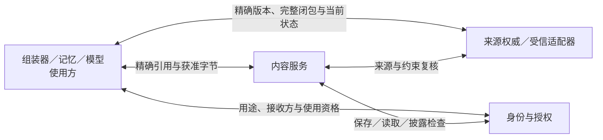
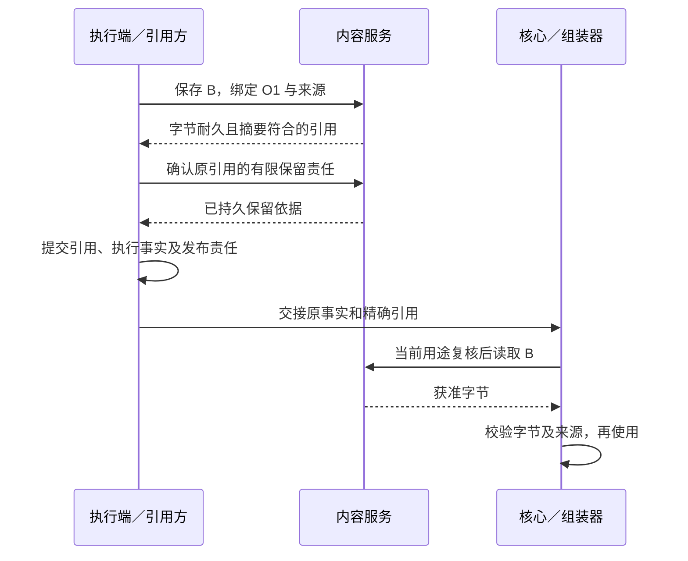

# 内容与来源的共同交接

内容引用让执行证据、任务快照、模型输入和记忆来源指向同一份已保存字节。能取回这些字节，还需分别知道其来源、当前用途限制和保留边界。本页集中说明现有内容服务与来源适配器的交接责任，支撑 C2、C3、C7 及 V1／V2 的证据链。

本页补全[HTTPS 内容通道](endpoint-communication/transport.md#content)、[执行证据发布](capability-and-execution/execution-and-recovery.md#states)和[上下文来源绑定](task-kernel/decision-and-work.md#context)已有约束。它是现有提供方的共同专题，不新增全景图组件或独立服务；同宿主与[WSS 领域合同](#remote)承担相同责任。[全框架持有者登记与清理](#holders)已经纳入设计，来源／内容与授权分别裁决。设计明确不代表运行实现已交付。

## 1. 字节、来源与使用事实的分工

**内容对象**是提供端在用户作用域内保存的固定字节，既有 `content_id`、长度、媒体类型和 SHA-256 标识它。**来源绑定**说明这些字节来自哪个资源版本、哪次观察或生成，以及受到哪些限制；摘要相同不能证明来源相同、观察仍有效或当前允许使用。

| 事实 | 保存与裁决方 | 不能由它推出的结论 |
| --- | --- | --- |
| 字节已持久保存、完整性、可读取状态及本提供端保留／清理责任 | 内容服务；沿现有上传成功条件，只有耐久保存并核对摘要后才返回引用 | 不证明来源真实、任务成功或接收者已经取得内容 |
| 资源精确版本、来源闭包、当前资源状态及数据硬约束 | 来源权威，经受信来源适配器解析；例如记忆服务裁决记忆修订，驱动绑定实际观察与原操作 | 不签发行动许可，不因内容仍在就宣布旧来源仍适用 |
| 主体、用途、处理位置、接收方及有限使用资格 | 身份与授权；处理端落实 BeginUse 和本地出口约束 | 授权回执不证明字节已保存、已披露或已删除 |
| 某份证据被哪个原操作、快照或正式成果采用 | 执行、任务或其他引用方的领域账本 | 上传成功不代替引用方提交，引用存在不代替当前读取资格 |

来源适配器是调用既有权威的受信代码，不另外保存一套可绕过权威的有效性结论。内容服务可与来源权威同宿主，但保留上述区别：网页获取驱动证明“此次取得哪些字节”，不能仅凭这份副本证明远端网页此后未变；公开来源的允许时效与重新取证周期由已安装策略明确。

图表示一次内容使用的检查关系，箭头为受控请求／返回。使用方只有取得精确字节、完整来源和当前用途依据，才能把内容交给下一处理端。

## 2. 最小绑定与提供方合同

以下逻辑值存于受信提供端或引用方账本，通过已安装适配器取得；不要求添加到 v1 `content_ref`、HTTP 请求或 WSS 信封。外部调用不能以自报用户、来源或 actor 覆盖受信关联。无法取得必需绑定时返回缺口，不把省略解释为无来源限制。

| 绑定 | 必需内容与规则 |
| --- | --- |
| 内容身份 | 受信用户、内容提供端、content_id、长度、媒体类型、SHA-256；同 ID 不换字节、不跨用户去重。纠正或重新取证形成新内容身份 |
| 来源与生成依据 | 来源权威、规范资源、精确修订或不可变观察标识、实际取得字节的摘要／范围、获取时间及截断／失败情况；派生产物包含全部输入来源，沿[来源闭包规则](memory-system/contracts.md#records)及所属领域语义解析 |
| 原业务关联 | 原 task／operation 或 work／attempt、内容角色及固定意图；上传尝试与业务操作分开，重复上传不能创建新的目标行动或改变原事实 |
| 使用范围 | 当前用途、处理服务、真实接收方／位置、资源策略及许可依据；读取、模型处理、保存和披露分别检查，原许可引用不是持续可用证明 |
| 保留与核对 | 引用方、原引用关联、所需可恢复期限、本提供端获准的保留截止、最小控制记录期限及确认依据；保留责任不延长权限，不覆盖后来到期、删除或策略收紧 |
| 当前来源证明 | 被核对的精确来源集合及版本、用途／接收方、权威修订或可核对观察、策略版本、判定时点和有效截止；来源改变、关闭或依据不足分别报告，不能只返回一个无绑定的布尔值 |

来源证明只说明在声明时点和新鲜度内可用。资源当前状态与授权资格分别成立后才能使用；证明不消费许可，也不取代处理端 BeginUse。静态公开资料没有实时更新接口时，可返回符合部署时效策略的已取得观察；要求实时确认但提供方做不到时返回缺口。历史证据是否仍能证明过去效果由领域判据裁决，不能把“当前版本已变化”改写为“过去操作从未发生”。

| 发起方 → 处理方 | 输入与结果；成功含义 | 持久责任及未知后的继续者 |
| --- | --- | --- |
| 生产者 → 内容服务 | 获准字节与受信关联 → 已核验的耐久内容引用 | 服务保存对象及有限暂存／清理责任；生产者保存已确认引用。HTTP 响应丢失不推断未上传，沿现有临时内容生命周期收敛 |
| 引用方 → 内容服务 | 精确内容、原引用关联、所需恢复期及允许保留范围 → 固定保留依据或缺口 | 服务在确认前耐久登记本提供端责任；引用方提交未知时保留该责任并核对原提交，不按一次查询未见提前释放 |
| 使用方 → 来源适配器 | 完整来源、即将进行的用途及接收方 → 有绑定的当前证明或逐项缺口 | 适配器访问所属权威；调用方保存本次采用依据并有界重查，不用旧 allow 填补不可达 |
| 使用方 → 内容服务 | 精确引用、当前受信身份和用途 → 获准字节或不可取原因 | 服务在有限读取单元的出口检查当前门禁；读取方核对长度／摘要，失败由原业务等待、重新取证或明确缺口 |
| 受信管理入口／到期工作 → 内容服务 | 精确对象或本地来源关联、固定控制身份与当前权限 → 本提供端禁用及分项清理进度 | 服务持久保存禁用、清理责任及原结果；入口沿原身份查询，不能凭请求已发送报告字节已清理 |

内部保留确认和关闭交接使用受信用户内固定的原关联／步骤身份及意图，重投只恢复原结果，同身份异内容拒绝；状态查询先检查当前最小披露权。提供端提交未知时查询原记录；当前未见不证明未提交。该规则约束受信内部适配器，不赋予现有 HTTP 上传接口额外的幂等或查询能力。

引用保留是本提供端承担字节保管责任所需的内部确认，不登记外部使用方所有派生副本。v1 上传接口没有通用幂等键、原上传查询或上述保留管理载荷；远程 HTTP 适配器不能自行添加字段。引用保留／原关联查询使用[明确的 WSS 内容管理消息](#remote)，缺少实现时不发布依赖该恢复保证的引用。普通上传成功仍按既有 HTTP 合同解释。

## 3. 从取得内容到发布引用

以执行操作 O1 获取网页证据 B、任务据此生成答案为例：执行端先保存 O1 的真实观察与取得范围，内容服务按当前保存资格持久保存 B 并返回引用。发布前，执行端取得覆盖所需恢复期的本提供端保留依据，再把精确引用、完整来源、该依据与执行事实／发布责任一起提交到自己的账本。核心接收后据来源取得当前用途依据；组装器读取并校验 B，模型出口仍按实际模型接收方复核。

内容保存与领域引用通常是两个提交边界，无需跨库事务。先确认字节与有限保留责任，再提交领域引用，避免已发布事实只剩一份可随时作为孤立对象回收的内容。两个记录可共用宿主事务存储，逻辑责任仍由各自提供方承担。保留期覆盖不了所需恢复期时，在承诺完整证据交付前报告缺口；业务可以在其契约允许时只报告最小状态，不能伪造可恢复证据。

响应丢失时按所在边界处理。内容服务可能保存了尚无引用方记录的对象，由其有限暂存清理承担；引用方若已取得内容身份，后续只核对同一身份。只有无法恢复上传引用、当前仍获准且原上传预算允许时，才能再次传输已固定字节；可能产生另一临时对象，但不能重新执行 O1、重新取证冒充原内容，或给已提交消息换引用。单次保存许可不因上传响应丢失而自动恢复次数。

领域引用提交未知时，引用方沿原事务或原操作核对；内容服务不因引用方暂时不可达就提前释放已确认的有限保留责任。原期限耗尽或数据策略要求提前关闭时，仍须执行关闭并留下获准缺口，不能为了恢复无限保留正文。已经发布的旧引用失效后，业务报告内容不可恢复；新取证属于新的获准行为，不能覆盖原证据身份。

## 4. 到期、关闭与清理竞争

内容服务在自身提交域中串行裁决引用保留确认、读取出口门禁及对象关闭。关闭提交同时保存禁止新使用的依据、清理责任和最小回执；关闭在先则后续保留确认与新读取失败。保留确认在先不阻止后来的撤权、删除或到期：旧依据不再授权新使用，服务保留原责任及缺口说明。不得先物理删除、稍后才登记关闭，也不能靠正文是否存在推断原关闭是否提交。

实际字节传输与数据库提交不可能全局原子。读取按身份模块规定的有限单元检查；出口门禁在先的在途单元单列已开始披露，关闭后停止后续单元，并尽力中断当前传输。远端来源或授权变化仍受各自证明期限和已声明传播窗口约束，不承诺即时收回已经交付的字节。

| 场景 | 行为与继续责任 |
| --- | --- |
| O1 引用已提交，所需内容到期／被删 | 服务拒绝新读取，引用方保留 O1 事实和内容缺口；任务判断证据是否仍充分，不把缺字节解释为未执行 |
| 来源被纠正或撤权，字节仍在 | 来源复核或授权检查失败，禁止相应复用／披露；是否必须清理由当前保留策略判断，撤销行动许可不自动等于删除全部证据 |
| 关闭与引用确认并发 | 在提供端按上述顺序裁决；之后领域引用即使迟到提交，也不能凭旧保留依据越过当前读取门禁，报告不可用并沿原责任收尾 |
| 对象保存、保留确认或关闭提交后宕机 | 恢复原对象／关联与处理结果，工作者从持久责任继续；无法确认原提交时报告未知，不创建可复活旧 ID 的替代对象 |
| 清理中宕机或答复丢失 | 沿原清理身份继续并查询分项结果；禁用不回退，重复清理不再次产生业务操作 |
| 旧备份恢复 | 先应用当前关闭及最小去重依据、核对账本资格再开放；依据不足则对象不可读取，不因旧字节仍在复活内容 |

本提供端清理覆盖其管理的正文、暂存、缓存、包含正文的交接载荷及登记备份；分别报告逻辑禁用、载体处理完成与残留。不可修改备份按已声明到期报告，无法满足必需物理清理期限的部署在接纳前拒绝该模式。清理正文后保留获准的最小关闭／原关联依据；连这些依据也必须删除时，先关闭对应旧身份的接纳资格，缺少可靠关闭能力则不接纳该恢复模式。

任务快照、模型进程／供应方、记忆派生项、评测集、UI 缓存和用户导出由各持有者负责。本页的提供端回执不证明这些副本已停止使用或已清除；受管持有者登记、来源关闭传播和分项清理回执沿[本页治理合同](#holders)，MS-P2／OI-P2 已采用。既有使用前复核继续成立，需要更强全链删除保证的数据仍按各模块入口限制接纳。

## 5. 装配与验证边界

启动组装器固定内容及来源提供方、规范化版本、允许处理位置、有限对象／字节／读取并发、暂存与保留期限、清理及核对额度。记录按受信用户隔离；当前身份、来源状态或保留依据缺失时，相应使用受限。容量满时先拒绝新内容，清理、原记录查询与未决引用核对保留处理空间。逻辑合同不指定新的存储产品，也不宣称具体连接器、平台清理或跨端 profile 已可用。

以下为共同交接的验收设计，复用 CE-19、BS-05／19／24、MS-12～15／22；当前没有本提供方的运行结果。

| 场景 | 必须观察的结果 |
| --- | --- |
| O1 取得 B → 上传 → 引用提交 → 模型使用 | 内容摘要、精确来源、原操作及保留依据一致；只在字节与来源均获准时使用，上传成功不直接成为任务完成 |
| 上传答复丢失，随后领域引用提交答复丢失 | 区分孤立临时内容与已确认保留对象；核对原引用，不重做 O1，不替已发布消息改内容 |
| 发布前后分别到期、关闭或撤权 | 当前门禁阻止新使用，领域事实不被抹除；必要证据缺失明确报告，在途披露与后来使用分开观察 |
| 关闭与保留确认／读取并发，清理中重启 | 提供端裁决顺序可查；旧依据不能复活对象，清理责任恢复且结果按载体分别确认 |
| 来源权威不可达、公开网页变化、仅取得摘要 | 按声明新鲜度等待或报告缺口；实际取得范围不被扩成全文，历史观察与当前来源状态分开 |
| 旧备份、跨用户相同摘要、来源绑定被替换 | 无越权命中／复活，意图或来源不符拒绝；当前关闭依据不足时保持入口受限 |

文档链接、图示与协议静态检查只验证表达和既有线合同；对象耐久性、关闭竞争、真实来源新鲜度及载体清理须由参考实现和故障注入另行证明。

## 6. 来源证明与内容管理的跨端合同

来源与内容管理采用现有网关 WSS，字段见 [governance Schema](endpoint-communication/schemas/governance.schema.json) 与 [共享精确绑定](endpoint-communication/schemas/domain-common.schema.json)。HTTPS 仍只传字节；上传成功不登记外部持有者，也不建立领域引用的可恢复保留保证。跨端部署必须同时落实受信元数据路径与获准字节路径。NAT 后内容只有在策略允许时上传至可访问提供端；禁止云端保存／处理的原文留端侧处理，不能为了打通引用自动复制到网关或云存储。

| 消息（均为 harness.*@1） | 发起方、输出与成功含义 | 未知后的继续者 |
| --- | --- | --- |
| source.prove | 使用方提交精确 source_ref 集合、用途、处理端／接收方与所需有效期；各来源权威返回对应 source_bindings 或逐项 gap | 使用方有限重查；要求更长时效但无法提供时缺口，不沿用旧 allow |
| content.retain | 引用方提交 content_ref、原引用／holder、所需期限和完整来源；提供端保存有限保留责任，返回 retain_until 与 proof | 引用方按 content_id／reference_id 调 query_retention；不能另取字节替代原引用 |
| content.query_retention | 查询原引用的 retained／closed／expired／not_observed 与可核验证明 | 当前未见不证明未提交，继续核对原命令或明确缺口 |
| content.close | 受信管理或到期工作以 command_id、content_id、预期修订关闭；禁用与清理责任共同保存 | cleanup_id 固定等于原 command_id，响应丢失可按原 ID 查询 |
| content.query_cleanup | 查询该提供端各载体禁用、清理与残留；不返回已撤权正文 | 所属提供端继续原清理工作，不把查询超时改为完成 |

source.prove 与查询走 recovery，retain 走 work，close 走 control；全部仍按当前资格及原对象关联检查。内容管理 scope=content／content_id，来源查询 scope=collection／目标来源权威，受信处理器另外核验查询集合与用途。proof_ref 是权威、proof_id、修订、绑定摘要和有效期的固定引用；接收方必须向该权威或已验证的受信证明缓存解析其事实，不能接受调用者编造的自证引用。

跨端 source_binding 包含精确资源／修订、字节摘要、观察时点、策略及修订、用途、接收方、处理端、保留截止与当前证明。列表是完整平铺的输入闭包；每项都必须满足当前用途，来源集合摘要用于固定整体绑定。各权威独立裁决，不伪造跨领域原子快照；证明过期或来源关闭时先关闭相应使用。

## 7. 全框架受管持有者与关闭传播

MS-P2／OI-P2 已采用。来源权威保存其精确来源修订对应的持有者登记和关闭事实；每个持有者保存自己真实载体及清理责任。任务快照、模型上下文、记忆与索引、评测样本／评分／报告／候选、UI 缓存、内容、消息载荷、暂存和备份全部属于框架受管范围，复用现有领域工作与存储，不新增全局删除服务。外部模型／系统和用户导出按其声明能力登记接收事实及不可撤回边界，不能伪造受管回执。

生产者在产物成为可复用／可发布内容前，先固定 holder_id、精确来源集合、用途、端点／owner／账本、受管对象与类别、保留和离线使用截止、物理清理能力及必要截止。每个直接来源权威都须确认登记；任一拒绝则不发布，暂存仍按原有限责任清理。直接来源登记其父级闭包关联，关闭沿反向登记传播至全部派生持有者。登记与关闭在每个来源权威同一提交域串行：关闭在先拒绝新登记；登记在先，关闭必须把它纳入责任清单。跨来源部分登记不产生使用资格，失败时关闭已登记但未发布的孤立持有者。

| 线类型 | 事务、结果与恢复 |
| --- | --- |
| governance.register_holder | 原 command_id、holder 与各来源当前证明；权威确认登记后返回 registration_proof，证明绑定 holder／来源／用途和期限，不授权新用途 |
| governance.close_holder | 对指定 holder 按当前 owner 关闭新使用并登记物理清理；用于未发布孤立副本、到期或用户删除，返回原回执与清理项，不关闭上游来源；同命令重投恢复原答复 |
| governance.close_source | 原 command_id、精确 source_ref、预期修订和删除／撤权／纠正／到期原因；关闭事实、持有者水位与传播责任共同保存，closure_id=command_id |
| governance.apply_closure | 目标持有者核验源关闭 proof、closure_id、holder_id；本地先阻止新使用并保存分项清理，再返回本端应用事实 |
| governance.report_cleanup | 当前持有者以原命令及清理项回报停止使用／物理处理；来源权威核对原登记端点、owner 及证明，重复不丢失原责任 |
| governance.query_cleanup | 按原 closure_id 分页读取固定关闭清单与分项当前进度；权限拒绝／历史缺失另报，不返回已关闭正文 |

登记走 work，其余变更走 control，查询走 recovery。作用域为 collection／holder_id 或 closure_id；业务对象的关联必须从原登记和命令验证，不能凭自报 scope 建立权限。关闭传播采用最小控制依据，即使正文已不可披露也能完成禁用与清理；不允许最小关联披露的接收端，预先绑定整个视图／容器的关闭入口，否则不接纳复制。关闭后的迟到登记、旧消息、旧版本快照不能重新使数据可用。

每个清理项独立记录 use_state、原 use_until、physical_state、适用到期、回执和缺口。在线端获知关闭立即阻止新使用；离线端未确认时保留原最晚使用截止，截止到达只能说明不得新使用，不能证明磁盘擦除。物理清理等待实际平台回执，设备长期离线可一直未完成。不可修改备份显示 retained_until 至声明到期；恢复前必须先取得当前关闭／去重尾部与唯一账本资格。来源关闭传播、停止使用及物理完成不是互斥阶段，任何一项完成不自动结清其他项。

清理完成只针对关闭时登记的受管范围与受信证据。分页 complete 表示清单已穷尽，不是所有物理清理完成；只有所有必需项具有适用清理完成依据时，管理器才显示该受管范围已处理。外部已披露、不可验证介质和其他合法保留依据分别列残留，不汇总为无条件“彻底删除”。收集不到平台证据就保持缺口；用户要求必需的有界物理清理而部署无法满足时，在保存／复制前拒绝。

到期工作、核对／传播重试及最小回执均有部署上限；耗尽主动重试释放工作槽并保留未决责任及一次通知，重新上线从原 closure_id 继续。正文保留服从数据策略，不能为恢复无限延长；必须删除全部最小去重依据时先持久封闭旧账本／身份接纳资格，不能让旧请求复活。停止后续提取还须撤销来源接入／提取资格，删除现有记忆不隐含撤销连接器权限。
