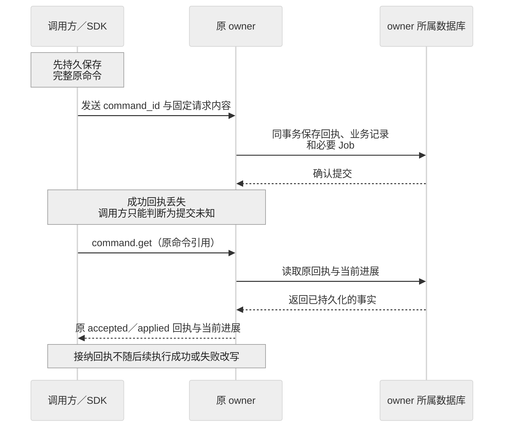

# 应用接口组件接口与协议

应用开发者通过目标、控制、观察和交互接口使用 Lerna；组件开发者通过固定输入、持久接纳、查询与关闭接口提供能力。所有写方法遵守共同命令语义，同进程与远程调用使用相同的成功点。

本章是行为合同。字段类型见[数据与存储](data-model.md)。本目录没有交付可直接生成 SDK 的完整 JSON Schema；发布前必须将选定 profile 的全部方法和状态约束转为同版机器契约，不得根据示例宣称已经兼容。

## 三种调用面

| 调用面 | 典型使用者 | 合同范围 |
| --- | --- | --- |
| Application | 应用服务、浏览器和 CLI | Session 输入、Task 控制和查询、InputRequest、Content 读取 |
| Component | 决策、记忆、执行、核验和 Agent 实现者 | 固定身份、准确输入、异步结果、费用、取消与关闭 |
| Host | 默认宿主和基础设施适配器 | Tx、JobStore、Clock、ResourceFence、生命周期和发现 |

Host 是内部同版接口，不要求远程第三方组件采用。Component 接口必须能由异构语言实现。Application SDK 隐藏编码、原命令存储、重连和分页恢复，但必须保留业务状态差异。

## 命令信封

| 字段 | 必填 | 含义与检查 |
| --- | --- | --- |
| contract_version | 是 | 准确线协议版本，双方协商后固定 |
| profile | 是 | 调用所属能力集合，例如 core、memory、delegation |
| command_id | 是 | 原命令身份，调用前持久保存 |
| target | 是 | tenant_id、owner_id、对象类型与对象 ID；创建操作指向相应逻辑服务 |
| method | 是 | 同版登记的方法名 |
| payload | 是 | 该方法的闭合字段集合；未知字段拒绝 |
| expected_revision | 更新时 | 目标对象并发版本；冲突不能自动改值重发 |
| accept_before | 是 | 首次接纳的绝对截止；重传不得延长 |
| trace_context | 否 | 可观测关联，不参与授权，不改变业务请求摘要 |

主体、租户和委托链从受信认证上下文得到，不接受 payload 自报身份覆盖。请求摘要包含方法、目标、主体绑定、payload、expected_revision、accept_before 及版本；不包含传输连接、发送次数和 trace_context。

准确对象引用不得靠名称或“最新版本”替代。创建时客户端可以预生成对象 ID，服务端必须把它与原创建命令绑定；相同对象 ID 的不同创建内容拒绝。

```json
{
  "contract_version": "v2-design-1",
  "profile": "core",
  "command_id": "cmd-demo-01",
  "target": {"tenant_id": "tenant-demo", "owner_id": "orch-demo", "kind": "task", "id": "task-demo"},
  "method": "task.pause",
  "expected_revision": "7",
  "accept_before": "2026-10-03T10:00:00Z",
  "payload": {"reason": "用户暂停"}
}
```

这是字段示例，`v2-design-1` 是本设计的占位版本，不是已发布协议。时间与身份仅为例值，不能作为实际调用请求。

## 回执查询与错误

写方法返回 CommandReceipt：`command_ref`、`state`、`object_ref`、`revision`、可选 `reason` 和 `next_action`。state 是不可变的接纳回执；关联对象的执行状态另外返回。查询方法没有修改副作用，不因为 read 而启动模型、安装组件或重发工具。

| 返回 | 含义 | 调用者下一步 |
| --- | --- | --- |
| accepted | 异步处理责任已持久保存；后续失败不改写此回执 | 查询原命令或对象；不能重复创建 |
| applied | 方法定义的修改已经提交 | 按对应对象查询后续效果，不推导任务成功 |
| rejected | 原命令未接纳业务工作，并已固定拒绝 | 条件变化且业务确需重试时，新建显式命令；不得重用原键改内容 |
| conflict | 新命令前态不符，属于固定拒绝原因 | 读取当前状态，让调用方重新决定 |
| commit_unknown | 未知是否提交，属于传输结果 | 查询或重传完整原命令 |
| unavailable | 当前不能取得可信结果 | 有界等待；不能当作对象不存在 |

标准 reason 包括 `schema_invalid`、`version_unsupported`、`forbidden`、`expired`、`idempotency_conflict`、`revision_changed`、`budget_exhausted`、`dependency_unavailable` 和 `unsupported`。方法表列出的特有错误补充这些公共错误。

`command.get` 返回原决定及当前异步进展；`not_found` 只表示该负责方在当前查询中未找到，不能证明别的 owner 未处理。SDK 不得自动更换 owner。`gone` 表示正文已按策略清理但保留最小身份；无权查询时返回不泄露对象存在性的拒绝或 redacted 视图。

### 回执丢失后沿原命令恢复

下图展示“接纳已提交，但成功回执未送达”的情况。调用方保留原身份，向同一 owner 查询；接纳回执与后续执行进展分别返回。



可打开[命令恢复时序图](assets/command-recovery.svg)。图假定原提交已经成功，省略业务执行过程。查询不可用时有界等待；需重传时保持完整原命令、owner 和 accept_before 不变。查询未找到不能作为更换身份、延长期限或创建同义工作的依据；完整接纳规则见[命令接纳算法](runtime.md#命令接纳算法)。

## 应用接入方法

以下“成功点”均表示 applied；需要后台处理的部分同时保存 Job。表中“原引用”包含准确 owner 和对象 ID；修改方法共同携带 expected_revision。

| 方法 | payload 必要内容 | 成功点 | 特有拒绝或后续查询 |
| --- | --- | --- | --- |
| session.create | session_id、应用配置引用 | Session 与初始分支已保存，不创建 Task | 重复创建冲突；session.get |
| session.submit_goal | session_ref、branch_revision、goal_ref、attachment_refs、policy_ref、budget、deadline | 原 Message、Submission、固定目标投递责任已保存 | branch_changed、input_unavailable；submission.get |
| session.steer | session_ref、task_ref、expected_goal_revision、准确补充正文 | 补充输入及向原 Task 的投递责任已保存 | Task 是否消费由 submission.get 给出 |
| task.submit | task_id、goal_ref、attachment_refs、policy_ref、budget、deadline | Task、原目标与准备责任已保存 | policy_unsupported；task.get |
| task.steer | task_ref、expected_goal_revision、补充正文及附件 | 原补充已接纳、旧目标准入已收紧，保存重建目标责任 | goal_changed、terminal_task；task.get |
| task.pause | reason | 控制修订与传播责任已保存 | terminal_task；不保证远端已停 |
| task.resume | reason | 当前条件允许时恢复 Task 控制并保存推进责任 | budget_exhausted、deadline_elapsed、terminal_task |
| task.cancel | reason | 取消终态、固定终结 Result 与控制、核对责任已保存 | 已终态返回相应状态；effects_closed 单独查询 |
| interaction.answer | request_ref、request_revision、answer_ref、preview_refs | 答案投递已保存 | 真实消费查询原业务请求 |
| task.answer | request_ref、request_revision、answer_ref | 原业务输入已一次消费并保存后续责任 | request_expired、request_changed、answer_invalid |
| task.get、task.list | 原引用或范围过滤与 cursor | 返回当前获准的 TaskView | 包括来源缺口与各对象 revision |
| submission.get | submission_ref | 返回 queued、sending、applied、rejected 或 withdrawn | 输入已保存与 Task 已接纳分别显示 |
| task.subscribe | 已授权范围、cursor? | 建立变化提示，不作为业务回执 | cursor_expired 时重建快照 |
| content.get | 准确 ContentRef、purpose、可选字节范围 | 返回获准字节或受控读取凭据 | gone、integrity_mismatch、permission_changed |

无会话应用可以直接使用 task.submit，承担同样的原命令持久化义务。有会话应用通过 session.submit_goal，由应用 owner 保存原文和投递责任。SDK 不得同时调用两个入口为同一意图创建两个 Task。

TaskView 至少区分目标状态、等待原因、输入请求、已知进展、效果关闭、费用关闭、结果、限制和视图缺口。模型流片段标记 provisional，只有 Result 是正式成果。终态后的新工作建立关联 Task，不隐式 resume。

浏览器刷新前后的可靠投递由持久 outbox 实现：先提交 IndexedDB 记录再发送；失败时拒绝发送。原记录完全丢失后，SDK 可以从受信目录找已接纳 Task，但不能凭目标文本猜测原 command_id 或另建同义 Task。

### 一次应用接入

以下为拟提供 SDK 的伪代码，展示调用顺序，不代表已有可运行包：

```text
client = ApplicationClient(identity, durable_outbox, trusted_directory)
submission = client.submit_goal(goal, attachments, policy, budget, deadline)
view = client.observe_submission(submission)
task = client.observe_task(view.task_ref)
when task.input_request exists:
    renderer.show_exact_body(task.input_request)
    client.answer(task.input_request, user's_answer)
when task.result exists:
    show(task.result, task.effects_closed, task.spending_closed, task.limitations)
```

SDK 必须让断连、输入已保存、业务拒绝和未知效果可区分，不能用一个 Promise 成功来代表整个任务完成。

## 能力模块方法

异步组件先返回 accepted，再通过 get 返回最终事实。每个调用固定 ComponentRef 或 Binding、限额和截止；取消只能关闭可关闭的新增工作，不能销毁原结果查询入口。

Proposal 必须包含 `decision_ref`、`snapshot_ref`、`goal_revision`、`control_revision`、`processed_source_refs` 及有界候选。候选结构如下：

| 候选 | 必要内容 | 互斥或顺序规则 |
| --- | --- | --- |
| requirement_delta | 候选本地键、statement_ref、source_refs、kind、required、rule_ref、可选 replaces_ref | 实质更新优先提交；同提案其他候选不采纳 |
| actions | 每项 local_key、capability_ref、binding_ref、arguments_ref、purpose、source_refs | 第一版最多四项且相互独立；依赖结果改为后续 Decision |
| input_request | question_ref、answer_schema_ref、purpose、必要 preview_refs | 只请求澄清或材料；不能创建授权确认 |
| candidate_result | artifact_refs、逐条件 evidence_refs、limitations | 只能启动核验，不能直接写 Task 终态 |
| cannot_continue | reason、missing_requirements、可选已完成成果引用 | 保存缺口与等待或终结依据 |

除 requirement_delta 可以伴随但优先于其他候选外，一份提案只允许一种推进候选。Schema 必须拒绝同时请求输入、执行行动和完成的含混组合。processed_source_refs 表示本次实际处理材料的完整来源；最终对外披露的材料另存 disclosed_source_refs，不能以较小披露集合替代处理来源约束。

| 方法族 | 请求核心字段 | 接纳与最终输出 | 特有失败 |
| --- | --- | --- | --- |
| decision_engine.decide | decision_id、task_ref、snapshot_ref、component_ref、use_refs、limits、deadline | 原 Decision 已接纳；decision_engine.get 返回 Proposal、产物引用与用量 | snapshot_unavailable、input_over_limit、provider_result_unknown |
| decision_engine.cancel、decision_engine.get | 原 decision_ref；cancel 包含控制依据 | 停止决定或当前 Decision；可能仍有费用待核对 | decision_mismatch、result_unavailable |
| executor.invoke | operation_id、task_ref、goal_revision、control_revision、intent_ref、binding_ref、start_use_refs、limits、deadline | 原 Operation 已接纳；get 返回 phase、Effect、证据、may_apply_later、用量 | binding_not_ready、resource_busy、permission_expired |
| executor.apply_control | task_ref、control_revision、allowed、valid_until、原 owner 控制凭据及摘要 | TaskGate 与必要停止、核对 Job 已共同保存；仅声明本地门禁已更新 | control_stale、control_conflict、invalid_issuer |
| executor.cancel | operation_ref、task_ref、intent_digest、control_revision、原 owner 控制凭据、reason | 停止意图、准确绑定墓碑与核对责任已保存；未知 Operation 也可关闭 | control_stale、binding_mismatch；已发生效果不回滚 |
| executor.reconcile、executor.get | 原 operation_ref；reconcile 附可选新证据引用 | reconcile 接纳一次核对责任；get 只返回已知事实 | evidence_unavailable、target_unqueryable |
| memory.query | query_ref、scope、purpose、limits、cursor? | 返回准确记忆版本、来源、partial、gaps、查询水位 | query_expired、permission_changed、index_incomplete |
| memory.create、memory.replace | 原 memory_id、values；replace 带原 revision | 记忆版本、来源与投影责任已提交 | source_invalid、saving_not_authorized |
| memory.restrict、memory.delete | 原 memory_ref、收紧策略或删除原因 | 新使用门禁已收紧并保存传播清理责任 | scope_expansion；清理结果另查 |
| memory.extract | extraction_id、input_refs、strategy_ref、saving_mode、limits、deadline | 提取责任已保存；get 返回候选，不等于保存记忆 | saving_permission_missing、input_unavailable |
| evaluator.check | check_id、requirement_ref、goal_revision、artifact_ref、rule_ref、evidence_refs、limits | 检查已接纳；get 返回 ConditionResult 与适用范围 | unsupported_rule、insufficient_evidence、evaluator_ineligible |
| content.put | content_id、version、hash、media_type、byte_length、sources、purpose | 准备责任已接纳；核验字节后 published 才可引用 | hash_mismatch、source_forbidden、upload_incomplete |
| delegation.create | delegation_id、parent_ref、goal_revision、goal_ref、requirements、scope、allocation、deadline | 原创建责任和远端键已固定；get 返回子 Task 或远端句柄 | unsupported_guarantee、depth_exceeded、cycle_detected |
| delegation.cancel、delegation.get | 原 delegation_ref、控制修订 | 取消传播已保存或返回子结果与关闭依据 | remote_unknown、closure_unproven |

MemoryValues 包含 type、content_ref、sources、scope、observed_at、valid_interval、可选 confidence；owner、状态和 revision 由服务产生。MemoryQuerySpec 只允许文本引用、结构化过滤、排序策略和有界结果数，不接受任意 SQL、代码或 URL Schema。

组件返回的使用记录必须关联实际计费来源和累计修订，不能只有一个无法核对的总数。未支持的保证必须声明，例如某 API 不能查询原请求；适配器不得填充假的 not_applied 或零费用。

TaskGate 只能由原 Task owner 签发，Executor 从受信身份和目录核验该关系。更低 control_revision 拒绝，同修订同摘要幂等，同修订异内容冲突。更高修订原子替换门禁并保存必要控制工作。启动要求 invoke 的 control_revision 与当前门禁一致；更低修订且可证明尚未发送的 Operation 关闭，已可能发送的继续核对。`allowed=true` 仍需有效 GrantUse、就绪实例和未关闭 Operation；它不能复活 Operation 墓碑。等待 invoke 的控制与墓碑不依赖 Operation 已存在才能鉴权。期限到期只封新启动，不能据此声称旧发送已停止。

ContextCompiler 在调用决策引擎前形成失败时，TaskView 返回 `context_overflow` 或具体来源缺口，不创建已发送的 Decision；相关处理规则见[上下文构造](capabilities.md)。

## 授权和宿主管理方法

| 方法族 | 核心请求 | 成功点与限制 |
| --- | --- | --- |
| grant.issue、grant.restrict、grant.revoke | 受信主体、结构化资源与用途、限额、有效期；修改带 revision | 原许可决定已提交，撤销传播和在途有限窗口分别处理 |
| confirmation.decide | confirmation_ref、request_revision、原命令摘要、本人决定 | 本人决定已保存；原业务仍需复核并一次消费 |
| budget.reserve、budget.settle | 根预算、原行动、各单位上界；实际来源累计用量与修订 | 预留或结算已提交；未知费用不得当零释放 |
| extensions.prepare | target_ref、准确 InstallLock、配置引用 | 准备责任已保存，不发布可调用 Binding |
| extensions.activate | target_ref、expected_generation、InstallLock、approval_ref | 目标头与当前实例就绪共同提交后才可调用 |
| extensions.deactivate | target_ref、expected_generation、activation_ref | 显式封闭该激活的一切新调用，包括固定该版本的旧 Task，保留原责任收尾 |
| extensions.get | 原目标、安装或激活引用 | 返回批准、当前实例就绪和残留，查询不启动代码 |

管理接口按 profile 单独开放，不暴露给模型任意调用。首次发布仅开放已具备完整字段 Schema 和合同测试的方法。Schedule、可复用 Environment、Surface 事件等可选 profile 在完成专项契约前返回 unsupported，不接受半实现的通用 JSON 扩展。

## 协议发现版本与传输

受信目录按租户返回可以创建新 Task 的 owner、支持 profile 和 contract_version。客户端在首次发送前固定目标 owner；后续发现更新只影响新任务，原命令仍指向原 owner。网关只能更换服务进程，不能更换逻辑责任。

端云使用 WSS，服务间使用 gRPC，同进程使用直接接口。gRPC 使用 Protobuf 外壳承载严格 JSON 领域正文，避免两份字段规范；外壳保存消息类型和长度，不改变正文语义。发现、身份认证和大内容字节传输使用 HTTPS；大内容通过准确引用交接。

连接帧区分命令、回执、查询、变化提示和临时流片段。传输投递序号用于流控与重连，不能充当 command_id。逐连接设字节与在途上限；慢消费者可以丢弃临时片段或提示，但已接纳业务不能丢失。消息大小与速率在发布配置中冻结。

订阅用于提示“对象可能更新”。客户端先订阅缓冲，再读授权快照，再归并新提示；发现水位缺口、权限代次变化或溢出时重建。对象修订用于去重；不同 owner 的墙钟不能提供全局顺序。

兼容性按 profile 和方法 Schema 摘要协商。未知字段、枚举或语义版本默认拒绝；新增可选字段也必须经过版本协商。契约、生成类型、SDK 与正反例同版发布，禁止只升级 SDK 后默默扩大服务承诺。

## 外部协议适配

MCP 和 A2A 由独立适配器接入。适配器保存原 Operation 或 Delegation 与远端句柄的映射，把远端状态、业务错误、产物、输入请求和取消进展分别归一化。

本次考察到 MCP 2026-07-28 已采用无状态协议核心并把 Tasks 移入扩展，因此内核不得依赖 MCP 会话存活作为业务生命周期。具体互操作版本及历史版本兼容按插件清单固定。[MCP 官方发布说明](https://blog.modelcontextprotocol.io/posts/2026-07-28/)

| 外部情况 | 本地处理 |
| --- | --- |
| 协议调用成功但工具返回业务错误 | 保存工具失败和已有证据，不产生 Task 成功 |
| 远端 completed | 获取准确产物与关闭信息，按本地条件核验 |
| 取消回执已收到 | 记录取消意图送达，继续核实停止和效果 |
| 句柄过期或查询失败 | 保留原映射与未知，不自动重新创建 |
| 服务不支持必要的去重、授权或核对语义 | 限制能力用途或拒绝开放，明确 unsupported_guarantee |

每种协议支持情况都必须用实际服务和故障注入验证。协议版本正确不能证明实现的权限、耐久或效果保证成立。
