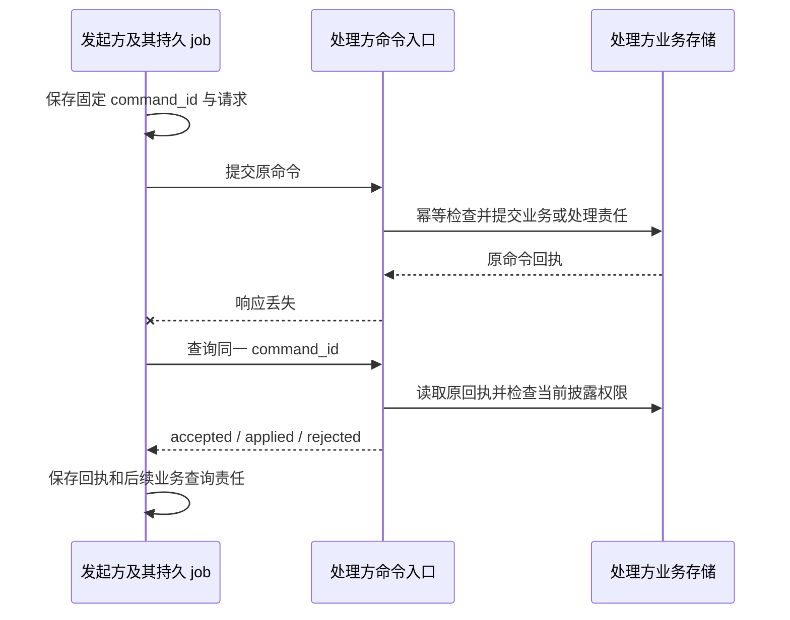

# 共同调用契约与跨端连接

[总览](../README.md) · [权限](../security/README.md) · [部署](../deployment.md)

本页定义独立实现共同遵守的调用语义。模块接口既可在同进程调用，也可绑定到 HTTPS；进程内不必先编码成网络消息。两种方式使用相同的业务输入、权限规则、持久成功点和错误。跨端增加可查询回执，不能改变业务成功的含义。

共同协议版本为本目录设计的 `harness/1`，尚未发布。发布时同时冻结本文、启用的领域方法清单和字段定义；任意实现不得以另一份持续变化的文档解释已发布消息。

## 阅读与规范层次

本文规定共同调用行为，所属模块规定业务状态、成功边界和恢复责任；[线格式与方法注册](protocol.md)集中定义已纳入草案 profile 的精确字段、请求／响应映射及机器资产。未纳入该范围的方法保留为设计接口，不能仅凭正文名称声明已经支持线协议。

共同信封、字段约束、权限、成功含义和可观察异常行为属于实现必须遵守的规范。本文及模块中明确标为“默认”“参考”“初始待测”的存储组织、调度算法与参数是参考实现选择；替换时仍须提供相同外部保证及运行证据。Schema 约束结构，关联校验约束同一组调用的身份与版本；两者都不能证明权限实际生效或事务持久化。

一个字段的业务含义归所属模块，线格式的类型和必填性归同版 Schema；二者冲突时该草案组合不能发布，不允许实现自行挑选更宽松的一方。安装和发布清单同时固定这些文档、资产和递归引用的版本及摘要，避免正文更新改变未决命令的解释。

本目录的 `schemas/` 保存共享字段与方法登记，`examples/` 保存完成判断投影和跨模块协议序列。校验入口及系统验收统一位于[validation](../validation/README.md)；模块内部实现细节在所属模块目录继续展开。

## 1. 从持久命令而非连接恢复

一个调用者提交“保存报告”后连接断开。恢复所需的是原调用是否被接受、原文件操作是否发生，而不是旧连接第几条消息被接收。默认方案因此采用命令去重、原记录查询和状态修订；事件流只让查询更及时。

| 回执 `stage` | 精确定义 | 调用方继续做什么 |
| --- | --- | --- |
| `accepted` | 请求及处理责任已持久化，尚无最终业务决定 | 沿同一 command_id 查询，不再创造另一项相同业务 |
| `applied` | 该方法定义的业务决定及后续责任已持久保存 | 按方法检查资源、远端接纳、效果或逐节点结果；不把 applied 一概当任务成功 |
| `rejected` | 已确定拒绝，该命令不再启动目标行为 | 按错误调整前提；改参数须使用新命令，原拒绝记录不改写 |

例如 task.submit 的 applied 表示创建任务；execution.invoke 的 applied 表示接受原操作并承担执行责任；task.cancel 的 applied 表示 Home 保存取消决定。三者均不表示外部系统已结束。若入口尚未持久化便不可用，返回传输级错误，不伪造 accepted。

## 2. 标识、命令和查询

所有业务 ID 使用带类型前缀的至少 128 位随机标识，大小写敏感，作为不透明字符串处理。标识不是权限凭证。tenant_id 从认证会话取得，不接受请求正文任意指定租户；跨端委派身份由[安全契约](../security/README.md)验证。

| 对象 | 权威字段与规则 |
| --- | --- |
| Command | `command_id, method, target_id, expires_at, expected_revision?, payload`；method 为领域定义的小写 `domain.action`；expires_at 是首次接纳截止，不是业务执行截止 |
| Receipt | `command_id, stage, resource_id?, revision?, output?, error?, accepted_at?, decided_at?`；终结决定固定；查询披露可按当前权限裁剪，并标明 redacted |
| Query | `method, target_id, payload`；仅注册为读方法的调用可走此入口，无命令持久接纳含义 |
| QueryResult | `output, observed_at, resource_revision?, cursor?, gaps?`；数据来自对应负责方，缺口明确返回 |
| Error | `code, message, retry, related_id?, current_revision?, retry_after_ms?`；retry 为 none/same_command/after_change/query_original；message 可本地化，代码不可自由替换 |
| ComponentRef | `id, version, digest`；version 用于兼容协商，digest 绑定实际不可变实现或配置 |
| Change | `cursor, object_type, object_id, revision`；只表示对象可能变化，不携带执行许可、不确认效果 |

内容引用由[记忆与内容](../memory/README.md)定义；Task／Result 在[运行时](../task-runtime/README.md#records)，许可在[授权](../security/README.md)。金额用带单位的整数或十进制字符串，不用浮点数比较额度。时间采用带 UTC 时区的 RFC 3339 字符串；跨端排序以对象修订为准，不以墙上时间决定先后。

幂等键为 `(tenant_id, logical_service_id, command_id)`，处理方同时保存 method、target_id、expected_revision、expires_at 和 payload 的规范化摘要。原键原请求返回原决定，原键不同请求返回 idempotency_conflict 且不覆盖原记录。规范化比较按 JSON 结构进行：对象键顺序忽略、数组顺序保留、字符串逐字匹配；不以重新编码后的原始字节比较。SDK 固定同一请求结构，不在恢复时补写新的默认值。

接纳前检查 expires_at；过期且没有原回执时拒绝。已接纳的命令到期后仍须继续查询和处理，执行期限由领域记录决定。原回执／去重墓碑至少保留至命令截止且全部责任结清，再加部署声明的查询保留期。超出保留范围返回 gone；不得将其解释为未发生并自动重建副作用。

expected_revision 是条件更新，冲突时原命令被拒绝，调用方读取当前对象后决定是否生成新命令。成功条件提交不能把数据库重试误当成可以重做外部动作；事务中不执行网络或工具调用。

## 3. HTTPS 绑定

| 入口 | 输入与输出 | 约束 |
| --- | --- | --- |
| `GET /.well-known/harness` | logical_service_id、协议主版本、启用方法及字段文档摘要、认证方式、有限容量参数 | 可以返回最小公开信息，详细能力需认证；能力声明不等于获准使用 |
| `POST /v1/commands` | Command → Receipt | applied/rejected 通常即时答复；异步接受返回 accepted；业务回执优先于 HTTP 码解释 |
| `GET /v1/commands/{command_id}` | 原 Receipt | 必须定位原逻辑服务及租户；错误服务不得创建原业务的替身 |
| `POST /v1/queries` | Query → QueryResult | 只读方法允许有限重试；不能借读请求建立新操作 |
| `GET /v1/changes?cursor=…` | 可选 SSE Change | 客户端用事件读取当前事实；游标过期返回需要重新取得快照 |
| `POST /v1/endpoint-pulls` | 本端认证、max_items、wait_ms → 有界待处理命令 | 供无入站地址的设备主动取件；只返回绑定给该端的请求 |
| `POST /v1/endpoint-replies` | 原 delivery_id、command_id、Receipt／查询结果 → 接收回执 | 回执先耐久保存再答复；重复转交去重，原业务确认仍独立 |

公网及跨进程网络默认 HTTPS；本机 IPC 可用受权限保护的套接字。参考 Web 使用同源会话、CSRF 防护和严格 Origin 校验；localhost 不自动意味着任意网页获准访问。认证与配对规则见[安全设计](../security/README.md)。

协议不依赖 HTTP 自动重试来避免重复。HTTP 标准也将非幂等请求的自动重试限制在已知可安全重试的条件内；这里的安全性来自业务去重和原记录核对。[RFC 9110 §9.2.2](https://www.rfc-editor.org/rfc/rfc9110.html#section-9.2.2)

默认 JSON 命令最大 256 KiB，分页最多 100 项，long-poll 最长 25 秒；大内容走 content 接口及获准引用。它们是初始设计上限，服务可声明更小值，客户端按较小值执行；调整须经过容量验收，不能默默截断内容。

### 设备取件与恢复

Home 在自身持久发送记录中保存原命令和 delivery_id；设备拉取不代表业务接纳。设备先按原 command_id 幂等处理，持久保存回执，再回复 Home。Home 保存回复后停止重复投递；业务仍在进行时继续按原 operation_id 查询。reply 丢失则双方都允许重投同回执。

路由服务不能代替权限签发者。设备验证源 Home 身份及绑定该目标和请求摘要的许可，不能仅信任“消息来自网关”。取件列表可重复、乱序；对象 expected_revision 及原命令查询裁决行为，不要求所有领域共用一个全局序号。

设备仍有原响应待交付时，先保留和交回，再接新工作；压力达到持久队列上限时拒绝新接纳，并为取消、撤权及收尾保留容量。远端查询也经同一取件通道，处理方不可达则调用方看到 dependency_unavailable，而不是伪造 not_found。

### 通知与快照

SSE 可使用 Last-Event-ID 恢复提示位置，但这不能证明业务消息已被消费。[WHATWG Server-sent events](https://html.spec.whatwg.org/multipage/server-sent-events.html)

订阅初次返回当前快照水位，之后读取大于该水位的变化。保留窗口外重新取快照；权限撤回后不再推送敏感对象标识。只靠通知不能完成任务，周期性查询或恢复扫描负责修补遗漏。查询接口为只读、限流且可分页，长时间等待不能占据任务事务。

## 4. 共同错误与调用方动作

| code | 含义 | 调用方动作 |
| --- | --- | --- |
| invalid_argument | 请求不符合已协商字段或参数约束 | 修正参数，新 command |
| unsupported | 方法、版本或必要能力不受支持 | 选择兼容实现或停止该功能；不隐式降级权限 |
| unauthenticated / forbidden | 身份无效或当前用途不获准 | 重新认证或走明确授权；不能循环调用模型解决 |
| confirmation_required | 策略要求准确范围的用户确认 | 创建受信确认请求，取得许可后继续 |
| revision_conflict | 对象已变化 | 读取当前状态，重新决定，不能覆写 expected_revision 后盲发 |
| idempotency_conflict | 同命令 ID 对应不同输入 | 查询原记录并修正调用者，不能覆盖 |
| expired | 首次接纳或业务资格超过有效期 | 原请求先查询；新的资格只能用于另一个明确操作 |
| not_found | 当前有权范围内没有此记录 | 不证明外部效果未发生；原请求不明时继续核对 |
| gone | 原查询依据超过声明保留范围 | 显示恢复缺口，禁止自动重做不可重复效果 |
| quota_exceeded / overloaded | 额度不足或接纳容量不足 | 在明示期限内等待、调额或改计划；不丢弃已接受责任 |
| dependency_unavailable | 必需负责方暂不可达 | 保存等待及原身份，按有限退避继续 |
| effect_unknown | 原动作效果不能确定 | 查询／核对原 operation，必要时受信处置 |
| precondition_failed | 当前业务状态不允许该动作 | 读取关联对象并按模块规则处理 |
| internal_error | 服务未能提供约定处理结果 | 若可能提交，先查询原命令；不得据 5xx 推断未应用 |

错误中的 retry 是可执行建议，不能扩大业务重试权。传输超时不产生业务 rejected；调用方保留原不确定性。所属领域还可定义已在冻结方法清单中声明的错误码，如大脑的 invalid_output；同样必须提供本页 Error 结构及可执行后续行为。客户端不认识领域码时展示缺口并查询原记录，不能把未知错误解释为可安全重做。

## 5. 领域接口的权威位置

| 领域 | 方法与字段的定义位置 | 独立实现必须提供 |
| --- | --- | --- |
| task / budget | [任务运行时](../task-runtime/README.md#records)及[额度](../task-runtime/README.md#budget) | 持久接纳、条件控制、状态／结果查询、额度责任 |
| brain | [大脑](../brain/README.md) | 单轮快照输入、五类提案、原决策与费用恢复 |
| capability / execution / resource | [能力与执行](../execution/README.md) | 精确声明、原操作效果、可核对性、设备控制 |
| grant / endpoint | [授权与身份](../security/README.md) | 配对、许可、使用去重、撤回及有限离线 |
| memory / content | [记忆与内容](../memory/README.md) | 来源、精确修订、获准读写、同步与清理 |
| collaboration | [Agent 协作](../collaboration/README.md) | 子任务映射、控制、结果与最终结算 |
| interaction | [应用交互](../interaction/README.md) | 独立界面、输入消费、呈现与恢复 |
| extensions / evaluation | [扩展](../extensions/README.md)、[评测改进](../evaluation/README.md) | 安装和激活事实、报告及批准、监测与撤回 |

主版本不兼容时拒绝；新增可选字段可在同主版本内演进，但未知方法、未知枚举或影响权限／成功的字段必须拒绝，不能忽略。请求正文固定版本不变，重试不能自动升级解释。插件锁定每个依赖的版本及摘要；退回旧实现仍须能读取并承担旧操作。

## 6. 一致性验证边界

最小跨端用例为同命令重复、同键不同参数、提交后断线、回应转交丢失、旧修订竞争、事件乱序／游标过期、权限撤回及接纳过载。每例同时检查发起方 job、处理方原回执和领域状态，不能只检查网络返回。

[线格式与关联用例](protocol.md)验证已冻结方法的精确结构、回执阶段、原命令与业务对象关联；[完成判断示例](examples/README.md)另验证完成依据与未知效果的状态投影。两组检查分别报告覆盖，未纳入 profile 的方法不能借其他方法通过宣称符合。SDK、认证、原子提交、异构互操作及运行故障仍按[系统验收](../validation/README.md)取得独立证据。
