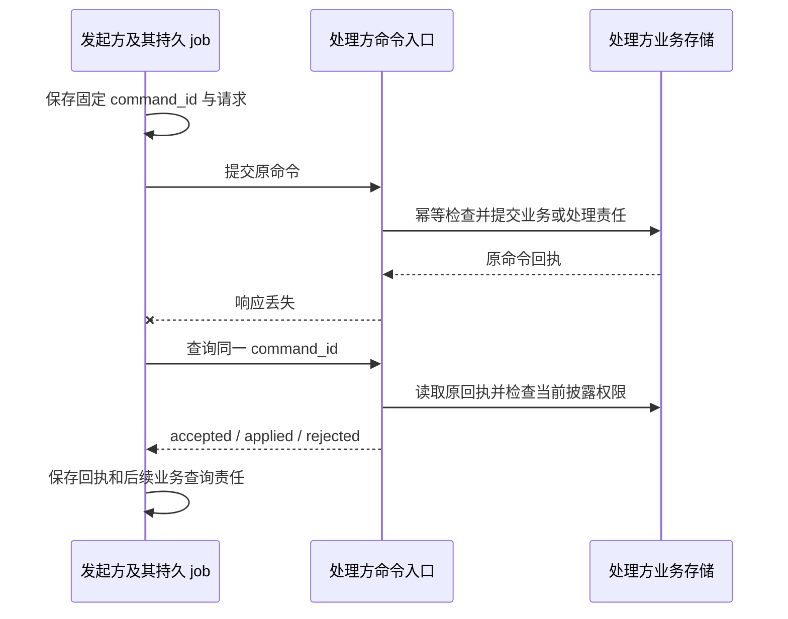

# 共同调用契约与跨端连接

[总览](../README.md) · [权限](../security/README.md) · [部署](../deployment.md)

本页定义独立实现共同遵守的调用语义。模块接口在同进程通过 Go interface 调用，独立服务间绑定到 gRPC，浏览器、CLI 和设备对云使用 WSS 双向长连接。这些绑定使用相同的业务输入、权限规则、持久成功点和错误；进程内不必先编码网络消息。跨端增加可查询回执，不能改变业务成功的含义。

共同协议版本为本目录设计的 `harness/1`，尚未发布。发布时同时冻结本文、启用的领域方法清单和字段定义；任意实现不得以另一份持续变化的文档解释已发布消息。

## 阅读与规范层次

本文规定共同调用行为，所属模块规定业务状态、成功边界和恢复责任；[线格式与方法注册](protocol.md)集中定义已纳入草案 profile 的精确字段、请求／响应映射及机器资产。未纳入该范围的方法保留为设计接口，不能仅凭正文名称声明已经支持线协议。

共同信封、字段约束、权限、成功含义和可观察异常行为属于实现必须遵守的规范。本文及模块中明确标为“默认”“参考”“初始待测”的存储组织、调度算法与参数是参考实现选择；替换时仍须提供相同外部保证及运行证据。Schema 约束结构，关联校验约束同一组调用的身份与版本；两者都不能证明权限实际生效或事务持久化。

一个字段的业务含义归所属模块，线格式的类型和必填性归同版 Schema；二者冲突时该草案组合不能发布，不允许实现自行挑选更宽松的一方。安装和发布清单同时固定这些文档、资产和递归引用的版本及摘要，避免正文更新改变未决命令的解释。

实现一个方法时，先读本页共同语义，再从[方法索引](methods.md)找到输入／输出定义及所属模块；准确字段查[Schema](schemas/protocol.schema.json)，种类、目标、错误与恢复动作查[方法登记](schemas/methods.json)，跨调用关系查[协议序列](examples/protocol/README.md)。[线格式说明](protocol.md)定义这些资产的组合方式；[validation](../validation/README.md)区分静态校验和运行验收，模块内部机制仍在所属实现篇。

## 1. 从持久命令而非连接恢复

一个调用者提交“保存报告”后连接断开。恢复所需的是原调用是否被接受、原文件操作是否发生，而不是旧连接第几条消息被接收。默认方案因此采用命令去重、原记录查询和状态修订；事件流只让查询更及时。

| 回执 `stage` | 精确定义 | 调用方继续做什么 |
| --- | --- | --- |
| `accepted` | 请求及处理责任已持久化，尚无最终业务决定 | 沿同一 command_id 查询，不再创造另一项相同业务 |
| `applied` | 该方法定义的业务决定及后续责任已持久保存 | 按方法检查资源、远端接纳、效果或逐节点结果；不把 applied 一概当任务成功 |
| `rejected` | 已确定拒绝，该命令不再启动目标行为 | 按错误调整前提；改参数须使用新命令，原拒绝记录不改写 |

例如 task.submit 的 applied 表示创建任务；execution.invoke 的 applied 表示接受原操作并承担执行责任；task.cancel 的 applied 表示 Orchestrator 保存取消决定。三者均不表示外部系统已结束。若入口尚未持久化便不可用，返回传输级错误，不伪造 accepted。

## 2. 标识、命令和查询

所有业务 ID 使用带类型前缀的至少 128 位随机标识，大小写敏感，作为不透明字符串处理。标识不是权限凭证。tenant_id 从认证会话取得，不接受请求正文任意指定租户；跨端委派身份由[安全契约](../security/README.md)验证。

| 对象 | 权威字段与规则 |
| --- | --- |
| Command | `command_id, method, target_id, expires_at, expected_revision?, payload`；method 为领域定义的小写 `domain.action`；expires_at 是首次接纳截止，不是业务执行截止 |
| Receipt | `command_id, stage, resource_id?, revision?, output?, error?, accepted_at?, decided_at?`；终结决定固定；查询披露可按当前权限裁剪，并标明 redacted |
| Query | `method, target_id, payload`；仅注册为读方法的调用可走此入口，无命令持久接纳含义 |
| QueryResult | `output, observed_at, resource_revision?, cursor?, gaps?`；数据来自对应负责方，缺口明确返回 |
| Error | `code, message, retry, related_id?, current_revision?, retry_after_ms?`；retry 为 none/same_command/after_change/query_original；message 可本地化，代码不可自由替换 |
| ComponentRef | `id, version, digest`；version 用于兼容协商，digest 绑定实际不可变实现或配置 |
| Change | `cursor, object_type, object_id, revision`；只表示对象可能变化，不携带执行许可、不确认效果 |

内容引用由[记忆与内容](../memory/README.md)定义；Task／Result 在[Orchestrator](../orchestrator/README.md#records)，许可在[授权](../security/README.md)。金额用带单位的整数或十进制字符串，不用浮点数比较额度。时间采用带 UTC 时区的 RFC 3339 字符串；跨端排序以对象修订为准，不以墙上时间决定先后。

费用模式、原使用结算与跨 Orchestrator 分配属于[授权](../security/README.md)和[任务预算](../orchestrator/README.md#budget)。终态后账单交回的 `task.billing_reconcile` 输入及特殊恢复规则见[领域关联](protocol.md#3-领域关联及正文类型)，共同命令语义仍按下文执行。

幂等键为 `(tenant_id, logical_service_id, command_id)`，处理方同时保存 method、target_id、expected_revision、expires_at 和 payload 的规范化摘要。原键原请求返回原决定，原键不同请求返回 idempotency_conflict 且不覆盖原记录。规范化比较按 JSON 结构进行：对象键顺序忽略、数组顺序保留、字符串逐字匹配；不以重新编码后的原始字节比较。SDK 固定同一请求结构，不在恢复时补写新的默认值。

该键**不跨逻辑服务去重**。新任务由受信装配／发现选定 Orchestrator，调用方在首次发送前保存目标与原命令；答复未知时只能查或重投原服务，不能仅保留同一个 command_id 就改投新分区。网关与应用对照原逻辑服务检查目标，详见[发现与路由](transport.md#1-连接与发现)。

接纳前检查 expires_at；过期且没有原回执时拒绝。已接纳的命令到期后仍须继续查询和处理，执行期限由领域记录决定。完整回执至少保留至命令截止且全部责任结清，再加部署声明的查询保留期；最小命令去重、操作取消和任务终结依据长期保留。查询保留期只决定完整内容能否继续返回，不使原身份重新可用。

完整回执已清理时，最小关闭记录仍保存租户、原负责服务、对象身份、原请求摘要及决定类型。原命令同输入重投或查询返回 `gone`，不同输入返回 `idempotency_conflict`，均不再次调用业务处理器；没有记录才可在当前有效范围内返回 `not_found`。`gone` 是查询／传输错误，不能伪造一份将原 applied 改为 rejected 的新业务回执。取消和任务终结关闭索引拒绝任何新启动；只有任务级永久关闭依据仍能覆盖原操作时才合并索引，不按固定 TTL 删除最后一份依据。

关闭索引不保存原始参数、正文、凭据和完整成果；这些材料按各自许可与保留策略清理。未知效果、未结费用、未完成传播或清理仍保存足以继续处理的获准事实。长期最小索引计入容量与备份，存储不足时关闭新接纳，不能清空旧责任换取空间。该选择及可回收身份协议的替代条件见[决策 D-11](../decisions.md#retained-identities)。

expected_revision 是条件更新，冲突时原命令被拒绝，调用方读取当前对象后决定是否生成新命令。成功条件提交不能把数据库重试误当成可以重做外部动作；事务中不执行网络或工具调用。

## 3. 进程内、端云与服务间绑定

| 边界 | 绑定与对象 | 成立条件 |
| --- | --- | --- |
| 同进程模块 | Go interface，直接传递领域对象 | 需要共同提交的步骤共享明确事务句柄；不为接口对称增加网络 |
| 浏览器／CLI／设备 ↔ 云 | `WSS /v1/connect`，Frame 内承载 Command、Query、原回执查询、Reply 和推送 | 客户端主动建立双向连接，服务端可主动发 Delivery、MirrorTicket 和 Change；完整帧及限额归[WSS 契约](transport.md) |
| Harness 独立服务 ↔ 服务 | gRPC `Call`／`EndpointChannel`，Protobuf 外壳内携带严格 JSON | 原 logical_service_id 固定；认证、deadline、oneof、方法映射及错误归[gRPC 绑定](grpc.md) |
| 发现／认证 | HTTPS 发现与登录／配对引导 | 发现公开部分不披露租户；端点取得当前凭据后才能打开一般业务连接 |
| 大内容 | HTTPS 原始字节上传／下载 | 字节不阻塞交互连接；上传／镜像预留、查询与控制经 WSS／gRPC 管理类型交接，当前用途和副本关闭责任仍成立 |

WSS 承载双向交互，Change 继续只表示对象可能变化；服务端推送不等于界面已呈现、业务已消费或操作已生效。协议本身不会使未定义的音视频、token delta 或渲染补丁自动成为受支持的方法。选择统一 WSS 的依据及代价见 [ADR-0002](../../adr/0002-go-wss-grpc.md)；WebSocket 提供双向通信机制，[RFC 6455](https://www.rfc-editor.org/rfc/rfc6455)不提供本项目的业务恢复保证。

浏览器使用同源 Secure／HttpOnly 会话、严格 Origin 和引导入口的 CSRF 防护；设备使用握手 bearer 凭据。服务间使用 mTLS 和受信的主体映射。每条业务消息、推送披露及缓存回复重传继续检查当前资格，localhost 或握手成功均不意味着持续授权。

### 设备投递与恢复

Orchestrator 保存原请求及持久发送责任，设备保存原决定和待交回 Reply；Orchestrator 保存回复及后续责任后才返回 ReplyAck。该确认只说明本次交回已保存，外部效果继续按原 operation_id 查询。三类投递、当前披露检查、ReplyAck 丢失和重连规则集中在[双向交付](transport.md#4-双向请求与主动交付)。

连接失效不取消业务。外 WSS 与内部流分别按[连接与发现](transport.md#1-连接与发现)和[gRPC 重绑](grpc.md#channel-rebind)恢复，业务仍沿原命令与对象查询；连接序号和绑定代次不能取得业务裁决权。生产路由、在线额度与实例租约归[生产连接机制](../deployment-production.md#connections)。

### 通知与快照

Change 提示客户端重新读取当前对象，不携带执行许可或成功决定。先订阅再枚举、分页期间合并提示、权限变化及缺口后的有限重建，统一按[集合恢复](protocol.md#collection-snapshots)和[订阅帧规则](transport.md#6-变化订阅快照与错误)执行。提示丢失不解除任何业务 owner 的持久恢复责任。

## 4. 共同错误与调用方动作

| code | 含义 | 调用方动作 |
| --- | --- | --- |
| invalid_argument | 请求不符合已协商字段或参数约束 | 修正参数，新 command |
| unsupported | 方法、版本或必要能力不受支持 | 选择兼容实现或停止该功能；不隐式降级权限 |
| unauthenticated / forbidden | 身份无效或当前用途不获准 | 重新认证或走明确授权；不能循环调用模型解决 |
| confirmation_required | 策略要求准确范围的用户确认 | 创建受信确认请求，取得许可后继续 |
| revision_conflict | 对象已变化 | 读取当前状态，重新决定，不能覆写 expected_revision 后盲发 |
| idempotency_conflict | 同命令 ID 对应不同输入 | 查询原记录并修正调用者，不能覆盖 |
| expired | 首次接纳或业务资格超过有效期 | 原请求先查询；新的资格只能用于另一个明确操作 |
| not_found | 当前有权范围内没有此记录 | 不证明外部效果未发生；原请求不明时继续核对 |
| gone | 原查询依据超过声明保留范围 | 显示恢复缺口，禁止自动重做不可重复效果 |
| quota_exceeded / overloaded | 额度不足或接纳容量不足 | 在明示期限内等待、调额或改计划；不丢弃已接受责任 |
| dependency_unavailable | 必需负责方暂不可达 | 保存等待及原身份，按有限退避继续 |
| effect_unknown | 原动作效果不能确定 | 查询／核对原 operation，必要时受信处置 |
| precondition_failed | 当前业务状态不允许该动作 | 读取关联对象并按模块规则处理 |
| internal_error | 服务未能提供约定处理结果 | 若可能提交，先查询原命令；不得据 5xx 推断未应用 |

错误中的 retry 是可执行建议，不能扩大业务重试权。传输超时不产生业务 rejected；调用方保留原不确定性。所属领域还可定义已在冻结方法清单中声明的错误码，如大脑的 invalid_output；同样必须提供本页 Error 结构及可执行后续行为。客户端不认识领域码时展示缺口并查询原记录，不能把未知错误解释为可安全重做。

## 5. 领域接口的权威位置

| 领域 | 方法与字段的定义位置 | 独立实现必须提供 |
| --- | --- | --- |
| task / budget | [任务编排器](../orchestrator/README.md#records)及[额度](../orchestrator/README.md#budget) | 持久接纳、条件控制、状态／结果查询、额度责任 |
| brain | [大脑](../brain/README.md) | 单轮快照输入、五类提案、原决策与费用恢复 |
| capability / execution / resource | [能力与执行](../execution/README.md) | 精确声明、原操作效果、可核对性、设备控制 |
| grant / endpoint | [授权与身份](../security/README.md) | 配对、许可、使用去重、撤回及有限离线 |
| memory / content | [记忆与内容](../memory/README.md) | 来源、精确修订、获准读写、同步与清理 |
| collaboration | [Agent 协作](../collaboration/README.md) | 子任务映射、控制、结果与最终结算 |
| interaction | [应用交互](../interaction/README.md) | 独立界面、输入消费、呈现与恢复 |
| extensions / evaluation | [扩展](../extensions/README.md)、[评测改进](../evaluation/README.md) | 安装和激活事实、报告及批准、监测与撤回 |

主版本不兼容时拒绝；新增可选字段可在同主版本内演进，但未知方法、未知枚举或影响权限／成功的字段必须拒绝，不能忽略。请求正文固定版本不变，重试不能自动升级解释。插件锁定每个依赖的版本及摘要；退回旧实现仍须能读取并承担旧操作。

## 6. 一致性验证边界

最小跨端用例为同命令重复、同键不同参数、提交后断线、回应转交丢失、旧修订竞争、事件乱序／游标过期、权限撤回及接纳过载。每例同时检查发起方 job、处理方原回执和领域状态，不能只检查网络返回。

[线格式与关联用例](protocol.md)验证已冻结方法的精确结构、回执阶段、原命令与业务对象关联；[完成判断示例](examples/README.md)另验证完成依据与未知效果的状态投影。两组检查分别报告覆盖，未纳入 profile 的方法不能借其他方法通过宣称符合。SDK、认证、原子提交、异构互操作及运行故障仍按[系统验收](../validation/README.md)取得独立证据。
