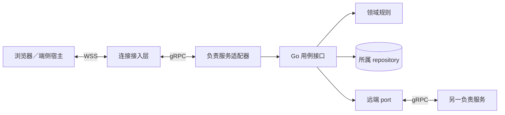
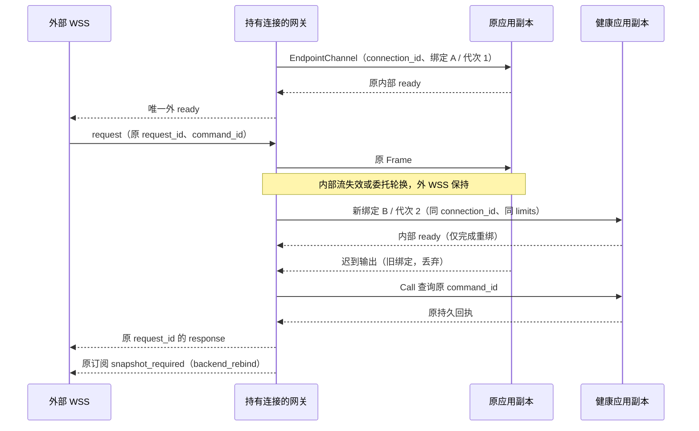
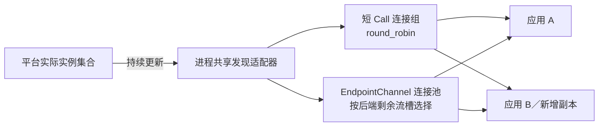

# 服务间 gRPC 绑定

[共同语义](README.md) · [端云 WSS](transport.md) · [Protobuf 定义](harness.proto) · [生产部署](../deployment-production.md)

本页固定未发布的 `harness-grpc-draft-1`：Harness 服务跨进程使用 gRPC over HTTP/2 + TLS，同进程使用 Go interface；需要共同事务的组件继续传递同一事务句柄。端侧宿主、CLI 和浏览器对云建立 WSS，连接接入层再向负责服务发起 gRPC。模型供应商、第三方工具、数据库和对象存储沿用自身协议。

## 1. 服务与代码边界

图表示调用适配和依赖方向，不表示每个框单独部署。gRPC handler 负责有界解码、认证与业务分派，领域规则不依赖生成的 RPC stub。调用者通过 port 使用原逻辑服务，解析器只选择该服务的健康副本，不改写 Orchestrator、owner 或业务目标。

| RPC | 输入与输出 | 使用范围 |
| --- | --- | --- |
| `HarnessService.Call` | `CallRequest` → `CallResponse` | 模块间命令、查询、原回执查询及内容传输管理；接纳后较长工作由原 job 推进，不让 RPC 一直等待任务结束 |
| `HarnessService.EndpointChannel` | 双向 `ChannelFrame` 流 | 内部接入层与负责服务间转交已认证端云会话的请求、回复、Delivery 和通知；设备外连仍是 WSS |

每条外部 WSS 对应一个当前 EndpointChannel；网关创建并持有外部 connection_id、request_id 等待及订阅状态，负责服务持有业务事实。更换内部绑定只更新 binding_id 与 binding_revision，不要求关闭健康外连接。每条 WSS 最多同时有一个当前流和一个候选重绑流，多个流复用有界 HTTP/2 连接池；不会建立另一套端云推送协议。连接、在线路由和进程租约的配合见[生产连接机制](../deployment-production.md#connections)。

### 1.1 内部绑定与外连接分别恢复

EndpointChannel metadata 除第 3 节的身份头外，必须携带下表字段。`ChannelBinding` 是这些 metadata 解码后的严格投影，字段归[传输 Schema](schemas/transport.schema.json)；它不是新增业务方法。

| metadata | 精确含义 |
| --- | --- |
| harness-logical-service-id | 原负责服务，不能因选到健康副本而改写 |
| harness-connection-id | 网关生成的当前外 WSS 身份；内部重绑保持不变 |
| harness-binding-id | 每个内部候选绑定的新随机身份；同一候选重试保持不变，同时出现在该流每个 ChannelFrame.binding_id |
| harness-binding-revision | 当前外 connection_id 内从 1 递增的安全正整数，以无前导零的十进制编码；每个新候选加 1，同候选重试保持原值 |
| harness-limits-bin | 原有效 ConnectionLimits 的 JCS UTF-8 字节；首次按受信发现配置，重绑必须完全保留 |
| harness-limits-digest | 上一字段对应对象的 JCS SHA-256，采用 `sha256:` 加 64 位小写十六进制 |

拒绝缺失、重复字段、错误摘要或无法支持原 limits 的绑定；身份及绑定 metadata 解码后总额最多 16 KiB，其中 limits 字节最多 4 KiB。副本不能静默降低限额后继续原 WSS。服务以 metadata 中的 connection_id 返回内部 ready，精确回显原 logical_service_id 和 limits；网关验证完整绑定后才设为当前流。第一次内部 ready 可形成唯一外 ready，后续内部 ready 只完成重绑，绝不再次发给端。

服务分区对 connection_id 的登记在原子条件更新中比较 binding_revision：仅更高代次可以替换；同代次须 binding_id、原服务、外连接和 limits 完全相同，才是幂等重试；同代异 ID 冲突，低代拒绝。网关分配候选后固定完整登记请求，提交未知时可重试同候选或另建更高代次候选，不能由迟到旧请求读取新记录后改写自己的代次或预期条件。即使 b2 的登记结果未知、b3 已就绪，迟到 b2 也不能覆盖 b3。在线进程租约失效可以使路由不可发送，但外连接 slot 仍存活时保留已见最高代次，防止删行后旧登记重新插入；详情见生产连接机制。代次只属于这一条存活 WSS，不是领域 owner 代次或跨连接全局序号；安全整数耗尽时有界排空并关闭外连接。

同候选重试只重试该候选流的登记，网关与应用进程 boot 身份也须保持原值；更换 RPC 流或应用进程 boot 须分配新的 binding_id 并使 binding_revision 加 1。同代登记不能变更投递路由，网关验证输出时同时核对当前流对象与 binding_id，防止把另一条流当作幂等登记的延续。

候选成功登记并通过内部 Ready 校验后，网关在内存中原子切换当前 binding_id，仅接收当前绑定输出；隔离旧流不证明旧服务尚未处理命令或已经停止。旧处理结果可能已经持久化，原业务唯一键、修订及执行门禁继续裁决。关闭旧流或释放在线绑定必须条件匹配原网关进程、应用进程、binding_id 与 binding_revision，不能由迟到清理删除新绑定；具体记录归生产部署。

内部流失败后，网关不把新普通请求无界排队；直接返回 dependency_unavailable。先前已发送的请求保留原外 request_id，在首次收到请求起 5 秒总期限内按下表恢复；重绑与查询不能重置期限。后端短暂不可用时外心跳由网关继续承担，连续 60 秒仍未建立可用绑定则关闭外 WSS；原身份和网关进程租约必须仍有效，任一更早失效时先停止业务与披露。只有内部故障允许这段保活窗口，原身份撤销／过期仍立即停止新请求和披露并关闭。

| 原等待 | 重绑后的动作 |
| --- | --- |
| command | 以原 command_id 调用原负责服务的 receipt_lookup；找到后封装为原 request_id 的 response。未确定时返回 retry=query_original 的 Error，不自动重新发起写命令 |
| query／receipt_lookup／upload_lookup／mirror_lookup | 在剩余总期限内有限重读，外 request_id 与输入保持不变；不新增外请求计数 |
| upload_reserve／mirror_reserve／mirror_control | 查原 upload_id／ticket_id 及控制修订；只在能核对原不可变输入和目标状态时确认，否则返回可恢复 Error，由调用者按原管理身份继续 |
| 未确认 Reply | 保留或重交原 Reply，原 owner 返回同 ReplyAck；设备在未收到 Ack 时仍承担原回复保留责任 |
| subscribe 尚未答复 | 在剩余期限内按原输入重建该次订阅，答复仍关联原 request_id；旧流的迟到订阅输出被隔离 |
| 已建立订阅 | 网关向端仍认识的 subscription_id 发 backend_rebind 缺口并暂停旧订阅，由端无 cursor 重订阅；不声称流切换后变化连续 |

内部流重绑不新增外连接槽、不清零累计请求数，也不重复计入某个未决 request_id。网关丢失时外 WSS 会断开，客户端沿原命令、Reply 和订阅快照恢复；不持久化整条 socket 会话来模拟无感迁移。

### 1.2 实际地址发现与连接分配

默认由客户端直连平台登记的应用实例地址。受信装配先把原 logical_service_id 解析到部署后端集合，再由进程共享的发现适配器取得实例身份、实际 IP／端口、就绪及排空状态；同一后端集合只维护一份 watch 和缓存。Kubernetes 装配使用受限身份读取对应 Service 的 EndpointSlice，合并全部 slice、按实例去重，只把 ready 且非 terminating 的目标纳入新调用；其他托管平台须提供等价接口。地址不是业务权威，连接仍核验 mTLS 服务身份及每次请求的准确逻辑服务。[EndpointSlice](https://kubernetes.io/docs/concepts/services-networking/endpoint-slices/)

发现采用“完整 LIST＋从返回资源版本开始 watch”：以最长 20 秒的抖动间隔重新 LIST，单次最多 5 秒；成功快照从该次 LIST 发起时起最多有效 30 秒，持续 TCP、旧 watch 事件或本地重试都不刷新这个期限。每轮新快照及 watch 使用本地新代次，原子替换后丢弃旧 watch 输出；断流或版本失效提前发起有限重列举。超过 30 秒仍未取得新快照就停止该集合的新拨号／新流，即使旧 watch 看似未断；期限使用 ClockAdapter 的可信经过时间。地址新增即时成为候选，地址删除／排空立即停止新分配，已有流按原租约和排空规则继续。缓存有效期间的调用仍受连接状态、目标准入及原 deadline 约束，空集合不能替换成任意 VIP。使用标准 gRPC resolver 接口推送变化，配置摘要随安装锁固定；不依赖一次 DNS 解析或默认 `pick_first` 偶然分流。[名称解析](https://grpc.io/docs/guides/custom-name-resolution/)、[负载策略](https://grpc.io/docs/guides/service-config/)

图只表示新 RPC 的选址。每个 ClientConn 是可复用的逻辑连接管理器，可能管理多个底层连接，不能与一条物理 HTTP/2 连接等同；不按请求、租户或每条 WSS 新建一个 ClientConn。[grpc-go ClientConn](https://pkg.go.dev/google.golang.org/grpc#ClientConn)

| 流量 | 连接和选择规则 | 满额、退出与恢复 |
| --- | --- | --- |
| 短 Call | 按后端集合、调用方 mTLS 配置和预算类别复用 ClientConn，显式配置 `round_robin`；控制／核对与普通工作分连接组和并发槽 | 调用前取得本类有限槽；无健康目标或槽满时有界失败，不启用无限 wait-for-ready。地址变化影响后续调用，已发命令仍先查原回执 |
| EndpointChannel | 每个具体后端维持有上限的专用 ClientConn 池；在健康、未排空且有本地槽的后端中选本调用进程活动流占比最低者，平局随机，再取得池成员流槽 | 服务端原子检查自身全局活动流上限，满额在登记新绑定前拒绝；本地估计不替代全局上限。流退出释放本地槽，候选也占槽 |
| 移除目标／进程退出 | 新分配先停，连接组保持原在途调用至有界排空；长流沿 §1.1 建立新 binding | 发现摘除、round_robin 和新增副本均不迁移已有流；只有正常轮换、受控排空或故障重绑移动它们。空闲池成员退出，进程关闭时统一 Close |

流槽 S 由安装配置限制，不能超过已验收的单物理连接并发流上限；每后端池成员数 K、每进程后端数 B 及全部物理连接另设硬上限。正常连接预算至少核对 `B×K`，还须计入短 Call 连接组、重连时旧连接排空与新连接的重叠。某后端当前承接 C 条长流时，正常池容量须满足 `K×S≥C`，候选重绑使用另外保留的有限流槽；服务端全局流上限同时覆盖所有网关及候选。不同 ClientConn 是否形成独立底层连接及协商后的实际流数必须实测，不能靠增加逻辑句柄虚增容量。长流达到 HTTP/2 流上限会使新 RPC 在库内等待，因此短 Call 使用独立连接组，建候选的等待也受显式期限约束。[gRPC 连接与流容量](https://grpc.io/docs/guides/performance/)

每轮重绑初始最多顺序尝试 3 个不同健康后端，每个候选等待内部 Ready 的独立计时器最多 2 秒且不超过剩余恢复窗口；只有一个可用后端时一轮只试一次。该计时器在 Ready 校验通过时停止，不设为 EndpointChannel 的 2 秒 RPC deadline；就绪流仍受原最长 30 分钟及更早委托／身份期限限制。拒绝、握手失败或超时后先取消该候选，确认流退出并释放槽，再有限退避，后端短暂冷却，不能同时向多个实例竞速登记。每个新 RPC 流使用新 binding_id／更高 binding_revision；登记结果未知仍按 §1.1 处理。轮间采用带抖动的退避，整个过程不超过原 60 秒窗口，且受网关级建流速率和并发预算约束；仍未就绪则关闭外 WSS。首次 WSS 从网关接收握手到发出首个 Ready 初始总期限为 10 秒，覆盖认证、占额和首次内部绑定，失败按原连接条件释放额度；不能借重绑窗口延长握手。原业务请求的 5 秒期限也不随候选改变。

该选择由宿主连接适配器承担 watch、池限额和候选失败处理的复杂度，并将共享发现的定期 LIST 计入平台 API 预算；复用平台服务发现，不另引入 mesh。若已有可验收的 L7 gRPC 代理，可替换该适配器，但仍须证明新流分配、单区余量、排空与身份透传；仅返回一个 L4 VIP 不满足本节默认发现条件。扩容只改善新分配，现有长流的收敛速度受 30 分钟正常轮换及有界主动排空限制，不承诺瞬时均衡。

## 2. Protobuf 与领域字段的权威

[harness.proto](harness.proto) 定义 RPC 外壳，`bytes` 中放 UTF-8 严格 JSON。Command、Query、Receipt、QueryResult 和 Error 继续由[领域 Schema](schemas/protocol.schema.json)及[方法登记](schemas/methods.json)裁决；Lookup、Frame 由[传输 Schema](schemas/transport.schema.json)裁决。这样不用为领域方法维护两套可漂移的字段定义，代价是仍需 JSON 解码与运行时校验，不能声称已经具备逐方法 Protobuf 强类型或二进制压缩收益。只有测量表明编码成本主导时，才另定完整字段映射及兼容 profile。

| Protobuf 字段 | 内层对象及关联检查 |
| --- | --- |
| `CallRequest.logical_service_id` | 必需且为受信装配登记的原服务；服务端核对自身身份，不接收任意主机名或转发地址 |
| `command_json` | 完整 Command，按 method 的 command 输入定义校验 |
| `query_json` | 完整 Query，method 必须登记为 query |
| `receipt_lookup_json` | Lookup `{command_id}`，查询原服务、当前认证租户的原回执 |
| `upload_reserve_json`／`upload_lookup_json` | UploadIntent／`{upload_id}`，与 WSS 的 upload_reserve／upload_lookup 同义 |
| `mirror_reserve_json`／`mirror_lookup_json`／`mirror_control_json` | MirrorTicket／`{ticket_id}`／MirrorControl，复用 WSS 的同名传输管理 kind；控制保留原 control_id、ticket_id 和单调修订 |
| `receipt_json` | 原 Receipt，只回答 command 或 receipt_lookup，command_id 必须与原请求相同 |
| `query_result_json` | 原 QueryResult，只回答 query，output 按原 method 的输出定义校验 |
| `upload_json`／`mirror_json` | Upload／Mirror，只回答对应管理请求，原 upload_id／ticket_id 及引用绑定一致 |
| `error_json` | Error 本体，用于无法提供回执或查询结果；不创建伪业务 rejected |
| `ChannelFrame.frame_json`／`binding_id` | 完整 Frame 和该内部流绑定身份；binding_id 匹配 metadata，Frame.connection_id 匹配外连接，沿当前绑定及披露规则检查。ChannelFrameRecord 仅为该 Protobuf 解码后的 JSON 验证投影 |

Call 的请求与响应必须恰有一个非空 oneof 分支；ChannelFrame 的 frame_json 与 binding_id 均必需且非空，binding_id 符合公共随机身份格式。`bytes` 为空不等于合法 JSON。适配器限制外层消息为协商的 max_frame_bytes 加 8 KiB 封装余量（默认 1 MiB + 8 KiB），logical_service_id 最多 4 KiB；内部 Command／Query 为 256 KiB，Frame 及其他响应按协商的帧上限；同时限制解码深度及集合数量。解析前按冻结描述符拒绝未知字段、重复单值字段和多个 oneof 分支，不能依赖默认 Protobuf 解码的覆盖行为；这需要解码前的字段扫描或受控 codec，普通 handler 收到解码对象后已经无法证明原报文没有重复分支。随后严格 JSON 解码拒绝重复键、非法 Unicode 与非安全整数，再执行 Schema 和方法关联检查。

请求摘要、Delivery 证明和 JWS 继续对原 JSON 对象做 JCS。不要对 Protobuf 序列化字节计算业务身份摘要，也不经 `Struct` 的通用浮点数转换修订号。Protobuf 序列化不承诺规范字节表示，依据见[官方说明](https://protobuf.dev/programming-guides/serialization-not-canonical/)。包名和字段号随 profile 固定，安装锁包含 `.proto`、生成器、grpc-go、Protobuf runtime、Schema 和方法登记的精确版本及摘要。

## 3. 身份、截止与错误

服务网络采用 mTLS 认证调用进程，服务主体与接收服务范围由受信装配映射。每次 RPC 必须带 `harness-rpc-profile: harness-grpc-draft-1` 与 `harness-auth-mode: service|delegated`；服务端拒绝重复或未知身份头。Call 的目标由 logical_service_id 给出，EndpointChannel 的目标由 `harness-logical-service-id` metadata 给出，均核对本服务及凭据受众。

| 模式 | metadata 与受信记录 | 接收端构造主体的依据 |
| --- | --- | --- |
| service | `authorization: Bearer <服务令牌>`；令牌绑定 mTLS 调用服务及目标逻辑服务 | 服务身份和允许代表的 Orchestrator／usage owner 来自受信装配；不能构造受信人类会话 |
| delegated | `authorization: Bearer <委托令牌>`；仅登记的接入服务可提交 | 验证令牌绑定的 mTLS 接入服务、目标服务、原会话／端点及当前代次，然后还原原主体；接入层不是业务 actor |

`AuthContext.sender_service_id` 表示受信业务发送服务。service 模式从服务令牌及装配映射取得该业务身份；delegated 模式恢复原主体和已验证的原业务发送者（如有），直接用户／端点没有业务发送者时省略该字段。代理网关的 mTLS 身份只约束委托交接，不能覆盖 actor_id 或被填入 sender_service_id。持有者控制等入口据此区分业务服务 holder 与直接 holder，不能因为请求经网关转交而改变其持有归属。

委托采用不透明句柄方案，不透传浏览器 Cookie。接入层先验证 WSS 身份，再由受信 IdentityAdapter 核验原会话或端点凭据并签发至少 256 位随机的委托令牌。令牌校验记录固定：调用接入服务、audience=准确 logical_service_id、tenant、原主体、actor_kind、原 sender_service_id（仅确有受信业务发送者）、原 trusted_user_session_ref（仅人类会话）、端点实例／credential_generation（仅设备）、原会话或凭据引用及 expires_at。身份适配器从权威记录填这些值，不接受接入调用者自报 actor_kind 或人类确认资格；有效期不超过原凭据有效期和 30 分钟。

负责服务逐条消息通过受信身份存储核验委托记录及原会话／凭据的当前有效性，再生成 AuthContext；必要核验不可用时拒绝新工作与披露。委托句柄只用于认证，不取得新的 Grant、许可消费或 Confirmation。来源会话撤销／凭据代次变化立即使后续使用失败；只有内部委托接近到期时，网关才凭仍有效的原身份重新签发并重绑，令牌不进入业务表或通用日志。没有该签发与核验适配器的部署不能开放代理用户／设备入口；不会退化成接入层管理员身份。受信人类会话和每次用途检查仍沿[认证规则](transport.md#2-认证主体和有限配对入口)执行。

每次 Call 设置有限 deadline，并把剩余时间传给下游；初始同地域接纳／查询上限为 5 秒，实际值随方法和运行实验固定。数据库事务不覆盖网络等待。deadline 或客户端 context 取消只结束本次等待；已经提交的业务责任由宿主 job 生命周期继续，任务取消仍需原 `task.cancel` 等控制命令。相关机制见 [gRPC deadline](https://grpc.io/docs/guides/deadlines/) 与[取消](https://grpc.io/docs/guides/cancellation/)。

租约、委托及远端启动窗口的时间资格统一使用 [ClockAdapter](../deployment.md#clock-adapter)；宿主暂停或时钟信任改变不能延长旧委托和旧本地截止。内部 RPC 尝试与外部接口调用分别观测，重绑内的有限查询不重复计为外部调用；5 秒内未得到确定结果的接口调用不因后来查到原回执而改成成功，计量归[生产 SLO](../deployment-production.md#42-可用性与时延验收口径)。

| 可观察结果 | 调用方解释与恢复 |
| --- | --- |
| gRPC OK + Receipt | 按 stage 和方法成功点解释，accepted／applied 均不自动证明外部效果 |
| gRPC OK + Error | 按 Error.retry、原命令和当前前提处理；请求格式或业务拒绝不靠状态码猜测 |
| UNAUTHENTICATED／PERMISSION_DENIED | 认证入口无法建立当前身份／路由资格；业务已发送过仍保留原查询责任 |
| RESOURCE_EXHAUSTED／UNAVAILABLE／DEADLINE_EXCEEDED／CANCELLED | 传输或服务暂不能给出结果，可能已有提交；写命令先查原记录，只能沿原身份有限恢复 |
| 内部流结束或 GOAWAY | 网关保持外连接并受控重绑，查询原命令、重交原 Reply、给旧订阅明确缺口；超过恢复窗口才关闭外 WSS |

关闭应用配置的写 RPC retry／hedging；库仍可能做有限透明重试，所以服务端始终按原 command_id 去重。查询可在自身总 deadline 内有限退避，不自动把查询失败改写成 not_found。重试安全来自业务记录，不能从 gRPC 传输层推出。[gRPC 重试机制](https://grpc.io/docs/guides/retry/)

EndpointChannel 不使用单次 Call 的 5 秒期限：初始允许最长 30 分钟，内部委托期限也不超过 30 分钟。网关在到期前带抖动取得新委托、建立候选流，验证内部 ready 后切换并关闭旧绑定，外连接保持；至多一个候选，不能无界并行重试。原会话／凭据到期或撤销更早发生时立即停止新请求和披露并关闭外连接。单次请求的 5 秒总期限、内部恢复的 60 秒窗口和外连接 10000 个 request_id 的登记上限分别计量；均不能通过流轮换清零。内部轮换默认给已有订阅产生快照缺口：按 30 分钟均摊，20 万连接约产生 111 次／秒的内部重绑；订阅恢复按每连接活动订阅数扇出，每个订阅还涉及重新订阅、权限核验及有界快照查询。提前轮换和失败重试会继续增加负载，不能把 111 次重绑等同于 111 次后端请求。这项查询、授权和快照成本须计入[生产容量](../deployment-production.md#capacity)；只有测量证明收益后才另行设计连续订阅接续。所有流共享的连接故障计入内部恢复容量，网关故障才计入外部集中重连模型。HTTP/2 flow control 与 keepalive 不替代应用队列限额、当前资格或 ReplyAck；流写入成功只代表交给传输栈。[流控](https://grpc.io/docs/guides/flow-control/)、[keepalive](https://grpc.io/docs/guides/keepalive/)

## 4. 验证边界

`.proto` 编译只证明描述符有效。发布前还须核对 oneof／内层 JSON／方法登记的映射、Go 与另一语言的相同 JCS 摘要、未知字段与过大消息拒绝，以及 WSS → gRPC 转发后原身份和认证主体不变。当前构造向量检查绑定摘要、代次比较、同候选登记重试、迟到低代与同代冲突拒绝、旧绑定丢弃、内部 Ready 不二次外发、精确 limits、配额不重复占用及请求数上限；其认证、路由和计数前提均为显式夹具。调用提交后取消 RPC、丢失回复、断开 EndpointChannel、旧凭据保持连接和慢接收端的行为必须用实际服务验证；现有静态向量不提供这些运行证据。

发现与连接分配另执行 [PROD-18](../validation/fault-experiments.md#grpc-capacity)：保持原 HTTP/2 连接不动增加副本，核对新 Call／新 EndpointChannel 分布；再填满一个实例、使 watch 断流并排空另一实例，核对有限候选、旧流归属及控制 RPC 余量。时钟与统计分别由 PROD-17／19 验收，不由上述 Schema 向量推出。
