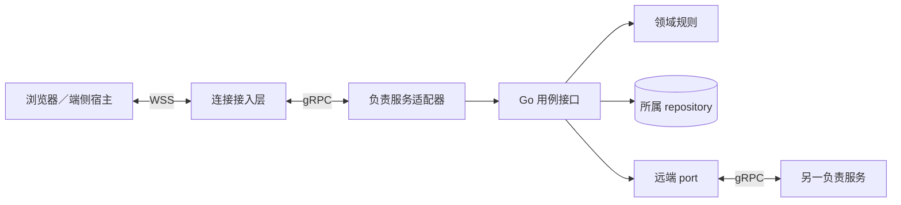

# 服务间 gRPC 绑定

[共同语义](README.md) · [端云 WSS](transport.md) · [Protobuf 定义](harness.proto) · [生产部署](../deployment-production.md)

本页固定未发布的 `harness-grpc-draft-1`：Harness 服务跨进程使用 gRPC over HTTP/2 + TLS，同进程使用 Go interface；需要共同事务的组件继续传递同一事务句柄。端侧宿主、CLI 和浏览器对云建立 WSS，连接接入层再向负责服务发起 gRPC。模型供应商、第三方工具、数据库和对象存储沿用自身协议。

## 1. 服务与代码边界

图表示调用适配和依赖方向，不表示每个框单独部署。gRPC handler 负责有界解码、认证与业务分派，领域规则不依赖生成的 RPC stub。调用者通过 port 使用原逻辑服务，解析器只选择该服务的健康副本，不改写 Home、owner 或业务目标。

| RPC | 输入与输出 | 使用范围 |
| --- | --- | --- |
| `HarnessService.Call` | `CallRequest` → `CallResponse` | 模块间命令、查询、原回执查询及内容传输管理；接纳后较长工作由原 job 推进，不让 RPC 一直等待任务结束 |
| `HarnessService.EndpointChannel` | 双向 `ChannelFrame` 流 | 内部接入层与负责服务间转交已认证端云会话的请求、回复、Delivery 和通知；设备外连仍是 WSS |

一个 EndpointChannel 绑定一个端云连接和一个原逻辑服务；`harness-logical-service-id` metadata 固定该服务，服务端先发 `ready`。接入层保持 Frame 内容及 connection_id，不在重连时复制旧连接的 request_id 关联；原业务身份不变。初始实现为每条端云连接建立一个内部流，多个流可复用 HTTP/2 连接；这避免自建多租户复用协议，代价是活跃流数量随连接数增长。流上限、连接池及分区容量须按[生产连接预算](../deployment-production.md#connections)验证。

## 2. Protobuf 与领域字段的权威

[harness.proto](harness.proto) 定义 RPC 外壳，`bytes` 中放 UTF-8 严格 JSON。Command、Query、Receipt、QueryResult 和 Error 继续由[领域 Schema](schemas/protocol.schema.json)及[方法登记](schemas/methods.json)裁决；Lookup、Frame 由[传输 Schema](schemas/transport.schema.json)裁决。这样不用为 101 个方法维护两套可漂移的字段定义，代价是仍需 JSON 解码与运行时校验，不能声称已经具备逐方法 Protobuf 强类型或二进制压缩收益。只有测量表明编码成本主导时，才另定完整字段映射及兼容 profile。

| Protobuf 字段 | 内层对象及关联检查 |
| --- | --- |
| `CallRequest.logical_service_id` | 必需且为受信装配登记的原服务；服务端核对自身身份，不接收任意主机名或转发地址 |
| `command_json` | 完整 Command，按 method 的 command 输入定义校验 |
| `query_json` | 完整 Query，method 必须登记为 query |
| `receipt_lookup_json` | Lookup `{command_id}`，查询原服务、当前认证租户的原回执 |
| `upload_reserve_json`／`upload_lookup_json` | UploadIntent／`{upload_id}`，与 WSS 的 upload_reserve／upload_lookup 同义 |
| `mirror_reserve_json`／`mirror_lookup_json`／`mirror_control_json` | MirrorTicket／`{ticket_id}`／MirrorControl，复用 WSS 的同名传输管理 kind；控制保留原 control_id、ticket_id 和单调修订 |
| `receipt_json` | 原 Receipt，只回答 command 或 receipt_lookup，command_id 必须与原请求相同 |
| `query_result_json` | 原 QueryResult，只回答 query，output 按原 method 的输出定义校验 |
| `upload_json`／`mirror_json` | Upload／Mirror，只回答对应管理请求，原 upload_id／ticket_id 及引用绑定一致 |
| `error_json` | Error 本体，用于无法提供回执或查询结果；不创建伪业务 rejected |
| `ChannelFrame.frame_json` | 完整 Frame；沿 WSS 方向、关联、限额与当前披露规则逐帧检查 |

请求与响应必须恰有一个非空 oneof 分支；`bytes` 为空不等于合法 JSON。适配器限制外层消息为协商的 max_frame_bytes 加 8 KiB 封装余量（默认 1 MiB + 8 KiB），logical_service_id 最多 4 KiB；内部 Command／Query 为 256 KiB，Frame 及其他响应按协商的帧上限；同时限制解码深度及集合数量。解析前按冻结描述符拒绝未知字段、重复单值字段和多个 oneof 分支，不能依赖默认 Protobuf 解码的覆盖行为；这需要解码前的字段扫描或受控 codec，普通 handler 收到解码对象后已经无法证明原报文没有重复分支。随后严格 JSON 解码拒绝重复键、非法 Unicode 与非安全整数，再执行 Schema 和方法关联检查。

请求摘要、Delivery 证明和 JWS 继续对原 JSON 对象做 JCS。不要对 Protobuf 序列化字节计算业务身份摘要，也不经 `Struct` 的通用浮点数转换修订号。Protobuf 序列化不承诺规范字节表示，依据见[官方说明](https://protobuf.dev/programming-guides/serialization-not-canonical/)。包名和字段号随 profile 固定，安装锁包含 `.proto`、生成器、grpc-go、Protobuf runtime、Schema 和方法登记的精确版本及摘要。

## 3. 身份、截止与错误

服务网络采用 mTLS 认证调用进程，服务主体与接收服务范围由受信装配映射。每次 RPC 必须带 `harness-rpc-profile: harness-grpc-draft-1` 与 `harness-auth-mode: service|delegated`；服务端拒绝重复或未知身份头。Call 的目标由 logical_service_id 给出，EndpointChannel 的目标由 `harness-logical-service-id` metadata 给出，均核对本服务及凭据受众。

| 模式 | metadata 与受信记录 | 接收端构造主体的依据 |
| --- | --- | --- |
| service | `authorization: Bearer <服务令牌>`；令牌绑定 mTLS 调用服务及目标逻辑服务 | 服务身份和允许代表的 Home／usage owner 来自受信装配；不能构造受信人类会话 |
| delegated | `authorization: Bearer <委托令牌>`；仅登记的接入服务可提交 | 验证令牌绑定的 mTLS 接入服务、目标服务、原会话／端点及当前代次，然后还原原主体；接入层不是业务 actor |

委托采用不透明句柄方案，不透传浏览器 Cookie。接入层先验证 WSS 身份，再由受信 IdentityAdapter 核验原会话或端点凭据并签发至少 256 位随机的委托令牌。令牌校验记录固定：调用接入服务、audience=准确 logical_service_id、tenant、原主体、actor_kind、原 trusted_user_session_ref（仅人类会话）、端点实例／credential_generation（仅设备）、原会话或凭据引用及 expires_at。身份适配器从权威记录填这些值，不接受接入调用者自报 actor_kind 或人类确认资格；有效期不超过原凭据有效期和 30 分钟。

负责服务逐条消息通过受信身份存储核验委托记录及原会话／凭据的当前有效性，再生成 AuthContext；必要核验不可用时拒绝新工作与披露。委托句柄只用于认证，不取得新的 Grant、许可消费或 Confirmation。来源会话撤销／凭据代次变化立即使后续使用失败，重连重新签发，令牌不进入业务表或通用日志。没有该签发与核验适配器的部署不能开放代理用户／设备入口；不会退化成接入层管理员身份。受信人类会话和每次用途检查仍沿[认证规则](transport.md#2-认证主体和有限配对入口)执行。

每次 Call 设置有限 deadline，并把剩余时间传给下游；初始同地域接纳／查询上限为 5 秒，实际值随方法和运行实验固定。数据库事务不覆盖网络等待。deadline 或客户端 context 取消只结束本次等待；已经提交的业务责任由宿主 job 生命周期继续，任务取消仍需原 `task.cancel` 等控制命令。相关机制见 [gRPC deadline](https://grpc.io/docs/guides/deadlines/) 与[取消](https://grpc.io/docs/guides/cancellation/)。

| 可观察结果 | 调用方解释与恢复 |
| --- | --- |
| gRPC OK + Receipt | 按 stage 和方法成功点解释，accepted／applied 均不自动证明外部效果 |
| gRPC OK + Error | 按 Error.retry、原命令和当前前提处理；请求格式或业务拒绝不靠状态码猜测 |
| UNAUTHENTICATED／PERMISSION_DENIED | 认证入口无法建立当前身份／路由资格；业务已发送过仍保留原查询责任 |
| RESOURCE_EXHAUSTED／UNAVAILABLE／DEADLINE_EXCEEDED／CANCELLED | 传输或服务暂不能给出结果，可能已有提交；写命令先查原记录，只能沿原身份有限恢复 |
| 流结束或 GOAWAY | 重建通道后查询原命令、重交原 Reply、重建订阅；不重新创建操作或取消已接纳任务 |

关闭应用配置的写 RPC retry／hedging；库仍可能做有限透明重试，所以服务端始终按原 command_id 去重。查询可在自身总 deadline 内有限退避，不自动把查询失败改写成 not_found。重试安全来自业务记录，不能从 gRPC 传输层推出。[gRPC 重试机制](https://grpc.io/docs/guides/retry/)

EndpointChannel 不使用单次 Call 的 5 秒期限：初始允许最长 30 分钟，到期前逐步排空并随机重建，认证过期／撤销更早发生时立即停止新请求和披露。逐条请求仍有有界处理时限，所有流共享的连接故障须计入集中重连模型。HTTP/2 flow control 与 keepalive 不替代应用队列限额、当前资格或 ReplyAck；流写入成功只代表交给传输栈。[流控](https://grpc.io/docs/guides/flow-control/)、[keepalive](https://grpc.io/docs/guides/keepalive/)

## 4. 验证边界

`.proto` 编译只证明描述符有效。发布前还须核对 oneof／内层 JSON／方法登记的映射、Go 与另一语言的相同 JCS 摘要、未知字段与过大消息拒绝，以及 WSS → gRPC 转发后原身份和认证主体不变。调用提交后取消 RPC、丢失回复、断开 EndpointChannel、旧凭据保持连接和慢接收端的行为必须用实际服务验证；现有静态向量不提供这些运行证据。
