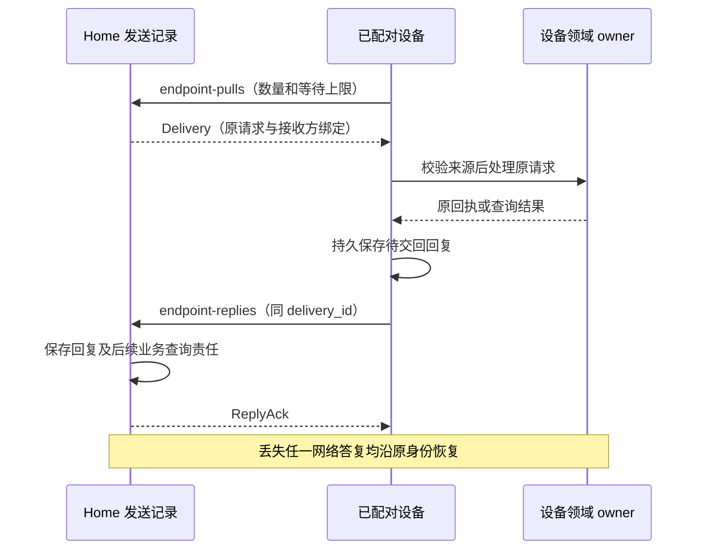

# 发现、认证与跨端交接

[共同语义](README.md) · [方法与字段](protocol.md) · [安全](../security/README.md) · [内容](../memory/README.md)

本页固定 `harness-http-draft-2` 基础传输配置。领域方法之外，独立实现还须理解发现、端点认证、设备主动取件和内容字节入口；否则无法从已配对端点建立一次完整跨端调用。SSE 是可选优化，关闭后仍须能凭原命令和业务查询恢复。本页是拟实现的互操作契约，结构用例与密码学测试向量不代表服务已经运行。

## 1. 连接与发现

调用方从用户或受信装配提供的 HTTPS 服务地址开始，验证服务器证书及主机名，不跟随跨源重定向转交凭据。`GET /.well-known/harness` 未认证时只返回协议名称、登录／配对能力和认证入口；已认证后返回下表的完整 Discovery。对未认证请求不披露租户、设备、内部路由或活动任务。

| 字段 | 含义与校验 |
| --- | --- |
| logical_service_id、protocol、profile | 固定负责服务；请求恢复仍指向此逻辑服务，不能因重定向重新创建业务 |
| schema_digest、methods_digest | 精确 Schema 和方法登记的 SHA-256；通过装配认可的资产取得，不执行任意远程 Schema |
| methods | 本服务实现的严格方法子集；每个方法须存在于对应登记，返回方法名不表示调用者有权限 |
| auth_profile、proof_profile | 本配置为 `opaque-bearer-1`、`home-jws-es256-1`，不宣称完整 OAuth 身份供应商互操作 |
| limits | JSON 字节、分页、取件数量、等待时间和内容字节上限；调用方取自身和服务声明的较小值 |
| retention | 完整回执查询秒数、长期最小关闭索引；未结责任不受普通回执清理期限支配 |
| changes_supported | 是否启用可选通知；不改变查询义务 |

发现字段的完整结构见 [transport.schema.json](schemas/transport.schema.json)。服务只能声明已安装并通过对应配置验证的方法，未知 profile、摘要或必要方法缺失时停止该集成。没有全局注册中心：装配保存逻辑服务及认证关系，跨 Home 的任务目录只聚合现有映射。

## 2. 认证主体和有限配对入口

网络认证采用 TLS 内的 `Authorization: Bearer <opaque-token>`。凭据至少来自 256 位密码学随机值，服务存令牌校验值及绑定信息，原文仅在安全凭据库和短期领取恢复记录中存在；不进入 URL、通用日志或领域对象。Bearer 的持有者可以使用其对应资格，因此认证仍须同时检查当前撤销与范围；传递方式依据 [RFC 6750 §2.1](https://www.rfc-editor.org/rfc/rfc6750#section-2.1)。这是项目选定的基础 profile，不要求访问令牌本身采用 JWT。

| 入口类型 | 凭据与每次检查 | 不能推导的权限 |
| --- | --- | --- |
| 本地 CLI／Web | 受控系统会话；Web 同源会话、Origin 与 CSRF 检查 | 任意本机网页不能自动成为用户 |
| 已配对端点 | 令牌绑定 tenant、endpoint、instance、credential_generation、到期与范围；每次查当前端点代次／撤销状态 | 设备认证不自动授予 Grant 或批准 |
| 服务间调用 | 受信装配绑定逻辑服务与主体，令牌只发给对应服务范围 | 网关转交不允许伪装原 Home |
| 配对 begin | 受限匿名入口，限流并生成短期会话 | 不带 tenant，不得调用一般方法 |
| 配对 claim | 原 pairing_id、私密设备码和设备 nonce；每次轮询用新命令，丢答复重投原命令 | 公开用户码不能领取凭据 |
| 配对 approve | 已认证用户在独立受信入口确认原请求 | 新端自报的批准字段没有效力 |

`endpoint.pair.begin` 与 `endpoint.pair.claim` 是命令路由的明确例外，使用限流的配对认证上下文；它们不接受调用方指定业务 tenant。领域序列夹具中的 `Exchange.auth` 是测试提供的已核验前提，不作为匿名请求的线字段。批准时才确定租户和范围，凭据实例资格由批准后的原会话产生。

尚未批准时，claim 的 `pending` 是该次命令的最终观察结果；后续轮询使用新 command_id，保持原 pairing_id、私密码及设备 nonce 不变，不能重放 pending 回执期待其变化。领取成功与原领取回执在同事务保存。回复丢失时，设备以原私密码及原命令恢复同一结果；不同命令不能生成第二份端点凭据。敏感回执只在安全领取窗口内保存可恢复密文，窗口结束返回 `gone` 并要求重新配对；最小关闭记录继续拒绝旧会话重新领取。已经持有的凭据是否有效按自己的期限与撤销决定，不由回执清理决定。

`AuthContext` 由认证适配器生成，不从请求正文反序列化：`sender_service_id` 来自服务凭据或已验证的 Delivery 发送方，接收端还须检查该服务是否有权代表对应 Home 或 usage owner。`actor_kind` 与 `trusted_user_session_ref` 来自当前用户／维护者会话；`confirmation.decide` 只允许受信的人类会话，服务令牌、模型产物及普通输入消息不能自报这两个字段完成批准。Confirmation 由原业务 owner 保存，并在原业务命令的事务中核验与消费，完整绑定见[安全实现](../security/implementation.md)。

令牌到期需受信重新认证，不通过请求正文延长。端点撤销增加代次，在线请求立即拒绝；已发出的有限离线资格仍遵守其明确窗口。新实例不得直接取得旧实例的未决操作或余额；旧工作始终从原领域账本恢复。云端登录供应商和操作系统密钥保存器为装配适配器，缺席时不开放远程入口。

## 3. Home 控制证明

仅用“从网关收到”无法证明暂停快照由原 Home 发出。Home 为 ControlSnapshot 的准确内容生成 JWS Compact，`home_proof` 保存完整串；端点验证已登记 Home 的签名及接收方绑定后，才应用 TaskGate。签名用于证明来源，不替代当前 Grant、设备占用或控制修订单调性。

本配置使用 JWS protected header `{alg:"ES256",typ:"harness-control+jws",kid}`，拒绝 `none`、其他算法、不认识的 header、消息自带 JWK 或取钥 URL。公钥必须来自事先配对／装配登记的原 Home 密钥集。编码与验证沿用 [RFC 7515](https://www.rfc-editor.org/rfc/rfc7515)，ES256 的 P-256、SHA-256 及固定宽度签名格式依据 [RFC 7518 §3.4](https://www.rfc-editor.org/rfc/rfc7518#section-3.4)。

| 签名载荷 | 约束 |
| --- | --- |
| issuer、tenant_id、audience | issuer 等于 gate.home_id；audience 为准确 executor_id；租户与认证上下文相同 |
| gate | 原 TaskGate 的完整对象，包括目标与控制修订；不能只签 task_id |
| issued_at、start_before | 与 ControlSnapshot 一致，构成非空有限窗口；有效窗口不得超过双方装配的控制上限 |

载荷按 [RFC 8785 JCS](https://www.rfc-editor.org/rfc/rfc8785)规范化后 UTF-8 编码；对象成员排序、数值与字符串编码共同固定摘要。拒绝重复键、不合法 Unicode、非有限数值和超出安全整数范围的整数字段；金额使用已有十进制字符串。本配置所有修订、计数和字节长度最多为 `9007199254740991`，不能经 JavaScript 舍入后再验证。JWS 签名输入为实际 protected-header 与 payload 的 base64url 编码，接收方不能先改内容再验证。

验证顺序为：有界解码和严格字段 → 已登记 kid 与算法 → 签名 → 对照实际快照完整内容／租户／接收方 → 时间与来源资格 → 领域门禁。过期证明仍可作为历史恢复证据，但不能启动新工作；原消息重放不延长窗口。接收端无法建立可信时间上界时关闭依赖远端窗口的新启动，纯本地共同事务的控制继续成立。

正常轮换先由既有受信关系登记新公钥，再切换签发；旧公钥保留到其证明均不可再用于启动并满足历史审计。发现密钥失信时禁用该 kid 的新使用，并沿当前控制通道传播；不因验证历史签名成功而忽略当前失信状态。公开的测试向量只验证编码、签名与绑定，真实密钥托管、轮换、撤销传播仍须运行验收。

## 4. 主动取件与三类回复

无入站地址的设备从受信 Home 主动拉取有界工作。持久发送责任在 Home，业务接纳和效果记录在处理端；取件、处理、回交和原效果查询分别保存，不增加跨领域全局序号。

Delivery 固定 `delivery_id, sender_service_id, recipient_endpoint_id, recipient_instance_id, request_digest, kind, request, deliver_before`。三类请求必须使用互斥结构：

| kind | request | reply.result | 持久与恢复 |
| --- | --- | --- | --- |
| command | 原 Command | Receipt 或 `{error: Error}` | 以原 command_id 在目标服务去重；Receipt accepted 只确认接纳，可继续查原决定 |
| query | 原 Query | QueryResult 或 `{error: Error}` | 没有 command_id；delivery_id 关联本次有界读取，不创造目标业务命令 |
| receipt_lookup | `{command_id}` | 原 Receipt 或 `{error: Error}` | 查询原命令；查询失败不生成该命令的 rejected 回执 |

`request_digest` 为 request 的 JCS SHA-256；发送方、目标、kind、原请求和截止首次保存后不变。同 delivery_id 不同内容冲突。设备未能提交原命令回执，或命中已清理的回执关闭索引时，以 `{error: Error}` 交回明确错误；Home 保存传输结果，但不能把它写成该业务命令的 rejected 或成功。可恢复错误按原 command_id 查询或有限重投，`gone` 保持原身份关闭并查询仍可读取的业务事实。若本次 Delivery 的错误回复已固定，需要重试处理时新建 Delivery，内含的原 Command 保持不变。重复 query delivery 在当前披露资格仍成立时返回设备已保存的该次读取快照；需要更新状态时 Home 新建 query delivery，业务对象身份不变。业务请求的接纳截止与 Delivery 的投递截止分别检查，外部执行 deadline 不由传输延长。

设备按当前凭据实例接收。跨端转交请求同时附由受信发送服务签名的 Delivery 证明，沿前节 ES256 配置，typ 改为 `harness-delivery+jws`，签名载荷为完整 Delivery（不含证明自身）；证明的发送方必须属于允许向本设备路由的服务。这样，即使中转不可信，也不能替换原请求或接收实例。查询只在当前数据许可下执行，历史签名不授予新的读取权。

`POST /v1/endpoint-pulls` 输入 `{max_items,wait_ms}`；tenant／端点／实例来自认证，不由正文指定。返回 `{deliveries,more}`，每条包含 `{delivery,delivery_proof}`；可选 `mirror_uploads` 携带下节的反向上传票据，两类条目合计不超过 max_items。满载可返回空集及退避，不能无界等待。优先交回原回复；取消、撤权及收尾预留通道份额，普通目标工作不能占尽空间。

`POST /v1/endpoint-replies` 输入 Reply，固定原 delivery_id、request_digest、kind 与业务 result。Home 核对预期设备实例、原请求和响应结构后，保存回复并创建后续领域查询 job，再返回 `{delivery_id,stored:true,result_digest}`。重复完全相同回复返回同确认；同 delivery_id 不同业务结果冲突。原 accepted 回执的后续变化通过新 receipt_lookup 获取，不能覆盖已确认的第一次回复。

缓存回复在首次发送和每次重传前均重查当前披露资格，包含 Query 快照和已裁剪的 Receipt。资格不足时，设备保留原结果事实，持久关闭该 Delivery 的内容交付，改发 `withheld:true` 及严格的 `{error:{code:"forbidden",message,retry:"after_change"}}`。此分支只关闭披露，不改写原业务决定；Home 将其作为单独的当前披露状态保存与确认，不当作不同业务结果冲突。Home 已知关闭后丢弃迟到完整回复的内容；资格以后恢复，也须新建 Delivery 执行当前查询或原命令查询。已经交付的字节不能召回，内容副本仍按原 owner 的关闭流程清理。

设备无需额外自造 command_id 来确认 Query。Home 收到查询 Error 仍保存本次查询完成及可重试原因；设备暂不可达呈现 `dependency_unavailable`，不可伪造 `not_found`。投递超时但可能被取走时先核对原 command；只读查询可新建 delivery 重试，副作用身份不得重建。

## 5. 大内容的临时字节与正式引用

JSON 命令上限不能容纳任意截图或文件。基础配置采用可幂等整份重传的临时上传；分块恢复是后续可选能力，默认不引入多段提交协议。上传空间按用户预留，超额或摘要不符明确拒绝，不将部分字节交给业务读取。

| 入口 | 字段／响应 | 成功与失败 |
| --- | --- | --- |
| `POST /v1/content/uploads` | `{upload_id,hash,byte_length,media_type,expires_at}` → Upload | 当前认证主体保存有界上传意图与空间预留；同ID不同元数据冲突 |
| `PUT /v1/content/uploads/{upload_id}` | 原始字节，Content-Length 与 Content-Type 匹配 → Upload | 临时写、校验摘要／长度、同步后原子就绪；丢回复查原上传，不追加字节 |
| `GET /v1/content/uploads/{upload_id}` | 无正文 → Upload | state 为 reserved／ready／committed／expired；不跨用户返回状态 |
| `POST /v1/commands` 的 content.put | upload_id、ContentRef、来源及策略 → 固定内容版本 | 只有 ready 且精确字节匹配才提交；内容引用和策略持久成功，不在JSON放正文 |
| `POST /v1/queries` 的 content.get | 精确内容、已登记副本与用途依据 → Download | 当前许可核对后发有限下载定位；不创建副本或新的业务消费责任 |
| `GET /v1/content/downloads/{download_id}` | 当前认证＋原下载定位 → 字节 | 每次复核主体、接收方、copy_id、来源、用途和期限；定位串本身不是独立权限 |

Upload 的 owner、tenant、主体绑定来自当前会话。重复 PUT 先完成有界接收及一致性检查，已 ready／committed 时只返回原元数据；内容不同拒绝。上传期限限制新字节和首次发布，已 committed 的正式引用不随临时上传过期而失效；正式保留由 ContentPolicy 管理。

content.put 先取得不可变耐久字节，再在业务事务中将 upload 从 ready 变为 committed，保存 ContentRef、来源图及策略。清理候选与新引用登记锁同一上传／内容元数据，防止孤儿清理删掉刚发布对象。崩溃后 ready 可由原命令继续；数据库提交结果未知时先查原回执，不能重新发布另一个版本。

基础下载 `range_supported=false`，不接受 Range；需要恢复时在仍获准的原引用上重新下载整份。响应携带 Content-Length、Content-Type 和绑定 hash 的强 ETag，客户端核对实际摘要与长度后才使用。响应开始前复核权限，并在流式发送中按有界块检查关闭状态；撤回不能召回已交付字节，已登记副本继续承担清理责任。不得把下载成功或 ETag 当作用户已预览确认。

下载定位可以短期缓存；缓存丢失由 content.get 重新取得，不能因此自动重新登记副本或放宽权限。临时上传清理保留最小 ID／摘要／终结状态，原 ID 重投不得覆盖已发布内容。期限或磁盘保护水位达到时停止新上传，为现有事务、清理和关闭记录预留容量。

### 5.1 无入站设备的反向副本

云 Home 读取设备截图或端侧记忆时，设备上的下载地址可能不可达。基础配置允许设备向已配对的取件服务主动上传只读镜像；原 ContentRef、内容 owner 和 copy_id 保持不变。接收方必须先取得原 owner 的 `content.register_copy` 结果及当前读取资格，再预留接收空间。它不能把镜像经 content.put 发布成自己拥有的新内容。

| 入口／记录 | 精确结构及约束 |
| --- | --- |
| `POST /v1/content/mirrors` | 输入 MirrorTicket，返回 Mirror；由接收端自身获准任务发起，receiver_service_id 必须为本服务，原 copy 的 holder 为本服务 |
| MirrorTicket | ticket_id、upload_id、receiver_service_id、sender_endpoint_id、sender_instance_id、content_ref、copy_id、source_control_revision、expires_at；所有字段首次保存后不变，不含任意 URL |
| `PullOutput.mirror_uploads` | 接收端只向票据绑定的已配对设备实例返回原票据；设备从当前受信连接确认 receiver_service_id，拒绝跳转到其他地址 |
| `PUT /v1/content/mirrors/{ticket_id}` | 原始字节；接收端验证设备与实例、票据期限、摘要／长度／类型，临时写和同步完成后将 Mirror 改为 ready |
| `GET /v1/content/mirrors/{ticket_id}` | 原 Mirror；供上传端查丢失回复，不凭另一个 ticket 重新发布或重置关闭状态 |
| `POST /v1/content/mirrors/{ticket_id}/control` | MirrorControl → Mirror；原 owner 的认证控制更新，绑定 control_id、content_ref、copy_id、control_revision 与 cause（restricted／closed） |
| Mirror | ticket、state（reserved／ready／closed／expired）、control_revision、retention_until、cleanup_state；后两项保留及控制信息由原 owner 的受信记录推进 |
| `GET /v1/content/mirrors/{ticket_id}/bytes?source_download_id=...` | 接收端凭自己经原 owner 当前 content.get 取得的记录读镜像；下载 ID 只定位该记录，不接受调用者自报授权结果 |

设备取得票据后再次检查原 copy、当前来源及披露资格，再以原 ticket 上传。接收方在分片写入期间检查本地关闭状态，完整校验后才开放读取；同票据重复 PUT 只能返回相同 ready 内容，不追加字节。上传中断时继续保留同票据的有限恢复责任，过期或关闭后删除临时字节；已 ready 的镜像不因上传期限结束自动失效，其保留及读取始终由原 copy 管理。

每次镜像读取先通过已定义的查询投递取得原 owner 当前 ContentGetOutput，再核对原引用、copy_id、下载截止及镜像已知的控制修订。接收端从该受信答复推进已知修订后才能使用；旧答复不得覆盖较新关闭事实。基础镜像配置不支持独立离线读，原 owner 不可达则停读，不从上传票据或旧定位推导新资格。读取响应和后续流检查沿用普通下载规则。已明确授权的离线副本是另行验收的能力，不能借本路径获得。

原 owner 在 content.close 或限制事务中保存逐镜像的控制发送责任，再向 `/control` 主动提交 MirrorControl。接收端从认证装配核对发起者确为 ContentRef.owner_id，不把 owner 的 content.close 直接路由给镜像端。控制按原 control_id 和请求摘要去重，旧修订不得覆盖新修订；较新修订、读取关闭、state=closed、清理 job 与回执同事务保存。这里 cause=restricted 也保守关闭整个镜像并清理，不在接收端维护另一套策略比较器；原新策略仍允许复制时，由调用方重新登记副本并取得新票据，代价是重新传输。

owner 丢失控制答复时重投原 control_id 或查原 Mirror，不能凭网络成功就声称物理清理完成。接收端先关闭读取，再删除临时及镜像字节，按 `content.release_copy` 回报停止使用、物理清理或残留事实。上传完成与关闭竞争锁同一 ticket／copy 元数据；较新关闭先提交后，迟到 PUT 和 ready 回写都不能重新开放。控制更新使用原 owner 的当前认证资格，设备实例重启不会使旧 copy 失去可关闭性；只有上传仍绑定票据中的原发送实例。完整持有者责任与大截图、中断、关闭实验见[内容实现](../memory/implementation.md#52-无入站设备的受控反向交付)。

## 6. 可选通知与错误映射

SSE 每条 Change 仅包含 `cursor,object_type,object_id,revision`；cursor 是该订阅的提示位置，不与任务修订混用。按当前订阅权限过滤对象，不推送敏感正文。断线恢复、Last-Event-ID 和事件格式按 [WHATWG SSE](https://html.spec.whatwg.org/multipage/server-sent-events.html)；游标超保留范围返回需要新快照的明确错误，调用方重新查询。没有 SSE 时由有限轮询和恢复扫描完成同一业务链。

| HTTP 情况 | 线返回 | 调用方动作 |
| --- | --- | --- |
| 已保存业务决定 | 200 + Receipt，accepted 可使用202 | 读取 stage，不以状态码裁决业务效果 |
| 查询或传输入口成功 | 200／201 + 对应严格对象 | 按该入口定义确认，仅上传就绪不等于内容发布 |
| 尚未接纳、认证失败 | 401／403 + Error | 重新认证或取得权限；不生成伪持久回执 |
| 超限／过载 | 413／429／503 + Error，可带 Retry-After | 在原期限内调整或退避；无保存依据不显示已排队 |
| 不存在／已回收 | 404／410 + Error | not_found 与 gone 分开；两者都不能证明外部动作从未发生 |
| 传输断开、超时或未知5xx | 可能无JSON | 写命令先查原记录；不能把连接错误改成业务 rejected |

错误码及 retry 取值仍归[共同错误](README.md)，传输层不得覆盖领域方法的恢复义务。所有入口在解析前限制字节、嵌套与数组数量；通过 JSON Schema 后仍须执行租户、权限、状态和实际内容验证。

## 7. 验证与边界

| 场景 | 静态／向量断言 | 运行实现须补的证据 |
| --- | --- | --- |
| 发现与方法不一致 | 未登记方法、摘要格式及未知字段拒绝 | 实际安装资产与发现摘要一致 |
| 命令、查询、回执查询混淆 | kind与请求／响应互斥；命令回复匹配原ID；Query不含command_id | 断线两端仍沿原领域身份恢复 |
| 回复丢失／被篡改 | delivery和摘要固定、不同结果拒绝 | 回复提交后断网，设备重投只有一次接收事实 |
| 伪造或移用控制证明 | ES256签名向量、错误kid／受众／租户／快照拒绝 | 密钥轮换、撤销、时钟不可信和离线窗口 |
| 上传截断／换字节／孤儿清理 | hash／长度／上传与引用关联拒绝 | 磁盘满、提交未知、清理与引用并发 |
| 下载资格撤回 | 过期定位、错误副本与引用拒绝 | 发送前及发送中撤权、持有者清理回执 |

机器资产与复现入口见[传输用例](examples/transport/README.md)。字段和签名向量检查只验证给定数据；认证主体是否真实、持久提交是否成立、隔离是否有效以及异构服务是否互操作，都必须另外运行验证。
