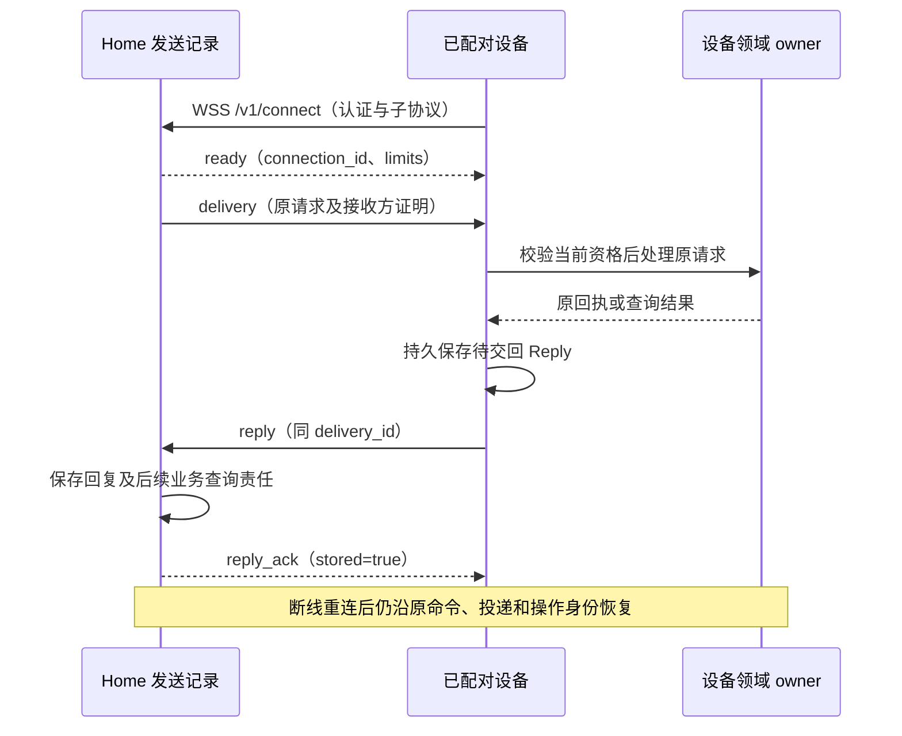

# 发现、认证与跨端交接

[共同语义](README.md) · [方法与字段](protocol.md) · [安全](../security/README.md) · [内容](../memory/README.md)

本页固定未发布的 `harness-wss-draft-3` 端云传输配置，领域配置仍为 `full-harness-draft-2`。浏览器、CLI 和设备主动建立 WSS 双向长连接，命令、查询、回执和服务端通知复用该连接；独立服务间使用 [gRPC 绑定](grpc.md)，同进程使用 Go 接口。HTTPS 保留发现、认证与大内容原始字节传输；上传和镜像元数据及关闭控制也走 WSS／gRPC。原 HTTP 命令、设备取件和 SSE 配置统一替换，不维护未发布草案的兼容入口。

长连接缩短交互等待并允许服务端主动交付，持久责任仍由原命令和业务记录承担。本页是拟实现的互操作契约；结构用例与密码学向量不代表网络、服务或恢复机制已经运行。

## 1. 连接与发现

调用方从用户或受信装配提供的 HTTPS 服务地址开始，验证服务器证书及主机名，不跟随跨源重定向转交凭据。`GET /.well-known/harness` 未认证时只返回协议、传输配置、固定连接路径及登录／配对能力；已认证后返回下表的完整 Discovery。未认证请求不披露租户、设备、内部路由或活动任务。

| 字段 | 含义与校验 |
| --- | --- |
| logical_service_id、protocol、profile | 原负责服务、`harness/1` 与 `full-harness-draft-2`；恢复仍定位原逻辑服务 |
| transport_profile、connect_path | `harness-wss-draft-3`、`/v1/connect`；WSS 地址从原受信服务同源解析，不接受任意连接 URL |
| schema_digest、methods_digest | 精确领域 Schema 和方法登记的 SHA-256；从装配认可的资产取得，不执行任意远程 Schema |
| methods | 本服务实现的严格方法子集；声明方法不表示调用者已有权限 |
| auth_profile、proof_profile | `session-cookie-or-opaque-bearer-1`、`home-jws-es256-1`；不宣称完整 OAuth 供应商互操作 |
| limits | 消息、在途调用、待交付、队列、订阅、连接及心跳限额，见下表 |
| retention | 完整回执查询秒数及长期最小关闭索引；未结责任不受普通清理期限支配 |
| changes_supported | 本配置提供变化订阅；通知仍不能取代原记录查询 |

端主动连接 `wss://原服务/v1/connect`，握手的 `Sec-WebSocket-Protocol` 必须协商为 `harness-wss-draft-3`。网关为该 socket 生成随机 `connection_id`，取得外连接配额并完成到原负责服务的内部绑定后，向端首先发送且只发送一次 `ready`，给出该 connection_id、原 logical_service_id 和本次有效 limits；客户端核对服务与发现一致后才发送业务帧。网关持有本连接的请求关联及订阅状态，内部业务实例不能重新分配外连接身份。Ready 只确认连接可用，不接纳任何任务。服务不能发送比已声明限额更大的帧；客户端无法支持该限额时停止接入。每个文本 WebSocket 消息恰好携带一个完整 UTF-8 JSON Frame，拒绝二进制业务帧；WebSocket 分片不改变应用消息边界。浏览器双向接口依据 [WHATWG WebSocket](https://websockets.spec.whatwg.org/)。

| limits 字段 | 初始上限／默认值 | 约束 |
| --- | --- | --- |
| max_json_bytes、max_frame_bytes | 256 KiB、1 MiB | 前者限制原 Command／Query JSON，后者包含整个帧、Delivery 包装及证明；解析前计字节 |
| max_page_items | 100 | 领域分页上限 |
| max_inflight_requests、max_pending_deliveries | 各 32 | 未收到 response 的请求数；已发送尚未取得匹配 Reply 的投递数 |
| max_queue_bytes | 4 MiB | 每连接、每发送方向尚未写出的应用帧总字节；持久业务队列另有限额 |
| control_reserve_bytes、control_reserve_items | 1 MiB、4 | 普通工作不能占用；分别小于总字节／在途与投递限额，字节预留至少容纳一份最大帧 |
| max_connections_per_identity_service、max_connections_per_identity_total | 2、16 | 同认证端点实例或浏览器会话对一个逻辑服务的连接数，以及该身份跨服务总连接数 |
| max_subscriptions、max_requests_per_connection | 8、10000 | 每连接订阅数；连接存续期内登记的不同 request_id 总数，重绑恢复不重复计数 |
| heartbeat_interval_ms、heartbeat_timeout_ms | 30000、90000 | 空闲后发应用 ping；原 nonce 的 pong 超时则断开，超时大于间隔 |
| max_content_bytes | 部署声明的有限正整数 | 大内容及临时空间上限，独立于帧容量 |

服务可以声明更小值，但须满足表中相互约束并通过容量验收；运行中不静默缩小已发 Ready 的限额。普通工作达到 `max_* - control_reserve_*` 后停止新发送；取消、撤权、收尾、mirror_control、响应和心跳可使用预留，全部仍受总上限约束。控制类别由受信入口按方法登记裁决，发送方不能自报高优先级。参考控制方法为 task.pause/cancel、execution.control/cancel、brain.cancel、evaluation.cancel/revoke、grant.revoke、endpoint.revoke、content.close/release_copy、resource.release、budget.close/settle、grant.lease.settle、grant.use.settle 及 collaboration.control；后者仅关闭／停止分支可占预留。普通 Change 可以合并成同对象最新修订；无法保持提示游标连续时发 `snapshot_required`，不能无声丢失。

双方持续独立读写，不能在等待某一业务 response 时停止读取控制或回复帧。发送队列持续不降、无法排入控制帧或心跳超时则关闭慢连接；未交付的 Delivery、未确认 Reply 和业务 jobs 仍在持久存储中恢复。应用 ping/pong、socket write 完成和任何传输流控都不确认业务成功。本配置不另设流控 ACK；ReplyAck 的持久含义另见第 4 节。

外连接配额由身份权威分区同时检查“身份＋逻辑服务”和身份总额，网关不能按本进程计数放大上限；无法核实配额时拒绝新外连接。网关进程租约、条件释放和过期回收按[生产连接机制](../deployment-production.md#connections)执行；旧实例的清理必须匹配原进程及绑定，不能删除新实例的记录。内部流重绑继续使用原外连接槽，不增加连接数，也不清零 request_id 计数。

一个 WSS 初始最多登记 10000 个不同 request_id；达到上限减 control_reserve_items（默认 9996）后停止接收新的普通 request，最后 4 个名额仅供控制请求。已有等待、Reply／ReplyAck 和服务端控制 Delivery 可继续处理，达到总上限后不再登记任何新 request。网关在最长 5 秒排空后以 1012 关闭并让端重连；原回复没有结束时沿原身份恢复。超过登记名额的请求直接返回过载错误且不建立新的等待记录，不能借恢复或错误缓存建立无界 ID 集合。

外连接重建不会创造新的 endpoint instance；内外连接均不决定业务唯一执行权。重复投递即使经过不同连接仍按 delivery_id／command_id 去重。外断线释放连接、request_id 和订阅状态，不释放业务责任；指数退避并加入抖动后重连，参考从 1 秒增长至 30 秒上限，认证失败先重新认证，不无限重试旧凭据。

发现字段和 Frame 完整结构见 [transport.schema.json](schemas/transport.schema.json)。服务只能声明已安装并通过对应配置验证的方法，未知 profile、资产摘要或必要方法缺失时停止集成。没有全局注册中心：装配保存逻辑服务及认证关系，跨 Home 任务目录聚合现有映射。

## 2. 认证主体和有限配对入口

浏览器在 WSS 握手使用同源 Secure、HttpOnly 会话 Cookie，服务校验允许的 Origin；认证／配对的 HTTP 写入口同时执行 CSRF 检查。浏览器 WebSocket API 不要求自定义 Authorization header，凭据不放 URL 或子协议名。本地 CLI 和已配对设备使用 TLS 握手内的 `Authorization: Bearer <opaque-token>`。不接受将 Cookie 与 Bearer 混用为可选择身份的请求，也不从帧正文取得 tenant、主体或设备实例。

Bearer 至少来自 256 位密码学随机值，服务保存令牌校验值及绑定信息，原文仅在安全凭据库和短期领取恢复记录中存在；不进入通用日志或领域对象。持有者可以使用对应资格，每条业务消息及每次向端披露数据仍核对当前到期、撤销、代次和范围；握手通过不授予整个连接永久资格。Bearer 传递依据 [RFC 6750 §2.1](https://www.rfc-editor.org/rfc/rfc6750#section-2.1)，不要求令牌采用 JWT。

| 入口类型 | 凭据与每次检查 | 不能推导的权限 |
| --- | --- | --- |
| 本地 CLI／Web | CLI 使用受控系统凭据；Web 同源 Cookie 会话、Origin 与 CSRF 检查 | 任意本机网页不能自动成为用户 |
| 已配对端点 | 令牌绑定 tenant、endpoint、instance、credential_generation、到期与范围；每次查当前端点代次／撤销状态 | 设备认证不自动授予 Grant 或批准 |
| 服务间调用 | 受信装配绑定逻辑服务与主体，令牌只发给对应服务范围 | 网关转交不允许伪装原 Home |
| 配对 begin | 受限匿名入口，限流并生成短期会话 | 不带 tenant，不得调用一般方法 |
| 配对 claim | 原 pairing_id、私密设备码和设备 nonce；每次轮询用新命令，丢答复重投原命令 | 公开用户码不能领取凭据 |
| 配对 approve | 已认证用户在独立受信入口确认原请求 | 新端自报的批准字段没有效力 |

`endpoint.pair.begin` 与 `endpoint.pair.claim` 经 HTTPS `/v1/pairing/commands` 提交原 Command，是认证引导的有限例外；该入口仅接受这两个方法并使用限流的配对认证上下文，它们不接受调用方指定业务 tenant。领域序列夹具中的 `Exchange.auth` 是测试提供的已核验前提，不作为匿名请求的线字段。批准时才确定租户和范围，凭据实例资格由批准后的原会话产生。

尚未批准时，claim 的 `pending` 是该次命令的最终观察结果；后续轮询使用新 command_id，保持原 pairing_id、私密码及设备 nonce 不变，不能重放 pending 回执期待其变化。领取成功与原领取回执在同事务保存。回复丢失时，设备以原私密码及原命令恢复同一结果；不同命令不能生成第二份端点凭据。敏感回执只在安全领取窗口内保存可恢复密文，窗口结束返回 `gone` 并要求重新配对；最小关闭记录继续拒绝旧会话重新领取。已经持有的凭据是否有效按自己的期限与撤销决定，不由回执清理决定。

`AuthContext` 由认证适配器生成，不从请求正文反序列化：`sender_service_id` 来自业务服务凭据或已验证的 Delivery 发送方，接收端还须检查该服务是否有权代表对应 Home 或 usage owner。中转网关的 mTLS 身份仅验证转交关系，不能写成业务 sender_service_id；委托调用恢复原主体及已验证的原业务发送者（如有），直接用户／端点没有业务发送者时不填该字段。否则持有者控制查询等按 sender 判定的入口会把网关错认成持有者。`actor_kind` 与 `trusted_user_session_ref` 来自当前用户／维护者会话；`confirmation.decide` 只允许受信的人类会话，服务令牌、模型产物及普通输入消息不能自报这两个字段完成批准。Confirmation 由原业务 owner 保存，并在原业务命令的事务中核验与消费，完整绑定见[安全实现](../security/implementation.md)。

原端点凭据或浏览器会话到期需受信重新认证并重新建链，不通过请求正文延长；仅内部委托令牌轮换时，网关可经受信身份适配器重新取得委托并重绑内部流，外 WSS 保持。端点撤销增加代次，所有旧连接的新请求和披露立即拒绝并关闭；已发出的有限离线资格仍遵守其明确窗口。新实例不得直接取得旧实例的未决操作或余额；旧工作始终从原领域账本恢复。云端登录供应商和操作系统密钥保存器为装配适配器，缺席时不开放远程入口。

## 3. Home 控制证明

仅用“从网关收到”无法证明暂停快照由原 Home 发出。Home 为 ControlSnapshot 的准确内容生成 JWS Compact，`home_proof` 保存完整串；端点验证已登记 Home 的签名及接收方绑定后，才应用 TaskGate。签名用于证明来源，不替代当前 Grant、设备占用或控制修订单调性。

本配置使用 JWS protected header `{alg:"ES256",typ:"harness-control+jws",kid}`，拒绝 `none`、其他算法、不认识的 header、消息自带 JWK 或取钥 URL。公钥必须来自事先配对／装配登记的原 Home 密钥集。编码与验证沿用 [RFC 7515](https://www.rfc-editor.org/rfc/rfc7515)，ES256 的 P-256、SHA-256 及固定宽度签名格式依据 [RFC 7518 §3.4](https://www.rfc-editor.org/rfc/rfc7518#section-3.4)。

| 签名载荷 | 约束 |
| --- | --- |
| issuer、tenant_id、audience | issuer 等于 gate.home_id；audience 为准确 executor_id；租户与认证上下文相同 |
| gate | 原 TaskGate 的完整对象，包括目标与控制修订；不能只签 task_id |
| issued_at、start_before | 与 ControlSnapshot 一致，构成非空有限窗口；有效窗口不得超过双方装配的控制上限 |

载荷按 [RFC 8785 JCS](https://www.rfc-editor.org/rfc/rfc8785)规范化后 UTF-8 编码；对象成员排序、数值与字符串编码共同固定摘要。拒绝重复键、不合法 Unicode、非有限数值和超出安全整数范围的整数字段；金额使用已有十进制字符串。本配置所有修订、计数和字节长度最多为 `9007199254740991`，不能经 JavaScript 舍入后再验证。JWS 签名输入为实际 protected-header 与 payload 的 base64url 编码，接收方不能先改内容再验证。

验证顺序为：有界解码和严格字段 → 已登记 kid 与算法 → 签名 → 对照实际快照完整内容／租户／接收方 → 时间与来源资格 → 领域门禁。过期证明仍可作为历史恢复证据，但不能启动新工作；原消息重放不延长窗口。接收端无法建立可信时间上界时关闭依赖远端窗口的新启动，纯本地共同事务的控制继续成立。

正常轮换先由既有受信关系登记新公钥，再切换签发；旧公钥保留到其证明均不可再用于启动并满足历史审计。发现密钥失信时禁用该 kid 的新使用，并沿当前控制通道传播；不因验证历史签名成功而忽略当前失信状态。公开的测试向量只验证编码、签名与绑定，真实密钥托管、轮换、撤销传播仍须运行验收。

## 4. 双向请求与主动交付

`request_id` 仅在当前 connection_id 内关联一次 request／response，同连接的新调用不得复用；内部重绑继续同一未决调用时保留原关联。收到 response 或外连接断开后释放等待槽；业务身份、回执和恢复责任不以 request_id 为键。命令重新发起网络请求可换 request_id，内含 command_id、原参数及首次接纳期限不变。响应超时先查原命令；query 和 receipt_lookup 本身不创造新业务命令。

| Frame.type | 方向与精确业务字段 | 含义 |
| --- | --- | --- |
| ready | 服务→端：connection_id、logical_service_id、limits | 首帧；该连接后续所有帧均携带相同 connection_id |
| request | 端→服务：request_id、kind、request | kind 为 command／query／receipt_lookup／subscribe 及第 5 节五种内容传输管理类型；request 逐类型严格绑定 |
| response | 服务→端：原 request_id、kind、result | result 按 kind 为 Receipt／QueryResult／Subscribed／Upload／Mirror，或互斥的 `{error: Error}`；只答复本连接原请求 |
| delivery | 服务→设备：envelope | 严格 DeliveryEnvelope，即 delivery＋delivery_proof；未配对浏览器会话不能接设备工作 |
| reply、reply_ack | 设备→服务：reply；服务→设备：ack | 原 Reply 与原 ReplyAck，沿 delivery_id 关联，可跨重连恢复 |
| mirror_ticket | 服务→设备：ticket | 第 5 节 MirrorTicket，沿原 ticket_id 恢复 |
| change、snapshot_required | 服务→端：subscription_id＋change／reason | 第 6 节通知与快照缺口；不包含执行许可 |
| ping、pong | 双向：nonce | 每方向最多一个未答复 ping，pong 复用对方 nonce；只检测连接存活 |

除 ready 外，各帧也必须包含表首定义的 connection_id；所有对象封闭且 type/kind 互斥。跨外连接迟到的 response 丢弃，不能借另一个 socket 的同 request_id 完成等待；内部重绑则保留当前 socket 的关联，网关仅接收当前 binding_id 的输出。Delivery 与 Reply 的耐久恢复沿其原业务身份重新编码帧。没有连续全局消息序号或重放整条连接的承诺。服务端端点推送与内部转交共享 Frame，受控重绑按 [gRPC EndpointChannel](grpc.md#channel-rebind)执行，领域准入仍在实际 owner。

内部流短暂失效时，网关保持外 WSS 和心跳，不积压新的普通请求；这些请求返回 dependency_unavailable，不伪造业务回执。网关在原请求自首次收到起的 5 秒总期限内查询已发命令、恢复只读请求及原回复；总期限不随重绑重置。无法确定写入结果时返回 retry=query_original 的真实 Error，仍可在之后查询原身份。后端不可用连续达到 60 秒则以 1013 有界断开外连接；这与单次请求 5 秒期限独立。身份撤销、过期或无法继续满足当前披露检查时，先停止业务与数据发送，已确认身份失效时立即关闭。

无入站地址的设备主动建链后，Home 可立即推送有界 Delivery。Home 保存发送责任，设备领域 owner 保存接纳和效果记录；交付、处理、回交和原效果查询分别承担持久责任。

Delivery 固定 `delivery_id, sender_service_id, recipient_endpoint_id, recipient_instance_id, request_digest, kind, request, deliver_before`。三类请求必须使用互斥结构：

| kind | request | reply.result | 持久与恢复 |
| --- | --- | --- | --- |
| command | 原 Command | Receipt 或 `{error: Error}` | 以原 command_id 在目标服务去重；Receipt accepted 只确认接纳，可继续查原决定 |
| query | 原 Query | QueryResult 或 `{error: Error}` | 没有 command_id；delivery_id 关联本次有界读取，不创造目标业务命令 |
| receipt_lookup | `{command_id}` | 原 Receipt 或 `{error: Error}` | 查询原命令；查询失败不生成该命令的 rejected 回执 |

`request_digest` 为 request 的 JCS SHA-256；发送方、目标、kind、原请求和截止首次保存后不变。同 delivery_id 不同内容冲突。设备未能提交原命令回执，或命中已清理的回执关闭索引时，以 `{error: Error}` 交回明确错误；Home 保存传输结果，但不能把它写成该业务命令的 rejected 或成功。可恢复错误按原 command_id 查询或有限重投，`gone` 保持原身份关闭并查询仍可读取的业务事实。若本次 Delivery 的错误回复已固定，需要重试处理时新建 Delivery，内含的原 Command 保持不变。重复 query delivery 在当前披露资格仍成立时返回设备已保存的该次读取快照；需要更新状态时 Home 新建 query delivery，业务对象身份不变。业务请求的接纳截止与 Delivery 的投递截止分别检查，外部执行 deadline 不由传输延长。

设备按当前凭据实例接收。跨端转交请求同时附由受信发送服务签名的 Delivery 证明，沿前节 ES256 配置，typ 改为 `harness-delivery+jws`，签名载荷为完整 Delivery（不含证明自身）；证明的发送方必须属于允许向本设备路由的服务。这样，即使中转不可信，也不能替换原请求或接收实例。查询只在当前数据许可下执行，历史签名不授予新的读取权。

Home 根据当前认证端点和实例将 DeliveryEnvelope 放入 `delivery` 帧；跨并行连接的同一投递仍是同一持久责任。取得匹配 Reply 前占据该连接的 pending delivery 槽；连接断开后发送责任继续存在，重连可重新投递。同一 Delivery 不因等待超时生成新的 Command。取消、撤权及收尾使用前述有限预留，设备优先交回已经持久保存的回复；设备自己的持久队列满时拒绝新接纳，并保留查询和关闭责任。

设备发送 `reply` 后，Home 核对预期设备实例、原请求和响应结构，保存回复并创建后续领域查询 job，再返回 `reply_ack`，其 ack 为 `{delivery_id,stored:true,result_digest}`。重复完全相同回复返回同确认；同 delivery_id 不同业务结果冲突。reply_ack 丢失时设备保留原 Reply，按有界退避重交，不能只等外 WSS 断开才重试；网关内部重绑后也可重交已缓存的同一 Reply。Home 不重复建立后续责任。原 accepted 回执的后续变化通过新的 receipt_lookup Delivery 获取，不能覆盖已确认的第一次回复。MirrorTicket 通过独立 `mirror_ticket` 帧推送，不改动 Delivery 的三类请求；它的成功由上传状态查询确认。

缓存回复在首次发送和每次重传前均重查当前披露资格，包含 Query 快照和已裁剪的 Receipt。资格不足时，设备保留原结果事实，持久关闭该 Delivery 的内容交付，改发 `withheld:true` 及严格的 `{error:{code:"forbidden",message,retry:"after_change"}}`。此分支只关闭披露，不改写原业务决定；Home 将其作为单独的当前披露状态保存与确认，不当作不同业务结果冲突。Home 已知关闭后丢弃迟到完整回复的内容；资格以后恢复，也须新建 Delivery 执行当前查询或原命令查询。已经交付的字节不能召回，内容副本仍按原 owner 的关闭流程清理。

设备无需额外自造 command_id 来确认 Query。Home 收到查询 Error 仍保存本次查询完成及可重试原因；设备暂不可达呈现 `dependency_unavailable`，不可伪造 `not_found`。投递超时但可能已交付时先核对原 command；只读查询可新建 delivery 重试，副作用身份不得重建。

## 5. 大内容的临时字节与正式引用

上传／镜像管理复用 WSS request／response 与 gRPC Call，五个严格的传输管理 kind 不增加领域方法。本机共同事务可直接调用 Go 接口；HTTPS 只接收或返回原始字节。管理入口的 tenant、主体和范围来自当前认证，正文中的 upload_id／ticket_id 只定位原记录，不提供访问权。

JSON 命令上限不能容纳任意截图或文件。基础配置采用可幂等整份重传的临时上传；分块恢复是后续可选能力，默认不引入多段提交协议。上传空间按用户预留，超额或摘要不符明确拒绝，不将部分字节交给业务读取。

| 入口 | 字段／响应 | 成功与失败 |
| --- | --- | --- |
| `upload_reserve` | `{upload_id,hash,byte_length,media_type,expires_at}` → Upload | 当前认证主体保存有界上传意图与空间预留；同ID不同元数据冲突 |
| `PUT /v1/content/uploads/{upload_id}` | 原始字节，Content-Length 与 Content-Type 匹配 → Upload | 临时写、校验摘要／长度、同步后原子就绪；丢回复查原上传，不追加字节 |
| `upload_lookup` | `{upload_id}` → Upload | state 为 reserved／ready／committed／expired；不跨用户返回状态 |
| WSS／gRPC 的 content.put 命令 | upload_id、ContentRef、来源及策略 → 固定内容版本 | 只有 ready 且精确字节匹配才提交；内容引用和策略持久成功，不在JSON放正文 |
| WSS／gRPC 的 content.get 字节查询（默认或 mode=bytes） | 精确内容、已登记副本与用途依据 → ContentBytesGetOutput | 当前许可核对后发有限下载定位；不创建副本或新的业务消费责任 |
| `GET /v1/content/downloads/{download_id}` | 当前认证＋原下载定位 → 字节 | 每次复核主体、接收方、copy_id、来源、用途和期限；定位串本身不是独立权限 |

这五个 kind 的 request_id 仍只关联本次往返：upload_reserve 按原 upload_id 与不可变元数据去重，mirror_reserve 按原 ticket_id 与完整票据去重，mirror_control 按原 control_id 与完整请求去重；同 ID 不同内容冲突。lookup 只读原记录，不重新预留、发布或关闭。断线重连后换 request_id，内含上传、票据及控制身份保持不变；response 必须匹配原管理 kind 和上述身份。

Upload 的 owner、tenant、主体绑定来自当前会话。重复 PUT 先完成有界接收及一致性检查，已 ready／committed 时只返回原元数据；内容不同拒绝。上传期限限制新字节和首次发布，已 committed 的正式引用不随临时上传过期而失效；正式保留由 ContentPolicy 管理。

云端 Upload／Mirror 元数据保存在原内容负责分区，临时上传和就绪字节保存在跨可用区共享耐久存储。接入、上传或应用进程退出后，健康副本仍能按原 upload_id／ticket_id 查询并取得就绪字节；单进程临时文件同步不能作为返回 ready 的唯一依据。receiver_service_id 始终是稳定逻辑接收服务，不是某个网关进程。未完成字节仍按原 ID 有界重传，元数据与字节发布／清理竞争继续由原 owner 裁决。

content.put 先取得不可变耐久字节，再在业务事务中将 upload 从 ready 变为 committed，保存 ContentRef、来源图及策略。清理候选与新引用登记锁同一上传／内容元数据，防止孤儿清理删掉刚发布对象。崩溃后 ready 可由原命令继续；数据库提交结果未知时先查原回执，不能重新发布另一个版本。

基础下载 `range_supported=false`，不接受 Range；需要恢复时在仍获准的原引用上重新下载整份。响应携带 Content-Length、Content-Type 和绑定 hash 的强 ETag，客户端核对实际摘要与长度后才使用。响应开始前复核权限，并在流式发送中按有界块检查关闭状态；撤回不能召回已交付字节，已登记副本继续承担清理责任。不得把下载成功或 ETag 当作用户已预览确认。

下载定位可以短期缓存；缓存丢失由 content.get 重新取得，不能因此自动重新登记副本或放宽权限。临时上传清理保留最小 ID／摘要／终结状态，原 ID 重投不得覆盖已发布内容。期限或磁盘保护水位达到时停止新上传，为现有事务、清理和关闭记录预留容量。

### 5.1 无入站设备的反向副本

云 Home 读取设备截图或端侧记忆时，设备上的下载地址可能不可达。基础配置允许设备向已配对的连接接入服务主动上传只读镜像；原 ContentRef、内容 owner 和 copy_id 保持不变。接收方必须先取得原 owner 的 `content.register_copy` 结果及当前读取资格，再预留接收空间。它不能把镜像经 content.put 发布成自己拥有的新内容。

| 入口／记录 | 精确结构及约束 |
| --- | --- |
| `mirror_reserve` | 输入 MirrorTicket，返回 Mirror；由接收端自身获准任务发起，receiver_service_id 必须为本服务，原 copy 的 holder 为本服务 |
| MirrorTicket | ticket_id、upload_id、receiver_service_id、sender_endpoint_id、sender_instance_id、content_ref、copy_id、source_control_revision、expires_at；所有字段首次保存后不变，不含任意 URL |
| WSS `mirror_ticket` 帧 | 接收端只向票据绑定的已配对设备实例返回原票据；设备从当前受信连接确认 receiver_service_id，拒绝跳转到其他地址 |
| `PUT /v1/content/mirrors/{ticket_id}` | 原始字节；接收端验证设备与实例、票据期限、摘要／长度／类型，临时写和同步完成后将 Mirror 改为 ready |
| `mirror_lookup` | `{ticket_id}` → 原 Mirror；供上传端查丢失回复，不凭另一个 ticket 重新发布或重置关闭状态 |
| `mirror_control` | MirrorControl → Mirror；原 owner 的认证控制更新，绑定 ticket_id、control_id、content_ref、copy_id、control_revision 与 cause（restricted／closed） |
| Mirror | ticket、state（reserved／ready／closed／expired）、control_revision、retention_until、cleanup_state；后两项保留及控制信息由原 owner 的受信记录推进 |
| `GET /v1/content/mirrors/{ticket_id}/bytes?source_download_id=...` | 接收端凭自己经原 owner 当前 content.get 取得的记录读镜像；下载 ID 只定位该记录，不接受调用者自报授权结果 |

mirror_reserve 由接收端当前获准的本地任务或受信服务身份发起，接收方从原登记检查 holder、配对发送实例与空间资格，不能将请求正文当成已认证设备上下文。mirror_lookup 与 mirror_control 分别检查当前披露资格和原 owner 身份。

设备取得票据后再次检查原 copy、当前来源及披露资格，再以原 ticket 上传。接收方在分片写入期间检查本地关闭状态，完整校验后才开放读取；同票据重复 PUT 只能返回相同 ready 内容，不追加字节。上传中断时继续保留同票据的有限恢复责任，过期或关闭后删除临时字节；已 ready 的镜像不因上传期限结束自动失效，其保留及读取始终由原 copy 管理。

每次镜像读取先通过已定义的查询投递取得原 owner 当前 ContentBytesGetOutput，再核对原引用、copy_id、下载截止及镜像已知的控制修订。接收端从该受信答复推进已知修订后才能使用；旧答复不得覆盖较新关闭事实。基础镜像配置不支持独立离线读，原 owner 不可达则停读，不从上传票据或旧定位推导新资格。读取响应和后续流检查沿用普通下载规则。content.get 的 mode=control 分支只返回持有者控制事实，不能代替本次字节读取资格或下载定位。已明确授权的离线副本是另行验收的能力，不能借本路径获得。

原 owner 在 content.close 或限制事务中保存逐镜像的控制发送责任，再经 WSS／gRPC 的 `mirror_control` 主动提交 MirrorControl。接收端从认证装配核对发起者确为 ContentRef.owner_id，不把 owner 的 content.close 直接路由给镜像端。控制按原 control_id 和请求摘要去重，旧修订不得覆盖新修订；较新修订、读取关闭、state=closed、清理 job 与回执同事务保存。这里 cause=restricted 也保守关闭整个镜像并清理，不在接收端维护另一套策略比较器；原新策略仍允许复制时，由调用方重新登记副本并取得新票据，代价是重新传输。

owner 丢失控制答复时重投绑定原 ticket_id 的同一 MirrorControl，或用 mirror_lookup 查原 Mirror，不能凭网络成功就声称物理清理完成。接收端先关闭读取，再删除临时及镜像字节，按 `content.release_copy` 回报停止使用、物理清理或残留事实。上传完成与关闭竞争锁同一 ticket／copy 元数据；较新关闭先提交后，迟到 PUT 和 ready 回写都不能重新开放。控制更新使用原 owner 的当前认证资格，设备实例重启不会使旧 copy 失去可关闭性；只有上传仍绑定票据中的原发送实例。完整持有者责任与大截图、中断、关闭实验见[内容实现](../memory/implementation.md#52-无入站设备的受控反向交付)。

## 6. 变化订阅、快照与错误

端通过 kind=subscribe 的 request 提交 `SubscribeInput={object_types,cursor?}`，object_types 为 task／operation／memory／surface／activation／grant 的非空去重集合。类型的集合范围及对应枚举／单对象读取入口见[集合恢复](protocol.md#collection-snapshots)。服务按当前权限过滤这些类型下可披露的对象，返回 `Subscribed={subscription_id,cursor,snapshot_required}`。每个连接最多保留 limits 声明数量的订阅；同过滤集合重新订阅会替换旧订阅并返回新 subscription_id，断线释放订阅。cursor 是该主体、原逻辑服务及准确过滤集合下的提示位置，不能跨主体或过滤条件移用。

首次订阅或原游标超保留窗口时，Subscribed.snapshot_required=true：服务先建立新水位之后的提示缓冲，再答复水位；客户端按[六类型映射](protocol.md#collection-snapshots)逐页枚举当前获准集合，同时有界缓冲已收到的提示，随后根据变化重新查询当前对象；客户端缓冲溢出时断开并按有界恢复预算重新建立快照。Subscribed 的标志只要求重取快照，不暂停新订阅的 Change。快照查询期间重复提示可按修订合并，不能因快照与订阅先后留下遗漏。有效 cursor 恢复时返回 snapshot_required=false，并发送该位置之后仍可披露的提示。每条 `change.change` 仅含 `cursor,object_type,object_id,revision`，不带敏感正文，不证明用户已看到页面、输入已消费或效果已发生。

已建立的订阅遇到保留缺口或无法保留提示的队列溢出，服务发送 `snapshot_required` 帧，reason 分别为 cursor_expired／queue_overflow，并暂停该订阅的 Change；无法排入该控制帧则关闭连接。客户端放弃旧连续性假设，以同过滤集合、不带 cursor 的 subscribe 替换订阅，再按新水位取得快照。纯同对象修订合并不丢失查询义务；任何不能保证覆盖的跳跃均走明确缺口。客户端忽略已替换 subscription_id 的迟到通知，周期查询及恢复扫描修补通知之外的遗漏；领域 memory.view.pull 的连续分页规则保持独立。

内部流重绑默认不承诺接续原通知窗口。网关隔离旧绑定后，向客户端仍认识的每个 subscription_id 发送 reason=backend_rebind 的 snapshot_required，并暂停该旧订阅；新内部 Ready 不转发为第二个外 Ready。客户端按同过滤集合、不带 cursor 重新订阅并取得快照，期间重复提示按修订查询当前事实。网关不能把新实例的任意游标当作旧连续游标；通知恢复和业务结果查询分别限额。

权限范围增减均发送 reason=authorization_changed 的 snapshot_required 并暂停旧订阅；帧只标订阅，不泄露被移除对象 ID。新增可见的历史对象即使没有业务修订变化，也必须通过新枚举发现。当前资格适配器在授权变更后使受影响订阅失效；跨 owner 变更通知不能证明连续时，订阅器至少每 30 秒通过当前资格适配器校准范围，无法证明范围未变则保守置缺口、停披露并按有界预算恢复。该周期只用于发现范围变化，每条消息和实际发送前仍须当前资格检查。连接身份失效则关闭；客户端收到权限缺口即废弃完整性标记与旧分页，撤去未经当前复核的缓存，再不带 cursor 重订阅。不同身份不能续用原 cursor。

集合恢复明确保留 partial、gaps、不可达端及容量截断，不把 Surface 的 200 项冻结集合或 Memory 的有限集合当作无限目录；固定截断不触发同样全量查询的立即循环。领域页游标和订阅水位独立，任务创建时间上界也不等于提示切点；客户端需先订阅、后枚举，再读取水位之后的未知及已知对象提示。具体预算、完整条件和有限重试见[集合恢复](protocol.md#collection-snapshots)。通知丢失可恢复查询，服务端推送的控制命令仍须经原 Delivery／Receipt 持久链路，不能降成可丢 Change。

| 情况 | 线返回 | 调用方动作 |
| --- | --- | --- |
| 已保存业务决定 | response.result 或 Reply.result 中的 Receipt | 读取 stage；连接正常或 gRPC OK 不裁决业务效果 |
| 已关联请求尚未接纳、参数或资格失败 | 同 request_id 的 response，result=`{error: Error}` | 按准确 code/retry 恢复；不生成伪持久回执 |
| 握手认证失败或接入过载 | HTTP 401／403／429／503；未升级 | 重新认证或退避；不能显示命令已排队 |
| 帧格式非法／消息过大 | WebSocket 1002／1009 关闭 | 修正协议或容量；原业务身份仍须查询 |
| 会话撤销／慢连接、过载或内部恢复超过 60 秒 | WebSocket 1008／1013 关闭 | 重新认证或退避重连，不把关闭改成业务 rejected |
| 网关滚动退出／连接请求总数达限 | WebSocket 1012，有界排空后关闭 | 按原身份重连恢复；不清零业务配额或责任 |
| 原始字节传输成功／字节过大／不存在／已回收 | HTTPS 200／201、413、404／410，加字节传输结果或 Error | 按上传、镜像和下载状态解释；not_found 与 gone 分开 |
| 断开、心跳超时或答复未知 | 可能无应用帧或 JSON | 原写命令先查原记录；断线不取消已接纳操作 |

错误 code 与 retry 仍归[共同错误](README.md)，服务间状态映射归 [gRPC 绑定](grpc.md)。传输层不得覆盖领域恢复义务，gRPC deadline/cancel 只终止本次 RPC 等待，不能推导 task.cancel。所有入口在解析前限制字节、嵌套与数组数量；通过 Schema 后仍须执行租户、权限、状态和实际字节验证。

## 7. 验证与边界

| 场景 | 静态／向量断言 | 运行实现须补的证据 |
| --- | --- | --- |
| 发现、Ready 与方法不一致 | profile、限额关系、未登记方法及未知字段拒绝 | 实际安装资产与发现摘要一致 |
| 帧方向、关联与连接恢复 | 非法方向、旧 connection_id／binding_id、迟到低代绑定、同代异 ID、错 request_id／kind、重复外 Ready、limits 变化、配额重复消费拒绝 | 业务实例滚动保持 WSS，网关退出再外重连；响应丢失仍沿原身份恢复 |
| 慢端、过载与通知缺口 | 帧／队列／在途上限、控制预留和订阅归属校验 | 心跳失效、重连风暴、取消不被普通工作饿死、快照与通知并发 |
| 命令、查询、回执查询混淆 | kind与请求／响应互斥；命令回复匹配原ID；Query不含command_id | 断线两端仍沿原领域身份恢复 |
| 回复丢失／被篡改 | delivery和摘要固定、不同结果拒绝 | 回复提交后断网，设备重投只有一次接收事实 |
| 伪造或移用控制证明 | ES256签名向量、错误kid／受众／租户／快照拒绝 | 密钥轮换、撤销、时钟不可信和离线窗口 |
| 上传截断／换字节／孤儿清理 | hash／长度／上传与引用关联拒绝 | 磁盘满、提交未知、清理与引用并发 |
| 下载资格撤回 | 过期定位、错误副本与引用拒绝 | 发送前及发送中撤权、持有者清理回执 |

机器资产与复现入口见[传输用例](examples/transport/README.md)。字段和签名向量检查只验证给定数据；认证主体是否真实、持久提交是否成立、隔离是否有效以及异构服务是否互操作，都必须另外运行验证。
