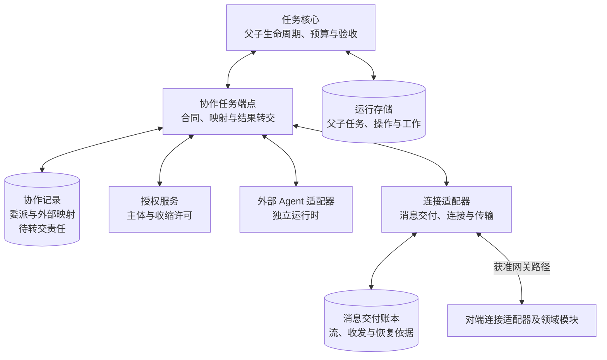
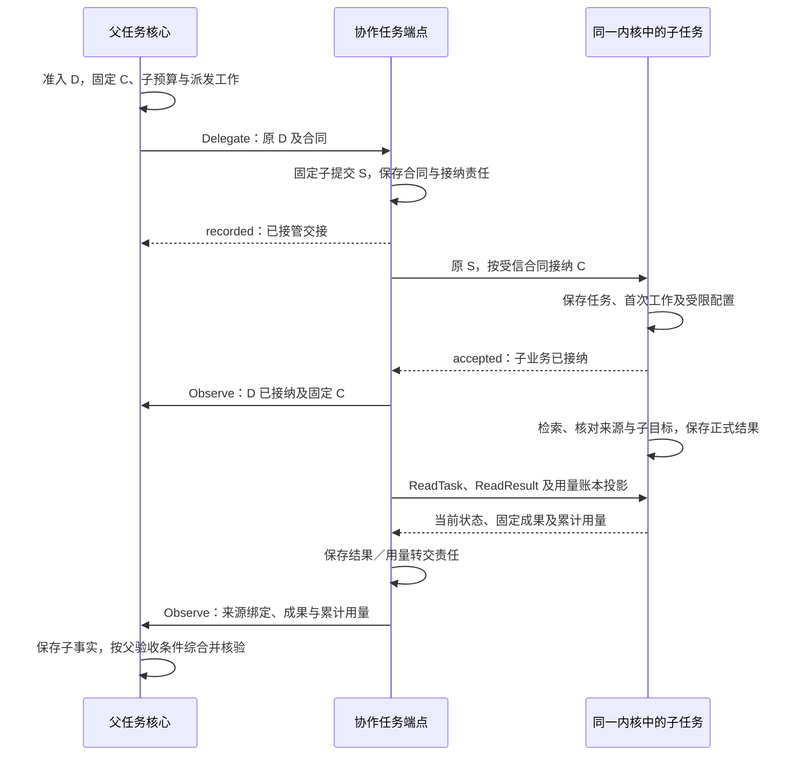

# 协作与端云详细设计

协作与端云将任务内核已经准入的委派交给指定 Agent，并在断线、重复交接和进程重启后继续收集结果、传播取消、核对用量。协作任务端点保存委派关联与交接责任，连接适配器保存消息责任；任务推进、权限和实际效果仍由各自领域裁决。

本方案展开[系统全景图](../diagrams/system-panorama.drawio)的 `coordination` 分组：`peer-task` 协作任务端点和 `connection` 连接适配器，以及 `task-core ↔ peer-task` 的委派／结果交接、`peer-task ↔ connection` 的按需跨端交接。两条边均为双向支撑交接。图中的“受控委派、所有权移交、离线续跑”是能力方向；其中任务所有权移交仍受现行固定写权威约束，首期关闭。Agent 声明、路由表和恢复工作是组件内部机制，不新增全景图模块。

首次阅读沿本页主线，再读[委派与任务恢复](delegation.md)、[消息交付与连接恢复](delivery-and-recovery.md)；实现查[协作契约](peer-contracts.md)，验收和联动提案查[验证与待决项](validation.md)。现有[端云协议框架](../endpoint-cloud-protocol/README.md)继续作为 WSS 消息的权威定义，本方案补充组件内部实现契约，没有修改协议载荷。

## 1. 首期闭环与依赖

首期采用**固定任务写权威、本地内部 Agent 委派、持久交接和有限恢复**。同一用户的父子任务仍由同一任务写权威保存，各任务有独立目标、状态和预算份额。它们可以选择不同的 Agent 配置和获准执行端点，不能因选择了另一个 Agent 就另建任务权威。

| 范围 | 本次设计及依赖缺席时的行为 |
| --- | --- |
| 默认委派 | 核心固定父委派操作、子任务身份和预算 → 本地协作端点接管 → 同一内核接纳子任务 → 回传事实、成果与累计用量 → 父核心独立核验；没有受信 Agent 声明、收缩许可或预算保证时不提供可派发候选 |
| 连接适配器 | 落实既有 Delivery.Accept、收发账本、流注册、路由、原消息核对和领域恢复门禁；默认本地持久存储，经获准网关使用现行 WSS／JSON 与 HTTPS 内容通道 |
| 外部 Agent | 保留其独立运行时；本地适配器须具备原委派接纳核对、取消、结果来源及有限消费保证。本方以父委派 D 关联原生任务，不另建 Harness 代理子任务；原生任务不取得本方 task_id 的写权威，缺项则禁用委派 |
| 跨端委派 | 本页本地契约不等于已存在的线协议。task.submit@1 没有完整委派合同；版本化载荷、授权及恢复证明未落实前关闭，见 CO-P1 |
| 授权与控制 | 复用身份模块的主体绑定、Delegate、BeginUse 及恢复依据；许可引用不能认证 Agent。所需权威不可达或来源关系不明时保持等待／拒绝，不能从节点在线推断可用 |
| 离线 | 默认关闭。有效离线许可、可信时间、唯一账本、本地任务权威或已接纳的委派工作、预算和依赖全部齐备才继续；依赖失联权威的新决定等待 |
| 所有权与直连 | 任务控制权移交、跨主机端点接替和端端直连均非首期闭环；缺少唯一生效及隔离证明时拒绝启用，不提供超时接管 |
| 其他领域 | UI、记忆与执行消息可复用交付；本模块不补写其缺失领域载荷，不生成记忆、UI 或执行的权威快照 |

依赖表示启用前必须具备的实现和证据，不能以文档已有接口认定实现可用。本次形成模块设计；没有 Agent、网关、持久账本或故障注入运行实现，成熟度与验证边界见[交付检查](validation.md#checks)。

本模块直接承担[项目目标](../../harness-project-goals.md) C5 的任务委派、端云恢复与离线边界，C6 的内部／外部 Agent 互操作，C7 的权限收缩及用户中断，C8 的跨端责任追踪。C1 由候选与子成果支持，大脑仍负责选择；C2／C3／C4 的记忆、证据和执行通过对应领域交接，不改变事实强度；C9 只允许使用已获准版本，不自行发布 Agent 改进。A1–A4 均适用。V1 验证子检索证据可被父任务准确采用，V2 验证设备操作未知、取消和迟到结果，不用连接恢复代替专项效果验收。

## 2. 分工与事实归属

**委派**是父任务以固定操作交付一份子目标、约束、权限和预算，并保留收集与控制责任。**协作任务端点**是接受这份合同并提供恢复接口的领域组件；它可以是同进程对象，也可由获准远端承载。**Agent** 是绑定策略及运行配置的行动主体，与通信端点、任务和进程分别标识。

下图是逻辑交接视角，实线表示调用及返回，圆柱表示事实保存位置；内部子任务与父任务共用任务写权威，框不表示独立进程。

| 事实 | 保存／裁决方 | 本模块可以确认什么 |
| --- | --- | --- |
| 父子目标、任务状态、验收、预算、控制 | 任务核心及运行存储；父子分别裁决 | 子任务接纳或结果事实已取得；不能自行完成父任务 |
| 委派固定合同、子提交映射、外部原任务映射、转交责任 | 协作任务端点的持久记录 | 已接管委派交接、原委派当前进展、哪些证据缺失 |
| 消息身份、流与游标、发送／接收责任 | 连接适配器的消息账本 | 指定阶段已持久保存；不代替业务接纳 |
| 主体、端点及活动所有者、许可与撤销 | 身份与授权 | 复用适用证明；不自行签发或扩大权限 |
| 外部调用执行与效果 | 执行协调器或经过验证的外部 Agent 原记录 | 带来源转交已知事实；未知继续保留，不能用“Agent 成功”覆盖 |
| 可用路由、连接状态、能力缓存 | 连接适配器；配置及最终端点分别提供依据 | 路径可达和类型可接收；不证明控制权、资源权限或执行能力 |

| 发起方 → 处理方 | 输入 → 输出及成功含义 | 持久责任与失败后的继续者 |
| --- | --- | --- |
| 大脑／核心 → 协作端点 | 受限筛选条件 → Agent 候选及准确声明 | 安装配置提供固定版本；核心派发前复核，缓存失效不换 Agent |
| 核心工作者 → 协作端点 | 已准入的原委派合同 → 交接记录／拒绝／未知 | 父核心先存预留和原工作；协作端点保存合同与后续接纳工作后才确认接管 |
| 协作端点 → 子任务核心 | 固定子提交及受信合同配置 → 业务接纳／拒绝 | 子核心原子保存任务、首次工作及受限配置；端点沿原子提交查询，不把接管当成接纳 |
| 协作端点 → 父核心 Observe | 原委派下的内部子任务／外部原任务事实、结果和累计用量 → 已保存／重复／冲突 | 端点保存转交工作，父核心保存事实及后继责任后才结束交接 |
| 父核心 → 协作端点 → 子核心／外部 Agent | 固定取消操作及目标委派 → 控制决定、停止或未明效果 | 每层保存原控制关联及核对责任；超时不释放未知预算 |
| 领域发送工作 → Delivery.Accept | 固定消息 → 消息发送责任已接管／拒绝／未知 | 领域保留发送工作直到取得持久凭据；交付沿原消息续传 |
| 接收消息交付 → 领域处理器 | 原消息及受信上下文 → 处理决定已提交 | 消息交付保存入站待处理；领域决定及响应责任提交后才标记已处理 |

以上是对现有[内核委派要求](../task-kernel/decision-and-work.md)和[可靠交接](../endpoint-cloud-protocol/message-contract.md#handoff)的模块内展开。外部协议映射只能落实可证明的保证；其原生任务 ID 不直接成为 Harness 的任务 ID。

## 3. 关键选择

| 推荐 | 依据、主要代价与适用边界 | 替代与改变条件 |
| --- | --- | --- |
| 内部父子共用固定内核权威，外部保留原生任务 | 内部复用任务、验收、预算和取消；外部只交回委派事实，不复制其生命周期或取得 Harness 写权威 | 跨权威 Harness 子任务需要用户操作身份与委派路由契约，出现必要部署需求且 CO-P1／P2 完成后再开放 |
| Agent 声明作为已安装配置，不另建分布式注册中心 | 已知用户、Agent 版本及端点足以完成首期发现；在线声明只能验证可达性 | 大规模动态编排有真实需求时扩展发现提供方，仍不赋予声明授权效力 |
| 委派交接与子业务接纳分开 | 无须跨协作与运行存储做全局事务，代价是多一份固定关联和查询工作 | 同库存储可优化往返，但不能省略调用方可观察的接管／接纳边界 |
| 累计用量按委派结算，未知余额继续预留 | 丢消息、重复报告不双计，父子并行不超卖；可能长时间占用额度 | 可信消费已封闭且结算最终确定后才提前释放，不能靠任务终态或超时估计 |
| 复用现行可靠消息框架及宿主事务存储 | 短事务、唯一约束和有界扫描即可恢复责任；不需要先增加消息中间件 | 实测存储或调度瓶颈后替换实现，仍须通过相同提交与恢复用例 |
| 超时只改变等待和核对，不自动换节点重做 | 原节点可能已行动，自动故障转移会产生重复效果 | 只有原执行已结束／隔离且安全重试条件成立，由任务核心准入新的明确尝试 |

## 4. 贯穿场景：委派检索并生成比较结论

用户要求“联网比较方案甲与乙，引用实际取得的一手资料”。父任务 P 将“取得两个方案的资料并保留来源与获取时间”委派给已安装的检索 Agent；子任务 C 使用获准检索能力。父委派 D 与子提交 S 是不同操作，D、C、S 和预算关联固定后不随重试改变。下面展示内部 Agent 路径，省略逐次鉴权和连接回执；首期可由同一宿主完整验证。

子任务的“完成”只证明子策略下的目标成立。父任务仍须检查两方案覆盖、来源支撑、时效、成果可读及用途；消息已收到或报告中写了“成功”都不足以完成父任务。用量可以晚于结果到达，父预算继续保留未知部分。

同一路径最重要的异常是：子核心已经接纳 C，答复丢失；父用户随后取消 P。协作端点按 S 查询原接纳并持续转交取消，不创建第二子任务。即使 C 已经产生结果，父核心只保存获准事实和用量，P 保持取消终态。若换成有副作用的设备子任务，外部效果还可能未知，不能由取消回执抹去。完整顺序与“取消先到”的处理见[取消与恢复](delegation.md#cancel)。

## 5. 必须保持的保证

| 编号 | 保证 | 权威定义 |
| --- | --- | --- |
| CO1 | 原委派固定目标、Agent、父子及提交关联；相同标识不能改换意图 | [协作契约](peer-contracts.md#delegation) |
| CO2 | 接管、子接纳、结果及父完成分别有依据；任一确认丢失均可恢复原责任 | [委派处理链](delegation.md#acceptance) |
| CO3 | 委派只收缩权限和预算，结果不提升证据强度，累计用量不双计 | [结果与预算](delegation.md#results) |
| CO4 | 取消、超时及未知效果保留后续责任；迟到结果不重开父任务 | [取消与恢复](delegation.md#cancel) |
| CO5 | 消息、流与作用域固定，按目标回执清理，业务门禁不由流 ready 替代 | [消息交付与恢复](delivery-and-recovery.md) |
| CO6 | 路由、会话、端点实例与任务控制权分别判断；离线和接替须具备全部依据 | [部署边界](delegation.md#placement) |
| CO7 | 用户、数据用途及资源消耗隔离，有限恢复耗尽后仍可解释未决责任 | [验收与运行边界](validation.md) |
