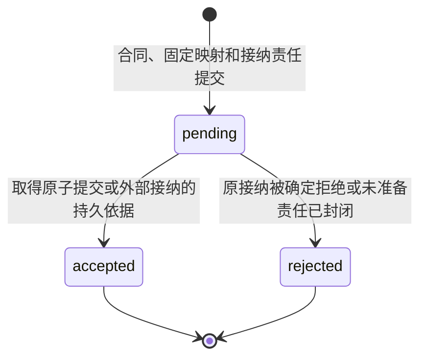
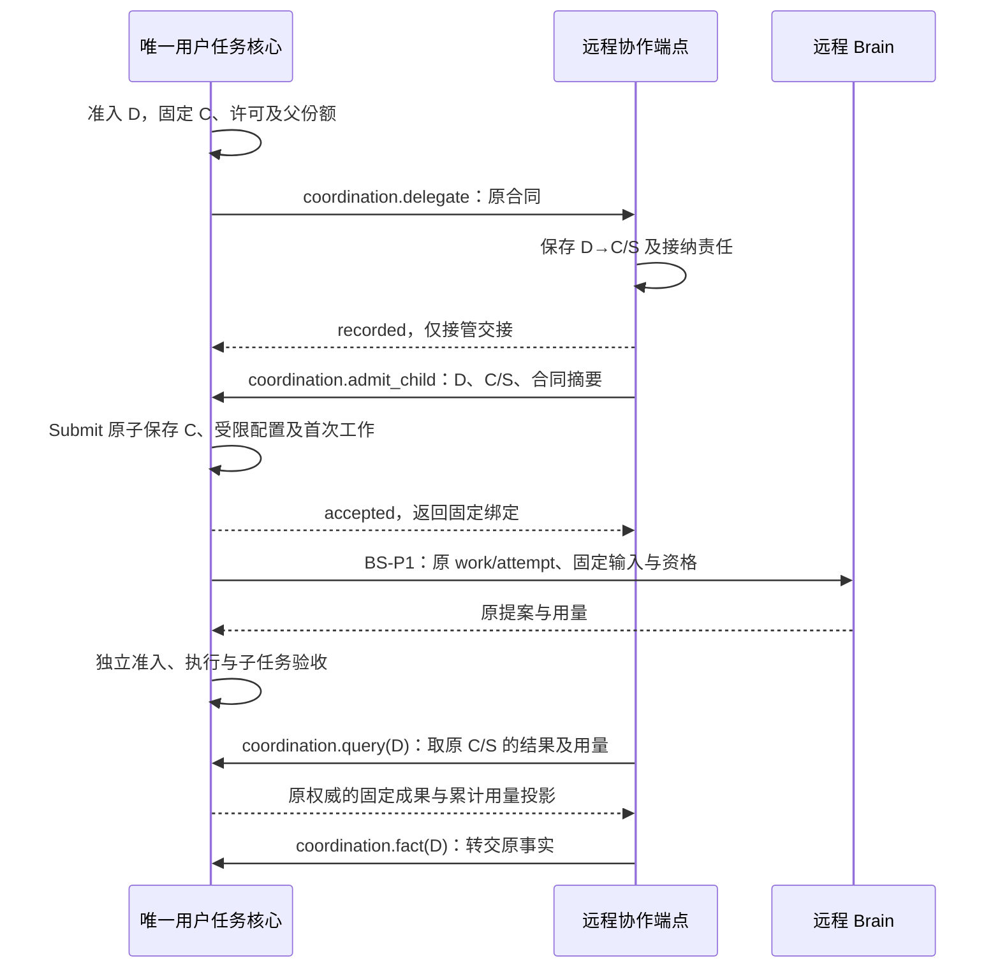
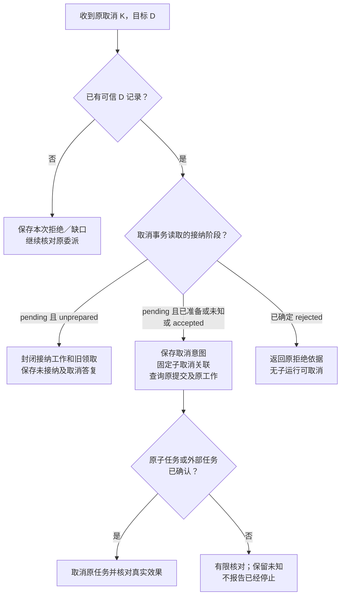

# 委派、结果与任务恢复

[总览](README.md) · [协作契约](peer-contracts.md) · [消息交付](delivery-and-recovery.md) · [验收](validation.md)

本页沿委派 D 展开处理链，字段以[协作契约](peer-contracts.md)为准。内部 Agent 的子任务 C 与父任务 P 共用固定内核写权威；外部 Agent 保留自己的原生任务身份，仅将与 D 绑定的事实交回父核心。两类路径都不把远端连接、接纳或自行声明成功当成父任务完成。

## 1. 从候选到可恢复的子工作

候选查询只读取当前用户可见的已安装声明。核心先 Resolve 固定 Agent 版本，检查目标类型、来源披露、授权收缩、预算上限和恢复能力；任一必要条件缺失，委派不进入派发批次。不能为了让批次通过，把 Agent 改称普通工具或删去查询／取消要求。

父核心按现有提案准入规则，原子保存 D、目标端点／Agent、内部子任务 C、预算份额和派发工作；外部模式固定原外部提交意图，不创建 Harness 子任务。工作者在派发准备时再次核对当前父控制、权限、期限和预算。准备之前取消可关闭工作；准备之后按可能已交接处理。

协作端点处理 Delegate 的顺序如下：

1. 核对受信用户、来源及父 D 的绑定，确认请求确由获准工作链路发起；先检查当前查询／处理权限，再查本地原回执。同 D 同意图返回原记录，同 D 异意图拒绝。
2. 首次接管核验准确 Agent 声明、合同、当前委派权限、保存用途和容量。内部模式分配并固定子提交 S；外部模式固定外部提交键。将合同、映射、pending 接纳和后续工作一起提交，成功才返回 recorded。
3. 接纳工作领取后，在 Delegation 事务中检查未被取消、启动期限未到、owner 及领取仍有效；记录 `may_have_sent` 和固定请求后才调用子核心或外部适配器。此前是 `unprepared`，不得仅凭网络未发出把已准备状态改回去。
4. 内部路径使用 C/S 和受信合同配置进入核心 Submit。核心任务、受限预算／策略及首次工作全部耐久保存后，端点才能保存 accepted 事实及父转交责任；提交结果未知则查询 S 与 C，查不到暂不释放份额。
5. 父核心 Observe 保存接纳事实后，端点结束对应转交工作。子生命周期、完成核验、取消及正式结果仍走原核心规则；端点只以查询和提交后通知更新投影。

步骤 4 的适配器必须证明核心使用的合同摘要、策略和预算与 D 相同。不能先用默认无限预算创建普通任务，再异步补限制。内部主体由受信宿主配置绑定，创建／委派使用父请求依据，子资源使用匹配子许可主体；不能把父请求的 actor 直接改名成子 actor 来冒充认证。

下图只建模委派的**接纳阶段**，不表示子运行状态、取消、效果或结算。pending 可以伴随未准备、已准备或提交未知，这些依据保存在独立字段中。

accepted 是原接纳事实，后来任务失败或取消也不改成 rejected。观察到记录暂时不存在、网络超时或外部 404，不能进入 rejected；只有原接纳入口确定不会晚提交时才能形成无接纳结论。合同的启动期限和原提交去重是这种核对的必要边界，不能靠发送方时钟单独推断远端已经封闭。

### 远程内部 Agent：交接远程化，任务权威不迁移

远程端保存 Agent 配置、D→C/S、输入／控制映射、原模型调用和待转交责任；唯一内核权威保存父子任务、操作索引、预算及终态。远程 Peer 只能凭原 D 请求受信子接纳，核心校验合同及预算后返回同一绑定。接纳不要求远端另装任务核心。

Submit 答复丢失先沿 S 查询，不新建 C。Brain 答复丢失按原调用核对，不能用另一个远端生成替身。核心失联时，远程 Peer 保留交接和有限核对；已经准备且资格仍有效的本地使用单元可按离线规则完成，但不能自己生成下一轮工作或接管父子任务。父子同权威预算的后续管理修订来自核心投影，原 D 的线合同保持不变。

## 2. 外部 Agent 的独立运行时

外部 Agent 的任务由其自己的运行时推进，本方只保存父 D 的委派关联、控制与事实。其 `foreign_task_ref` 包含固定服务身份、外部提交键和原生任务标识，既不充当 Harness 的 task_id，也不进入本方任务控制权路由。无需再创建一层复制外部状态机的代理任务。

只有已安装且通过契约验证的适配器可以提供该路径；它属于协作端点内部实现，可以调用外部原生协议，但必须独立满足全部要求。现有标准 WSS 不自动提供这些语义；没有适配器实现或所需授权证明就禁用外部委派。没有指定第三方协议，本方案不宣称与任何外部 Agent 产品已互通。

| 交接 | 外部适配器必须提供的依据 | 无法满足时 |
| --- | --- | --- |
| 原始提交 | 把 D 映射为固定外部提交键；服务受众、目标和来源不随重试改变；可靠按原键查询接纳 | 有副作用的外部提交不得靠重复 POST 猜测。不能核对或安全去重的目标不开放委派 |
| 原任务关联 | 外部接纳产生原任务 ID，映射与接纳事实同事务保存；响应丢失可由原键恢复 ID；取得 ID 前按 D、服务身份和原提交键转交未决／拒绝／缺口 | 保留 admission_unknown；不能因缺 ID 丢弃查询责任，也不能创建第二个原生任务 |
| 目标与权限 | 外部 actor、处理位置、来源和结果接收方可验证，许可及用途可落实，支持原启动期限 | 外部有不受本合同限制的用户凭据或任意出口时，不声称实现权限收缩；不能落实则拒绝该任务 |
| 进度及输入 | 使用原生状态及来源；普通补充输入须支持固定请求版本、暂停等待、原输入键查询与应用回执；新增权限走独立受信确认 | 不支持暂停和输入恢复的目标仅开放自主目标；需要交互则拒绝该配置，不能重复 POST 猜测是否已应用 |
| 结果与证据 | 固定结果版本、内容和来源；实际效果需独立可验证事实，外部 success 仅是报告 | 父核心返回证据不足或补取证；无法取得必要证据的目标预先不提供候选 |
| 取消与效果 | 原取消键、原任务查询、不可回滚效果和未明项分别可查；提前取消的保证明确声明 | 未找到不证明迟到提交受阻；有限查询原接纳，成立后再发新取消尝试 |
| 用量与再委派 | 原任务累计用量与上限；全部后代共享该份额和收缩授权，不得隐藏额外运行 | 要求 hard 上限却仅能估算时拒绝；本轮外部再委派后置，当前入口关闭 |

结果进入父核心前先验证固定生产者、原 D、原任务引用、内容完整性与披露权限。外部报告中的指令、工具建议或自评不获得执行权，也不作为授权／验收策略。要采取后续动作，必须由大脑提出、父核心正常准入。

### 外部普通输入与权限确认

外部适配器先固定 `(D, foreign_task_ref, foreign_request_id, request_revision)`、字段模式、来源、截止和等待屏障，再向父核心登记输入事实。核心按已安装输入策略创建关联的 input_request_id；UI 只展示获准投影。普通输入进入核心后，耐久消费方 Peer 保存原 input_command_id 与转交工作，随后调用外部原输入入口。本方接纳与外部应用分别有回执；外部超时按同键查询，不能换键再答一次。请求被替换、父取消或截止到达后不发送新答复；可能已发送的原答复仍核对，迟到结果不重开父任务。

外部配置必须证明暂停后不产生新的目标行动、输入提交去重及原回执恢复；否则只允许无需交互的目标。pause 接纳和实际停止新行动分别可查，暂停不承诺在途调用终止；resume 需要当前任务控制、权限、预算和原截止全部有效。

权限请求不作为普通输入值交给外部。受信身份入口显示精确主体、资源、用途、接收方和期限，批准后身份权威签发原 confirmation_id 关联的受限 grant。核心以新的控制 K 发送 resume，authorization_resume 固定外部请求版本、confirmation_id、意图摘要及 grant_ref／version／proof；Peer 查询身份权威并核对原暂停等待，实际使用仍走 BeginUse。这些字段不允许普通输入伪造，也不自行产生许可。该依据必须属于原 D 的固定目标、权限及预算上限；若需扩展任何上限，旧 D 的新行动保持关闭，由父核心按新用户决定准入新 D2。原任务、外部任务和已发生效果不改名搬入 D2，也不借新许可恢复已经截止的旧请求。

## 3. 结果收集与预算结算

同宿主内部端点订阅提交后通知以降低延迟，同时按已知 C 和未完成 PeerWork 有界查询；远程 Peer 向唯一 task_authority 的 coordination.query(D) 读取 C/S 对应的原状态、正式成果和用量，权威验证 D 及原调用方。通知丢失仍能沿该原关联恢复。外部端点沿原任务读取。进度仅用于展示和唤醒，正式结果及账单有独立持久转交责任，不能只靠临时增量。

端点提交 PeerFact 与父转交工作后调用 Observe；父核心的持久确认丢失时重交同一事实。父核心按生产者／原事实身份去重，状态修订不回退，内容冲突保存并关闭依赖它的后继行动。结果超出消息交付窗口，仍按合同保留期读取原成果；结果本身、当前任务状态和内容字节可用性分别确认。

父核心使用子成果时复核完整来源、用途、目标绑定、固定验证器及成果版本。内部子任务完成也不替代父验收，外部自行报告完成更不具备该效力。对写文件或设备操作，缺执行后的观察就保持效果未明。子输入材料被撤权而报告未列引用时，仍按完整来源闭包处理，不能相信 Agent 自行缩小来源集合。

预算维度分别按以下规则结算，目标和收尾用途也分别计算。下面 B 是父已分配份额，u 是该委派已确认累计用量，均为同单位整数：

| 时点 | 父账本变化 | 约束 |
| --- | --- | --- |
| 准入 D | 为 D 预留 B；其他工作只用剩余额度 | 子获得这一份 B，不再向用户总额申请第二份 |
| 收到较新合法累计 u | 只将新增差额转为 settled；未最终封账时 reserved 保持 B−u | 必须满足 0 ≤ 旧 u ≤ 新 u ≤ B；重复不双计，跳过中间报告可用完整累计值恢复 |
| 最终封账且 u 确定 | settled 为 u，释放 B−u | final 由可信账本／提供方保证，无后续计费或未知账单；不以子终态代替 |
| 明确未接纳且入口已封闭 | 释放确定未用的份额 | 有外部接纳费用时仍须先结算；提交未知不释放 |
| 报告冲突、超出 B 或来源不可信 | 不按可疑报告释放预算；保存违例并停止新委派，继续核对 | 超额真实费用须作为违例记录，不能声称硬上限仍成立或归入其他任务 |

内部预算投影从运行账本读取，父的委派聚合项与子叶调用不可在用户总量中相加两遍。多层内部委派沿直接父级累计汇总；叶记录保留成本来源，仅根聚合占用用户份额。父任务可以终态而用量仍未知，此时预留继续存在；有限核对耗尽也不能自动返还。

收尾额度不是无限恢复许可。父对子查询／取消消耗父收尾份额，子自己停止与核验的费用消耗合同中的子收尾份额，沿费用生产者及原调用归属一次记账。同一费用不能两边都收，也不能将目标行动改称核对挪用收尾额度。

## 4. 取消先到、接纳未知与迟到结果

父取消首先由父核心完成自己的屏障：停止新目标准入／准备、隔离旧领取、保存每个可能在途 D 的取消和核对责任。协作端点不能直接改父任务；即使子失联，父也可按[内核规则](../task-kernel/lifecycle.md#cancel)进入 cancelled 并保留 effects_pending。

协作端点的取消与接纳准备串行更新同一 Delegation。下图聚焦该本地提交边界，`may_have_sent` 包括已经准备但尚未真正调用的情况。

pending／unprepared 分支在同一事务中使接纳工作不可再准备、旧领取失效，并保存确定未接纳及答复，因此可以阻止迟到接纳。它只适用于本端已知 D，不能将这一内部保证推广到普通 task.cancel 或外部协议。

接纳已准备时，协作端点固定内部子取消操作，映射到原 C；它与父取消 K 分开，避免重复使用内核用户级操作 ID。C 尚不存在时，子 Cancel 可能明确拒绝；该次拒绝答复固定，不能改写成成功。端点继续查 S；后续 C 出现且仍需取消时，建立新的子取消尝试并绑定同一 K、D 和前次拒绝依据。次数、期限和收尾额度有限，不以查询失败不断生成取消请求。

D 记录尚不存在时，不凭任意 ID 建永久取消墓碑。只有父核心的受信原 D 关联才允许保存核对责任；本次 Cancel 拒绝不表示后来 D 不能接纳。父核心沿原 D 核对，D 出现后可根据新的事实创建另一次明确取消尝试。跨端乱序同样遵守这一规则，不依赖控制流一定先于工作流到达。

| 同一贯穿场景的中断点 | 后续责任与可以确认的结论 |
| --- | --- |
| D 接管提交成功，recorded 响应丢失 | 父工作沿 D 重交或查询；端点复用 S，只创建一次 C |
| C/S 已创建，accepted 响应丢失 | 端点核对 S 与 C，不从 pending 推断未运行；父预留不释放 |
| 父取消提交，子已完成且结果未返回 | 收集获准结果、来源与用量，父仍 cancelled；不恢复父目标工作 |
| 子正在执行设备动作，取消答复丢失 | 沿原子取消与执行操作查询；“取消已接纳”不证明外部停止，未知效果继续挂账 |
| 结果／账单到达，父转交确认丢失 | 重交相同事实，父核心按原键去重，不重复唤醒已经结束的目标工作或双计费用 |
| 撤权后旧结果待重投 | 停止不再获准的正文传送；保存最小关联和披露缺口，控制与核对按各自权限继续 |

Peer.ReadControl／ReadCancel 按原 K 保存并查询固定协作答复；内部子取消使用任务侧完整控制答复查询，外部沿原适配器查询。消息超窗后查询原固定记录，记录已清理或无披露权时返回明确缺口，原答复与当前效果分开，不根据后来状态伪造过去的答复。

## 5. 有限恢复和处置入口

启动时先确认本方写权威、端点活动 owner 及协作账本，再扫描未知提交、取消、待转交结果和未封账用量。新 Agent 升级或路由变化不替换原声明与原目标；未决版本须保留可查询适配器，无法安全加载时保存缺口，不重新开始另一轮委派。

每项 PeerWork 保存次数、下次时间、绝对截止、有限查询成本与唤醒条件；采用有上限且带抖动的退避，重启不重置。已确定受阻项不占工作者槽位，连接或权限通知只唤醒重新检查，不能直接启动行动。期限到或额度耗尽时结束主动查询，保存一次去重通知、原 D／S 或外部引用、缺什么证据和能去哪里查。获准被动结果仍可接纳。

受信宿主按[管理接口契约](peer-contracts.md#interfaces)提供 Peer.ReadPending 和 Peer.Recheck。Recheck 仅恢复原对象的有限核对，不新建任务或扩额；工作及命令回执同事务保存，重复返回原责任。过期／取消的新行动继续受限，获准收尾可核对；无剩余核对额度时只展示限制，不能靠按钮绕过它们。

用户可从原任务 Pause／Resume／Cancel、身份 Revoke 或执行端本地接管入口控制工作。可验证补证交原领域裁决，不允许人工标注未知外部效果为成功。内部父子预算变更只由同一权威的预算管理事务处理；外部委派不得原地扩目标、权限或额度，须新受信委派并保留旧责任。强制迁移后置，不能以“人工解决”假定责任结束。

## 6. 端云部署、离线与所有权

逻辑位置与职责分开，在受信宿主内装配协作端点、事务记录、有限工作者、授权接口和 Agent 配置；协作端点可跨端承担交接责任，用户任务权威保持固定。任务内核可部署于端侧或云端，父子 Harness 任务仍使用同一用户写权威；网络消息、权限和能力接口是否已具备决定具体部署可开放的范围。

| 部署情形 | 可继续的行为 | 不能推导的能力 |
| --- | --- | --- |
| 全部权威在端侧且本地依赖齐备 | 有效授权下的内部 Agent 任务、结果及取消；联网检索仍需网络 | 本地身份不能冒充原云账户授权权威 |
| 任务权威在云端，执行在端侧 | 云核心推进，端侧按已接纳操作执行；重连先核对控制与事实 | 云失联不产生第二个本地任务权威 |
| 内部 Agent 配置指向另一设备 | 远程协作端点按 CO-P1 接管；回固定 task_authority 接纳 C/S，核心按 BS-P1 调远程 Brain，再准入后续操作 | 远端只持有交接、配置及调用记录，不持有第二任务权威，不能自行开启子决策循环 |
| 外部独立运行时 | 仅在经过验证的适配器合同内继续原生任务 | 外部不能申请本方 owner_epoch 或用原生 ID 接管本方任务 |
| 网络断开、已获准本地工作 | 仅在全部离线条件成立时继续已接纳范围，结果保存在获准本地账本 | 断线不能自动扩权、重新分预算或替换未知原操作 |

离线条件采用[授权离线机制](../identity-and-authorization/mechanisms.md#offline)：当前 owner、唯一防回滚账本、可信时间、许可明确允许且未到期、处理位置与数据、本地能力、剩余预算和控制／委派资格须同时成立。首期不在失联状态新签子许可或扩大委派；有效既有子工作仍逐次落实许可。离线许可到期停止新使用，已经发生的效果继续核对；父失联不把父控制权交给子。

重连先关闭需要新鲜控制的行动，按本轮分别取得授权、任务取消、原操作及必要领域依据。结果上传、长期保存和记忆写入分别授权。若外部系统不能在撤权或截止后约束新行动，其声明必须准确说明传播边界；要求即时停止的任务不能选择它。

任务所有权移交继续沿[现行冻结与唯一生效约束](../task-kernel/recovery-and-validation.md#ownership)，本方案首期不启用，也不实现超时抢占。端点活动所有者接替、工作租约和任务 owner_epoch 是三个不同资格；恢复网络连接不能取得其中任何新权力。跨权威设计方向及具体影响见 CO-P2。

## 7. 容量与观测

本模块默认使用宿主已有事务存储，满足[协作记录](peer-contracts.md#storage)的唯一约束、条件提交与耐久回执。没有证据要求额外分布式注册中心、独立队列或多写者存储；替换实现须保留同一接口与恢复行为。

启动配置必须明确每用户活跃委派数、并发接纳数、子任务深度／数量、每份输入／结果字节数、事实页大小、未转交记录数及字节、查询次数／期限、工作领取期、原合同和结果保留期。深度同时受内核和授权链限制。所有值是有限配置，不能由十万在线目标直接推导；数值在参考实现测量后确定，没有配置则不接纳新委派。

新接管前同时检查用户、目标 Agent 及端点的额度，并为接纳答复、取消、结果／账单转交和缺口保留空间。满额明确拒绝新工作，已接纳责任仍可扫描；临时进度先合并，不能删除正式结果责任腾空间。控制与收尾必须有有限独立份额，用户轮转避免单用户历史恢复占满全部工作者。

观测关联用户的获准标识、P、D、内部 C/S 或外部原任务引用、取消尝试、事实键、用量修订和消息 ID。分别记录交接耗时、业务接纳耗时、子运行时长、结果等待、未知预算、取消收敛和缺口年龄；日志不复制凭据、私密上下文或模型隐含推理。链路观测可用于定位，不能代替原账本证明接纳、效果或结算。
