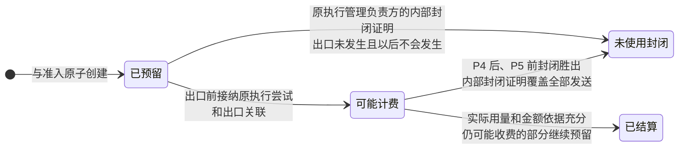

# 预算

| 日期 | 修订说明 |
| --- | --- |
| 2026-10-04 | 初版：额度维度与恒等式、预留与结算、计费来源身份、迟到与更正、退款与额度分离、层级分配、离线分配。 |
| 2026-10-04 | 按 `CLAUDE.md` 写作要求和[文档规范](../../conventions.md)修订用语：约束统一为"必须／不得""建议／不建议"，不再使用"应"；"执行端"统一为"执行端点"，发布回滚统一为"回滚"，授权统一用"撤销"。设计内容不变。 |
| 2026-10-04 | 按[第四轮评审处理记录](../../../review/archive/round-4/disposition.md)修订：调用次数按实际发送占用，与模型调用位置分开（R4-03）；未使用预留凭原账本的内部封闭证明释放（R4-05）。 |
| 2026-10-05 | 可读性：2.4 增加预留的状态图。规则不变。 |
| 2026-10-05 | "可准入／阻塞"写明是计算出的准入资格，并补控制状态 `OPEN → CLOSED`；命令回执改为核心契约的决定回执加预算处理结果。 |
| 2026-10-05 | 模块名称统一为“执行网关”，职责与契约不变。 |
| 2026-10-05 | 模块名称统一为“执行管理”，同步模块简称与图示；存储和连续性语境中的“账本”指其持久执行记录。职责与契约不变。 |
| 2026-10-05 | 模块名称由执行网关改回出口闸门，避免与网关与 SDK 撞名；调整执行管理负责方的拗口措辞；职责与契约不变。 |
| 2026-10-06 | 按[第五轮评审处理记录](../../../review/disposition.md)修订：出口关联、发送额度和本次金额覆盖并入开始门禁的同一事务，安全重发在 P4 追加预留（X-12）；补"可能计费 → 未使用封闭"（BG-02）；离线分配不能代替开始门禁（X-04）。 |

- 状态：草稿
- 负责满足：G10；协同落实 G3、G4、G5、G12
- 涉及场景：S1–S8，重点 S4、S5、S7
- 上游：[项目目标](../../project-goals.md)、[分层与模块](../../layers.md)、[核心契约](../contracts/README.md)、[任务编排](../tasks/README.md)

预算回答两个问题：**这一步还花得起吗**，以及**实际花了多少、每一笔都只算一次了吗**。

本设计的选择：

- 准入时，在裁决域事务内按费用上界**原子预留**；用量回报后**结算**，确认未消耗的部分才释放；
- 每笔实际费用有**稳定的计费来源身份**，同一费用无论从多少渠道回报都只算一次；
- 结算记录**只追加**，更正以版本加差额的方式记录；
- **退款和贷记单独记录，不会自动恢复可用额度**。要增加额度，必须由用户单独调整；
- 子任务和离线使用的额度通过**显式分配**获得，分配不会凭空创造额度。

**硬上限的准确含义**是：核心不会准入超出可用额度的费用责任；在供应商的计费约束成立时，实际费用不超过上限。供应商事后改价、追加收费或超出声明的上界时，真实费用照常入账、缺口如实显示，相关的新准入停止。预算不会通过拒绝记账来"守住"上限。

结算的含义是"费用事实和额度占用已经持久更新"，**不是发起付款**。申请退款、撤销付款都是新的动作，必须重新准入。

## 1 职责与边界

| 模块 | 持有或裁决的事实 | 与预算的分界 |
| --- | --- | --- |
| **预算** | 额度、层级分配、预留、实际用量、计费来源身份、结算、更正、退款与贷记 | 唯一的费用事实写入方；判断额度够不够、哪些额度仍被占用 |
| 任务编排 | 任务、条件、准入决定、取消、Result | 在裁决事务中调用预算；决定是否行动、是否完成 |
| 授权 | 授权、撤销、出口凭据 | 额度充足不代表有行动权限；预算不签发授权 |
| 执行管理 | 执行尝试、效果、迟到可能性、核对 | 提供执行证明和封闭证明；"已扣费"不代表"动作已生效" |
| 出口闸门 | 核验和执行通道 | 出口必须绑定有效的预算依据并回报用量；不得直接改余额 |
| 执行适配器和供应商接入 | 原始用量、收费回执、账单、查询结果 | 只能回报；计费规则的转换必须通过契约检查 |
| 内容治理、运行记录 | 原始账单等证据；跨模块关联 | 原始账单按内容规则管理；运行记录不是费用的权威来源 |

预算与任务编排、会话、授权同在一个裁决域。共用事务不改变 R3：预算的数据只能经过预算的实现写入。

计量、定价、出账、付款和预算准入是不同的事。Stripe、OpenMeter、Lago 这类计量和出账系统可以作为参考或对外投递的目标，但 Lerna 的额度、计费来源和结算事实由预算模块自己持有。原因见 7.2。

## 2 对象与状态

### 2.1 额度维度与恒等式

额度按维度表达，每个维度分别检查，例如总金额、模型金额、工具金额、外部付款金额、某个模型的输入或输出 token 上限、某个工具的调用次数或执行时长。金额带币种和精度，用整数或精确定点数表示，单价可以用精确比例；**不使用二进制浮点数，不同币种不直接相加**。

对每个预算的每个维度：

| 量 | 含义 |
| --- | --- |
| `L` | 已授予的额度 |
| `U` | 已消耗的额度，包括子任务的消耗 |
| `H` | 尚未确定或尚未结清的预留，包括子任务的预留 |
| `D` | 已分配给子任务、但尚未被子任务消耗或预留的容量 |
| `A` | 可用于新准入的额度，`max(0, L − U − H − D)` |
| `deficit` | 超支或降额后的缺口，`max(0, U + H + D − L)` |

正常情况下 `L = U + H + D + A`。直接子任务尚未使用的容量是 `D_父 = Σ max(0, L_子 − U_子 − H_子)`。子任务预留或消耗时，在同一事务中更新祖先的数字。**一笔实际费用只有一条来源分录**；各层的数字是包含关系，不得把各层加在一起再算一遍。离线分配关联的是已有的动作预留，金额已经计入 `H`，不得再加进 `D`。

**单个计费来源的已消耗额度**取：

```text
U_来源 = 该来源历史上被接纳的可信费用金额中的最大值
```

向下更正、退款和贷记都不降低它；向上更正只增加超出原最大值的那部分。这样，金额在 60 → 50 → 60 之间来回更正，额度消耗仍是 60，不会变成 70；也不会因为一次向下更正就自动恢复额度。本地估计只影响预留，不进入这个最大值。

### 2.2 记录

所有可变记录带 `user_id`、版本和裁决序号；时间字段区分发生时间和接收时间。

| 记录 | 关键字段 | 约束 |
| --- | --- | --- |
| 预算 | 预算标识、父预算、关联任务、各维度额度、额度版本、准入状态、阻塞原因 | 归属用户和父关系固定；同一用户的预算构成无环树 |
| 额度调整 | 命令标识、操作者、授权引用、旧值、新值、理由 | 不会由退款事件自动生成；降额不抹掉已有责任 |
| 分配 | 分配标识、父子预算、分配量、状态、版本 | 分出前检查父预算可用量；收回前证明不会再有后续消费 |
| 计费约束 | 计费规则版本、供应商账户、模型或工具版本、用量包含关系、价格版本、上界及其依据 | 上界只是估计或无法确定时，不得用于硬上限准入 |
| 预留 | 预留标识、准入标识、动作标识、条件和授权引用、上界、剩余预留、计费约束引用、状态 | 与准入原子创建；**超时不自动释放** |
| 出口关联 | 出口调用标识、原执行尝试、端点、预留、参数摘要 | 实际出口之前持久登记 |
| 计费来源 | 内部来源标识、原预算和任务、供应商计费命名空间、原生来源身份、费用项目、当前版本、可信费用值、已消耗额度 | 一个来源不得被改绑到另一个任务或用户 |
| 来源别名 | 内部来源、出口调用标识、供应商请求标识、账单行身份或覆盖关系 | 每个别名只有一种解释；冲突必须核对 |
| 用量回报 | 回报标识、来源、版本或前驱、原始用量和规范化用量、累计还是增量、价格版本、证据引用、处理状态 | 同一回报身份携带不同语义时报冲突 |
| 结算分录 | 分录标识、来源、来源版本、类型、金额和用量差额、原分录引用、裁决序号 | 只追加；分录的唯一约束和余额投影在同一事务更新 |
| 退款与贷记 | 标识、原来源、对应的经济调整、对应的现金返还、金额、状态、证据 | 同一次经济调整只减少一次净费用；不增加可用额度 |
| 离线分配 | 分配标识、固定端点、预留清单、每个动作的额度、出口约束、端侧接纳回执、消费序号、封闭证明 | 不得用于断网之后的新准入；失联时不收回 |
| 待核对 | 来源、缺失的身份或版本、差异、负责方、下次处理条件 | 持久保存；任务关闭也不删除 |

### 2.3 计费来源身份

规范的来源身份由四部分组成：**供应商计费命名空间 + 计费账户 + 原生计费实例 + 费用项目**。用户归属由出口关联和可信的账单匹配确定，不接受回报方随意指定。

规则：

1. 出口之前先持久生成内部来源和出口调用标识；供应商身份返回后登记为别名；
2. 回报事件的标识、任务标识、接收时间、参数内容哈希，都不得单独作为实际计费的身份；
3. 参数相同的两次真实收费分别记录；同一笔费用的不同回报合并到同一个来源；
4. 单次请求的回执和汇总账单之间可以是"覆盖"关系，汇总账单不得再整体作为一笔额外费用计入；
5. 只有汇总金额、无法证明覆盖了哪些调用时，差异进入待核对，不得凭金额相等自动匹配；
6. 来源身份和必要的去重记录不随任务关闭而清除。它们属于**最小责任记录**：不含原始账单和提示词正文，删除内容时保留，有独立的用途和期限。

共享供应商账户时，必须有可信的逐调用用户关联；关联不上就不得宣称满足 G12 的费用隔离。

CloudEvents 用 `source + id` 标识事件，并且允许同一次实际发生产生多个事件（[CloudEvents v1.0.2](https://github.com/cloudevents/spec/blob/v1.0.2/cloudevents/spec.md#id)）。模型回执、供应商账单和核对结果可能都在报告同一笔费用，所以不得分别按各自的事件标识计费，这就是要单独定义"计费来源"的原因。

### 2.4 状态转换

"可准入"和"阻塞"是根据控制状态、余额和冲突**计算**出的准入资格，不是控制状态：`OPEN` 的预算也可能阻塞；解除阻塞不会重新打开 `CLOSED` 的预算。

| 对象 | 转换 | 条件 |
| --- | --- | --- |
| 预算 | 可准入 → 阻塞 | 额度不足、身份冲突、费用上界失效或用户控制 |
| 预算 | 阻塞 → 可准入 | 缺口有证据地解决，或用户显式调整额度；不由退款直接触发 |
| 预算控制 | `OPEN → CLOSED` | 见[核心契约 2.5](../contracts/README.md#25-状态模型)；关闭不可逆，关闭后仍接受已发生的费用 |
| 预留 | 已预留 → 可能计费 | 开始门禁（P4）在同一裁决事务中登记了原执行尝试和出口关联；P4 被拒绝时什么都不登记 |
| 预留 | 已预留 → 未使用封闭 | 执行管理证明出口没有发生，以后也不会发生（原执行管理负责方的内部封闭证明，见[执行管理 2.3](../ledger/README.md#23-收尾依据)） |
| 预留 | 可能计费 → 未使用封闭 | P4 已通过、P5 尚未成立，执行端点确认封闭胜出，原执行管理负责方出具覆盖全部相关尝试和发送的内部封闭证明。取消记录或一次 P4 拒绝不能代替这份证明。已进入"可能已发出"的发送继续占用调用次数和金额 |
| 预留 | 可能计费 → 已结算 | 实际用量和金额依据充分；仍可能产生的收费继续保持预留 |
| 来源 | 身份待定 → 已关联 | 原生身份与原出口有可信的对应关系 |
| 来源 | 待结清 → 已结清 | 计费范围和金额已确定 |
| 来源 | 任意 → 待核对 | 身份、版本、用量或价格出现冲突 |
| 已结清的来源 | 接纳后续更正 | 追加关联分录；不重新执行原动作 |
| 离线分配 | 已登记 → 端侧已接纳 → 封闭核对 → 结清 | 持久接纳、消费记录完整、证明不会再有后续消费 |

下图是预留的状态转换。超时、取消和任务关闭都不会释放预留；只有原执行管理负责方证明出口没有发生、以后也不会发生，才释放未使用的部分。



"已结清"描述的是当前的费用依据，不得用来拒绝以后合法的更正。

## 3 接口

所有改变状态的命令都包含用户、调用主体、命令标识、契约版本、相关的预算或来源、必要的预期版本、语义指纹和关联记录。同标识同输入返回原回执，不同输入报冲突。回执使用核心契约的决定回执（`ACCEPTED` 或 `REJECTED`）。接受时附带预算的处理结果：**已应用**，或**已接纳待核对**——预算已经持久接下处理责任，金额尚未核对结清。重复提交返回原回执，并标明这是重放。

| 接口 | 输入 | 成功含义 | 主要错误 |
| --- | --- | --- | --- |
| 调整额度 | 预算、目标额度、预期版本、操作者及授权、理由 | 新额度版本已持久保存；低于现有责任时停止新准入 | 无权限、版本冲突、单位非法 |
| 分配或收回额度 | 父子预算、分配量、版本；收回时附封闭证明 | 分配关系和双方的数字原子更新 | 父额度不足、跨用户、存在未结责任、证明不足 |
| **准入内检查与预留** | 当前条件、授权、确认、动作、计费约束、上界 | 预算依据随整个准入事务一起生效 | 额度不足、上界不确定、条件或授权过期、预算阻塞 |
| 接纳执行证明 | 原尝试、出口调用、预留、端点；或"未使用"的封闭证明 | 出口关联已持久登记，或未使用的预留已安全释放 | 绑定不符、执行版本过期、已封闭、证明不足 |
| 接纳费用回报 | 来源和别名、版本、用量或金额、价格依据、证据；支持更正、退款、贷记 | 分录和余额已更新，或已持久进入待核对 | 伪造来源、跨用户、同身份不同内容、版本冲突 |
| 登记离线分配、接纳封闭回报 | 固定端点、已准入的预留清单；之后的消费序号和封闭证明 | 分配已占用并可交接；或已结清、可释放的部分已释放 | 未准入的动作、端点不符、序号缺口、无法排除后续消费 |
| 查询预算、来源或原命令 | 用户、对象、读取授权、查询范围 | 带裁决序号的额度、费用、未定项和原回执 | 无权限、不存在；不泄露其他用户对象是否存在 |
| 费用与阻塞通知 | 来源变化、缺口、未定项、裁决序号 | 待办已登记；接收方可按序号补查 | 投递失败由持久工作恢复 |

**"准入内检查与预留"不是一个独立的远程准入操作。**它必须参与任务编排所在的裁决事务，否则条件、授权、确认和预算无法原子检查。

实际费用已经发生而额度不足时，费用回报**必须接纳**，并返回缺口和阻塞状态；不得以"余额不足"为由拒绝记账。

## 4 关键流程

### 4.1 准入、执行与结算

| 步骤 | 处理 | 持久化 |
| --- | --- | --- |
| 1 | 核心根据动作参数和固定的计费约束计算费用上界。估计值可供推理规划，但不得代替确定的上界 | 计费约束版本和上界依据 |
| 2 | 任务编排检查条件、授权、确认和预算；预算检查全部相关维度 | **裁决事务**：预留、准入决定、动作意图、待办工作、命令回执一起提交 |
| 3 | 执行管理按 R7 接纳原意图；执行前固定尝试和发送身份（P3） | 执行管理域事务 |
| 4 | 开始门禁（P4）在裁决域的同一事务中：核验当前授权、动作状态和参数；占用一次实际发送额度；登记本次发送的出口关联；确认预留金额覆盖本次发送的费用上界，不足时按确定的上界追加预留，追加不了就不开始。调用次数按**实际发送**计：每个新的发送身份（包括执行管理批准的安全重发）占用一次；查询或重投同一发送不重复占用。模型调用的"调用位置上限"由任务编排另行计数，不与这里混用 | **裁决事务**：开始回执、发送额度、出口关联、追加预留一起提交；之后执行管理才写"可能已发出"（P5） |
| 5 | 用量回报交给预算；预算校验身份、版本、用量关系和价格依据 | **裁决事务**：回报、来源身份、分录、余额、核对待办、回执一起提交 |
| 6 | 可信的实际费用替换相应的预留；未确定的部分继续占用；确认未消耗的部分释放 | 结算分录和预留变更 |
| 7 | 执行管理继续处理效果；任务编排按 G2 判断完成 | 预算只提供费用状态，不写效果或任务终态 |

第一轮推理的模型调用，以及标题、摘要、嵌入、评测等辅助调用，都先走这条准入路径（G4、G5、R2）。

### 4.2 各类费用怎样计量

| 类型 | 计量与定价 | 迟到、重试与取消 |
| --- | --- | --- |
| 模型 token | 保留供应商的原始字段；按版本转换普通输入、缓存输入、输出及其子项；价格绑定模型、服务档位和计费规则版本 | 累计值按来源版本更新，**不逐帧相加**；流中断时保留未定的费用 |
| 模型内置工具 | 作为供应商的独立收费项目记录；已含在某项价格里的不重复计费 | 计费约束必须覆盖供应商内部的调用次数或总费用 |
| 工具调用费 | 按真实的计费单位：每次调用、执行时长或资源量 | 失败、超时、取消都不等于免费；持续收费的必须有明确的结束依据 |
| 外部付款 | 本金、手续费、税等按实际账单的项目和包含关系记录 | 付款效果由执行管理核对；不得从账单推断下单成功 |
| 外部 Agent | 区分直接向用户收费的委派金额和已包含在报价内的内部用量 | 内部用量可用于观测；已包含在委派账单里的不再另计 |
| 零费用出口 | 仍然关联预算，并声明零费用的依据 | 声明不得抵消后来发现的真实收费 |

以 Claude 为例：流式响应中 `message_delta.usage` 是**累计值**；预先的 token 计数只是估计；缓存读取、缓存写入和普通输入是不同字段；网页搜索等服务端工具会产生 token 之外的费用（[流式用量](https://platform.claude.com/docs/en/build-with-claude/streaming)、[token 计数](https://platform.claude.com/docs/en/build-with-claude/token-counting)、[缓存字段](https://platform.claude.com/docs/en/build-with-claude/prompt-caching#tracking-cache-performance)、[搜索工具费用](https://platform.claude.com/docs/en/agents-and-tools/tool-use/web-search-tool#usage-and-pricing)）。所以适配器必须声明哪些字段是累计值、哪些是增量、字段之间是什么包含关系；不得逐帧相加，也不得把"总输出"和其中的推理 token 再加一遍。

**效果幂等不等于费用幂等。**同一动作的安全重发如果会另外产生调用费，必须在它的 P4 中登记新的出口计费关联，并确认或追加相应的预算容量（见 4.1 第 4 步）；而同一份用量回报重复送达，不增加费用。

价格和舍入遵循供应商的计费范围。不得逐 token 舍入到"分"，再把舍入误差当成实际费用；汇总的舍入差额要有账单依据，并关联到它覆盖的范围。

### 4.3 迟到、更正、退款与贷记

1. 迟到的回报继续关联原用户、原任务、原来源，任务关闭不影响接纳；
2. 有可靠的前驱关系或版本次序时，追加相对于已接纳版本的差额；缺少必要版本时，先保存再核对，**不按接收时间决定哪份账单是对的**；
3. 向上更正增加未计入的费用和额度消耗；额度不够时如实记录缺口，阻塞相关的新准入；
4. 向下更正减少财务上的净费用，但已消耗额度不变；
5. 贷记单和退款如果对应同一次经济调整，前者记录费用调整，后者记录返还的落实，不再减少第二次净费用；
6. 申请退款仍是新动作；预算接纳退款事实，不会自动发起补偿。

示例（不考虑子任务）：

| 事件 | 已消耗 `U` | 预留 `H` | 可用 `A` | 财务记录 |
| --- | ---: | ---: | ---: | --- |
| 额度 100，预留 30 | 0 | 30 | 70 | 还没有实际费用 |
| 确认实际费用 25，释放未消耗的 5 | 25 | 0 | 75 | 原费用 25 |
| 贷记 10，随后收到对应退款 10 | 25 | 0 | 75 | 净费用 15，已返还 10 |
| 用户另行把额度调整为 110 | 25 | 0 | 85 | 费用和返还记录都保留 |

外部系统在这件事上的做法各不相同，这也是预算必须自己持有费用事实的原因：Stripe 只能取消最近 24 小时内发送的计量事件，已进入最终账单的用量取消后不会更新那张账单；它允许负用量，但周期总量为负时账单数量显示为零（[Stripe 更正用量](https://docs.stripe.com/billing/subscriptions/usage-based/meters/configure#fix-incorrect-usage-data)）。Lago 对已出账周期的迟到事件不计入原周期（[Lago 迟到处理](https://getlago.com/docs/guide/events/ingesting-usage#handling-edge-cases)）。这些周期性的出账规则都不能代替 G10。

### 4.4 子任务分配

- 创建或增加分配时，在裁决事务中检查父预算的可用量，同时登记父子关系；
- 子任务只能使用自己的分配；需要更多时向核心申请，不得自行扩大；
- 父任务取消后停止新的消费准入；已发生的费用和未定的责任仍然关联原子任务；
- 只能收回尚未消耗、并且不可能再有后续消费的容量。

### 4.5 离线分配

**离线分配不能代替开始门禁。**默认部署中裁决域在云端，断网期间尚未取得开始回执的动作一律不开始（[执行管理 4.5](../ledger/README.md#45-端侧补传与云端对账)）。离线分配只用于断网前已取得开始回执、断网期间完成发送的动作的费用归属与结清；它不授予任何新的开始资格。是否在 M3 保留这一机制，随端云方案一起确定。

断网时能消费的，只有**断网之前就已取得开始回执**的有限动作：

1. 云端为这组动作完成准入和预留，固定动作、端点和每项上界；
2. 云端持久登记交接，端侧执行管理持久接纳，云端保存回执（R7）；
3. 端侧出口闸门只接受这组既有动作；每次本地消费前原子记录尝试和消费序号；
4. 云端持续占用未结清的预留，**不因为没收到回执、超时或端点失联而重新分配**；
5. 重连后补传原记录，预算按来源去重、按版本结算；授权和任务状态由各自模块核对；
6. 端侧提交封闭和完整的消费记录；预算确认序号无缺口、不会再有后续消费之后，释放确认未使用的部分。

离线额度必须先从全局可用量中划出，失联不得成为收回额度的理由。有界计数器的研究给出了这类做法的理论依据：预先分配可消耗的权利，就能在分区期间维持数值约束，本地额度不足时操作失败（[Balegas 等，2015](https://arxiv.org/pdf/1503.09052v1)）。但论文假设各副本的本地修改有序、状态可靠保存，这一前提在手机上需要另行验证（见 H5）。

离线执行还要满足授权的当前有效性：本地无法证明当前授权有效时，即使有预算分配也不得发出（预算分配不能代替授权）。

### 4.6 任务关闭与费用责任

任务效果已经确定而账单尚未结清时，可以处于"任务已完成、费用待结清"的状态；能否成功仍由任务编排按 G2 判断。预算不要求所有供应商的月度账单都到齐才允许任务完成。Result 关闭后保持固定，后来的费用更新进入预算和关联的运行记录，不会重新打开任务或重新执行动作。

必要的核对如果收费，同样经过出口闸门和预算。可以在原动作的上界中包含有限次核对的费用；不够时停止并说明缺口，不得无限地免费重试。

## 5 故障与恢复

| 故障 | 负责方 | 恢复方式 |
| --- | --- | --- |
| 回执丢失 | 命令发起方、持久工作 | 查询原命令或原交接，相同身份重送；预算返回原回执，不新建预留或分录 |
| 预算进程崩溃 | 预算、持久工作 | 原子事务要么全部提交要么没有效果；从回执、来源和待办继续 |
| 执行宿主崩溃 | 执行管理 | 原尝试保留；预算维持"可能计费"的预留，不假定未执行 |
| 重复的请求或回报 | 预算 | 命令、回报、来源版本三层查重；同身份不同语义报冲突；去重和生效在同一事务 |
| 并发冲突 | 裁决域 | 按固定次序加锁或检查版本，重试整个事务；取消、分配、预留和降额按提交次序裁决 |
| 预算存储不可用 | 任务编排、出口闸门 | 停止依赖它的新准入；不得用缓存的余额代替持久接纳 |
| 供应商账单或查询不可用 | 预算调度核对；执行管理执行查询 | 保留未定费用和预留，有限重试；不把效果未知改成未生效 |
| 迟到的结果或账单 | 效果归执行管理；费用归预算 | 分别接纳到原记录；关闭、取消、进程替换都不改变归属 |
| 身份或版本冲突 | 预算、供应商接入 | 保存冲突证据，阻塞依赖该来源的新消费；查权威记录，不凭时间或金额猜测 |
| 离线分配回执丢失 | 云端预算、端侧执行管理 | 查询原分配；中央占用保留，不签发替代额度 |
| 端点永久失联或本地状态损坏 | 端侧执行管理、预算 | 停止该端点的后续消费；已有责任和预留保留；没有证明时不收回、不改派 |
| 实际费用超过预留 | 预算 | 真实费用照常入账；记录计费约束失效和缺口，停止相关新准入；不自动提高额度 |
| 原始证据被删除 | 内容治理、预算 | 删除内容和引用的访问能力；保留最小责任记录（来源身份、金额、版本），不私自保留原内容 |

## 6 不变量落实

| 不变量 | 本模块怎样保证 | 怎样验证 |
| --- | --- | --- |
| G1 | 调用超时不按零费用结算，不释放可能已被使用的预留；是否重试由执行管理决定 | 供应商已收费但回执丢失时，费用责任仍然保留 |
| G2 | 费用状态和效果状态分别报告；预算回执不是完成证明 | 已收费但效果未知时，任务不得因此成功 |
| G3 | 来源、分录、余额和回执在持久事务中生效 | 在每个写入点崩溃，已确认的责任都能恢复 |
| G4 | 预算依据与条件、授权、确认一起准入；出口核验预算绑定和上界 | 过期的条件或授权、缺少预算、篡改参数的出口都被拒绝 |
| G5 | 所有出口，包括推理和辅助调用，都关联预算；零费用也有记录 | 枚举出口和嵌套调用，尝试绕过出口闸门 |
| G6 | 推理可以给出估计和分配建议；额度和费用由核心裁决 | 换掉推理后，仍然无法写余额、释放预留或确认结算 |
| G7 | 子任务分配不创造容量；增加额度要检查操作者的授权 | 子任务无法自行增额 |
| G9 | 原始费用证据交给内容治理；不保存提示词或工具正文的副本 | 删除传播覆盖账单附件、缓存和诊断输出 |
| G10 | 稳定的来源身份、持久唯一约束、版本差额；取消不删除费用 | 重复、乱序、补传、任务关闭后的账单都不重复、不遗漏 |
| G11 | 原来源、任务、端点和执行尝试保持关联；失联不改派额度 | 重启、超时和取消都不会生成替代的责任 |
| G12 | 用户归属不得改绑；按用户隔离事务和资源；共享账户必须可信关联 | 跨用户伪造标识被拒绝；一个用户的冲突不影响其他用户的费用 |

## 7 取舍

### 7.1 预留与结算

| 方案 | 结论 | 理由 |
| --- | --- | --- |
| 执行后扣减 | 不采用 | 多个并发动作可能都通过旧余额检查；迟到的费用到来之前额度已被重复使用 |
| 执行前按上界直接记为消耗 | 不采用 | 估计和实际混在一起，归还差额容易和退款混淆 |
| **预留 → 结算 → 释放未消耗部分** | 采用 | 准入时占用额度；回报按来源结算；未知部分继续占用 |
| 同一用户同时只允许一笔费用未定的付费出口 | M1 的备选 | 实现最简单，但限制了并发；最小预留的实现成本并不高多少 |

支付领域的"先授权、后请款"是同一个思路，但不能照搬"授权过期自动释放"：Lerna 的请求可能已经产生费用，只是回执还没到。TigerBeetle 把预留、请款、撤销分别记成不同的转账，一个预留只能结算一次，请款金额不能超过预留（[TigerBeetle 0.16.11 两阶段转账](https://raw.githubusercontent.com/tigerbeetle/tigerbeetle/0.16.11/docs/coding/two-phase-transfers.md)）。Lerna 借鉴"原预留和后续结算都保留"的做法，但供应商事后追加的费用必须照样接纳，不得因为超过预留就抹掉真实费用。

### 7.2 为什么不直接用计量平台的去重

外部计量平台的去重窗口是有限的。Stripe 计量事件的标识唯一性只在至少 24 小时的滚动窗口内检查（[Meter Event](https://docs.stripe.com/api/billing/meter-event/create)）。OpenMeter v1.0.0-beta.235 的 Redis 去重 TTL 默认 24 小时，sink 去重默认关闭；它的代码先占用去重键、再调用计量接纳，接纳失败时不释放占用，同键重试直接返回成功，这是一条会漏计的路径（[dedupe.go](https://github.com/openmeterio/openmeter/blob/e609679efd27f535397e3a68117fbc19c52cb8bc/openmeter/ingest/dedupe.go#L20)、[issue #5118](https://github.com/openmeterio/openmeter/issues/5118)）。Lago 在 ClickHouse 后端的去重键包含时间戳，重试时如果时间戳变了就会产生另一个计费事件（[Lago 去重](https://getlago.com/docs/guide/events/ingesting-usage#idempotency-and-deduplication)）。

由此得出两条规则：**来源接纳、分录和额度更新必须在同一个事务里**（去重标记和责任接纳分开写会漏计，失败时简单删键又会在"已写成但回执丢失"时重复计费）；**接收时间不进入费用身份**。

### 7.3 其他取舍

| 选择 | 得到 | 付出 |
| --- | --- | --- |
| 裁决域内原子预留 | 准入检查有明确的提交点 | 预算不能独立扩缩；同一用户的共享额度存在写竞争 |
| 稳定的来源身份和长期去重 | 跨渠道、长时间的补传都能解释 | 身份和保留规则必须从 M1 开始设计 |
| 追加分录加事务内余额投影 | 查询可直接用于准入，历史可重建 | 写入和存储比只存当前余额多 |
| 确定上界加保守预留 | 计费约束成立时能控制新消耗 | 占用的额度较多；不支持无上界的收费 |
| 显式的层级分配 | 子任务和离线额度的归属清楚 | 空闲容量可能被占住，需要显式收回 |
| 退款与额度调整分离 | 返还的钱不会悄悄扩大行动能力 | 用户要再次使用返还的钱，需要单独调整额度 |
| 未知的预留不自动过期 | 迟到费用到来前不会重复分配容量 | 无法证明的责任可能长期占用额度 |

来源身份方案、额度恢复政策、预算所在的事务域、离线分配的归属，正式采纳前必须写成 ADR。

## 8 待定事项

| 编号 | 问题 | 验证方法与失败时的处理 |
| --- | --- | --- |
| H1 | 首批供应商能否稳定关联调用、收费和账单 | 实际核对重复回执、账单明细和身份范围；关联不上就保留待核对，并限制接入承诺 |
| H2 | 单次上界能否覆盖全部 token、内部工具、持续费用、税费和价格档位 | 核对计费约定并做边界调用；无法证明就拒绝该调用的硬上限准入 |
| H3 | 能否证明费用已结清或没有收费 | 测试流中断、取消、失败、跨账期更正；没有终结依据就继续占用 |
| H4 | 更正是否有可靠的版本或原账单关联 | 注入乱序和缺失版本；没有次序时不按接收时间覆盖 |
| H5 | 端侧持久记录能否防止旧快照或克隆重复消费 | 测试恢复旧快照、多进程、更换设备；无法保证就只支持在线核验的付费出口 |
| H6 | 按用户分片能否承受祖先余额投影的写竞争 | 用真实的任务并发、树深度和批量账单回报验证 |
| H7 | 多币种和周期额度的语义 | 首期使用明确的单一币种和显式额度；不自动换汇或按周期重置 |

## 9 M1 范围

| 范围 | M1 要求 |
| --- | --- |
| 用户与额度 | 单用户；保存用户和当前任务的明确上限，额度版本可追溯 |
| 准入 | 与任务、授权、确认在同一裁决事务；保存预算依据和本次费用上界 |
| 预留 | **按单次调用的费用上界做最小预留**；用量回报后结清，确认未消耗的部分释放；结果未知时继续占用。费用上界未知的调用不准入。安全重发在 P4 按确定的上界追加预留 |
| 用量与身份 | 从第一天起保存稳定来源、出口关联、计量规则和价格版本；重复回报不产生重复费用 |
| 费用不明 | 保存未知的用量或金额；取消和关闭不清除；不按零费用继续推进 |
| 迟到费用 | 能持久接纳迟到的回报，更新实际费用并显示超支 |
| 出口覆盖 | 推理模型、API、文件和辅助调用全部关联预算；零费用有依据 |
| 恢复 | 单进程部署也保留正式的事务边界、R7 交接和持久回执 |
| 模拟验证 | 能模拟"已收费但回执丢失"、重复账单、迟到账单和实际费用超出上界 |

| 阶段 | 后续实现 |
| --- | --- |
| M2 | 多维额度；完整的更正、退款和贷记；费用核对；用户额度控制 |
| M3 | 端侧有限动作的离线分配、持久消费记录、断网与重连后的结算 |
| M4 | 子任务分配、外部 Agent 的报价与账单关联 |
| M5 | 评测和自进化的费用按同样规则计量 |
| M6 | 多用户隔离、容量、持久域恢复和规模验证 |

## 10 测试要点

测试通过预算接口和正式的出口路径执行，用独立的参考状态机判断结果。

| 测试 | 通过标准 | 对应 |
| --- | --- | --- |
| 同一来源、多个渠道回报 | 实时回执、账单、核对结果合计只算一份费用 | G10 |
| 参数相同的两次真实收费 | 两个来源都被记录，不被内容哈希合并 | G10 |
| 幂等身份冲突 | 同一命令或回报身份携带不同语义时，明确拒绝或进入待核对 | G3、G10 |
| 乱序的累计用量 | 累计回报 10、30、20 不会被记成 60 | G10 |
| token 包含关系 | 总输出与其中的推理子项、缓存总项与子项不重复计算 | G10 |
| 更正往返 | 60 → 50 → 60，财务金额最终为 60，已消耗额度也是 60 | G10 |
| 退款与贷记关联 | 同一次贷记和返还只减少一次净费用，都不增加可用额度 | G10、C7 |
| 释放未消耗的预留 | 预留 30、实际 25，只释放 5；无法证明结清时不释放 | G3、G10 |
| 并发准入 | 有限额度只接纳容纳得下的组合；预留不被并发重复占用 | G4、G10 |
| 父子任务汇总 | 父预算包含子任务费用，跨层报表不重复累加 | C5、G10 |
| 效果与费用独立 | 已收费不证明效果；未生效也可能收费 | G1、G2、G10 |
| 关闭与取消 | 停止新准入；旧来源仍能接纳迟到的收费 | G10、G11 |
| 用户归属伪造 | 错误的用户、账户或来源绑定无法计费，也不泄露信息 | G12 |
| 余额重建 | 从有效分录重建的金额、用量、占用与在线数字一致 | G3、G10 |
| 来源去重后、费用写入前崩溃 | 整个事务回滚；重试能正确计入，不会出现 OpenMeter 那样的漏计 | G3、G10 |
| 裁决提交后回执丢失 | 查询原命令得到原结果，不重复预留 | G3 |
| 供应商已收费、回执丢失 | 原费用责任和预留都保留；恢复时不假定零费用 | G1、G10 |
| 流中断、没有最终用量 | 已知用量保留，剩余费用未定，预留不自动释放 | G10 |
| 账单在任务关闭后很久才到 | 原来源继续结算，不新建任务 | G10、G11 |
| 端点旧快照恢复、重复消费、序号缺口 | 拒绝不可信的消费或保持待核对，不凭总额猜测完整性 | G10 |
| 设备时钟跳变 | 不会因本地时间变化释放未结的责任 | G10 |
| 实际账单超过上界 | 真实金额入账，缺口可见，新消费停止 | G10 |

属性测试至少检查：

```text
同一来源的原费用与更正分录之和 = 当前已接纳的费用金额
同一来源的已消耗额度 = 历史可信费用金额的最大值
新准入提交时，所有相关维度都有足够容量
任何已确认的费用责任，在崩溃恢复后仍可查询
任务终态和取消都不会删除来源身份
```

随机测试保留随机种子、操作历史和注入点，以便复现（C8）。

## 参考资料

- Stripe（2026-10-04 访问）：[预授权与请款](https://docs.stripe.com/payments/place-a-hold-on-a-payment-method)、[记录用量](https://docs.stripe.com/billing/subscriptions/usage-based/recording-usage-api)、[Meter Event](https://docs.stripe.com/api/billing/meter-event/create)、[更正用量](https://docs.stripe.com/billing/subscriptions/usage-based/meters/configure#fix-incorrect-usage-data)、[贷记单](https://docs.stripe.com/invoicing/dashboard/credit-notes)
- TigerBeetle 0.16.11 两阶段转账：https://raw.githubusercontent.com/tigerbeetle/tigerbeetle/0.16.11/docs/coding/two-phase-transfers.md ；Jepsen 测试报告：https://jepsen.io/analyses/tigerbeetle-0.16.11
- CloudEvents v1.0.2：https://github.com/cloudevents/spec/blob/v1.0.2/cloudevents/spec.md
- OpenMeter v1.0.0-beta.235：[ingest/dedupe.go](https://github.com/openmeterio/openmeter/blob/e609679efd27f535397e3a68117fbc19c52cb8bc/openmeter/ingest/dedupe.go)；[issue #5118](https://github.com/openmeterio/openmeter/issues/5118)
- Lago 用量接纳文档：https://getlago.com/docs/guide/events/ingesting-usage
- Claude 文档：[流式响应](https://platform.claude.com/docs/en/build-with-claude/streaming)、[token 计数](https://platform.claude.com/docs/en/build-with-claude/token-counting)、[提示缓存](https://platform.claude.com/docs/en/build-with-claude/prompt-caching)、[网页搜索工具](https://platform.claude.com/docs/en/agents-and-tools/tool-use/web-search-tool)
- Balegas 等，有界计数器（arXiv 1503.09052v1，2015）：https://arxiv.org/pdf/1503.09052v1
- PostgreSQL 18 事务隔离：https://www.postgresql.org/docs/18/transaction-iso.html ；SQLite 事务：https://sqlite.org/lang_transaction.html
