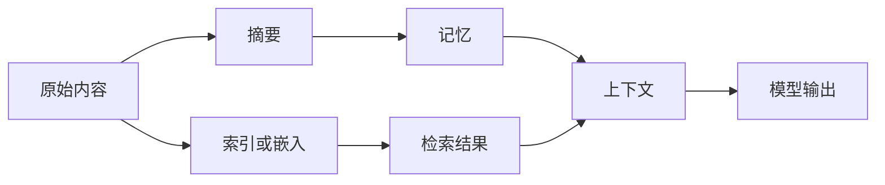

# 内容治理

| 日期 | 修订说明 |
| --- | --- |
| 2026-10-04 | 初版：不可变内容版本、限定范围的去重、发布前登记派生关系、每次使用的联合检查、"先禁止使用、再核验清理"的删除流程、加密擦除和恢复屏障。 |

- 状态：草稿
- 负责满足：C2、C3；G3、G8、G9、G12
- 协同：C5、C7、C8、C9；G1、G2、G4–G7、G10、G11
- 涉及场景：S1、S2、S4、S5、S6、S8
- 上游：[项目目标](../../project-goals.md)、[分层与模块](../../layers.md)、[核心契约](../contracts/README.md)、[授权](../grants/README.md)

内容治理管理系统读到的和产生的所有数据：它是什么、从哪里来、能被拿来做什么、能保存多久、由什么派生出来、副本都在哪里，以及用户要求删除之后，删到了哪一步。

本设计的核心判断是：**底层的删除操作只是清理的一个步骤，不能直接成为对用户的承诺。**记忆库、向量库、对象存储、数据库各自的"删除""过期"语义都不一样（见 7.1），所以治理层必须自己掌握内容身份、派生关系、持有位置和验证结果。

本设计的要点：

- 每个内容版本**独立且不可变**；授权、禁用和清理状态单独演进。不可变不等于不可删除；
- 去重只在**同一用户、同一可独立擦除的单元内**进行；
- 派生内容**先登记、后发布**：摘要、索引、嵌入、记忆、模型输出都要登记它实际用到了哪些输入；
- 每次使用都检查**当前授权和当前内容状态**，与撤回严格串行；
- 删除分两步：**先持久地禁止使用，再遍历、清理和核验**，两件事分别报告；
- **受控持有方**（Lerna 自己的存储、索引、缓存、备份、端点）必须能验证清理完成；已经发给**外部接收方**的副本，按对方支持的能力请求删除，并如实报告状态。标记为**严格删除**的数据，不得发给无法验证删除的接收方。

内容治理**不负责**：判断信息真假、选择记忆算法、裁决任务完成、修改授权、结算费用、撤销已发生的业务效果，也不负责让基础模型遗忘训练数据（项目不训练基础模型）。清理 Lerna 管理的副本是本模块的责任；删除已发出的邮件、撤销外部交易则是新的动作，按 G4 准入。

## 1 职责与边界

内容治理持有四类事实：内容版本的身份、来源、描述和实际取得时间；内容的用途上限、保留期限、派生关系和失效状态；原始内容和派生内容的持有位置；删除、撤回和清理工作的进度与证据。

| 相邻模块 | 分工 |
| --- | --- |
| 授权 | 持有授权、撤销和使用记录，签发凭据。内容治理提供内容限制和可用性检查，不能授权或扩大权限 |
| 任务编排 | 固定上下文、准入和完成裁决。内容失效时收到通知，自行作废相关提议或等待补充证据 |
| 动作账本 | 持有外部清理动作的尝试、效果和核对；内容治理不能把超时解释为"已删除" |
| 记忆策略 | 产生记忆、索引、嵌入和检索结果。它的持久产物必须登记，它本地的历史也在清理范围内 |
| 推理 | 使用受控的上下文，产生提议。模型的输入、输出、辅助摘要和标题都适用同样的治理规则 |
| 运行记录 | 保存关联轨迹；其中涉及的正文同样受治理，不能以"诊断需要"为由默认保留全文 |
| 出口闸门 | 在实际出口核验用途、目的地和当前凭据。内容治理不提供绕过闸门的远程正文地址 |

**事务位置。**内容治理的控制元数据（用途上限、期限、禁止使用状态、派生关系）和裁决域放在同一用户分片的事务设施中，使"使用检查"和"撤回"能严格串行。写入方仍然分开（R3）。正文、索引和第三方存储不进入这个事务，按 R7 交接。端侧专有内容的正文、敏感来源和派生关系留在端侧，云端只拿到明确获准同步的内容和控制信息。

## 2 对象与状态

### 2.1 内容版本

**内容版本标识**和**存储摘要**是两回事：前者表示一条有来源、权限和历史的内容记录，后者只标识字节。相同的字节来自两个来源时，保留两个内容版本；共享正文存储，也不能合并它们的授权、来源或删除责任。

| 字段 | 含义与规则 |
| --- | --- |
| `user_id` | 来自可信的调用上下文 |
| `content_id`、`version_id` | 逻辑内容标识和独立的版本标识；对外使用不泄露正文的标识 |
| `previous_version_refs` | 版本的先后关系。用旧值实际生成新值时，还要另外登记派生边 |
| `authority_ref`、`origin_endpoint_id` | 固定的事实负责方和原始端点 |
| `kind` | 原始内容、分块、摘要、索引条目、嵌入、记忆、上下文、模型输出等 |
| `source_descriptor` | 来源类型、原始定位、取得方式、提供方或扩展版本、关联的动作和尝试；敏感的定位加密保存 |
| `acquired_at`、`source_time` | 系统实际取得的时间，与来源自称的时间分开；后者不能代替前者 |
| `body_ref`、`byte_size` | 正文位置和长度；没有正文保存许可时不能持久保存正文 |
| `digest_algorithm`、`body_digest` | 实际字节的**完整性摘要**，作为受保护的元数据保存 |
| `media_type_declared`、`media_type_verified` | 声明的类型和核验后的类型；不一致时拒绝或隔离 |
| `summary_ref` | **自然语言摘要**是另一个内容版本，必须登记派生关系，与完整性摘要严格区分 |
| `lifecycle_state` | 暂存、可用、隔离、禁止使用、已清理 |
| 记忆的附加字段 | 事实、偏好、推断或经验；适用范围、置信度和时间。由记忆策略提出，核心登记来源 |

正文变化、来源描述修正、记忆更新，都产生新版本。已发布的版本不覆写；删除时移除正文和敏感描述，另外保留一份最少的删除记录。

### 2.2 用途与生命周期控制

| 字段 | 含义与规则 |
| --- | --- |
| `control_revision` | 单调递增，参与并发条件检查 |
| `purpose_ceiling` | 读取、保存、同步、行动四类用途的**上限**；实际许可仍由当前授权决定 |
| `scope` | 用户、任务、主体、资源字段、目的地和适用范围 |
| `processing_locations`、`storage_locations` | 允许处理和保存的位置。把内容作为模型输入上传，属于处理，也属于外发 |
| `sync_rules` | 原文、索引、嵌入、记忆和返回结果分别限制 |
| `strict_erasure` | 是否标记为严格删除；是则不得外发给无法验证删除的接收方 |
| `use_until` | 到期之后不得使用的**绝对时间** |
| `retain_until` | 应当完成正文清理的**绝对期限**；读取不会刷新它 |
| `block_scope`、`block_revision` | 全部或部分用途的禁止使用范围和版本 |
| `grant_dependencies` | 内容取得、保存、派生和同步依赖的授权 |
| `erasure_unit_ref` | 可独立擦除的密钥和存储范围 |
| `exception_record_ref` | 有权主体确定的保留例外、依据和期限；模型生成的例外不会自动生效 |

**派生内容默认继承所有输入限制的交集**，期限不晚于适用的输入期限。摘要、"已脱敏"声明或模型的判断都不能自动解除限制；要扩大可用范围，必须取得来源权利人新的明确授权。

### 2.3 派生登记与副本清单

| 对象 | 关键字段 | 规则 |
| --- | --- | --- |
| 派生登记 | 标识、负责方、任务和动作关联、输入版本集合、实际输入清单、生成器及版本、参数引用、输出标识、状态 | 先登记责任和位置，然后才允许产生持久副本；发布前封闭实际输入集合 |
| 派生边 | 父版本、子版本、关系类型、生成登记 | 子版本发布后不改边；不能靠移除来源边来"洗掉"限制 |
| 副本记录 | 副本标识、版本、持有方、端点、后端版本、准确定位、存储角色、代次、状态 | 正文、历史、索引、缓存、暂存、备份都有持有责任 |
| 使用检查 | 使用标识、用途、输入清单、控制版本、授权检查引用、执行位置 | 授权的使用事实归授权；内容治理只写自己的检查结论 |

派生关系是一个有向无环图，通过"已发布的输入 → 新的输出版本"构造：未发布的输出不能被其他计算当作可用输入；更新已有产物必须创建新版本。

共享索引按条目登记来源。如果索引段、统计信息等共享结构实际依赖多个输入，也要登记为聚合的派生内容；无法逐项清除某个输入的影响时，停用并重建整个聚合内容。

**嵌入同样受治理。**EMNLP 2023 的嵌入反演研究，在特定的模型、数据和攻击设置下，精确恢复了 92% 的 32-token 输入，还从临床笔记的嵌入中恢复出了姓名（[论文](https://aclanthology.org/2023.emnlp-main.765.pdf)）。这个比例不能外推到任意模型，但足以说明不能因为"只有向量"就认定可以上传云端、长期保留或免于删除。同理，内容的哈希也不是匿名的：RFC 6920 指出，哈希只提供名称和字节之间的完整性绑定，不保护机密性，低变化的内容可以通过猜测并比对哈希来识别（[RFC 6920 §10](https://www.rfc-editor.org/rfc/rfc6920.html#section-10)）。端侧专有内容的哈希不能默认同步或写进日志。

### 2.4 清理记录与状态

| 字段 | 含义 |
| --- | --- |
| `cleanup_id`、`request_id` | 清理责任和原命令 |
| `selector` | 删除的范围：某个版本、某个逻辑内容的全部版本、某个来源项或整个用户；明确列出包含哪些已知别名 |
| `blocked_at`、`block_revision` | 禁止使用的持久化点 |
| `traversal_frontier` | 已遍历的位置，以及尚未完成的派生和副本范围 |
| `targets` | 每个持有方的准确定位、代次和清理状态；区分受控持有方和外部接收方 |
| `outstanding_producers` | 可能产生迟到副本的计算、上传和同步 |
| `evidence` | 操作回执、核对结果、枚举结果、密钥销毁证据、备份过期证据，以及它们的覆盖范围 |
| `remaining` | 失联的端点、未清理的备份、保留例外、外部接收方的未知结果 |
| `notification_state` | 向用户通知结果的持久交接状态 |

| 对象 | 状态转换 |
| --- | --- |
| 内容版本 | 暂存 → 可用；暂存或可用 → 隔离；任何未清理状态 → 禁止使用 → 已清理 |
| 派生登记 | 已准备 → 计算中 → 已提交；也可以转为放弃或隔离。输入失效后，结果只能隔离并清理 |
| 副本 | 已预登记 → 已写入 / 未知 → 清理中 → 已验证清理；受阻和未知都保留 |
| 清理工作 | 已接纳 → 遍历和清理中 → 验证中 → 完成；受阻时保持未完成并说明原因 |

这里的"禁止使用"对应契约中的使用状态 `UNUSABLE`，清理工作的各阶段对应清理状态 `REQUESTED → CLEANING → CLEANED`。删除记录（墓碑）不会自动恢复为可用。重新取得同一信息，必须有新的明确授权、新的内容记录和当前检查，不能由后台重建悄悄恢复。

## 3 接口

所有改变状态的命令携带契约版本、命令标识、可信的主体上下文和必要的预期控制版本。

| 接口 | 输入 | 成功含义 | 错误 |
| --- | --- | --- | --- |
| 准备内容登记 | 来源、版本关系、描述、保存授权、输出位置 | 责任和位置已持久接纳，返回暂存引用；**尚不可使用** | 无授权、缺少来源、范围冲突 |
| 提交内容版本 | 登记标识、实际定位、摘要、长度、媒体类型 | 完整性和当前限制核验通过，版本已发布 | 内容不符、已到期、已禁止使用、位置未知 |
| 准备派生 | 已知输入、生成器版本、输出种类和位置、授权和动作关联 | 派生已登记，可以在受控的暂存范围内计算 | 输入无效、用途越界、存储能力不足 |
| 登记实际输入 | 派生登记、输入版本、实际使用关联 | 该输入已纳入责任范围 | 输入失效、清单已封闭、非法依赖 |
| 提交派生产物 | 封闭的输入清单、输出描述和副本定位 | 输出可用，或被隔离；接纳不等于允许发布 | 输入集合不完整、当前限制冲突、撤回竞争 |
| 登记或确认副本 | 版本、持有方、用途、定位、代次、交接标识 | 副本的位置和清理责任可查询 | 未授权的复制、定位不完整、旧代次 |
| 使用内容 | 版本集合、用途、任务、目的地、当前授权检查请求 | 本次使用的决定和受控的读取或处理句柄；**只代表这一次** | 已撤回、已过期、祖先失效、权威不可达、范围不符 |
| 收缩内容限制 | 范围、新的上限或期限、预期版本、授权关联 | 新控制版本和受影响的范围 | 版本冲突、无权修改、隐含扩大 |
| 删除或撤回信息 | 明确的选择范围、请求标识、授权关联 | 清理责任已持久接纳；**不表示已清理完成** | 范围不明、无权删除 |
| 回报清理结果 | 清理目标、代次、原交接、操作结果和证据 | 证据已接纳；覆盖范围仍由核心判断 | 旧代次、证据不足、目标不符 |
| 查询登记或清理 | 原命令或清理标识 | 持久状态、证据层次、剩余范围、下一个负责方 | 无权限时不泄露其他用户的对象是否存在 |
| 失效或清理通知 | 通知标识、版本或范围、控制版本 | 持有方已持久接纳 | 至少投递一次，接收方去重；通知丢失不会让待办丢失 |

**联合使用检查。**在同一事务设施内，当前授权、内容及其各级祖先的状态、期限，以及本次使用，都在一个可串行化的事务中检查。如果一次使用涉及多个独立的权威域，就按固定顺序取得针对这一次使用的读取围栏：各权威方持久接纳检查，并约束相关撤回不能与这次使用无序交叉；使用结束后释放。中途失败就不交付内容，恢复时查询原使用。撤回被接纳后拒绝新的围栏。这个机制只覆盖一次明确的使用，不形成可以长期复用的许可。**无法证明联合检查的顺序时就拒绝使用**，不能退化成几个各自独立的旧快照。

Zanzibar 论文描述过"用旧的权限检查保护新内容"造成的泄漏，并用与内容版本关联的一致性标记，保证权限检查不早于相关的内容变更（[Zanzibar §2.2、§2.4](https://www.usenix.org/system/files/atc19-pang.pdf)）。这里的要求更强：一致性标记只能表达检查有多新，Lerna 要求的是每次使用都检查当前授权。

## 4 关键流程

### 4.1 取得和保存内容

1. 检查取得的用途；需要外部请求时，按 R1、R2 经过准入和出口闸门；
2. 分别检查正文和最少治理元数据的保存范围。读取权限不包含保存权限；
3. 在内容域持久写入暂存登记、来源、负责方、预期副本和命令回执；
4. 把正文写到获准的位置。跨域时按"发送方持久意图 → 持有方持久接纳 → 发送方保存回执"进行；
5. 核验实际字节、长度、媒体类型和当前控制状态；
6. 在内容域原子固定版本描述、正文引用和可用状态，然后返回可用引用。

写入正文失败只留下一条不可见的暂存记录，恢复时按原登记核对。没有正文保存许可时，只能受控地瞬时使用，不能进入历史、缓存或调试日志。如果连最少的治理元数据都不允许保存，就拒绝需要可恢复责任的流程。

内容寻址对实际字节计算摘要。规范化、分块、重新编码都产生派生版本，不覆写原始字节。去重限定在同一用户和可兼容擦除的范围内；数据密钥是随机生成的，不能由正文哈希直接派生。

### 4.2 摘要、索引、嵌入、记忆与模型输出

1. 在内容域预登记派生责任、初始输入、输出标识和暂存位置；
2. 运行宿主在实际读取时登记输入。检索、提示拼装、历史上下文和辅助调用都要记录；
3. 摘要生成、嵌入和模型调用按 R2 经过出口闸门，由预算记录实际用量；
4. 输出先放在已登记的暂存位置，然后封闭实际输入清单；
5. 联合检查各输入的当前授权、祖先的失效状态和输出的用途。模型自己声明的来源只作参考，不能代替宿主捕获的实际输入；
6. 在内容域同时提交输出版本、派生边和副本位置，然后才发布；
7. 如果某个输入已经被撤回，输出进入隔离和清理，不发给用户，也不进入记忆或索引。

模型输入中的私有上下文**全部**作为保守的依赖登记，即使最终输出没有引用它们。W3C PROV-DM 明确指出，"使用过某内容"并不自动证明"输出受了它的影响"（[PROV-DM](https://www.w3.org/TR/2013/REC-prov-dm-20130430/)）；但对模型输出无法精确归因，所以只能保守登记。代价是删除一个输入可能让整段答案或记忆失效、需要重算。无法证明完整来源的产物，不能成为长期记忆或可发布的证据。

删除 A 之后，上图所有路径上的后续使用都被拒绝。如果某条记忆或某个答案确实还能由其他来源支持，应从允许使用的输入重新生成新版本。

默认等完整输出登记后再发布。流式输出需要按片段登记和检查，作为后续能力；在此之前不能先把未登记的正文泄露出去。

### 4.3 每次使用

1. 使用方提交确定的版本集合、用途和目的地；
2. 核验当前授权、内容限制、绝对期限和全部适用的祖先；不能只看异步更新的子节点标志；
3. 在授权和内容控制的事务中记录本次使用和检查关联，建立与并发撤回之间的先后顺序；
4. 在受控位置交付字节或开始计算；对外的动作仍在实际出口再检查一次（G4、G5）；
5. 读缓存、再调用一次模型、展示历史结果、保存新摘要、同步、行动，**都算新的使用**；
6. 内容随后失效时，任务编排停止使用相关的上下文和提议；已经拿到材料的运行宿主停止后续消费，并清理受控状态。

长时间的计算不是无限期的许可。每一次新的模型请求、输出发布或外部动作都重新检查；撤回之前已经发生的外部效果，继续由动作账本收尾。

### 4.4 删除和撤回的传播

1. 在内容控制事务中持久写入选择范围、禁止使用状态、控制版本、清理责任和待办，然后才确认接纳；
2. 对所选的来源项设置重新取得的限制，防止换个新标识就复活；
3. 遍历派生边和副本清单，**分批持久保存遍历进度**；各持有方按 R7 接纳清理；
4. 拒绝新的使用、派生发布和副本发布；尚未完成的生产责任留在清理范围内；
5. 各持有方清理正文、历史、索引、嵌入、记忆、缓存、暂存、日志正文、队列正文和备份；对外的删除动作经动作账本和出口闸门；
6. 按准确的定位和代次核对，必要时枚举全部存储版本和副本。不能用"没有权限访问"或"单次 GET 失败"证明数据不存在；
7. 确认所有已登记的生产责任不会再发布或补写迟到的内容；
8. 在内容域保存验证结论和剩余范围；满足完成条件才标记为完成；
9. 持久交接用户结果通知，保存接纳回执。

授权的撤销由授权模块先记录；内容治理根据授权关联处理受影响的用途和保存责任。只撤销某一种用途时，其他合法用途不会被视为一起撤销；而撤回某条信息本身，会按明确的信息范围停止全部相关的使用。

### 4.5 清理到哪一步，就报告哪一步

| 可以报告的状态 | 需要的证据 |
| --- | --- |
| 请求已接纳 | 清理责任、范围和回执已持久保存 |
| 已停止新使用 | 权威的门禁已生效；拿不到当前状态的使用方会拒绝使用 |
| 在线副本已清理 | 已登记的受控在线持有方逐项回报，并通过准确定位和代次的核对 |
| 备份等待清理 | 禁止从备份恢复为可用数据的措施、剩余的备份和到期安排都已明确；**此时整体仍未完成** |
| 加密擦除已验证 | 所有适用的密钥和可恢复的副本都已不可恢复，明文和已解包的密钥也已处理 |
| 外部接收方：已请求删除 / 已确认删除 / 无法确认 | 分别对应：删除请求已经作为动作发出；对方提供了可验证的删除证据；对方不支持验证或结果未知 |
| 清理完成 | 全部受控持有方的可恢复副本已清理或经验证不可恢复；生产责任已收尾；不存在未知目标、未处理的例外或未封闭的迟到写入；外部接收方的状态如实列出 |

清理证据要包含范围、目标集合、存储和密钥代次、工具或后端版本、验证方法、结果和剩余项。持有方自称"完成"只是一条输入。旧回执只证明它对应的那个代次。未知、失联、保留锁定和缺少核验能力，都保持未完成，不会因为超时变成完成。

**用户承诺要说清楚阶段和范围。**Google Cloud 的删除说明区分了删除请求、标记删除、活动系统清理和备份过期，所描述的最长删除周期约为 180 天（[Google Cloud 数据删除](https://docs.cloud.google.com/docs/security/deletion)）。英国 ICO 要求考虑备份：不能立即覆盖的备份应置于不可使用状态，并按既定周期替换（[ICO 删除权指引](https://ico.org.uk/for-organisations/uk-gdpr-guidance-and-resources/individual-rights/individual-rights/right-to-erasure/)）。法国 CNIL 2026 年对 EXTIA 的裁决指出，自动删除数据不能免除告知请求处理结果的义务（[CNIL](https://cnil.fr/en/sanction-failure-rights-individuals-extia)）。所以本设计把"清理工作完成"和"用户获知结果"作为两个需要持久跟踪的步骤，备份未清理时如实显示为"未完成"。法律上的保留例外由有权的主体确定，模型不能自行判断。

### 4.6 加密擦除、期限与恢复

- 每个可独立擦除的单元使用随机密钥，正文和敏感的来源描述都受它保护。派生内容有自己的密钥，仍然需要沿派生关系清理；
- 在共享的用户主密钥下删掉一行包装密钥记录，不能证明已擦除：旧备份可能仍保留着能解包的记录；
- 禁用或计划删除密钥只表示停止相应的解密路径；最终销毁需要覆盖所有副本的证据。AWS KMS 的计划删除有 7–30 天的等待期，期间可以取消，而且不会立即影响已经解包的数据密钥（[AWS KMS 删除密钥](https://docs.aws.amazon.com/kms/latest/developerguide/deleting-keys.html)）；
- 已解密的缓存、模型上下文、内存中的密钥和进程转储要单独处理，不能验证时保持未完成。NIST SP 800-88 Rev.2 把加密擦除建立在正确加密和密钥管理之上，未加密的既有副本不受密钥销毁保护（[NIST SP 800-88r2 §3.2](https://nvlpubs.nist.gov/nistpubs/SpecialPublications/NIST.SP.800-88r2.pdf)）；
- 到达绝对使用期限立即拒绝使用，与后台清理的进度无关。延长期限必须有新的明确授权；
- **备份恢复先加载最新的删除和撤回记录**，应用控制版本并完成核对之后，才能开放使用；不能先恢复服务再慢慢补删；
- 删除记录的保留时间要覆盖最长的可恢复备份、离线副本和迟到结果的周期；没有可证明的上界时，不能自动丢弃；
- 动作效果、费用和责任记录保留最少的必要关联（最小责任记录），不复制已删除的正文。

## 5 故障与恢复

| 故障 | 负责方 | 恢复方式 |
| --- | --- | --- |
| 回执丢失 | 发起交接的内容治理或持有方 | 查询原命令、原登记或原清理目标，不另建责任；也不能借回执绕过当前检查重新取得正文 |
| 进程崩溃 | 内容治理、持久工作；外部效果归动作账本 | 接替者读取持久阶段、暂存定位和原尝试；核对已写入的副本，继续提交或清理；过期工作者不能覆盖新代次 |
| 重复请求 | 持久工作、内容治理 | 同标识同参数返回原决定，不同参数报冲突；后端的部分删除逐目标核对，不假设后端天然幂等 |
| 并发冲突 | 各事实写入方 | 控制版本、条件写入和串行化的使用检查来裁决；删除与发布竞争时，已被禁止使用的输入不能再产生可用产物 |
| 依赖不可用 | 内容治理协调；持有方保留清理责任 | 无法证明当前授权或内容状态时拒绝使用；持久保存待办和剩余项；后端不可用不会延长用户的期限 |
| 迟到的结果 | 原派生负责方、内容治理 | 按原登记接纳为隔离结果，登记准确位置并清理；不恢复原内容；预算照常记录实际费用 |
| 端侧离线 | 端侧持有方及其权威控制方 | 依赖远端当前授权的使用停止；清理状态显示"端点未回报"；重连后先同步控制状态，再开放内容和结果发布 |
| 备份恢复 | 恢复执行方、内容治理 | 对外开放之前，应用删除记录、控制版本和密钥状态；拿不到最新控制记录时保持隔离 |
| 清理回报缺少证据 | 内容治理 | 不把目标标为已验证；要求原持有方核对，或报告它不具备验证能力 |
| 密钥删除结果未知 | 动作账本、密钥持有方 | 查询原删除操作和实际密钥状态；内容保持禁止使用，清理保持未知；不能新建一把密钥来"修复"已要求擦除的内容 |

## 6 不变量落实

| 不变量 | 本模块怎样保证 | 怎样验证 |
| --- | --- | --- |
| G1 | 外部删除超时时保持未知；只有核对证据或目标的幂等保证才允许重试 | 删除已执行但回执丢失；目标既不幂等也不可查询时不重发 |
| G2 | 提供有范围的清理证据；已删除或已失效的内容不能成为新的完成证据 | 空回执、部分清理、证据失效都无法通过完成门禁 |
| G3 | 登记、禁止使用、生产责任、清理待办和回执都先持久化再确认 | 在每个持久化点前后崩溃，责任不丢失，未提交的内容不可见 |
| G4 | 内容和用途检查进入准入依据和实际使用；出口仍然核验条件、授权和预算 | 准入之后撤回，出口拒绝；旧条件或旧控制版本无法继续使用 |
| G5 | 模型、摘要、嵌入、同步和外部清理都经过出口闸门 | 注入辅助调用、没有任务关联的路径和嵌套调用，检查没有旁路 |
| G6 | 模型只能提出记忆、来源和完成判断；核心核验登记和发布条件 | 模型声称"已脱敏""可以上传""已删除"，都不能改变治理状态 |
| G7 | 派生和委派的限制默认取交集；扩大范围需要来源权利人的新授权 | 多来源混合、子 Agent、新 Skill 都无法扩大用途或目的地 |
| G8 | 缓存、历史、检索、保存、同步和行动每次都检查当前授权；到期或权威不可达时拒绝 | 旧凭据、缓存命中、离线和期限边界都无法绕过检查 |
| G9 | 根失效门禁、沿派生关系传播、副本清单、迟到生产的收尾和恢复屏障共同落实；严格删除的数据不外发给无法验证删除的接收方 | 检索和直接读取都不可用；历史、备份、迟到产物和旧索引都无法复活 |
| G10 | 删除内容不抹掉计费来源和费用责任；隔离的迟到输出仍保留必要的用量关联 | 删除与迟到账单竞争时，预算不重复、不遗漏 |
| G11 | 内容权威、生产责任和清理目标固定；只接替工作者，不换责任来规避未知 | 失联和重启之后沿原登记恢复 |
| G12 | 用户范围贯穿标识、查询、派生图、存储、密钥和清理；禁止跨用户的去重和派生边 | 越权查询不泄露对象是否存在；删除选择器、负载和故障不影响其他用户 |

## 7 取舍

### 7.1 为什么不能直接信任底层的"删除"

| 系统 | 实际行为 |
| --- | --- |
| Mem0 v1.0.0 | `_delete_memory` 删除向量之后，把原正文写进历史表的 `old_memory`，历史查询仍能取得；单项删除也没有调用图存储的删除（[main.py](https://raw.githubusercontent.com/mem0ai/mem0/394203d1b5f56385d28690ea27c0d746007ff940/mem0/memory/main.py)、[storage.py](https://raw.githubusercontent.com/mem0ai/mem0/394203d1b5f56385d28690ea27c0d746007ff940/mem0/memory/storage.py)） |
| LangGraph checkpoint-postgres 2.0.25 | TTL 默认在读取时刷新；Postgres Store 的读取和搜索不会自动排除已过期的记录，回收靠后台扫描。所以存在"已过期但还没被扫描的记录被读出，并且期限被延长"的路径（[TTL 定义](https://raw.githubusercontent.com/langchain-ai/langgraph/7d166bfb9f8732a981fbf07ea05069c1a2dc8399/libs/checkpoint/langgraph/store/base/__init__.py)、[Store 实现](https://raw.githubusercontent.com/langchain-ai/langgraph/7d166bfb9f8732a981fbf07ea05069c1a2dc8399/libs/checkpoint-postgres/langgraph/store/postgres/base.py)） |
| Qdrant v1.15.4 | 区分 `acknowledged`（写入 WAL 并排队）和 `completed`（更新实际生效）；删除只清理 payload 和 ID 映射，物理清理由达到阈值后运行的优化流程负责（[回执定义](https://raw.githubusercontent.com/qdrant/qdrant/20db14f87c861f3958ad50382cf0b69396e40c10/lib/collection/src/operations/types.rs)） |
| S3 版本化存储桶 | 普通 DELETE 只添加删除标记；永久删除某个版本要指定 `versionId`，而且不会自动删除复制目标中的对应版本（[DeleteObject](https://docs.aws.amazon.com/AmazonS3/latest/API/API_DeleteObject.html)、[复制语义](https://docs.aws.amazon.com/AmazonS3/latest/userguide/replication-what-is-isnot-replicated.html)） |
| DynamoDB TTL | 后台异步删除，通常可能需要数天；尚未删除的过期项目仍会出现在读写操作中，需要应用自己过滤（[TTL](https://docs.aws.amazon.com/amazondynamodb/latest/developerguide/TTL.html)） |
| Cassandra 5.0.0 | 离线副本没收到删除标记、而其他副本已清除了标记时，旧数据可能在修复时重新出现（[tombstones](https://raw.githubusercontent.com/apache/cassandra/cassandra-5.0.0/doc/modules/cassandra/pages/managing/operating/compaction/tombstones.adoc)） |

由此得出的规则：历史、图、缓存、队列和日志都要列入持有方清单；用户的绝对保留期限不能映射成会滑动的 TTL，期限检查由治理层负责，后台扫描只负责回收；写入回执、查询不可见、底层不可恢复是三个不同的证据层次；"当前 GET 不到"不能证明历史版本和复制版本已清理；删除记录必须覆盖副本恢复和备份恢复，不能随普通数据回收一起提前消失。

### 7.2 关键选择

| 问题 | 选择 | 被否决的方案及原因 |
| --- | --- | --- |
| 版本怎样表示 | 独立的不可变版本 + 可变的治理状态 | 原地覆盖：旧引用的含义会变；全量事件重放：正文进入事件历史后难以清理 |
| 怎样去重 | 同一用户、同一可独立擦除的单元内去重；证明不了擦除兼容就不去重 | 全局明文哈希去重：存在性泄露、跨用户共享和独立擦除冲突 |
| 派生关系怎样保存 | 不可变的直接依赖边 + 反向索引；传递闭包只作为可重建的加速索引 | 只存来源标签：无法可靠地传播多级删除 |
| 派生内容何时登记 | 预登记输入和输出位置，计算后核验再发布 | 先发布后补登记：崩溃会留下没有来源的数据；把所有存储纳入分布式事务：第三方支持少，故障时阻塞严重 |
| 怎样做每次用途检查 | 在使用处检查当前授权和内容状态，并与撤回明确串行 | 只在取得时检查：违反 G8；长有效期凭据加异步撤销：传播窗口内会继续使用 |
| 删除怎样传播 | 先持久禁止使用，再持久遍历、逐个清理和核验 | 同步等待所有物理删除：任何一个失联的持有方都会卡住请求；只发异步通知：通知丢失时会继续使用 |
| 怎样做到不可恢复 | 每个可独立擦除的单元一把随机密钥，结合物理清理 | 每用户一把密钥：用户整体擦除方便，但单条删除仍依赖物理清理 |
| 端侧专有内容 | 所有派生物默认继承端侧约束，逐项授权处理和同步 | 原始数据留端侧、派生物默认上传：摘要和嵌入可能泄露 |

| 代价 | 说明 |
| --- | --- |
| 去重节省有限 | 可能保留同一字节的多份加密副本 |
| 保守登记模型输入 | 删除一个输入可能让整段答案或记忆失效，需要重算 |
| 当前检查、失联即拒绝 | 增加延迟；端侧离线能力受限 |
| 用户会看到多个清理阶段 | 未完成的项目如实显示 |
| 删除记录本身需要管理 | 删除记录有自己的权限和保留期限 |
| 每个后端都要声明并验证删除能力 | 换掉实现也不能改变对用户的承诺 |

内容身份与存储身份分离、擦除单元和密钥布局、删除记录的保留、权威事务的位置，正式采纳时应写成 ADR。

## 8 待定事项

| 编号 | 假设或问题 | 验证方式与未成立时的处理 |
| --- | --- | --- |
| H1 | 所有允许持有内容的实现都能登记实际副本和准确定位 | 检查隐藏的历史、分页、快照、日志和暂存；无法枚举或核验的实现不能报告完整清理 |
| H2 | 联合使用的围栏能在撤回、崩溃和网络分区下保持明确的顺序 | 状态机和故障注入验证；未完成前，跨权威域的使用一律拒绝，不用短 TTL 代替 |
| H3 | 直接在派生图上检查、按用户分片，能满足目标负载 | 测量祖先深度、边数、检查延迟和清理积压；加速索引不能降低正确性要求 |
| H4 | 选定的密钥设施能证明目标密钥和可恢复副本都不可恢复 | 检查备份、外部密钥、解包缓存和恢复流程；不成立时只承诺普通清理 |
| H5 | 时间来源的误差足以判断绝对期限 | 注入时钟回退和漂移；无法证明尚未到期时拒绝使用 |
| H6 | 来源项有稳定的身份，能阻止后台重新取得已删除的信息 | 测试 URL 变化、来源别名和记忆合并；范围不完整时说明剩余项 |
| H7 | 默认的运行宿主能封闭旧的上下文、缓存和临时明文 | 验证进程重置、缓存失效、转储和交换空间策略、插件的持久化限制；未经验证的第三方实现不能接触受限内容 |

清理时限、备份周期、删除记录的保留期、密钥粒度和最大派生图规模，都应该做成配置并经过容量验证，本文不给出没有依据的数字。

## 9 M1 范围

M1 实现来源、版本和派生关系；用途限制和删除传播推迟到 M2。

| 项目 | M1 实现 | 后续 |
| --- | --- | --- |
| 内容身份 | 用户、内容和版本标识、来源、实际取得时间、描述、关联的任务和动作 | M2：完整的用途和保留策略 |
| 不可变版本 | 更新产生新版本；旧引用稳定；完整性摘要和自然语言摘要分开 | 按需扩展分块去重、算法迁移 |
| 派生关系 | 工具结果、上下文、模型输出和辅助产物**从第一天起**登记实际输入和输出；缺少来源的持久产物不能发布 | M2：用于完整的删除传播和记忆；M5：覆盖评测和自进化 |
| 持久交接 | 内容登记、派生产物和回执按正式的 R7 实现；同进程也不省略 | M3：端云交接 |
| 正文存储 | 一个可信的参考后端即可 | 完整的去重和多后端清理不是 M1 的退出条件 |
| 记忆策略 | 不实现 | M2 |
| 用途治理 | 保留扩展字段和错误语义；遵守已有的准入和出口授权，不宣称完整的 G8 | M2 |
| 删除能力 | 不把尚未实现的删除请求确认为已完成；明确返回"不支持" | M2：完整的禁止使用、传播和验证；M3：验证失联端点 |

M1 退出证据：内容版本稳定、派生关系完整、回执丢失能恢复、暂存不可见、重复登记结果一致、崩溃后生产责任可追踪。M1 只用于受控测试，使用合成数据或可以整体清理的实验环境，不能以 M1 通过为由宣布真实个人数据的 S6 已受支持。

## 10 测试要点

| 用例 | 注入或竞争 | 必须观察到 | 对应 |
| --- | --- | --- | --- |
| 不可变版本 | 新版本提交中崩溃，同时读取旧引用 | 旧版本含义不变；新版本未完整提交前不可见 | C3、G3 |
| 登记回执丢失 | 接纳成功后断线 | 查询原命令得到同一登记；没有重复的版本或责任 | G3、G11、R7 |
| 写完正文后崩溃 | 元数据提交前退出 | 暂存不可使用；恢复时能核对或清理准确位置 | G3、G9 |
| 多父派生图 | 菱形、多级、共享输入；删除任一必要的父项 | 所有受影响的使用被拒绝；遍历无遗漏、可恢复 | C2、G9 |
| 发布与删除竞争 | 删除前后交错提交派生结果 | 不会出现基于已失效输入的新可用产物；迟到的输出被清理 | G8、G9 |
| 完整捕获输入 | 隐藏的上下文、辅助摘要、检索重排的输入 | 有未登记输入的产物不能成为可发布的长期产物 | G5、G9 |
| 缓存与旧凭据 | 填充缓存后撤回授权 | 缓存命中、历史展示、再次调用模型都被拒绝 | G8、S6 |
| 绝对期限 | 停止后台扫描、持续读取、时钟回退 | 到期后不返回内容；访问不会延长期限 | G8、G9 |
| 真实后端的语义 | 重现 7.1 中的历史、TTL、逻辑删除和版本桶路径 | 治理层拒绝使用，不把库的回执当成完整擦除 | A4、G9 |
| 分页与删除范围 | 数据量超过后端一页；多个用户共用一个后端 | 不漏删；不删到其他用户的数据 | G9、G12 |
| 独立来源与去重 | 字节相同，但来源、授权、擦除要求不同 | 权限不合并；删除范围准确；不谎称仍被共享的字节已独立擦除 | G8、G9、G12 |
| 持有方失联 | 清理期间端点离线 | 状态保持未完成；拿不到当前状态的使用被拒绝；重连后先核对控制 | A3、G8、G9 |
| 备份恢复 | 恢复删除之前的快照、旧的包装密钥记录 | 开放读取之前应用最新的控制；已删除的数据不复活 | G9 |
| 旧的清理回执 | 乱序回报、工作者租约过期 | 旧代次不能覆盖新状态，也不能证明新副本已清理 | G3、G9、G11 |
| 不可查询的删除 | 请求可能已生效后超时 | 保持未知，不盲目重发，不标为完成 | G1、G9 |
| 加密擦除的缺口 | 保留内存中的密钥、备份密钥或明文缓存 | 验证失败；不能报告加密擦除完成 | G9 |
| 清理证据的边界 | 只返回 200、403、404 或"completed" | 缺少覆盖范围和核对证据时，保持未验证 | G2、G9 |
| 严格删除与外发 | 标记严格删除的内容试图发给不支持验证删除的模型供应商 | 出口被拒绝 | G9 |
| 端侧隐私派生物 | 端侧原文生成摘要、嵌入、日志和返回结果 | 未获准的数据不进入云端存储、模型请求或日志 | C2、G7、G8、G12 |
| 费用与证据删除 | 删除之后，模型结果或账单迟到 | 正文不会重新可用；实际费用保留且只计一次 | G9、G10 |
| 替换实现 | 新的记忆策略隐藏持久化、拒绝清理或错误声明能力 | 一致性验收失败，不能接触受限内容 | A2、A4、R5 |

再用随机的事件序列覆盖"取得、派生、使用、撤回、删除、崩溃、重连、恢复"。核心判定有两条：**任何成功的新使用，都能对应到一次有效的当前检查；任何"清理完成"，都覆盖了全部目标和未收尾的生产责任。**

## 参考资料

- RFC 6920，Naming Things with Hashes：https://www.rfc-editor.org/rfc/rfc6920.html
- OCI Image Spec v1.1.1 内容描述：https://raw.githubusercontent.com/opencontainers/image-spec/v1.1.1/descriptor.md
- W3C PROV-DM（2013-04-30）：https://www.w3.org/TR/2013/REC-prov-dm-20130430/
- Zanzibar（USENIX ATC 2019）：https://www.usenix.org/system/files/atc19-pang.pdf
- Morris 等，Text Embeddings Reveal (Almost) As Much As Text（EMNLP 2023）：https://aclanthology.org/2023.emnlp-main.765.pdf
- Mem0 v1.0.0：[main.py](https://raw.githubusercontent.com/mem0ai/mem0/394203d1b5f56385d28690ea27c0d746007ff940/mem0/memory/main.py)、[storage.py](https://raw.githubusercontent.com/mem0ai/mem0/394203d1b5f56385d28690ea27c0d746007ff940/mem0/memory/storage.py)
- LangGraph checkpoint-postgres 2.0.25：[TTL 定义](https://raw.githubusercontent.com/langchain-ai/langgraph/7d166bfb9f8732a981fbf07ea05069c1a2dc8399/libs/checkpoint/langgraph/store/base/__init__.py)、[Postgres Store](https://raw.githubusercontent.com/langchain-ai/langgraph/7d166bfb9f8732a981fbf07ea05069c1a2dc8399/libs/checkpoint-postgres/langgraph/store/postgres/base.py)
- Qdrant v1.15.4 回执定义：https://raw.githubusercontent.com/qdrant/qdrant/20db14f87c861f3958ad50382cf0b69396e40c10/lib/collection/src/operations/types.rs
- AWS：[S3 DeleteObject](https://docs.aws.amazon.com/AmazonS3/latest/API/API_DeleteObject.html)、[S3 复制语义](https://docs.aws.amazon.com/AmazonS3/latest/userguide/replication-what-is-isnot-replicated.html)、[DynamoDB TTL](https://docs.aws.amazon.com/amazondynamodb/latest/developerguide/TTL.html)、[KMS 删除密钥](https://docs.aws.amazon.com/kms/latest/developerguide/deleting-keys.html)
- Apache Cassandra 5.0.0 删除标记：https://raw.githubusercontent.com/apache/cassandra/cassandra-5.0.0/doc/modules/cassandra/pages/managing/operating/compaction/tombstones.adoc
- Google Cloud 数据删除：https://docs.cloud.google.com/docs/security/deletion
- NIST SP 800-88 Rev.2：https://nvlpubs.nist.gov/nistpubs/SpecialPublications/NIST.SP.800-88r2.pdf
- GDPR（Regulation (EU) 2016/679）第 12、17、19 条：https://eur-lex.europa.eu/legal-content/EN/TXT/HTML/?uri=CELEX%3A32016R0679
- ICO 删除权指引：https://ico.org.uk/for-organisations/uk-gdpr-guidance-and-resources/individual-rights/individual-rights/right-to-erasure/
- CNIL，EXTIA 删除权案例（2026-09-09）：https://cnil.fr/en/sanction-failure-rights-individuals-extia
- Bourtoule 等，Machine Unlearning（arXiv 1912.03817v3）：https://arxiv.org/pdf/1912.03817v3
