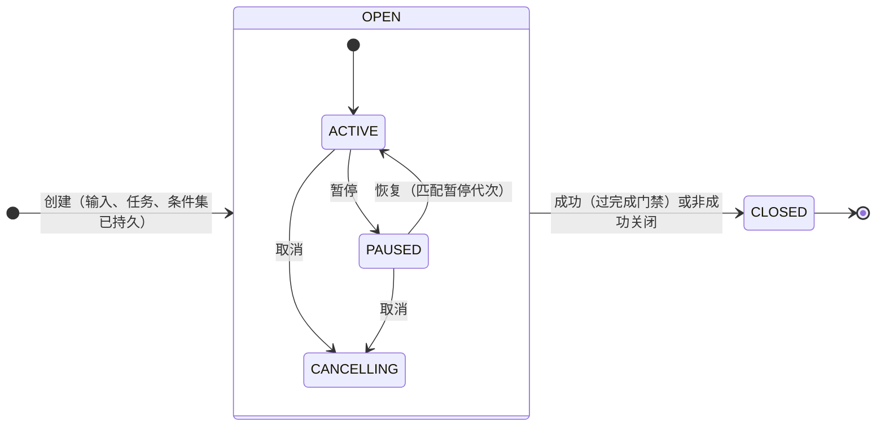
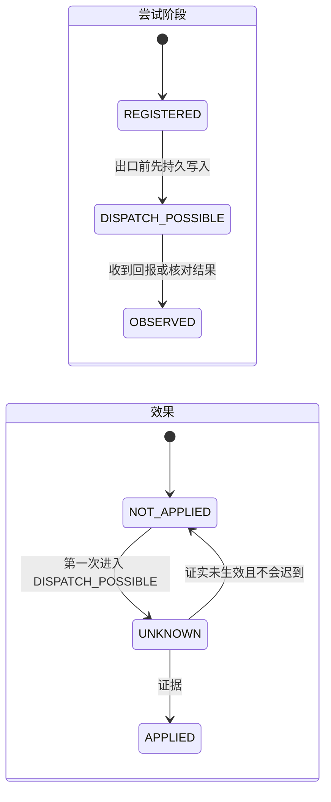
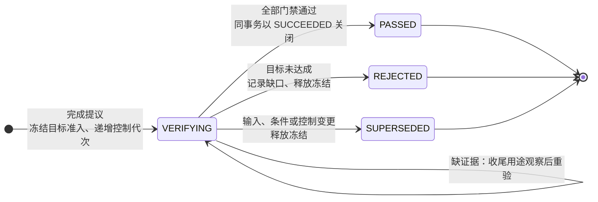
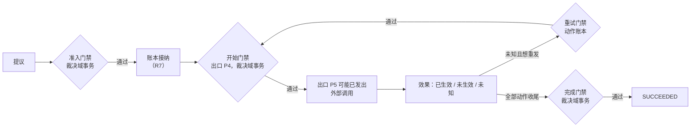

# 核心契约

| 日期 | 修订说明 |
| --- | --- |
| 2026-10-04 | 初版：对象与归属、标识与精确引用、多维状态、命令信封与错误模型、能力声明、版本演进规则。 |
| 2026-10-04 | 按 `CLAUDE.md` 写作要求和[文档规范](../../conventions.md)修订用语：约束统一为"必须／不得""建议／不建议"，不再使用"应"；"执行端"统一为"执行端点"，发布回滚统一为"回滚"，授权统一用"撤销"。设计内容不变。 |
| 2026-10-04 | 按[架构评审处理记录](../../../review/archive/round-1/README.md)修订：定义唯一的 `CommandIdentity`，回执分为受理回执和决定回执，查询结果分五种（RV1、RV2）；授权控制状态只保留 `ACTIVE`/`REVOKED`，次数与期限改为计算值（RV3）；Grant 拆分 `use_rights[]` 与 `processing_purposes[]`（RV9）；新增端侧账本连续性记录（RV7）、条件集接纳和完成核验轮次的状态（RV6、RV11）；Result 列出条件来源。 |
| 2026-10-04 | 按[第二轮评审处理记录](../../../review/archive/round-2/disposition.md)修订：核验轮次增加 `SUPERSEDED`（R2-01）；任务修改被接纳时同时递增控制代次（R2-02）；确认区分签发授权与动作准入，消费目标为互斥联合（R2-04）；契约分为公共契约与内部接口（R2-08、[ADR 0003](../../../adr/0003-replacement-classes-and-assembly.md)）；`must_understand` 由受控定义确定，扩展分三条路径（R2-10）。 |
| 2026-10-04 | 按[第三轮评审处理记录](../../../review/archive/round-3/disposition.md)修订：条件集接纳绑定已处理的输入版本（R3-01）；冻结只存在于 `VERIFYING`（R3-02）；准入记录保存祖先控制依据和记忆依赖（R3-03、R3-05）；模型调用按"提议请求 + 调用位置"标识（R3-04）；内容区分原始观察与派生解释（R3-06）。主流程第 3 步改为先固定模型输入再准入，补上第二轮 R2-05 漏改的一处。 |
| 2026-10-04 | 按[第四轮评审处理记录](../../../review/disposition.md)修订：开始核验递增控制代次，被拒绝后已开始的清单动作须收尾才能补建（R4-01）；父任务等直接子任务全部关闭后才开始核验（R4-02）；从未开放出口的动作以原账本的内部封闭证明收尾（R4-05）。 |
| 2026-10-05 | 顶层整理：2.5 只保留状态和转换，增加任务、动作、核验轮次三张状态图；2.6 由"两个门禁"改为"四道门禁"，把散在任务编排、出口闸门、授权等文档中的准入、开始、重试、完成条件集中到一处，并列出递增控制代次的全部事件和收尾的两条路径。第 4 节主线表的局部持久化点改称"持久点 n"，"P4""P5"只指出口闸门的编号。规则内容不变。 一致性修正：门禁条件加稳定编号（准入-1 等），供模块文档引用；记忆依赖区分当前依据与历史视图；开始门禁区分首次开始与安全重发；完成门禁关闭时比较本轮核验记录的依据；准备类准入也豁免条件集已接纳；准入失败时确定的拒绝仍作为决定保存；不改变依据的回答同步推进已处理输入版本；授权确认不带条件集版本；三个错误码的分类改为"不可恢复"。 |
| 2026-10-05 | 字段与状态统一：内容增加发布维度（`publish_status`，暂存、已发布、隔离），`media_type` 写明指核验后的类型；会话输入的 `sequence` 改为 `session_seq`；新增"模块文档的字段表与本表的关系"。 |

- 状态：草稿
- 负责满足：A4；为 A1–A3、C1–C9、G1–G12 提供共同定义
- 涉及场景：S1–S8；M1 优先覆盖 S2、S7
- 上游：[项目目标](../../project-goals.md)、[分层与模块](../../layers.md)

核心契约规定所有模块必须共同理解的东西：有哪些对象、谁写、怎样标识和引用、状态怎样组合、命令和错误长什么样、版本怎样演进。它本身**不保存、不裁决任何运行事实**。"校验通过"只说明形状正确，不说明授权有效、动作已准入或任务已完成。

本文的核心主张有三条：

1. **对象有类型、有唯一写入方，用精确引用相连。**不用一个大对象装下任务、授权和费用，也不用"读最新版本"的裸标识引用历史依据。
2. **状态分维度表达。**任务的生命周期、控制、推进，动作的派发控制、效果和迟到可能性，各自独立。这样才能如实表达"取消已保存，但效果仍未知"。
3. **命令的接纳、动作的效果、传输的错误是三件事。**超时只说明调用方不知道结果，既不代表命令被拒绝，也不代表外部动作未发生。

## 1 职责与边界

| 内容 | 核心契约负责 | 事实的实际写入方 |
| --- | --- | --- |
| 对象与引用 | 类型、字段、归属规则、精确引用格式 | 各模块（见 2.3） |
| 状态 | 状态维度、合法组合、转换前提 | 任务编排、动作账本等 |
| 命令与交接 | 命令信封、回执、幂等范围、跨域交接（R7）的成功含义 | 持久工作与业务写入方 |
| 错误 | 错误码、分类、接纳状态、恢复动作 | 产生错误的模块；SDK 必须原样保留语义 |
| 能力声明 | 执行适配器、推理和扩展声明能力的结构 | 适配器和扩展作者；授权和一致性测试负责核验 |
| 可替换部分的接口 | 推理、记忆策略、执行适配器、交互适配器的接口定义 | 各默认实现和第三方实现 |
| 公共契约与内部接口 | 划分标准：跨进程命令、稳定引用、可替换部分的接口、线协议属于**公共契约**，进入 SDK；事务上下文、存储访问、平台时钟属于**内部接口**，归使用它们的核心模块声明，不进入 SDK（[ADR 0003](../../../adr/0003-replacement-classes-and-assembly.md)） | 内部接口由受信实现实现，见[分层与模块 R6](../../layers.md#7-依赖与调用规则) |
| 发布 | 契约清单、版本规则、测试向量 | 发布流程 |

核心契约只提供无副作用的工具：结构校验、命令指纹计算、兼容性检查。它不访问外部系统，不持久化任何东西。

## 2 对象与状态

### 2.1 标识与引用

**全局名字。**每个持久对象的身份由四部分组成：

```text
{ user_id, authority_domain_id, object_kind, local_id }
```

| 部分 | 含义 | 规则 |
| --- | --- | --- |
| `user_id` | 所属用户 | 所有对象、命令和回报都显式携带，M1 单用户时也不省略 |
| `authority_domain_id` | 负责该事实的事务域，例如某用户分片上的裁决域，或某端点上的动作账本 | 稳定的逻辑标识，不是进程地址或当前连接 |
| `object_kind` | 对象类型 | 创建后不变，调用方不得转换 |
| `local_id` | 域内唯一标识，使用 UUIDv7 | 由负责域做唯一性检查；碰撞作为冲突处理，不得错认为已有对象 |

UUIDv7 可以在端侧和云端本地生成，不需要中心分配。但它只提供唯一性：不得当作访问凭据，其中的时间部分也不得用来判断因果顺序。日志和人可读的形式是 `u/<用户>/<类型>/<负责域>/<UUID>`。用户标识必须是不含姓名、手机号的稳定标识；它帮助路由和排查，但不授予任何访问权。

**精确引用（Ref）。**引用历史依据时必须固定到具体版本：

```text
Ref = 全局名字 + revision + schema_id + digest（可选）
```

- `revision` 由写入方签发，不透明，只能比较是否相等，不得跨对象比较大小。
- `schema_id` 指向不可变的结构定义，由发布清单解析，不得在运行时下载任意 URL。
- `digest` 只证明内容完整，不授予访问权。

**查询当前状态**用全局名字；**引用历史依据**用 Ref，并且不得自动替换成最新版本。例如准入记录引用的 Grant 是准入时的版本；出口处检查的是 Grant 的当前状态和来源链。两者不得混用。

### 2.2 版本的种类

以下版本各自独立变化，不得用一个数字代替：

| 版本 | 何时改变 | 用途 |
| --- | --- | --- |
| 发布版本 | 核心、契约、SDK 一起发布时 | 发布责任和兼容窗口 |
| Schema 版本 | 对象的表示方式改变时 | 解析和迁移 |
| 对象修订 | 对象记录改变时 | 并发控制和精确引用 |
| 条件集版本 | 任意一项必要条件被增加、删除或修改时 | 整体作废基于旧条件的提议 |
| 任务输入版本 | 用户对当前任务的修改或有效回答被接纳时 | 作废没有看到新输入的提议。不改变任务依据的回答，同时把条件集的 `bound_input_version` 推进到新版本，不进入处理门禁（见[任务编排 2.2](../tasks/README.md#22-条件证据与提议)） |
| 控制代次 | 暂停、恢复、取消、条件变更、开始完成核验，以及会改变任务依据的输入被接纳时 | 出口 P4 比较动作准入时的控制代次与当前值，挡住依据已变的旧动作开始；返回 `STALE_INPUT` 或 `STALE_GENERATION` |
| 规划代次 | 任务编排发起新一轮提议请求时 | 拒绝迟到的旧一轮提议 |
| 撤销代次 | 授权或其来源发生撤销时 | 让旧凭据失效 |
| 实现版本 | 推理、适配器或扩展替换时 | 能力声明、诊断和回滚 |

### 2.3 对象一览

下表列出最小字段集合和唯一写入方。正文和原始证据一律用内容引用，避免把私密数据复制到每个对象。字段命名是建议的机器名称，含义以中文说明为准。

**模块文档的字段表与本表的关系。**模块文档里的字段表默认描述本模块的内部记录或读取视图。与本表同名的字段含义相同；模块不得给本表已有的字段另起名字。模块需要更细的字段时（例如内容治理把 `media_type` 细分为声明值和核验值），必须写明它与本表字段的关系。

| 对象 | 关键字段 | 唯一写入方与约束 |
| --- | --- | --- |
| 任务（Task） | `goal_ref`、`owner_domain_id`、`requirements_version`、`input_version`、`lifecycle`、`control`、`progress`、`waiting_on[]`、`planning_generation`、`parent_task_ref?`、`result_ref?` | 任务编排。负责方从创建到关闭不变；父子关系不转移子任务的责任 |
| 条件（Requirement） | `task_id`、`description_ref`、`necessary`、`verification_rule_ref`、`expected_value_ref?` | 任务编排。修改即新版本，不原地改写；核验规则固定版本 |
| 上下文快照 | `task_ref`、`requirements_version`、`input_version`、`planning_generation`、`progress_refs[]`、`content_refs[]`、`capability_refs[]`、`retrieval_credential_ref?` | 任务编排。快照不携带行动权限 |
| 提议（Proposal） | `task_id`、`context_snapshot_ref`、`planning_generation`、`reasoner_ref`、`kind`、`body` | 推理产生，任务编排接收后不可变。`kind` 为行动、修改条件、向用户提问、完成判断之一 |
| 准入记录（动作意图） | `origin`、`task_id`、`requirements_version`、`input_version`、`control_generation`、`ancestor_controls[]`（各级祖先任务引用及准入时的控制代次）、`memory_dependencies[]`（记忆标识、修订、使用方式）、`model_call_position?`（模型调用时为提议请求和调用位置）、`operation_id`、`ledger_domain_id`、`executor_endpoint_id`、`grant_refs[]`、`budget_basis`、`confirmation_ref?`、`parameters_ref`、`capability_ref` | 任务编排。`origin` 是提议中的一步，或核心安排的工作（例如模型调用、核对查询）。记录准入依据，不保存效果 |
| 动作（Operation） | `admission_ref`、`executor_endpoint_id`、`adapter_ref`、`parameters_ref`、`capability_snapshot`、`lifecycle`、`dispatch`、`attempt_refs[]`、`effect_ref`、`closure_evidence_refs[]` | 动作账本。执行端点固定；取消不会把它变成另一个动作 |
| 执行尝试（Attempt） | `operation_id`、`attempt_id`、`external_key`、`external_key_scope`、`key_valid_until?`、`phase`、`send_count`、`claim_epoch`、`observation_refs[]` | 动作账本。结果未知时按原标识和原外部键重发，只增加发送计数 |
| 效果（Effect） | `operation_id`、`covered_attempt_ids[]`、`outcome`、`late_effect`、`evidence_refs[]`、`next_reconcile_at?` | 动作账本。必须注明证据覆盖了哪些尝试；没有证据不得默认为未生效 |
| 授权（Grant） | `subject_ref`、`resource_scope`、`actions[]`、`use_rights[]`、`processing_purposes[]`、`purpose_vocabulary_version`、`valid_from`、`valid_until?`、`use_mode`、`use_pool_id`、`parent_grant_ref?`、`revocation_epoch`、`status`、`revocation_completion?` | 授权。操作权利分为读取、保存、同步、行动；处理目的是独立维度（见 [ADR 0002](../../../adr/0002-processing-purposes.md)），缺省不等于全部。委派后的有效权限是全部来源的交集 |
| 凭据 | `credential_id`、`grant_refs[]`、`task_id?`、`operation_ref?`、`use_ref?`、`audience`、`use_right`、`processing_purpose`、`scope`、`issued_at`、`expires_at`、`revocation_epoch`、`proof` | 授权签发。出口凭据绑定具体动作、使用记录和出口；检索凭据绑定任务、操作权利、处理目的和期限。签名有效不等于当前有效 |
| 预算（Budget） | `scope_ref`、`limits[]`、`use_control`、`reserved`、`settled`、`unresolved_usage_refs[]` | 预算。额度、预留和实耗分开记录；关闭后不再接受新消耗，但仍接受已发生的费用 |
| 预算依据 | `budget_ref`、`unit`、`ceiling`、`rate_basis_ref?`、`reservation_ref` | 准入时保存。`ceiling` 是本次调用的费用上界；上界未知的调用不准入 |
| 用量回报 | `report_id`、`operation_id`、`attempt_id`、`billing_source`、`source_revision`、`measurement`、`amounts[]`、`evidence_refs[]` | 预算接收。区分累计值、增量、更正和退款；按计费来源去重，不得只按动作去重 |
| 内容（Content） | `content_version`、`media_type`（核验后的类型）、`location_ref`、`digest?`、`source`（区分可信出口固定的**原始观察**与插件或模型产生的**派生解释**）、`acquired_at`、`producer_ref?`、`producer_instance_ref?`、`derived_from[]`、`policy_ref`（含操作权利和处理目的的上限）、`retention_until?`、`publish_status`、`use_status`、`cleanup_status` | 内容治理。原始字节、索引、摘要、模型输出都可以进入派生关系 |
| 结果（Result） | `task_id`、`outcome`、`close_reason`、`requirements_version`、`requirement_evaluations[]`、`operation_snapshot_refs[]`、`uncertainties[]`、`pending_responsibility_refs[]`、`answer_ref?`、`usage_snapshot_ref`、`closed_at` | 任务编排，与任务关闭在同一事务写入，之后不再修改。`requirement_evaluations[]` 逐条列出条件、核验规则及版本、条件来源（用户、模板、模型整理）和结论，供用户判断条件集是否漏项 |
| 会话输入 | `session_id`、`session_seq`、`task_id?`、`input_kind`、`content_ref` | 会话。会话可以不关联任务 |
| 确认 | `session_id`、`subject_kind`（`GRANT_ISSUANCE` 或 `OPERATION_ADMISSION`）、`scope`、`requirements_version?`（只用于动作准入）、`intent_fingerprint`（覆盖 `subject_kind`）、`expires_at`、`consumed_by?: GrantIssuanceRef \| AdmissionRef` | 会话。只能被与之匹配的那个事项消费一次；消费目标是互斥的类型联合，类型必须与 `subject_kind` 一致 |
| 命令记录 | `CommandIdentity`、指纹、阶段（已受理／已决定）、决定、结果引用、负责域、提交位置 | 持久工作。受理与待办同事务提交；决定与业务事实同事务提交，只写一次 |
| 待办工作（Job） | 工作标识、输入引用、状态、`claim_epoch`、租约、输出引用 | 持久工作 |
| 端侧账本连续性 | `ledger_domain_id`、`install_instance_id`、`recovery_epoch`、`startup_state`、`last_witnessed_start_ref?` | 动作账本。`ledger_domain_id` 是原责任身份；其余字段不得互相代替。连续性不能由账本自身的记录证明，判据见[部署 4.2](../../topics/deployment.md#42-断网与重连) |
| 运行记录事件 | `event_id`、`related_refs[]`、`causation_id?`、`trace_id?`、`occurred_at`、`recorded_at`、`detail_ref?` | 运行记录。只关联事实，不得当作账本、授权或费用的证据 |

后续阶段的对象遵守同样规则：**记忆条目**区分事实、偏好、推断和经验，带来源内容引用、时间、置信度和适用范围，其来源和用途由内容治理持有；**扩展声明**包含实现版本、能力、依赖和所需权限，但安装声明本身不是授权。

### 2.4 能力声明

执行适配器的能力不是"只读、幂等、可查询、不可查询"四选一。一个目标可以同时幂等、可查询且计费；只读调用也可能收费。因此分维度声明：

| 维度 | 声明内容 | 缺省值 |
| --- | --- | --- |
| 外部效果 | 无外部效果、改变外部世界、无法确定 | 改变外部世界 |
| 幂等 | 是否支持；幂等键的作用范围；参数是否必须一致；键的有效期 | 不支持 |
| 结果查询 | 是否支持；如何关联到尝试；查询结果的可见性延迟；记录保留多久 | 不支持 |
| 迟到终局 | 什么证据能证明原请求不会再生效（例如目标系统明确返回"该请求已终止"） | 无法证明 |
| 计费 | 是否计费；计费来源；单次费用上界能否确定 | 计费且上界未知 |

声明是**待验证的主张**，必须附带验证证据：固定版本的目标系统文档、一致性测试结果，或两者兼有。缺少证据的维度按缺省值处理。缺省值都是最保守的取法：上界未知的计费调用无法准入，没有幂等和查询能力的动作一旦结果未知就只能保持未知。

### 2.5 状态模型

所有枚举保留 `UNSPECIFIED = 0` 表示非法缺失。它不得兼作业务上的"未知"。

本节只列状态和转换。**哪些条件允许推进、开始、重试和成功**，统一写在 2.6 的四道门禁里；各模块文档引用 2.6，不另列一份。

| 对象与维度 | 取值与转换 | 转换条件 |
| --- | --- | --- |
| 任务生命周期 | `OPEN → CLOSED` | 关闭时在同一事务写入 Result；关闭后不重新打开。关闭不等于后果已收尾，子任务关闭时另汇总递归收尾依据（见 2.6 完成门禁） |
| 任务控制 | `ACTIVE ↔ PAUSED`；两者都可进入 `CANCELLING` | 暂停和取消都是持久事实，生效后停止新的目标推进；在途动作继续回报和核对 |
| 任务推进 | `RUNNING`、`WAITING`（附 `waiting_on[]`：用户、核对、子任务、外部依赖、授权、预算） | 只在 `OPEN` 时有意义；多项等待分别解除 |
| 结果 | `SUCCEEDED`、`FAILED`、`CANCELLED` | 只有通过完成门禁才能为 `SUCCEEDED`；后两者可以遗留未知项 |
| 条件 | 追加新版本，任务切换当前条件集版本 | 任意增删改都使旧版本的提议失效；已准入动作的责任不受影响 |
| 条件集接纳 | `DRAFT → ACCEPTED`；修改产生新版本，重新从 `DRAFT` 开始。接纳依据记录 `bound_input_version` | `bound_input_version` 只能按输入版本顺序逐个推进，依据是新条件集被接纳，或依据可信输入、受信模板确认无需改条件；模型自报"已处理"不算。核验规则换成更弱的规则，与删除必要条件需要同样的可信依据 |
| 完成核验轮次 | `VERIFYING → PASSED / REJECTED / SUPERSEDED`；带单调递增的轮次号 | 进入 `VERIFYING` 时冻结新的目标准入并递增控制代次；三个出口都在同一事务中释放本轮冻结，冻结只存在于 `VERIFYING`。`REJECTED` 表示目标未达成，记录逐项缺口；`SUPERSEDED` 表示输入、条件或控制变更使本轮失去裁决资格，不代表条件不满足。旧轮次不得释放新轮次的冻结 |
| 命令 | 同步：`不存在 → ACCEPTED / REJECTED`；异步：`不存在 → SUBMITTED → ACCEPTED / REJECTED` | `SUBMITTED` 只表示已承担给出决定的责任，不是业务决定。决定只写一次 |
| 提议 | 内容不可变；接收、准入、拒绝、过期由独立决定表达 | 推理不得自行把提议标成"已授权"或"已完成" |
| 动作生命周期 | `ACCEPTED → ACTIVE → SETTLED` | 收尾依据见 2.6 的"收尾的两条路径" |
| 动作派发 | `OPEN → SEALED` | 封闭后不再创建或发送任何尝试；不得重新打开 |
| 执行尝试 | `REGISTERED → DISPATCH_POSSIBLE → OBSERVED`；从未发送的可直接封闭 | 调用外部之前必须先持久写入 `DISPATCH_POSSIBLE`；崩溃后按"可能已发出"处理 |
| 效果 | 没有任何尝试进入 `DISPATCH_POSSIBLE` 时为 `NOT_APPLIED`；第一次写入 `DISPATCH_POSSIBLE` 时转为 `UNKNOWN`；之后由证据转为 `APPLIED` 或 `NOT_APPLIED` | 由覆盖全部相关尝试的证据决定。暂时查不到不是最终否定 |
| 迟到可能性 | 从未可能发出时为 `RULED_OUT`；可能发出后为 `MAY_OCCUR`；`MAY_OCCUR → RULED_OUT` | 必须有明确证明，不得由超时、租约过期或用户取消推断 |
| 授权 | `ACTIVE → REVOKED`；撤销另有完成状态 `PENDING → COMPLETE`。是否过期、剩余次数都由有效期和使用记录计算，不是状态 | `REVOKED` 一经写入即拒绝新准入和新凭据；各执行端点确认停止后撤销才 `COMPLETE`。任何时候都可以撤销，包括次数已用完、已过期的授权 |
| 预算使用 | `OPEN → CLOSED` | 关闭后仍可追加已发生的费用；预留只有在证明不会再产生对应费用后才能释放 |
| 内容发布 | `STAGED → PUBLISHED`；`STAGED` 或 `PUBLISHED` → `QUARANTINED` | 只有 `PUBLISHED` 的版本才可能 `USABLE`；隔离的版本不可使用 |
| 内容使用 | `USABLE → UNUSABLE` | 删除或撤回时立即不可用，不等清理完成 |
| 内容清理 | `NONE → REQUESTED → CLEANING → CLEANED` | `CLEANED` 必须覆盖全部已登记的受控持有方、历史版本和派生项 |

界面看到的"运行中、等待中、已暂停、取消中、已成功、已失败、已取消"由以上维度组合得出，不单独存储。

效果的"已生效"和"未生效"不得直接互相覆盖。出现相反证据时，保留原观察，记录冲突，停止依赖它的新动作，并重新核对。补偿是一个新动作，不是改写旧效果。

**任务的三个维度。**生命周期、控制和推进各自独立变化，界面状态由它们组合得到。下图只画生命周期和控制；推进（`RUNNING`、`WAITING`）在 `OPEN` 期间随依赖变化来回切换。



**一个动作的四个维度。**派发控制决定还能不能发；尝试阶段记录发到了哪一步；效果和迟到可能性分别记录"发生了什么"和"还会不会发生"。只有效果确定、或迟到可能性为 `RULED_OUT` 且派发已封闭时，动作才能收尾。



**完成核验轮次。**冻结只存在于 `VERIFYING`；三个出口都释放冻结，后续是否允许补建由 2.6 的准入门禁决定。



### 2.6 四道门禁

一个动作从提议到任务成功，要依次通过四道门禁。每道门禁由谁在哪个事务里检查、检查哪些条件，以本节为准；各模块文档只写本模块负责的那几项怎样实现。



**控制代次是"开始资格围栏"。**准入时记下本任务和各级祖先任务的控制代次；以下任一事件发生，相应任务的控制代次就递增，所有尚未通过开始门禁的旧动作随即失去开始资格，不依赖封闭请求何时送达账本：

| 事件 | 原因 |
| --- | --- |
| 暂停、恢复、取消 | 用户控制必须挡住尚未发出的动作 |
| 条件变更 | 旧条件下准入的动作不再有依据 |
| 会改变任务依据的输入被接纳（任务修改；会改变依据的答案） | 模型还没解释修改时，核心已知依据变了 |
| 开始完成核验 | 清单中尚未开始的动作必须停住，否则核验期间清单还在变 |

确认回应和"仅记录"的消息不递增控制代次，否则批准会让被批准的事项失效。

#### 准入门禁

普通目标准入在**一个可串行化的裁决域事务**中检查以下全部条件。不通过时，不留下部分的动作意图、预算预留或确认消费；确定的业务拒绝作为命令决定持久保存（见 3.1），事务中止而尚未形成决定的可以重试整个事务。

| 编号 | 条件 | 负责模块 | 依据 |
| --- | --- | --- | --- |
| 准入-1 | 原命令尚无决定；提议属于当前请求、未过期、未被消费，规划代次是当前的 | 持久工作、任务编排 | G3、G6 |
| 准入-2 | 条件集版本、输入版本、控制代次都是当前的；计划依赖已满足 | 任务编排 | G4 |
| 准入-3 | 条件集为 `ACCEPTED`，且 `bound_input_version` 等于当前输入版本（会改变依据的输入都已处理） | 任务编排 | G2 |
| 准入-4 | 本任务和各级祖先任务允许推进：`OPEN`、`ACTIVE`、没有核验冻结 | 任务编排 | C7 |
| 准入-5 | 没有阻断性的未知效果；最近一轮被拒绝的核验清单中，开始核验前已取得开始回执、尚未 `SETTLED` 的动作同样阻断 | 任务编排读取动作账本的事实 | G1 |
| 准入-6 | 记忆依赖仍然有效：作为**当前依据**的，修订仍是当前修订；作为**历史视图**的，固定修订仍可按当前许可读取、未被删除 | 内容模块的记忆记录 | G8、G9 |
| 准入-7 | 授权链有效，覆盖动作、操作权利和处理目的，还有剩余次数；原子建立使用记录 | 授权 | G7、G8 |
| 准入-8 | 预算预留成功；费用上界未知的调用不准入 | 预算 | G10 |
| 准入-9 | 需要的确认已批准、绑定一致、未被消费，并在本事务中消费 | 会话 | G4 |
| 准入-10 | 用到的内容当前可用 | 内容治理 | G8、G9 |

两类准入不走全部条件：

| 类别 | 例子 | 跳过的条件 | 仍然检查 |
| --- | --- | --- | --- |
| 准备 | 解释新输入、整理条件所需的模型调用；必要的只读读取；向用户澄清 | 准入-3（条件集已接纳、已处理到当前输入版本） | 其余各项；工作类别由核心按持久来源指定，推理不能自报 |
| 收尾 | 核对、主动观察、向外部发取消、费用确认 | 准入-3、准入-4 中的核验冻结和祖先推进、准入-5 | 当前授权、预算、出口凭据；不得启动新的目标推进，也不得执行补偿 |

"准备"和"收尾"是**工作类别**，说明这次准入为什么可以跳过部分条件；它与授权中的"处理目的"是两回事。

#### 开始门禁（出口 P4）

动作已准入、交给账本之后，每次开始发送前在**裁决域**再检查一次（见[出口闸门 4.1](../egress/README.md#41-正常调用)）。它与上表的围栏事件、授权撤销在同一裁决顺序里排先后，谁先持久成立谁决定。首次开始和已开始动作的安全重发，在任务控制一项上不同：

| 编号 | 条件 | 负责模块 |
| --- | --- | --- |
| 开始-1 | 凭据、调用者、执行端点、调用描述与准入一致 | 出口闸门 |
| 开始-2 | **首次开始**：本任务及各级祖先任务的控制代次与准入时相同。**安全重发**：不比较准入时的控制代次（围栏只挡尚未开始的动作），改为检查本任务及各级祖先当前的控制状态允许；取消之后不得再重发写请求（见[动作账本 4.4](../ledger/README.md#44-取消与执行的竞争)） | 任务编排 |
| 开始-3 | 有与该动作精确匹配的授权使用记录，授权链未撤销、未过期；**不再要求剩余次数** | 授权 |
| 开始-4 | 记忆依赖仍然有效（口径同准入-6）；内容的操作权利与处理目的上限仍允许 | 内容治理 |
| 开始-5 | 占用一次实际发送额度（安全重发也占），与开始回执同事务绑定 | 预算 |
| 开始-6 | 端侧账本处于"允许恢复"的启动状态 | 动作账本 |

通过后返回持久的开始回执。开始回执只表示"允许开始"，不证明请求已经发出。之后账本在 P5 检查派发未封闭，并在调用外部之前写下 `DISPATCH_POSSIBLE`。

#### 重试门禁

```text
可以向外部重发 ⇔
  开始门禁通过（按"安全重发"一栏检查，并占用新的发送额度）
  且 能力声明允许
  且 满足以下之一：
    目标系统证明原尝试未生效，并且原请求不会再迟到生效
    目标系统仍对原键、原作用范围、原参数保证幂等（在有效期内）
```

"能查询"不等于"查不到就能重试"。查询结果要能证明最终未生效，必须同时覆盖查询的可见性延迟、已进入目标系统的请求，以及仍在途中的请求。

工作者被接替、进程重启或执行宿主迁移，都不改变动作的执行端点（G11）。领取代次（`claim_epoch`）只能阻止过期的工作者覆盖核心记录，不能撤回已经进入外部世界的请求。

#### 完成门禁

任务编排分两阶段执行（见[任务编排 4.7](../tasks/README.md#47-完成门禁)）。开始核验时检查完成提议，并把递增后的控制代次记在本轮核验中；成功关闭时比较的是本轮记录的依据，而不是提议当初绑定的控制代次。

| 编号 | 条件 | 检查时机 |
| --- | --- | --- |
| 完成-1 | 完成提议绑定当前的条件集版本、输入版本和控制代次 | 开始核验时 |
| 完成-2 | 有子任务时，直接子任务全部关闭并已汇总递归收尾依据；必要子任务有达成证据 | 开始核验时；关闭时复查修订 |
| 完成-3 | 条件集为 `ACCEPTED`，且已处理到当前输入版本 | 关闭时 |
| 完成-4 | 本轮核验为 `PASSED` | 关闭时 |
| 完成-5 | 当前全部必要条件都有合格证据：来源、版本、时间和用途符合条件规则；作为当前依据的记忆依赖仍是当前修订 | 关闭时 |
| 完成-6 | 全部已准入动作都已 `SETTLED`，清单完整，包括尚未收到接纳回执的意图 | 关闭时 |
| 完成-7 | 关闭事务中读到的条件集版本、输入版本和控制代次，仍等于本轮核验记录的值 | 关闭时 |

G2 允许的唯一例外：账本独立证明某个动作不会再迟到生效（`RULED_OUT`），并且必要条件另有证据满足时，该动作的历史效果可以仍是未知。Result 必须披露这个遗留的未知。

#### 收尾的两条路径

动作 `SETTLED` 要求派发已封闭、迟到可能性为 `RULED_OUT`、没有未处理的证据冲突。证明"不会再迟到生效"只有两条受信路径（见[动作账本 2.3](../ledger/README.md#23-收尾依据)）：

| 路径 | 适用 | 证据 |
| --- | --- | --- |
| 内部封闭证明 | 没有任何发送进入 `DISPATCH_POSSIBLE` | 原账本的完整尝试和发送记录、封闭范围和修订、与出口开放竞争的结果 |
| 外部终局核验 | 至少一次发送可能已发生 | 可信出口固定的原始观察，由受信解释规则判定 |

插件不能选择内部路径，也不能用"从未发送"的声明代替证明。

## 3 接口

### 3.1 命令、回执、查询、通知与错误

| 结构 | 必需内容与语义 |
| --- | --- |
| 命令信封 | `user_id`、`issuer_id`、`command_id`、`target_domain_id`、`command_kind`、`subject`、`contract_version`、`schema_id`、`must_understand[]`、`expected_revision?`、`payload`、`fingerprint_version`、`fingerprint`、`accept_until?`、`credential` |
| 命令身份（`CommandIdentity`） | `(user_id, issuer_id, target_domain_id, command_id)`。提交、查询、回执、交接、SDK 待发记录和退役记录都引用这一类型，不得自行列出其中一部分 |
| 受理回执 | 原命令身份和指纹；阶段 `SUBMITTED`；待办引用、负责域、持久提交位置。只用于异步命令，**不是业务决定** |
| 决定回执 | 原命令身份和指纹；决定为 `ACCEPTED` 或 `REJECTED`；决定引用、结果引用、负责域、持久提交位置 |
| 查询响应 | 负责域和读到的修订；结果是以下之一：`NOT_FOUND`（尚未发现）、`SUBMITTED`（已受理待决定）、`DECIDED`（附决定回执）、`RETIRED`（命名空间或记录已退役，旧命令被拒绝）、`UNAVAILABLE`（无法查询）。`NOT_FOUND` 和 `UNAVAILABLE` 不得解释为"未执行" |
| 通知 | 来源域、事件标识、对象引用、对象修订、因果关联、Schema。通知只是唤醒信号，权威状态要向写入方查询 |
| 错误 | `code`、`category`、`command_acceptance`、`recovery_action`、`related_refs[]`、`responsible_domain_id?`、`retry_after?`、受限的诊断引用 |

**幂等范围**是 `CommandIdentity`。`issuer_id` 由认证得出的调用主体决定，核心核验该主体是否有权使用这个命名空间，不得采信正文自报的值。刷新令牌、重连、更换网关、重启进程和轮换密钥都不改变原命令的 `issuer_id`；已退役的命名空间不得分配给新的安装实例。跨域交接时，源域以自己的固定服务命名空间创建目标命令，并保存源命令到目标命令的映射。同一范围内：

- 指纹相同，返回原决定；
- 指纹不同，返回 `IDEMPOTENCY_CONFLICT`。

拒绝也是一个决定。只有确定的业务原因才写 `REJECTED`；暂时不可达、复制待核实不是拒绝。条件改变后想要不同的结果，必须用新的命令标识，不能指望原标识得到新决定。回执的保留期必须覆盖相关责任的存续期；清理后仍要能拒绝迟到的旧命令，不得在删掉键后把旧请求当新请求处理。

**指纹**由用户、负责域、命令类型、对象和条件引用、业务参数、授权范围、预算依据和确认绑定计算，排除连接地址、超时设置、追踪标识和可刷新的认证凭据。指纹基于带版本号、明确列出字段的语义投影计算，而不是原始序列化字节。原因是 Protobuf 的确定性序列化不是规范化序列化，Schema、构建或运行库变化都可能改变字节。不理解的安全相关字段必须拒绝，不得先忽略再计算指纹。

超时后可以查询或重送**同一个幂等命令**。这和重发外部动作是两回事；外部动作是否重发只由动作账本按重试门禁决定。

### 3.2 错误分类

`category` 分三类：`TRANSIENT`（暂时性）、`PERMANENT`（对当前请求不可恢复）、`INDETERMINATE`（无法确定是否被接纳或是否生效）。恢复动作另行表达。

| 错误码 | 分类 | 调用方怎样恢复 |
| --- | --- | --- |
| `INVALID_INPUT`、`UNSUPPORTED_CONTRACT`、`UNSUPPORTED_FEATURE` | 不可恢复 | 修正输入或升级；不执行 |
| `PERMISSION_DENIED`、`GRANT_REVOKED`、`CONTENT_UNUSABLE` | 不可恢复 | 取得新的合法依据后提交新命令，不扩大旧权限 |
| `BUDGET_EXCEEDED`、`CONFIRMATION_INVALID` | 不可恢复 | 等用户或事实变化；不自动批准 |
| `STALE_REQUIREMENT`、`STALE_INPUT`、`STALE_GENERATION`、`REVISION_CONFLICT` | 不可恢复 | 读取当前状态，重新形成意图；不得换个标识重用旧提议 |
| `IDEMPOTENCY_CONFLICT` | 不可恢复 | 调用方有错误；保留原决定 |
| `AUTHORITY_UNREACHABLE` | 暂时性 | 无法证明当前授权或当前事实；等待，不用缓存绕过 |
| `DEPENDENCY_UNAVAILABLE`、`RATE_LIMITED` | 暂时性 | 尚无决定时按原命令恢复；已接纳的恢复已保存的工作 |
| `DEADLINE_EXCEEDED`、`TRANSPORT_LOST` | 无法确定 | 查询原命令；可能已派发的动作进入核对 |
| `STALE_CLAIM` | 不可恢复 | 过期领取不得覆盖状态；已取得的外部证据交给当前账本追加 |
| `EVIDENCE_CONFLICT`、`INVARIANT_VIOLATION`、`DATA_LOSS` | 不可恢复 | 停止自动推进；由对应事实负责方核对或恢复，不猜测成功 |

效果为 `UNKNOWN` 是正常的业务结果，不是接口异常。回报未知效果的接口可以成功返回，成功的含义是"未知已被可靠记录"。HTTP 接口用 RFC 9457 的结构化错误承载上述字段，RPC 接口映射到对应状态码，都必须保留完整字段，不得只剩传输状态。

### 3.3 契约自身提供的工具

| 工具 | 输入 | 输出与含义 | 幂等 |
| --- | --- | --- | --- |
| 读取定义清单 | 发布版本或 Schema 标识 | 固定定义、摘要、能力和限制 | 是 |
| 校验记录 | 类型、值、定义版本 | 字段和组合是否符合契约；不说明事实是否有效 | 是，无副作用 |
| 检查状态转换 | 原记录、候选记录、证据引用 | 转换形状是否合法；证据真伪由写入方核验 | 是 |
| 计算命令指纹 | 指纹版本、语义字段 | 稳定的语义指纹 | 是 |
| 检查兼容性 | 双方的清单和所需能力 | 可用的共同能力，或具体缺口 | 是 |

### 3.4 各模块共同遵守的接口形状

以下接口由对应模块实现，契约规定其成功含义。

| 接口（实现方） | 成功意味着什么 | 不意味着什么 | 幂等依据 |
| --- | --- | --- | --- |
| 创建任务（任务编排） | 任务和初始条件已持久创建 | 目标已完成 | 命令身份 |
| 接收提议（任务编排） | 提议已记录或已明确拒绝 | 动作已准入 | 命令身份；同一规划代次不重复消费 |
| 准入（任务编排） | 条件、授权、预算、确认的检查结果与动作意图、回执、待办原子持久 | 动作已执行 | 命令身份和步骤身份 |
| 接纳动作意图（动作账本） | 账本已持久承担该动作的执行和核对责任 | 已经发出 | 原交接身份 |
| 登记执行尝试（动作账本） | 尝试已持久登记 | 请求已送达 | 尝试身份 |
| 回报观察（动作账本） | 回报已保存 | 效果已确定 | 回报标识 |
| 回报用量（预算） | 用量已接纳或被识别为重复 | 任务已完成 | 计费来源和来源修订 |
| 用户控制（任务编排） | 暂停或取消已保存，封闭工作已登记 | 外部动作已停止 | 命令身份 |
| 关闭任务（任务编排） | Result 与任务终态原子持久 | 遗留的核对和费用已结束 | 命令身份 |
| 签发凭据（授权） | 受限凭据和使用依据已记录 | 之后的使用无需再检查 | 签发命令 |
| 登记或使用内容（内容治理） | 登记已持久；使用只拿到本次操作权利和处理目的允许的数据 | 可以另作他用 | 登记按命令身份 |
| 查询回执（原负责方） | 返回原决定，或明确的查询状态 | 未找到等于未执行 | 天然幂等 |

## 4 关键流程

下表是主线上的持久化点（P）。它们由对应模块实现；契约只规定每个点的成功含义。

| 步骤 | 处理 | 持久化点 |
| --- | --- | --- |
| 1 | 会话接收用户输入和确认 | **持久点 1 会话**：保存输入、顺序和确认绑定后才返回回执 |
| 2 | 创建任务和条件，固定上下文快照 | **持久点 2 裁决域**：保存任务、条件和快照 |
| 3 | 推理每需要一次模型调用，受信宿主固定完整的调用描述，核心对它准入 | **持久点 3 裁决域**：以"核心安排的工作"为来源，按"提议请求 + 调用位置"保存准入记录、费用上界、预留和待办。同位置同描述返回原记录，同位置不同描述报冲突 |
| 4 | 推理返回提议 | **持久点 4 裁决域**：保存提议及其依据；旧规划代次的提议拒绝 |
| 5 | 准入 | **持久点 5 裁决域**：原子检查当前条件集版本及其已处理到当前输入版本、没有阻断性未知效果、依赖的记忆修订仍是当前修订、授权、预算和确认，保存动作意图（含祖先控制依据）、回执和待办 |
| 6 | 交接给动作账本（R7） | **持久点 6a** 本方已有意图；**持久点 6b** 账本持久接纳；**持久点 6c** 本方保存接纳回执。回执丢失时查询原交接 |
| 7 | 发出 | **持久点 7 动作账本**：保存尝试并标记 `DISPATCH_POSSIBLE`；出口闸门在 P4 核验当前凭据、本任务及各级祖先的控制代次、记忆依赖、派发控制和费用依据后调用 |
| 8 | 接收效果、证据和用量 | **持久点 8a 内容治理**登记证据来源；**持久点 8b 动作账本**保存观察并裁决效果；**持久点 8c 预算**按计费来源记账 |
| 9 | 核对未知效果 | 核对查询本身也是一次准入过的动作；没有安全依据就等待 |
| 10 | 完成门禁 | 固定已准入动作集合，取得账本的收尾证明；**持久点 10 裁决域**重新核验后原子保存 Result 和终态 |
| 11 | 呈现 | 通知可能重复或丢失；交互适配器查询权威视图，不以通知到达作为完成凭据 |

第 3 步解决"第一次模型调用发生在提议之前"的问题：准入记录的 `origin` 可以引用核心安排的工作。准入对象是已固定的调用描述，所以准入依据与实际发送一致。这不是绕过准入的例外。摘要、标题、嵌入和核对查询也走同样的路径（G5）。

**取消流程：**

1. 裁决域保存取消，任务控制进入 `CANCELLING`，停止新的业务准入；
2. 登记封闭工作，交给动作账本；
3. 动作账本持久封闭尚未发送的动作的派发；已经可能发出的继续核对；
4. 在取得相应证明之前，界面显示"取消已保存，部分动作仍在核对"；
5. 以 `CANCELLED` 关闭时，Result 列出遗留的未知项和负责方；动作账本和预算的责任继续存在。

## 5 故障与恢复

| 故障 | 负责方 | 恢复方式 |
| --- | --- | --- |
| 回执丢失 | 原命令负责方；SDK 保存原命令身份 | 查询原命令或原交接，不创建替代动作。"未找到"只说明当前没找到 |
| 进程崩溃 | 持久工作和对应写入方 | 在同一负责域恢复，新领取使用新代次；已登记的尝试按"可能已发出"核对，不自动再执行 |
| 重复请求 | 持久工作、任务编排、动作账本、预算 | 同键同指纹返回原决定，异指纹拒绝；观察按回报标识去重，费用按计费来源去重 |
| 并发冲突 | 对象写入方；准入由裁决域负责 | 预期修订不符就拒绝。重新读取并重新形成意图；确认、一次性授权和预算不得被并发重复消费 |
| 依赖不可用 | 需要该依赖的事实负责方 | 保存等待原因。无法检查当前授权、预算或结果时，停止依赖它的步骤，不用缓存或换负责方绕过 |
| 迟到结果 | 动作账本、预算 | 验证来源后追加观察和费用；不因旧领取或任务已关闭就丢弃。Result 不改写，查询视图呈现新增信息 |
| 取消与派发竞争 | 任务编排、动作账本、出口闸门 | 以持久的控制状态和 `DISPATCH_POSSIBLE` 记录决定后续；取消回执不声称外部效果已停止 |
| 旧工作者仍在运行 | 持久工作、出口闸门、动作账本 | 过期领取的新写入和新出口都被拒绝；它取得的外部证据交给当前账本追加 |
| 凭据过期或被撤销 | 授权、出口闸门 | 重新检查当前授权；仍有效时为同一责任签发新的受限凭据，无效则停止 |
| 端点与授权负责方失联 | 授权、出口闸门 | 无法证明当前授权有效，依赖它的新使用等待；已开始的动作继续记录和核对（G8） |
| 混合版本不兼容 | 契约校验、网关、接收方 | 拒绝不理解的必需语义；允许的受限读取不得升级为执行能力 |
| 目标系统的幂等键过期 | 动作账本 | 停止依赖幂等的重发，改用其他合法的核对方式；仍无法确定就保持未知 |

## 6 不变量落实

核心契约让每条不变量**可表达、可检查**；真正的保证由对应核心模块执行。

| 不变量 | 契约提供什么 | 怎样验证 |
| --- | --- | --- |
| G1 | `UNKNOWN` 效果、尝试覆盖关系、幂等范围和期限、迟到可能性、重试门禁 | 超时、查询暂时缺失、键过期时都不产生不安全的重发 |
| G2 | 条件集版本、逐条核验、证据引用、`SETTLED` 收尾、Result 与关闭的原子写入 | 证据过期、漏掉动作、仍可能迟到生效时，任务都不得成功关闭 |
| G3 | 每个接纳接口的持久成功含义；命令、业务决定和待办原子提交 | 在每个提交点和回执之间崩溃，恢复后责任不丢失、不重复 |
| G4 | 准入记录固定条件、输入、授权、预算、确认和执行端点；出口凭据绑定动作 | 缺任何一项依据或出口再核验失败，都不调用外部 |
| G5 | 模型调用、核对查询等核心安排的工作同样以准入记录为来源 | 模型、摘要、嵌入、嵌套工具、核对路径都能在闸门处被观察到 |
| G6 | 提议与准入记录、效果、Result 是不同类型，由不同写入方写 | 推理无法写入核心状态；完成判断不得直接关闭任务 |
| G7 | 授权来源链和范围交集；扩展声明不等于授权 | 子任务、插件和回滚版本都不得扩大来源权限 |
| G8 | 四种操作权利与处理目的分别表达；历史依据与当前许可分开；失联时的错误码 | 旧快照、旧凭据、撤销后的缓存、失联端点都不得继续新的使用 |
| G9 | 精确内容版本、派生关系、使用状态与清理状态分开 | 清理期间新产生的派生项、离线缓存、历史版本都不会被漏掉 |
| G10 | 计费来源与来源修订；累计、增量、更正、退款分开 | 重复、乱序、取消后到达的账单和更正都不会重复计算或丢失 |
| G11 | 任务负责方、动作执行端点、原交接身份固定；工作领取另用代次 | 故障后不得通过换端、换动作、换任务掩盖未知 |
| G12 | 用户标识贯穿身份、凭据、回执、引用和费用；输入大小有上限 | 跨用户引用被拒绝；超大输入和高负载不影响其他用户的正确性 |

## 7 取舍

### 7.1 对象模型：有类型对象加精确引用

| 方案 | 结论 | 理由 |
| --- | --- | --- |
| 一个大任务对象，嵌入授权、调用、费用和内容 | 不采用 | 写入方混在一起，复制对象时会把过期授权一起复制 |
| **有类型、有唯一写入方的对象，用精确引用相连** | 采用 | 与 R3 一致；提议、准入、尝试、效果不会混成一个事实 |
| 一切都是事件，运行时投影出对象 | 不作为共同契约的基础 | 写入方和状态规则容易藏进投影代码；模块内部可以采用 |

Kubernetes 把不可变的对象 UID、用于并发控制的 `resourceVersion` 和描述期望状态的 `generation` 分开，并在条件里记录 `observedGeneration`，避免用旧观察证明新状态（[apimachinery v0.34.0](https://github.com/kubernetes/apimachinery/blob/v0.34.0/pkg/apis/meta/v1/types.go)）。本设计的对象修订、条件集版本和证据覆盖关系沿用了同样的思路。

### 7.2 标识：UUIDv7 加显式命名空间

中心递增整数需要协调、离线不可用，且容易被枚举；内容哈希会把来源不同但字节相同的内容合并，也可能暴露低熵的私密内容。UUIDv7 可以本地生成，时间有序，对部分索引布局有利（收益待测）。RFC 9562 明确指出 UUID 不能充当访问能力，时间字段也不能证明因果顺序（[RFC 9562 §5.7、§8](https://www.rfc-editor.org/rfc/rfc9562.html)）。所以权限由授权负责，顺序由修订和持久记录负责。如果更看重隐藏创建时间，UUIDv4 是备选。

### 7.3 状态与错误：分维度，而不是一个大枚举

单一的 `RUNNING / SUCCESS / FAILED / CANCELED` 无法表达"取消后仍可能生效"。只把错误分成"可重试 / 不可重试 / 未知"，又说不清该重试哪个对象、用哪个标识。gRPC 的官方说明指出，改变状态的调用即使返回 `DEADLINE_EXCEEDED` 也可能已经成功（[gRPC 状态码](https://grpc.io/docs/guides/status-codes/)）。HTTP 对非幂等请求的自动重试同样需要额外依据（[RFC 9110 §9.2.2](https://www.rfc-editor.org/rfc/rfc9110.html#section-9.2.2)）。因此本设计把传输错误、命令接纳和动作效果分开表达。

### 7.4 幂等：调用方标识加指纹，不靠参数去重

AWS 的做法是由调用方提供请求标识表达意图：同一标识、不同参数要拒绝；幂等记录和业务变更要原子提交。只按参数哈希去重，会误伤"连续创建两个相同资源"这类合法请求（[Amazon Builders' Library](https://aws.amazon.com/builders-library/making-retries-safe-with-idempotent-APIs/)）。第三方的幂等保证还有范围和期限。例如 Stripe 只保存幂等键至少 24 小时，之后复用同一个键会被当作新请求（[Stripe 幂等请求](https://docs.stripe.com/api/idempotent_requests)）。所以能力声明里的"幂等"必须带上作用范围和有效期。

### 7.5 Schema 技术：首选 Protobuf，待实际验证

| 候选 | 优点 | 限制 | 结论 |
| --- | --- | --- | --- |
| **Protobuf 作为结构定义的唯一来源，另配语义规则和一致性测试** | 类型、变体、精确引用容易统一；二进制能保留未知字段 | 转成 JSON 或逐字段复制可能丢失未知字段；ProtoJSON 默认拒绝未知字段；需要锁定生成工具和运行库 | 首选，前提是端云目标平台的绑定验证通过 |
| JSON Schema 2020-12 | 必填、范围、条件组合表达直接，适合 JSON 扩展作者 | `format` 默认只是注解，`default` 不会自动补值；验证器一致性和数字精度要另行验证 | JSON 接口优先时的备选 |
| CUE | 约束组合能力强 | 导出到其他格式时约束可能被削弱 | 只用于构建期的辅助验证 |
| TypeSpec | 统一建模，可生成多种协议和 SDK | 输出能力受 emitter 限制，部分联合类型不支持 | 暂缓，接口增多后再试 |

无论选哪种，都只维护一套权威结构定义，其他格式是受控生成物，并注明哪些语义规则无法表达。Schema 校验通过只证明结构正确，授权、证据、状态转换和跨记录事务的正确性要靠语义规则和一致性测试。

### 7.6 版本：同版发布加兼容窗口

| 方案 | 结论 |
| --- | --- |
| 核心和 SDK 同版发布，运行时也必须完全同版 | M1 可以这样简化；长期不可行，断网多日的设备无法及时升级（S4） |
| **同版发布，加明确的兼容窗口和必需能力协商** | 目标方案。不理解的安全语义一律拒绝执行 |
| 各模块独立版本，由网关长期翻译所有组合 | 不采用。翻译可能改变未知、权限或费用的语义 |

演进规则：

1. 字段编号和枚举编号永不复用，删除后保留编号和名称；
2. 新增字段必须说明缺失时的语义，缺失的安全信息不得默认为允许；
3. 影响授权、操作权利与处理目的、效果、费用或恢复的新语义列入 `must_understand`，接收方不理解就拒绝。`must_understand` 的最低要求由受控的方法和 Schema 定义确定，接收方按定义核验请求，**不只依赖发送方声明**：发送方漏写必需特性时拒绝；Schema 本身未知时不猜哪些字段安全，停止业务执行；
4. 新增枚举值，旧读端可以保存或受限展示，但不得据此裁决或执行；
5. `null`、未提供、零值和业务上的"未知"分别定义；
6. 先升级读端，再启用新写法；二进制、JSON、SDK 和运行库分别验证；
7. 历史记录保留原 Schema 标识，迁移只改表示，不改身份、负责方、依据或未知效果；
8. 回滚前确认新记录仍能被安全读取，不得靠丢弃未知字段完成回滚；
9. 发布清单绑定核心、契约、SDK 版本、Schema 摘要、生成工具、语义规则和一致性测试版本。

**扩展的三条路径。**新增能力时先判断属于哪一条，不能把"新增模块"都理解为加载插件：

| 路径 | 必须提交与验证 | 允许改变的范围 |
| --- | --- | --- |
| 在既有接口增加或替换实现 | 能力定义、参数与结果结构、效果和费用声明、权限上限、状态格式、恢复与清理合同、一致性证据 | 新工具、新推理策略、新检索算法；不新增事实裁决权 |
| 新增核心模块或受信实现 | 负责的事实、状态转换、内部接口、事务范围、交接、未知结果、恢复 | 经代码审查和正式发布增加职责；涉及已有决定时更新架构或 ADR |
| 扩展公共协议语义 | 版本化的方法或特性定义、Schema、缺失与未知规则、必需特性、指纹投影、错误与恢复、兼容证据 | 经统一契约发布增加可协商能力；不得用任意 JSON 或未登记字段绕过准入 |

例如新增日历读取，是第一条路径，不需要给任务增加专属状态；新增一种授权消费方式会影响准入、指纹和持久状态，是第三条路径。注册记录的结构、协商结果与请求的绑定方式、兼容矩阵在 M3 定型；M4 开放第三方扩展前完成第二实现和兼容验收。可扩展性只对明确的接口、能力、平台和版本组合声明，并列出验收证据。

### 7.7 端云共用同一契约

端云各自定义对象再互相转换，容易丢失未知状态、版本和用途限制；端云各自写同一份事实再合并，则无法保证授权、预算和效果的安全。本设计要求端云使用同一套对象、错误和回执，端侧可以只实现能力子集，但不得裁剪必需语义。存储布局和线程模型可以不同。

### 7.8 需要记录 ADR 的决定

全局标识方案、Schema 的权威来源和版本兼容规则一旦采用就很难撤回，正式采纳前必须各写一篇 ADR。

## 8 待定事项

| 编号 | 问题 | 怎样决定 |
| --- | --- | --- |
| H1 | Protobuf 是否适合实际的端云平台 | 用真实对象样本测试绑定覆盖、包体积、峰值内存、编解码和语义校验耗时；不满足则回到 7.5 重新选择 |
| H2 | UUIDv7 的索引收益是否值得暴露创建时间 | 在目标存储上比较 UUIDv4 和 v7，并确认日志与对外标识的隐私要求 |
| H3 | 端侧资源限制下的消息上限 | 为消息长度、嵌套深度、列表和快照规模定出平台上限，超限明确拒绝 |
| H4 | 首批模型和工具供应商能否提供计费来源和可靠的费用上界 | 核对计费标识、重试收费、迟到账单和更正规则；不能确认的费用按上界未知处理 |
| H5 | 首批目标系统的查询能否证明最终未生效 | 验证查询一致性、异步执行窗口和幂等键期限；不能证明的标为不支持安全重发 |
| H6 | 相邻版本能否混合运行 | 跑旧写新读、新写旧读、升级回滚和历史记录恢复矩阵，再声明兼容窗口 |
| H7 | 任务关闭后，核对责任和费用责任的保留期限 | 由动作账本、预算和内容治理共同确定保留、清理和受限查询规则 |

## 9 M1 范围

| 范围 | M1 必须具备 | 推迟 |
| --- | --- | --- |
| 核心对象 | 任务、条件、快照、提议、准入记录、动作、尝试、效果、授权、凭据、预算（含预算依据和最小预留）、用量回报、内容、Result、会话输入和确认的完整字段与关系 | 记忆条目、子任务、扩展对象的运行行为 |
| 公共协议 | 全局名字、精确引用、命令信封、回执、错误模型、幂等范围、Schema 标识、`must_understand` | 网关和真实的端云连接：M3 |
| 能力声明 | 五个维度的完整结构和缺省规则 | 扩展的安装声明：M4 |
| 版本 | 单版本运行；发布清单 | 兼容窗口和能力协商：M3 |

即使只有一个用户、一个进程，也显式携带 `user_id`，使用稳定的负责域标识、原始交接身份和持久回执。M1 不支持的能力必须返回明确错误，不得用零值或空列表假装支持。

## 10 测试要点

结构测试验证契约工具本身；事务和故障测试验证核心模块和适配器的实际行为。

| 测试 | 输入或注入 | 必须满足 | 对应 |
| --- | --- | --- | --- |
| 命令幂等 | 同一命令重复提交、并发提交 | 只有一个决定、一个动作意图，返回原回执 | G3、G4 |
| 命令身份 | 不同 issuer 使用相同 command_id；轮换凭据后查询原命令；冒用其他 issuer | 前者是两条独立命令；轮换后仍找回原决定；冒用被拒绝 | G3、G12 |
| 受理后再决定 | 异步命令受理后、决定前崩溃；期间撤销授权或预算不足 | 只有一个受理、一个决定；可以拒绝，受理记录不被改写 | G3、G4 |
| 同键异意图 | 保持标识，改变用户、参数、条件或预算 | 明确冲突，不执行第二种意图 | G3、G12 |
| R7 每一段崩溃 | 本方记录后、对方接纳后、本方保存回执前分别崩溃 | 查询原交接恢复，不新建动作，责任不中断 | G3、G11 |
| 出口前后崩溃 | 登记尝试后、发送前后、保存结果前崩溃 | 可能已发出的保持未知；按能力核对或安全重发 | G1、G4 |
| 无查询无幂等 | 请求可能已发出，响应丢失 | 长期未知；不换端、不换键、不自动成功 | G1、G2、G11 |
| 最终一致的查询 | 已执行，但查询暂时返回不存在 | 不得据此记为未生效或重发 | G1 |
| 幂等键期限 | 在有效期内外分别恢复同一尝试 | 期内按原键恢复；期外停止盲目重发 | G1 |
| 条件和输入并发变更 | 提议产生后修改条件或补充输入 | 旧提议不得准入；已有动作的责任仍可查 | C1、G4 |
| 迟到的旧提议 | 推理重试后新旧两个提议都回来 | 旧规划代次的提议不得准入 | G4、G6 |
| 完成门禁 | 漏一个动作、证据过期、证据不足、仍可能迟到生效、条件集未接纳 | 任务不得成功关闭，并返回具体缺口 | G2 |
| 授权次数与撤销 | 一次性授权被占用后撤销；过期后撤销 | 撤销都成立；未发出的原动作出口被拒绝 | G8 |
| 未处理的任务修改 | 接纳修改后暂停解释，提交带最新输入版本的行动和完成提议 | 两者都被拒绝；解释调用和收尾查询仍可执行 | G2、G4 |
| 祖先控制 | 子动作准入后父任务取消，通知延迟到子 P4 之后 | 子 P4 拒绝；交换先后则保留已开始的责任 | G4、G11 |
| 确认的消费目标 | 无任务时签发持续授权；签发与动作准入争用同一确认 | 至多一处合法消费；类型不一致的消费被拒绝 | G4、G7 |
| 必需特性遗漏 | 新请求带有安全约束，发送方漏写对应的 `must_understand` | 接收方按定义识别并拒绝，不当作旧式无约束请求执行 | A4、G4 |
| 取消竞争 | 在准入、交接、派发和回报的每个阶段取消 | 停止新推进；已发出的继续核对；取消回执不声称外部已停止 | C7、G1、G11 |
| 出口全覆盖 | 模型、摘要、嵌入、核对和嵌套工具分别调用 | 每条路径都有准入记录、尝试、授权和费用关联 | G4、G5 |
| 预算并发 | 两个调用在费用回报前同时准入 | 已结清加已预留不超过上限；未知费用不被当作零 | G10 |
| 失联时的授权 | 端点断网期间云端撤销授权 | 端点无法证明当前授权时，新出口等待 | G8 |
| 枚举与存在性 | 缺失、零值、合法未知、新枚举值 | 从不被默认解释成未生效、成功或允许 | G1、G4、G6 |
| 数字与编码 | 2^53±1、整数边界、金额溢出、重复 JSON 键 | 各端结果一致或明确拒绝，没有静默精度丢失 | A4、G10 |
| 指纹稳定性 | 字段顺序变化、等价编码、语义字段变化 | 等价意图指纹相同；关键语义变化指纹不同 | G3 |
| 混合版本 | 旧写新读、新写旧读、升级后回滚 | 保留能保留的信息；不理解必需语义就拒绝执行 | A4 |
| 用户隔离 | 跨用户引用、超大消息、深层嵌套、单用户高负载 | 越界被拒绝；其他用户的事实不受影响 | G12 |

另外，生成产物要能重复生成，并由构建检查阻止违反 R6 的反向依赖。

## 参考资料

- Kubernetes apimachinery 对象元数据，v0.34.0：https://github.com/kubernetes/apimachinery/blob/v0.34.0/pkg/apis/meta/v1/types.go
- RFC 9562，UUID 格式（2024-05）：https://www.rfc-editor.org/rfc/rfc9562.html
- Amazon Builders' Library，Making retries safe with idempotent APIs：https://aws.amazon.com/builders-library/making-retries-safe-with-idempotent-APIs/
- gRPC 状态码说明（2026-10-04 访问）：https://grpc.io/docs/guides/status-codes/
- RFC 9110，HTTP 语义（2022-06）§9.2.2：https://www.rfc-editor.org/rfc/rfc9110.html#section-9.2.2
- Stripe 幂等请求（2026-10-04 访问）：https://docs.stripe.com/api/idempotent_requests
- RFC 9457，HTTP API 问题详情（2023-07）：https://www.rfc-editor.org/rfc/rfc9457.html
- Protobuf 序列化不是规范化的说明：https://github.com/protocolbuffers/protocolbuffers.github.io/blob/c5f55299949f353553011c224002eb898aca8f89/content/programming-guides/serialization-not-canonical.md
- RFC 8785，JSON 规范化方案（2020-06）：https://www.rfc-editor.org/rfc/rfc8785.html
- JSON Schema 2020-12 验证规范：https://json-schema.org/draft/2020-12/json-schema-validation
- CloudEvents 规范 v1.0.2：https://github.com/cloudevents/spec/blob/v1.0.2/cloudevents/spec.md
- W3C PROV-DM（2013-04-30）：https://www.w3.org/TR/2013/REC-prov-dm-20130430/
- Zanzibar: Google's Consistent, Global Authorization System（USENIX ATC 2019）：https://www.usenix.org/system/files/atc19-pang.pdf
