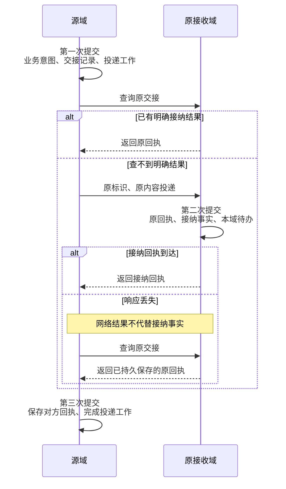

# 持久工作

| 日期 | 修订说明 |
| --- | --- |
| 2026-10-04 | 初版：命令回执、待办工作、领取与租约、领取代次与工作修订号、跨域交接、提交结果未知的恢复。 |
| 2026-10-04 | 按 `CLAUDE.md` 写作要求和[文档规范](../../conventions.md)修订用语：约束统一为"必须／不得""建议／不建议"，不再使用"应"；"执行端"统一为"执行端点"，发布回滚统一为"回滚"，授权统一用"撤销"。设计内容不变。 |
| 2026-10-04 | 按[架构评审处理记录](../../../review/archive/round-1/README.md)修订：命令范围改为引用 `CommandIdentity`（RV1）；异步命令增加"已受理"阶段，4.1 增加异步流程（RV2）；持久性改按档位声明（RV4、[ADR 0001](../../../adr/0001-durability-profiles.md)）；4.3 记录同库合并交接暂不采纳（RV12）；补充测试。 |
| 2026-10-05 | 可读性：4.3 增加 R7 三次提交与回执丢失的时序图。规则不变。 正文不再链接评审记录，理由保留在正文中。 |
| 2026-10-05 | 模块名称统一为“执行网关”，职责与契约不变。 |
| 2026-10-05 | 模块名称统一为“执行管理”，同步模块简称与图示；存储和连续性语境中的“账本”指其持久执行记录。职责与契约不变。 |
| 2026-10-05 | 模块名称由执行网关改回出口闸门，避免与网关与 SDK 撞名；职责与契约不变。 |
| 2026-10-06 | 按[第五轮评审处理记录](../../../review/disposition.md)修订：4.5 改为 P3、P4、P5 的正确顺序（X-03）；补 SQLite 部署下的受信时间与时钟跳变处理（DU-02）；列出非终结状态（DU-04）；DBOS 一行同步 ADR 0004（X-18）。 |
| 2026-10-07 | 补记 M1 保存工作兼容边界：领取前核验整批原契约版本，推进读取当前保存版本，按 ADR 0011 保留不支持历史；暂时依赖失败保留原身份供恢复，不生成拒绝决定。 |

- 状态：草稿
- 负责满足：G3、G11；为 C4、C5、C7 及其余不变量提供持久化基础
- 涉及场景：S2、S4、S5、S6、S7
- 上游：[项目目标](../../project-goals.md)、[分层与模块](../../layers.md)、[核心契约](../contracts/README.md)

持久工作是核心的"记账员"。它保证三件事：同一个命令只产生一个决定；接下的工作在进程崩溃后能被别人接着做；过期的工作者不能覆盖新的结果。它**不判断业务对错**，也**不判断外部动作能否重试**。前者是各事实写入方的职责，后者是执行管理的职责。

本设计选择**自建一个有限的持久工作模板**，而不是采用通用的持久执行引擎。这个模板只包含命令回执、事务性待办（outbox）、待办工作的领取、租约、领取代次和工作修订号，不发展成通用的代码重放框架。理由见 7.2。

## 1 职责与边界

| 持久工作负责 | 持有的事实 |
| --- | --- |
| 命令只被接纳一次 | 命令身份、请求指纹、不可变的原决定回执 |
| 工作可恢复 | 待办工作的规格、修订号、状态、最早可领取时间 |
| 并发推进的隔离 | 领取者、领取代次、租约期限 |
| 跨域交接可恢复 | 原交接记录、固定的接收方、对方回执、投递进度 |

| 相邻模块 | 分界 |
| --- | --- |
| 任务编排 | 裁决任务状态、准入、控制和 Result；持久工作只负责把这些决定和回执原子保存下来 |
| 会话、授权、预算 | 各自是自身事实的唯一写入方，通过核心契约定义的事务参与接口，与持久工作在同一事务里提交 |
| 执行管理 | 唯一裁决效果、迟到可能性、能否重试和怎样核对；持久工作不因租约过期而重置任何效果 |
| 内容治理 | 管理内容、用途和删除；回执和待办工作只保存引用，不保存正文 |
| 出口闸门 | 核验实际出口；持有有效领取不等于获准出口 |
| 运行记录 | 接收关联信息用于诊断，但不得代替回执、待办工作或账本 |
| 可替换部分 | 只能通过固定接口提交提议或回报，不得访问持久工作的内部表，也不得注册任意处理函数 |

几组容易混淆的概念必须分开：

- 待办工作处理完成，不代表任务成功；
- 对方持久接纳了动作意图，不代表动作已生效；
- 换了一个工作者接手，不代表换了执行管理或执行端点；
- **数据库提交结果未知**和**外部效果未知**是两件事，分别记录、分别恢复。

## 2 对象与状态

### 2.1 命令回执

| 字段 | 含义与约束 |
| --- | --- |
| 命令身份 | 核心契约的 [`CommandIdentity`](../contracts/README.md#31-命令回执查询通知与错误)：用户、调用者命名空间（`issuer_id`）、接收事务域、命令标识。`issuer_id` 由认证主体决定，不采信正文 |
| 命令标识 | 调用者生成并持久保存；重试时不得重新生成 |
| 命令类型、契约版本 | 决定命令怎样解释；同一标识下改变它们视为内容冲突 |
| 指纹版本、请求指纹 | 固定"内容是否相同"的比较规则；升级后不重算旧记录 |
| 阶段 | 已受理（只用于异步命令）或已决定 |
| 原决定 | 接受或拒绝，含稳定错误码、必要的版本和对象标识；只写一次 |
| 关联对象 | 原任务、动作、待办工作、交接等的标识 |
| 决定时间 | 由权威存储记录 |

回执状态的转换：

- 同步命令：`不存在 → 已接受`，或 `不存在 → 已拒绝`，与业务修改在一个事务；
- 异步命令：`不存在 → 已受理 → 已接受 / 已拒绝`。"已受理"与待办工作同事务提交，表示系统已承担给出决定的责任，**不是业务决定**；决定与业务修改同事务提交。

原决定一经写入永不改变。数据库暂时不可用、认证失败、无法解析、复制待核实等情况不是业务拒绝，不写决定。

回执不保存工具输出、大段用户输入、秘密或可复用的出口凭据。

**保留规则：**

- 最小回执（命令标识、指纹版本、指纹、原决定、关联对象标识、决定时间）**长期保留，M1 不设删除期限**；
- 原始参数、工具结果和证据放在内容治理中，按各自期限清理；
- 只留"标识和指纹"而丢掉原决定的墓碑，只能阻止重复，做不到"返回原决定"，因此不够；
- 尚未确认的交接、未知效果和恢复所需的记录，不因任务关闭或时间流逝而清理；
- 用户账户或命令命名空间彻底退役后，旧标识必须被拒绝，不得被当作首次请求。

这些最小回执属于项目目标定义的**最小责任记录**：不含内容正文，删除内容时保留，有独立的用途限制和保存期限。

### 2.2 待办工作（Job）

| 字段 | 含义与约束 |
| --- | --- |
| 工作标识 | 稳定、唯一 |
| 用户、所属模块、所属事务域 | 限定访问和写入责任 |
| 工作类型、处理契约版本 | 来自核心固定的类型集合；升级后保留对旧版本的解释能力 |
| 责任对象 | 原任务、动作、执行尝试、交接或清理责任；不得靠重建任务来规避未知 |
| 工作规格引用 | 固定版本的输入和前提；使用内容时仍检查当前用途 |
| 工作修订号 | 工作规格或控制条件改变时递增；续租不改变它 |
| 状态 | 待领取、已领取、等待、受阻、已完成、已封闭 |
| 最早领取时间、优先级 | 调度提示，不承担业务顺序保证 |
| 领取者 | 本次领取的进程实例；进程重启后使用新的实例身份 |
| 领取代次 | 每次授予领取时递增；续租不递增 |
| 租约截止时间 | 按权威存储的时间计算和校验 |
| 领取次数、重试信息 | 用于诊断和退避；不等于外部执行次数，也不等于费用 |
| 目标端点、执行管理域 | 涉及动作时固定，不随工作者接替而改变 |

另设唯一的**工作目的键**，由所属模块、责任对象和这次推进的目的组成，防止重复通知产生重复的待办工作。

| 当前状态 | 可转换到 | 条件 |
| --- | --- | --- |
| 待领取 | 已领取 | 原子授予领取，并递增领取代次 |
| 等待 | 待领取 | 时间到达，或所属模块确认前提已具备 |
| 已领取 | 已完成 | 当前领取和工作修订号都有效，推进结果已持久保存 |
| 已领取 | 等待 | 已保存下一次的时间或等待条件 |
| 已领取 | 待领取 | 租约过期后原子回收；下次领取时代次递增 |
| 任意未终结状态（待领取、已领取、等待） | 受阻 | 达到恢复次数上限、版本不支持、缺少必要证明等；责任保留 |
| 受阻 | 待领取 | 所属模块显式恢复同一责任 |
| 任意未终结状态（待领取、已领取、等待、受阻） | 已封闭 | 所属模块确认这项工作不必继续 |

终态不会重新打开；后续推进创建一项关联原责任的新待办工作。封闭一项"发送工作"不会封闭已经发出的动作，也不会结束对它的核对责任。

### 2.3 跨域交接记录（outbox）

| 字段 | 含义与约束 |
| --- | --- |
| 交接标识 | 由源事务生成并固定，也是对方的命令标识 |
| 源用户、源事务域、意图引用 | 能追溯到原责任 |
| 接收事务域、目标端点 | 固定，路由重试不得改派 |
| 命令正文引用、指纹、契约版本 | 不可变；与对方比较内容的规则一致 |
| 投递状态 | 待投递、待查询回执、已被接纳、已被拒绝、受阻 |
| 对方回执 | 对方的原决定和对象标识 |
| 投递工作、重试时间、诊断信息 | 支持接替，不改变交接内容 |

接收方用自己的命令回执承担去重职责，不需要另建一个保留规则不同的收件箱。

### 2.4 四种标识，四个问题

| 标识 | 回答的问题 | 何时改变 |
| --- | --- | --- |
| 命令标识 | 这是不是原命令的重试 | 只有新的独立命令才改变 |
| 工作修订号 | 正在推进的工作内容是否仍然有效 | 工作规格或控制条件改变时 |
| 领取代次 | 这是不是当前的领取者 | 每次重新授予领取时 |
| 执行尝试标识 | 目标系统能否认出同一个外部动作 | 由执行管理固定，不随以上三者变化 |

外部幂等键绑定在执行管理固定的执行尝试标识上，**不得**绑定领取代次、工作者标识或待办工作的重试次数。否则每次接替都会生成一个新键，把同一个动作变成"新动作"。

## 3 接口

所有改变状态的接口都走同一套命令回执机制。处理函数只在事务内修改核心状态，外部调用必须在事务提交之后，由对应的核心路径发起。

| 接口 | 输入 | 成功含义 | 错误与幂等 |
| --- | --- | --- | --- |
| 执行命令 | 命令身份、版本、语义正文、处理类型、同步或异步 | 同步：原决定及相关的业务修改、待办工作和交接，已在一次提交中持久保存。异步：受理记录和决定待办已持久保存，返回受理回执 | 同标识同内容返回原决定；不同内容返回冲突。也可能返回访问拒绝、版本不支持、存储不可用、提交结果未知 |
| 查询命令回执 | 原命令身份 | 契约定义的五种结果之一：尚未发现、已受理待决定、已有决定、已退役、无法查询 | 只读。"尚未发现"不得当作"没提交"的证明 |
| 领取工作 | 领取命令标识、进程实例、允许的工作类型、批量上限 | 领取到的工作清单、修订号、领取代次、截止时间，均已持久保存 | 用原标识重试返回原清单；空清单也是固定结果，下一轮需要新的领取标识 |
| 续租 | 续租命令标识、工作、领取代次、进程实例、修订号 | 本次固定的新截止时间 | 必须仍是有效领取；重复续租返回原截止时间，不会再次延长 |
| 提交推进 | 推进命令标识、工作、领取代次、进程实例、修订号、所属模块的业务命令 | 业务修改、工作状态转换和后续工作原子提交 | 旧领取、旧修订号被拒绝；同标识重试返回原决定，不重新推进 |
| 修订或封闭工作 | 控制命令标识、预期修订号、所属模块的决定 | 新修订号或封闭回执 | 条件写入，版本冲突时拒绝；不得借此抹掉未知效果 |
| 查询工作和交接 | 用户、对象标识 | 当前状态、原回执引用、等待原因 | 只读，不触发重试或重新派发 |

"接纳交接""接纳执行尝试的回报"等，是由对应模块登记的命令类型，同样通过"执行命令"接口。持久工作不提供裁决效果的通用接口。

回执只描述**原决定**。例如领取回执丢失后再查询，可能拿回一个已经过期的租约；拿回回执不等于恢复领取权。

## 4 关键流程

### 4.1 首次命令与重复命令

| 步骤 | 处理 | 持久化 |
| --- | --- | --- |
| 1 | 验证身份、范围和契约，按固定版本计算指纹 | 无 |
| 2 | 在事务中争取唯一的命令标识 | 唯一性竞争发生在权威存储 |
| 3 | 已有回执：指纹相同返回原决定，不同则拒绝 | 不重新裁决 |
| 4 | 首次命令：由所属模块检查当前事实并裁决 | 与业务修改在同一事务 |
| 5 | 写入原决定回执、业务修改、必要的待办工作和交接 | **一次原子提交** |
| 6 | 收到满足持久性要求的提交成功后才返回确认 | 提交结果未知时返回可恢复的未知状态 |

已持久保存的拒绝同样不变：命令因条件版本不符被拒绝后，即使条件随后改变，同一标识仍返回原拒绝。

使用 PostgreSQL 时要注意：`INSERT ... ON CONFLICT DO NOTHING` 可能因为并发事务而放弃插入，而冲突的那一行在本语句的快照里仍然不可见。必须用下一条语句的新快照读取回执，或者按隔离级别重试整个事务；不得把同一语句的空结果当成"首次接纳"（[PostgreSQL 18 唯一性检查](https://www.postgresql.org/docs/18/index-unique-checks.html)、[事务隔离](https://www.postgresql.org/docs/18/transaction-iso.html)）。

**异步命令：先受理，后决定。**

1. 与上表步骤 1–3 相同；重复投递返回已有的受理回执，以及已有的决定回执，不再创建待办；
2. 首次命令：在一个事务中写入受理记录和"作出决定"的待办工作，返回受理回执；
3. 工作者领取待办，由所属模块按**当前**事实裁决，在一个事务中写入决定、业务修改和后续交接；
4. 只有确定的业务原因才写拒绝。暂时不可达时，待办保持等待或受阻，不写决定。

受理与决定之间，用户可能撤销授权、预算可能耗尽、条件可能修改。裁决以当前事实为准，受理记录不因此改变。界面可以把受理显示为"已提交，等待核验"，只有决定为接受后才显示"已准入"。

### 4.2 提交结果未知

提交请求发出后连接断开，调用方不知道事务是否提交。处理原则：

1. 不宣称失败，也不换新标识重试；
2. 用原标识查询回执；
3. 查不到时，用**原标识、原内容**重新进入同一个幂等事务。唯一性竞争会决定唯一的提交者：原事务已提交，就返回原决定；原事务已回滚，本次成为首次提交；原事务仍在途中，就等它结束；
4. 等待超时，继续保持"未知"。

这种重入之所以安全，是因为处理函数只修改事务内的核心状态，不在事务中调用外部系统。数据库命令可以这样恢复，外部动作不行。外部动作的恢复只能由执行管理按重试门禁决定。

FoundationDB 的 `commit_unknown_result` 专门保证原事务已不在途，但普通的超时或取消错误没有这个保证，提交仍可能迟到生效（[FoundationDB 7.3.63 开发指南](https://github.com/apple/foundationdb/blob/7.3.63/documentation/sphinx/source/developer-guide.rst)）。所以本设计不依赖任何数据库特有的错误语义，统一用"原标识查询 + 原标识重入"来恢复。

### 4.3 跨域交接（R7）

| 阶段 | 处理 | 持久化 |
| --- | --- | --- |
| 源方记录 | 业务意图、交接记录和投递工作一起提交 | 源域事务 |
| 投递 | 先查询原交接；查不到明确结果时，用原标识、原内容向原接收方投递 | 网络成功不算业务接纳 |
| 对方接纳 | 对方保存原回执、接纳的事实和本域的待办工作 | 接收域事务 |
| 源方收据 | 保存对方回执，完成投递工作 | 源域事务 |

下图是 R7 的三次提交和回执丢失后的处理：源方总是先查询原交接，查不到明确结果才按原标识、原内容重投；响应丢失时再次查询，不新建交接。



源方仍然持有原来的责任，对方接纳的是它负责的那部分事实，例如动作意图。响应丢失不会产生新的交接，也不会改派到别的端点。即使两个事务域部署在同一个进程或同一个数据库里，M1 也保留这三次独立提交和恢复语义。同库时合并为一次事务的方案已经评估，暂不采纳：它会引入第二种交接实现，使故障测试翻倍，且尚无数据证明三次提交是瓶颈。M6 容量测试显示交接提交在尾延迟或写入量中占主要比例时再议。

核心模块之间的交接属于**可信基础设施 I/O**，不经过出口闸门，但只能使用固定的身份和固定的目标，不得承载扩展发起的请求。这个边界避免了"为了记录一次交接，又要先准入一次交接"的递归。

### 4.4 领取与推进

M1 的领取批次必须在修改任何工作之前核验全部选中工作的保存契约版本；不支持时整批拒绝。推进、续租和控制必须核验当前保存工作的版本，不能只检查调用方的旧领取副本。格式与停机恢复边界见 [ADR 0011](../../../adr/0011-m1-format-and-stopped-recovery.md)。

1. 用短事务选出可领取的工作，原子地设置进程实例、递增领取代次、设置截止时间，并保存领取回执；
2. 工作者拿到回执后，读取原责任和当前事实；
3. 推进时，在一个事务里锁定该工作，核验：

   ```text
   状态为已领取 ∧ 进程实例匹配 ∧ 领取代次匹配 ∧ 工作修订号匹配 ∧ 租约未过期
   ```

4. 在同一事务里，所属模块写入业务进展，持久工作转换工作状态并创建后续工作。

核验和写入必须在同一个事务的锁定范围内完成。先单独查一次租约，再另开事务提交，会重新引入"检查之后、写入之前"的竞争窗口。租约有效性用锁定之后取得的权威时间判断（在 PostgreSQL 中是 `clock_timestamp()`，而不是表示事务开始时间的 `now()`）。SQLite 没有服务器时间（M1 和端侧），权威时间由受信时钟实现（`infra/clock`）在写事务内提供：持久保存的截止时间使用墙钟；进程内的已过时间使用单调时钟，单调时钟的原始值不跨进程或重启持久保存。检测到墙钟回拨或异常跳变时，进入"时钟不可置信"等待，停止授予新领取和续租，直到时钟恢复可信；已有领取仍由领取代次和锁内核验保护写入。工作者的本地计时只用于提前主动停手，正确性依靠领取代次和事务核验。

每个事务域只用本域的领取来保护本域的写入。源方的租约不能证明它对接收域有写入权；跨域必须使用原交接身份，接收域用自己的领取机制。

### 4.5 外部动作与接替

| 步骤 | 负责方 | 处理与持久化 |
| --- | --- | --- |
| 准入 | 裁决域 | 保存条件、授权、预算依据和动作意图，按 R7 交接给执行管理 |
| 登记尝试 | 执行管理 | 固定执行尝试、发送身份、目标端点和外部键（P3） |
| 开始门禁 | 裁决域 | 再核验一次当前的出口前提，保存开始回执（P4） |
| 记下可能已发出 | 执行管理 | 核对开始回执和派发控制，标记 `DISPATCH_POSSIBLE`（P5） |
| 实际调用 | 出口闸门、执行适配器 | 调用目标系统；顺序以[出口闸门 4.1](../egress/README.md#41-正常调用)为准 |
| 接收结果 | 执行管理 | 保存回报和证据，裁决效果或保持未知，必要时创建核对工作 |
| 工作者接替 | 同一执行管理 | 读取原尝试；不会因为重新领取工作就再发一次调用 |

`DISPATCH_POSSIBLE` 在开始回执之后、调用**之前**写入。这样即使崩溃发生在"已记录、未发送"之间，恢复时也会保守地当作"可能已发出"处理，而不是猜测没发出。

即使旧进程在最后一次核验之后暂停、恢复后又把请求发了出去，新工作者也只核对原尝试。领取代次保证旧进程无法覆盖账本记录；外部世界里可能迟到的效果，由执行管理继续负责。Chubby 的做法是把锁的代次交给被保护的资源由它来校验；Kleppmann 用进程暂停和网络延迟的反例说明，只在发送前检查一次租约，保护不了之后发生的写入（[Chubby §2.4](https://www.usenix.org/legacy/event/osdi06/tech/full_papers/burrows/burrows_html/index.html)、[How to do distributed locking](https://martin.kleppmann.com/2016/02/08/how-to-do-distributed-locking.html)）。外部系统一般不认识 Lerna 的领取代次，所以 fencing 只能保护账本，外部效果只能靠幂等、查询或保守等待。

### 4.6 回收与诊断

- 定期扫描待领取、到期等待、租约过期和未完成的交接。通知只用来降低延迟，不是正确性的依据；
- 重试使用指数退避加抖动；达到上限进入"受阻"，责任不删除；
- 升级时保留对旧命令和旧处理契约的解释能力，或执行受控迁移；遇到不支持的版本就停在"受阻"；
- 发现业务责任和派生的待办工作不一致时，由所属模块按稳定的责任标识修复；无法确定就停下并报告。

## 5 故障与恢复

| 故障 | 负责方 | 恢复方式 |
| --- | --- | --- |
| 命令回执丢失 | 调用方、持久工作 | 用原标识查询，必要时原标识原内容重入；不得换标识 |
| 领取回执丢失 | 工作者、持久工作 | 用原领取标识查询，拿回原清单和代次；租约已过期就停止使用 |
| 事务提交结果未知 | 持久工作 | 不宣称失败；查询或原标识重入。一次查不到不下结论 |
| 源方提交前崩溃 | 源域存储 | 事务回滚，不存在已确认的责任 |
| 源方提交后崩溃 | 持久工作 | 扫描原交接和待办工作，由新工作者接手 |
| 对方已接纳、源方未保存回执 | 源方持久工作、接收模块 | 查询原交接，保存原回执；对方不会再创建一份责任 |
| 外部调用前后崩溃 | 执行管理 | 读取原尝试，按幂等、核对或保守等待恢复 |
| 重复请求、重复消息 | 接收域持久工作 | 同内容返回原决定，不同内容拒绝；投递次数不增加业务决定数 |
| 并发的首次请求 | 持久工作 | 唯一键决定唯一的提交者；被回滚的一方可以用原标识继续 |
| 并发领取、续租、修订 | 持久工作 | 行锁或等价的条件写入串行化；旧代次、旧修订号被拒绝 |
| 死锁、序列化失败 | 持久工作 | 只对确定已回滚的事务按原标识重试；从不执行事务外的副作用 |
| 数据库、接收域或网络不可用 | 持久工作、所属模块 | 保持等待或受阻；不得用内存记录确认责任，不得改派未知动作 |
| 旧工作者迟到完成 | 持久工作 | 拒绝它完成当前工作或覆盖当前推进 |
| 原执行尝试迟到回报 | 执行管理 | 按原尝试标识去重后独立接纳证据；不要求旧领取仍然有效 |
| 取消与发送竞争 | 任务编排、执行管理 | 停止新的准入，封闭尚未发送的动作；可能已发出的继续核对 |
| 存储回退到旧备份 | 存储负责方、核心 | 停止出口和新的推进；不得直接复用回退后的回执、代次和责任视图 |

迟到的"工作完成写入"和迟到的"外部事实回报"要分开处理：前者受领取代次约束，直接拒绝；后者是需要核验的事实输入，不得因为领取过期就丢弃。

## 6 不变量落实

| 不变量 | 本模块怎样保证 | 怎样验证 |
| --- | --- | --- |
| G1 | 接替只重新推进核心命令；外部重试必须经执行管理按重试门禁裁决 | 租约过期、目标已生效、响应丢失时，不幂等的动作不会被重发 |
| G2 | 待办工作完成只表示这项推进完成；不写任务成功，不自动封闭未知动作 | 所有工作都已完成但仍有未知动作时，完成门禁拒绝成功 |
| G3 | 回执、业务修改、待办工作和交接在同一事务；达到所声明的持久档位后才确认 | 在每个提交点前后注入崩溃和响应丢失 |
| G4 | 原子保存所属模块的前提依据；领取权不得代替准入和出口凭据 | 条件、授权或预算变化后，旧工作无法越过出口 |
| G5 | 核心工作类型是固定集合；核心模块间交接是可信基础设施 I/O，只用固定身份和目标 | 审计处理类型和出口路径，交接通道无法承载扩展请求 |
| G6 | 只保存所属模块的决定，不执行推理直接给出的函数或工具调用 | 提议无法直接产生外部发送 |
| G7 | 工作参数和回执不签发权限；命令范围由身份和路由验证 | 伪造用户、端点或扩大范围都被拒绝 |
| G9 | 回执和工作只保存引用和最小元数据；旧工作版本不得复活已删除的内容 | 删除后重试、重启、迟到消息都不会重新产生可用副本 |
| G10 | 调度次数不作为计费来源；费用由预算按计费来源去重 | 不同命令标识回报同一计费来源，只计一次 |
| G11 | 原责任、交接、执行管理和执行端点固定；只有进程实例可以替换 | 崩溃、断网、取消之后，不出现替代任务或改派的动作 |
| G12 | 唯一键、查询、领取和资源上限都带用户范围 | 不同用户使用同一标识互不干扰；越界查询被拒绝；热点用户不影响其他用户 |

**持久性的范围（G3）。**确认必须在存储达到所声明的持久档位之后才发出（见 [ADR 0001](../../../adr/0001-durability-profiles.md) 和[数据与存储 5.4](../../topics/data-and-storage.md#54-持久档位)）。云端生产档要求同步复制到另一个可用区后才确认，单机 PostgreSQL 的异步提交和默认的异步复制都存在"已确认但切换后丢失"的窗口（[异步提交](https://www.postgresql.org/docs/18/wal-async-commit.html)、[复制与同步确认](https://www.postgresql.org/docs/18/warm-standby.html)）。本地档（M1 和端侧）的 SQLite 使用 WAL 和 `synchronous=FULL`，并按平台准入表补齐实际的同步屏障，例如 macOS 默认 VFS 还需要 `fullfsync=ON`；`NORMAL` 在掉电时可能丢失已提交事务，WAL 也不能放在网络文件系统上（[SQLite WAL](https://www.sqlite.org/wal.html)、[synchronous](https://www.sqlite.org/pragma.html#pragma_synchronous)）。本地档不覆盖存储介质永久丢失。超出声明范围的故障（例如整个地域丢失、从旧备份恢复）发生后，系统停止出口和新的推进，保留未知，不从旧快照猜测继续。

## 7 取舍

### 7.1 命令去重：调用方标识加指纹，长期保留最小回执

| 方案 | 结论 | 理由 |
| --- | --- | --- |
| 用参数哈希作为命令标识 | 不采用 | 无法区分两个参数相同、但彼此独立的命令 |
| 内存或独立缓存去重 | 只能用于加速 | 与业务修改不原子，崩溃后会失忆 |
| **调用方稳定标识 + 指纹 + 同事务回执** | 采用 | 原决定与业务修改一起固定 |
| 调用方世代 + 序号 + 确认水位 | 后续候选 | 能证明旧请求已失效，从而安全压缩回执，但需要客户端持久保存更多状态 |

关于保留多久：固定 TTL 后删除，迟到的重试会被当作新请求再执行一次。Stripe 的幂等键至少保存 24 小时，之后复用会被视为新请求（[Stripe](https://docs.stripe.com/api/idempotent_requests)）。RIFL 论文指出，客户端断网超过普通 TTL 后再重试，会造成无法检测的双重执行；它的回收方案结合客户端确认水位和租约，拒绝已失效的旧请求（[RIFL，SOSP 2015](https://sigops.org/s/conferences/sosp/2015/current/2015-Monterey/126-lee-online.pdf)）。所以 M1 长期保留最小回执，等确认水位协议有了证明、保留成本也测量过之后，再考虑压缩。

### 7.2 自建有限模板，还是采用持久执行引擎

| 方案 | 适配情况 | 结论 |
| --- | --- | --- |
| **自建有限模板** | 直接落实既定的事务域、R3 和 R7；效果仍归执行管理 | M1 采用；不得扩展成通用重放框架 |
| Temporal | 获得成熟的计时、等待和恢复能力；增加服务器和工作者运维，要管理历史重放兼容性 | 大量长期编排出现后再评估 |
| DBOS | 事务步骤可以和业务修改同库同事务，接近裁决域模型；跨库和端侧仍需 R7 | 开发语言已定为 Go（[ADR 0004](../../../adr/0004-language-and-stack.md)）；需要时按 Go 版本和 SQLite 支持重新核实 |
| Restate | 持久调用和 epoch 机制可以承担运行基础设施；若把核心事实迁入其内部状态，会影响既定的存储和事务域 | 需要单独决定 |

这几种引擎都不能消除外部效果的未知。Temporal 官方文档给出的反例是：外部调用已经完成，但上报完成前进程崩溃，Activity 随后被重试（[Temporal Activity](https://docs.temporal.io/activity-definition)）。DBOS 的普通步骤先执行函数、再记录输出，中间同样存在"效果已发生、记录未保存"的窗口（[DBOS 事务](https://docs.dbos.dev/typescript/tutorials/transaction-tutorial)）。Restate 用 invocation epoch 拒绝旧执行的回报，但这只保护引擎日志，撤不回已经发往外部的请求（[Restate v1.4.0](https://github.com/restatedev/restate/blob/2bac751a2c0ec48130ea501a63ab77837d3f6fa3/crates/worker/src/partition/state_machine/mod.rs#L1825)）。另外，DBOS Python 2.0.0 更换了序列化格式，旧版本的工作流不能直接在新版本中恢复（[发布说明](https://github.com/dbos-inc/dbos-transact-py/releases/tag/2.0.0)），这说明引擎升级本身就是一个兼容性风险。

结论是：引擎能减少调度代码，但"命令只决定一次""外部效果按证据裁决""责任不随故障转移"这三件事，Lerna 无论如何都要自己负责。将来如果接入引擎，以下内容必须保留在核心：命令指纹和原决定回执；执行管理对未知效果、核对和重试的裁决；任务、动作、执行尝试和端点的稳定身份；条件、授权和预算的当前检查，以及完成门禁；内容治理。引擎的自动重试只能重复"推进执行管理的幂等命令"，不得直接重复任意工具调用。

### 7.3 待办工作放在关系数据库，还是专用队列

| 方案 | 特点 | 适用 |
| --- | --- | --- |
| **关系数据库中的工作表**（云端 PostgreSQL） | 业务修改、回执、待办工作可以同一事务；不引入新的故障域；需要管理扫描、索引、表膨胀和续租写入 | 云端起点 |
| 嵌入式关系库（端侧 SQLite） | 本机原子接纳；同一时刻只有一个写入者 | 端侧和单机 M1 |
| RabbitMQ、SQS 等工作队列 | 传输和消费可以独立扩缩；仍需要源方 outbox、接收方回执和核心的领取记录 | 测出数据库队列瓶颈之后 |
| Kafka 等日志 | 适合回放、多消费者和分区内有序；写外部系统仍需另行协调 | 有明确的事件流需求时 |

PostgreSQL 文档把 `SKIP LOCKED` 定位为队列表的并发消费工具，同时说明它提供的是不一致视图，不保证顺序（[SELECT](https://www.postgresql.org/docs/18/sql-select.html)）。因此本设计只用它来**挑选候选工作**；任务顺序、条件版本和完成门禁都不依赖队列顺序。专用队列也有各自的重复边界：RabbitMQ 的生产者确认丢失后重发会产生重复，SQS FIFO 的去重窗口只有 5 分钟（[RabbitMQ 可靠性](https://www.rabbitmq.com/docs/4.1/reliability)、[SQS FIFO](https://docs.aws.amazon.com/AWSSimpleQueueService/latest/SQSDeveloperGuide/FIFO-queues-exactly-once-processing.html)）。引入专用队列后，它只传递工作标识和唤醒通知；业务决定、当前修订号和领取权仍以权威记录为准。

成熟的队列库也需要逐项核对是否满足要求。例如 Graphile Worker v0.16.6 的领取使用了 `SKIP LOCKED`，但它完成工作时只按工作标识删除，没有带上领取代次（[completeJob.ts](https://github.com/graphile/worker/blob/5650fbc4406fa3ce197b2ab582e08fd20974e50c/src/sql/completeJob.ts)）。这一处不足以代表整个项目，但说明"用了数据库锁"不足以证明能隔离旧领取。

### 7.4 领取代次与工作修订号分开

只有租约加工作者标识，旧进程恢复后仍可能写入；只加领取代次，能隔离旧领取，但识别不了"工作内容已经改了"。因此两个版本都要：领取代次回答"是不是当前的领取者"，工作修订号回答"是不是当前这版工作"。

### 7.5 需要记录 ADR 的决定

持久性的故障范围已写入 [ADR 0001](../../../adr/0001-durability-profiles.md)。回执保留协议，以及持久工作与执行引擎的分工，正式采纳前必须各写一篇 ADR。

## 8 待定事项

| 事项 | 怎样决定 |
| --- | --- |
| 云端同步复制的具体配置和主库切换条件 | 与[数据与存储](../../topics/data-and-storage.md)共同确定 |
| 最小回执的删除规则、账户退役后旧命名空间的拒绝规则 | 与内容治理、授权共同确定 |
| 初始租约时长（候选 30 秒，约 10 秒续租一次） | 测量进程暂停、网络延迟、写入成本和接替时间；这些参数不承担正确性 |
| 数据库队列能否承载 M1 和早期部署 | 测领取竞争、长尾延迟、积压、恢复扫描和表膨胀 |
| 长期保留最小回执的存储成本 | 按命令速率、记录和索引大小、保留年限估算 |
| 何时引入回执压缩、专用队列或执行引擎 | 由测量结果和真实需求触发，不预先实现 |

## 9 M1 范围

"持久工作完整"指的是下面这些**语义**完整，不要求 M1 达到生产容量或实现所有部署后端。

| M1 必须实现 | 程度 |
| --- | --- |
| 命令回执 | 接受和拒绝都固定；同标识同内容返回原决定，不同内容拒绝 |
| 事务参与 | 业务修改、回执、必要的待办工作同一事务；处理函数没有事务外的副作用 |
| 提交结果未知 | 原标识查询和原标识安全重入；明确区分"没看到"和"确定没提交" |
| 跨域交接 | 三次持久提交完整；回执丢失时查询原交接；同进程部署也不省略 |
| 待办工作 | 原子领取、有界租约、续租、领取代次、工作修订号、受阻和封闭 |
| 接替与 fencing | 旧领取无法覆盖当前推进；不改变动作的执行端点 |
| 与执行管理协作 | 先读原尝试，再核对或安全重发；迟到的回报独立接纳 |
| 回执保留 | 没有自动删除期限；内容与最小决定分离 |
| 后端 | 只实现一个选定的事务后端，通过同一套语义测试 |

可以推迟的：多用户的公平调度、分片迁移和容量压测推迟到 M6；回执压缩、专用队列和执行引擎等测量证明需要时再做。幂等、领取 fencing、提交结果未知的处理、与未知效果的协作和 R7，都不得以"以后拆进程再做"为由推迟。

## 10 测试要点

测试必须通过公开接口观察结果，并在真实的存储后端上覆盖事务行为。

| 用例 | 注入 | 必须满足 | 对应 |
| --- | --- | --- | --- |
| 原决定重放 | 提交成功后丢失响应 | 回执相同；业务修改、待办工作、交接各只有一份 | G3 |
| 同标识并发 | 内容相同；第一个事务分别提交、回滚、长期在途 | 最多一个决定；等待超时不声称失败 | G3、G11 |
| 内容冲突 | 同一标识改变类型、版本、目标或参数 | 冲突方不改变原指纹、原决定和业务状态 | G3 |
| 拒绝固定 | 原命令被拒绝后前提发生变化 | 同一标识仍返回原拒绝 | G3、G6 |
| 受理后崩溃 | 异步命令受理后、决定前反复崩溃；期间并发重投 | 最多一个受理、一个决定；重投不创建新待办 | G3、G11 |
| 受理后前提变化 | 受理后撤销授权、预算不足、条件修改 | 决定为拒绝，受理记录不变；不把暂时不可达写成拒绝 | G3、G4 |
| 提交迟到 | COMMIT 响应断开，查询未命中，原事务稍后提交 | 不产生新标识，不产生第二份责任 | G3、G11 |
| 快照不可见 | PostgreSQL 同语句插入未返回行，查询也未命中 | 不绕过去重，不认定为未受理 | G3 |
| 交接每段崩溃 | 源方提交前后、对方提交后、源方保存回执前 | 责任不丢；恢复原交接；对方不重复接纳 | R7、G3、G11 |
| 队列重复投递 | 确认丢失、重投、去重窗口到期 | 核心只产生一个接纳决定 | G3 |
| 旧领取覆盖 | 旧工作者暂停，新工作者领取并推进，旧工作者恢复 | 旧工作者的完成、续租和写入全部被拒绝 | G3、G11 |
| 工作修订 | 领取后修改工作规格或取消 | 旧修订号无法推进；原回执不变 | G4、G11 |
| 续租重复 | 同一续租请求重复到达 | 截止时间不被重复延长 | G3 |
| 外部效果窗口 | 外部已生效、响应丢失、租约过期 | 不幂等的动作不重发，保持未知或进入核对 | G1、S7 |
| 核验后暂停 | 出口核验后旧进程暂停，之后请求迟到到达 | 旧进程失去领取权不被当作"未发生"的证明 | G1、G2 |
| 迟到证据 | 旧工作的完成被拒绝，但原尝试返回了效果 | 证据被独立接纳；不覆盖当前工作，不抹掉责任 | G1、G11 |
| 费用重复回报 | 同一计费来源用不同命令标识回报 | 只计一次 | G10 |
| 删除后恢复 | 旧工作、迟到消息、进程重启 | 不会重新使用已删除的内容 | G8、G9 |
| 用户隔离 | 不同用户使用相同标识；伪造范围；热点用户 | 回执、工作、费用互不串用 | G12 |
| 持久性 | 掉电；声明范围内的主库切换；从旧备份恢复 | 已确认的责任不丢；无法证明时停止出口 | G3、G11 |

通过标准包含三个独立的计数，吞吐、延迟和自动完成率不得代替它们：

1. **命令决定数**：同一范围、同一标识最多一个；
2. **责任链完整性**：每项已确认的责任都有可查询的记录和后续处理状态；
3. **外部效果的恢复行为**：与目标系统声明的能力一致；既不能查询也不幂等的未知动作，允许长期停在受阻状态。

## 参考资料

- Amazon Builders' Library，Making retries safe with idempotent APIs：https://aws.amazon.com/builders-library/making-retries-safe-with-idempotent-APIs/
- Stripe 幂等请求（2026-10-04 访问）：https://docs.stripe.com/api/idempotent_requests
- Lee 等，Implementing Linearizability at Large Scale and Low Latency（RIFL，SOSP 2015）：https://sigops.org/s/conferences/sosp/2015/current/2015-Monterey/126-lee-online.pdf
- FoundationDB 7.3.63 开发指南：https://github.com/apple/foundationdb/blob/7.3.63/documentation/sphinx/source/developer-guide.rst
- PostgreSQL 18 文档：[SELECT](https://www.postgresql.org/docs/18/sql-select.html)、[唯一性检查](https://www.postgresql.org/docs/18/index-unique-checks.html)、[事务隔离](https://www.postgresql.org/docs/18/transaction-iso.html)、[异步提交](https://www.postgresql.org/docs/18/wal-async-commit.html)、[复制](https://www.postgresql.org/docs/18/warm-standby.html)
- SQLite：[WAL](https://www.sqlite.org/wal.html)、[synchronous](https://www.sqlite.org/pragma.html#pragma_synchronous)
- Debezium，Reliable Microservices Data Exchange With the Outbox Pattern（2019-02-19）：https://debezium.io/blog/2019/02/19/reliable-microservices-data-exchange-with-the-outbox-pattern/
- Burrows，The Chubby lock service（OSDI 2006）：https://www.usenix.org/legacy/event/osdi06/tech/full_papers/burrows/burrows_html/index.html
- Kleppmann，How to do distributed locking（2016-02-08）：https://martin.kleppmann.com/2016/02/08/how-to-do-distributed-locking.html
- Temporal Activity 定义：https://docs.temporal.io/activity-definition
- DBOS 事务教程：https://docs.dbos.dev/typescript/tutorials/transaction-tutorial ；DBOS Python 2.0.0 发布说明：https://github.com/dbos-inc/dbos-transact-py/releases/tag/2.0.0
- Restate v1.4.0 epoch 核验源码：https://github.com/restatedev/restate/blob/2bac751a2c0ec48130ea501a63ab77837d3f6fa3/crates/worker/src/partition/state_machine/mod.rs#L1825
- Graphile Worker v0.16.6 completeJob：https://github.com/graphile/worker/blob/5650fbc4406fa3ce197b2ab582e08fd20974e50c/src/sql/completeJob.ts
- RabbitMQ 4.1 可靠性指南：https://www.rabbitmq.com/docs/4.1/reliability
- Amazon SQS FIFO 去重：https://docs.aws.amazon.com/AWSSimpleQueueService/latest/SQSDeveloperGuide/FIFO-queues-exactly-once-processing.html
