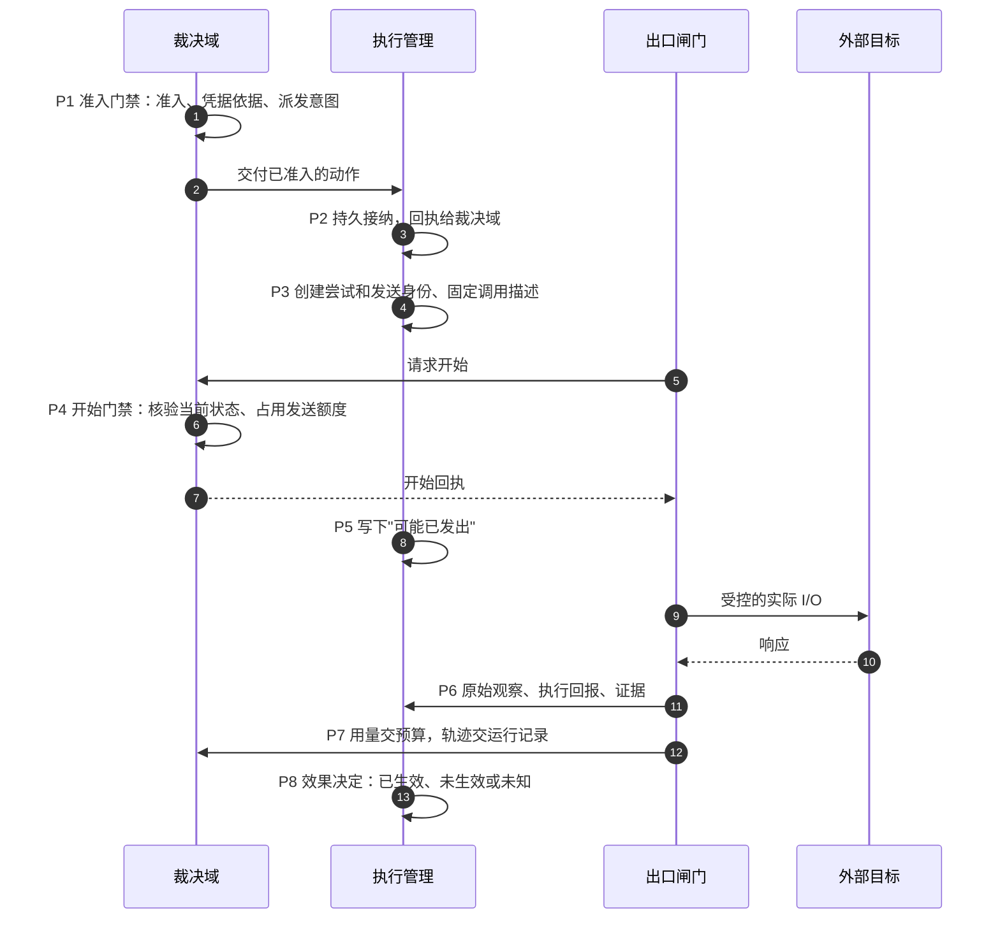
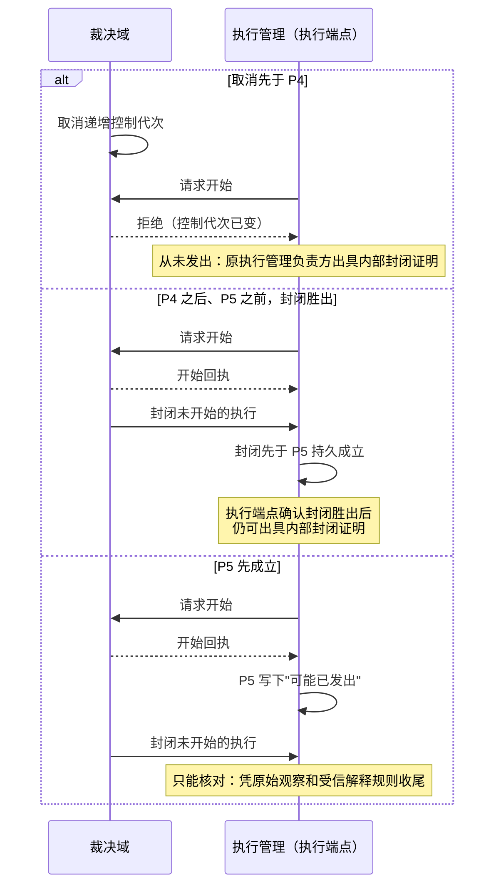

# 出口闸门

| 日期 | 修订说明 |
| --- | --- |
| 2026-10-04 | 初版：语义闸门加强制隔离、凭据核验、执行开始排序点、各类出口的执行要求、禁止隐藏重试、流式用量、旁路检测方法。 |
| 2026-10-04 | 按 `CLAUDE.md` 写作要求和[文档规范](../../conventions.md)修订用语：约束统一为"必须／不得""建议／不建议"，不再使用"应"；"执行端"统一为"执行端点"，发布回滚统一为"回滚"，授权统一用"撤销"。设计内容不变。 |
| 2026-10-04 | 按[架构评审处理记录](../../../review/archive/round-1/README.md)修订：P4 核验已准入动作的授权使用记录，不再要求剩余次数（RV3）；凭据和核验加入处理目的（RV9）；端侧 P4、P5 受账本启动状态约束（RV7）。 |
| 2026-10-04 | 按[第二轮评审处理记录](../../../review/archive/round-2/disposition.md)修订：P4 的排序对象增加"会改变任务依据的输入"，通过控制代次检查挡住旧动作开始（R2-02）。模型调用的出口核验对象是受信宿主固定的完整调用描述（R2-05）。 |
| 2026-10-04 | 按[第三轮评审处理记录](../../../review/archive/round-3/disposition.md)修订：P4 逐级核验祖先任务的控制代次（R3-03）和记忆依赖（R3-05）；可信边界登记原始观察，适配器的解析结果是派生解释（R3-06）。 |
| 2026-10-04 | 按[第四轮评审处理记录](../../../review/disposition.md)修订：P4 占用实际发送额度（R4-03）；P4 与 P5 之间的封闭需执行端点确认才能出具内部封闭证明（R4-05）；开始核验递增控制代次后，清单中未到 P4 的动作在此被拒绝（R4-01）。 |
| 2026-10-05 | 可读性：4.1 第 4 步改为引用[核心契约 2.6](../contracts/README.md#26-四道门禁)的开始门禁，增加 P1–P8 时序图和取消与发送竞争的分支图；P4 的排序说明区分任务事件（递增控制代次）与授权撤销（改变授权状态）。规则不变。 |
| 2026-10-05 | 项目目标 10.2 撤销 V2（手机 GUI）后同步：GUI 与用户接管改为 M4 可选。 |
| 2026-10-05 | 模块名称统一为“执行网关（Execution Gateway）”，正文以“调用语义核验”描述其检查机制；职责、契约与目录路径不变。 |
| 2026-10-05 | 图中的跨域交接改用具体行为说明，规则编号及解释放在图注或正文；交接机制不变。 |
| 2026-10-05 | 模块名称统一为“执行管理”，同步模块简称与图示；存储和连续性语境中的“账本”指其持久执行记录。职责与契约不变。 |
| 2026-10-05 | 模块名称由执行网关改回出口闸门，避免与网关与 SDK 撞名；恢复被改写的历史修订行；职责与契约不变。 |
| 2026-10-07 | 补记 M1 实际启用出口的验收边界：区分固定装配、公开不支持请求的拒绝和未开放运行时，拒绝发生在创建尝试之前并保留原责任。 |

- 状态：草稿
- 负责满足：G4、G5；协同落实 G1–G3、G6–G12
- 涉及场景：S1–S8
- 上游：[项目目标](../../project-goals.md)、[分层与模块](../../layers.md)、[核心契约](../contracts/README.md)、[授权](../grants/README.md)、[执行管理](../ledger/README.md)

出口闸门（Egress Gate）是动作访问外部资源的**唯一受控通道**。模型调用、HTTP 请求、文件操作、设备操作、子进程、遥测上传，只要数据或指令离开受控范围、或可能产生外部效果和费用，都必须从这里经过。

它做三件事：在实际出口处**再核验一次**当前的凭据、授权和控制状态；把执行尝试交给执行管理、用量交给预算、轨迹交给运行记录；**阻止任何旁路**。它不建立自己的事实库。

本设计的结论是：**调用语义核验加强制隔离。**可替换部分只能提交受约束的调用描述，手里没有通用的网络、文件、设备或子进程能力；真实的 socket、文件句柄、设备和进程能力只存在于可信的执行边界内。单靠 SDK 包装、透明代理、网络策略或系统调用过滤，任何一项都不足以保证 G5（见 7.1）。

"唯一"指的是统一的契约和必经的路径，不是全系统只有一个进程。每个执行端点都可以部署出口闸门，跨端点遵守同一契约。

## 1 职责与边界

| 相邻模块 | 分界 |
| --- | --- |
| 任务编排 | 持有任务、条件、控制和准入决定；出口闸门检查它们的引用，不批准提议，不判断完成 |
| 授权 | 签发、撤销、核验、消费出口凭据；出口闸门不扩大授权 |
| 预算 | 持有额度、预留、用量和结算；出口闸门提交观测，不维护权威费用 |
| 执行管理 | 持有尝试、效果和迟到可能性，决定核对和重试；出口闸门报告执行边界上的事实，不把超时裁决为未生效 |
| 持久工作 | 保存命令回执、交接待办和领取状态；出口闸门重启后依此恢复 |
| 内容治理 | 判断内容能否被读取、处理、保存、同步、外发；管理输出的来源和派生关系 |
| 运行记录 | 持有跨模块轨迹；出口闸门提供事件和关联标识 |
| 可替换部分 | 构造调用描述、解释响应、产生提议或证据；外部能力只能通过出口闸门使用 |
| 平台网关、LLM 网关 | 负责传输和协议处理；不得成为准入、预算或效果的第二个裁决方 |

### 1.1 覆盖范围

| 出口类别 | 必须控制的内容 |
| --- | --- |
| 模型 | 供应商、模型、内容用途、参数、输入输出限制、计费范围；包括摘要、标题、嵌入、评测和回退 |
| HTTP 及其他网络 | 协议、目标、方法、请求内容、实际地址、认证材料、发送次数 |
| 文件 | 资源引用、读写类型、内容版本、写入范围、路径解析、返回内容的用途 |
| 设备和 GUI | 设备、动作类型、参数、观察版本、用户接管状态；动作前后的观察都受控 |
| 子进程 | 可执行对象、参数、环境、工作区、资源限制、继承的能力；后代进程的外部 I/O 同样受控 |
| 遥测和导出 | 目的地、字段、用途；导出自身的诊断不回送同一目的地 |

一次已准入的语义调用，可以包含明确限定的底层 I/O，例如 DNS 解析、TLS 握手、文件同步。这些 I/O 必须可关联、受范围限制，不得变成执行任意外部操作的授权。重定向、分页、第二次 HTTP 请求、模型回退等**新增的语义调用**，必须单独受控，或者属于核心已准入的有限计划。

**可信基础设施 I/O 不经过出口闸门。**核心自身的持久化和核心模块之间的交接（R7）是可信基础设施 I/O：只能使用固定的身份和固定的目标，与插件的能力隔离，不得承载扩展发起的请求。借内部接口向新的外部资源上传数据，仍然是出口。这条边界避免了"为了记录一次准入，又要先准入一次记录"的递归。

### 1.2 信任边界

可信执行边界持有真实的 socket、文件、设备和进程能力；插件只拿到逻辑资源引用和一个窄的调用接口。供应商密钥只在核验通过后由可信边界注入，不进入插件的环境、回报或日志。操作系统、隔离运行时和核心实现属于需要持续维护和验证的可信边界。SDK 包装保护不了同一进程中的恶意原生代码。

## 2 对象与状态

以下都是已有核心对象的字段或交接载荷，**出口闸门不拥有新的事实**。

**出口凭据（授权持有）。**关键字段：凭据标识和契约版本；签发方、允许的调用者、指定的执行边界；用户和任务；动作、尝试和本次发送序号；条件集版本和控制版本；来源授权及其版本；规范化调用描述的摘要和允许的协议转换版本；目标资源、操作权利和处理目的；预算依据和各项上限（金额、token、字节、时间、次数）；生效时间、失效时间、是否单次；执行端点和实例代次。凭据从"有效"进入"已消费"，或因撤销、过期、版本不符而失效。已消费后的重复提交只能查询原调用，不会产生第二次发送。凭据必须绑定主体和调用描述，仅仅知道凭据的内容，不足以冒充指定的执行端点。

**执行尝试和发送记录（执行管理持有）。**区分动作、尝试和每一次真实发送；保存本次出口依据的描述和凭据、执行端点和实例代次、开始回执、是否仍可封闭、是否可能已发出、效果、迟到可能性、目标侧的请求标识和幂等键、观察和证据、待交给预算、内容治理和运行记录的交接。

**用量回报（预算接纳并裁决）。**回报标识；用户和原发送引用（从可信的执行关联中获取，不接受插件指定）；供应商和计费账户；计费来源和更正版本；用量类别、数量和单位；金额、币种和价格版本；暂报、完整或未知；替代关系。同一来源的流式快照、最终响应和账单是**多份证据**；两次实际计费是**两个来源**，即使属于同一个动作。

| 对象 | 主要转换 | 规则 |
| --- | --- | --- |
| 出口执行 | 已接纳 → 待核验 → 开始已记录 → 可能已发出 → 回报已持久 / 待核对 | "可能已发出"在实际外部 I/O 之前持久化；进入之后不得因超时退回"未发出" |
| 未发出的执行 | 已接纳或待核验 → 已封闭 | 通过条件写入与发送竞争；封闭成功后，旧调用不得再继续 |
| 效果 | 未知 → 已生效 / 未生效 | 由执行管理依据可信证据更新；观察缺失不是"未生效"的证据 |
| 用量 | 待回报 → 暂报 → 完整回报 → 结算 | 更正和退款另行记录；不删除已发生的费用责任 |

执行状态、效果、费用确定性三者彼此独立。例如：模型结果已经完整收到，可以确认生成结束，但最终账单还没结清；流中断则可能让结果和费用同时处于未知。

## 3 接口

对调用方保持小接口；恢复、记账和身份约束在接口内部统一实现。

| 接口 | 输入 | 成功含义 | 错误；幂等 |
| --- | --- | --- | --- |
| 调用 | 原命令身份、已准入的尝试引用、出口凭据、结构化调用描述、内容引用 | 返回持久回执、状态和结果引用；接纳成功只表示责任已记录 | 凭据无效、条件过期、预算不足、资源越界、描述不符、能力不支持、依赖不可用、结果未知；同身份同内容返回原状态，同身份不同内容报冲突，**不重复发送** |
| 查询 | 用户、原命令或尝试引用 | 各负责方的状态、版本和回执引用 | 只读，**不触发重试** |
| 提交回报 | 可信的执行身份、原发送引用、观察、用量和内容证据 | 对应负责方的持久接纳回执 | 按回报身份去重；更正必须带新版本 |
| 封闭未发出的调用 | 核心的控制命令、尝试引用、预期记录版本 | 已封闭；或已经可能发出、需要核对 | 同一命令得到同一决定；不得把已发出的动作改成"未发生" |
| 订阅通知 | 授权视图、恢复位置 | 状态变化提示和事实引用 | 通知可能重复；恢复后查询事实 |

错误必须说清楚三件事：**这次是否能证明没有发出业务请求**；**原责任是否已被接纳、是否必须去查原记录**；**是否存在可能迟到的效果或未结清的费用**。发送之前存储不可用，可以直接拒绝推进；发送之后存储不可用，只能保留未知、恢复原责任。不得统一给调用方返回一个"失败，可重试"。

出口闸门向授权、预算、执行管理等发出的命令，都由对应的负责方实现；出口闸门不直接修改它们的存储。

## 4 关键流程

### 4.1 正常调用

| 步骤 | 处理 | 持久化点 |
| --- | --- | --- |
| 1 | 核心为这次调用准入：检查条件、授权、预算和确认 | **P1 裁决域**：准入、凭据依据、派发意图 |
| 2 | 把动作意图交给指定的执行端点 | **P2 执行管理**持久接纳；本方保存回执（R7） |
| 3 | 创建尝试和本次发送的身份；适配器构造受约束的调用描述 | **P3 执行管理**：描述、版本、执行归属 |
| 4 | 出口闸门执行**开始门禁**：核验调用者、凭据、描述和能力是否与准入一致，以及当前的任务控制、授权、内容限制、发送额度和端侧账本启动状态。完整条件见[核心契约 2.6](../contracts/README.md#26-四道门禁) | **P4 裁决域**：原子核验当前状态、记录凭据消费，返回持久的**开始回执** |
| 5 | 执行端点记录开始回执，进入"可能发送"的窗口 | **P5 执行管理**：保存"可能已发出"和受约束的底层 I/O 意图；**没有持久化成功就不得执行外部 I/O** |
| 6 | 在可信边界内解析、连接、注入供应商凭据，执行受控的基本操作 | 观察关联到原发送；不得让 SDK 或代理新增隐藏请求 |
| 7 | 接收响应、输出、用量和观察。可信边界在实际 I/O 处登记**原始观察**，绑定用户、动作、尝试、发送或查询身份、目标账户和资源、实际来源、取得时间区间、协议结果和正文引用；适配器的解析结果另行登记为派生解释 | **P6 执行管理、内容治理**：原始观察、执行回报、证据、内容引用、后续交接意图 |
| 8 | 提交用量和轨迹 | **P7 预算、运行记录**各自持久接纳；回执丢失时查询原交接 |
| 9 | 返回结果引用；执行管理决定效果、核对或重试 | **P8 执行管理**：效果决定；之后任务编排执行完成门禁 |

下图按时间顺序画出同一次调用经过的持久化点。每一个"持久"都要先写入，下一步才能开始。

P4 与 P5 之间是关键窗口：P4 之后取消，仍可能封闭；一旦 P5 成立，"未发生"就再也无法仅凭记录证明，只能核对。

取消与这次发送竞争时，结果取决于谁先持久成立：

**P4 还占用一次实际发送额度。**每个新的发送身份（包括执行管理按 G1 批准的安全重发）在 P4 占用一次调用次数，与开始回执在同一裁决事务中绑定；P4 回执丢失时查询原发送，不重复扣减。G1 的重发许可只证明效果安全，不自动扩大次数或金额，额度不够就等待。P4 已返回开始回执、P5 尚未成立时取消，必须由执行端点持久确认封闭胜出，执行管理才能出具内部封闭证明（见[执行管理 2.3](../ledger/README.md#23-收尾依据)）。

**P4 是执行开始的排序点。**它在裁决域中与条件更新、会改变任务依据的输入、开始完成核验、取消、授权撤销排出先后。其中任务方面的事件递增控制代次，P4 比较动作准入时的控制代次与当前值，不符就拒绝（`STALE_INPUT` 或 `STALE_GENERATION`）；授权撤销改变的是授权状态，P4 按授权链检查拒绝（`GRANT_REVOKED`）。子任务的动作还要逐级比较各级祖先任务的控制代次：父任务被取消、修改或暂停后，即使取消通知还没传到子任务，子任务尚未开始的动作也过不了 P4。动作依赖的记忆修订已被纠正时，P4 同样拒绝。用户把收件人从 A 改成 B 时，即使模型还没解释这条修改、条件版本还没变，发给 A 的旧动作也过不了 P4。这些事件与 P4 谁先持久成立，谁决定这次能不能开始。它就是[授权](../grants/README.md#45-撤销与出口的竞争离线)中所说的"出口临界区"的入口。P4 并不声称目标系统此时已经执行。P4 之后、P5 之前取消，仍然可以尝试封闭，封闭和进入发送窗口通过记录版本竞争；一旦 P5 成立，取消就不能再证明"未发生"。

### 4.2 各类出口的执行要求

| 类别 | 要求 |
| --- | --- |
| 模型 | 受信宿主先固定完整的调用描述（模型、参数、工具声明、输出上限、全部实际输入），核心对这个描述准入，然后才发送；出口核验实际请求与准入描述一致，适配器追加的 metadata、媒体或工具定义都会被拒绝。推理不得自行获取预算或扩大模型范围。摘要、标题、嵌入走同一机制 |
| 网络 | 核验规范化的协议、域名、端口和**全部候选地址**；**用核验过的地址连接**，TLS 身份必须对应授权的目标。目标改变就重新核验；跨源时不转发原来的认证材料 |
| 文件 | 使用可信边界持有的资源引用，避免"检查了路径字符串、再按路径重新打开"的竞争。Linux 可以用 `openat2` 的目录约束机制（[openat2](https://man7.org/linux/man-pages/man2/openat2.2.html)），其他平台需要提供等价的验证 |
| GUI | 观察 → 动作 → 再观察；凭据绑定设备和控制版本。用户接管时阻止新动作；回调"完成"只是执行观察，业务效果由核心核验 |
| 子进程 | 固定程序和参数、最小环境；不得继承密钥或外部出口的描述符；约束整个进程树。终止父进程不能证明后代已停止或外部效果已撤回 |

**DNS 本身也不得成为旁路**：只能由出口闸门为获准的目标发起，关联到已准入的调用，并限制查询名称、次数和解析器。默认拒绝未声明的 UDP、QUIC、DoH、DoT、额外网卡和通用隧道。出口闸门自身也必须防 SSRF：Envoy 的文档警告，动态正向代理可能被用来访问 localhost、链路本地地址、云元数据服务和内网，恶意 DNS 也可能指向这些地址（[Envoy v1.35.0 动态正向代理](https://www.envoyproxy.io/docs/envoy/v1.35.0/configuration/http/http_filters/dynamic_forward_proxy_filter)）。如果核验了域名、却由另一个客户端重新解析并连接，检查和连接之间就可能不一致。局域网设备的访问按明确的授权放行，不得一概禁止所有内网地址，否则无法满足 C4 和 A3。

### 4.3 禁止隐藏的重试、回退和并发

成熟的 SDK 和网关常常默认替你重试。Anthropic Python SDK v0.49.0 默认对连接错误、超时和部分 HTTP 错误重试两次（[SDK 说明](https://github.com/anthropics/anthropic-sdk-python/blob/v0.49.0/README.md#retries)）；Kong 的 AI Proxy Advanced 支持重试、超时和跨模型回退，还允许为 POST 配置非幂等的回退条件（[Kong](https://developer.konghq.com/plugins/ai-proxy-advanced/)）。这些都会在"代码只调用了一次"的表象下产生多次真实请求和费用。

所以：**关闭所有隐藏的重试、回退、并发试探和流量镜像**，或者把每一次发送都显式纳入核心。重试只由执行管理按重试门禁决定。成熟的 LLM 网关（例如 Envoy AI Gateway 把路由、协议转换、供应商认证、用量提取和 token 限流分开处理，见 [v0.2.0 架构](https://github.com/envoyproxy/ai-gateway/blob/v0.2.0/site/docs/concepts/architecture/system-architecture.md)）可以放在出口闸门之后负责协议转换和连接管理，但不得把"一次已准入的请求"私自扩展成多次真实请求，也不得持有业务授权和预算，否则就成了第二个事实权威。

缓存同样可能产生出口：Kong 的语义缓存会调用嵌入模型、访问向量数据库（[AI Semantic Cache](https://developer.konghq.com/plugins/ai-semantic-cache/)）。主模型缓存命中不等于没有外部调用。M1 不做缓存；M2 之后再评估精确缓存；语义缓存要另外评测。

### 4.4 流式响应与迟到的记账

- 流中的片段只是暂时的反馈，最终成功依赖持久的结束记录和证据。Claude API 可能在 HTTP 200 之后通过 SSE 报错（[错误](https://platform.claude.com/docs/en/api/errors)），所以响应头不是完成的证明；
- 用量快照按来源、字段和版本更新，不得逐条相加（`message_delta.usage` 是累计值）；
- 取消、断流、用户撤销使用权限之后，停止新的内容交付和出口推进；已发生的费用仍要记录；
- 输出不再允许使用时，由内容治理隔离或清理；轨迹中不保存原始提示、认证头或 URL 中的敏感参数；
- 账单迟到只更新预算的事实，不改写任务的 Result。如果还不能排除继续执行或迟到生效，G2 仍阻止成功关闭。

供应商的汇总账单适合核对总量，不能证明某个未知请求没有计费。例如 Claude 的费用 API 只有日粒度，数据通常在请求完成后约五分钟出现，也可能更晚（[Usage and Cost API](https://platform.claude.com/docs/en/manage-claude/usage-cost-api)）。

### 4.5 插件沙箱（M4）

| 候选 | 特点 | 结论 |
| --- | --- | --- |
| **WASM/WASI，只提供受控的宿主导入** | 把全部外部能力集中到出口闸门。Wasmtime 默认不继承环境变量、不预开放目录，网络地址和 DNS 查询默认拒绝（[Wasmtime v36.0.14](https://github.com/bytecodealliance/wasmtime/blob/v36.0.14/crates/wasi/src/ctx.rs)）；WASI HTTP 的请求通过宿主的 `outgoing-handler` 发出（[WASI HTTP v0.2.0](https://github.com/WebAssembly/wasi-http/blob/v0.2.0/wit/handler.wit)） | M4 首选的验证方向 |
| gVisor + 禁止直接外部 I/O + 窄 IPC | 适合原生 Linux 插件；但 gVisor 默认仍允许访问映射的文件和网络，网络策略需要额外配置（[gVisor 安全模型](https://gvisor.dev/docs/architecture_guide/security/)） | 确有原生兼容需求时使用 |
| Firecracker + 受限设备 + 宿主出口闸门 | 更强的执行隔离，已用于 AWS Lambda 和 Fargate（[NSDI 2020](https://www.usenix.org/conference/nsdi20/presentation/agache)）；guest 的出口仍要收紧，虚拟网卡和块设备不是准入接口 | 云端高风险执行的候选 |
| 普通容器 + seccomp + 网络策略 | 有价值的叠加防线；但 seccomp 本身"不是沙箱"，过滤器也无法解引用参数指针（[Linux seccomp](https://docs.kernel.org/6.12/userspace-api/seccomp_filter.html)） | 只作叠加，不单独宣称完整保证 |

"用了 WASI"也不是保证：Node.js 明确声明它的 WASI 实现不提供可靠的安全沙箱（[Node.js v22.17.0](https://nodejs.org/download/release/v22.17.0/docs/api/wasi.html#security)）；Wasmtime 曾出现尾斜线加符号链接导致的文件沙箱逃逸（[GHSA-vqjp-4c8c-hfgg](https://github.com/bytecodealliance/wasmtime/security/advisories/GHSA-vqjp-4c8c-hfgg)）。所以要锁定运行时版本、导入集合和宿主配置，并持续验证。

**关键限制**：不得把可写的用户目录、原始设备、供应商密钥或可以无限复用的外部 socket 直接交给插件。沙箱内部的计算工作区和用户的外部文件必须明确区分。创建子进程只是一个动作，不自动授予子进程网络、文件或设备访问；后代进程继承相同或更小的约束。

**移动端。**Android 以应用 UID 为隔离单位，`isolatedProcess=true` 的服务运行在没有自身权限的特殊进程中（[AOSP 应用沙箱](https://source.android.com/docs/security/app-sandbox)），但应用沙箱隔离不了同进程的原生插件，传入的文件描述符和代理接口也可能重新授予能力。VPN 可以作为网络防线或观测手段，但 Android VPN 允许 `protect()` 让 socket 绕开它，也可以配置 `allowBypass()`（[Android VPN](https://developer.android.com/develop/connectivity/vpn)），它控制不了文件和设备，不能代替调用语义核验。默认只运行经过审查的可信实现；扩展优先验证声明式或隔离的 WASM；拒绝不可信的同进程原生插件。无法证明隔离的能力，要么不启用，要么移到具备隔离条件的端点，不得标成"支持，但 G5 较弱"。

## 5 故障与恢复

| 故障 | 负责方 | 恢复方式 |
| --- | --- | --- |
| 回执丢失 | 持久工作和对应的事实负责方 | 用原命令或交接身份查询；重新投递同一交接，不新建动作、发送或费用来源 |
| 进程崩溃 | 原端点的执行管理、持久工作 | P5 之前、且能证明执行权未被释放时，可以继续或封闭；P5 之后保持未知，按目标的能力核对。只接替工作者，不改派执行端点 |
| 重复请求 | 持久工作、授权、执行管理、预算 | 按唯一身份和描述摘要去重；凭据重复消费时返回原状态。真正再发一次，必须有新的发送记录和预算依据 |
| 并发冲突 | 裁决域、执行管理 | 当前条件、撤销、取消与开始排序；发送与封闭用条件写入竞争。旧领取不得覆盖新状态，也拿不到新的出口权 |
| 依赖不可用 | 出口闸门及依赖的负责方 | 当前授权、预算、必要的内容策略或持久记录无法确认时，停止新的出口。发送之后不可用，保留待核对和持久回报，不丢责任 |
| 迟到的结果 | 执行管理、预算、内容治理 | 按原身份接纳；旧执行实例可以提供证据，但不得直接覆盖当前的决定 |
| 流中断 | 执行管理、预算 | 保存已观察到的结果和用量；没收到最终证据时，不补造成功、零费用或"已停止" |
| 沙箱或网络规则未就绪 | 执行宿主、扩展管理 | 不启动扩展、不开放出口；不得先短暂放行再补装规则 |
| 观测器故障 | 运行记录、评测 | 报告证据不完整；必要的持久出口记录不可用时，停止新执行 |
| 端侧断网 | 原端点的执行管理、授权负责方 | 保存本机的观察和待交接；无法证明当前授权时等待；重连后先核对控制、授权、效果和用量，再决定后续 |

**恢复的底线**：没有响应不证明没有执行；目标查询暂时找不到记录，也不一定证明没执行。只有目标提供足够强的"未执行"证据，或保证所需效果幂等，执行管理才能决定重试。

## 6 不变量落实

| 不变量 | 本模块怎样保证 | 怎样验证 |
| --- | --- | --- |
| G1 | 进入发送窗口之前先持久记录；超时保持未知；重试权归执行管理，并核实目标的保证 | T03、T05、T20 |
| G2 | 接纳、HTTP 200、进程退出、手势回调都不作为任务完成的证明；保留迟到可能性 | T05、T06、T16 |
| G3 | 使用各负责方的持久回执；回报和待交接不只放在内存里 | T03、T04 |
| G4 | 绑定条件、授权、预算和调用描述；实际出口处再核验 | T01、T02 |
| G5 | 统一的语义接口；插件没有原始的外部能力；辅助调用、后代进程、代理派生的请求同样覆盖 | T07、T12–T15、T17、T18 |
| G6 | 推理只能提出调用提议；模型、工具和外部动作都由核心准入 | T18 |
| G7 | 检查来源链、安装声明、目标范围和实例身份；子进程不继承更大的能力 | T01、T14、T18 |
| G8 | 每次使用检查当前授权、操作权利和处理目的；缓存命中也要检查；断网无法证明时等待 | T02、T11、T19 |
| G9 | 不另外持有权威内容；临时缓冲、输出、缓存和轨迹都纳入治理和清理；严格删除的内容不发给无法验证删除的接收方 | T11 |
| G10 | 按实际计费来源去重；快照不累加；取消和关闭不删除费用责任 | T06、T08、T09 |
| G11 | 恢复原命令、原动作、原端点；接替的工作者不会重新包装未知的责任 | T04–T06、T19 |
| G12 | 用户身份来自可信关联；资源引用、连接上下文、用量和缓存按用户隔离 | T10 |

## 7 取舍

### 7.1 为什么必须是"调用语义核验 + 强制隔离"

| 候选 | 能做到什么 | 缺什么 |
| --- | --- | --- |
| 统一的 SDK 包装 | 可信代码会遵守 | 恶意插件可以绕开 |
| 透明网络代理 | 约束部分网络出口 | 覆盖不了文件、设备、子进程；缺少动作语义。Istio 明确指出 `REGISTRY_ONLY` 只是尽力而为，客户端可能绕过自己的 sidecar（[Istio 安全实践](https://istio.io/latest/docs/ops/best-practices/security/)） |
| 网络策略 | 缩小目的地范围 | 需要支持该功能的网络实现，允许规则取并集，策略变化后既有连接的行为取决于实现（[Kubernetes NetworkPolicy](https://kubernetes.io/docs/concepts/services-networking/network-policies/)）；也不覆盖文件、设备和子进程 |
| **调用语义核验 + 强制隔离** | 核验 G4，隔离阻止旁路，按 R3 把事实交给负责方 | 成本更高：多一次核验和持久写入 |

### 7.2 其他选择

| 选择 | 得到 | 付出 |
| --- | --- | --- |
| 出口闸门不持有独立事实 | 遵守 A1、R3；恢复依据唯一 | 需要多个负责方的正式接口和 R7 交接 |
| 外部能力只在可信边界 | 可替换实现无法绕开关键核验 | 一些传统脚本和原生插件需要改造，部分能力暂不支持 |
| 禁止隐藏的重试和回退 | 每次发送、效果和费用都可逐项追溯 | 放弃网关默认提供的部分可用性优化 |
| 未知费用保守占用预算 | 避免漏算和继续超支 | 可能长期阻塞新的付费调用 |
| 在端点附近部署出口闸门 | 文件、设备和端侧数据可以本地控制 | 要处理跨域回执、授权失联和版本一致性 |
| 凭据：M1 不透明引用；端云部署用签名凭据加当前事实核验 | M1 简单；端云部署时能本地验证完整性 | 签名本身不证明当前未撤销，仍需在线核验 |

强制隔离的边界、执行开始的排序点、实际计费来源的身份、离线授权的事实归属，正式采纳前必须写成 ADR。

## 8 待定事项

| 编号 | 事项 | 需要的证据 |
| --- | --- | --- |
| H1 | 首批供应商能否提供足够的计费身份、费用上界和停止、查询证据 | 固定 API 版本；核对响应、取消、幂等和账单 |
| H2 | 受限的 WASM 能否覆盖首批扩展的能力 | 固定运行时和导入集合，验证文件、网络、进程和资源耗尽 |
| H3 | Android 和 iOS 能否实现所需的隔离和窄宿主接口 | 真机、系统版本、生命周期、描述符和 IPC 攻击测试 |
| H4 | 独立观测能否覆盖实际的执行边界 | 验证异步 I/O、后代进程、系统代理、gVisor 和 microVM 的出口、丢失事件 |
| H5 | 持久写入、当前授权核验和代理的成本能否接受 | 测量按用户的并发、延迟分位数、存储负载和故障恢复时间 |
| — | 存储、协议、凭据编码、密钥轮换 | 按 7.2 的前提比较；选型不得改变接口的成功语义 |

## 9 M1 范围

M1 要完整覆盖**实际启用的**出口，插件沙箱留到 M4。"完整"不只指工具调用，默认推理和辅助模型调用也要覆盖。

| M1 必须实现 | 验收边界 |
| --- | --- |
| 调用、查询、封闭、回报的统一语义 | 即使单进程，也保留事务边界、持久回执和 R7 |
| 默认的模型、API、文件出口 | 所有实际连接和外部文件操作都集中在受控的执行边界 |
| 出口凭据核验 | 单次和持续授权；条件、控制、目标、描述、预算和当前有效性 |
| 发送前的尝试记录 | 能区分可封闭、可能已发出、效果未知和可核对 |
| 预算 | 按单次调用的费用上界做最小预留；不支持没有可信上界的付费能力；用量按来源去重，暂报不等于零费用 |
| 用量与轨迹 | 用量交给预算，基础关联交给运行记录；回报失败可以恢复 |
| 禁用隐式重试和回退 | 由独立的模拟上游记录真实的发送次数 |
| 可注入故障的模拟 API | 幂等、可查询、不可查询三类；验证不可查询的超时不会被当作失败 |
| 出口清单与测试观测 | 包含模型、辅助调用、HTTP、文件；未实现的设备、子进程能力明确拒绝 |
| 可信默认实现的构建约束 | 默认实现属于可信边界；不加载未隔离的不可信原生扩展 |

| 推迟内容 | 阶段 |
| --- | --- |
| 完整的预留和结算、更正、退款；用途细分和删除传播；记忆和缓存 | M2 |
| 端云执行、离线、真实移动端的支持范围 | M3 |
| GUI、用户接管 | M4（可选） |
| 插件沙箱、子任务、外部 Agent、第二种可替换实现和扩展一致性认证 | M4 |
| 系统化评测和受控自进化 | M5 |
| 多用户故障隔离、容量和生产规模验收 | M6 |

实际启用出口的验收清单必须区分：已装配的固定实现、公开入口对不支持请求的实际拒绝，以及没有协议或装配路径的能力。宿主配置中保存了能力引用不代表已加载对应后端；未受支持的适配器标识必须在创建执行尝试之前被明确拒绝，保留原准入、交接、额度和拒绝回执。设备、子进程、GUI、外部 Agent 的拒绝测试只能声称验证该公开边界，不得用默认分支或测试子进程冒充这些运行时。

M1 可以推迟隔离机制的**广度**，但在已支持的调用路径上，不得推迟 G4、G5 和未知效果的恢复。

## 10 测试要点

### 10.1 出口计数与差异检测

比较三组相互独立的证据，并保留重复次数：

| 证据 | 来源 | 用途 |
| --- | --- | --- |
| A：准入、凭据消费、发送记录 | 核心的事实负责方 | 说明每次允许的出口及其约束 |
| O：实际出口观察 | 插件之外的网络、文件、设备和进程观测 | 发现受控路径之外的操作 |
| T：接收与效果记录 | 独立的模拟 API、DNS、文件检查器、设备模拟器 | 验证真实的接收、重复和实际效果 |

关联至少包括用户、端点、执行实例、动作、尝试、发送序号、目标和描述摘要，不得只相信插件自报的关联标签。

判定规则：

- O 或 T 中出现无法关联到获准发送的实际操作：**失败**；
- 同一个发送身份在目标处被接收的次数超出允许：**失败**；
- A 已进入"可能发送"窗口，但 O、T 中没有结果：**保持未知**，不得据此重试；
- 观测丢失、采样、覆盖缺口或窗口尚未收敛：**证据不足**；
- 被操作系统拒绝的非法访问，和成功到达目标的旁路，分别统计；
- 必须用正常调用校准观测；故意开一条测试旁路时，检测必须能发现它。

比较对象是经过语义归一化的**多重集合**，不得直接比较包数、连接数、模型请求数和文件操作数，因为总数相等也可能掩盖一个遗漏加一个多余。观测器本身也有盲区：Linux BPF ring buffer 空间不足时预留会失败（[BPF ring buffer](https://docs.kernel.org/6.12/bpf/ringbuf.html)）；`io_uring` 可以通过共享队列提交 I/O，只统计若干 `sys_enter_*` 事件不足以覆盖全部同类 I/O（[io_uring](https://github.com/axboe/liburing/blob/liburing-2.9/man/io_uring.7)）。有限的测试不能证明未来任意执行都没有旁路；保证来自受约束的可达能力，测试和差异检测提供可复现的符合性证据。

### 10.2 一致性与故障注入

| 编号 | 用例 | 必须观察到 | 对应 |
| --- | --- | --- | --- |
| T01 | 无凭据、伪造主体、旧版本、描述改变、替换目标或模型、越权派生 | 拒绝；没有业务发送；已有的原责任仍可查 | G4、G7、A4 |
| T02 | 开始与条件更新、撤销、取消并发；凭据过期和时间回退 | 决定有明确的先后；失效后没有新的开始；已开始的不伪装成未发生 | G4、G8、C7 |
| T03 | 在 P1–P8 前后崩溃、持久写入失败、模拟掉电 | 必要的持久化没完成就不执行；发送窗口之后的未知被保留；交接可以恢复 | G1、G3、G11 |
| T04 | 接纳回执、开始回执、用量回执丢失；重复和并发提交 | 查询原身份；同内容同决定，不同内容冲突；没有额外的发送或记账 | G3、G10、G11 |
| T05 | 请求已执行但响应丢失；三类模拟 API | 可查询的去核对，幂等的受控重发，其余保持未知 | G1、G2、S7 |
| T06 | 取消后效果和费用迟到；终态之后账单到达 | 记入原责任；不丢费用，不改派动作，不错误宣布"已停止" | G2、G10、G11 |
| T07 | 连接错误、429、5xx、超时和流中错误触发 SDK 或代理重试 | 真实的上游次数与获准的发送一致；隐藏的新增调用使测试失败 | G5、G10 |
| T08 | 累计快照重复、乱序；最终用量丢失；更正重复；账单重复覆盖 | 不累加快照、不重复计费；缺失的保持未知；更正可追溯 | G10 |
| T09 | 多任务共享预算并发；一笔费用未知；价格或上界缺失 | 不超出可证明的上限；未知的预留不释放；不支持的能力拒绝 | G4、G10 |
| T10 | 伪造用户身份、跨用户引用、连接池上下文串用、缓存键碰撞 | 数据、结果、权限和用量不串用户 | G12 |
| T11 | 内容撤回或删除与流式输出、缓存、轨迹缓冲并发 | 停止使用；清理被跟踪；恢复时不重新引入旧内容 | G8、G9、S6 |
| T12 | 裸 IP、IPv6、UDP/QUIC、DNS/DoH、DNS 重绑定、重定向、Host 和 SNI 不一致 | 非准入路径被拒绝；检查的地址与连接的地址一致 | G5、C7 |
| T13 | 路径遍历、符号链接和硬链接、检查后换路径、跨目录 rename、继承的文件描述符 | 无法访问授权范围外的资源；已授予的句柄不得绕过新核验 | G4、G5、G8 |
| T14 | 子进程和孙进程、后台进程、父进程退出、Unix socket、描述符传递、异步 I/O | 权限和观测覆盖整个执行实例；不得借高权限代理形成旁路 | G5、G7 |
| T15 | 网络策略未就绪、额外的允许规则、代理重启、既有连接、宿主网络 | 不会短暂放行；旧连接不得承载撤销之后的新调用 | G5、G8 |
| T16 | GUI 观察后页面变化、用户接管、点击回执丢失、回调"完成"但业务未完成 | 停止新动作；再观察和核对；不盲目重复点击 | C4、G2、S3 |
| T17 | 观测器终止、缓冲区溢出、PID 重用、过滤缺口；正负样本校准 | 丢失的事件和缺口可见；不得报告"零旁路通过" | C8、G5 |
| T18 | 推理直接调用适配器、没有会话的辅助调用、缓存嵌入、自进化产生的 Skill 执行 | 必须回到核心，或持有已准入的凭据；静态依赖检查符合 R1、R4–R6 | G5、G6、G7 |
| T19 | 准入后断网，同时远端撤销；重连并收到迟到的效果 | 不用陈旧缓存宣称当前有效；原端点恢复原责任；先核对再推进 | G8、G11、S4 |
| T20 | 错误的幂等声明、新旧适配器声明不一致、目标查询最终一致 | 声明不足时按保守取值处理；暂时查不到不等于未执行 | G1、A2、A4 |

测试报告记录实现版本、契约版本、隔离配置、观测覆盖、目标语义和丢失事件的统计（C8）。真实手机的支持另行验收，不得用模拟设备的通过代替。

## 参考资料

- Wasmtime v36.0.14 WASI 配置：https://github.com/bytecodealliance/wasmtime/blob/v36.0.14/crates/wasi/src/ctx.rs ；安全公告 GHSA-vqjp-4c8c-hfgg：https://github.com/bytecodealliance/wasmtime/security/advisories/GHSA-vqjp-4c8c-hfgg
- WASI HTTP v0.2.0：https://github.com/WebAssembly/wasi-http/blob/v0.2.0/wit/handler.wit
- Node.js v22.17.0 WASI 安全说明：https://nodejs.org/download/release/v22.17.0/docs/api/wasi.html#security
- gVisor：[安全模型](https://gvisor.dev/docs/architecture_guide/security/)、[网络](https://gvisor.dev/docs/user_guide/networking/)
- Firecracker：[v1.12.0 设计](https://github.com/firecracker-microvm/firecracker/blob/v1.12.0/docs/design.md)、[NSDI 2020 论文](https://www.usenix.org/conference/nsdi20/presentation/agache)
- Linux 6.12：[seccomp](https://docs.kernel.org/6.12/userspace-api/seccomp_filter.html)、[BPF ring buffer](https://docs.kernel.org/6.12/bpf/ringbuf.html)；[openat2](https://man7.org/linux/man-pages/man2/openat2.2.html)；[liburing 2.9 io_uring](https://github.com/axboe/liburing/blob/liburing-2.9/man/io_uring.7)
- Kubernetes NetworkPolicy：https://kubernetes.io/docs/concepts/services-networking/network-policies/ ；Istio 安全实践：https://istio.io/latest/docs/ops/best-practices/security/
- Envoy v1.35.0 动态正向代理：https://www.envoyproxy.io/docs/envoy/v1.35.0/configuration/http/http_filters/dynamic_forward_proxy_filter ；Envoy AI Gateway v0.2.0：https://github.com/envoyproxy/ai-gateway/blob/v0.2.0/site/docs/concepts/architecture/system-architecture.md
- Kong：[AI Proxy Advanced](https://developer.konghq.com/plugins/ai-proxy-advanced/)、[AI Semantic Cache](https://developer.konghq.com/plugins/ai-semantic-cache/)
- Anthropic Python SDK v0.49.0 重试说明：https://github.com/anthropics/anthropic-sdk-python/blob/v0.49.0/README.md#retries
- Claude 文档：[错误](https://platform.claude.com/docs/en/api/errors)、[流式响应](https://platform.claude.com/docs/en/build-with-claude/streaming)、[Usage and Cost API](https://platform.claude.com/docs/en/manage-claude/usage-cost-api)
- RFC 9110 §9.2.2：https://www.rfc-editor.org/rfc/rfc9110.html#section-9.2.2
- Android：[应用沙箱](https://source.android.com/docs/security/app-sandbox)、[VPN](https://developer.android.com/develop/connectivity/vpn)；Apple TN3120：https://developer.apple.com/documentation/technotes/tn3120-expected-use-cases-for-network-extension-packet-tunnel-providers ；WebKit App-Bound Domains：https://webkit.org/blog/10882/app-bound-domains/
