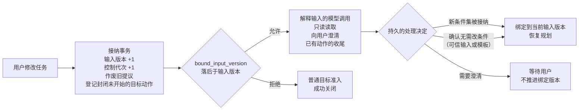
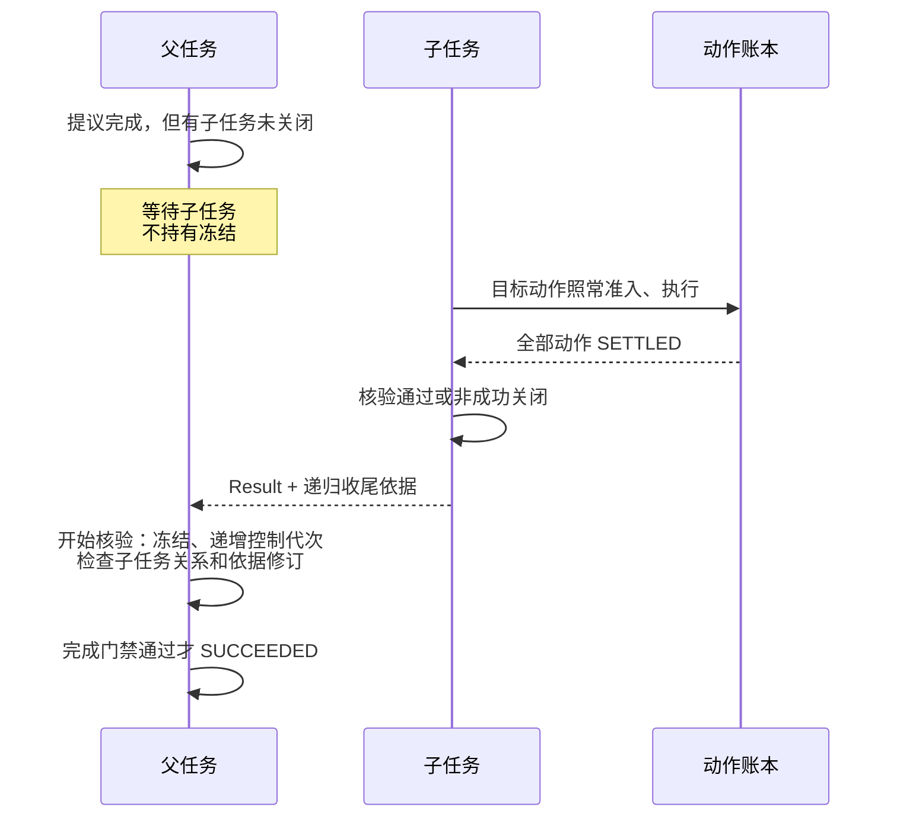
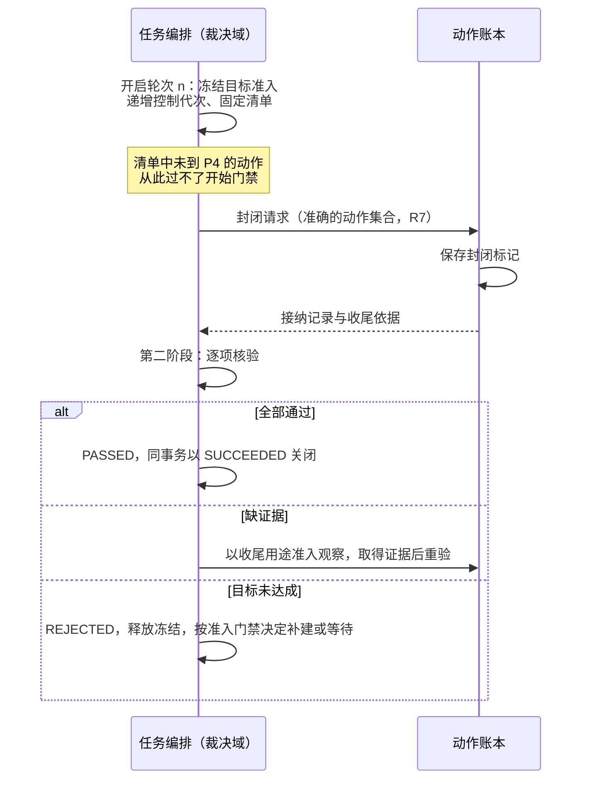

# 任务编排

| 日期 | 修订说明 |
| --- | --- |
| 2026-10-04 | 初版：任务状态、条件版本、提议接收、准入事务、有限计划、子任务与委派、两阶段完成门禁、Result 固定。 |
| 2026-10-04 | 按 `CLAUDE.md` 写作要求和[文档规范](../../conventions.md)修订用语：约束统一为"必须／不得""建议／不建议"，不再使用"应"；"执行端"统一为"执行端点"，发布回滚统一为"回滚"，授权统一用"撤销"。设计内容不变。 |
| 2026-10-04 | 按[架构评审处理记录](../../../review/archive/round-1/README.md)修订：完成门禁改为带轮次号的核验轮次，任务冻结与动作封闭分开，核验发现目标未达成时可以重新规划（RV6）；条件集须先接纳，条件记录来源，削弱核验规则与删除条件同权，Result 列出核验内容，写明 G2 的保证边界（RV11）；增加活性断言和相应测试。 |
| 2026-10-04 | 按[第二轮评审处理记录](../../../review/archive/round-2/disposition.md)修订：核验轮次增加 `SUPERSEDED`，冻结归属到轮次（R2-01）；会改变任务依据的输入被接纳时递增控制代次，4.5 增加输入变更（R2-02）；"请求提议"不再表示模型调用已准入，模型调用先固定输入再准入（R2-05）；有限计划只准入参数已确定的前缀（R2-06）。 |
| 2026-10-04 | 按[第三轮评审处理记录](../../../review/archive/round-3/disposition.md)修订：条件集绑定已处理的输入版本，修改未处理时只允许准备与收尾，`DRAFT` 不再允许普通目标动作（R3-01）；`REJECTED` 总是释放冻结，"没有阻断性未知"提为普通准入门禁（R3-02）；准入保存祖先控制依据，P4 逐级检查（R3-03）；模型调用按调用位置恢复（R3-04）；准入和完成核验检查记忆依赖（R3-05）。 |
| 2026-10-04 | 按[第四轮评审处理记录](../../../review/disposition.md)修订：开始核验递增控制代次，拒绝后清单中已开始未收尾的动作阻止补建（R4-01）；父任务等直接子任务全部关闭并汇总递归收尾依据后才核验（R4-02）；模型准入只占调用位置，发送次数另计（R4-03）。 |
| 2026-10-05 | 可读性：4.2 改为引用[核心契约 2.6 四道门禁](../contracts/README.md#26-四道门禁)作为条件的唯一来源，本节只讲事务实现；2.2 增加输入处理流程图，4.6 增加父子任务完成时序图，4.7 增加核验跨域时序图。规则不变。 一致性修正：2.2 写明所有有效回答都递增输入版本，不改变依据的回答同时推进已处理输入版本；4.2 改为按门禁编号列事务步骤；区分三种"再来一次"；核验接口的成功含义不再承诺一定登记新提议；修正步骤编号；正文不再引用评审记录和调研文档。 |
| 2026-10-05 | 4.6 明确外部 Agent 委派的两种形态及何时必须包一层本地子任务，与外部 Agent 适配器对齐。 |
| 2026-10-05 | 取消关闭的转换改写为"控制为 `CANCELLING` 时生命周期 `OPEN → CLOSED`"，不再跨维度画箭头。 |
| 2026-10-05 | 项目目标 10.2 撤销 V2（手机 GUI）后同步：GUI 接管改为 M4 可选。 |

- 状态：草稿
- 负责满足：C1、C5；A1、A4；G2、G3、G4、G6、G11
- 协同落实：C4、C6、C7、C8；G1、G5、G7–G10、G12
- 涉及场景：S1–S8，重点 S2、S4、S5、S7
- 上游：[项目目标](../../project-goals.md)、[分层与模块](../../layers.md)、[核心契约](../contracts/README.md)、[持久工作](../durable/README.md)、[动作账本](../ledger/README.md)

任务编排是任务事实的唯一写入方，负责一个任务从创建到关闭的全部裁决：保存目标和条件，请求并接收提议，在一个原子事务里完成准入，把动作交给动作账本，最后依据固定的条件、证据和动作清单判断能否成功。

它**不执行动作**，也**不判断效果**，这些归动作账本。它也不直接写授权、预算或会话的事实，只通过这些模块的公开接口，在同一个事务上下文里请求它们各自完成检查和写入。

有三个事实必须分开看：

| 事实 | 能证明什么 | 不能证明什么 |
| --- | --- | --- |
| 任务记录可以恢复 | 责任和进度没有丢 | 外部动作没有重复 |
| 对方接纳了，或进入了某个终态 | 对方报告了某种状态 | 必要条件已满足，后果已全部结束 |
| 动作账本给出了收尾依据 | 这个动作的效果或迟到可能性已经确定 | 整个任务目标已达成 |

## 1 职责与边界

| 事实或工作 | 负责方 | 任务编排做什么 |
| --- | --- | --- |
| 任务、条件版本、控制状态、准入决定、子任务关系、Result | 任务编排 | 唯一写入、裁决和恢复 |
| 用户输入、确认、确认消费 | 会话 | 引用可信输入；在同一事务中请求会话消费匹配的确认 |
| 授权、委派来源、使用记录、出口凭据 | 授权 | 请求检查、收缩和使用；不得自行签发或扩大权限 |
| 额度、预留、实际用量、结算 | 预算 | 请求额度检查和预留；不自行计算或改写计费事实 |
| 动作接纳、尝试、效果、迟到可能性、核对 | 动作账本 | 交接意图、查询原交接、根据权威记录推进任务 |
| 内容、来源、派生关系、用途和删除 | 内容治理 | 只使用内容引用和当前许可，不另存原文副本 |
| 命令回执、待办工作、领取、租约 | 持久工作 | 把工作和裁决原子登记；领取成功不等于业务成功 |
| 推理、执行、交互的实现 | 可替换部分 | 只接收提议、回报和用户事件；它们不得写任务事实 |

推理要执行动作，必须经过任务编排和动作账本（R1）。只读的记忆检索按 R4 使用受限凭据，不得借检索接口写入任何东西。

## 2 对象与状态

### 2.1 任务

| 字段 | 含义与约束 |
| --- | --- |
| 用户、任务标识 | 共同构成隔离和查询范围；不得只凭任务标识跨用户访问 |
| 负责方 | 创建时固定的裁决域；不存在自动转移的命令 |
| 父任务、根任务 | 内部委派关系；不得形成循环，限制深度和数量 |
| 目标引用 | 指向内容治理中的记录，任务里不复制原文 |
| 条件集版本 | 指向完整、不可变的条件集快照；单调递增，不复用 |
| 条件集接纳状态 | `DRAFT` 或 `ACCEPTED`，以及已处理到的输入版本 `bound_input_version`；见 2.2 |
| 输入版本 | 用户对本任务的修改或回答被接纳时递增 |
| 任务修订 | 任务事实每次变更时递增，用于并发校验 |
| 生命周期、控制、推进 | 见 2.4 |
| 等待事项 | 种类、关联对象、缺口、唤醒条件、期限；可以同时存在多项 |
| 控制代次 | 暂停、恢复、取消、条件变更等改变"可推进范围"的操作时递增 |
| 当前提议请求 | 请求标识、快照引用、规划代次；默认同一时刻最多一个可裁决的请求 |
| 动作清单 | 全部已准入的动作意图，包括模型调用、辅助调用和收尾调用 |
| 子任务清单 | 子任务标识、创建依据、是否必要、结果收集状态 |
| 当前核验轮次 | 轮次号（单调递增）、状态 `VERIFYING / PASSED / REJECTED / SUPERSEDED`；见 4.7 |
| 目标推进冻结 | 持有冻结的轮次号，没有冻结时为空；冻结只存在于该轮次为 `VERIFYING` 期间。设置和释放都用条件写入，只有持有冻结的轮次能释放它 |
| 完成核验记录、Result 引用 | 关闭时一次写入，之后不可替换 |

工作者的领取信息属于持久工作，不属于任务归属。

### 2.2 条件、证据与提议

| 对象 | 关键字段 | 约束 |
| --- | --- | --- |
| 条件集快照 | 任务、版本、上一版本、变更来源、完整条件列表、接纳状态、接纳依据 | 原子创建新快照并切换当前版本；不原地修改。新版本从 `DRAFT` 开始 |
| 条件 | 条件标识、所属版本、描述引用、是否必要、核验规则及其版本、来源（用户、任务模板、模型整理） | 删除条件、降低必要性，或把核验规则换成证据更弱的规则，都必须来自可信的用户输入或已有的明确授权。推理可以建议条件和核验规则，不得注册恒真的规则 |
| 证据要求 | 允许的证据来源、对象范围、时间范围、有效期、冲突处理规则 | "模型认为满足了"不得自动成为证据 |
| 条件满足记录 | 条件及版本、证据引用、来源、观察时间、核验方式、结论 | 只证明它所绑定的版本；新版本要重新核验 |
| 提议 | 提议标识、请求标识、条件集版本、输入版本、规划代次、控制代次、快照引用、内容摘要 | 推理不得自行选择条件版本或负责方 |
| 提议内容 | 行动、条件修改提议、向用户提问、完成判断 | 都需要核心处理；条件修改提议不会直接生效 |
| 提议期限 | 核心认可的最晚准入时间 | 用裁决域时间判断，客户端不得延长 |
| 有限计划 | 步骤标识、具体参数值与摘要、能力版本、资源、依赖、费用上界、期限；可以附带后续候选步骤的描述 | 不含无限循环、动态选择工具或未限定的目标。只有参数值全部确定的步骤能成为准入对象；后续候选步骤不是动作，没有 `operation_id`，见 4.3 |

条件按核验方式分为两类：

| 条件类型 | 完成证据 |
| --- | --- |
| 可以客观核验 | 目标系统查询、文件内容核验、设备观察等实际证据，由核心按固定规则判断 |
| 明确要求用户评价 | 会话保存的、绑定当前条件集版本的用户评价 |

用户评价不得代替动作账本对未知效果的核对。"我接受这个答案"可以满足一个评价类条件，但"付款的事先别管了"不能证明付款没发生。

**条件集先接纳，再用于裁决。**普通目标准入和成功关闭都要求：条件集为 `ACCEPTED`，且 `bound_input_version` 等于任务当前的输入版本。不满足时（条件集为 `DRAFT`，或有会改变任务依据的输入尚未处理），只允许以下工作：解释输入和整理条件所需的模型调用（照常经过授权和预算检查）、必要的只读读取、向用户澄清、已有动作的收尾。这些工作的用途由核心按持久来源指定，推理不能自报"这是澄清"来执行普通写入。下列任一来源可以把条件集变为 `ACCEPTED`：

| 来源 | 说明 |
| --- | --- |
| 受信任务模板 | 可信输入落入模板，模板给出条件、必要性和核验规则。模板把义务类型与核验规则的能力绑定，例如"文件可打开""内容覆盖要求""具有可编辑源文件"是不同断言，后两项不能用文件存在性代替 |
| 用户给出的显式条件列表 | 会话保存的用户输入 |
| 用户确认模型整理的条件集 | 模板外的任务。识别出歧义、冲突、范围收缩或无法客观核验的条件时，向用户展示具体缺口并澄清 |

**已处理的输入版本。**任务修改和有效回答被接纳时，输入版本都会递增（见[会话 2.5](../sessions/README.md#25-顺序与版本)），这样基于旧上下文的提议一律作废。两类输入对条件集的影响不同：

- **不改变任务依据的回答**：输入请求已由核心声明它不影响依据，接纳事务同时把 `bound_input_version` 推进到新版本，不进入处理门禁；
- **会改变任务依据的输入**（任务修改；会改变依据的回答）：`bound_input_version` 留在原值，当前条件集自动"暂不适用"，不需要改写不可变的条件快照。

所以"`bound_input_version` 等于当前输入版本"就表示会改变依据的输入都已处理。推进 `bound_input_version` 只能按输入版本顺序逐个进行，依据必须是以下持久决定之一，模型说"已处理"不算：

1. 形成新的条件集版本，并按上表的来源接纳；
2. 依据可信的用户输入或受信模板，确认这条输入无需改条件，把现有条件集重新绑定到新的输入版本；
3. 保存澄清、冲突或拒绝的结果，任务进入等待用户，此时不推进绑定版本。

下图是一条会改变任务依据的输入从接纳到处理完成的经过。左半边在接纳事务中一次完成；右半边是处理期间允许和不允许的工作。

**保证边界。**完成门禁证明的是"已接纳的条件都有证据"，**不能证明**条件集完整表达了用户意图。初次整理漏掉的要求，核心无从发现。因此 Result 逐条列出核验了哪些条件、用什么规则、条件来自哪里，让用户能直接看到"系统检查了什么"。本设计不为每个输入片段建立覆盖映射记录：映射本身仍由模型抽取，会制造"已证明完整"的错觉。

**条件集统一版本。**任意一条条件增删改，整个条件集就生成新版本，基于旧版本的提议全部作废。这比给每条条件单独记版本更保守，可能导致无关的改动也触发重新推理，但作废语义简单，不会因为遗漏某个版本向量而误用旧提议。删除后重新添加的条件使用新标识，版本号不复用。Kubernetes 在条件里记录 `observedGeneration`，用来识别"基于旧代次做出的判断"（[v1.34.1 源码](https://github.com/kubernetes/kubernetes/blob/v1.34.1/staging/src/k8s.io/apimachinery/pkg/apis/meta/v1/types.go#L1606)），这里沿用同样的思路。

### 2.3 准入、委派与 Result

| 记录 | 必须保存 | 约束 |
| --- | --- | --- |
| 准入决定 | 命令标识、提议标识、条件集版本、输入版本、控制代次、各级祖先任务的引用及其当时的控制代次、依赖的记忆修订及使用方式、计划摘要、决定和拒绝原因 | 同一命令只有一个持久决定；P4 按祖先控制依据和记忆依赖重新检查 |
| 每步动作意图 | 动作标识、步骤标识、账本负责方、执行端点、参数摘要、依赖、期限 | 动作标识、账本、执行端点固定 |
| 每步准入依据 | 授权使用、预算预留、必要的确认消费 | 批量计划中每一步都可追溯 |
| 跨域交接 | 交接标识、原意图、对方接纳记录、回执状态 | 回执丢失时查询原交接 |
| 子任务创建依据 | 父条件集版本、子条件快照、派生授权、额度分配、父控制代次 | 与父子关系、权限和额度分配一起提交 |
| 核验轮次 | 轮次号、冻结时的条件集版本、输入版本、控制代次、动作清单摘要、状态、逐项缺口 | 每轮一条；只有 `PASSED` 的轮次能支撑成功 |
| 完成核验记录 | 当前条件集版本、逐条结论、完整动作清单、账本收尾依据、必要子任务的结果 | 不得只记一句"全部完成" |
| Result | 结果、关闭原因、条件达成情况（逐条列出条件、核验规则及版本、条件来源和结论）、证据引用、核验记录、遗留的未知、关闭时间 | 记录的是"关闭那一刻的结论"，之后的新事实不修改它 |

Result 里的内容同样受 G8、G9 约束。结论固定不等于证据原文永久保存：展示时重新检查用途和删除状态，已删除的内容不得借 Result 绕过治理。

### 2.4 状态

状态维度沿用[核心契约](../contracts/README.md#25-状态模型)：生命周期 `OPEN / CLOSED`，控制 `ACTIVE / PAUSED / CANCELLING`，推进 `RUNNING / WAITING`，关闭时的结果 `SUCCEEDED / FAILED / CANCELLED`。界面上的状态由这几个维度组合得到：

| 界面状态 | 维度组合 |
| --- | --- |
| 运行中 | `OPEN`、`ACTIVE`、`RUNNING` |
| 等待中 | `OPEN`、`ACTIVE`、`WAITING` |
| 已暂停 | `OPEN`、`PAUSED`（等待事项仍然显示） |
| 取消中 | `OPEN`、`CANCELLING` |
| 已成功、已失败、已取消 | `CLOSED`，按 Result 的结果 |

| 转换 | 条件与行为 |
| --- | --- |
| 创建 | 可信的用户输入已持久保存；任务、负责方和初始条件集（`DRAFT` 或 `ACCEPTED`）提交后才确认接下责任。条件不明确时进入等待用户，不用空条件集或 `DRAFT` 条件集判定成功 |
| 开始核验（轮次 n） | 完成提议绑定当前版本；有子任务时，直接子任务已全部关闭。同一事务中暂时冻结新的目标准入、递增控制代次，对清单中未开始的动作发出封闭，见 4.7 |
| 核验被拒绝 | 轮次 n 记为 `REJECTED`，在同一事务中释放冻结；控制允许推进且没有阻断性未知时递增规划代次、登记新的提议请求，有阻断性未知时进入等待核对。清单中在开始核验前已取得开始回执、尚未收尾的动作，阻止补建的目标动作直到收尾，见 4.7 |
| 核验轮次被替代 | 轮次 n 为 `VERIFYING` 时接纳了影响核验的输入、条件变更或控制变更；在同一事务中把轮次 n 标为 `SUPERSEDED`、释放它的冻结，按当前控制登记后续工作，见 4.7 |
| `RUNNING ↔ WAITING` | 保存缺口；对应事实满足后重新计算可推进范围 |
| `ACTIVE → PAUSED` | 保存暂停，递增控制代次，阻止新的目标推进；在途动作继续回报和核对 |
| `PAUSED → ACTIVE` | 只接受与当前暂停代次匹配的恢复命令；重新核查条件、授权、预算和依赖 |
| `ACTIVE / PAUSED → CANCELLING` | 保存取消，递增控制代次；封闭未开始的步骤，向子任务传播取消，保留在途责任 |
| `OPEN → CLOSED`（`SUCCEEDED`） | 完成门禁通过，同一事务写入核验记录和 Result |
| `OPEN → CLOSED`（`FAILED`） | 核心确定目标停止推进，例如无法完成或期限到达；效果未知的动作仍然单独保留 |
| 控制为 `CANCELLING` 时，生命周期 `OPEN → CLOSED`，Result 为 `CANCELLED` | 取消收尾完成，或用户明确要求带着遗留的未知结束 |
| `CLOSED` 之后 | 不恢复、不修改条件、不重新推进原目标 |

"失败"只说明目标不再推进，不能理解为所有动作都没生效。"关闭"结束的是目标的生命周期，不会抹掉遗留的责任：动作账本的核对和预算的结算在关闭后继续。

| 等待种类 | 关联对象 | 什么时候解除 |
| --- | --- | --- |
| 用户 | 输入请求、确认、条件澄清 | 会话持久保存了对应输入 |
| 核对 | 原动作、原尝试、账本负责方 | 账本出现新事实 |
| 授权 | 缺少的许可，或无法证明当前授权有效 | 授权模块给出当前有效的许可 |
| 预算 | 额度不足，或费用上界未知 | 预算模块给出可用额度 |
| 外部 | 失联端点、未完成的子任务、能力或服务依赖 | 依赖恢复的权威记录 |

多项等待同时存在时分别更新，解除一项不清空其他项。

## 3 接口

### 3.1 共同约定

所有改变状态的命令都包含用户、调用主体、命令标识、指纹和契约版本；需要并发保护的命令还带上预期的条件集版本、输入版本或控制代次。同标识同内容返回原决定，同标识异内容返回 `IDEMPOTENCY_CONFLICT`。传输超时的含义是"回执未知"，调用方查询原命令。业务拒绝也是持久决定，前提变化后必须用新命令重新发起。成功回执只在对应的责任记录持久提交之后返回。重复提交提议不得靠换一个命令标识得到第二次准入。

### 3.2 命令与查询

| 接口 | 输入 | 成功含义 | 主要错误 |
| --- | --- | --- | --- |
| 创建任务 | 持久用户输入的引用、目标、初始条件、负责方 | 任务已建立，责任已保存 | 输入无效、内容不可用、负责方不合法 |
| 请求提议 | 任务、当前条件集版本、可用能力、上下文引用 | 已固定快照，推理工作已登记，并授予准备所需的有限读取范围。**不表示模型调用已准入**：每次模型调用另走"准入模型调用" | 任务受控制、已有有效请求 |
| 准入模型调用 | 提议请求、调用位置、受信宿主固定的完整调用描述（模型、参数、工具声明、输出上限、全部实际输入的引用、规范化摘要） | 模型动作已准入，与其他动作一样有授权依据和预算预留；占用一个调用位置。实际发送次数在 P4 另行占用，见[推理接口 2.1](../../ports/reasoner/README.md#21-上下文快照) | 授权不足、内容不可用、费用上界无法证明、预算不足、版本过旧 |
| 接收提议 | 请求标识、提议标识、版本、期限、内容 | 提议已保存，返回有效性；**不表示已准入** | 未知请求、版本过旧、请求已被消费、过期 |
| 修改条件 | 可信输入、预期条件集版本、新条件集 | 新版本和封闭工作已登记；旧提议作废 | 版本冲突、无权修改、任务已关闭 |
| 准入提议 | 提议、计划步骤、授权和确认引用 | 准入决定、逐步的动作标识和交接标识已原子持久 | 已失效、权限不足、预算不足、确认不匹配、依赖未满足 |
| 控制任务 | 暂停、恢复或取消，预期控制代次 | 控制已持久保存，返回当前的收尾情况；**不承诺外部已经停止** | 旧的恢复命令、已关闭、非法转换 |
| 创建子任务 | 父任务、子目标、收缩后的权限、额度、是否必要 | 子任务和分配已保存，委派责任成立 | 父任务已封闭、权限扩大、额度不足、循环或超限 |
| 接收账本或子任务事实 | 原关联标识、负责方、记录版本、证据引用 | 进展已保存 | 来源不符、版本倒退、记录冲突 |
| 接纳条件集 | 条件集版本、接纳来源（模板、用户列表、用户确认）、预期版本 | 该版本变为 `ACCEPTED` | 版本过旧、来源不可信、核验规则不满足模板能力 |
| 核验完成 | 基于当前版本的完成提议、候选证据 | 本轮通过并保存核验记录；或本轮拒绝，逐项列出缺口，并按当前状态登记了后续工作（重新规划、等待核对、保持暂停或只推进收尾，见 4.7） | 条件缺证据、动作未收尾、清单不完整、并发冲突 |
| 关闭任务 | 结果；非成功关闭的原因和遗留项 | Result 已固定，生命周期结束 | 缺少成功证明、收尾责任未登记、并发冲突 |
| 查询任务、原命令、Result | 用户范围内的对象标识 | 当前状态和版本，或原回执 | 无权限、不存在、依赖不可用 |
| 订阅变化 | 用户范围、任务、已读序号 | 变化提示和恢复位置 | 无权限、位置超出保留范围；可能重复或遗漏，需补查 |

核对、主动观察、向外部发出取消，这些需要外部调用的工作也在原任务下以**收尾用途**准入。收尾用途不得启动新的目标推进，也不得执行补偿；仍然检查当前授权、预算和出口凭据。

## 4 关键流程

### 4.1 创建任务与请求推理

1. 会话保存用户输入和任务关联；
2. 任务编排固定负责方，保存任务和初始条件集。可信输入落入任务模板或带有显式条件列表时，条件集直接为 `ACCEPTED`；否则为 `DRAFT`，整理条件所需的模型调用按第 5 步准入和计费（工作类别为"准备"），整理结果需要用户确认才能接纳；
3. 内容治理登记目标、上下文和派生关系；任务只保存允许使用的引用；
4. 保存推理请求和固定快照，登记待办工作，授予准备所需的有限读取范围。此时推理还没有模型发送资格；
5. 推理每需要一次模型调用：受信宿主捕获全部实际读取，核验第 3 步固定的必要事实没有被裁掉，由受审查的供应商编码实现生成完整、固定的调用描述；任务编排对这个描述准入（检查授权、内容用途、版本，按费用上界预留预算，以"核心安排的工作"为来源登记动作意图）；模型调用经动作账本和出口闸门发出（G4、G5）。准入之后，适配器追加任何 metadata、媒体或工具定义，出口都按"与准入描述不符"拒绝。三种"再来一次"要分开：推理崩溃后按原调用位置拿回原结果，不新准入；动作账本按 G1 安全重发，沿用原动作，重新通过开始门禁并占用发送额度；补充材料、换模型或新的采样，使用新的调用位置并重新准入；
6. 收到提议后先保存，再回复接收回执。旧请求迟到的输出不会重新变成可执行的提议。

先固定输入再准入的原因：推理可能先检索一段材料再调用模型。如果在检索之前就准入，实际发出的内容、请求摘要和费用依据都与准入不一致。准备阶段只能在授予的读取范围内读取；需要嵌入或远程检索时，核心另行准入那些调用。只能瞬时使用的原文按内容治理的规则处理，封存调用描述不等于强制持久保存原文。

丢弃推理输出不会让模型费用消失。重复请求产生的不同实际计费来源分别记账，同一来源只计一次。

### 4.2 准入

准入门禁检查哪些条件，以[核心契约 2.6](../contracts/README.md#26-四道门禁)为准。本节说明任务编排怎样在一个短事务里实现它：事务内不调用模型，也不调用外部系统。

| 事务内的步骤 | 对应条件 | 原子性要求 |
| --- | --- | --- |
| 查原命令是否已有决定 | 准入-1 | 已有决定直接返回 |
| 核对提议、版本、条件集接纳、本任务与祖先的推进状态 | 准入-1 至准入-4 | 与条件修改、输入修改、暂停、取消按同一裁决顺序竞争 |
| 读取动作账本的事实，判断阻断项 | 准入-5 | 有阻断项时停止后续目标行动，进入等待核对；阻断项包括被拒绝轮次中已开始、未收尾的动作（原因见 4.7） |
| 调用内容模块检查记忆依赖和内容可用 | 准入-6、准入-10 | 当前依据的修订变了就拒绝，重新取当前视图 |
| 调用授权核验并占用 | 准入-7 | 一次性授权的使用与准入一起提交 |
| 调用预算预留 | 准入-8 | 全部步骤的费用上界之和不超过可用额度；预留不得被其他任务同时占用 |
| 调用会话消费确认 | 准入-9 | 整批计划的确认一次消费，指向全部获准的步骤 |
| 保存准入决定、逐步意图、待办工作和回执 | — | 全部成功，或全部不生效；确定的拒绝作为决定保存 |

提交之后才返回"已准入"。

**为什么必须是一个可串行化的事务。**这些检查如果按顺序分开做，检查之间可能发生撤销、额度被抢占、确认被重复使用。PostgreSQL 的文档说明，可重复读隔离级别下仍可能出现序列化异常；可串行化事务可能中止，应用必须重试**整个**事务及其决策逻辑（[事务隔离](https://www.postgresql.org/docs/18/transaction-iso.html)、[序列化失败处理](https://www.postgresql.org/docs/18/mvcc-serialization-failure-handling.html)）。只校验任务版本，无法阻止两个任务同时消耗同一笔额度或同一个一次性授权。事务中止后，不得留下部分预留或已消费的确认。

### 4.3 有限计划

为了减少往返，推理可以一次提交一个有限计划，由核心一次准入多步。条件是：

- 所有步骤可以枚举，**参数值**和资源已经确定，依赖无环。参数表达式固定不等于参数值固定；
- 每一步都有自己的动作标识、授权依据和预算依据；
- 前序步骤没达到要求时，后序步骤不启动；
- 没被选中的分支和失效的步骤也必须拿到封闭记录，不得从清单里删掉；
- 授权撤销、条件修改、暂停或取消仍能阻断尚未开始的步骤；
- 任何一个有外部效果的步骤结果未知时，默认停止本任务后续的目标行动，进入等待核对。这条规则适用于所有目标准入，不限于有限计划（见 4.2）。

需要模型临场决定资源、收件人、金额或下一个工具的部分，不得放进计划，必须回到新的提议和新的准入。

**只准入具体前缀。**计划可以描述依赖前序输出的后续候选步骤（例如"把第一步生成的文档链接发给固定收件人"），但它们不是动作。前序动作的结果被持久接纳后，核心根据准确的输出版本构造具体参数，登记参数的派生来源（输出带有受限来源时，后续步骤继承这些限制），再按当前条件、输入、授权、预算和确认策略准入。收件人、金额、路径、待发送正文等确认关键项尚未确定时，不提前消费对它们的确认。已成立的动作参数不得改写，恢复时逐字节使用原参数。一次批准带变量的整批计划需要另一套可判定的绑定契约，目前不支持。不得把一段任意的 Agent 循环包装成一个动作，那样其中的动作、资源和费用都无法枚举，会绕过 G5、G7。

批量准入的原子性只保证"这一批一起获准"，不保证这些外部步骤一起成功，也不提供自动补偿。

**示例（S2）。**条件是"文档已保存且内容正确"和"消息已发送给指定项目组"。文档内容确定之后，可以一次准入"写文件"和"发消息"两步，发消息依赖文件核验成功。如果写文件的结果未知，发消息就等待。如果用户在消息发出前改了收件组，旧步骤被封闭，在新版本下重新提议、授权和确认。注意，"文件写入返回成功"和"消息 API 返回已接受"都不足以证明这两个条件满足：前者需要文件内容的证据，后者需要符合目标系统语义的发送证据。

### 4.4 向动作账本交接

严格按 R7 进行：本方保存意图、固定账本和交接标识；账本按原交接标识持久接纳（重复接纳返回原记录）；本方保存对方回执。回执丢失时查询原账本。查不到记录不能证明没执行，只能按交接约定重送**原意图**，不得换端点，也不得创建替代动作。

### 4.5 条件变更、暂停与取消

条件变更在一个事务中同时完成：创建新条件快照并切换当前版本；作废旧版本的提议，递增控制代次；登记"封闭旧版本中尚未开始的步骤"的工作；标出依赖旧条件的子任务，阻止它们继续推进（需要继续的，在新版本下重新裁决）；有进行中的核验轮次时，按 4.7 将其标为被替代；保存命令回执。

**输入变更**（明确的任务修改，或会改变任务依据的答案，见[会话 2.3](../sessions/README.md#23-输入的类别)）被接纳时，在同一事务中：递增输入版本和控制代次；作废旧提议；登记封闭尚未开始的目标动作；有进行中的核验轮次时将其标为被替代；保存命令回执。此时模型还没解释这条输入，条件版本可能还没变，但控制代次已经变了，已准入、尚未到 P4 的旧动作会被出口拒绝（`STALE_INPUT`）。同时，当前条件集的 `bound_input_version` 落后于新的输入版本，在这条输入被处理之前（见 2.2），普通目标准入和成功关闭都被拒绝，只允许解释、读取、澄清和收尾。P4 先于接纳成立的，原动作已开始，照常记录和核对。收尾用途的调用（核对、取消、费用确认）按当前控制代次新准入，不因旧动作关联旧版本而被拒绝。被封闭的动作不改回"未准入"，已消费的确认不退还。确认回应和"仅记录"的消息不触发这些变化。

暂停和取消同样递增控制代次；有进行中的核验轮次时，也按 4.7 将其标为被替代。

已准入的动作以**是否实际开始了尝试**为界：

| 动作情况 | 处理 |
| --- | --- |
| 尚未开始 | 账本持久封闭；迟到的意图或旧凭据都不得再启动它 |
| 正在与封闭竞争 | 账本和出口闸门给出唯一的先后顺序，只承认一方胜出 |
| 已开始，效果确定 | 保存事实，不因为条件变了而抹掉 |
| 已开始，效果未知 | 保留原动作和执行端点，继续核对 |
| 还没收到封闭回执 | 如实显示"封闭尚未确认"，不声称已经停止 |

签发了凭据、工作者领取成功，都不代表外部请求已经发出。暂停保留目标，恢复时重新检查前提；取消之后不得恢复目标推进。取消保存后，界面显示"取消已保存，部分动作仍在核对"。

取消只是一个请求，不是事实。Temporal 的 Activity 通过心跳得知取消，也可以忽略取消继续执行（[Temporal 取消说明](https://docs.temporal.io/activity-execution#cancellation)）；AWS Step Functions 在 `.sync` 模式下中止时只"尽力"取消外部作业，取消失败时外部作业可能继续运行并收费（[服务集成模式](https://docs.aws.amazon.com/step-functions/latest/dg/connect-to-resource.html)）。所以"取消已保存""工作者接受了取消""外部效果不会再发生"必须分别表达。

### 4.6 子任务与外部 Agent

**内部子任务：**

1. 检查父任务及各级祖先仍允许委派；
2. 子任务的权限是父权限和委派请求的交集，范围和期限只能收缩；
3. 从父额度中**独占地**划出子额度，父子不得同时使用；
4. 在同一用户的裁决域中，一起提交子任务、父子关系、派生授权、额度分配和待办工作；
5. 子任务的每次准入都检查祖先的控制范围，准入依据保存各级祖先任务的引用和当时的控制代次。出口 P4 在同一个裁决事务中逐级比较：任一祖先的控制代次变了，尚未开始的子动作就被拒绝。父任务的输入修改、条件变更、暂停和取消都会递增父任务的控制代次，所以这四种情况都被覆盖，包括"暂停后又恢复为 `ACTIVE`"。取消的持久传播用来推动收尾，不承担正确性。让子任务在新的父依据下继续，需要重新裁决并重新准入，不得把旧动作的祖先代次改成当前值。跨裁决域的内部委派不支持；
6. 子任务关闭后，父任务收集它固定的 Result 和必要证据，以及**递归收尾依据**：子任务关系范围、准确的动作和交接集合、全部账本的 `SETTLED` 依据，孙任务按同样规则汇总。只有 Result 不够，因为非成功关闭可以遗留未知；
7. 父任务进入完成核验之前，直接子任务必须全部关闭并已汇总递归收尾依据。未满足时父任务登记"等待子任务"，不持有冻结，子任务的合法推进不受影响。必要子任务还须提供父条件要求的达成证据；可选子任务可以非成功关闭，但后果必须收尾。父任务不得把仍在运行的可选子任务自动视为"放弃"，需要停止时走明确的取消和收尾流程。父核验与运行中的子任务并行不支持；
8. 祖先任务关闭后，子孙任务只能准入有原责任来源的收尾。

父任务与子任务在完成时的先后关系：

一笔额度在任何时刻只能处于一个位置：父方可用、子方已分配、动作已预留、或实际已花费。只有确定没有使用、也不会产生迟到费用的部分才能释放；取消通知或子工作者退出都不足以释放额度。

**外部 Agent** 按执行适配器接入，一次委派被当作一个长时间运行的动作，由原动作账本负责。委派的形态由[外部 Agent 适配器](../../adapters/agent.md#1-职责与边界)的接入档位决定：只交付内容的委派是当前任务的一个动作；让远端自主执行外部行动的委派，必须包一层本地子任务，由子任务持有派生授权、预算分配和子目标条件，父任务按上文的子任务规则完成。无论哪种形态：进度、远端任务标识和产物作为回报和内容引用保存；首次委派的回执丢失、又无法查询原请求时，保持未知，不重新委派；外部的终态不得直接映射为 Lerna 的成功；无法落实权限约束或费用上界的外部实现，得不到对应的执行准入。A2A v1.0.1 中，发送消息的幂等是可选行为，取消也只是"尝试"（[A2A 规范](https://github.com/a2aproject/A2A/blob/3303592588e388e62e0f69f701af531d2f4e3991/docs/specification.md)），所以不得假定重发同一个消息标识不会在远端创建第二项工作。

必要的子任务失败时，父任务不得凭其他子任务成功就通过门禁。可选子任务可以不满足目标条件，但它已准入的动作仍必须收尾。

### 4.7 完成门禁

每次完成核验是一个**核验轮次**，带单调递增的轮次号。每轮分两个阶段，避免"跨域读取之后再写入"的竞争。这里区分两件事：

- **任务冻结**是暂时的：本轮期间不准入新的目标推进，本轮结束即解除；
- **动作封闭**是永久的：只针对本轮清单中尚未开始的动作意图，封闭后不再打开，也不覆盖以后的新动作。

**第一阶段：固定裁决范围。**

1. 检查完成提议绑定的是当前条件集版本、输入版本和控制代次，且条件集为 `ACCEPTED`；有子任务时，直接子任务已全部关闭（见 4.6），并检查子任务关系和收尾依据的修订；
2. 开启轮次 n：在同一事务中暂时冻结新的目标准入和子任务创建，**递增控制代次**，保存完整的动作、交接和子任务清单。递增控制代次让清单中尚未到 P4 的动作从此无法开始；它们在裁决域里与 P4 排序，不依赖封闭请求何时送达账本；
3. 向所有涉及的账本提交封闭请求，封闭范围是**本轮清单中的准确动作集合**。这个请求必须覆盖已准入但还没收到接纳回执的意图，否则"清单里的动作都完成了"仍可能漏掉一个迟到接纳的动作；
4. 账本保存封闭标记，拒绝清单中尚未开始的意图迟到启动，返回接纳记录和收尾依据；
5. 本方保存回执。

**第二阶段：核验并裁决。**

| 门禁 | 必须证明 |
| --- | --- |
| 条件覆盖 | 当前版本的全部必要条件都有匹配的证据；不得漏项，不得用旧版本的满足记录 |
| 证据可用 | 来源、版本、对象、时间和用途都符合条件规则；冲突已按规则处理 |
| 动作覆盖 | 完整清单中每一项都有账本的权威记录；不存在没解释清楚的交接 |
| 动作收尾 | 每个动作都已 `SETTLED` |
| 子任务覆盖 | 必要子任务的达成证据已收集；所有子任务的后果都已覆盖 |
| 并发一致 | 当前条件、控制和清单仍与本次核验时一致 |

未知通常会阻止成功。G2 允许的唯一例外是：账本独立证明该动作不会再迟到生效（`RULED_OUT`），并且必要条件另有证据满足。这时历史效果仍然保留为未知，不得改写为未生效。超时、取消回执、用户表示"愿意承担风险"，都不得当作"不会迟到生效"的证明。

**本轮的结果：**

| 结果 | 条件 | 处理 |
| --- | --- | --- |
| 通过 | 全部门禁通过 | 同一事务保存核验记录，以 `SUCCEEDED` 关闭并固定 Result |
| 缺证据 | 目标可能已达成，但还需要外部核对或观察 | 保存缺口，本轮保持冻结；以收尾用途准入核对动作，取得证据后重新固定完整清单再核验 |
| 目标未达成 | 某个必要条件确实不满足，例如附录还没创建、已保存的正文内容错误 | 在**一个事务**中：保存逐项缺口，本轮记为 `REJECTED`，**总是释放本轮冻结**，再按当前状态登记后续工作——控制为 `ACTIVE` 且没有阻断性未知效果时，递增规划代次、登记新的提议请求；有阻断性未知效果时进入等待核对，核对得出结果后按普通唤醒规则重新计算可推进范围；控制为 `PAUSED` 或 `CANCELLING` 时保留暂停或只推进收尾 |
| 被替代 | 本轮进行中，接纳了影响核验的输入、条件变更或控制变更 | 在该变更的同一事务中：本轮记为 `SUPERSEDED` 并附原因；释放本轮持有的冻结；使旧核验工作失去裁决资格；按**当前**控制登记后续工作——`ACTIVE` 时处理新输入并重新规划，`PAUSED` 时保留暂停、不登记推进，`CANCELLING` 时只推进收尾。不伪造条件判断，也不向用户报告失败 |

补齐缺口必须创建**新动作**，重新检查授权、预算和必要的确认；不得恢复已封闭的旧动作，不得复用已消费的确认。取消、暂停、条件修改与"继续"通过预期版本竞争，较新的用户控制优先，旧轮次的回执不能解除它。迟到的旧封闭回执只影响旧清单。新一轮核验仍然枚举整个任务的历史动作清单，包括此前被封闭但未执行的动作。

未知效果尚未排除时，不得借"核验未通过"创建替代动作，替代与原动作重复属于 G1 禁止的情形。

被替代只释放本轮的冻结，不释放用户的暂停、取消或其他等待；本轮对动作的封闭照常有效，继续跟踪封闭回执。迟到的旧轮次回报只能更新它所属的轮次和动作，不能成功关闭任务、不能释放新轮次的冻结、不能重开旧动作。恢复命令按当前状态重新计算，不复活旧轮次。

冻结只存在于 `VERIFYING`：三个出口（`PASSED`、`REJECTED`、`SUPERSEDED`）都释放它。拒绝之后仍需阻止补建的三种旧动作各有直接保护：

| 旧动作 | 保护 |
| --- | --- |
| 开始核验时还没到 P4 | 开始核验递增了控制代次，它们在 P4 被拒绝；账本的永久封闭随后送达 |
| 开始核验前已取得开始回执、尚未收尾 | 发出前效果仍是 `NOT_APPLIED`，"没有阻断性未知"挡不住它们；4.2 把它们单独列为阻断，补建等它们收尾 |
| 效果未知 | 4.2 的"没有阻断性未知"门禁 |

封闭回执未到时，下一轮核验仍会把清单中的动作列入。

**活性要求。**只证明"不会做错事"不够：停住不动总是安全的。在依赖恢复、授权和预算有效、没有用户停止控制、没有阻断性未知效果的前提下，被拒绝或被替代的核验轮次必须最终进入"重新规划""明确等待"或"非成功关闭"之一，不得无原因地停在冻结状态。这里不要求模型必然解出任务，只要求核心提供合法的后续路径。

**非成功关闭**可以保留未知，但必须：永久封闭目标推进；为每个未知项保留原动作、负责方、已知事实和恢复入口；Result 明确写成失败或取消，不得标为成功；后续核对仍在原责任记录下进行。成功关闭不得留下仍需执行的目标步骤。迟到的账单由预算处理，不改变已固定的 Result。

## 5 故障与恢复

| 故障 | 负责方 | 恢复方式与禁止行为 |
| --- | --- | --- |
| 创建、准入或控制的回执丢失 | 任务编排、持久工作 | 查询原命令，返回原决定；不得用新命令重复接下责任或消费确认 |
| 跨域接纳回执丢失 | 任务编排、动作账本 | 按原交接标识查询，必要时重送同一意图；不得换端点 |
| 准入事务中进程崩溃 | 裁决域存储、持久工作 | 未提交就没有决定；已提交就恢复回执和待办工作。不存在"半个准入" |
| 动作开始后进程崩溃 | 动作账本 | 新工作者读取原尝试，核对效果或按有效的幂等约定恢复；不得当作未执行 |
| 重复请求、重复通知 | 各事实写入方、持久工作 | 命令、交接、事实分别去重；旧通知不得覆盖新版本 |
| 条件修改与准入并发 | 任务编排 | 同一事务顺序决定胜者；旧版本未开始的动作随后封闭，已开始的保留 |
| 授权撤销、额度竞争、确认竞争 | 授权、预算、会话、任务编排 | 在裁决事务中统一裁决；失败时不留下部分授权使用、预留或确认消费 |
| 取消与执行开始并发 | 任务编排、动作账本、出口闸门 | 控制记录与开始记录建立明确顺序；已开始的动作继续核对 |
| 裁决域不可用 | 任务编排 | 停止需要新裁决的工作，保留原记录；不转移任务归属 |
| 账本或执行端点不可用 | 原动作账本、任务编排 | 等待原负责方；阻止成功门禁，不找替代执行 |
| 内容、授权或预算无法核验 | 相应核心模块 | 依赖它的工作不准入，保存具体缺口；不得用缓存补足未知 |
| 推理结果迟到 | 任务编排、预算 | 已作废请求的输出不得准入；实际用量照常入账 |
| 动作或子任务结果迟到 | 动作账本、任务编排 | 写入原动作或原子任务；父 Result 固定后不改写，以后续事实呈现 |
| 通知丢失 | 持久工作、各事实写入方 | 通过待办扫描、原记录查询或序号补读恢复；通知只是唤醒手段 |
| 过期工作者继续写入 | 持久工作、各事实写入方 | 检查领取代次，拒绝覆盖新事实，不得凭旧领取重新执行 |

迟到的事实如果推翻了账本曾确认的"不会再迟到生效"，这是契约违反：必须记录并定位是证明出了错还是适配器出了错，不得静默修改历史 Result 来掩盖。

恢复原执行和安全重试是两个问题。AWS Step Functions 的 Redrive 保留原执行身份，但会重新启动失败或超时的步骤、重置相关重试计数（[Redrive](https://docs.aws.amazon.com/step-functions/latest/dg/redrive-executions.html)）。保留身份符合 G11，直接重跑超时步骤却不符合 G1。Lerna 的恢复只恢复原责任记录，是否重新调用目标系统由动作账本裁决；恢复也不会重置已消费的确认、一次性授权或实际费用。

## 6 不变量落实

| 不变量 | 本模块怎样保证 | 怎样验证 |
| --- | --- | --- |
| G1 | 未知阻止依赖它的推进；不创建替代动作或任务来绕过未知；重试由账本裁决 | 请求已生效但回执丢失，确认没有第二次效果 |
| G2 | 当前条件覆盖、完整动作清单、账本收尾依据、必要子任务证据共同构成门禁 | 拿掉任一证明，或加入一个未收尾的动作，成功都被拒绝 |
| G3 | 创建、接收、准入、控制、委派、关闭都先持久后回执；R7 三段交接 | 在每个提交点和回执之间崩溃，责任和原决定都能查到 |
| G4 | 每步保存条件、输入、授权、预算和必要的确认；出口处再检查 | 旧版本、已撤回的凭据、已封闭的步骤都无法启动 |
| G5 | 模型、辅助调用、核对、外部取消都登记并经过闸门 | 闸门处的每次调用都能对应到准入记录和用量记录 |
| G6 | 提议不得直接写状态、改条件、执行动作或标记成功 | 注入伪造的完成提议和直接执行请求，核心拒绝 |
| G7 | 子任务权限由授权模块收缩；祖先的控制范围约束后续准入 | 逐项尝试扩大资源、动作、用途、期限，均被拒绝 |
| G8 | 使用上下文、证据和展示 Result 时重新检查相应用途 | 有读取权限不能自动保存、同步或行动 |
| G9 | 只保存受治理的引用；撤回让依赖的材料失效；Result 不复制可绕过治理的原文 | 删除后，任务、快照、证据和 Result 都无法再取得该内容 |
| G10 | 预算预留和计费来源保留；丢弃提议、取消、关闭都不删除用量 | 重复用量、迟到账单、子额度转换都不重复、不漏记 |
| G11 | 任务负责方、动作账本、执行端点固定；工作者只接替原记录 | 超时、崩溃、断线后身份不变，不出现自动改派 |
| G12 | 命令、索引、回执、待办工作和额度都带用户范围；共享资源有公平上限 | 跨用户替换标识、高负载和故障注入不影响其他用户的正确性 |

## 7 取舍

| 选择 | 得到 | 付出 |
| --- | --- | --- |
| 条件集统一版本 | 作废语义直接，不会遗漏版本向量 | 无关条件的改动也可能触发重新推理 |
| 默认只有一个有效的推理请求 | 避免同一快照并发产生多个行动 | 限制了单任务内的推理并行 |
| 有限计划只允许固定参数 | 批量准入仍能逐步追溯 | 动态步骤仍需回到核心 |
| 裁决域联合事务 | 授权、预算、确认不会出现部分成功 | 同一用户的共享事实存在串行竞争 |
| 先封闭再核验完成 | 防止清单遗漏和"检查之后又有新准入" | 收尾多一轮持久写入和跨域等待 |
| 未知阻止目标推进 | 降低重复副作用的风险 | 不可查询的动作可能长期等待 |
| Result 固定，后续事实单独保存 | 关闭时的结论可追溯 | 界面要同时表达关闭结论和后续核对 |
| 负责方固定 | 故障不转移责任 | 原端点永久丢失时可能无法自动收尾 |

被否决的几个方案：用工作队列和心跳推导任务状态（心跳丢失会被误判为失败，违反 G3、G11）；分域检查加失败补偿（补偿撤不回已发出的动作，也恢复不了一次性确认的原义）；子 Agent 直接共用父任务的权限和预算（无法证明 G7，额度会被竞争）；失败后自动创建同目标的新任务重来（掩盖原动作的未知效果，违反 G11）。

负责方身份、条件版本的范围、完成前的封闭协议、Result 的固定语义，正式采纳前必须写成 ADR。

## 8 待定事项

| 事项 | 验证方式 | 未满足时的行为 |
| --- | --- | --- |
| 出口的开始记录能否与取消、撤回建立可靠顺序 | 并发原型、崩溃注入、开始记录审计 | 不声明"已立即停止"；封闭未确认时保持等待 |
| 账本能否提供完整、稳定的收尾依据 | 乱序交接、迟到意图、重复封闭测试 | 不标记成功 |
| 内容撤回与进行中的完成核验怎样协调 | 内容治理定义"一次使用"的开始、结束和撤回顺序，联合测试 | 无法保证时停止核验 |
| 首批条件核验规则的范围 | 选一组可以重复核验的任务，明确人工评价的边界 | 没有可靠核验规则的条件等待用户，不自动成功 |
| 批量步骤数、委派深度、核对次数和时间预算 | 延迟、成本和故障恢复压测 | 使用保守配置，不存在无限自动重试 |
| 每用户裁决域的吞吐 | 多任务共享额度、授权和确认的竞争压测 | 不预先宣称满足 M6 容量目标 |
| 非成功关闭的产品默认行为 | 验证用户能理解遗留的未知和后续核对 | 默认继续显示取消中或等待，不自动隐藏未知 |

## 9 M1 范围

M1 必须完成单用户的准入和完成门禁，而不只是跑通模型循环。

| 范围 | M1 实现 | 推迟 |
| --- | --- | --- |
| 生命周期 | 创建、运行、各类等待、暂停、取消中、三种关闭结果；持久控制和恢复 | 端云交互：M3；GUI 接管：M4（可选） |
| 条件 | 不可变的条件集版本、并发更新、旧提议作废；条件集接纳只支持任务模板和显式条件列表，模板外的任务请用户澄清 | 用户确认模型整理的条件集、独立的语义遗漏审查 |
| 提议 | 固定快照、持久接收、期限、去重、单个有效请求 | 多路推理竞争 |
| 准入 | 完整的准入门禁（核心契约 2.6）、逐步意图、回执和待办工作原子提交 | 无 |
| 有限计划 | 参数值已确定的有限顺序步骤，逐步出口检查；后续候选步骤在前序结果接纳后再准入 | 带变量的整批计划、复杂分支的优化 |
| 授权与确认 | 单次和持续授权、当前有效性检查、一次性确认的准确绑定 | 委派：M4；操作权利与处理目的细分：M2 |
| 预算 | 按单次费用上界最小预留，用量回报后结清 | 多维额度、退款、更正：M2 |
| 与动作账本协作 | 原交接查询、未知等待、封闭、稳定的收尾依据 | 无 |
| 完成与 Result | 核验轮次、拒绝后重新规划；条件和动作完整覆盖；固定 Result 并列出核验内容；遗留的未知可查 | 无 |
| 子任务与外部 Agent | 不开放执行路径，接口返回明确的"不支持"错误 | M4 |
| 部署 | 可以单进程；裁决域与账本仍执行正式事务和 R7 | 端云断网恢复：M3；多用户容量：M6 |

M1 至少使用 API、文件和可注入故障的模拟 API，覆盖幂等、可查询、不可查询三类。退出标准：G1–G6、G11 的故障测试通过，能查清原责任、原决定和未知效果。单进程部署也必须模拟域间回执丢失，不得依赖函数返回值完成交接。

## 10 测试要点

### 10.1 一致性测试

| 用例 | 注入或并发 | 通过标准 | 对应 |
| --- | --- | --- | --- |
| 准入与条件修改竞争 | 读取版本后并发提交修改 | 只存在合法的事务顺序；旧版本未开始的步骤不得执行 | C1、G4 |
| 条件删除后重新添加 | 描述相同，标识或版本改变 | 旧提议、旧满足记录不会自动生效 | G2、G6 |
| 重复提交提议 | 同一请求不同提议标识；同一提议不同命令标识 | 最多一次有效准入，每步意图唯一 | G3、G4 |
| 一次性授权、确认的竞争 | 两个任务同时消费 | 最多一个准入成功；失败方没有部分消费 | G4、G7 |
| 预算竞争 | 两个任务基于同一剩余额度同时准入 | 已结清加已预留不超过上限 | G10 |
| 批量准入的原子性 | 中间某一步授权、预算或确认失败 | 整批没有可执行的意图，也没有遗留的消费 | G4 |
| 批量途中收缩 | 第一步完成后改条件、撤授权、暂停或取消 | 后续未开始的步骤被封闭；已发生的事实保留 | C7、G4 |
| 旧恢复命令重放 | 恢复一次后再次暂停，然后重放旧的恢复命令 | 不得解除新的暂停 | G3、G11 |
| 伪造完成 | 模型宣称完成，适配器只返回 HTTP 成功 | 缺少实际证据时拒绝成功 | G2、G6 |
| 完成清单遗漏 | 藏起一个辅助调用，或一个尚未回执的意图 | 门禁拒绝；不得靠通知计数补齐 | G2、G5 |
| 完成与新准入竞争 | 收集账本记录期间提交新行动 | 要么进入本次固定清单，要么被封闭拒绝 | G2、G4 |
| 核验拒绝后继续 | 正文已写入并核验，附录还没有动作；模型过早提议完成 | 本轮拒绝并释放冻结；授权和预算有效时产生新的附录动作，并能再次核验通过 | G2 |
| 拒绝后补建与旧动作竞争 | 清单动作 A 已准入未到 P4，封闭请求延迟；核验拒绝后准入补建动作 B | A 在 P4 因控制代次被拒；B 正常执行。另构造 A 在开始核验前已过 P4、未到 P5：B 等 A 收尾 | G1、G4 |
| 父任务核验与子任务 | 可选子任务仍在运行时父任务提议完成；必要子任务还需一个目标动作；子任务非成功关闭但有未知动作；父核验与创建子任务并发 | 父任务等待，不冻结子任务的合法推进；有未收尾后果时不得成功；并发时不遗漏新子任务 | G2、C5 |
| 拒绝后等待核对期间修改任务 | 轮次拒绝时有阻断性未知；随后接纳输入变更；之后未知被核对清楚 | 不存在被旧轮次持有的冻结；修改处理完、未知消除后能进入新规划或明确的非成功结果 | G2、G11 |
| 未处理的任务修改 | 接纳"还要可编辑源文件"后暂停解释，提交带最新输入版本的行动和完成提议 | 两者都被拒绝；解释调用和收尾查询仍可执行；多个修改按顺序处理，不能跳过 | G2、G4 |
| 祖先控制 | 子动作准入后父任务取消、修改、暂停后恢复，通知都延迟到子 P4 之后；三层祖孙 | 子 P4 拒绝；交换先后则保留已开始的责任；收尾查询仍可准入 | G4、G11 |
| 核验轮次被替代 | 核验期间接纳新输入、修改条件、暂停后恢复；旧轮次回报晚于新轮次建立 | 旧轮次不能成功关闭任务、不能释放新冻结、不能重开旧动作；控制允许时最终登记新版本的处理工作 | G2、G11 |
| 输入变更挡住旧动作 | 准入发给 A 的动作；接纳"改成 B"后暂停解释，再到 P4 | P4 拒绝；交换先后时原动作保留"已开始"的责任；之后的核对调用仍能准入 | G4、G6 |
| 模型输入在准入后变化 | 推理检索新增一项受限内容；准备后撤回其中一个来源；适配器在发送前追加 metadata | 准入看到完整输入；撤回后拒绝发送；追加内容的请求被出口拒绝 | G4、G5、G8 |
| 后续步骤参数未知 | 第一步生成链接，第二步发送；输出改变、字段缺失、链接指向未授权位置、绑定后崩溃 | 未确定参数的步骤没有发送资格；越界结果只能形成新候选；恢复后参数逐字节不变 | G4、G7 |
| 旧动作保持封闭 | 继续后迟到的旧封闭回执、迟到的旧执行意图 | 旧回执不阻止新轮次；旧意图无法越过封闭 | G2、G4 |
| 核验拒绝与用户控制竞争 | 拒绝与取消、暂停、条件修改并发 | 旧轮次不能恢复推进；用户控制优先 | C7、G11 |
| 未知效果下核验失败 | 必要条件不满足，但相关动作效果未知 | 不创建替代动作；保持等待核对 | G1、G2 |
| 条件漏项与弱核验规则 | 三项要求中初始条件只抽出一项；条件完整但规则只检查文件存在 | 未接纳的条件集不能成功；弱规则被模板能力检查拒绝；Result 列出实际核验的条件 | G2、G6 |
| 接纳后补充要求 | 条件集接纳后用户追加一项要求 | 新版本回到 `DRAFT`；旧提议和旧核验无法忽略新输入 | C1、G2 |
| 子任务的权限与额度 | 扩大任一权限维度；父子重复使用同一额度 | 拒绝扩大；额度只被占用一次 | S5、G7、G10 |
| Result 固定 | 关闭后补来账单、动作结果或子任务结果 | Result 不变；原账本事实继续可查 | G10、G11 |
| 内容撤回与核验竞争 | 核验过程中撤回，并重新请求展示 | 撤回后没有新的使用；没有原文副本旁路 | S6、G8、G9 |

### 10.2 故障注入

| 故障位置 | 通过标准 | 对应 |
| --- | --- | --- |
| 创建提交后、回执前崩溃 | 查询原命令得到同一个任务，负责方不变 | G3、G11 |
| 核验拒绝提交前后崩溃 | 重复恢复只产生一个继续决定和一个新的提议请求 | G3、G11 |
| 轮次被替代的事务前后崩溃 | 不留下只有冻结、没有负责工作者的状态 | G3、G11 |
| 准入事务的每个写入点崩溃 | 只出现"整项准入"或"整项未准入" | G3、G4 |
| 账本接纳后回执丢失 | 恢复时查询原交接，不创建新动作 | R7、G11 |
| 外部效果生效后杀死工作者 | 先核对；不幂等的动作没有第二次效果 | S7、G1 |
| 出口检查与取消并发 | 未开始的一方被封闭；已开始的一方保留迟到可能性 | C7、G2 |
| 封闭消息晚于执行消息，或相反 | 两种顺序都有明确结果；迟到意图无法穿过已生效的封闭 | G2、G4 |
| 请求超时但目标稍后生效 | 期间一直保持未知；迟到效果写入原动作 | G1、G11 |
| 既不可查询也不幂等 | 永不自动重试；成功门禁被阻止，除非取得独立的"不会迟到"证明 | G1、G2 |
| A2A 首次发送回执丢失，远端不去重 | 不重新委派；如实报告未知 | C6、G1 |
| 裁决域、账本、内容或预算失联 | 等待原依赖；没有替代归属、旁路或猜测成功 | G4、G11 |
| 所有进度通知丢失 | 靠持久扫描和原记录查询仍能恢复 | G3 |
| 时钟跳变或期限判断不可信 | 不延长旧许可；暂停依赖可信时间的新准入 | G4、G8 |

此外，把取消、条件变化、接纳回执丢失、迟到结果、核验拒绝组合成随机状态机测试，每次运行检查对应 G 编号的性质，而不只检查最终的状态字符串。除安全性质外，还检查 4.7 的活性要求：前提满足时，不存在无原因地永久冻结的任务。可选地为完成门禁写一个小状态模型（例如用 TLA+），先在模型上检查这两类性质；模型通过不代表实现正确。

## 参考资料

- Kubernetes v1.34.1 条件字段 `observedGeneration`：https://github.com/kubernetes/kubernetes/blob/v1.34.1/staging/src/k8s.io/apimachinery/pkg/apis/meta/v1/types.go#L1606
- RFC 9110 §13.1.1 条件请求：https://www.rfc-editor.org/rfc/rfc9110.html#section-13.1.1
- PostgreSQL 18：[事务隔离](https://www.postgresql.org/docs/18/transaction-iso.html)、[序列化失败处理](https://www.postgresql.org/docs/18/mvcc-serialization-failure-handling.html)
- SQLite 隔离：https://www.sqlite.org/isolation.html
- Temporal：[Activity 取消](https://docs.temporal.io/activity-execution#cancellation)、[SDK Go v1.33.0 Activity 默认重试](https://github.com/temporalio/sdk-go/blob/a85ce600f6272b3fc11fa112f822b6990cd7cd1e/internal/activity.go#L125)、[Server v1.27.0 父关闭策略](https://github.com/temporalio/temporal/blob/b1ae42e00f5d784b66c41ac7d353ef9e55390241/service/worker/parentclosepolicy/workflow.go#L127)
- AWS Step Functions：[Redrive](https://docs.aws.amazon.com/step-functions/latest/dg/redrive-executions.html)、[服务集成模式](https://docs.aws.amazon.com/step-functions/latest/dg/connect-to-resource.html)
- A2A v1.0.1 规范：https://github.com/a2aproject/A2A/blob/3303592588e388e62e0f69f701af531d2f4e3991/docs/specification.md
- Macaroons（NDSS 2014）：https://research.google/pubs/macaroons-cookies-with-contextual-caveats-for-decentralized-authorization-in-the-cloud/
- Zanzibar（USENIX ATC 2019）：https://storage.googleapis.com/gweb-research2023-media/pubtools/5068.pdf
