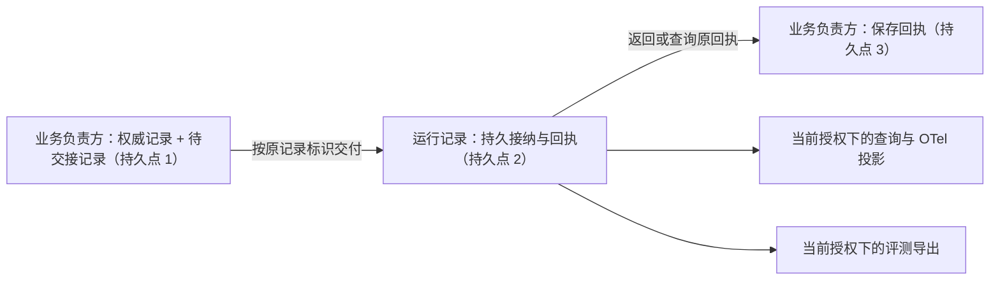

# 运行记录

| 日期 | 修订说明 |
| --- | --- |
| 2026-10-04 | 初版：权威记录与运行记录的分工、基础关联全量与诊断细节采样、持久接纳协议、OpenTelemetry 投影、撤回与清理、评测导出。 |
| 2026-10-04 | 按 `CLAUDE.md` 写作要求和[文档规范](../../conventions.md)修订用语：约束统一为"必须／不得""建议／不建议"，不再使用"应"；"执行端"统一为"执行端点"，发布回滚统一为"回滚"，授权统一用"撤销"。设计内容不变。 |
| 2026-10-04 | 按[架构评审处理记录](../../../review/archive/round-1/README.md)修订：查询和导出接口区分操作权利与处理目的，诊断、评测、生成改进是不同的处理目的（RV9、[ADR 0002](../../../adr/0002-processing-purposes.md)）。 |
| 2026-10-05 | 本文的局部持久化点由"P1、P2……"改称"持久点 1、持久点 2……"，避免与出口闸门的 P1–P8（跨文档说的 P4、P5 都指它）混淆；见[文档规范 5](../../conventions.md#5-写作与链接规则)。含义不变。 动作标识由任务编排在准入时固定、尝试标识由账本分配；命令引用改为完整的 `CommandIdentity`。 |
| 2026-10-05 | "可使用性"一行标明为内容治理三个维度的组合展示。 |
| 2026-10-05 | 模块名称统一为“执行网关”，职责与契约不变。 |
| 2026-10-05 | 图中的跨域交接改用具体行为说明，规则编号及解释放在图注或正文；交接机制不变。 |
| 2026-10-05 | 模块名称统一为“执行管理”，同步模块简称与图示；存储和连续性语境中的“账本”指其持久执行记录。职责与契约不变。 |
| 2026-10-05 | 模块名称由执行网关改回出口闸门，避免与网关与 SDK 撞名；恢复被改写的历史修订行；职责与契约不变。 |

- 状态：草稿
- 负责满足：C8；在本模块范围内落实 G3、G8、G9、G12
- 协同：C5、C7、C9；G1、G2、G4–G7、G10、G11
- 涉及场景：S1–S8，重点 S4、S6、S7、S8
- 上游：[项目目标](../../project-goals.md)、[分层与模块](../../layers.md)、[核心契约](../contracts/README.md)、[内容治理](../content/README.md)

运行记录把散落在各模块的事实**关联起来**：一个任务经过了哪些提议、准入、授权、动作、尝试、费用和结果；哪里出了错、哪里有缺口、哪里还在积压。它服务于诊断、解释和测量。

它**不是事实的来源**。任务是否完成、动作有没有生效、授权是否有效、费用是多少，都由各自的负责模块裁决。运行记录丢失或损坏后，业务恢复照样从任务编排、执行管理、授权、预算和持久工作开始，**不得根据诊断轨迹补造业务事实**。

本设计的结构是三层：

1. **权威业务记录**由各模块持有，是事实；
2. **基础关联**由运行记录持有，**全量**、持久接纳；
3. **诊断细节**（高频性能数据、流式分片、堆栈等）可以采样，通过 OpenTelemetry 投影到外部工具。

"全量"指的是授权范围内的必要**元数据**，不是保存全部正文。正文一律通过内容治理的引用访问。

## 1 职责与边界

| 负责对象 | 责任 |
| --- | --- |
| 跨模块的关联轨迹 | 关联任务、条件版本、提议、准入、动作、执行尝试、授权、费用、内容和结果的引用 |
| 基础关联的接纳状态 | 持久接纳、幂等去重、回执查询、交接进度、缺口和保留状态 |
| 诊断查询与投影 | 在当前授权下提供轨迹视图，生成 OpenTelemetry 投影，标明采样和缺失 |
| 自己持有的派生数据 | 登记来源和派生关系，执行内容治理的停止使用、保留和清理要求 |
| 经授权的数据导出 | 为评测与进化固定导出的范围、字段、来源版本、处理目的、目的地、完整性和采样信息 |

| 模块 | 权威责任 | 运行记录怎样使用 |
| --- | --- | --- |
| 任务编排 | 任务、条件、准入、控制、Result | 保存带版本的引用；当前状态去问任务编排 |
| 执行管理 | 尝试、效果、核对、迟到可能性 | 保存它声明的轨迹，不自行裁决效果或重试 |
| 授权 | 当前许可、使用记录、委派和撤销 | 每次保存、读取、同步、导出和复用都按操作权利和处理目的核验 |
| 预算 | 计费来源、用量和结算 | 关联预算记录及其版本；不从 Span 里累加出权威账单 |
| 内容治理 | 来源、用途、保留、派生和清理状态 | 登记本模块的副本和导出，执行清理并回报可验证的结果 |
| 出口闸门 | 对外出口的核验和记账 | 运行记录自己的遥测上传和远端删除，同样经过出口 |
| 评测与进化 | 测试执行、评分、候选改进和评测结果 | 只交付获准的数据；不决定评分、门槛、启用或回滚 |

扩展可以提交受限的观察材料，但不得冒充核心来源、修改核心关联、写入效果，也不得借轨迹接口绕过准入。

**审计是一种用途，不是另一个事实来源。**审计关注"谁、依据什么授权、做了什么决定、访问了什么"，用运行记录中的核心来源引用来回答，不默认复制完整正文。一条"调用成功"的记录本身不能证明外部效果。签名、摘要链可以帮助检查记录有没有被改写，但不能证明原声明是对的，也不能代替 G9。

## 2 对象与状态

### 2.1 关联记录

| 字段 | 含义与约束 |
| --- | --- |
| `record_id` | 稳定的记录标识；重投时不变 |
| `user_id` | 从认证上下文绑定；不接受追踪上下文或扩展自行指定用户 |
| `record_owner` | 创建时确定的运行记录持有方；工作者接替不改变归属 |
| `producer` | 来源模块、端点、实现版本；核心来源和扩展的观察分开标记 |
| `source_stream_id`、`source_seq` | 来源流及其序号；序号与待交接记录在同一事务提交 |
| `event_kind`、`schema_version` | 受控的事件类型和结构版本 |
| `source_record_ref` | 来源对象的类型、标识、版本和负责方；核心基础关联必填 |
| `task_ref`、`requirements_version` | 任务和条件集版本；独立会话或运维记录可以不关联任务 |
| `proposal_ref`、`admission_ref` | 提议和准入决定的引用，两者分开 |
| `operation_ref`、`attempt_ref` | 动作和执行尝试。动作标识在准入时由任务编排固定，尝试标识由执行管理分配；运行记录只引用，不分配 |
| `grant_refs`、`budget_refs` | 涉及的授权、用量和预算记录版本 |
| `CommandIdentity`、`handoff_id` | 命令（完整身份）和跨域交接的引用；不与追踪标识混用 |
| `call_id`、`external_refs` | 单次对外调用和供应商的关联线索；不自动视为计费或幂等的键 |
| `trace_id`、`span_id`、`links` | 可选的诊断上下文；没有采样或 SDK 不可用时，基础关联照样保存 |
| `caused_by` | 显式的因果引用，如原交接、前一次尝试、父任务；不以墙钟时间代替 |
| `occurred_at`、`received_at` | 来源时间和接收时间分开；跨端的因果不按它们排序 |
| `record_content_ref`、`source_content_refs` | 本记录和来源内容的治理身份、版本、派生关系 |
| `redaction_version`、`mapping_version` | 生产端过滤规则和外部投影规则的版本 |
| `detail_sampling` | 诊断细节的选择策略、概率和省略原因；**不控制基础关联** |

"来源可信"只表示"经过认证的模块提交的"，不表示声明的内容已被证明。

各种标识的职责必须分开：

| 标识 | 用途 |
| --- | --- |
| 用户、任务、提议、动作、尝试、授权、预算记录的标识 | 由各自负责模块分配，用于隔离和关联业务对象 |
| 命令标识、交接标识 | 幂等命令和 R7 回执查询 |
| 运行记录标识 | 幂等接纳一条关联记录 |
| Trace ID、Span ID | 只用于诊断上下文；不作为权限、命令幂等或计费去重的依据 |
| 供应商请求标识、工具调用标识 | 外部关联线索，由业务模块核实后关联到动作或用量来源 |

建议的做法是：**稳定的业务标识 + 有限的运行段 Trace/Span + 显式的关联边。**同步调用用父子 Span 表达；异步交接、恢复和子任务用关联边和 OpenTelemetry Links 表达。不建议为一个可能持续数天的任务维持一个长生命周期的 Trace：它难以表达重启、补传、多次提议和独立的计费来源，还容易让人把追踪标识当成业务标识用。

### 2.2 必须全量的基础关联

| 事件类别 | 最少关联内容 | 原始负责方 |
| --- | --- | --- |
| 任务与条件 | 创建、条件版本变化、暂停、取消、Result 引用 | 任务编排、会话 |
| 提议 | 请求、返回、接受或拒绝，依据的条件和上下文版本 | 任务编排 |
| 准入 | 决定、原因码、条件版本、授权、预算和确认引用 | 裁决域各模块 |
| 动作与出口 | 意图接纳、执行尝试、出口核验、调用关联、回报 | 执行管理、出口闸门 |
| 效果与核对 | 未知、核对请求、证据引用、效果变化、迟到的回报 | 执行管理 |
| 授权 | 使用、拒绝、撤销和委派的引用 | 授权 |
| 费用 | 用量来源、回报、更正和结算版本的引用 | 预算 |
| 交接与恢复 | 原交接、持久接纳、原回执、恢复处理 | 交接双方、持久工作 |
| 记录治理 | 保存许可、读取和导出的使用、撤回、清理状态的引用 | 授权、内容治理、运行记录 |
| 评测关联 | 测试运行、环境、实现、测试集、测量方法和结果的引用 | 评测与进化（M5） |

可以按策略采样的：高频的性能 Span、流式分片、堆栈、内部检索细节、经授权的正文副本。错误和未知状态的基础关联必须全量；额外的错误 Span 只用于诊断，采样之后不保证完整。

### 2.3 辅助对象

| 对象 | 关键字段 | 作用 |
| --- | --- | --- |
| 接纳回执 | 原记录键、载荷指纹、接纳状态、接收方、持久版本 | 证明运行记录已接下这条保存责任 |
| 来源进度 | 来源流、已知的提交上限、连续接纳水位、缺口、索引水位 | 表达在指定范围内是否完整 |
| 导出清单 | 命令标识、来源版本和水位、字段集、处理目的、目的地、有效期、治理身份、采样和过滤规则 | 固定一次授权导出的范围 |
| 清理工作和回执 | 内容范围、撤回版本、副本位置、清理方法、验证结果、剩余项 | 回报本模块和受管目的地的清理结果 |

### 2.4 状态

| 对象 | 状态转换 | 约束 |
| --- | --- | --- |
| 跨域交接 | 源方已保存待交接 → 运行记录已持久接纳 → 源方已保存原回执 | 三个独立的持久步骤 |
| 接纳 | 未接纳 → 已接纳；同键同载荷重投返回原回执 | 同键不同载荷报冲突，不覆盖原记录 |
| 可使用性 | 可使用 → 已停止使用 → 清理中 → 已验证清理 | 撤回先让读取、复制和导出失效；清理失败时保留剩余项（这是内容治理的发布、使用、清理三个维度的组合展示，见[内容治理 2.4](../content/README.md#24-清理记录与状态)） |
| 导出 | 准备中 → 已准备 → 可按授权读取 → 失效或到期 → 清理完成 | "已准备"表示产物和清单已持久化，不表示远端已收到 |
| 完整性视图 | 未知、积压、在指定水位前完整、存在缺口、受限制、已清理 | 总是相对于某个来源集合和截止水位，不存在"整个任务永远完整" |

"因采样省略""因用途禁止""已删除""尚未收到""不可恢复的丢失"分别表示，互不混用。新的授权不会自动复活已删除的内容。

## 3 接口

| 接口 | 输入 | 成功含义 | 错误 |
| --- | --- | --- | --- |
| 接纳记录 | 认证的来源、原记录标识、结构版本、载荷、来源引用、保存凭据 | 逐条回执：获准保存的数据和接纳状态已持久化 | 无权保存、来源不符、结构不支持、引用不合法、同键不同载荷、容量不足 |
| 查询接纳 | 原记录键或交接标识、来源身份 | 已接纳、未找到、被拒收或已清理；"未找到"只说明本持有方没有接纳记录 | 无权查询、持有方不符、不可用 |
| 查询轨迹 | 用户、任务或动作等范围、处理目的（默认诊断）、字段集、分页游标、截止水位 | 当前允许读取的关联、来源引用、完整性和省略信息；**不代表来源声明已被证明** | 无权读取、处理目的不允许、游标无效 |
| 准备导出 | 命令标识、来源范围、水位、处理目的、字段集、目的地、期限、完整性要求 | 导出清单和产物引用已持久准备，派生关系已登记 | 无权导出、禁止同步、完整性不足、目的地不满足清理要求 |
| 读取导出 | 导出标识、运行身份、当前检索凭据（绑定处理目的）、批次 | 本批次可以使用的材料；**逐批核验当前授权** | 已撤回、已到期、处理目的不符、运行身份不符 |
| 停止使用并清理 | 内容治理的命令、原命令标识、范围、撤回版本 | 先返回"已停止使用"的持久状态；最终的清理另外查询 | 版本过旧、范围错误、部分清理失败 |
| 查询清理 | 原清理命令及授权身份 | 方法、验证结果和剩余副本；所有必要项验证之后才报告本方完成 | 无权查询、不可用 |

通知只是"有新进度"的提示，订阅方依靠持久查询和水位恢复。接口超时后，调用方不得假定未接纳，也不得换标识重投。

## 4 关键流程

### 4.1 基础关联的采集与接纳

| 步骤 | 处理 | 持久化 |
| --- | --- | --- |
| 1 | 来源模块生成必要关联，过滤禁止保存的字段，绑定业务对象和治理身份 | 还没有承诺新责任 |
| 2 | 来源模块在**自己的业务事务**中，同时保存权威变化、稳定的记录标识和待交接工作 | **持久点 1** |
| 3 | 持久工作按原标识提交；运行记录验证身份、结构、保存许可和派生登记 | 还没有成功回执 |
| 4 | 运行记录按唯一键接纳，保存获准的数据、回执和待建索引工作 | **持久点 2** |
| 5 | 源方拿到或查到原回执，保存交接完成状态 | **持久点 3** |
| 6 | 异步建立索引和诊断投影 | 索引水位单独保存，不影响接纳是否成功 |

获准保存的敏感派生副本必须先拿到内容治理的许可、完成派生登记，然后才对查询或导出可见。正文不会先落进一个"暂存原文"的诊断队列。

业务在持久点 1 之后就可以继续推进，因为责任和待交接记录已经持久化，不必同步等待运行记录或外部诊断后端。积压接近安全容量时，阻止会新增记录责任的推进，但优先保留取消、撤回、效果回报和核对所需的容量。

**为什么不直接调用 OpenTelemetry SDK。**OpenTelemetry 的 SDK 规范明确要求应用不要用 Span 中的数据实现应用逻辑；批处理队列满时会丢弃 Span，`ForceFlush` 超时时可能跳过或中止导出（[OTel SDK 规范 v1.61.0](https://github.com/open-telemetry/opentelemetry-specification/blob/v1.61.0/specification/trace/sdk.md)）。OTLP 的确认只覆盖一对客户端和服务端，不提供多跳的端到端保证（[OTLP v1.11.0](https://github.com/open-telemetry/opentelemetry-proto/blob/v1.11.0/docs/specification.md)）。Collector 的"持久队列"也有前提：v0.136.0 默认重试期限五分钟，重试耗尽就结束处理；contrib 的 File Storage 默认不 fsync（[重试配置](https://github.com/open-telemetry/opentelemetry-collector/blob/a2b837e7af3f3ca67c8c7dd725f3b8867e85d27a/config/configretry/backoff.go)、[File Storage 默认配置](https://github.com/open-telemetry/opentelemetry-collector-contrib/blob/f5f5c4a3347d96edc48e8cc2f9347212c904a8db/extension/storage/filestorage/factory.go)）。尾采样器把待决轨迹放在内存里，要求同一轨迹的 Span 到达同一个 Collector（[tail sampling processor](https://github.com/open-telemetry/opentelemetry-collector-contrib/blob/f5f5c4a3347d96edc48e8cc2f9347212c904a8db/processor/tailsamplingprocessor/README.md)）。数天的任务、端侧离线补传和未知效果，都不能依赖这些机制保持完整。所以基础关联走 Lerna 自己的持久接纳协议，OpenTelemetry 只承担可以丢失的诊断投影。

### 4.2 跨端关联与离线补传

- 端点从认证过的核心消息中绑定用户和业务引用，不从外部追踪头获取身份或授权；
- 端点按原任务、原动作、原尝试记录本地的基础关联；敏感内容留在它被授权的位置；
- 断网时，本地的持久待交接记录保留；依赖远端当前授权核验的读取、复制或导出等待；
- 重启时可以开一个新的诊断运行段，但原业务标识和待交接标识不变；
- 重连后先核验当前权限和治理状态，再按原标识补传；跨段的关系用业务引用和 Links 表达；
- 云端只接收获准同步的结构或副本，不会因此取得任务、动作或端侧内容的事实归属。

### 4.3 OpenTelemetry 投影

核心结构保持独立，以固定版本映射到 OpenTelemetry：标准能准确表达的用标准字段，其余用受控的 `lerna.*` 字段。

| Lerna 数据 | 映射 | 约束 |
| --- | --- | --- |
| 经出口闸门的模型调用 | GenAI 模型调用 Span：`gen_ai.operation.name`、供应商、请求和返回的模型、用量属性 | 费用仍以预算为准 |
| 工具执行 | 适用的工具语义、工具名称、外部工具调用标识 | 工具调用标识不代替动作或尝试标识 |
| 准入、授权拒绝、核对、未知效果 | 受控的 Lerna 事件加来源引用 | 保留 Lerna 自己的语义，不强套模型调用的状态 |
| 异步交接、子任务、恢复 | 来源关联加 Span Links | 不构造一个长生命周期的父 Span |
| 评测结果 | 可映射到 `gen_ai.evaluation.result`，关联权威评测结果 | 分数由可信评测端生成，不由候选自己上报 |

GenAI 语义约定目前已迁移到独立仓库，在固定提交中仍处于 Development 状态；它建议默认不采集输入、输出和系统指令，生产环境可以把内容放在外部存储、Span 里只保存引用（[GenAI 约定](https://github.com/open-telemetry/semantic-conventions-genai/blob/e07f4ebacb08f56db8c4c882d117720333fbca04/docs/gen-ai/gen-ai-spans.md)）。需要注意，它的内容上传钩子独立于 Span 采样：**关闭采样不等于停止保存正文**，所以内容钩子必须单独受 G8、G9 和出口闸门约束。映射锁定 GenAI 约定的提交和映射版本；只使用实际存在的标准 Schema URL。

导出前再检查一次同步用途、目的地、字段、当前授权和治理状态。OTLP 的响应只更新"这一次诊断投影导出"的状态，不能清除基础关联，也不能代替它的回执。运行记录的上传和远端删除本身是出口，同样经过准入、授权、预算和出口闸门（G4、G5）；导出策略不得把"上传调用"自己的诊断记录再回送到同一个目的地，避免无限递归。

W3C Trace Context 建议随机生成追踪标识，禁止在 `tracestate` 里放个人身份信息，并指出恶意的采样标记可能造成监控开销和费用攻击（[Trace Context](https://www.w3.org/TR/2021/REC-trace-context-1-20211123/)）。所以外部传入的追踪上下文不得决定权限、用户归属，也不得强制采样。

### 4.4 内容最小化与脱敏

采集只保留必要的结构字段和受治理的内容引用；经单独授权才保存派生副本。脱敏首先靠**少采集**，在生产端过滤，持久队列只保存获准保存的数据；Collector 端的脱敏只是补充防线。OpenTelemetry 官方指出它无法自行判断哪些是敏感信息，低熵、可预测的用户标识做哈希并不能保证匿名；redaction processor 的诊断摘要还可能泄露被删除的属性名（[处理敏感数据](https://opentelemetry.io/docs/security/handling-sensitive-data/)）。所以错误文本、属性名、路径和 Span 名称也都需要检查。摘要、脱敏后的文本和内容指纹仍可能携带敏感信息，不得自动视为可以自由保存或复用。

### 4.5 保留、撤回与删除

| 步骤 | 处理 | 负责方 |
| --- | --- | --- |
| 1 | 内容治理保存撤回或删除的版本，使相关使用失效 | 内容治理 |
| 2 | 运行记录让查询、索引、缓存、导出清单和未发送的批次停止使用 | 运行记录 |
| 3 | 沿派生关系找到记录副本、内容副本、索引、缓存、队列、远端副本和评测产物 | 持久工作维护进度 |
| 4 | 各持有方清理并返回可查询的回执；检查旧对象版本、备份、密钥副本等 | 各持有方 |
| 5 | 本模块回报已完成和剩余的项目；整体是否完成由内容治理决定 | 内容治理 |

- 每次读取、翻页、取内容和导出批次都检查当前许可；检查不可用时等待，不用旧快照继续；
- 索引还没清理时，也必须按当前治理状态过滤，不得通过计数、搜索摘要或缓存泄露；
- 迟到的导入、旧队列的重放、备份的恢复，都先核验撤回版本，已删除的数据不得恢复使用；
- 在途的外发列入副本清单并清理；已经发出的字节追不回来，不得把"停止发送"报告为"远端已删除"；
- 目的地无法提供适用的验证能力时，在导出之前就拒绝交付需要 G9 保证的数据。

删除轨迹并不能证明派生副本已删除。例如 Langfuse 的保留策略不删除数据集和审计记录，正式数据集引用的媒体也会被保护（[Langfuse 数据保留](https://langfuse.com/docs/administration/data-retention)）。运行记录本身只清理自己持有或登记的副本，不修改预算、执行管理等权威记录；这些记录中的最小责任记录按项目目标的规定保留。

### 4.6 评测与自进化的数据流

本模块只负责按授权**交付**数据，评测本身的设计见[评测与进化](../../platform/eval/README.md)。交付时遵守：

- 从当前授权的处理目的包含"评测"或"生成改进"的记录中准备固定清单；授权"诊断"不等于授权这两种处理目的，诊断产生的摘要也受同样限制；
- 同一任务、同一来源及其摘要、重述、多次尝试归为同一组，不跨受保护的分区；
- 候选执行只拿到本次指定的输入和工具权限，看不到评分器、隐藏答案、可信的计时和评分记录；候选自己上报的轨迹标记为不可信，不得决定分数；
- 分母来自测试清单和适用的权威记录，不得只取采样后的轨迹；
- 来源被撤回后，能定位受影响的数据集、Skill、配置和候选版本，停止使用并重新评测或回滚。

METR 报告过模型修改评分器、修改计时、从评分调用栈中读取参考答案的实际案例（[METR，2025-06-05](https://metr.org/blog/2025-06-05-recent-reward-hacking/)），说明框架的接口分工本身不构成安全隔离。

## 5 故障与恢复

| 故障 | 负责方 | 恢复方式与禁止的推断 |
| --- | --- | --- |
| 回执丢失 | 来源模块、持久工作、运行记录 | 按原记录或交接标识查询；已接纳就补存原回执，未接纳就用同一标识重投；不新建记录来规避未知 |
| 进程崩溃 | 持久工作、原记录持有方 | 持久点 1 之后恢复待交接；持久点 2 之后可以查原回执；索引从已接纳记录重建；业务恢复仍由业务负责方完成 |
| 重复请求 | 运行记录、持久工作 | 同键同载荷返回原结果，不同载荷报冲突并保留原记录；重复的轨迹不会触发预算记账或动作重放 |
| 并发冲突 | 运行记录、授权、内容治理 | 唯一键、版本检查和租约防止覆盖；撤回和导出按最后一次使用核验排序 |
| 诊断后端不可用 | 来源模块、运行记录 | 基础关联照常保存；授权或治理无法核实时关闭依赖它的使用；索引故障时显示未索引的水位 |
| 迟到的结果 | 业务事实负责方；运行记录负责接纳 | 保留来源对象和版本，追加关联；不因接收较晚就覆盖业务状态 |
| 磁盘满或存储损坏 | 存储负责方、持久工作、相关业务模块 | 不返回虚假的持久回执；保留原来源的责任和缺口；已发出的动作仍由执行管理核对，**不得因为轨迹缺失就当作未执行** |
| 清理部分失败 | 内容治理协调，各副本持有方执行 | 保持停止使用；持久重试并显示剩余项；无法验证的副本不报告完成 |
| 旧工作者继续运行 | 持久工作、运行记录 | 拒绝过期领取更新回执、清理或导出状态 |
| 轨迹与来源记录冲突 | 来源业务模块、运行记录 | 标记为诊断不一致，以权威来源为准核查；不反过来修改业务事实去迎合轨迹 |

完整性查询使用来源进度向量，不假定跨端存在一个全局的时间顺序。来源集合、截止水位或可用授权不完整时，查询明确标出范围，评测导出不得声称是全量。

## 6 不变量落实

| 不变量 | 本模块怎样保证 | 怎样验证 |
| --- | --- | --- |
| G1 | 不从缺失的 Span、超时或错误码推导效果；关联执行管理的未知和核对记录 | 删掉对应的诊断数据、丢弃全部 Span，动作仍是未知且不被盲目重试 |
| G2 | 只关联 Result 和证据引用；完成判断读取任务编排和执行管理 | 注入成功的 Span、伪造完成文本，任务不得成功关闭 |
| G3 | 持久点 1、持久点 2、持久点 3 明确；内存入队和索引完成都不冒充接纳 | 在每个持久步骤崩溃；所有确认过的回执都能在声明的故障范围内恢复 |
| G4、G5 | 运行记录的上传和远端删除也经过准入和出口闸门 | 未准入的遥测上传或远端删除被拒绝；遍历出口路径，没有记录或记账的旁路 |
| G6 | 提议引用和准入、Result 引用分开保存；扩展的观察没有业务写权限 | 推理上报"已完成"或伪装核心事件，都无法改变事实 |
| G7 | 读取和导出凭据限定用户、任务、用途、字段、目的地和期限 | 子任务、扩展或候选试图扩大查询或导出范围时被拒绝 |
| G8 | 保存、读取、同步、评测、改进分别核验；每次使用检查当前许可 | 撤回后，旧游标、旧清单、缓存和下一批次全部停止使用 |
| G9 | 登记派生和副本；先停止使用，再逐项清理验证；防止迟到的数据复活 | 删除后重放、重建索引、恢复备份、检查数据集副本 |
| G10 | 费用关联预算的计费来源和版本；不从轨迹条数或 Span 用量计算权威总额 | 重复导入、回执重发、迟到用量和更正都不会重复计费 |
| G11 | 恢复时保留原任务、动作、尝试和交接标识；只接替工作者 | 重启、超时和补传都不会创建替代的动作或任务 |
| G12 | 认证身份绑定所有键和关联边；查询、存储、队列、导出和清理按用户隔离 | 猜测标识、跨用户关联、配额耗尽和故障测试 |

## 7 取舍

| 选择 | 得到 | 付出 |
| --- | --- | --- |
| 基础关联全量、诊断细节采样 | 可靠的诊断入口和稳定的评测关联，同时控制正文和性能数据的成本 | 要维护两种完整性语义；不得宣称诊断细节完整 |
| 业务事务中保存待交接记录，异步接纳 | 业务提交与关联意图不分离；诊断后端故障不会立即阻断业务 | 多了写入、积压管理和恢复协议 |
| 优先使用内容引用 | 减少副本、同步和清理的范围 | 查看原文受内容服务和当前授权约束 |
| 核心结构独立，OTel 映射锁定版本 | 标准升级不改变业务责任 | 映射的兼容性需要测试和维护 |
| 删除优先于旧快照复现 | 落实用户控制和 G8、G9 | 某些历史诊断或评测无法再完整复现，需要明确记录 |
| 可信评分与候选隔离 | 降低隐藏答案、奖励和计时被操纵的风险 | 环境成本更高 |
| 每条记录固定持有方 | 满足 A3、G11，恢复路径清楚 | 持有方不可用时不得擅自改归属 |

被否决的方案：以统一的追踪事件流作为业务事实来源（采样、遗漏、重复和不可信的上报会影响 G1、G2、G10，并模糊 R3）；全量采集正文后在 Collector 集中脱敏（原文已经进入队列和其他输出）。

基础关联的持久契约、记录归属、采样的分界、内容副本和删除策略、评测隔离，正式采纳前必须写成 ADR。

## 8 待定事项

| 事项 | 验证或决定方式 |
| --- | --- |
| 必要元数据是否足以诊断 M1 的回执、未知和迟到问题 | 用故障场景逐项重建责任链；确有缺口再增加受控字段 |
| 单用户事务存储能否承受基础关联的写放大 | 测量每个动作的事件数、事件大小、提交延迟、索引占用、积压和恢复时间 |
| 基础关联的保留期和积压上限 | 按用户策略、任务寿命、离线窗口和故障恢复目标确定 |
| 支持的导出目的地能否核实清理 | 逐个目的地验证副本、旧版本、备份和删除回执；不满足的限制接入 |
| 按来源和派生关系分组能否降低评测污染 | 注入摘要、重述、多次尝试和跨任务复制来测试分区；语义上的近似重复需要专项验证 |
| 新旧核心结构、GenAI 映射能否兼容旧记录 | 用固定样本做新旧版本互读测试；未知字段不得静默改变含义 |

## 9 M1 范围

| 项目 | M1 实现 | 推迟 |
| --- | --- | --- |
| 关联对象 | 用户、任务、条件版本、提议、准入、动作、尝试、授权、用量来源、核对、Result、原交接 | 子任务和外部 Agent 的完整关联：M4 |
| 全量范围 | 当前主线的必要结构事件，包括取消、未知、核对、迟到结果和拒绝原因 | 高频性能细节和丰富的诊断视图 |
| 持久交接 | 完整的持久点 1、持久点 2、持久点 3；原标识重投、回执查询、唯一键和冲突处理 | 不推迟 |
| 查询 | 按任务或动作查询轨迹，显示来源引用、积压、缺口和水位 | 复杂检索和跨端汇总：M3 |
| 内容 | 字段白名单；默认只保留结构和内容引用；记录来源、版本和派生关系 | 正文副本、用途细分、删除传播：M2 |
| OpenTelemetry | 核心结构和映射边界确定；可以只输出本地诊断视图 | Collector 部署、外部后端、复杂采样都不是 M1 的退出条件 |
| 评测数据 | 保留必要的实现版本、来源和派生信息 | 数据导出、保留集、隔离评分、自进化：M5 |
| 多用户 | 所有存储键和查询都已带用户维度，拒绝错误身份 | 多用户容量和故障域验证：M6 |

M1 不启用外部诊断上传、正文留存和运行经验复用，以减小尚未实现的治理范围。即使单进程、单数据库，也按正式的 R7 实现，测试要能在源方提交、运行记录提交、源方保存回执之间分别崩溃。

M1 的最低退出证据：回执丢失、重启和重复请求时基础关联不会静默丢失，原接纳可查，重复不产生新责任；取消、未知、核对和迟到效果都能沿轨迹找到权威来源，轨迹状态不改变业务裁决；采集或索引故障时查询如实显示积压和缺口；一个任务的提议、准入、授权、动作、用量和结果引用能串起来；禁止的字段不会进入数据库、待交接记录、错误输出或本地诊断。

### 9.1 M1 本地来源与查询

持久契约和映射决定见 [ADR 0006](../../../adr/0006-trace-source-handoff-local-mapping.md)。

各事实负责方在自己的事务内，通过窄的来源持久接口写入白名单结构、原对象版本和稳定来源序号。来源流按用户、负责方固定；任务或动作查询返回来源集合及截止向量，截止之后的新记录不包含在完整性承诺内。来源不可用或未知时不得报告完整。来源记录、运行记录接纳及源方回执确认分别提交；接纳与索引进度分开表示。

`TraceEvent` 的自由正文、目标地址、资源路径、传输错误、外部属性和追踪头字段不开放。引用保持原负责方与版本；原因只使用核心受控原因码。`lerna.m1.local.v1` 映射只输出本地结构事件：业务对象引用相当于 Links，事件类型保持 Lerna 语义，不把成功 Span 解释为任务成功。此版本没有 OTel SDK、Schema URL 或外部导出。读取目的默认 `DIAGNOSTIC`，其他目的在 M1 明确拒绝。

## 10 测试要点

| 用例 | 注入或构造 | 核心断言 | 对应 |
| --- | --- | --- | --- |
| 业务提交与关联一致 | 在业务事务提交前后强杀进程 | 业务变化和待交接记录要么都在，要么都不在 | G3、R7 |
| 三个持久点的恢复 | 持久点 1 后、持久点 2 后、持久点 3 前分别崩溃或丢失回执 | 原接纳可查；不新建标识；责任不消失 | G3、G11 |
| 幂等与载荷冲突 | 同一记录并发重投；同键提交不同载荷 | 一份接纳、同一回执；不同载荷明确冲突 | A4、G3 |
| 轨迹不得裁决 | 注入成功 Span、完成文本、伪造效果，或删除全部诊断 Span | 任务完成和效果仍只由业务负责方裁决 | G1、G2、G6、R3 |
| 权威来源丢失 | 只剩诊断副本，原业务记录不可用 | 停止依赖该事实的裁决，不从轨迹补造事实 | G1–G3 |
| 出口全覆盖 | 模型、辅助模型调用、工具、文件和遥测外发逐路径执行 | 全部经过出口核验和记账；自身导出不会无限递归 | G4、G5、R2 |
| 序列与完整性 | 乱序、缺段、重复、索引延迟、来源水位未取得 | 只声明指定范围内完整；缺段不被解释为动作未发生 | C8、G1 |
| 容量与背压 | 运行记录不可用、源积压满、磁盘满 | 不虚报接纳；新责任受限；已有动作继续由执行管理收尾 | G3、G11 |
| Collector 的丢失窗口 | 尾采样决策前强杀、队列满、重试耗尽、部分拒收 | 基础关联仍在；诊断缺失被单独表示 | C8、G3 |
| 费用重复与迟到 | 重复导入、任务关闭后的用量回报、费用更正 | 轨迹不触发重复计费，关联预算的原来源和新版本 | G10 |
| 授权撤销竞争 | 翻页、取内容、导出下一批之前撤回 | 旧游标和清单不再授予使用；无法核验时等待 | G8 |
| 所有输出面的脱敏 | 在正文、路径、异常、属性名、资源字段、追踪头中放置检测标记 | 禁止的信息不出现在持久队列、存储和任何输出面 | G8、G12 |
| 删除与迟到写入 | 删除后重投旧记录、旧批次，旧工作者继续运行 | 数据不会重新可用；旧版本不得覆盖撤回状态 | G9 |
| 派生副本的清理 | 删除源轨迹，但保留数据集、审计、媒体的旧版本或缓存 | 清理保持未完成，明确列出剩余副本 | G9 |
| 跨端恢复 | 端点断网数天、重启、补传，而云端任务已取消 | 原业务归属和标识不变；补传时重新核验权限 | A3、G8、G11 |
| 候选访问评分材料 | 尝试读答案文件、评分日志、共享内存、调用栈和历史同题结果 | 候选没有读取能力；评分器和可信的测量不得被候选修改 | C8、G7 |
| 用户隔离与负载 | 猜测他人标识、伪造用户字段、跨用户关联、单用户耗尽配额 | 没有跨用户的读写和清理；其他用户的正确性不受影响 | G12 |

## 参考资料

- Sigelman 等，Dapper（Google，2010）：https://research.google.com/archive/papers/dapper-2010-1.pdf
- W3C Trace Context（2021-11-23）：https://www.w3.org/TR/2021/REC-trace-context-1-20211123/
- OpenTelemetry：[SDK 规范 v1.61.0](https://github.com/open-telemetry/opentelemetry-specification/blob/v1.61.0/specification/trace/sdk.md)、[OTLP v1.11.0](https://github.com/open-telemetry/opentelemetry-proto/blob/v1.11.0/docs/specification.md)、[处理敏感数据](https://opentelemetry.io/docs/security/handling-sensitive-data/)
- OpenTelemetry Collector v0.136.0：[重试配置](https://github.com/open-telemetry/opentelemetry-collector/blob/a2b837e7af3f3ca67c8c7dd725f3b8867e85d27a/config/configretry/backoff.go)、[File Storage 默认配置](https://github.com/open-telemetry/opentelemetry-collector-contrib/blob/f5f5c4a3347d96edc48e8cc2f9347212c904a8db/extension/storage/filestorage/factory.go)、[尾采样说明](https://github.com/open-telemetry/opentelemetry-collector-contrib/blob/f5f5c4a3347d96edc48e8cc2f9347212c904a8db/processor/tailsamplingprocessor/README.md)
- OpenTelemetry GenAI 语义约定（固定提交）：https://github.com/open-telemetry/semantic-conventions-genai/blob/e07f4ebacb08f56db8c4c882d117720333fbca04/docs/gen-ai/gen-ai-spans.md
- Kubernetes 审计：https://kubernetes.io/docs/tasks/debug/debug-cluster/audit/
- Langfuse 数据保留：https://langfuse.com/docs/administration/data-retention
- METR，Recent Frontier Models Are Reward Hacking（2025-06-05）：https://metr.org/blog/2025-06-05-recent-reward-hacking/
- SQLite synchronous：https://sqlite.org/pragma.html#pragma_synchronous ；PostgreSQL 18 synchronous_commit：https://www.postgresql.org/docs/18/runtime-config-wal.html#GUC-SYNCHRONOUS-COMMIT
