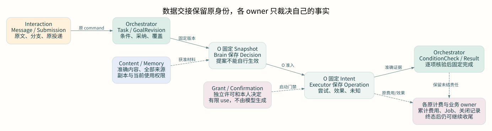
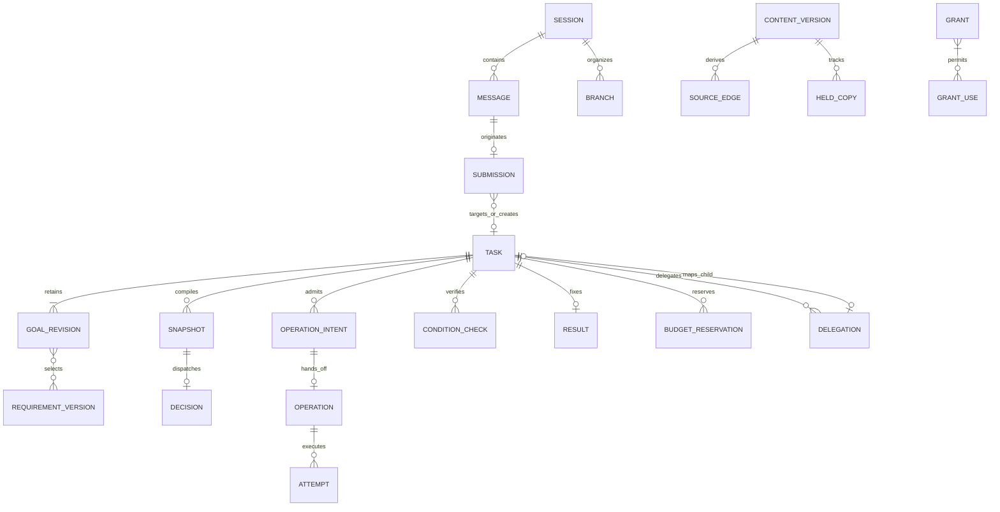

# 整体数据设计

Harness 的数据主线是：原始输入形成目标，目标形成可检查的条件；固定上下文产生决策提案，获准行动产生真实效果；证据支持完成裁决，费用与清理继续各自收束。每一步都保留来源、准确版本、唯一负责方和可恢复的后续责任。

本章集中回答模块怎么划分、谁负责哪些业务事实、数据从哪里来、如何关联和流转、放在哪里。它是生产分布式架构的逻辑数据与存储合同，不是已实现的数据库说明。单进程只用于开发调试。逻辑记录不要求一对象一服务，也不要求一记录一张表。

- [字段字典](field-reference.md)：按模块列字段、类型、必填性、语义、版本及唯一键
- [存储与一致性](storage.md)：物理放置、表与索引、事务、跨域同步、保留和删除
- [输入到条件](requirement-lifecycle.md)：原始消息如何成为权威 Requirement，以及澄清、修订和完整实例
- [机器合同](../protocol/core.schema.json)与[核心样例](../protocol/examples/core.json)：已形式化的严格 JSON 子集；不代表全部方法已有 SDK 或运行实现

图的结论：原输入、目标裁决、模型提案、实际效果和完成证据分别留在原 owner。实线表示主线交接，虚线表示独立内容、许可和收尾约束。可打开[原尺寸数据图](../assets/data-lineage.svg)查看；它是结构示意，不把跨 owner 箭头当数据库事务。

## 1 三类数据不能互相冒充

| 类型 | 例子 | 写入与使用规则 |
| --- | --- | --- |
| 权威记录 | Submission、Task/GoalRevision、Operation、Grant use、原账单、Content 元数据 | 所属 owner 在原事务域裁决；其他模块只能提交命令或引用 |
| 派生视图 | Task 内的执行投影、Delegation.phase、跨 owner 任务列表、搜索索引、UI 状态 | 标出来源身份、修订及缺口；可重建，不能回写或取代原事实 |
| 传输合同 | Command、Receipt、ObjectRef、ContentRef、ControlSnapshot、Delivery | 固定身份及版本，声明收到/接纳/决定的成功点；签名与回执不证明目标效果 |

同一 JSON 可能是权威记录的读视图，不能因此推导物理表结构。例如 Task.requirements 返回当前条件集合；历史版本在原 owner 的版本表保存。Operation 查询归 Executor，Task 中的 open_effects 是 Orchestrator 已归并事实的集合摘要。两者不是双写同一条记录。

六个对象组保持不变：Session、Task、Decision、Operation、Content、Grant。预算、证据及持久工作是相关组内责任；协作、环境、调度、安装和实验仅在启用时建立记录。GoalRevision 和 RequirementAdoption 只是 Task 内部的版本与采纳记录，候选条件只是原 Decision/提交载荷的一部分，不增加“需求服务”。纯问答可以没有工具 Operation；未使用长期记忆、委派或计划时，不创建这些可选记录。

## 2 模块与业务归责

“归责”指谁能裁决和修改事实。worker 是暂时执行者，进程更换不改变 owner。下表的维护包括正常更新、故障恢复、缺口报告及清理责任；未结责任不得交给一次通知承担。

| 模块及逻辑 owner | 创建与权威写入 | 读取、引用或派生 | 生命周期与删除责任 |
| --- | --- | --- | --- |
| Interaction 应用 owner | Session、Branch、Message、Submission、Surface/Presentation、Schedule/Occurrence | Task 接纳/结果投影、原请求表单 | 保存原输入与投递；会话归档不取消 Task；清理正文仍保留投递决定 |
| Orchestrator 固定 owner | Task、GoalRevision、Requirement、采纳/覆盖/消费、Snapshot、Intent、预算、Result | Brain 提案、Executor 效果、授权凭据、证据资格 | 目标/控制/准入/完成裁决；终态后继续效果、账务和缺陷收尾 |
| Brain owner | DecisionRecord、ModelCall、提案发布映射、实际模型用量 | Orchestrator 固定 Snapshot、准确配置、获准材料 | 至多一次物理模型请求；查询原调用与恢复发布；不能改 Task |
| Executor owner | Operation、Attempt、Effect 证据、资源/观察、Environment、hostcall 映射 | 不可变 Intent、TaskGate、UseReceipt、Binding | 实际入口、效果与可能迟到、资源退出、原费用与环境清理 |
| Content owner / Memory owner | 前者写内容元数据、来源边、Copy/清理；后者写记忆语义、提取候选与变化头 | 不可变字节、来源限制、当前使用许可 | 各自关闭新使用并追踪持有副本；索引与摘要一起纳入治理 |
| Grant owner / 原业务 owner | 前者写 Grant、UseReceipt、UseSettlement、离线 lease；后者写自己的 Confirmation | 认证主体、准确原命令、当前任务与资源范围 | 撤权、一次消费、使用结算分开；确认不能由 UI/Brain 代写 |
| 协作所在的父 owner / 子 owner | 父方 Delegation/ChildHandle/Allocation；子方 Task/IncomingAllocation | 原子映射、关闭与累计费用 | 父管交接与整体目标，子管实际工作；不相互改状态 |
| Extension 与证据治理 owner | Capability/Binding/InstallLock、Activation、Readiness、Approval、Defect/Eligibility | 准确制品、平台证据、已封存评测 | 控制新启用与证据适用性；不回滚业务历史 |
| Evaluation owner | 冻结 Plan、Run、SampleRun、Exposure 和报告 | 候选/基线、样本与独立真值、原 Operation/费用 | 保持原分母与正式试验次数；取消后收束环境与费用 |
| 每一个业务 owner | 本域 CommandReceipt、Job、outbox、最小去重/关闭记录 | 原领域对象 | 与业务事务同提交；按原身份恢复；最后去重依据长期保留 |

默认云端 Orchestrator 在所属 PG 分片保存 Task、Requirement、目标版本、任务预算、Result，以及共同裁决的 Grant/Confirmation 和证据 gate。独立 Brain、Executor、Content、Memory 使用自己的服务所属库。端侧设备 SQLite 默认只保存本机执行、资源门禁及恢复补传记录；Task 缓存不取得完成裁决权。[端侧独立 Orchestrator](../production/README.md#optional-edge-orchestrator)是单独可选部署。

装配到同一数据库的 owner 可显式共享一个事务，但逻辑职责和允许写入的接口仍不合并。具体表和事务范围见[存储设计](storage.md)。

## 3 身份与版本统一规则

1. 所有持久数据都有受信 tenant 和 owner 范围。认证上下文决定租户，载荷字段只用于一致性核对。跨租户引用默认拒绝
2. 持久 ID 在所属类型、租户和 owner 下不复用。跨域 ObjectRef 带 tenant_id、owner_id、object_id、revision；ContentRef 另固定准确字节版本、摘要、类型和长度。摘要不是身份、授权或来源签名
3. revision 表示对象可见业务修订；goal_revision 表示完整目标及有效条件集版本；control_revision 表示启动门禁版本；usage_revision 表示原计费源累计账单版本。不能相互代替
4. Requirement 的 revision 是该稳定条件 ID 的定义版本。GoalRevision 绑定完整条件 ID/版本集合；未改条件可跨目标修订复用。删除条件是新目标集合不再引用它，旧定义与采纳证据不原地修改
5. Command 键固定一次业务请求；Decision/Operation/Delegation 身份固定一项逻辑责任；Attempt 才是物理尝试。换 worker、重连和丢回执不换这些身份
6. 未知值使用显式 unknown 或省略可选字段，不用空串、零时间或空列表冒充事实。空集合只有配合完整性与范围才能解释
7. 时间采用 UTC RFC3339；日历规则同时固定 IANA 时区与 tzdb。数值计数是安全整数；金额是带 unit 的十进制字符串。判断期限使用当前可信时间，不使用模型时钟

公共字段、可选规则与条件必填项见[字段字典](field-reference.md)。对象版本用于并发裁决，不构成“所有 owner 同刻快照”。

## 4 对象关系与基数

图表示逻辑基数，不得将跨 owner 的线画成数据库外键。需特别约束的关系如下。

| 关系 | 基数与唯一约束 | 创建或变更时机 |
| --- | --- | --- |
| Session → Message / Branch | 1:N；message 的 session seq 唯一；branch head 用 CAS | 原消息或分支保存事务；分支复用历史引用，不复制执行 |
| Submission → Task | 新目标最终 0..1 个新 Task；steer 指向 1 个既有 Task；input 可针对 Task 或独立应用请求；一 Task 可有 N 次输入 | 原应用投递记录和 Task 原命令分别落账；映射沿原回执建立 |
| Task → GoalRevision → Requirement | Task 1:N 个不可变目标快照；每快照 0..100 个准确条件版本；同快照同条件 ID 不重复 | 初建/目标与条件实质变化时；空条件只用于待提炼阶段 |
| Task → Snapshot → Decision | Task 1:N；每 Snapshot 0..1 个固定 decision_id；Brain 物理调用 0..1 次 | O 保存快照和 dispatch；B 独立接纳后生成模型请求/提案 |
| Decision → 采纳 / OperationIntent | 每 Task/Decision 至多一次消费；一 Decision 可提多行动；条件改变的同轮不准入行动 | 原 Task 事务裁决；过期或拒绝也保留消费决定 |
| Intent → Operation → Attempt | 同 operation_id；远端尚未接纳时 0 个 Operation；接纳后只有 1 个；其下 0:N 有界尝试 | 原 Intent 与派发 Job 同提交，Executor 独立接纳 |
| Requirement → ConditionCheck | 一条件版本 0:N 检查；最终 Result 每个必要条件仅选一份当前有效判断 | 核验绑定 goal_revision、条件版本、准确成果、规则及范围 |
| Task → Result | 0..1 个不可变成功 Result；非成功终态另保留状态/原因，不制造成功结果 | 完成事务固定；后续缺陷用 notice，不改旧结果 |
| Content → 来源/副本 | 每准确版本 0:N 来源与 holder；来源必须已发布，形成 DAG | 发布与登记门禁；不以“报告只引用两篇”替代实际全部处理来源 |
| Grant → use → settlement | 一个 use 可同时消费同 owner 多个 Grant；每 Grant 0:N use；use_id 只绑定一个 intent；原使用有一个可修订结算头 | 授权 owner 一次消费；费用更正不重开 once |
| Task → 费用来源 | 一实际计费来源只对应一份本层 reservation；其单位明细按 reservation/unit 唯一，每 Task/单位一份 balance | 预留绑定原源，按累计修订只追差额；UI 汇总不另收费 |
| Delegation → 子 Task | 0..1；一个独立子目标一个 delegation/allocation；重用 child 会话可有 N 历史目标 | 原 creation_key 接纳；未知创建继续占用预算与活动槽 |
| Schedule → Occurrence → Task | 1:N；occurrence 键为 schedule/rule_revision/planned_at/fold；0..1 Task | 到期应用事务；发送未知不创建第二 occurrence |
| EvaluationPlan → Run → SampleRun | 每 Plan 一个逻辑 Run；每 (plan,sample,arm) 一 SampleRun | 冻结全集；尝试不增加样本或减少分母 |

可增长集合保存在完整关系索引，不塞入无限数组。Task 的条件初值上限 100，超过时明确请求拆分或收紧目标，不能截断。所有可增长的操作、副本、样本和后代查询采用 CollectionSummary 与分页；内部完成/删除仍核验完整索引。

## 5 从输入到交付

完整主线为：应用固化原输入 → 编排器接纳目标/条件 → Brain 基于固定上下文提议 → 原 owner 准入并预留 → Executor 执行与核对 → 条件/覆盖检查 → 固定 Result → 独立费用及清理收尾。

每阶段的输入、产生方式、事务产物、交接成功点及故障恢复集中在[端到端流程与时序](../workflows.md)。[输入到条件](requirement-lifecycle.md)展开最容易被省略的原文提炼与采纳阶段。本文不重复各模块的执行算法。

## 6 读写与实现入口

实现某个模块前，先从本章定位该事实的 owner，再查看该模块的业务流程和字段字典；不要从 JSON 名称推断它允许被谁更新。常见查询必须有明确的服务所属库索引路径。

- 任务详情：当前 Task/GoalRevision、有效条件与选中检查、完整未结关联、预算摘要；不每轮扫描全部历史
- 原输入追踪：Submission → 原 CommandReceipt → Task → 原分支回复；历史归档不抹掉映射
- 效果核对：task → intent → executor/operation → attempts/证据；没有远端事实时保持缺口
- 费用追踪：task → reservation → 原 billing source → cumulative usage；父/子/UI 汇总不重复扣费
- 来源与清理：content version → sources/holders → 派生物和清理 Job；正反关系都须可索引
- 发布追踪：InstallLock → bindings/instances/holders → approval/readiness；新版本不能覆盖旧版本恢复依据

落地验收同时检查正常链路、重复/乱序/迟到、跨租户引用、版本冲突、缺源、权限撤回和删除恢复。样例与静态检查只能证明设计材料一致；数据库原子性、真实出口、跨区耐久和模型语义质量须按[验收矩阵](../validation/README.md)实测。
