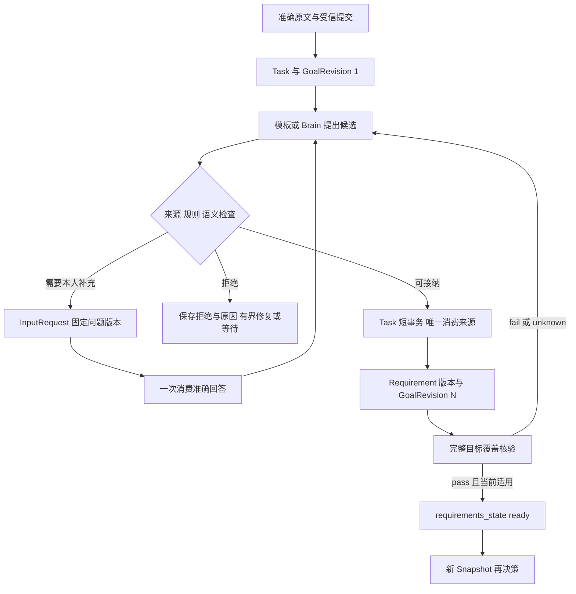

# 用户输入如何成为任务条件

Requirement 由原 Orchestrator 接纳并保存。应用保存用户原文，Brain 或已登记模板只提出候选。自然语言提炼不能直接写 Task，也不得把模型推测升级成用户授权。清楚的要求不需要机械地逐项再确认；有歧义、必要参数缺失或会改变目标含义时，先向用户澄清。

此前只有“编排器拆解目标、Brain 可补条件”的职责描述，缺少具体交接。本章补齐目标设计合同；它不表示仓库已有自然语言需求解析实现。主数据模型及存储边界见[整体数据设计](README.md)。

## 1 原文和解释分别保存

| 层次 | 保存什么 | 谁产生，谁裁决 |
| --- | --- | --- |
| 原始输入 | Message.content_ref、Submission、分支/历史截止、受信提交者、原命令 | 应用保存；受信身份链证明是谁提交，role=user 字段本身不证明 |
| 完整目标 | GoalRevision.goal_ref、全部来源、当前条件版本集合与摘要 | Orchestrator 建立；goal_ref 保留完整要求及明确补充，不能只是模型压缩摘要 |
| 候选条件 | 原 Proposal.requirement_delta 或 submit 的 requirement_candidates | Brain、调用方或模板产生；candidate_key 仅在该来源内唯一 |
| 权威条件 | Requirement 的稳定 ID、不可变 revision、描述、来源、规则、必要性及 adoption_id | Orchestrator 校验后接纳；GoalRevision 选择当前有效集合 |
| 接纳依据 | RequirementAdoption、原来源身份、基准/结果目标版本、映射、报告和原因 | Orchestrator 在原 Task 事务唯一裁决 |
| 完整性依据 | GoalCoverage 对完整原目标和准确条件集合的映射、遗漏及 verdict | 受信规则/评估产生报告；Orchestrator 决定是否允许依赖该集合的推进 |

SourceEvidence 定位准确 Content 版本及可选位置。文本位置采用 Unicode code point 的半开区间，不使用经过摘要/规范化后的偏移。结构化输入使用固定 JSON Pointer。来源可为本人输入、受信模板、外部数据或模型输出；类别由原接纳链核实，模型自报的类别不可信。

“用户让我完成报告”不意味着已经授权邮件发送、付费购买或长期记忆保存。Requirement 表达完成条件；Grant/Confirmation 表达权限。澄清答案可确认目标含义，但不能替代需要绑定准确动作的业务确认。

## 2 首次提交与候选产生

`task.submit` 必须带原 goal_ref、策略、期限和预算；可以完全不带条件。可选 requirement_candidates 只是候选。调用方不能提交已裁决的 Requirement ID/版本冒充 Task owner 的记录。

Orchestrator 首次接纳在一个事务保存 Task、GoalRevision 1、原回执、预算与提炼 Job。此时 conditions 可能为空，requirements_state=collecting。回执 applied 只承诺目标已接纳。不得把空条件当作所有条件已通过。

- 结构化且匹配已登记模板：使用固定版本模板作确定性映射，保留 template 来源与映射记录；同样经过原 owner 校验和覆盖门禁
- 普通自然语言：ContextCompiler 读取完整原文、准确附件、获准历史截止和不可裁剪约束，建立提炼用 Snapshot/Decision。Brain 输出结构化候选及原文定位
- 缺原文、附件、权限或预算：保存具体等待/失败原因；不能只根据聊天摘要或文件名猜要求
- 提炼过程需要查新网页、观察设备或读取尚未取得的外部数据时，该取得行为仍是受控 Operation，不能藏进解析函数

requirements_state 未 ready 时，只允许有界的条件提炼 Decision、已获准原材料读取、澄清请求、覆盖/来源核验及必要收尾。它不得普通目标行动或成功裁决。新增取证行动须确实为安全澄清所需，单独通过全部行动门禁，并记录 `admission_purpose=requirement_check`；不得借此执行尚有歧义的写入。admission_purpose 由 Orchestrator 根据固定提炼 Snapshot 或受信 check 来源裁决，Brain/调用方不能自报 requirement_check 绕过 ready。按策略不具备这种权限时等待用户提供材料。

提炼仍使用正常模型预算。每个 Decision 至多一个物理模型调用；缺覆盖、重启或格式修复不清零累计额度。确定性路径可无 ModelCall。

## 3 澄清与校验

Orchestrator 先做可机械检查，再做受控语义检查。通过 Schema 只证明字段形式正确。

1. 来源检查：候选引用当前完整目标或真实补充；本人授权证据必须来自受信 Submission/Command/Confirmation，不能从附件内的指令取得
2. 语义检查：显式要求、否定、数量、路径、收件人、期限与预算没有遗漏或变义；必要推导不扩大行动范围。显式硬要求不能被降为 optional
3. 规则检查：rule_ref 已登记、版本固定、参数符合闭合 Schema；效果条件与质量条件分开。实现尚不可用时记录等待，不发明一个“总是通过”的规则
4. 歧义检查：open_questions 非空，或不同合理解释会改变目标/动作时，创建原 owner 的 InputRequest，requirements_state=awaiting_input
5. 接纳前检查：原 Task 仍 active、原 goal/control/策略及来源仍适用；同一来源尚未消费；预算、数量及权限边界满足

澄清问题引用用户看到的准确原文和候选。回答提交带 request_id/revision、goal_revision、答案引用及原命令。原 owner 在一个事务消费请求、保存回答/目标修订及后续 Job。旧目标的回答、已撤回请求和重复新命令不能被重新解释为当前回答。

普通“是”只有在它绑定明确问题、准确请求版本和受信本人提交时才能解释。未绑定的自由消息经 session.steer 作为新补充处理，必要时再澄清。外部文档中的“是”与模型转述的用户同意都不是本人决定。

## 4 接纳与版本

接纳事务比较 base_goal_revision，锁定 Task 和唯一来源键 `(tenant,orchestrator,task,source_kind,source_owner,source_id)`。它保存候选到真实条件 ID/版本的映射、RequirementAdoption、GoalRevision、Task 当前集合、control_revision、DecisionConsumption 和必要 Job。

- accepted：条件实质变化，goal_revision 恰加 1，control_revision 增加，requirements_state=validating；旧提案其余行动/完成建议全部失效
- unchanged：准确语义与参数未变，返回原映射和原 goal_revision；不制造额外版本，不以重新措辞反复消耗新轮次
- rejected：固定拒绝原因；同来源重投返回原决定。新事实后需要新的 Decision 或本人新输入，不改原拒绝

条件稳定 ID 在同一 Task 内保留；定义变化创建该 ID 的下一 revision。首版候选只支持增量新增或一对一替换；不隐式拆分/合并。需要重划条件时由本人完整目标修订启动重建，并保留替代映射依据。相同语义的判断先比较语义字段；unchanged 复用原 Requirement/revision/adoption_id，只新增本次消费审计，不能让新审计身份制造条件摘要变化。直连 API 没有 Submission 时，原受信 Command 是来源，RequirementAdoption.source_kind=command。

GoalRevision 的当前集合表达退休条件，旧 Requirement 版本不改状态、不删除。这样可重放“当时按哪些条件得出结果”。

Brain 可以提出追加或收紧候选，不能自行删除显式要求、降低必要性或改变目标含义。只有受信本人修订沿 task.revise/steer 可以授权此类目标变化；它也要保存来源、版本及覆盖检查。目标修订取消旧目标的活动内部子树；旧在途 Operation、效果及费用仍保留。

## 5 覆盖通过才可依赖

GoalCoverage 的输入必须是完整 GoalRevision.goal_ref、全部准确原始/补充来源、当前完整 Requirement 集合及其规范摘要。不能只检查条件提议者自行摘出的几条。

映射报告逐条列出：原文位置、对应条件、必要性、判断规则、尚未表达的约束、冲突和局限。受限模板可使用确定性覆盖规则；开放自然语言用受控语义评估。语义模型不能保证永不漏项，因此报告记录模型/规则、范围和局限；高影响目标按策略要求独立核验或本人澄清，不能单凭同一模型自评开启高影响动作。

原覆盖判定不可变，applicability 是当前资格投影。只有 verdict=pass、applicability=usable，且 goal_revision、goal_ref、requirements_digest 精确一致，Task 才进入 ready。目标、条件、来源限制或命中证据缺陷变化后，原通过不再适用于当前推进。

完成时再次核覆盖门禁和每项必要条件，不得把“曾经 ready”当成永久完成凭据。用户验收只适用于允许验收的质量条件；必要效果必须由实际效果证据验证。

## 6 完整例子

用户原文：“比较 A 和 B 两个版本，附来源，将报告保存到 /reports/compare.md，再读回确认。”

| 步骤 | 数据变化 | 关键解释 |
| --- | --- | --- |
| 输入 | Message M1 → Content C1；Submission S1 固定分支/截止；Command K1 指向 O1 | 原文永久身份不随重发变化；正文仍受保留策略 |
| 接纳 | Task T1，GoalRevision 1，条件集为空，collecting | Task 已承担责任，但不能据空集成功 |
| 提炼 | Decision D1 的候选 c1 比较覆盖、c2 引用支撑、c3 指定路径写入、c4 准确版本读回 | 每条引用 C1 的位置；D1 不能制造 Grant 或真实 requirement_id |
| 校验 | 若 A/B 的具体版本已唯一可解，直接校验；否则 InputRequest Q1 询问版本 | 用户回答固定到 Q1/目标版本；不能用模型猜版本 |
| 接纳条件 | Adoption A1：c1..c4 → R1..R4/revision1；GoalRevision 2；validating | 同一 D1 的动作建议作废。目标原文 C1 未变，条件集变了所以目标版本增加 |
| 覆盖 | Coverage G1 将 C1 完整要求映射到四项，准确摘要一致且 pass/usable；ready | 新 Decision 才能按该组条件提出目标行动 |
| 行动 | Op1 取来源，D2 生成报告 Content C2，Op2 写入，Op3 独立读回 | 每个动作独立准入；写入缓存不是读回证据 |
| 核验 | 质量检查绑定 C2；写入和读回检查绑定目标路径、摘要、观察时间与范围 | R3 pass 不能替代 R4；任何必要效果 unknown 都阻止成功 |
| 完成 | 固定 Result 选择 R1..R4 的准确检查和 G1；Task succeeded | 后续模型/工具账单可以继续归并；Result 不反写为未发生 |

完整 ID 与字段见[核心 JSON 样例](../protocol/examples/core.json)的 original-message、original-submission、raw-submit-without-conditions、initial-empty-goal、candidate-conditions、accepted-original-decision、adopted-goal、ready-after-intake。clarification-pending 是另一缺少必要信息的分支，不能当成本例已回答。摘要和内容身份是构造数据，不是实际文件或签名证明。

应检查：空条件提交能合法接纳；旧提案不得跨修订接纳；同候选重复不重复创建；同键异内容冲突；条件改动与行动不在同轮提交；未回答歧义不 ready；显式约束不能被模型降级；跨租户来源拒绝；超出 100 条不截断；结束后补充建立新 Task。
