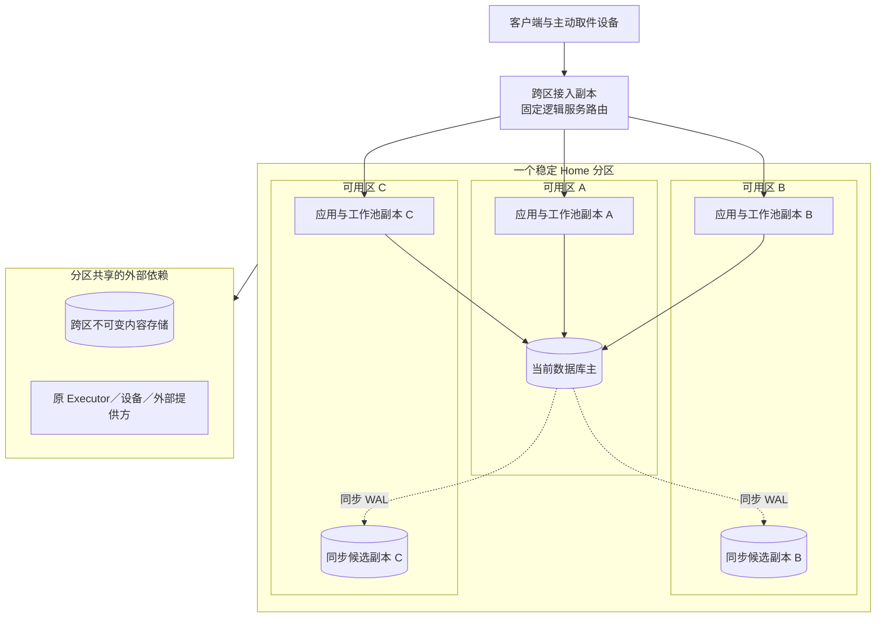
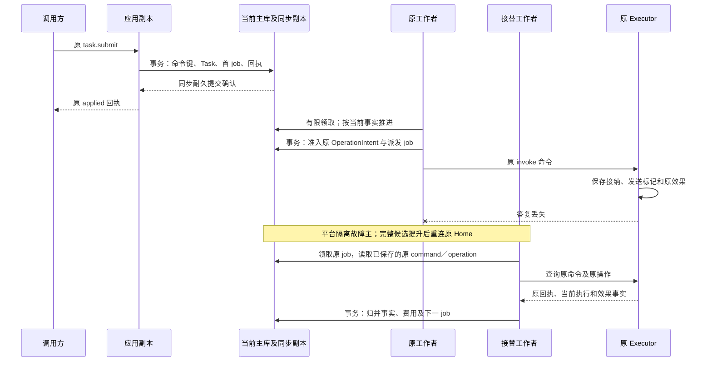
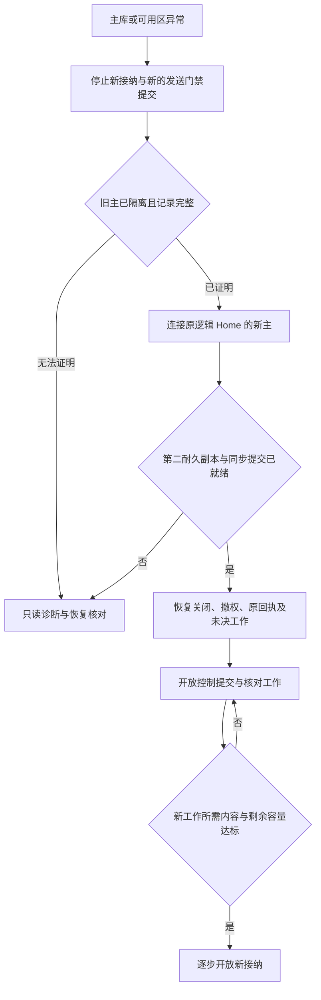

# 生产分布式部署：拓扑、故障边界与容量

[部署基线](deployment.md) · [模块详设](README.md#detailed-design) · [运行验收](validation/README.md)

本页将云端部署展开为可实施的生产配置：单地域跨三个可用区，多个稳定 Home 分区，分区内多副本接入和工作进程共用一个数据库权威。可用区指可能整体失效的机房与网络故障域。该配置是本次推荐设计，所有容量与恢复时间仍须实测；现有任务的 Home、公开方法及成功语义不变。

启用它之前，基础平台须提供旧数据库主隔离、同步复制及安全提升、跨可用区内容持久化、可信身份和密钥恢复。缺少旧主隔离或完整记录证明时，该分区关闭新接纳及新的发送门禁提交，只开放可证明安全的诊断与恢复；这不撤回已跨过门禁或已发出的请求，其效果与费用继续按原身份核对。不能凭“部署了多个副本”宣称高可用。完全本地与端云混合仍按[三种装配](deployment.md#2-三种必须验证的装配)工作。

## 1. 软件模块怎样装进生产进程

模块形状指对外入口、内部应用与领域组件、持久接口及外部适配器之间的依赖方向。进程形状则决定故障、资源和发布边界；一个模块可以有多个工作进程，一个进程也可以装配多个模块。默认保留共享事务有价值的领域，将耗时工作放到可限流的进程池。

| 部署角色 | 装入的现有职责 | 保存的权威事实与扩展单位 |
| --- | --- | --- |
| 接入／取件进程 | 认证适配、严格信封、按逻辑服务路由、设备长轮询及可选 SSE | 连接可丢；原命令及 Delivery 恢复记录在负责分区。按连接、带宽与请求量增加副本 |
| Home 应用进程 | Task、计划准入、协作映射、Input／Surface、默认同分区 Grant 和 Confirmation 的业务入口 | 按对应 repository 保存事实；同一事务句柄协调需共同提交的记录。按请求吞吐增加副本 |
| 工作进程池 | jobs 领取，Brain 单轮、Memory 索引／提取、远端派发、效果／费用核对、关闭传播 | 处理责任仍在所属权威库；按工作类型、提供方及租户配额分池。增加工作者不会增加数据库写容量 |
| 执行适配进程／设备宿主 | Executor、资源 owner、具体驱动及单设备门禁 | Operation、发送标记和效果事实归原 Executor；按互不冲突的资源增加实例，不能复制同一设备控制权 |
| 管理与隔离评测进程 | Extensions、Evaluation 入口及受限实验执行器 | 安装与批准账本按 owner 保存；实验环境、CPU 和内容配额独立于用户任务。管理入口可共宿主，实验执行单独隔离 |

生产初期允许 Home 应用和通用工作角色由同一发行包启动，配置决定是否接纳请求或领取哪些工作。将 CPU 密集或不可信组件隔离出来，解决的是资源干扰及信任边界；不因文档有九个模块就创建九套数据库、队列和服务发现。

内核应用组件只调用本域 repository 和声明的外部 port；同库协调由宿主显式传入事务，跨库调用必须回到原命令／回执协议。管理程序和插件不直接写 Task、Grant 或效果表。组件代码的依赖图及对象流转分别在[九模块索引](README.md#design-coverage)中查阅。

## 2. 拓扑、路由及数据放置

下图表示一个 Home 分区的部署拓扑。三个工作池副本可以装相同代码，数据库只有一个当前主；实线为请求或存储访问，虚线为同步复制。其他 Home 分区复制同一结构并拥有独立权威库，不能对这一分区的任务同时写入。

分区边框引出的线代表各应用／工作副本共有的外部依赖：内容访问走原引用，Executor／设备／提供方调用及核对走原身份；两个外部节点互不表示依赖。数据库、内容存储及接入层是不同故障依赖，实际装配须检查其网络、密钥和管理平面是否共用单点；三个应用副本连接同一个不具备故障切换能力的数据库，不满足本配置。

### 2.1 稳定映射与扩容

租户默认绑定一个 Home 分区。受信装配及发现先提供逻辑 Home 地址，调用方再固定 task.submit 的 home_id、目标与 command_id；请求一旦定稿，重试不得因负载均衡改写 Home。接入层只把稳定逻辑地址解析到当前健康应用副本。任务创建时 task_id→home_id 映射与 Task 同事务保存；跨 Home 目录是可重建的汇总，不能成为任务接纳的第二权威。

路由缓存丢失时从受信映射重建，无法确定映射就拒绝路由；不能将缓存 miss 当作新任务。映射服务变化可影响新任务的 Home 选择，但既有任务、原命令查询和关闭身份继续指向原分区。热点租户需要多个 Home 时，先按[跨分区配额](#quota-scope)分配有限份额，再开放额外 Home 供新任务使用，由已有目录聚合；运行中的任务不迁移，也不把活跃记录按 task_id 临时切到另一数据库。

Grant、Memory、内容和资源的 owner 独立于 Task Home。默认使同租户的高频权威落在同分区，以减少网络交接；拆出 owner 后保留原 ID、查询及恢复端口，跨分区事务使用现有协议。父子任务优先同 Home；跨 Home 的预算预留与 receiver 关闭按[协作规则](collaboration/implementation.md#production)执行，不能以分布式事务隐藏中间状态。

### 2.2 各类数据的读取边界

| 数据 | 放置与读取路径 | 扩容／缓存边界 |
| --- | --- | --- |
| Task、命令回执、jobs、预算、Grant／Confirmation、激活与关闭索引 | 对应分区当前主库；业务状态与恢复义务一起提交 | 同对象条件判断不得读取落后副本；同命令缓存返回前仍核对当前披露资格 |
| 不可变 ContentRef 正文与制品 | 符合约定的跨区对象存储；摘要验证后引用进事务 | 可缓存字节，但使用资格、copy 和关闭修订仍从权威核验。镜像路径保留[在线读取限制](memory/implementation.md#52-无入站设备的受控反向交付) |
| Memory 搜索索引、任务汇总、统计 | 由持久工作更新的派生数据，保存追赶位置 | 可独立扩容或重建；落后时补扫、显示缺口或降级，不能用索引快照批准动作 |
| 报告／运维聚合 | 从已脱敏并获准的记录异步生成 | 可使用只读副本；不能将副本上的“无记录”解释为原命令从未处理 |
| Delivery、输入转交与控制传播 | 负责端业务库内持久发送记录，连接层只搬运 | 外部队列只提示原记录待处理，丢通知靠扫描恢复，不保存另一份业务真值 |

## 3. 一次跨进程推进的数据与提交边界

下面聚焦数据库切换发生在已接纳之后的场景。方框中的“事务”均只包含同分区读写；外部调用在事务之外。备用工作者接替的是原工作记录，Task Home 和 Operation 身份都不变。

若连接在事务提交后断开，应用将其视为结果未知，按原命令查询；客户端是否看见成功，不决定事务是否提交。若领取过期但旧进程仍活着，lease_epoch 条件写阻止旧进程更新账本，却不能撤回已发出的网络字节。接替者先查原发送／操作记录；非幂等外部效果不得仅凭租约过期再次发出。可安全重投的请求仍使用原身份，设备 owner 的实际启动门禁继续成立，细节见[执行实现](execution/implementation.md#key-sequence)。

## 4. 可用性、数据库切换与恢复顺序

推荐在三个可用区放置主库和两个同步候选，业务提交配置等待至少一个异区候选将 WAL 持久化。对应 PostgreSQL 18 的配置语义是 `synchronous_commit=on` 与 `ANY 1 (standby_b, standby_c)`；其耐久性依赖实际复制和存储，同步等待会增加提交延迟。`remote_write` 尚未保证备用机落盘，本配置不以它返回耐久接纳。技术语义见[同步复制](https://www.postgresql.org/docs/18/warm-standby.html#SYNCHRONOUS-REPLICATION)及[复制参数](https://www.postgresql.org/docs/18/runtime-config-replication.html)。

这是“单一可用区失效时保留已确认业务记录”的推荐配置，不是跨任意故障零丢失承诺。数据库平台须在提升前隔离旧主，比较同一历史上的可用候选，确保选中的候选包含全部已确认提交；提升后仍有第二个耐久副本才重新开放此级别写入。平台无法证明这些条件时停止恢复写入，不自动降为异步提交。进程 readiness 只依据平台给出的当前主资格及本应用恢复状态，不自行选主。

下图建模一个 Home 分区的恢复入口状态，箭头是平台证明或本应用恢复检查完成后的推进；不是 Task 的状态图。

### 4.1 失败由谁处理

| 故障 | 仍可提供的行为 | 停止／恢复责任与可观察依据 |
| --- | --- | --- |
| 单应用或工作进程退出 | 其他副本处理不冲突请求；已有回执可查询 | 新工作者读取原 job。ready 只表示本实例可处理，不能冒充原外部操作已恢复 |
| 整个可用区失效 | 在平台完成选主且剩余容量足够后恢复原 Home | 数据库平台隔离旧主；应用先控制／核对后新工作。记录故障检测、选主、账本恢复、开放四段耗时 |
| 同步副本全部不可达 | 已有受限诊断可读；当前事务可能等待或结果未知 | 不以降低耐久级别解除排队；超时查询原命令。复制恢复前新业务不返回成功 |
| 另一 Home、Grant owner 或设备不可达 | 不依赖它的任务继续；已获准有限工作按原窗口收尾 | 依赖步骤进入等待；预算保持预留，不能创建替身或扩大离线权限 |
| 对象存储读取不可用 | 纯元数据管理及不依赖该正文的工作继续 | 需要正文的决策／完成验证等待；哈希存在不能代替正文取得 |
| 对象存储写入或磁盘空间不足 | 原回执、控制及收尾优先 | 上传／新正文工作拒绝或等待；根据[存储保护](deployment.md#9-存储保护关闭索引与备份)保留耐久关闭能力 |
| 索引或可选消息队列停机 | 权威查询和有界数据库扫描继续 | Memory 补扫受上限约束；不能无界全表扫描。队列恢复后按原记录去重 |
| 全地域故障或恢复缺历史 | 只读灾备诊断、明确当前缺口 | 运维隔离原地域并补齐后续记录；不自动激活旧备份中的任务、许可或设备凭据 |

跨地域默认保留加密备份及连续历史，用于灾备，不启用同一 Home 的双地域可写。若业务要求整地域失效仍自动写入，需要重新选择能证明唯一写权和记录完整性的跨地域持久方案，测量长距离提交代价；这不是增加应用副本即可获得的能力。

### 4.2 可用性与时延验收口径

以下为生产首轮试验目标，尚未承诺服务 SLA。用一个月窗口及固定租户／负载范围评估；逻辑请求按原 command_id 计一次，重试不增加成功样本。合法但因系统过载、依赖故障或内部错误而无法完成的请求计入不可用，预先约定的用户权限／额度拒绝单列。

| 指标 | 初始目标／测量方式 | 不包含的保证 |
| --- | --- | --- |
| Home 接纳、控制提交及权威查询可用性 | 各自 ≥99.9%，分别统计请求及失败时段 | 不等同于模型质量、任务最终成功率或设备在线率 |
| 同地域接纳／控制提交延迟 | 延续部署基线 p95≤300ms；另观察 p99≤1s；含当前复制等待及本方依赖 | 不含长模型运行、外部效果与离线设备控制确认 |
| 单可用区故障恢复 | 原 Home 恢复控制／查询的 RTO 目标≤60s；新工作开放另计 | 条件不足时以停止写入保完整性，不能为了数字跳过旧主隔离 |
| 已确认账本持久性 | 在该单可用区故障模型下 RPO=0；核对原命令、控制、用量和关闭记录 | 不覆盖多区永久损坏、软件错误及缺失的外部效果记录 |
| 内容及外部动作恢复 | 内容逐摘要核对；每个未知操作记录年龄和责任方 | 不能用数据库 RPO=0 宣称外部系统恰好执行一次 |

## 5. 性能预算、扩展单位与过载

容量基线仍采用每日 500 万任务、高峰约 290 个任务／秒、每任务 4 次模型调用及平均占用 8 秒的假设。稳态模型在途量约为 `290 × 4 × 8 = 9,280`；该估算使用平均时间，不能用 p95 代替平均值，也不能反推出提供方已有这份配额。[原始假设](deployment.md#capacity)与以下分解共同作为压测输入。

| 资源 | 负载公式与必须实测的分项 | 增加容量的动作与限制 |
| --- | --- | --- |
| 数据库提交 | `任务到达率 × 每任务全部提交次数 + 后台提交率`；20 次／任务仅为原始假设，须实测领取、续租、Grant、回执、控制及清理是否已计入 | 优先缩短事务和批量领取，再增加 Home 分区；增加工作进程不能消除热行争用 |
| 模型／工具并发 | 到达率乘平均占用时长，分别按提供方和能力统计；未知账单仍占费用预留 | CPU、网络并发和费用上限分开配置；只在供应商配额及用户预算允许时增加池 |
| 数据库连接 | 全部实例的连接池上限之和，加管理与恢复保留连接 | 每进程小池、事务外等待外部调用；扩实例前先验证连接总额，不随副本数无限扩池 |
| 设备连接及重连 | 若 10 万设备均为空长轮询且平均等 25 秒，已有约 4,000 次／秒换轮询，真实有消息时更高 | 按连接内存、握手CPU及回复带宽扩接入层；单实例重连退避与随机抖动，限制每设备并行 pull |
| 大内容 | 原假设每日约 0.95 TiB；保存 30 天约 28.6 TiB 原始正文，另计副本、快照和派生物 | 字节走内容入口；每租户限制在途字节和并发，关闭清理留专用带宽与空间 |
| 持久恢复与关闭索引 | 到期 jobs、未知操作年龄、控制目标数、关闭索引增长及 WAL 生成率 | 用有限索引页扫描、分批传播及容量保护；保留索引不按普通日志 TTL 回收 |

### 5.1 数据库与热键

jobs 按所属分区、工作种类、可运行状态和 next_attempt_at 建领取索引，每批限制行数及扫描耗时；待执行与历史终态分开索引，保留原唯一键。工作领取可用 `FOR UPDATE SKIP LOCKED`，但该方式不是一致业务读取：取得 job 后仍在短事务中锁实际 Task、预算或领域对象，按条件修订裁决。[PostgreSQL SELECT](https://www.postgresql.org/docs/18/sql-select.html#SQL-FOR-UPDATE-SHARE)

Task 更新按 task_id 串行；预算按任务及单位、一次许可按 grant_id／use_id、设备按 resource_id、内容控制按准确引用与 copy 串行。不得通过把同一对象的不同写入发到不同库来“解决”热键。控制树或持有者列表较大时，在原事务固定控制决定及待传播范围，以有界 jobs 逐批处理；对外分别给出已提交控制与尚未确认目标，保留原强度。

只读副本用于统计和可滞后的管理投影，不能承担新行动的权限、控制或原命令不存在判断。用户可见的当前状态查询默认读主；只有明确标注投影滞后的视图才能读副本。连接池每次事务设置并核验租户上下文，任务结束归还连接前清除；RLS 受限数据库角色作为额外隔离，不能让后台工作借管理员角色绕过租户。[PostgreSQL 行安全](https://www.postgresql.org/docs/18/ddl-rowsecurity.html)

### 5.2 在故障剩余容量下定副本数

对工作者、接入层和存储分别测得容量，不用一张 CPU 图决定全部扩容。若负载为 L，单副本在目标延迟下实测容量为 C，正常利用率上限为 U，需要承受损失的副本比例为 f，则初始估算为 `N ≥ ceil(L / (C × U × (1-f)))`。三可用区均布可取 f=1/3 做试验；数据库提升后的写容量和提供方配额另算，不可套用这一无状态池公式。

扩容信号同时看最老可运行 job 的等待时间、到达／完成速率、数据库锁等待、连接池等待、外部限流和内存。只因队列变长就增工作者，可能进一步压垮数据库或提供方。若瓶颈是外部限流，限制新准入并延后原工作；若是数据库热行，降低同键并发；若是 CPU，增加相应隔离池。每次调节有上限和冷却期，避免反复扩缩。

### 5.3 跨分区总配额的归属

生产初期采用受信配置的保守分区份额，避免在每次调用前新增全局协调服务。对每个用户／租户、提供方及配额维度，配置固定的计数 owner 分区、份额和生效版本；同一总额下全部份额之和不得超过总额。用户费用、接纳速率、本地执行槽及提供方容量分别计量，不能互相抵扣；速率份额须使用同一计量窗口，限流突发量也拆份。任务内的 allocation 仍只处理父子预算，不能代替独立任务之间的用户总额限制。

份额保存在实际裁决接纳或调用的 owner 配置中，占用和释放由该 owner 的权威库事务保存；同分区所有副本共享计数，新增进程不获得新份额。受信管理端串行发布同一总额的分配版本，owner 耐久保存已接受版本并拒绝旧配置重放。Brain 费用／调用计数属于原 Decision owner，委派创建属于父 Home，Executor 的执行槽属于原执行 owner；共同的提供方上限须覆盖所有会实际调用它的 owner，包括隔离评测。尚未分配份额的 owner 不开放相应新工作；本地配额事务与所属工作共同提交，跨 owner 的已有权限和预算仍经原协议核验。

扩容先从未分配余额中划出份额。若需转移已分配份额，先在原 owner 耐久降低上限并确认释放量，再增加新 owner；旧 owner 失联时不能把其份额再次分配。费用的未结预留、仍可能占用的本地槽及旧计量窗口的用量一并计入转移约束，配置换版不清零计数。无法证明旧份额已回收时保留它，新分区等待。供应商未知调用仍按上界占费用；没有远端终结查询时，分区计数也不能宣称供应商物理并发的硬上限。

该选择将未用份额留在原分区，热点用户会在系统尚有空闲时排队，运维承担份额调整成本。若这种闲置与调整成为主要瓶颈，再引入固定配额 owner 及明确的预留／结算协议；在具备该协议前，不用异步汇总计数扩大总额。

### 5.4 队列隔离、取消优先与恢复洪峰

在持久 jobs 中划分控制传播、原结果／费用核对、正常推进、索引／清理／评测等工作类别；它们仍共用原记录及去重语义。各类别配置最大并发、每租户份额、最长可排队时间和数据库连接份额，控制与收尾拥有非零专用余量；正常任务不能借较高优先级占用该余量。总工作预算同时受分区与提供方限制，持久 job 数也设上限，不能用磁盘把过载无限延期。

恢复扫描按分区和有限索引游标推进，先处理关闭／撤权，再核对未知结果和账单，最后放开目标推进。每个租户获得有限轮转机会；重连、超时重试和积压恢复加入抖动，并沿原身份执行。已知可被更高修订覆盖的控制可合并到最新待发送快照，但保存原决定及未确认目标；不得合并原 Operation、额度结算或一次确认消费。

队列接近上限时，接纳前明确 overloaded；已经接纳的工作保持可查询及恢复责任。达到存储保护水位后，停止会生成新正文或新责任的工作，保留控制和收尾；连原控制事务也无法提交时返回不可用，不显示取消成功。在线 SLO 的系统过载失败不能从统计分母删除。

## 6. 发布、观测与生产验收

滚动发布先在少量新实例验证准确安装锁、当前批准、数据库可读写格式及恢复自检。旧实例停止新领取，交回可安全移交的工作；已发送的外部请求保留原身份及查询责任。仅当新旧版本声明兼容时允许短期共存；不兼容格式按分区排空后迁移。回退应用不回滚 Task／Operation／Grant 账本，当前实例开放仍按[扩展门禁](extensions/implementation.md#production)执行。

一次请求的跟踪串联 tenant、Home、command、task、decision、operation、use／allocation 和 content/copy。指标按 Home、方法、工作类别、提供方及有限租户分组聚合，避免把每个任务ID变成指标标签；精确ID留在获准的结构化记录。正文、令牌和模型材料不进入通用遥测。用量记录和诊断指标分开，采样日志不能作为结算真值。

| 生产实验 | 固定刺激与观测 | 通过所需证据 |
| --- | --- | --- |
| PROD-01 同步提交后单区失效 | 返回 applied 后立即隔离主所在区；在恢复期间重投原命令 | 原记录和关闭依据完整、无重复业务；旧主不能继续写。分段 RTO 和错误比例可复现 |
| PROD-02 工作租约过期但旧进程未死 | 挂起已可能发送的工作者，另一副本领取，再恢复旧进程 | 旧代次不能提交；原外部操作查询及本端门禁决定重试，无第二次非幂等效果 |
| PROD-03 单租户洪峰与提供方限流 | 固定租户造成10倍输入，其模型提供方持续超时 | 其他租户和控制／收尾仍获保留份额；队列、连接和在途字节有界，拒绝计入可用性 |
| PROD-04 全部设备集中重连 | 在原在线规模下断开再恢复，带积压查询和镜像传输 | 退避生效、握手与取件受限；先恢复当前控制，不发送过期动作或撤权缓存 |
| PROD-05 内容及数据库分开故障 | 上传完成但引用未提交时杀进程；或主库可用但内容读取失败 | 孤儿可清理、已引用版本可核查；内容缺口阻止依赖步骤，不虚报结果完整 |
| PROD-06 分区扩容与路由缓存丢失 | 开新 Home 供新任务，清空路由缓存，重放旧 submit／控制 | 原 home_id 和 command_id 未改，旧关闭索引仍拒绝重新启动；聚合目录可重建 |
| PROD-07 缺历史灾备与不兼容回退 | 恢复缺少最近撤权和操作的备份，尝试开放；再测旧格式组件 | 缺事实时仅诊断，旧凭据／任务不复活；回退不删除真实效果历史 |
| PROD-08 跨分区配额与失联扩容 | 同用户／提供方在多个 Home 和 owner 并发；旧 owner 带未结预留失联后尝试增份额 | 已分配份额总和不超上限；未确认回收的份额不转移，新增副本和配置换版不清零占用 |

运行报告必须给出硬件、区间网络延迟、复制配置、实例数、负载分布、输入数据与提供方配额，以及正常、单区失效和积压恢复三组 p50/p95/p99、吞吐、失败率、复制滞后和未决责任年龄。单个平均 TPS 或空闲连接压测不能证明整条任务链达到生产目标。静态文档及图示检查不执行上述实验。
