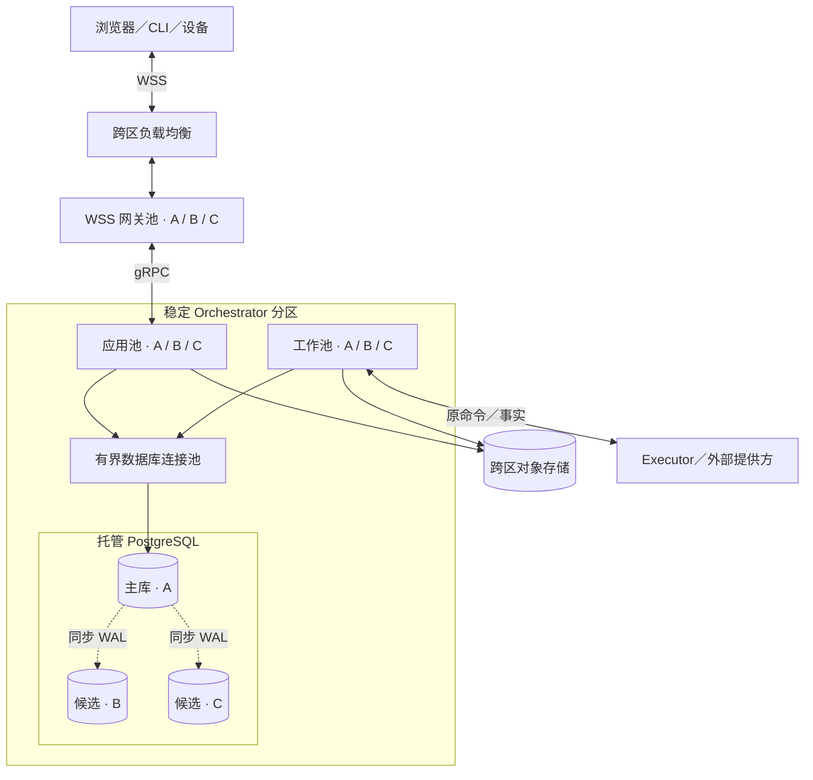
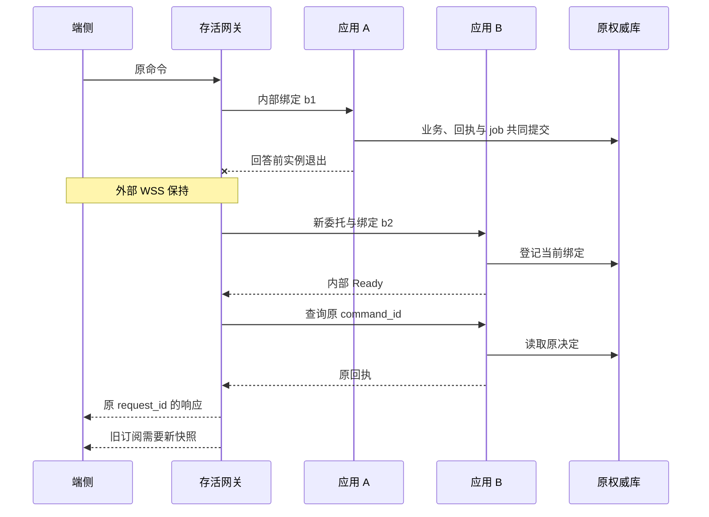
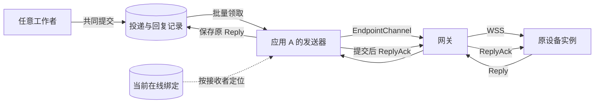
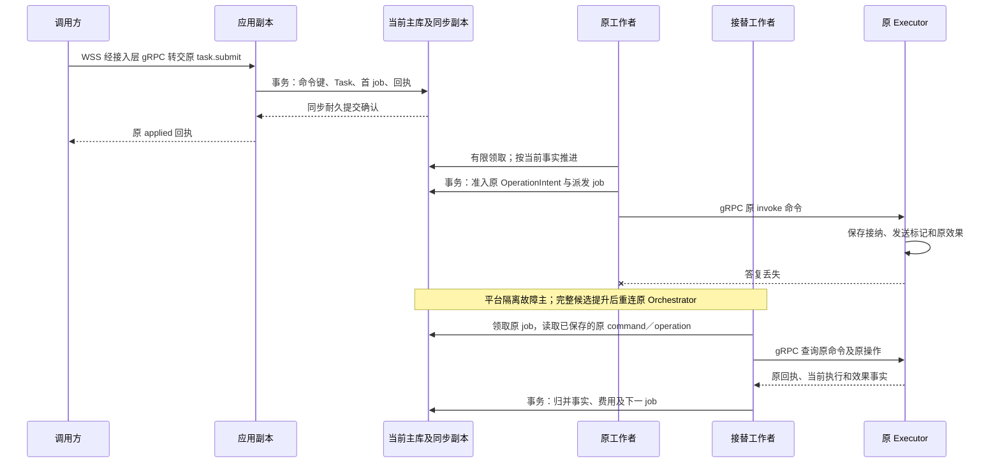
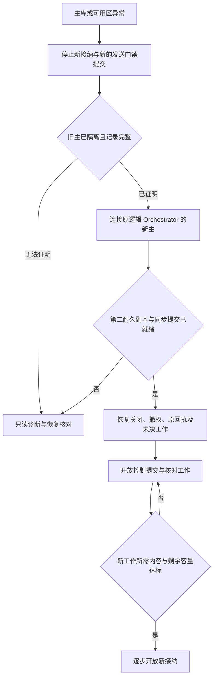

# 生产分布式部署：拓扑、故障边界与容量

[装配与容量](deployment.md) · [存储与中间件](storage-and-middleware.md) · [模块详设](README.md#detailed-design) · [运行验收](validation/README.md)

本方案以生产分布式部署为主线：单地域跨三个可用区，独立连接接入、Orchestrator 应用和工作池，多个稳定分区分别保存权威记录。单体只用于开发调试，同一提交域的短事务在生产继续成立。用户已确认托管优先且不绑定厂商，单可用区故障下已确认账本 RPO=0、控制与查询恢复目标≤60秒；整地域采用异地灾备。上述是设计与验收目标，尚无运行达标证据。

启用它之前，基础平台须提供旧数据库主隔离、同步复制及安全提升、跨可用区内容持久化、可信身份和密钥恢复。缺少旧主隔离或完整记录证明时，该分区关闭新接纳及新的发送门禁提交，只开放可证明安全的诊断与恢复；这不撤回已跨过门禁或已发出的请求，其效果与费用继续按原身份核对。不能凭“部署了多个副本”宣称高可用。完全本地与端云混合仍按[三种装配](deployment.md#2-三种必须验证的装配)工作。

## 1. 软件模块怎样装进生产进程

模块形状指对外入口、内部应用与领域组件、持久接口及外部适配器之间的依赖方向。进程形状则决定故障、资源和发布边界；一个模块可以有多个工作进程，一个进程也可以装配多个模块。默认保留共享事务有价值的领域，将耗时工作放到可限流的进程池。

| 部署角色 | 装入的现有职责 | 保存的权威事实与扩展单位 |
| --- | --- | --- |
| Go 连接接入进程 | WSS 握手与逐消息认证、帧限额、按逻辑服务转发 gRPC、推送与慢端控制 | 连接可丢；原命令、Delivery 和 Reply 恢复记录在负责分区。按连接、在途消息、带宽与握手容量增加副本 |
| Orchestrator 应用进程 | Task、计划准入、协作映射、Input／Surface、默认同分区 Grant 和 Confirmation 的业务入口 | 按对应 repository 保存事实；同一事务句柄协调需共同提交的记录。按请求吞吐增加副本 |
| 工作进程池 | jobs 领取，Brain 单轮、Memory 索引／提取、远端派发、效果／费用核对、关闭传播 | 处理责任仍在所属权威库；按工作类型、提供方及租户配额分池。增加工作者不会增加数据库写容量 |
| 执行适配进程／设备宿主 | Executor、资源 owner、具体驱动及单设备门禁 | Operation、发送标记和效果事实归原 Executor；按互不冲突的资源增加实例，不能复制同一设备控制权 |
| 管理与隔离评测进程 | Extensions、Evaluation 入口及受限实验执行器 | 安装与批准账本按 owner 保存；实验环境、CPU 和内容配额独立于用户任务。管理入口可共宿主，实验执行单独隔离 |

连接、应用与工作角色可以来自同一 Go 发行包，但从首个生产版本起以独立进程池运行，分别发布、限流和伸缩。CPU 密集或不可信组件另按资源及信任边界隔离；不因文档有九个模块就创建九套数据库、队列和服务发现。每个在线池跨三个可用区均布，副本数按损失一个区后的容量确定；每区一个副本仅是放置下限。

内核应用组件只调用本域 repository 和声明的外部 port；同库协调由宿主显式传入事务，跨库调用必须回到原命令／回执协议。管理程序和插件不直接写 Task、Grant 或效果表。组件代码的依赖图及对象流转分别在[九模块索引](README.md#design-coverage)中查阅。

## 2. 拓扑、路由及数据放置

下图表示一个 Orchestrator 分区的运行拓扑。接入、应用和工作池均跨 A／B／C 三个可用区分布；数据库只有一个当前主。实线为请求或存储访问，虚线为 WAL 复制；它不表示每个软件模块独占一个进程。

其他分区采用同样的放置方式，外部依赖可以共享但配额独立。云内 Executor 调用走 gRPC，端侧 Executor 通过接入层的 WSS Delivery，提供方沿原生协议；图中最下方连线概括这些外部 port。数据库连接池须多副本或具备托管冗余，不能成为新单点。负载均衡、数据库、对象存储、身份和密钥平台分别验证跨区故障边界，具体选择见[中间件取舍](storage-and-middleware.md#middleware-decisions)。

### 2.1 稳定映射与扩容

租户默认绑定一个 Orchestrator 分区。受信装配及发现先提供逻辑 Orchestrator 地址，调用方再固定 task.submit 的 orchestrator_id、目标与 command_id；请求一旦定稿，重试不得因负载均衡改写 Orchestrator。接入层只把稳定逻辑地址解析到当前健康应用副本。任务创建时 task_id→orchestrator_id 映射与 Task 同事务保存；跨 Orchestrator 目录是可重建的汇总，不能成为任务接纳的第二权威。

解析分为 `orchestrator_id／owner_id → 存储分区` 与 `原逻辑服务 → 健康进程`，受信配置保存版本和原映射。路由缓存丢失时从该依据重建，无法确定就拒绝路由；缓存 miss 不表示新任务。热点租户先按[跨分区配额](#quota-scope)分配有限份额，再开放额外 Orchestrator 承接新任务。任务不会因负载均衡改变 Orchestrator；整个存储分区可以按[维护搬迁程序](storage-and-middleware.md#data-placement)更换物理位置，先隔离旧写者并核对完整切点，原逻辑身份和关闭记录保持。

Grant、Memory、内容和资源的 owner 独立于 Orchestrator。默认使同租户的高频权威落在同分区，以减少网络交接；拆出 owner 后保留原 ID、查询及恢复端口，跨分区事务使用现有协议。父子任务优先同 Orchestrator；跨 Orchestrator 的预算预留与 receiver 关闭按[协作规则](collaboration/implementation.md#production)执行，不能以分布式事务隐藏中间状态。

### 2.2 长连接接入、路由与恢复

每条 WSS 固定一个逻辑服务，负载均衡只在握手时选择网关。网关持有外部 connection_id、有限请求关联和订阅状态；应用副本持有当前内部 EndpointChannel。两者生命周期分开：应用发布、内部 HTTP/2 连接故障或委托令牌轮换，先恢复内部绑定；网关本身退出、原身份失效或恢复超过上限，才结束外连接。网关内存可以丢失，业务回执、Delivery、Reply 和后续工作仍在原 owner。

图中查询在原请求处理期限内完成才能直接回答原 request_id；超过期限后返回可恢复错误，客户端另查原命令，不让迟到回复形成第二个响应。内部 Ready 只完成绑定，不能重复成为外部首帧。旧绑定输出被网关丢弃，旧实例已经进入领域处理的请求仍可能提交；原业务去重继续成立，绑定更换不提供撤销保证。精确字段、Reply 重交、限额和错误归[内部重绑契约](contracts/grpc.md)。

### 2.2.1 在线记录的归属与实例失效

下列为内部存储记录，不增加公开领域对象。身份分区与业务分区可以相同；不同库时分别提交，先占外连接额度、再建内部绑定，全部成功后才向端发首个 Ready。后一步失败沿原 connection_id 条件释放额度，进程崩溃由租约回收，不采用跨库事务。

| 记录 | 保存者与最小关联 | 创建、恢复与失效 |
| --- | --- | --- |
| 外连接额度记录 | 原身份权威分区；identity、logical_service_id、connection_id、gateway_instance | 身份行锁下检查服务内及身份总额，插入唯一连接记录；内部重绑不重复占额。关闭按原网关实例及连接条件释放 |
| 进程租约 | 各相关分区；随机 boot instance、角色、expires_at | 网关在它使用的身份分区续约，应用在负责业务分区续约；进程重启使用新 instance。过期 instance 永久失效；重新开放须取得新的随机实例身份，先关闭原连接／流，不能复活旧记录 |
| online_bindings | 原逻辑服务分区；connection_id、binding_id、binding_revision、gateway_instance、application_instance、已认证 recipient | 内部 Ready 前登记；同连接只接纳更高 binding_revision；同代次仅同 binding_id 幂等，旧流只能删除自己的 binding。只有当前存活应用绑定可以领取在线投递；外连接仍有效时保留已见最高绑定代次 |
| 待发送记录 | 原领域 owner；recipient、原 delivery／ticket、due_at、工作类别及核对状态 | 随原业务提交；绑定消失只影响本次发送位置，不删除原记录或变更接收实例 |

网关和应用租约初始按每 5 秒续期、15 秒失效试验；同一进程在一个分区只续一行，不能每次客户端心跳都更新每条连接。续期以数据库实际裁决时刻为准，本地停止点从请求发起时计算，按 [ClockAdapter](deployment.md#clock-adapter) 扣除数据库间时差、经过时间误差及入口余量。主机／VM 暂停必须计入经过时间，或由平台在恢复业务线程前封闭旧资格；单靠后台续约线程或可能随睡眠停止的 Go 单调时钟不成立。迟到续约不能复活旧 boot，主库换钟证据不足时先停止租约续约与回收。网关失去资格关闭受影响外连接；应用失去资格停止转发并结束内部流，网关另行重绑。

服务内绑定替换由同一存活网关串行发起，每个候选固定新随机 binding_id 和递增 binding_revision；原候选的登记重试仅在同一内部流和相同网关／应用实例身份下保持两者；更换内部流或应用实例即分配新候选、新 binding_id 及更高代次。登记事务只接受比当前记录更高的代次，同代次仅同 binding_id、网关／应用实例及原字段幂等，较低代次拒绝。这样 b3 先提交后，迟到 b2 无法覆盖它；查询当前值不能用于改写旧候选的代次。网关核验候选 Ready 后原子切换当前流并丢弃旧输出；旧绑定的条件清理不能删除新绑定；应用租约失效只撤去可发送路由，在外连接额度结束前仍保留该 connection_id 的最高绑定代次，避免删除行后接受迟到旧候选。新登记还核对原网关和外连接额度当前有效。binding_revision 只作用于这条存活 socket 的内部路由，不是跨网关连接序号或领域执行权。网关实例不跨故障接管另一个实例的 socket；新网关创建新 connection_id，客户端沿原业务身份恢复。外连接额度回收最多等待原租约窗口，加上故障检测与重连耗时，不宣称立即回收。

身份总额度由原身份分区裁决，跨 Orchestrator 连接不能各自复制一份总额。该分区不可达时不建立新连接，现有业务也必须满足当前认证检查；不能用连接租约代替原会话、凭据代次或 Grant。身份与数据库的分区和缓存边界见[存储放置](storage-and-middleware.md#data-placement)。

### 2.2.2 工作者怎样找到另一实例的连接

图表示原 owner 分区内的投递链。应用 A 的发送器按自身当前绑定集合与待发送 recipient 索引做有界关联扫描，先控制后普通工作；工作者 B 只提交待发送责任，无须持有 A 的内存地址。接收方若是独立服务，原命令先经 gRPC 由该服务接纳后再由其分区投递，不跨库直接读取在线表。发送器的工作领取有期限与代次，网络写入在事务外；流写成功只更新尝试和下次核对时间，只有原 Reply 的持久接收事实能结束相应交付责任。MirrorTicket 另按原 Mirror 状态核对。

同一 recipient 多条连接可能看见同一 Delivery，仍沿 delivery_id／command_id 去重。发送器失效或绑定重建后重新扫描当前到期项，允许有界重复；同绑定一次在途项计入协商的 max_pending_deliveries，重试也消耗带宽和发送配额。过期动作不得重新启动；当前控制、认证和披露资格在每次发送前检查，关闭与核对消息继续按其自身恢复语义处理。

每个分区／应用进程只有有限扫描器，按 recipient 哈希桶、工作类别、due_at 和批量上限轮转；禁止每条 WSS 启动一个数据库轮询器。无积压时抖动退避，初始最长补扫间隔 1 秒，活跃时批量推进但仍受 DB／租户预算限制。可丢通知只提示某桶有变化，丢失或重连由补扫覆盖；发通知失败不能回滚已提交业务。索引、唤醒和队列的选择集中在[持久工作](storage-and-middleware.md#durable-work)。

### 2.2.3 订阅恢复、流控与轮换

领域变化同事务保存待发布提示。分区内的提示发布器分批领取未发布项，在短事务中锁定该逻辑服务的提示头，追加有序提示、推进水位并标记原项已发布。它不在业务事务中全局排队，也不按数据库序列号的最大值跳过尚未提交的项；同一对象迟到的低修订提示可被忽略，不能修改当前业务事实。所有应用副本读取同一有界提示窗口，游标绑定主体、逻辑服务、过滤条件和窗口代次。

提示窗口初始按 24 小时及分区最大字节数中先到者保留，只有已经发布的待发布项才可清理。窗口丢失、提前回收或发布积压无法满足实时恢复时，显式报告缺口并由当前快照恢复，不能假装游标连续。首次订阅先建立水位后的有界缓冲，再读取快照；外连接重建时有效游标可继续，内部重绑的基线保守要求旧订阅重新建快照。网关保留最多协商数量的过滤集合与订阅关联，精确状态按[订阅契约](contracts/transport.md#6-变化订阅快照与错误)。这种选择减少跨实例订阅状态迁移，代价是发布和委托轮换产生快照流量，必须计入容量。

普通请求处理初始总期限 5 秒；内部重绑期间可恢复请求仅在这个期限内有限等待，超时按原身份查询。保持外部心跳不代表业务可用；恢复连续失败最多 60 秒即关闭 WSS，随后客户端全抖动指数退避，上限从 1 秒增长至 30 秒。30 分钟内部委托更新提前分散到期点并重新核验原身份，不能延长原凭据期限。字段与互斥状态在 gRPC／WSS 文档集中定义。

Go 读循环、写循环、应用处理池和排队字节分别限额。20 万连接各排满 4 MiB 约需 781.25 GiB，因此还必须限制每进程、租户和分区总额；不能按单连接保护值预留无限内存。普通业务不得占控制份额，已进入 TCP 的字节却不能被后来的取消越过，写阻塞超过截止则断开慢端。请求 ID 关联按每连接请求总数上限收束，到限有界排空并轮换，不长期积累无界去重集合。

内存预算还包含已用 request_id 的去重登记、在途关联、TLS／HTTP/2 状态及订阅过滤集合。20 万连接都用尽 10000 个请求名额时有 20 亿条 ID 登记，不能只测空闲 socket；按实际驻留分布和单项实测大小定预算，必要时在建链前声明较低限额，并同时测更频繁重连的代价。

一个 EndpointChannel 对应一个外部 WSS，HTTP/2 连接池依协商并发流上限、实测内存及故障影响面配置，不能把全部流塞到一条连接。限制每物理连接及每应用实例承载的流数，滚动换绑分批执行；模型／内容和控制 RPC 使用独立预算。进程租约、心跳与流控都不确认业务成功。

生产默认从平台持续发现实际应用实例地址，短 Call 显式 round_robin，EndpointChannel 按后端有限流槽选址；ClientConn 长期复用且两类流量分连接组。扩容先增加新流候选，已有长流仅在正常轮换或有界排空中重绑，不把一个 L4 VIP 或新增副本当作已经均衡。发现失效、流满、候选次数和池总量的完整规则归[gRPC 连接分配](contracts/grpc.md#backend-pools)。

### 2.3 各类数据的读取边界

| 数据 | 放置与读取路径 | 扩容／缓存边界 |
| --- | --- | --- |
| Task、命令回执、jobs、预算、Grant／Confirmation、激活与关闭索引 | 对应分区当前主库；业务状态与恢复义务一起提交 | 同对象条件判断不得读取落后副本；同命令缓存返回前仍核对当前披露资格 |
| 不可变 ContentRef 正文与制品 | 符合约定的跨区对象存储；摘要验证后引用进事务 | 可缓存字节，但使用资格、copy 和关闭修订仍从权威核验。镜像路径保留[在线读取限制](memory/implementation.md#52-无入站设备的受控反向交付) |
| Memory 搜索索引、任务汇总、统计 | 由持久工作更新的派生数据，保存追赶位置 | 可独立扩容或重建；落后时补扫、显示缺口或降级，不能用索引快照批准动作 |
| 报告／运维聚合 | 从已脱敏并获准的记录异步生成 | 可使用只读副本；不能将副本上的“无记录”解释为原命令从未处理 |
| Delivery、输入转交与控制传播 | 负责端业务库内持久发送记录，连接层只搬运 | 外部队列只提示原记录待处理，丢通知靠扫描恢复，不保存另一份业务真值 |

## 3. 一次跨进程推进的数据与提交边界

下面聚焦数据库切换发生在已接纳之后的场景。方框中的“事务”均只包含同分区读写；外部调用在事务之外。备用工作者接替的是原工作记录，Orchestrator 和 Operation 身份都不变。

若连接在事务提交后断开，应用将其视为结果未知，按原命令查询；客户端是否看见成功，不决定事务是否提交。若领取过期但旧进程仍活着，lease_epoch 条件写阻止旧进程更新账本，却不能撤回已发出的网络字节。接替者先查原发送／操作记录；非幂等外部效果不得仅凭租约过期再次发出。可安全重投的请求仍使用原身份，设备 owner 的实际启动门禁继续成立，细节见[执行实现](execution/implementation.md#key-sequence)。

## 4. 可用性、数据库切换与恢复顺序

推荐在三个可用区放置主库和两个同步候选，业务提交配置等待至少一个异区候选将 WAL 持久化。对应 PostgreSQL 18 的配置语义是 `synchronous_commit=on` 与 `ANY 1 (standby_b, standby_c)`；其耐久性依赖实际复制和存储，同步等待会增加提交延迟。`remote_write` 尚未保证备用机落盘，本配置不以它返回耐久接纳。技术语义见[同步复制](https://www.postgresql.org/docs/18/warm-standby.html#SYNCHRONOUS-REPLICATION)及[复制参数](https://www.postgresql.org/docs/18/runtime-config-replication.html)。

这是“单一可用区失效时保留已确认业务记录”的推荐配置，不是跨任意故障零丢失承诺。数据库平台须在提升前隔离旧主，比较同一历史上的可用候选，确保选中的候选包含全部已确认提交；提升后仍有第二个耐久副本才重新开放此级别写入。平台无法证明这些条件时停止恢复写入，不自动降为异步提交。进程 readiness 只依据平台给出的当前主资格及本应用恢复状态，不自行选主。

下图建模一个 Orchestrator 分区的恢复入口状态，箭头是平台证明或本应用恢复检查完成后的推进；不是 Task 的状态图。

### 4.1 失败由谁处理

| 故障 | 仍可提供的行为 | 停止／恢复责任与可观察依据 |
| --- | --- | --- |
| 连接接入副本退出 | 只有该副本的 WSS 重连，其他连接和已接纳工作继续 | 新 connection_id，原命令查询、Reply 重交与订阅恢复；旧外连接槽条件释放或租约回收 |
| 内部流或应用副本失效 | 网关保持 WSS，短期请求可能失败，改绑原服务健康副本 | 新 binding_id，旧输出隔离；未知命令查询，订阅明确缺口。超过恢复上限才关闭外连接 |
| 单应用或工作进程退出 | 其他副本处理不冲突请求；已有回执可查询 | 新工作者读取原 job。ready 只表示本实例可处理，不能冒充原外部操作已恢复 |
| 整个可用区失效 | 在平台完成选主且剩余容量足够后恢复原 Orchestrator | 数据库平台隔离旧主；应用先控制／核对后新工作。记录故障检测、选主、账本恢复、开放四段耗时 |
| 同步副本全部不可达 | 已有受限诊断可读；当前事务可能等待或结果未知 | 不以降低耐久级别解除排队；超时查询原命令。复制恢复前新业务不返回成功 |
| 另一 Orchestrator、Grant owner 或设备不可达 | 不依赖它的任务继续；已获准有限工作按原窗口收尾 | 依赖步骤进入等待；预算保持预留，不能创建替身或扩大离线权限 |
| 对象存储读取不可用 | 纯元数据管理及不依赖该正文的工作继续 | 需要正文的决策／完成验证等待；哈希存在不能代替正文取得 |
| 对象存储写入或磁盘空间不足 | 原回执、控制及收尾优先 | 上传／新正文工作拒绝或等待；根据[存储保护](deployment.md#9-存储保护关闭索引与备份)保留耐久关闭能力 |
| 通知监听断开／可选加速层停机 | 权威查询和有界数据库扫描继续，调度可能变慢 | 先恢复监听再补扫；退化负载受预算限制，超额请求显式拒绝。索引不可用按有界检索降级 |
| 身份权威或网关租约不可核验 | 已提交责任继续保存；无法证明当前资格的新请求和披露停止 | 不把连接存活当身份有效；只隔离依赖该权威的范围，不能全局重建空身份库 |
| 全地域故障或恢复缺历史 | 只读灾备诊断、明确当前缺口 | 运维隔离原地域并补齐后续记录；不自动激活旧备份中的任务、许可或设备凭据 |

跨地域默认保留加密备份及连续历史，用于灾备，不启用同一 Orchestrator 的双地域可写。若业务要求整地域失效仍自动写入，需要重新选择能证明唯一写权和记录完整性的跨地域持久方案，测量长距离提交代价；这不是增加应用副本即可获得的能力。

### 4.2 可用性与时延验收口径

以下为生产首轮试验目标，尚未承诺服务 SLA。用一个月窗口及固定租户／负载范围评估。接口调用可用性与命令业务接纳分别计量：前者回答调用方是否及时取得确定结果，后者回答原命令是否形成唯一持久责任。合法但因系统过载、依赖故障或内部错误而无法完成的调用计入不可用，预先约定的用户权限／额度拒绝单列。

| 计量对象 | 样本身份与截止 | 迟到、重试及恢复如何记录 |
| --- | --- | --- |
| 接口调用可用性／延迟 | 每次调用方发起的 command、query、receipt_lookup 各是一项；WSS 用 connection_id＋request_id 关联，独立短 Call 用调用方观测关联。自发起至收到合法且确定的结果，初始截止最多 5 秒或调用方更早截止 | 内部透明重试／重绑查询不新增外部样本；外部重连重新调用是新样本。超时、断连或结果未知记失败，稍后查询成功不能改写它；超时比例与成功延迟分布同时报告 |
| 命令业务接纳 | 按原服务、租户、command_id 去重，保存首次调用时间、原首次接纳期限及权威接纳事实 | 同命令重投不增加接纳样本；期限内已提交但回复丢失可恢复为“已接纳、接口超时”。迟到查询只补充账本事实，不修改接口结果；超出首次接纳期限不得新接纳 |
| 原回执与普通查询 | 每次 query、每次 receipt_lookup 独立按调用计量 | 查询不创造 command_id；不能按被查任务或被查 command_id 合并多次调用，也不能把查询成功算作新的命令接纳 |
| 失败时段 | 固定采样周期，分别探测原 Orchestrator 的接纳、控制和权威查询；验收初始每 5 秒一次，使用隔离验收租户及合法固定工作流 | 连续失败样本报告起止及采样误差；缺失探测记未观测，不补成成功。请求成功比例不能掩盖无流量期间故障或被成功重试稀释的失败时段 |

客户端 SDK／验收器保存起止与截止，网关和调用适配器关联到各自观测记录；这些是遥测关联，不新增领域身份或传输必填字段。网关收到请求后的现有 5 秒处理上限保持不变，不能延长调用方已设的更早截止；内部 RPC 尝试数另计，不混入外部调用分母。命令接纳结果、接口成功率和失败时段分别呈现，不合成一个“最终成功率”。例如 command 首次调用超时，10 秒后 receipt_lookup 返回原 applied：前者仍是一次接口失败，后者是一次查询成功，业务接纳只有一项。

| 指标 | 初始目标／测量方式 | 不包含的保证 |
| --- | --- | --- |
| Orchestrator 接纳、控制提交及权威查询接口可用性 | 按上述调用口径各自 ≥99.9%，分别统计请求及失败时段；命令唯一接纳另报 | 不等同于账本最终可查、模型质量、任务最终成功率或设备在线率 |
| 同地域接纳／控制提交延迟 | 延续部署基线 p95≤300ms；另观察 p99≤1s；含当前复制等待及本方依赖 | 不含长模型运行、外部效果与离线设备控制确认 |
| 单可用区故障恢复 | 原 Orchestrator 恢复控制／查询的 RTO 目标≤60s；新工作开放另计 | 条件不足时以停止写入保完整性，不能为了数字跳过旧主隔离 |
| 已确认账本持久性 | 在该单可用区故障模型下 RPO=0；核对原命令、控制、用量和关闭记录 | 不覆盖多区永久损坏、软件错误及缺失的外部效果记录 |
| 内容及外部动作恢复 | 内容逐摘要核对；每个未知操作记录年龄和责任方 | 不能用数据库 RPO=0 宣称外部系统恰好执行一次 |
| 可运行工作等待 | 控制／核对 job 的领取等待 p99≤2s，普通推进 p95≤5s，按工作类别分别报告 | 不包含明确等待用户、设备、预算或提供方的时间；平台无法调度不能伪装成业务等待 |
| 在线控制到达与内部恢复 | 当前在线且健康入口的控制传播 p99≤5s；单应用故障内部重绑 p99≤5s，WSS 保持比例另计 | 控制到达不等于外部动作已停；数据库／身份依赖故障按其单独 RTO 统计，不能从可用性分母删除 |

内部重绑和等待目标使用固定工作负载分别验收，完整请求仍受原 5 秒处理期限限制，恢复不能延长已发请求的截止。除了上述百分位，还报告超时比例、最大未决责任年龄、发布每分钟断开的连接数及每次重绑触发的快照数；已接纳任务长期不推进不能被良好的接纳成功率掩盖。

### 4.3 实例启动与重启怎样局部恢复

新进程先核验精确版本、配置、当前批准和兼容格式，再取得本角色的数据库／身份资格；恢复有界扫描位置、控制队列和未决责任入口后开放 readiness。它不在启动时逐条扫描全部历史 Task，也不等待所有未知效果结清才开放不相关租户。活动索引、due_at 和责任类别决定后续分批恢复；缺少某项安全前提时只封闭受影响入口。

网关重启产生新的进程实例和外连接；应用重启只接替当前业务分区和内部流；工作者重启按原 job 租约／代次恢复。已发模型或工具请求不能因本机上下文消失而重做，其计费、效果和关闭核对先于新目标推进。实际设备发送入口须取得原本机排他锁并核对旧动作；不能确认旧入口已隔离时停止自动接管，详见[执行实例边界](execution/implementation.md#production)。

liveness 只检查进程自身失活，启动恢复使用 startup／readiness 门禁；不把数据库暂时不可达配置成所有进程同时重启。外部依赖的超时关闭相应准入、限制重试并保留诊断，依赖恢复后逐步开放工作槽。数据库切换后连接池丢弃旧连接，原事务结果未知按原命令查回，禁止将所有业务请求直接重放。

## 5. 性能预算、扩展单位与过载

容量基线仍采用每日 500 万任务、高峰约 290 个任务／秒、每任务 4 次模型调用及平均占用 8 秒的假设。稳态模型在途量约为 `290 × 4 × 8 = 9,280`；该估算使用平均时间，不能用 p95 代替平均值，也不能反推出提供方已有这份配额。[原始假设](deployment.md#capacity)与以下分解共同作为压测输入。

| 资源 | 负载公式与必须实测的分项 | 增加容量的动作与限制 |
| --- | --- | --- |
| 数据库提交 | `任务到达率 × 每任务全部提交次数 + 后台提交率`；20 次／任务仅为原始假设，须实测领取、续租、Grant、回执、控制及清理是否已计入 | 优先缩短事务和批量领取，再增加 Orchestrator 分区；增加工作进程不能消除热行争用 |
| 模型／工具并发 | 到达率乘平均占用时长，分别按提供方和能力统计；未知账单仍占费用预留 | CPU、网络并发和费用上限分开配置；只在供应商配额及用户预算允许时增加池 |
| 数据库连接 | 全部实例的连接池上限之和，加管理与恢复保留连接 | 每进程小池、事务外等待外部调用；扩实例前先验证连接总额，不随副本数无限扩池 |
| 设备连接及重连 | 按[用户到连接的换算](deployment.md#capacity)，10 万在线用户、每人 2 个活跃会话、每会话平均 1 条服务连接，得到 20 万 WSS；30 秒心跳约 6,667 组／秒，60 秒全量恢复平均约 3,333 次握手／秒 | 按 TLS／流内存、握手和推送带宽扩接入层；另测 1／2／4 倍连接倍率、单区失效和实际峰值，不将用户数直接当连接数 |
| 内部连接与建流 | 按调用进程实际触达的后端数 B、每后端池成员 K、单成员流槽 S 计算；另计短 Call 连接组、重绑候选和旧连接排空的重叠 | 同时满足客户端池上限、HTTP/2 实际流上限、服务端全局流上限及故障剩余容量；发现新增副本后测新流分布，不从 ClientConn 数推断物理容量 |
| 活跃任务与恢复责任 | 平均任务驻留 300 秒时，峰值稳态约 `290×300=87,000` 个活跃任务；每类 job 数、等待时长和未知操作分别测 | 等待任务保留持久记录而不独占 goroutine／DB 连接；续租开销按实际工作者与活跃执行数计入，不能仅用模型在途量估计 |
| 通知与快照 | 原假设每 10 秒每在线用户一次变化为 10,000 个提示／秒；先按实际订阅扇出，再计每提示权限核验及回查。20 万连接每 30 分钟内部轮换约 111 次／秒 | 若每连接 2 个订阅、每次快照 3 页，仅均匀轮换就约 667 次额外分页请求／秒；发布更集中。字段过滤／合并和分批轮换有用，不能静默延长权限缓存 |
| 大内容 | 原假设每日约 0.95 TiB；保存 30 天约 28.6 TiB 原始正文，另计副本、快照和派生物 | 字节走内容入口；每租户限制在途字节和并发，关闭清理留专用带宽与空间 |
| 持久恢复与关闭索引 | 到期 jobs、未知操作年龄、控制目标数、关闭索引增长及 WAL 生成率 | 用有限索引页扫描、分批传播及容量保护；保留索引不按普通日志 TTL 回收 |
| 跨库内容核验 | 活跃持有关系数／核对间隔，加实际新使用触发的 control／权限查询；分别计 RPC、主库读取及清理回报 | 默认共提交域降低远端查询；分库核对按 owner 合并调度、有界并发，不假定现有单 copy 查询已提供批量线接口，不以延长 allowed 缓存消除成本 |

### 5.1 数据库与热键

jobs 按所属分区、工作种类、可运行状态和 due_at 建领取索引，每批限制行数及扫描耗时；待执行与历史终态分开索引，保留原唯一键。工作领取可用 `FOR UPDATE SKIP LOCKED`，但该方式不是一致业务读取：取得 job 后仍在短事务中锁实际 Task、预算或领域对象，按条件修订裁决。[PostgreSQL SELECT](https://www.postgresql.org/docs/18/sql-select.html#SQL-FOR-UPDATE-SHARE)

Task 更新按 task_id 串行；预算按任务及单位、一次许可按 grant_id／use_id、设备按 resource_id、内容控制按准确引用与 copy 串行。不得通过把同一对象的不同写入发到不同库来“解决”热键。控制树或持有者列表较大时，在原事务固定控制决定及待传播范围，以有界 jobs 逐批处理；对外分别给出已提交控制与尚未确认目标，保留原强度。

只读副本用于统计和可滞后的管理投影，不能承担新行动的权限、控制或原命令不存在判断。用户可见的当前状态查询默认读主；只有明确标注投影滞后的视图才能读副本。连接池每次事务设置并核验租户上下文，任务结束归还连接前清除；RLS 受限数据库角色作为额外隔离，不能让后台工作借管理员角色绕过租户。[PostgreSQL 行安全](https://www.postgresql.org/docs/18/ddl-rowsecurity.html)

### 5.2 在故障剩余容量下定副本数

对工作者、接入层和存储分别测得容量，不用一张 CPU 图决定全部扩容。若负载为 L，单副本在目标延迟下实测容量为 C，正常利用率上限为 U，需要承受损失的副本比例为 f，则初始估算为 `N ≥ ceil(L / (C × U × (1-f)))`。三可用区均布可取 f=1/3 做试验；数据库提升后的写容量和提供方配额另算，不可套用这一无状态池公式。

扩容信号同时看最老可运行 job 的等待时间、到达／完成速率、数据库锁等待、连接池等待、外部限流和内存。只因队列变长就增工作者，可能进一步压垮数据库或提供方。若瓶颈是外部限流，限制新准入并延后原工作；若是数据库热行，降低同键并发；若是 CPU，增加相应隔离池。每次调节有上限和冷却期，避免反复扩缩。

实例数还须限制故障影响面：单网关承载连接过多，即使 CPU 很低，退出时也会产生过大的握手峰值。规划分别提交稳态、峰值、损失一个可用区、积压恢复四张资源预算。恢复积压量为 B、恢复期间持续到达率为 λ、故障剩余可兑现处理率为 μ 时，只有 μ>λ 才能在约 `B/(μ−λ)` 时间清空；例如 60 秒积累 17,400 个任务，恢复后只比原 290/s 多处理 145/s，仍需约 120 秒排空，且下游模型／数据库须有相同比例余量。控制与收尾使用自己的保留池，不能等普通积压清空。

### 5.3 跨分区总配额的归属

生产初期采用受信配置的保守分区份额，避免在每次调用前新增全局协调服务。对每个用户／租户、提供方及配额维度，配置固定的计数 owner 分区、份额和生效版本；同一总额下全部份额之和不得超过总额。用户费用、接纳速率、本地执行槽及提供方容量分别计量，不能互相抵扣；速率份额须使用同一计量窗口，限流突发量也拆份。任务内的 allocation 仍只处理父子预算，不能代替独立任务之间的用户总额限制。

份额保存在实际裁决接纳或调用的 owner 配置中，占用和释放由该 owner 的权威库事务保存；同分区所有副本共享计数，新增进程不获得新份额。受信管理端串行发布同一总额的分配版本，owner 耐久保存已接受版本并拒绝旧配置重放。Brain 费用／调用计数属于原 Decision owner，委派创建属于父 Orchestrator，Executor 的执行槽属于原执行 owner；共同的提供方上限须覆盖所有会实际调用它的 owner，包括隔离评测。尚未分配份额的 owner 不开放相应新工作；本地配额事务与所属工作共同提交，跨 owner 的已有权限和预算仍经原协议核验。

扩容先从未分配余额中划出份额。若需转移已分配份额，先在原 owner 耐久降低上限并确认释放量，再增加新 owner；旧 owner 失联时不能把其份额再次分配。费用的未结预留、仍可能占用的本地槽及旧计量窗口的用量一并计入转移约束，配置换版不清零计数。无法证明旧份额已回收时保留它，新分区等待。供应商未知调用仍按上界占费用；没有远端终结查询时，分区计数也不能宣称供应商物理并发的硬上限。

该选择将未用份额留在原分区，热点用户会在系统尚有空闲时排队，运维承担份额调整成本。若这种闲置与调整成为主要瓶颈，再引入固定配额 owner 及明确的预留／结算协议；在具备该协议前，不用异步汇总计数扩大总额。

### 5.4 队列隔离、取消优先与恢复洪峰

在持久 jobs 中划分控制传播、原结果／费用核对、正常推进、索引／清理／评测等工作类别；它们仍共用原记录及去重语义。各类别配置最大并发、每租户份额、最长可排队时间和数据库连接份额，控制与收尾拥有非零专用余量；正常任务不能借较高优先级占用该余量。总工作预算同时受分区与提供方限制，持久 job 数也设上限，不能用磁盘把过载无限延期。

恢复扫描按分区和有限索引游标推进，先处理关闭／撤权，再核对未知结果和账单，最后放开目标推进。每个租户获得有限轮转机会；重连、超时重试和积压恢复加入抖动，并沿原身份执行。已知可被更高修订覆盖的控制可合并到最新待发送快照，但保存原决定及未确认目标；不得合并原 Operation、额度结算或一次确认消费。

队列接近上限时，接纳前明确 overloaded；已经接纳的工作保持可查询及恢复责任。达到存储保护水位后，停止会生成新正文或新责任的工作，保留控制和收尾；连原控制事务也无法提交时返回不可用，不显示取消成功。在线 SLO 的系统过载失败不能从统计分母删除。

## 6. 发布、观测与生产验收

### 6.1 按角色发布和排空

滚动发布先在少量新实例验证精确安装锁、当前批准、数据库可读写格式及恢复自检。新旧实例共存必须有明确的协议、字段和格式兼容范围；当前实例开放仍按[扩展门禁](extensions/implementation.md#production)执行。应用与网关分开发布，先扩大健康余量再排空旧实例，不能把两个池同时整批重启。

| 角色 | 停止新工作与有界排空 | 截止或崩溃后的继续者 |
| --- | --- | --- |
| 网关 | 先摘除新握手并等待 LB 摘除传播；每批处理连接内原请求、Reply 和控制，再分散关闭该批 WSS；剩余连接继续有界服务 | 客户端以新 connection_id 重连，原业务查询恢复；只有关闭且条件匹配的连接才释放额度。进程崩溃由租约回收 |
| Orchestrator 应用 | 停止新 RPC／绑定，既有短请求在期限内结束；现有内部流分批终止，由存活网关重绑，旧绑定条件清理 | 原 owner 的健康副本查回原决定；外连接保持，订阅缺口显式恢复，不等待长流自然结束才发布 |
| 工作者 | 停止领取新 job，短事务完成；尚未发送且可安全交回的工作条件释放，已可能发送的工作保存原核对责任 | 新工作者取得原 job；租约过期不证明旧外部调用终结，不释放未知费用或再次发送不可重复动作 |
| 执行宿主／驱动 | 封闭新实际启动，保留原效果和停止核对；有不可中断动作时阻止自动替换或等明确终结 | 沿原资源实际入口恢复；没有排他与目标事实时维持 unknown，不凭容器 ready 取得设备控制权 |

网关首轮试验将同时排空的连接限制在全池 5% 以内，实际批量还须满足故障剩余容量和握手预算；不在宽限期末统一断开整池。网关／应用初始排空上限分别为 60／30 秒，容器终止宽限初始 120 秒，含负载摘除传播、排空和退出余量；实际 LB、代理和进程管理器要联测。连接寿命、负载均衡空闲超时必须覆盖协商心跳窗口；不能让平台默认超时替代协议。原请求 5 秒期限不会因为排空变长。

使用既有容器平台时，按区分散副本，配置发布并发、健康余量和自主驱逐预算；突发故障由额外容量承受。Kubernetes PDB 约束自主驱逐，不能防止可用区故障，也不能代替 Deployment 的滚动参数；readiness 摘除不迁移旧连接。[中断预算](https://kubernetes.io/docs/concepts/workloads/pods/disruptions/)、[端点终止](https://kubernetes.io/docs/tutorials/services/pods-and-endpoint-termination-flow/)。gRPC 优雅停止也需要有界强制退出，不能无限等待 EndpointChannel。[gRPC 停止机制](https://grpc.io/docs/guides/server-graceful-stop/)

### 6.2 数据格式变更和应用回退

默认采用“先扩展可兼容格式 → 小批回填 → 切换读写 → 观察后收缩”。扩展阶段不删除旧实例必读字段；同一事实只保留一个权威写入规则，避免以双写两库实现兼容。回填以原 migration_id、有限批次和检查点恢复，设锁等待、WAL 和 IO 预算，失败只回退当前批次。约束校验、索引构建及 DDL 的实际锁影响由迁移适配器预演，不能因为使用短事务就宣称无阻塞。

清理旧字段和格式前确认全部旧实例已退出、旧任务／操作可按当前版本核对、回退保留期结束。不可兼容变更按单个分区停止新准入并排空，再执行有批准的维护切换；维护影响计入可用性。应用回退只回到仍支持当前数据格式的发行锁，不回滚 Task、Operation、Grant、关闭索引或外部效果历史；不可逆变更事前声明不能自动回退。

### 6.3 观测与验收

一次请求的跟踪串联 tenant、Orchestrator、command、task、decision、operation、use／allocation 和 content/copy。指标按 Orchestrator、方法、工作类别、提供方及有限租户分组聚合，避免把每个任务ID变成指标标签；精确ID留在获准的结构化记录。正文、令牌和模型材料不进入通用遥测。用量记录和诊断指标分开，采样日志不能作为结算真值。

| 生产实验 | 固定刺激与观测 | 通过所需证据 |
| --- | --- | --- |
| PROD-01 同步提交后单区失效 | 返回 applied 后立即隔离主所在区；在恢复期间重投原命令 | 原记录和关闭依据完整、无重复业务；旧主不能继续写。分段 RTO 和错误比例可复现 |
| PROD-02 工作租约过期但旧进程未死 | 挂起已可能发送的工作者，另一副本领取，再恢复旧进程 | 旧代次不能提交；原外部操作查询及本端门禁决定重试，无第二次非幂等效果 |
| PROD-03 单租户洪峰与提供方限流 | 固定租户造成10倍输入，其模型提供方持续超时 | 其他租户和控制／收尾仍获保留份额；队列、连接和在途字节有界，拒绝计入可用性 |
| PROD-04 全部设备集中重连 | 在原在线规模下断开再恢复，带积压查询和镜像传输 | 退避生效、握手、订阅和积压投递受限；先恢复当前控制，不发送过期动作或撤权缓存 |
| PROD-05 内容及数据库分开故障 | 上传完成但引用未提交时杀进程；或主库可用但内容读取失败 | 孤儿可清理、已引用版本可核查；内容缺口阻止依赖步骤，不虚报结果完整 |
| PROD-06 分区扩容与路由缓存丢失 | 开新 Orchestrator 供新任务，清空路由缓存，重放旧 submit／控制 | 原 orchestrator_id 和 command_id 未改，旧关闭索引仍拒绝重新启动；聚合目录可重建 |
| PROD-07 缺历史灾备与不兼容回退 | 恢复缺少最近撤权和操作的备份，尝试开放；再测旧格式组件 | 缺事实时仅诊断，旧凭据／任务不复活；回退不删除真实效果历史 |
| PROD-08 跨分区配额与失联扩容 | 同用户／提供方在多个 Orchestrator 和 owner 并发；旧 owner 带未结预留失联后尝试增份额 | 已分配份额总和不超上限；未确认回收的份额不转移，新增副本和配置换版不清零占用 |
| PROD-09 慢端与控制竞争 | 填满普通发送额度，接收端停读，同时提交取消／撤权 | 队列和内存不越界，控制获得预留份额；无法发送时断连并保留持久传播责任，不虚报远端已停止 |
| PROD-10 已提交命令断开 gRPC | 原业务提交后终止流／deadline，到健康副本查原命令 | 原回执可恢复、无第二次副作用，RPC 取消不删除已接纳 job |
| PROD-11 业务实例滚动与委托轮换 | 保持网关，关闭应用或内部流，同时保留旧帧并轮换委托 | WSS 与外 connection_id 保持，新绑定隔离旧输出；原回执／Reply 恢复，订阅缺口和快照负载可观测 |
| PROD-12 跨实例投递及通知丢失 | B 产生 Delivery，A 持有连接；丢所有唤醒，再退出 A | 绑定索引批扫交付，换绑仍沿原 delivery；无每连接轮询，无通知也能在预算内继续；旧清理不删新绑定 |
| PROD-13 连接额度及进程暂停 | 用不同 Orchestrator 同时占服务内和总额度；暂停旧网关到租约失效再恢复 | 额度不复制，旧进程不续活／不披露，新连接有界恢复，原业务配额和身份不变 |
| PROD-14 内容分库发布与清理 | 在来源登记、接收门禁和 Memory 提交之间分别中断并关闭来源 | 无未登记依赖；关闭先在本地提交则阻止发布，发布先提交则待核对取得关闭后进入清理责任；原 copy 可核对，已确认云字节不依赖原进程 |
| PROD-15 发布、格式回填和历史增长 | 在生产负载下分批发布、回填后杀进程、回退兼容版，并加载长期关闭索引规模 | 旧命令不复活，回填可续；连接／DB／WAL／控制时延在预算内，回退不删除业务历史 |
| PROD-16 长时间积压后的恢复 | 固定持续到达，注入中断产生已知 B，按故障剩余 μ 恢复 | 记录各类别排空时间与拒绝率，μ≤λ 时明确不收敛；新流量不挤占控制／核对余量 |
| [PROD-17 暂停与时钟界限](validation/fault-experiments.md#lease-clock) | 分别注入主机／VM 暂停、UTC 前后跳、误差证据失效，以及提升主库的边界内／外时差 | 恢复旧队列前资格已校验；旧 boot 不复活、旧 use 不续期；无法证明时差时先封闭续约／回收，未安全关闭旧资格就不复用额度。共库批准也拒绝已到期资格 |
| [PROD-18 发现与内部流容量](validation/fault-experiments.md#grpc-capacity) | 保持原 HTTP/2 扩容应用，再填满一实例、断开 watch、排空另一实例 | 新 Call／新流使用新增容量，已有流不假迁移；候选数、池和等待有界，控制 Call 保留容量，过期发现不继续新拨号 |
| [PROD-19 可用性计数与迟到恢复](validation/fault-experiments.md#availability-counting) | 已提交命令丢答复超过 5 秒，重连后多次查原命令；另令普通 query 首次超时后成功 | 原接口失败保留；查询逐调用、命令只接纳一次，内部重绑不虚增调用；无流量故障和缺失探测不记成功 |
| [PROD-20 工作槽合并竞争](validation/fault-experiments.md#job-merge) | 旧 worker 在途时合并新控制，再分别返回成功、失败与超时 | 新工作责任和原到期不被旧领取的结束／退避覆盖；已发旧命令仍按原身份核对 |
| [PROD-21 Memory 提交水位](validation/fault-experiments.md#memory-watermark) | 变化事务交错提交，前驱分别延迟、回滚与崩溃 | 水位只覆盖已提交变化，回滚不造成永久空洞；索引补扫与视图增量不漏迟交项 |
| [PROD-22 集合订阅恢复](validation/fault-experiments.md#subscription-snapshot) | 未知对象在订阅缺口前创建，随后恢复各类集合订阅并撤权 | 有界快照能发现仍有权读取的对象，分页与变化交接不遗漏；未知 ID 不依赖猜测，撤权对象不披露 |

运行报告必须给出硬件、区间网络延迟、复制配置、实例数、负载分布、输入数据与提供方配额，以及正常、单区失效和积压恢复三组 p50/p95/p99、吞吐、失败率、复制滞后和未决责任年龄。单个平均 TPS 或空闲连接压测不能证明整条任务链达到生产目标。静态文档及图示检查不执行上述实验。
