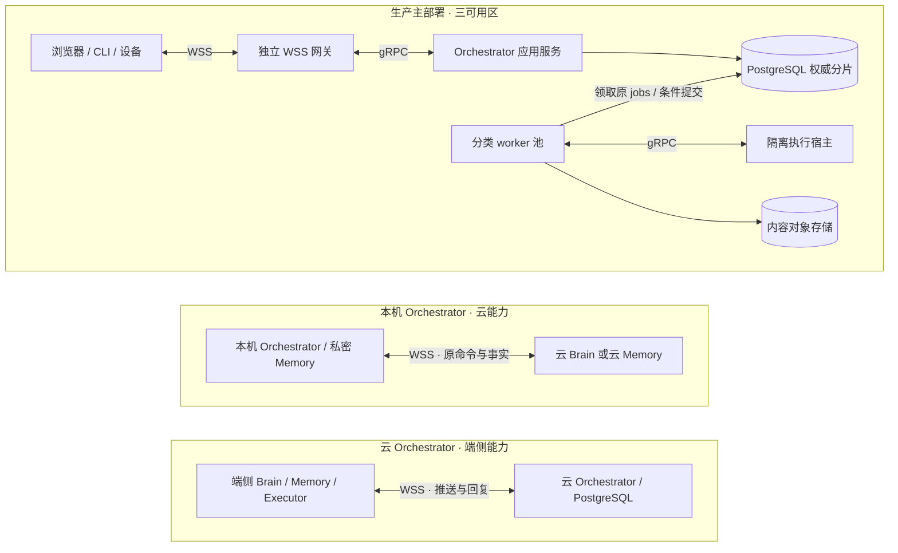
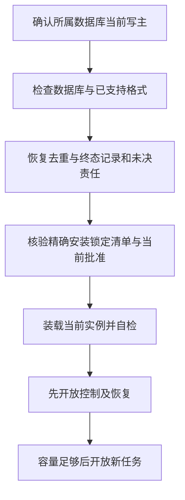

# 技术基线与宿主装配

[总览](README.md) · [生产部署与运行](deployment-production.md) · [存储与中间件](storage-and-middleware.md) · [宿主与扩展](extensions/README.md) · [验收](validation/README.md)

同一个“生成报告并保存到指定目录”任务，可以先在一台开发机上运行，再由云端编排器调用端侧文件能力。装配变化后，原命令仍只创建一个任务，文件动作仍按原操作核对，进程重启后仍从原记录继续。本篇说明宿主怎样提供这些共同前提。

**模块**划分谁负责业务事实，**进程角色**划分部署和资源，**本地事务范围**划分哪些记录可以共同提交。生产默认将 WSS 网关、Orchestrator 应用、分类 worker 池和隔离执行宿主分别伸缩；开发可以把它们装进一个进程。业务事实、原回执与后续责任的共同提交范围不因进程拆分而改变。

本篇先固定技术和装配选择，再定义持久接口、时间依据以及启动恢复顺序。生产接入公司自有平台，本项目提供配置、发现、健康和排空边界；开发先完成单体和本机 PostgreSQL 多进程集成。代码目录与实施切片见[工程方案](engineering.md)，生产故障域和容量见[生产运行](deployment-production.md)，具体存储取舍见[存储与中间件](storage-and-middleware.md)。分片及进程扩容始终保留已接纳任务的原 Orchestrator。

## 1. 选型与替代条件

下列为本方案的默认实现选择，技术依据核查日期为 2026-09-26；安装锁定清单还须固定经过验收的补丁版本和依赖摘要。

| 选择 | 采用原因、代价与替代条件 |
| --- | --- |
| Go 1.27 系列 | 云服务、本地宿主、CLI 和默认组件统一使用 Go，以同一套接口和并发控制代码装配单机与服务进程。维护者承担按 OS／架构构建制品，以及浏览器 SDK 的类型生成与映射成本；需要原生库的组件另固定 cgo 与系统依赖，不承诺所有制品均可静态链接。核查时最新补丁为 1.27.1，安装锁定清单以实际验收版本为准；Go 在两个更新的大版本发布后停止支持原版本，须随受支持版本升级。[Go 发布政策](https://go.dev/doc/devel/release) |
| 同进程 Go interface；服务间 gRPC + Protobuf | 同进程直接调用并共享明确的事务句柄；跨进程服务按[gRPC 绑定](contracts/grpc.md)用 Protobuf 定义 RPC 外壳，内层复用严格 JSON 领域 Schema，生成客户端和服务端接口。部署拆分增加协议适配与兼容性验收成本，不能把需要共同提交的领域步骤拆成 RPC。模型供应商和第三方 API 沿用其原生协议，由适配器转换。[gRPC 服务定义](https://grpc.io/docs/what-is-grpc/core-concepts/) |
| 生产采用托管 PostgreSQL、对象存储与连接池／平台能力 | 单地域三个可用区，基础设施托管优先而不绑定厂商；数据库保存业务事实及 jobs，对象存储保存准确版本字节，连接池控制数据库并发。产品能力、失效行为和验收条件集中在[存储与中间件](storage-and-middleware.md) |
| PG jobs 共同提交，有限批扫与可丢通知配合 | 数据库保存唯一持久责任，批扫负责重新发现到期工作，通知加速唤醒。默认基础设施已提供事务、调度依据和恢复入口，独立 MQ／Redis 只在具体负载或集成收益得到验证后引入；启用条件与责任划分归[存储与中间件](storage-and-middleware.md) |
| 端云 WSS 双向长连接 | 浏览器、CLI 和设备共用命令、回复、交互和主动推送通道；端主动建链，不要求入站地址。接入层承担连接内存、慢端流控及重连成本，按[传输契约](contracts/transport.md)恢复原命令；HTTPS 保留发现、认证及大内容字节，上传／镜像管理通过 WSS／gRPC。相较设备另用 gRPC 双向流，少维护一套端云绑定 |
| 词法检索默认，向量索引为可替换派生能力 | 先确保权限过滤、来源和纠正可解释，再凭冻结评测比较检索质量；语义检索有明确收益时启用。完整策略归[记忆](memory/README.md) |
| 开发单体及适用端侧组件使用 SQLite WAL 与本地文件库 | 复用领域事务和恢复用例，减少调试装配成本；本机写队列串行，不能由多主机共享 SQLite 文件来扩容。生产容量与容灾按 PostgreSQL 配置单独验收。[SQLite WAL](https://www.sqlite.org/wal.html) |

生产服务以 Linux 为参考目标，开发与端侧宿主同时覆盖 Linux 和 macOS；CLI 和 Web 不绑定桌面应用框架。浏览器 UI 与 JavaScript SDK 可使用 TypeScript；Python 或其他语言工具通过进程／网络适配器接入，避免为生态适配而改变公共状态语义。上述均为拟实现与拟验收平台，不是现有可用产品声明。

## 2. 三种必须验证的装配

下图先给出生产主部署，再给出两种端云混合装配。节点表示进程角色或存储，实线表示通信与存储访问；worker 池装入 Orchestrator 的 JobRunner 和其他模块的后台职责，从各自原权威库领 job，不新增独立业务模块。每个具体任务仍只有一个 Orchestrator，Memory 和 Executor 可以保有自己的领域记录。完整三可用区副本关系见[生产拓扑](deployment-production.md#2-拓扑路由及数据放置)。

生产角色默认多副本运行，同一分片由一个数据库主写域及任务条件事务裁决；备用进程不凭超时创建另一个数据库主。角色划分为独立伸缩和隔离服务，一个角色可装配多个模块，需要共同裁决的事实继续共享短事务。

上图的三种装配回答“任务负责端与能力位于哪里”；下表回答“在哪种环境取得实现证据”。开发和生产使用相同领域规则，各环境的运行结果分别记录：

| 装配 | 基础依赖 | 验证范围 |
| --- | --- | --- |
| 开发单体 | 一个 Go 宿主、SQLite、本地内容库；按用例配置模型等外部依赖 | 领域闭环、真实本地持久化、文件效果和原命令或对象标识恢复 |
| 本机多进程集成 | 本机 PostgreSQL、固定实例配置、独立网关／应用／worker／执行宿主；可选 Compose | PG 事务、WSS/gRPC、两个以上工作者的领取竞争、进程退出、失答复及内部重绑 |
| 公司平台生产 | 公司提供的部署、身份密钥、存储和发现能力；按本篇生产目标配置 | 首次上线的真实故障域、隔离与恢复，后续逐级取得容量证据 |

本地宿主启动仍先取得单实例锁并打开原数据库，再恢复未决 jobs、权限与设备控制事实，最后开放新接纳。本机多进程不共享 SQLite 文件冒充云端数据库；其进程故障结果也不作为生产跨区可用性或隔离证明。

全部权威和依赖在本机的任务没有公网可用性前提。混合部署缺少远端依赖时，该步骤进入等待；云 Orchestrator 不可达时，端侧只能在已接纳的有限工作和许可范围内继续，不自行推进同一任务的新目标。

跨端 Brain 必须作为可独立替换的组件执行 Decide 契约；本机 Brain 调用云模型不满足此项验证。Memory、Executor 同理，至少分别验证一次远程部署与一次不同实现替换。

## 3. 持久化与接替

生产 PostgreSQL 的同步提交、旧主隔离和候选提升条件以[生产可用性](deployment-production.md#availability)为准，连接池、备份及内容持久化职责以[存储与中间件](storage-and-middleware.md)为准。多个应用副本共享原分片权威，不以另建空库恢复同一 Orchestrator。

开发单体与适用端侧 SQLite 配置 WAL、foreign_keys=ON、synchronous=FULL；在 WAL 模式下 FULL 为每次提交同步 WAL，仍依赖操作系统和设备正确实现持久写入。[SQLite synchronous](https://www.sqlite.org/pragma.html#pragma_synchronous) 不把易失缓存写入当作接受任务。

大内容先形成耐久的不可变字节版本，再把引用纳入业务事务；提交失败留下的临时对象按[内容与清理](storage-and-middleware.md#objects)核对。备份清单、SQLite 在线备份及旧快照恢复的完整规则集中在[存储保护与备份](storage-and-middleware.md#storage-protection)，不能从旧快照直接重开行动。

| 故障范围 | 恢复方式与成立条件 |
| --- | --- |
| 工作者进程崩溃，数据库完整 | 重新领取原 job，查原命令；旧 lease_epoch 不能再提交 |
| 本机进程重启 | 单实例锁、原数据库与控制事实完整；先恢复后开放新工作 |
| 云主节点故障 | 数据库平台完成旧主隔离、选主及持久记录完整性证明；Orchestrator 的逻辑 ID 不变 |
| 数据库或内容永久损坏 | 从一致备份及完整后续记录恢复；无法核清则限制行动，报告实际损失范围 |
| 插件格式升级失败 | 按[扩展设计](extensions/README.md)恢复兼容版本；不能用业务数据库回滚删除已发生的操作 |

生产已确认单地域三可用区：单可用区失效时，已确认账本 RPO=0，原 Orchestrator 恢复控制与查询 RTO≤60 秒；新工作开放时间另计，整地域故障按受限灾备恢复处理。这些是必须取得运行证据的目标，平台不满足旧主隔离、完整账本及第二耐久副本条件时停止相应写入。开发和端侧本地库不承诺磁盘毁损下零丢失；任何 RPO 都不授予重做未知副作用的资格。

## 4. 默认宿主的装配与持久接口

本节把选型落到首个实现的共同边界；各领域的表和业务事务归各模块的 implementation。[可靠接纳与持久工作框架](reliable-work.md)将事务、原命令去重、领取及条件回写组成可装配模板，统一逻辑 JobStore，各 owner 继续使用自己的本地事务范围与物理布局。宿主还提供时钟、身份和内容介质；领域规则继续裁决业务与外部恢复。内核实现与 SDK 分发按同一精确安装锁定清单冻结。

各领域实现为 Go package，向调用者暴露小型 interface 和领域值类型；应用服务组合规则、repository 与外部 port，具体数据库和网络代码作为适配器注入。CLI、本地宿主与云服务入口只承担配置和装配。Protobuf 生成类型在 RPC 适配器处映射到领域类型，领域规则不依赖传输连接；Go 工具链、模块依赖和生成器版本均进入可复现构建与安装锁定清单。

`context.Context` 传递一次本地调用的截止时间和停止信号。请求断连或 RPC 超时不代表任务取消、事务未提交或外部效果未发生；调用方按原命令查询，业务取消仍以负责方持久决定为准。已接纳 job 由宿主生命周期和该工作的期限管理，不继承已结束请求的 context。调用 cancel 也不证明 goroutine 或外部调用已结束，释放并发槽前须观察实际退出，未结责任留在原记录中。[Go context](https://pkg.go.dev/context#CancelFunc)

| 宿主接口 | 输入与输出 | 成立条件 |
| --- | --- | --- |
| transaction | 同一本地事务范围与受信身份域、明确参与者、纯本地读写闭包 → 已提交／已回滚／提交未知 | 受限 Tx 不跨库、租户或闭包使用；只有已确认回滚的本地逻辑可有限重跑，完整规则见[事务接口](reliable-work.md#transactions) |
| command_store | 原服务、受信身份域、命令ID、规范请求摘要 → 原阶段／回执／去重与终态索引／首次接纳依据 | 唯一键由数据库约束；准备或业务决定与回执阶段及必要工作共同提交，配对例外及多阶段接纳见[接纳模板](reliable-work.md#admission) |
| job_store | 稳定责任键、领域关联、到期及作业版本 → 原工作及 Claim | 统一逻辑接口、各域独立适配；领取与作业版本分别判断，见[工作记录](reliable-work.md#work-record)及[条件提交](reliable-work.md#completion) |
| content_store | 已核验临时字节及准确引用 → 不可变内容 | 字节先耐久、引用后提交；元数据事务保证引用登记与孤儿清理互斥 |
| identity_store／credential_store | 受信会话或令牌校验值 → 当前主体及范围 | 原始凭据不入领域表，令牌到期／撤销逐请求检查 |
| user_source_directory | 已认证用户 → 完整来源、每来源披露授权权威集合及目录版本 | 身份权威提供受信内部读端口；新增来源／权威与版本同事务预登记，首屏及续页核对当前版本；不可核验时列表报缺口，见[目录边界](storage-and-middleware.md#source-directory) |
| ClockAdapter | 覆盖允许暂停的经过时间、UTC 区间及可信代次 → 保守截止判断 | 期限有效性判断使用下述时间界限；共库事务免除跨端缓存窗口，仍须检查当前批准／许可的绝对期限 |

沿报告任务使用这些接口时，入口先用身份和内容接口核对主体与准确目标，再通过同一 transaction、command_store 和 job_store 接纳原任务。工作者领取后按领域规则保存外部动作准备，退出事务才调用 Brain 或 Executor；结果回到原库后再共同保存事实和下一责任。宿主替换持久或传输适配器时，须逐段兑现相同成功点和未知结果，具体算法归[可靠工作](reliable-work.md#normal-flow)。

生产以 tenant 和固定 Orchestrator 分片绑定数据库连接，各领域只能通过自己的 repository 修改事实，禁止事务中临时改租户。跨领域需要共同提交时，由宿主传递同一事务句柄给明确参与者；插件不能取得任意表访问接口。开发单体可让适用领域共享 SQLite 文件，复用同一事务 API；端侧独立 owner 仍只管理自己的账本。

估算费用的用户接受事实由原 Orchestrator 的受信 TaskPolicyRegistry 保存并在 task.submit 时绑定，缺少登记即只开放严格费用模式；它不是由普通命令正文或宿主缓存推断的授权。当前只在原 Orchestrator 与相关 Grant owner 同一受信本地事务范围内、能够读取这份原记录时允许估算，跨域保持严格模式；详细入口及结算归[任务预算](orchestrator/README.md#budget)与[授权使用](security/README.md)。

生产按[Orchestrator 的锁定顺序](orchestrator/implementation.md#21-锁定顺序)，先取得原命令键，再判断祖先任务、预算与领域对象，最后保存工作和回执；不需要的层次跳过。首次命令以唯一键插入事务内占位，冲突方等待原事务后读固定决定，不能提交一项没有处理责任的空占位。执行、授权 owner 独立部署后各自提交，不能把共库代码路径当跨库原子事务。本地 SQLite 写事务采用单写队列与短 `BEGIN IMMEDIATE`，只在已有事务尚未建立且无外部动作时有限退避重试。

### 4.1 ClockAdapter 与期限有效性

ClockAdapter 复用宿主、数据库平台的时间同步和暂停检测，不另设时钟服务。它输出当前 UTC 的可信区间、覆盖所允许暂停的经过时间及本机信任代次；部署清单固定误差上界、样本最长有效期和允许的暂停类型，缺少证据时不能证明期限仍有效。Go 的单调时间在部分系统休眠时会停止，不能仅凭 `time.Since` 或普通 SIGSTOP 测试证明主机／VM 暂停安全。[Go 时间语义](https://pkg.go.dev/time#hdr-Monotonic_Clocks)

| 平台证据／参数 | 期限有效性判断要求 | 失去证据时 |
| --- | --- | --- |
| UTC 误差上界 ε；同步状态和证据有效期 | 数据库签发者、可能提升的主库及消费端分别有受信误差上界；一次网络往返只给取样区间，不能自行证明 UTC 正确 | 区间扩大至不再能证明未到期时，停止依赖期限的新接纳、启动和披露；诊断及可安全持久化的关闭事实保留 |
| 经过时间速率误差 ρ，且 0≤ρ<1 | 从样本到当前的真实经过时间不大于 `Δm/(1−ρ)`；允许的睡眠／VM 暂停必须包含在 Δm，或平台在恢复业务线程前禁止依赖旧时间判断的动作 | 无法检测且时钟停止的暂停不属于可用生产平台；仅在后台续约线程醒来后再检查不充分 |
| 准入检查到实际入口的延迟余量 κ | 平台和适配器保证检查至跨发送／披露入口的间隔不超过 κ；暂停恢复、时钟步进或超限先使旧信任代次失效，再运行旧队列 | 不凭旧截止继续发送；重新取得可信时间样本并核验当前许可。已跨不可撤回入口的请求仍按原请求标识核对 |

远端 `start_before` 由签发者时钟写出时，消费端在实际入口要求 `本地当前 UTC 上界 + 签发者 ε + κ < start_before`，并满足原来固定的本地经过时间截止，两者取更早者。UTC 回拨、可信区间收窄或重复收到原回执都不能延长已经固定的截止；信任代次改变使旧本地换算失效。重新核验只能确认原 use／lease 下仍有效的许可，不能把已到期 UseReceipt／ApprovalUse 换算为新的窗口；确需新使用仍走既有新 use 的业务规则。共库核验也必须在事务内用可信当前 UTC 上界检查批准／Grant 的绝对期限，不能把“同事务”解释为无须时钟。

生产进程租约的 L 初始为 15 秒。设相关数据库时钟均满足同一上界 ε_db，经过时间误差为 ρ，续约请求发起时本地读数为 m₀，则本地最迟停止点不晚于 `m₀ + (L − 2ε_db − κ) × (1−ρ)`，且括号必须为正；两个 ε_db 覆盖签发与后续裁决数据库的最坏时差。请求发起至回复的时间已经消耗该窗口，不能从收到回复时重新计算。首次租约只在新截止前接纳成功答复；续约答复还必须早于上一已承认截止，迟到回复不复活 boot。所有取值由平台验收冻结，5／15 秒只是满足这些条件后使用的初始配置。

数据库须在短事务实际裁决处读取当前时间，不能用排队前取得的时间或长事务开始时间延长租约；PostgreSQL `CURRENT_TIMESTAMP` 固定于事务开始，而 `clock_timestamp()` 表示调用时刻。[PostgreSQL 当前时间](https://www.postgresql.org/docs/18/functions-datetime.html#FUNCTIONS-DATETIME-CURRENT)

主库提升在开放租约续约、过期回收和新绑定前，核对新旧主的时差仍在上述界限内。时间跳变或证据缺失不能只靠调大安全余量继续：暂停该分片租约的续约与回收，隔离旧持有者，或在恢复可信经过时间后等待完整最大租约窗口及余量，再耐久关闭旧 boot 并允许新随机实例登记。旧实例租约全部失效后才恢复额度回收；不能先回收旧并发槽、后通知旧进程停止。此流程计入 RTO，无法证明旧持有者停止时继续封闭；已确认失效的 boot 永不复活，领域记录和已发效果不回滚。故障步骤见[时钟与租约实验](validation/fault-experiments.md#lease-clock)。

## 5. 首次启动、重启与迁移

图建模宿主开放入口的顺序。任何一步失败停在诊断和允许的本人管理入口；不能通过创建新空数据库或忽略旧安装锁定清单宣称恢复成功。新数据库先建立根身份与受限会话，再核对发行制品及兼容性证据，通过[首装流程](extensions/implementation.md)创建第一份批准与激活；它不依赖完整改善评测系统先运行。

本地锁使用数据库目录内仅本用户可访问的 OS 排他锁，持锁句柄覆盖宿主生命周期；进程退出由 OS 释放，不以文件里旧 PID 是否存在自行接管。数据库目录必须处于本机支持的文件系统；多机共享目录拒绝开放写入口。云端写资格由数据库平台的主写域及旧主隔离保证，应用租约不替代数据库选主。

迁移先核验安装锁定清单声明的可读格式范围和精确迁移步骤摘要。兼容迁移按[生产发布规则](deployment-production.md#production-release)在线限量回填；不兼容迁移才阻止受影响分片的新目标工作并排空相关责任。每个步骤以唯一 migration_id 保存开始、检查点和完成。数据库结构迁移在可原子提交范围内完成；内容重写采用新不可变版本并逐批提交映射，旧版本在责任交接前保持可读。步骤恢复先查检查点，不重复运行外部工具；不具备幂等或可核验恢复的迁移拒绝执行。步骤完成但答复丢失按原 migration_id 返回结果，不再次生成新数据版本。

重启先取得原数据库权威，再恢复控制、墓碑、待交回回执、未结费用及清理，随后重装当前精确组件并登记当前实例的就绪依据。旧 worker 可能发送过的动作按原命令或操作标识继续查；不能凭“本进程没有发送过”认定未执行。旧活动指针只能定位应装载版本，不能代替[当前实例就绪证明](extensions/implementation.md)。

### 5.1 恢复可用与新执行可用

宿主按下表计算各入口的就绪情况。它是原数据库、安装、控制与容量事实的派生判断，不是另一项任务状态，也不要求新建全局 readiness 服务。检查必须绑定本次进程实例、所属权威库、实际装载版本及当前配置；前提变化立即关闭受影响的新入口，已经发生的效果仍沿原对象核对。

| 入口 | 开放前提 | 尚不满足时的可见结果 |
| --- | --- | --- |
| 诊断与获准原记录查询 | 原库格式可读、身份与当前披露权限可核验、查询范围明确 | 返回依赖或权限缺口；不以空库或重建的聊天历史代替原回执 |
| 持久控制与原责任恢复 | 原写资格及旧写者隔离成立，关闭记录和当前控制可用，领域恢复处理器、时钟及收尾容量就绪 | 已有记录可读时仍可查询；无法提交控制就不报告取消已保存，外部核对本身也须当前获准 |
| 新任务接纳与新效果、费用启动 | 所需恢复入口已具备能力，准确安装与当前批准有效，依赖及容量可兑现；具体行动再通过领域发送门禁 | 给出当前不可用原因，不先返回业务接纳再期待恢复线程补齐资格 |

“恢复就绪”要求原未决责任可定位、可领取且恢复链已建立，不表示全部未知效果、费用或清理已经完成。扫描使用未结索引、有限页和持久检查点；某个失联子任务不能阻塞无关任务的获准查询，但其关联资源仍按原规则封闭。不能为打开健康检查而把未结工作标为 done，也不能要求启动时遍历全部历史。

工作者拿到数据库领取回执后仍须完成[出站提交检查](reliable-work.md#durable-before-send)。宿主重启、锁取得或 adapter 构造成功都不自动调用模型或工具。实例先重建原记录与句柄，再显式开放允许的驱动；同一原 job 恢复的是原动作的阶段，不会创建另一项动作。

### 5.2 启动断点的验证

对同一固定 Task／Command，分别注入：提交前失败、提交回执丢失、提交成功后进程退出、旧写者继续存活、原库不可写和所有通知丢失。每次同时观察原回执、jobs、实际网络／工具出站计数、当前入口资格与用户可见原因。未确认持久准入时出站为零；已跨发送边界时按原标识查询或保留 unknown，不能因重启而宣称零次执行。恢复查询与新任务开放分别计时，生产跨区指标仍单独取证。

## 6. 存储保护与备份入口

共同宿主在空间保护水位触发时停止产生新正文和新责任，保留原回执、控制及收尾的可兑现容量；当前控制也无法耐久提交时返回不可用，不宣称取消已保存。具体保护水位、最小去重与终态索引、备份清单、缺历史恢复和生产容量实验集中在[存储保护与备份](storage-and-middleware.md#storage-protection)。本地 SQLite 的在线备份与锁规则仍按上文执行，不能把本地磁盘毁损等同于生产多可用区故障。
