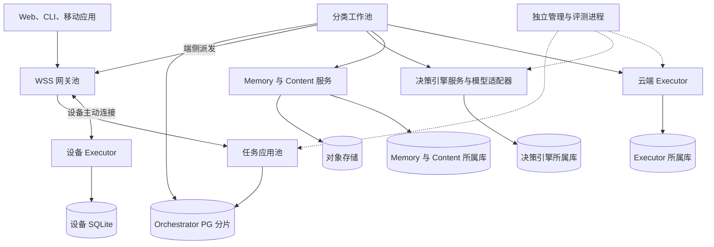

# 部署容量与生产运行

生产从首版采用分布式装配，开发阶段提供单进程和本机多进程两种运行方式。逻辑 owner 不绑定一台永久存活的机器；Task 固定 owner 与数据库权威，服务进程可以接替。

本章定义参考部署及其待验证目标。服务器数量、吞吐和延迟必须通过测量决定，不从注册用户数推算未经测试的配置。

## 技术基线

| 范围 | 本方案选择 | 选择理由与代价 |
| --- | --- | --- |
| 内核与默认宿主 | Go，初期同仓一个 module | 便于统一持久接口和设备宿主；承担跨语言 SDK 合同维护 |
| 应用与扩展 SDK | Go、TypeScript；其他语言通过公共协议 | 前端与服务接入使用同版类型；不强制第三方采用 Go |
| 云端权威存储 | PostgreSQL 分片，显式 SQL 与短事务 | 将业务事实和 Job 共提交；承担扫描、锁竞争、索引与分片运维 |
| 设备执行账本 | SQLite，单写队列、WAL、耐久配置 | 支持本机恢复；不自动成为云端 Task 权威 |
| 大材料 | 对象存储与准确 ContentRef | 减少消息和数据库正文压力；必须处理发布与介质写入不原子 |
| 端云与内部传输 | WSS、gRPC；同进程直接接口 | 支持交互与独立部署；承担流控和恢复协议 |
| 身份配置与观测 | 平台适配接口，结构化日志与 OpenTelemetry | 接入公司平台并保持独立运行；遥测不替代业务账本 |
| 示例应用 | React、TypeScript 与受信 Renderer | 验证真实接入；界面技术不进入领域合同 |

实际依赖版本、构建器、镜像和供应商配置在实现时经过合同测试后锁定，不在设计文档中猜测“最新稳定版本”。初版不引入必需的独立消息、缓存或协调集群；测量证明数据库方案不足后再比较引入成本。

## 参考生产拓扑

图中数据库表示逻辑所属存储，允许在明确声明的隔离范围内共用物理集群；不表示所有库共享事务。管理与评测隔离运行，避免候选代码或大批实验争抢在线控制资源。

可打开[生产部署图](assets/production.svg)查看。图展示默认角色，不指定实例数量，也不证明跨区故障目标已经达到。

| 进程角色 | 责任 | 故障后恢复依据 |
| --- | --- | --- |
| 连接网关 | 身份绑定、路由、流控和变化提示 | 客户端原命令、业务查询与新快照 |
| 任务应用 | 接纳输入、准入、控制和完成事务 | 原 PG 分片的 Task、Command 与 Job |
| 分类工作池 | 模型、工具、核对、内容与后台工作 | 原 owner 的阶段记录和 Claim |
| 执行宿主 | 资源门禁、隔离运行与真实效果 | 所属 PG 或设备 SQLite 的 Attempt 与 Effect |
| 管理与评测 | 安装、迁移、实验与批准 | 准确版本、批准与实验记录 |

## 分片与发现

新 Task 由受信发现选择可用 Orchestrator。客户端或应用 owner 首次发送前保存映射及原命令。一个用户可以有多个 Task owner；任务列表根据受信来源目录聚合，不能只扫描某一条连接。

原任务 owner 保持不变。扩容通过给新任务分配新的 owner 或增加原 owner 的服务副本完成。物理数据库迁移可以保持 owner_id，但必须有停写、数据复制、旧写端隔离和映射代次切换的专项流程；第一版不提供自动在线跨分片任务迁移。

网关失效后客户端重连并查询原对象。业务实例发布优先重建内部绑定，不强制设备重新创建 Task 或换 owner。客户端丢失原待提交身份且目录无法恢复时报告未知，不能通过相似目标文本重新发送。

## 默认端云行为

设备只保存本机授权窗口、执行账本、资源门禁和待补传事实。设备 UI 的 Task 缓存不是完成权威。云端失联时，依赖新的云端裁决的工作等待；获准的有界离线行动遵守原窗口继续。

真正的离线自主目标需要单独启用设备 Orchestrator，并保存该设备自有 Task。它可以与云端委派协作，但不会因网络断开接管云端同一个 Task。两侧共享资料仍需用途与同步授权。

重连先恢复身份与版本、核对撤权和控制，再补传原效果与用量，最后开放新行动。双方按对象修订归并，不按设备时钟推断先后。

## 可用性与灾备

生产目标为单地域三可用区部署：单区故障下已确认账本 RPO 为 0，控制与查询恢复目标不超过 60 秒。整地域故障使用异地灾备；异地 RPO、RTO 必须在平台方案和演练后冻结，本文不默认异地同步。

这组目标要求同步提交、备用容量、故障检测和旧主隔离共同成立。数据库驱动返回成功、备份存在或 Kubernetes 重启了进程，都不能单独证明目标达成。

故障切换先阻止旧主和旧实例继续写，再允许新实例接替；恢复外部发送前先核对持久阶段和有限许可。对象存储耐久、密钥和身份服务也必须纳入故障域测试。

发布时停止新领取，完成短事务，保存正在处理的阶段并有限排空。超出排空期限的工作由原记录恢复；退出信号不证明 goroutine、沙箱或第三方动作已经停止。

## 容量模型与背压

在线连接、活跃任务、并发模型调用和外部工具吞吐是不同维度。容量实验必须分别测量，而不是以十万在线连接等同十万并发推理。

用于初步估算的关系是：稳定状态下，在途数量约等于到达率乘平均占用时间；若每秒接纳任务数为 λ、每任务平均数据库事务数为 k，则事务需求约为 λk，另加恢复与后台负载。该近似只适用于测得的稳定负载，不能代替尾延迟与突发测试。

每轮基准必须记录任务类型、决策次数、工具次数、真实数据库读写、事务与同步次数、WAL 字节、内容字节、模型等待、队列等待和核对成本。报告暖路径、冷恢复、取消与故障后积压四类结果。

当故障后可用处理率不高于新工作到达率时，积压不会收敛。系统必须降低新接纳、限制租户并发或暂时拒绝，而非无限扩大内存队列。已接纳任务的控制和核对优先获得保留容量。

每个阶段冻结队列上限、单租户额度、模型并发、设备并发、数据库连接数和超时。排队、等待授权和执行中分别展示。真实应用有成本或等待硬限制时，优先采用应用要求。

## 观测与排障

所有阶段关联 tenant、owner、Task、Decision、Operation、Command 和组件版本；日志不能默认包含正文。Trace 用于定位延迟，业务记录用于证明已接纳与实际效果。

重点指标包括接纳延迟、Job 年龄、控制传播延迟、unknown 效果的数量与时长、未结费用、旧 worker 提交拒绝、权限拒绝、内容清理残留、组件就绪失败、错误完成率和任务质量。未知数值必须显示未知，不按零统计。

每个告警必须指向负责方、原对象和恢复动作。例如“设备写入效果未知超过阈值”指向原 Operation 的 reconcile，而不是提示用户重新提交同样任务。

## 开发与平台接入

本机开发使用配置文件、静态发现、本机 PG、多进程启动脚本及模拟目标服务；可选容器编排。公司平台接口覆盖配置、发现、身份与密钥、时钟、健康、排空和退出，不在项目内重建公司控制平面。

本机故障注入验证合同，生产演练验证故障域与容量。缺少公司平台或供应商账户时记录未接入条件，继续无需外部依赖的工程切片；不得把模拟数据或单进程结果宣称为生产验证。
