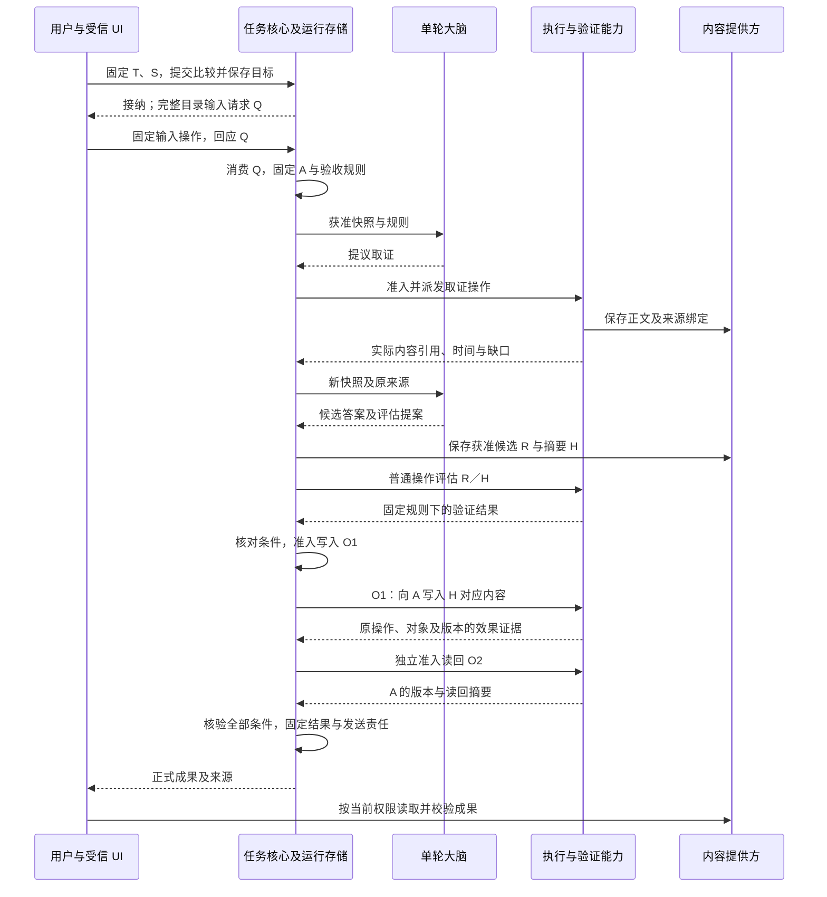
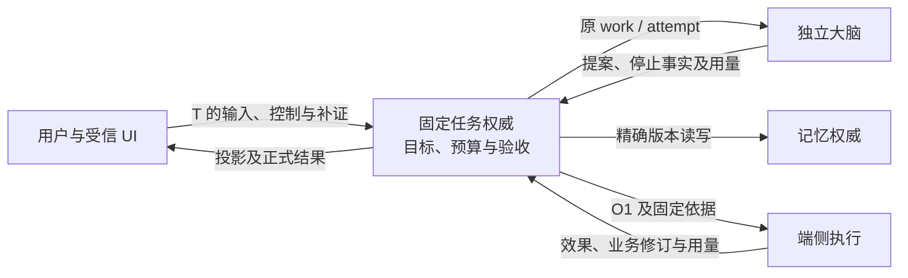

# 从用户目标到可核验成果

[整体设计](README.md) · [内容与来源](content-and-provenance.md) · [系统验证](validation.md)

本例先串联本地合同，再沿同一目标推演跨端控制、数据治理与完成后的责任，说明如何固定目标、使用证据并恢复未知效果。它是设计推演，能力名称及策略绑定用于解释职责，不是已安装配置、可发送的新消息或运行通过记录。完整规则分别由[核心验收契约](task-kernel/storage-and-interfaces.md#acceptance-contract)、[大脑决策](brain-system/decision-policy.md)和[执行恢复](capability-and-execution/execution-and-recovery.md)定义。

## 1. 场景、范围与前提

用户要求：“核实项目 X 已发布的版本 V甲 与 V乙 有什么变化，附来源并保存为 A.md；先问我放在哪个目录，再读回确认。”用户通过完整的目录输入请求即可作答，无须查看执行中的截图或候选答案。应用、UI、核心与领域权威位于同一受信宿主；联网取证经执行能力，调用云模型时仍由本地适配器管理原调用。

受信任务策略支持这类有限目标，固定版本及比较范围、来源要求、语义评估规则、保存目标和读回规则；准确声明须覆盖取证、保存及读回能力。身份、预算、持久交接、内容保留与当前用途依据必须齐备，缺失时沿对应领域拒绝或等待。这些是场景的设计前提，不表示具体适配器已经交付。

本例不依赖跨端委派、独立远程大脑、自动记忆提取或中间成果预览。首个机制核对也可将目标收窄为“保存用户已提供的固定内容并读回”，保留相同的准入、执行与恢复交接；联网问答质量仍须单独按 V1 验证。

## 2. 谁把目标固定为条件

核心接纳任务 T 时保存原提交 S 和已安装策略版本。保存目录未确定，条件集保持 draft；大脑可建议澄清，核心建立输入请求 Q。UI 可靠转交用户回答，核心消费后将路径规范化为准确目标 A，固定条件集。用户回答目录不签发写权限，也不授权保存长期偏好。

| 固定条件 | 依据及运行中需要取得的证据 | 裁决方 |
| --- | --- | --- |
| 比较对象与答案要求 | 原目标指定的两个版本；答案须覆盖规定差异，引用实际取得内容并注明时间／缺口 | 策略指定的语义评估能力返回绑定答案版本的结果；核心核验适用性 |
| 保存位置 | 用户对 Q 的已消费回答及资源规范化结果 A；不能由后来提案改成 B | 核心固定目标，授权与执行端在使用时复核真实资源 |
| 保存内容 | 保存“通过上述固定规则评估的本次答案”；候选答案形成后绑定其精确版本与摘要 H | 核心核对评估结果与内容绑定，准入写入时冻结原操作参数 |
| 读回一致 | 原写入对象及版本可关联，读回摘要等于同一 H | 驱动提供事实；固定本地验证规则核验 |
| 完成限制 | 相关操作已收束，无仍能改写成果或违反约束的未决行动；当前来源、保留及披露条件成立 | 核心提交完成；结果字节可用性由接收方另行确认 |

条件固定的是用户约束和验证规则。尚未生成的答案不需要预先拥有摘要；策略只能按已固定的规则从本任务正式事实解析预期内容，不能让大脑任意填写“预期值”。候选答案 R 及其摘要 H 保存后，语义评估也绑定 R／H；写入 O1 准入时再次核对并固定同一内容。此后修改答案产生另一个候选和验证结果，不能沿 O1 改写参数，也不能让已开始写入的目标随最新候选漂移。

例如 R2 的语义评估通过，不能拿 R1 的评估或 R1 的读回去完成 R2。原写入尚可能生效时，即使 R2 更好，也先核对原操作；重新生成不解除旧效果责任。预期值的定义及解析约束见[验收契约](task-kernel/storage-and-interfaces.md#acceptance-contract)。

## 3. 正常交接

图以一个任务的业务事实为视角，箭头表示处理及结果交接。每个行动仍通过核心准入、持久工作与处理端当前授权检查；图省略这些重复检查和消息 ACK。内容提供方负责获准字节，领域账本分别保存自己的决定。

图中的连续行动之间仍有持久事实驱动的新一轮提案或规则决策，不能由执行驱动把它们合并为隐式长流程。候选内容保存及评估本身也须分别满足用途和预算；内容或验证能力缺席时保存缺口，不在核心提交事务里隐含网络、模型或文件调用。

| 可以确认的时点 | 依据与后续责任 |
| --- | --- |
| 任务已接纳 | 核心保存 T、S、策略及首次工作；应用不以消息回执代替 |
| 用户输入已生效 | 核心原子消费 Q；UI 用固定父子操作恢复，不凭表单消失推断 |
| 内容可引用 | 提供方按[内容交接](content-and-provenance.md)确认耐久与有限保留；取得引用不等于已读到字节 |
| O1 已产生相应效果 | 执行记录与原操作的可信证据；授权消费或外部请求已发出都不充分 |
| 任务已完成 | 核心固定条件均满足，成果、来源与在途限制核验通过；保存正式结果及发送责任 |
| 成果已完整取得 | 接收方取得所需获准字节并校验；仅收到 task.result 或 content_id 不充分 |

## 4. 把异常放回同一条链路

最关键的中断发生在 O1 已写入、答复丢失，随后用户撤销写权限并取消 T。核心保存取消并停止新目标工作，执行端沿 O1 核对，获准迟到事实仍可保存；取消终态与效果是否核清分别表达。

| 异常 | 谁继续、凭什么继续 | 不能据此推导的结论 |
| --- | --- | --- |
| Q 已消费但输入答复丢失，用户关闭 UI | UI 查原子操作，恢复原父操作结果；本端关闭意图继续生效 | 关窗不撤回输入，不重新询问并重复消费 |
| 候选已保存，来源在评估或派发前失效 | 内容／来源权威返回当前限制，核心拒绝依赖该来源的新行动；按固定策略补证或结束 | 历史评估 pass 不产生今天的使用权 |
| O1 响应丢失，原记录暂时查不到 | 执行端用原调用及有限核对责任继续；核心保留未知效果和预算 | 未找到不证明未执行，不能新建替身写入 |
| 写权限撤销，仍有核对权 | 沿原 O1 查询；独立读回是否允许另行判断 | 核对权不包含重新写入、任意读回或披露正文 |
| T 已取消后 O1 成功事实迟到 | 核心保存获准事实及用量，不重开目标工作；所需开放项全收束后更新 effects_pending | 成功事实不把 cancelled 改回 completed |
| 正式结果仍在，引用内容已经到期或被禁用 | 核心返回原结果允许披露的事实，内容方返回缺口；应用分别展示 | 不能重新执行任务来伪装恢复原成果 |

同一场景的验证方法见[系统验证场景](validation.md#scenarios)，模块内完整状态和恢复规则继续以所属专题为准。

## 5. 把同一任务放到不同端点

前四节保留本地基线。跨端配置沿用相同的 T、S、O1 与验收条件：用户组装时固定一个任务权威，可以将核心放在端侧或云侧；大脑、记忆和执行可以独立部署。任务权威保存目标、控制与验收事实，各领域保存自己的原调用及回执。默认交接路径、恢复引导和具体类型见[跨端领域合同](endpoint-cloud-protocol/domain-profiles.md)。

图以任务权威在云侧、文件执行在端侧为例。箭头表示领域交接；不同位置不增加任务写者。身份恢复及当前许可检查适用于每一条需要访问或行动的路径。

| 本例扩展 | 正常行为 | 中断后的继续者与限制 |
| --- | --- | --- |
| 用户在 O1 派发后暂停 T | 核心提交控制修订，受控子树停止后续目标行动；已实际开始的有限单次动作可结束 | 端侧执行已知暂停且尚未开始时拒绝启动；“可能已发送”只保留未知责任。核心继续保存获准事实与费用，恢复前不提交正常完成 |
| 暂停期间补目录输入或读回证据 | 核心按原 Q 消费输入，按独立补证操作验证来源与固定条件 | UI 查询原输入／补证回执。新增预算不解除暂停，不延长期限；仅用户明确恢复且所有屏障解除后才能继续 |
| 用户调低预算 | 核心以预期预算修订核对已结算、预留和子任务义务，原子接受或拒绝 | 未知 O1 的预留继续占用；不能靠调额把未知用量清零。外部已接纳委派的原上限保持固定 |
| 另一台设备接续查看 | 获准任务目录发现 T，订阅变化并读取当前投影；本端呈现意图独立保存 | 中间预览带精确内容／来源和依赖输入绑定，取得并校验必需预览后才允许相关回答；读取失败显式显示缺口 |
| 内部 Agent 代为处理比较子问题 | Peer 保存 D，向原任务权威请求受信子接纳；核心一次提交 C、S、受限配置和父预算分配 | 接纳答复丢失沿同一 D/C/S 查询。远端大脑不另建任务权威；外部 Agent 的普通追问经持久输入交接，扩权另走明确授权 |
| 云任务权威暂不可达 | 端点在有效许可、预算、版本及有限离线证明内完成已接纳工作 | 端点保存原事实与恢复责任，不接纳独立的新目标。端侧权威配置则可在全部依赖均为本地且获准时接纳离线任务 |

暂停与完成按核心提交顺序裁决：完成先提交，暂停不逆转终态；暂停先提交，迟到成功先保存为事实。取消、截止时间与授权到期继续推进，不能因为暂停而冻结。

## 6. 完成后的数据与改进责任

T 成功提交后，如果用户事先为该任务类别开启自动记忆提取，核心按原 T 和终态修订保存一次提取责任，使用独立用户额度、当前来源与记忆权限创建提取任务。崩溃重启仍沿同一触发身份恢复；未开启、失败、取消或状态未知的任务不自动提取。提取失败不回写 T 的成功事实，候选长期记忆仍按记忆准入规则验证。

当用户要求删除本例资料，治理流程列出任务材料、记忆／索引、模型输入副本、UI 缓存及评估样本的受管持有者，分别记录禁止新使用、物理清理与残留。离线端点及备份可能长期待清理；外部服务和用户导出只报告实际承诺。数据要求强期限删除而目标无法满足时，在复制前拒绝该路径。

改进候选仍由显式流程产生。测试通过不签发批准；人在精确版本和有限批次上批准后，发布管理可自动交接、验证激活、查询逐节点回执，并在撤回后关闭新使用。仅有独立有效预批准且兼容性成立的旧版本可以自动回退；普通升级先排空，有状态格式在线无缝迁移留在后续范围。完整行为分别见[记忆触发](memory-system/README.md)、[内容治理](content-and-provenance.md)及[改进与发布](observation-and-improvement/README.md)。
