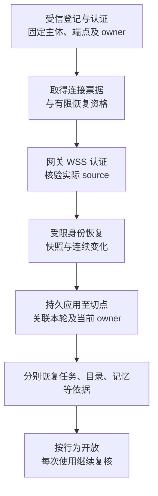

# 跨端领域合同与恢复引导

[协议总览](README.md) · [身份合同](../identity-and-authorization/contracts.md) · [交付与恢复](recovery-and-control.md) · [契约资产](schemas/standard-registry.json)

本页规定各领域跨端交接共同遵守的路径、引导与恢复规则。领域负责人继续裁决许可、任务、内容或发布事实；网关只认证路由与转发，消息交付只保存交接责任。合同已纳入未发布的 v1 草案；是否可以启用某项能力，还取决于实现、平台与运行验证。

## 1. 默认路径与职责

身份、准确目录、任务控制、远程大脑、记忆、委派、数据治理和发布管理统一使用经获准网关的 WSS 领域消息。HTTPS 保留认证接入、单次连接票据、恢复凭据引导和大内容字节传输。同进程调用可以省略序列化，但保留相同的身份、原操作、接纳、结果和恢复语义。

| 选择 | 理由与主要代价 | 改变选择的条件 |
| --- | --- | --- |
| 领域交接复用 WSS | 复用源端点核验、出站连接、可靠交付与恢复容量；端侧权威无需暴露公网 HTTP 服务。须定义首次恢复资格、领域作用域和逐行为门禁 | 专属 HTTPS 适配器能实现完全相同的合同及一致性用例，且部署确有独立接入需求时可另行提供；不能只映射普通 RPC |
| 字节与管理事实分开 | HTTPS 传输已有内容或制品；WSS 固定保留、引用、关闭及原管理命令。上传成功只确认该内容提供方保存字节 | 新传输必须保留完整性、授权、驻留和恢复语义；连续媒体及分片续传仍是后续范围 |
| 领域分别裁决 | 各领域保留自身账本与版本，调用方沿原身份恢复；不需要跨库全局事务 | 共库可以优化提交，仍须保持接口的成功含义和责任归属 |

端侧内容引用不保证云端能够读取其 HTTPS 地址。允许远端保存时，可以生成获准副本并登记持有责任；禁止原文离端时，在端侧处理，只传获准产物及其必要来源。连来源元数据或路径上的缓存也不允许时，拒绝该交接。不能用默认网关路径绕过驻留约束。

## 2. 首次授权恢复

初次恢复不能依赖尚未取得的完整业务许可。受信登记或组装先固定用户、端点、账本、活动所有者、宿主主体和身份权威，并建立仅宿主可持有的有限恢复资格。资格取得与续期使用已认证接入面，具体编码由[身份跨端合同](../identity-and-authorization/contracts.md)定义。

恢复请求仍携带真实的 `authorization.grant_ref`。身份权威直接根据自己的当前记录、接入认证和端点绑定裁决该资格，无需调用端先完成同一份授权同步。连接票据只建立连接；票据和恢复资格分别保存、验证和到期。

图表示一个端点的一轮引导。箭头是先后依赖；“放行”只涉及该轮已经证明成立的行为。

| 阶段 | 允许的交接 | 拒绝或依据不足时 |
| --- | --- | --- |
| 尚未认证 | 现有受限 `core.hello` | 结束连接，不接纳领域消息 |
| 连接成立、领域尚未恢复 | 已安装且独立验证通过的有限恢复请求、获准控制与原回执核对 | 只限制对应行为，不能把 `core.resumed` 当作行动资格 |
| 身份恢复完成 | 按当前许可取得准确声明、来源证明及领域快照；各领域仍独立判定 | 缺页、旧 owner、过期证明或连续性缺口使相关行为保持受限 |
| 领域条件齐备 | 相应新行动、内容使用或管理命令 | 启动前再次检查控制、许可、来源、版本、预算及期限 |

恢复资格只覆盖本端点获准的恢复对象及最小控制记录，不允许工具行动、任意正文读取、签发业务许可或代用户批准。Agent／插件不得借宿主恢复通道冒充用户。恢复能力不得由未知网络类型临时安装；普通 UI 输入不能生成恢复资格或授权批准。

本人管理同样不能依赖尚未创建的业务许可。`POST /harness/v1/management-grants` 由当前本人强认证的受信宿主取得短期、不可委派的管理资格，限精确端点、owner、账本及有限类型。它允许进入明确管理流程，不替用户作出确认决定，也不授予普通工具行动或正文读取权。请求内容与当前认证分别核验；Agent／插件不能获得或续期此资格。

## 3. 作用域、调度与业务门禁

可靠消息先依据已安装类型及受信业务关联解析作用域，再核对 `delivery.scope` 和流注册。任务、原操作及 surface 继续使用已有作用域；授权恢复集合、目录、记忆视图和获准目录集合使用其领域规定的作用域。作用域中的对象 ID 不提供访问资格，也不能由调用方随意换一个新 ID 绕过旧对象恢复。

| 交接性质 | lane 与处理规则 |
| --- | --- |
| 只读原记录、快照页或事实核对 | `recovery`；只读核对不产生新行动、许可或批准 |
| 暂停、恢复、取消、撤权、确认消费、关闭及管理变更 | 按注册的 `control`／`work` 可靠交接，带原操作身份；有持久业务效果的请求不能伪装成只读恢复 |
| 大脑／执行／委派接纳和事实回送 | 按所属消息注册；`work` 中可以有获准事实，禁止新行动时仍可接收这些事实 |
| 持久建立快照／订阅／保留责任 | 作为有原命令身份的业务交接；读取既有页面及查询原命令与之分开 |

lane 只决定调度与保留容量。它既不授予管理权限，也不自动关闭整个业务类别。响应继承原请求作用域；事件必须可解析到预先保存的原调用、订阅或管理关联。类型、作用域解析、Schema 和处理器必须共同安装并通过一致性验证。

## 4. 领域分工与权威定义

字段只在所属模块合同及对应 Schema 定义；下表用于定位交接和判断成功强度。共享的精确来源、证明引用等线值见 [domain-common.schema.json](schemas/domain-common.schema.json)。

| 领域 | 必须完成的交接 | 权威文档／资产 |
| --- | --- | --- |
| 身份与授权 | 主体及 owner 绑定、许可解析、授权使用、受信确认、快照连续恢复与应用回执、离线证明 | [身份合同](../identity-and-authorization/contracts.md)、[identity.schema.json](schemas/identity.schema.json) |
| 准确目录与执行 | 不可变声明、当前发布与实例依据、原调用接纳、带业务修订的事实与可信累计用量、原取消答复及管理回执 | [执行合同](../capability-and-execution/catalog-and-contracts.md)、[execution-control.schema.json](schemas/execution-control.schema.json) |
| 任务控制 | 暂停／恢复、预算调整、补证、原控制和取消答复查询；控制决定、子树传播与实际效果分开 | [内核接口](../task-kernel/storage-and-interfaces.md)、[task-control.schema.json](schemas/task-control.schema.json) |
| 独立远程大脑 | 原 work／attempt、领取资格、固定输入与来源、原调用接纳／查询／取消、停止事实及费用回送 | [大脑调用](../brain-system/contracts-and-runtime.md)、[brain.schema.json](schemas/brain.schema.json) |
| 记忆与获准视图 | 精确版本访问与修改、原命令核对、固定视图切点、连续页、关闭与分项应用回执 | [记忆接口](../memory-system/contracts.md)、[同步](../memory-system/synchronization.md)、[memory.schema.json](schemas/memory.schema.json) |
| 来源、内容与受管副本 | 当前来源证明、有限引用保留、持有者登记、关闭传播、停止使用／物理清理／残留回执 | [共同来源](../content-and-provenance.md)、[governance.schema.json](schemas/governance.schema.json) |
| 用户交互 | 获准任务与 surface 目录、订阅、中间投影及必需预览绑定；管理操作沿所属领域裁决 | [交互接口](../application-and-interaction/contracts-and-storage.md)、[interaction.schema.json](schemas/interaction.schema.json) |
| Agent 协作 | 原委派、单一权威下的受信子接纳、权限／预算收缩、结果用量、控制及普通外部输入交接 | [协作接口](../coordination-and-cloud/peer-contracts.md)、[coordination.schema.json](schemas/coordination.schema.json) |
| 批准与跨节点发布 | 精确批准与活动有效依据、原管理交接、逐节点准备／激活／停用／回退及回执 | [改进合同](../observation-and-improvement/contracts.md)、[扩展合同](../extensions-and-runtime/contracts.md)、[release.schema.json](schemas/release.schema.json) |

原 `task.submit` 不接受任意远程服务端配置。跨端内部子接纳由协作合同认证原 D、父预留与子配置，再由原任务权威在创建事务内采用；远端协作端点和 Brain 不成为第二个任务写者。

## 5. 共同的正常链与恢复

每次有副作用的交接先在发起方保存固定意图、目标、原操作和后续责任；处理方保存接纳决定后才回复。处理方异步推进时，接纳、结果及当前状态分别可查询。响应或消息回执丢失不生成新操作，也不修改原载荷期限。明确的拒绝须与“提交未知”分开。

| 异常 | 必须保留的事实与下一步 |
| --- | --- |
| 接纳答复丢失 | 发起方查原命令；处理方返回原决定或未决缺口。一次暂未查到不证明未接纳 |
| 事实乱序或重复 | 在固定生产者及对象范围内比较业务修订；旧事实不覆盖新投影，同修订异内容记录冲突；流 seq 不替代业务修订 |
| 取消答复超出消息保留窗口 | 查询领域保存的原固定答复；未固定、无权、已清理和恢复缺口分别返回。当前效果不能重建过去答复 |
| 撤权或来源关闭后旧消息待投递 | 复核正文的当前披露资格；最小控制事实可按独立依据继续。不得修改旧消息正文后冒用原 message_id |
| 暂停后旧提案或子结果到达 | 保存获准事实和费用；旧决策资格不能继续准入，父恢复不解除子任务自身的其他屏障 |
| 活动版本批准过期或撤回 | 关闭该版本的新使用并保存逐目标停用责任；在途效果另核对，停用和旧版恢复分别确认 |
| 来源资料必须删除而旧操作仍未决 | 删除正文并保留获准的最小原关联及缺口；查询不得伪造已失去的原证据 |

证明引用只提供定位和绑定，不能单凭引用字符串放行。接收者须向固定受信权威解析或验证可互操作证明，核对对象、版本、主体、用途、接收方和有效期；引用解析不通、循环依赖或缺字段时报告依据不足。

## 6. 草案资产与验收

v1 尚未发布，本次直接同步修订标准注册表、公共作用域、领域 Schema、示例和校验器，不保留旧设计草案的兼容分支。新增 profile 必须提供正常接纳、原命令恢复和关键拒绝／缺口例子；不能只登记类型名称而没有具体载荷。

静态校验验证结构、关联、修订、作用域和已表达的不变量。跨节点持久性、真实停止、隔离、离线防回滚、处理位置和实际费用仍须运行验证。最少验证本地、云任务权威加端侧领域、端侧任务权威加云端领域三种配置，并以独立实现替换大脑、记忆和执行；完整矩阵见[系统验证](../validation.md)。
