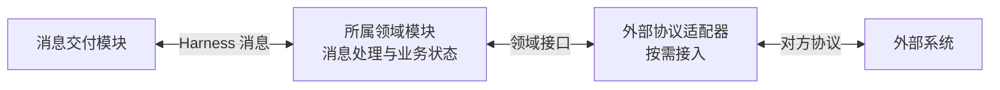
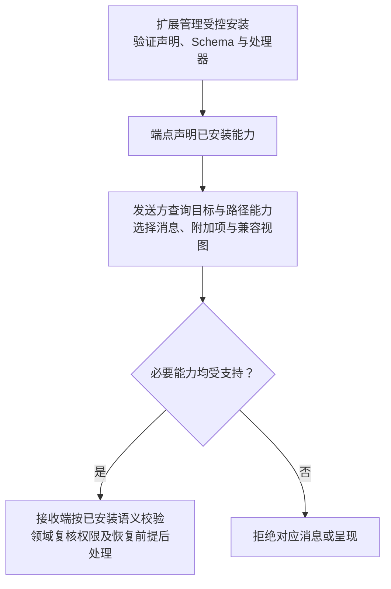

# 协议扩展与兼容

[总览](README.md) · [公共信封](wire-format.md#envelope) · [示例声明](examples/extension-manifest.json)

扩展使新的领域语义和视图能够复用共同的交付、授权与恢复规则。普通工具通过能力注册与 `harness.execution.invoke` 接入，标准表单使用现有 UI 模型；只有现有模型无法表达需求时，才增加协议类型，避免工具数量直接变成协议版本和恢复分支的数量。

本篇区分三个保证：受控安装提供可信的 Schema 和处理实现，通信协商选出双方及路径可以处理的形式，领域模块核对本次使用的权限与业务前提。能力声明和结构校验都不能代替后两项。v1 仍为未发布草案，扩展管理、SDK 和跨实现互操作尚待验证。

<a id="selection"></a>
## 1. 先确定扩展落在哪一层

| 需求 | 使用方式 | 选择依据与代价 |
| --- | --- | --- |
| 新增工具或能力，已有调用模型足够 | 复用 execution.invoke 与能力参数 | 工具目录独立演进；执行事实、查询及取消继续沿用既有模型 |
| 新的业务交互，已有消息族无法表达 | 新 type、type_version 与 payload Schema | 可以定义独立语义，同时须承担请求／响应、权限、作用域及恢复契约 |
| 多种业务消息共享的附加信息或处理约束 | extensions 中的命名空间项 | 避免修改多个载荷，但必要约束须得到所有受约束节点支持 |
| 标准文档模型无法表达的 UI | 新 view.type、version 与 data Schema | 展示能力独立演进；提供方须处理兼容视图及交互信息的完整性 |

这些选择针对不同的契约对象，可以组合使用：一次新业务消息也可以带追踪附加项并产生自定义视图。具体业务参数属于 payload，跨消息的追踪或数据处理约束属于 extensions，界面数据属于 view；不能把业务参数搬到附加项中绕过原消息的结构和版本约束。

示例包中的自定义相机消息用于展示消息类型扩展格式；实际拍照能力通常可复用已有执行消息，无须照搬该类型。

<a id="external"></a>
### 外部协议按需适配

原生 Harness 消息由所属领域模块直接处理。接入采用其他协议的系统时，适配器放在该领域模块与外部系统之间，负责调用、事件和错误的映射。



图中适配器只映射调用、事件和错误，领域模块继续保存业务决定并承担恢复责任。适配须保留身份、权限、操作关联及结果语义；外部 RPC 返回不能直接映射为效果已确认。对方缺少查询或取消能力时，适配器如实报告限制，由领域模块按既有契约决定是否接纳，并在结果不明时保存缺口，不能以重新调用来掩盖未知效果。

<a id="lifecycle"></a>
## 2. 安装确定语义，协商确定可用范围

安装与通信分开，使陌生网络消息不能改变本地可执行语义。下图表示从安装到一次发送的检查顺序；节点是处理阶段，拒绝只针对缺少必要能力的消息或呈现：



| 兼容对象 | 不支持时的处理 |
| --- | --- |
| 消息类型、版本与类别 | 请求目标须支持 request，源端须支持 response；事件接收方另行声明。所需能力不齐则拒绝 |
| 附加语义 | 未知可选项可由业务处理器忽略，透明中继保留；必要项须由所有受约束节点支持，见 [required 规则](#metadata) |
| UI 视图 | 提供方可先生成兼容 fallback，再检查所选视图；无兼容模型则报告不支持，见[视图降级](#views) |

扩展管理模块在安装时验证声明、处理器及所引用的本地 Schema；声明文件本身不执行代码。通信阶段只选择已安装能力，陌生消息不能触发下载 Schema、加载代码或扩大权限。网关与最终目标的能力分别查询，不能以网关支持代替目标支持，具体消息见[能力协商](transport.md#routing)。

扩展处理器还须提供确定的作用域解析与恢复规则，落实共同的[作用域与流注册约束](transport.md#stream-registration)。作用域解析须核验真实业务关联，自报作用域不授予权限，也不能绕过恢复限制；缺少可验证规则时不接纳其可靠消息。声明中的恢复说明由处理器兑现，不能把一段说明文字当作恢复机制已实现。

SDK 可帮助生成和校验扩展，第三方也可依据规范独立实现。

<a id="metadata"></a>
## 3. 附加语义按 required 决定兼容行为

`required` 表达本次消息是否要求理解该附加语义。可选追踪允许旧端点继续处理；影响授权、隐私或执行含义的约束必须为 true，避免不支持的节点忽略关键条件后继续执行。声明中的 `required=true` 是该附加项的最低要求，消息不能改为 false；它不表示所有消息都必须携带该项。

```json
{
  "extensions": [
    {
      "name": "com.example.trace",
      "version": 1,
      "required": false,
      "data": { "trace_id": "00000000-0000-4000-8000-000000000001" }
    }
  ]
}
```

接收端先校验信封及附加项结构并拒绝同名重复，再按每项的 name／version 查询已安装能力，依次应用以下规则：

| 判定顺序与情况 | 行为 |
| --- | --- |
| 已安装，但声明要求 true、消息却为 false | 拒绝，发送方不能降低必要性 |
| 已安装，必要性满足声明要求 | 校验对应 data Schema 并落实约束；格式错误不能因可选而忽略 |
| 未安装该 name／version，消息为 required=true | 拒绝，不能降级执行 |
| 未安装该 name／version，消息为 required=false | 业务处理器可忽略，透明中继保留原消息中的该项 |

同名不同版本也属于重复。支持范围覆盖所有受该语义约束的节点：只透明转发可选追踪的中继不必安装追踪实现；若附加项禁止云端保存，负责存储的中继必须理解并执行，不能交给最终目标补救。无法确认受约束节点支持时，本次消息不能沿该路径使用此必要语义。

例如示例包中的 `com.example.data_policy@1` 要求 `allow_cloud_processing=false`。发送方须选用能落实该限制的路径，处理端执行限制；Schema 只能验证字段为 false，不能证明云端没有处理数据。授权与记忆还须完成[v1 范围中列出的跨端载荷](README.md#scope)，不能仅加一个策略附加项就宣称已经支持领域同步。

<a id="views"></a>
## 4. 视图降级由提供方显式生成

视图结构为 `{type, version, data}`，标准 `harness.ui.document@1` 覆盖文字、Markdown、内容、表单与动作。发送前提供方查询渲染端 views 能力；原视图不受支持时，只有提供方能生成并验证兼容模型才采用 fallback。声明中的 fallback 只给出目标类型与版本，不负责转换 data，不能保留原 type 却替换成另一套数据。

没有兼容模型时报告不支持。UI 提供方与渲染端还须支持所用请求、响应与事件；必要消息能力缺失时拒绝该交互，具体要求见[任务与 UI](task-and-ui.md#presentation)。完整输入恢复遵守[快照契约](task-and-ui.md#view)，授权或必需输入界面不能降级为普通文字后宣称已恢复交互或已确认。

Markdown 使用安全展示子集，不执行内嵌脚本、原始 HTML 或任意远程内容加载；外部内容通过受控引用取得。

<a id="version"></a>
## 5. 草案统一修订，正式发布后按版本演进

当前 v1 尚未发布，消息、公共字段、Schema 和示例直接同步修订，全部标准类型使用版本 1；不为此前设计草案保留重复接口或兼容分支。正式发布后冻结同版结构与语义，使用独立类型版本，使业务消息和视图分别演进。代价是普通 payload 新增可选字段也要发布新类型版本，发送方须继续选择目标支持的版本。

| 对象 | 命名与版本规则 |
| --- | --- |
| 标准消息 | 保留 `harness.*`，如 harness.task.submit |
| 第三方类型 | 发布方控制的反向域名命名空间，如 com.example.camera.capture；示例域名仅用于文档 |
| 协议版本 | 公共信封与核心会话语义的版本，当前为 1 |
| 类型版本 | 每个 type 独立的正整数；发布后结构和语义冻结 |
| 附加项／视图 | 各 name 或 type 独立发布，匹配已安装 Schema 与实现 |
| 声明文件 | manifest_version 表示声明格式，v1 为 1，不替代消息类型版本 |

正式发布的同名同版本对应相同 Schema 与语义，本地安装记录固定内容摘要，不能同版本换包；命名空间冲突在安装时拒绝，网络声明不取得名称所有权。方案验证环境则整体更新同一份草案及其校验资产，不混用不同草案的 Schema 和处理器。

正式发布后，新增可选附加信息可走 extensions；其他结构变化发布新类型版本，旧版本继续可选。附加项同样有自己的版本，不能借新增可选字段改变已发布 payload。

<a id="manifest"></a>
## 6. 声明字段与资产查阅

标准消息与第三方扩展使用同一[声明结构](schemas/extension-manifest.schema.json)，标准声明见[注册表](schemas/standard-registry.json)。扩展包至少提供声明、Schema、合法及非法例子、恢复用例。

| 字段 | 约定 |
| --- | --- |
| manifest_version、namespace、protocol_versions | 声明格式版本、发布方命名空间与兼容框架版本 |
| messages[].type、type_version、kinds | 类型身份及 request／response／event；第三方不能注册核心 control |
| payload_schemas | 各 kind 的本地 Schema 引用；request 同时定义 response |
| delivery、lane | 业务消息使用 reliable／ephemeral 及 work／control／recovery；核心会话另用 session。安装时审查，不能由单条消息自报；所有 request 都可靠交付，recovery 不引入副作用 |
| authorization_scopes | 所需权限名称；声明本身不授予权限 |
| side_effecting、operation_id | 副作用及操作标识要求；副作用请求必须可靠并带 operation_id |
| recovery | 重投、查询、取消和未知效果的说明；具体行为由处理器实现及一致性用例验证 |
| extensions | 附加项名称、版本、Schema 与 required 最低要求 |
| views | 视图类型、版本、data Schema 及 fallback 目标类型／版本；转换由提供方实现 |

授权处理还须根据业务参数复核动态资源与用途，仅检查静态 scope 名称不足以判定请求可执行。

| 示例资产 | 内容 |
| --- | --- |
| [extension-manifest.json](examples/extension-manifest.json) | 消息类型、可选追踪、必需数据策略及自定义视图声明 |
| [extension-message.json](examples/extension-message.json) | 自定义类型及追踪附加项的完整请求 |
| [example-extension.schema.json](schemas/example-extension.schema.json) | 示例载荷与视图结构 |

上述资产用于结构与关联校验；示例相机处理器仍须兑现“响应丢失后查询原操作、不重复拍照”的恢复约定。运行验证还须覆盖必要附加项不受支持、已知可选项数据非法、路径节点无法落实数据约束以及 fallback 丢失必需输入信息。静态校验与运行证据分别记录，完整分工见[契约校验](validation/README.md)。
